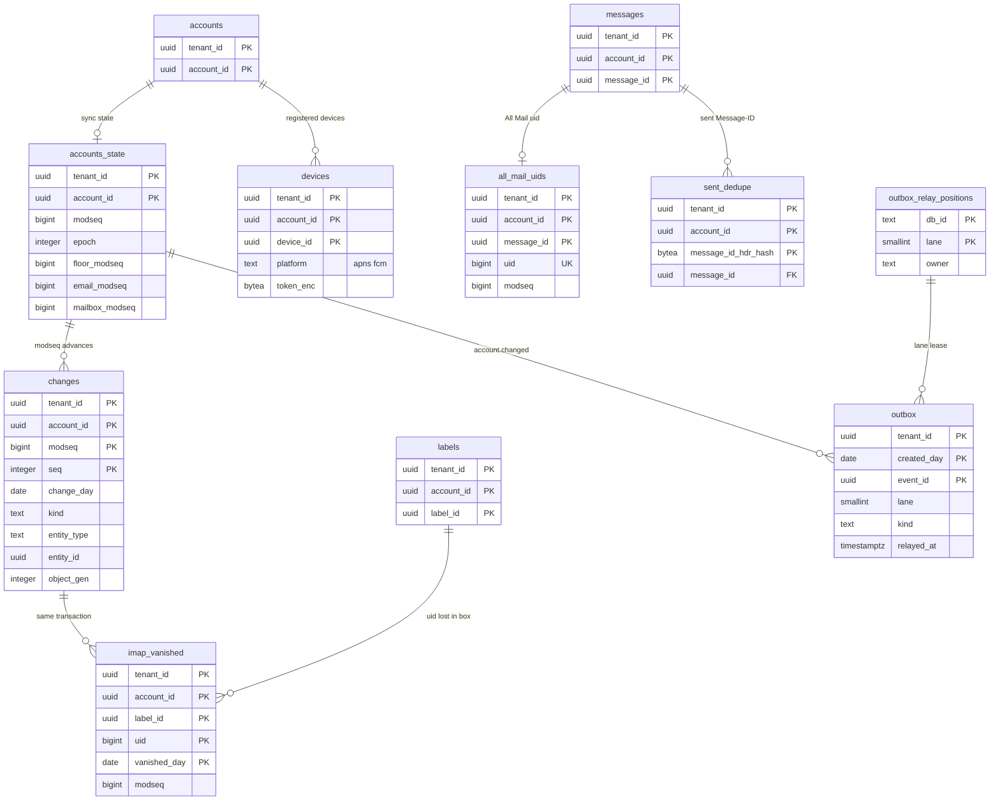

# Data model: change log・同期・outbox・端末

[data-model.md](../data-model.md) の一部。規約はそちらの 3 節に従う。振る舞いは [client-sync-and-protocols.md](../client-sync-and-protocols.md)（4〜7 節）と [mobile-and-push.md](../mobile-and-push.md)（5・6 節）を正とする。決定は [ADR-0006](../../decisions/0006-sync-protocol-jmap-imap-and-modseq.md)（`modseq` と change log）、[ADR-0039](../../decisions/0039-change-log-states-and-jmap-changes.md)（行・状態・`epoch`）、[ADR-0040](../../decisions/0040-imap-label-mailbox-mapping.md)（IMAP）、[ADR-0041](../../decisions/0041-jmap-extensions-and-mailbox-mapping.md)（役 `all`）、[ADR-0045](../../decisions/0045-push-payload-without-content.md)・[ADR-0046](../../decisions/0046-mobile-offline-scope-and-device-management.md)（プッシュと端末）。状態の文字列・ID・UID の形は [stores.md](stores.md) の 7・8 節。

| 表 | 置き場所 | 書く |
| --- | --- | --- |
| `accounts_state` | メールボックスのシャード `public` | `mailstore`（すべての変更のトランザクション） |
| `changes` | 同上 | `mailstore` |
| `imap_vanished`・`all_mail_uids` | 同上 | `mailstore` |
| `sent_dedupe` | 同上 | `mailstore`（送信の解放、`APPEND`） |
| `devices` | 同上 | `jmap-api`（`<Brand>Device/set`）、`push-notifier`（トークンの失効） |
| `outbox` | メールボックスのシャード・directory の `public` | 各サービスが変更と同じトランザクションで |
| `outbox_relay_positions` | 各 DB の `xt`（RLS の外。ADR-0007 の「outbox の読み出しの位置」） | `relay` |

## 1. ER 図

- `accounts_state ||--o{ changes`：1 つの変更のトランザクションは `modseq` を 1 つ進め、その `modseq` で 1 行以上を書く。
- `changes ||--o{ imap_vanished`：見える所属を失った UID を同じトランザクションで書く（同じ `modseq`）。
- `messages ||--o| all_mail_uids`：`SPAM`・`TRASH`・`SCHEDULED` を持たない間だけ 1 行（任意）。
- `outbox_relay_positions ||--o{ outbox`：`lane` で論理に結ぶ（外部キーを張らない）。

## 2. 表

### 2.1 `accounts_state`

| 列 | 型 | NULL | 既定 | 説明 |
| --- | --- | --- | --- | --- |
| `tenant_id`・`account_id` | `uuid` | NOT NULL | — | |
| `modseq` | `bigint` | NOT NULL | `0` | アカウントの最後の `modseq`。変更ごとに 1 進める（切り替えで 2^24 跳ばす） |
| `epoch` | `integer` | NOT NULL | `1` | 大阪への切り替え・戻しで 1 進める（[ADR-0039](../../decisions/0039-change-log-states-and-jmap-changes.md)） |
| `floor_modseq` | `bigint` | NOT NULL | `0` | 残っている change log の最も古い `modseq`。分割を落とすたびに上げる |
| `email_modseq`・`thread_modseq`・`mailbox_modseq`・`submission_modseq`・`vacation_modseq` | `bigint` | NOT NULL | `0` | 型ごとの最後の `modseq`（JMAP の型ごとの状態。[client-sync-and-protocols.md](../client-sync-and-protocols.md) の 4.2 節） |
| `modseq_jump_floor` | `bigint` | NULL | — | 最後の切り替えで跳ばした範囲の上の端 |
| `epoch_pending` | `boolean` | NOT NULL | `false` | 切り替えの後、最初の書き込みで `epoch` を進める印（切り替えの手順で全行に立てる） |
| `updated_at` | `timestamptz` | NOT NULL | `now()` | |

- キー：PK `(tenant_id, account_id)`。変更のトランザクションは最初にこの行を `FOR UPDATE` で取る（アカウントの書き込みの直列の点）。
- CHECK：型ごとの値 `<= modseq`、`floor_modseq <= modseq`、`modseq < 2^63`。`modseq`・`epoch` を下げる更新をトリガーで拒む（[ADR-0006](../../decisions/0006-sync-protocol-jmap-imap-and-modseq.md)）。
- `preserved_purged` と `preserved` の印の `destroyed` は `modseq` を進めるが、型ごとの値と箱の `highest_modseq` を進めない（[client-sync-and-protocols.md](../client-sync-and-protocols.md) の 4.1 節）。
- S1 の量：100 万行。

### 2.2 `changes`（change log）

| 列 | 型 | NULL | 既定 | 説明 |
| --- | --- | --- | --- | --- |
| `tenant_id`・`account_id` | `uuid` | NOT NULL | — | |
| `modseq` | `bigint` | NOT NULL | — | |
| `seq` | `integer` | NOT NULL | — | 同じ `modseq` の中の行の番号（0 から） |
| `change_day` | `date` | NOT NULL | `current_date` | 分割の鍵（日本時間の日） |
| `kind` | `text` | NOT NULL | — | `created`・`updated`・`destroyed`・`label_added`・`label_removed`・`hidden`・`unhidden`・`thread_merged`・`thread_destroyed`・`label_created`・`label_renamed`・`label_deleting`・`label_destroyed`・`submission_changed`・`vacation_changed`・`regenerated`・`preserved_purged` |
| `entity_type` | `text` | NOT NULL | — | `email`・`thread`・`mailbox`・`submission`・`vacation` |
| `entity_id` | `uuid` | NOT NULL | — | `message_id`・`thread_id`・`label_id`・`submission_id`・`account_id`（`vacation`） |
| `object_gen` | `integer` | NULL | — | `email` のとき。`regenerated` は新しい世代、古い世代は同じ `modseq` の `destroyed` の行 |
| `label_ids_added`・`label_ids_removed` | `uuid[]` | NULL | — | |
| `flags_changed` | `bit(8)` | NULL | — | bit0 `seen`、bit1 キーワード、bit2 `imap_deleted`、bit3 スヌーズ、bit4 ミュート、bit5 `preserved`（保全の印の `destroyed`。D-23）、bit6〜7 予約 |

- キー：PK `(tenant_id, account_id, modseq, seq, change_day)`（分割の鍵を含める。`(modseq, seq)` だけで一意）。
- 索引：PK が `Email/changes`・IMAP の `CHANGEDSINCE`・`search-node` の追いつき（`modseq > n` の範囲の読み）を賄う。
- CHECK：`kind IN (…)`、`entity_type IN (…)`、`entity_type <> 'email' OR object_gen IS NOT NULL`、`seq >= 0`。
- 追記だけ（UPDATE・DELETE を与えない。分割の `DROP` だけ）。
- 分割：`change_day` の日。保持：30 日（[ADR-0039](../../decisions/0039-change-log-states-and-jmap-changes.md)）。落とした後に `accounts_state.floor_modseq` を、残った分割の最小の `modseq` に上げる（X4、アカウントごと）。
- S1 の量：平均 3,000 行/秒、1 日約 2.6 億行、30 日で約 78 億行。1 行と索引で約 120 バイトとして約 0.9 TB（1 シャード約 120 GB）。

### 2.3 `imap_vanished`

| 列 | 型 | NULL | 既定 | 説明 |
| --- | --- | --- | --- | --- |
| `tenant_id`・`account_id` | `uuid` | NOT NULL | — | |
| `label_id` | `uuid` | NOT NULL | — | 役 `all` は固定の ID |
| `uid` | `bigint` | NOT NULL | — | 失った UID（再利用しないので一意） |
| `vanished_day` | `date` | NOT NULL | `current_date` | 分割の鍵 |
| `modseq` | `bigint` | NOT NULL | — | 失った変更の `modseq` |

- キー：PK `(tenant_id, account_id, label_id, uid, vanished_day)`（D-15）。索引：`(tenant_id, account_id, label_id, modseq)` — `VANISHED (EARLIER)` と QRESYNC。
- 分割：`vanished_day` の日。保持：30 日（change log と同じ）。追記だけ。
- S1 の量：1 日約 1 億行（配送の後のアーカイブ・既読の箱の移り）、30 日で約 30 億行・約 0.3 TB。

### 2.4 `all_mail_uids`

`[<Brand>]/All Mail`（役 `all`）の所属の UID。所属の行を持たない仮想の箱のため、UID だけを別に持つ（[ADR-0040](../../decisions/0040-imap-label-mailbox-mapping.md)）。

| 列 | 型 | NULL | 既定 | 説明 |
| --- | --- | --- | --- | --- |
| `tenant_id`・`account_id`・`message_id` | `uuid` | NOT NULL | — | |
| `uid` | `bigint` | NOT NULL | — | 役 `all` の `labels` の行の `uidnext` から振る |
| `imap_deleted` | `boolean` | NOT NULL | `false` | All Mail の所属の `\Deleted` |
| `modseq` | `bigint` | NOT NULL | — | |

- キー：PK `(tenant_id, account_id, message_id)`。UK `(tenant_id, account_id, uid)`。FK → `messages`（`CASCADE`）。
- メッセージが `SPAM`・`TRASH`・`SCHEDULED` を得たら行を消して `imap_vanished` に書き、外れたら新しい UID で行を作る。
- S1 の量：約 230 億行（迷惑メール・ゴミ箱・予約を除くメッセージ）。

### 2.5 `sent_dedupe`

送信と IMAP の `APPEND` を結ぶ（[ADR-0040](../../decisions/0040-imap-label-mailbox-mapping.md)：24 時間の中の同じ `Message-ID` の送信）。

| 列 | 型 | NULL | 既定 | 説明 |
| --- | --- | --- | --- | --- |
| `tenant_id`・`account_id` | `uuid` | NOT NULL | — | |
| `message_id_hdr_hash` | `bytea` | NOT NULL | — | 正規化した `Message-ID` の SHA-256 |
| `message_id` | `uuid` | NOT NULL | — | 送信済みのメッセージの行 |
| `expires_at` | `timestamptz` | NOT NULL | — | 解放から 24 時間 |

- キー：PK `(tenant_id, account_id, message_id_hdr_hash)`。索引：`(expires_at)` — X4 の発見の索引（期限の行の削除）。
- S1 の量：1 日約 300 万行、常に約 300 万行。

### 2.6 `devices`

モバイルの端末の登録（`<Brand>Device`）。

| 列 | 型 | NULL | 既定 | 説明 |
| --- | --- | --- | --- | --- |
| `tenant_id`・`account_id` | `uuid` | NOT NULL | — | |
| `device_id` | `uuid` | NOT NULL | `uuidv7()` | 登録の ID（プッシュの `d`） |
| `platform` | `text` | NOT NULL | — | `apns`・`fcm` |
| `token_enc` | `bytea` | NOT NULL | — | APNs・FCM のトークン（列の暗号化） |
| `app_version`・`os_version`・`model` | `text` | NULL | — | |
| `notify` | `text` | NOT NULL | `'all'` | `all`・`important`・`none` |
| `quiet_hours` | `jsonb` | NULL | — | `{"from":"22:00","to":"07:00"}`（アカウントの時間帯） |
| `account_slot` | `smallint` | NOT NULL | — | 端末の中のアカウントの番号（プッシュの `a`） |
| `public_key` | `bytea` | NULL | — | 後の枠（端末ごとの暗号化） |
| `session_family` | `text` | NULL | — | 端末のトークンの連なり（消去の命令でまとめて失効する） |
| `last_seen_at` | `timestamptz` | NOT NULL | `now()` | 90 日つながらなければ消す |
| `wipe_requested_at`・`wipe_done_at` | `timestamptz` | NULL | — | サインアウトと手元の消去の命令 |
| `created_at` | `timestamptz` | NOT NULL | `now()` | |

- キー：PK `(tenant_id, account_id, device_id)`。UK `(tenant_id, account_id, account_slot)`。1 アカウント 20 まで（超えたら最も古い行を消す）。
- 索引：`(last_seen_at)` — X4 の発見の索引（90 日の掃除）。
- CHECK：`platform IN (…)`、`notify IN (…)`。
- S1 の量：約 150 万行。

### 2.7 `outbox`

変更と同じトランザクションで書く事象（transactional outbox）。`relay` が SNS・SQS と内部の流れへ送る。

| 列 | 型 | NULL | 既定 | 説明 |
| --- | --- | --- | --- | --- |
| `tenant_id` | `uuid` | NOT NULL | — | |
| `account_id` | `uuid` | NULL | — | メールボックスのシャードでは NOT NULL |
| `created_day` | `date` | NOT NULL | `current_date` | 分割の鍵 |
| `event_id` | `uuid` | NOT NULL | `uuidv7()` | 受け手の重複の除きの鍵 |
| `lane` | `smallint` | NOT NULL | — | `hash(account_id か tenant_id) mod 16`。同じアカウントの順を保つ |
| `kind` | `text` | NOT NULL | — | 3 節の種類 |
| `payload` | `jsonb` | NOT NULL | — | ID・数・理由のコードだけ（C3 を入れない。[ADR-0067](../../decisions/0067-content-free-telemetry-schema.md) の許可の型と同じ検査） |
| `created_at` | `timestamptz` | NOT NULL | `now()` | |
| `relayed_at` | `timestamptz` | NULL | — | 送った時刻 |

- キー：PK `(tenant_id, created_day, event_id)`。
- 索引：`(lane, created_at) WHERE relayed_at IS NULL` — `relay` の読み出し（X6）。
- RLS：FORCE RLS（シャードは `tenant_id`・`account_id`、directory は `tenant_id`）。`relay` のロールは X6 で、この表の `SELECT` と `UPDATE (relayed_at)` だけを `BYPASSRLS` で持つ。
- 分割：`created_day` の日。保持：全部送って 1 日（分割を `DROP`）。
- S1 の量：シャードで 1 日約 4 億行（配送 1 つで 3〜4 行）、directory で 1 日約 1,000 万行。

### 2.8 `outbox_relay_positions`

| 列 | 型 | NULL | 既定 | 説明 |
| --- | --- | --- | --- | --- |
| `db_id` | `text` | NOT NULL | — | `directory`・シャードの ID |
| `lane` | `smallint` | NOT NULL | — | 0〜15 |
| `owner` | `text` | NULL | — | 貸し出し中の `relay` のタスク |
| `lease_until` | `timestamptz` | NULL | — | 30 秒 |
| `last_created_at` | `timestamptz` | NULL | — | 最後に送った行の時刻 |

- キー：PK `(db_id, lane)`。各 DB に、その DB の行だけを置く。RLS の外（ADR-0007）。S1 の量：DB ごとに 16 行。

## 3. outbox の種類

| `kind` | 出す DB | `payload` | 受け手 |
| --- | --- | --- | --- |
| `account.changed` | シャード | `account_id`、`modseq`、型ごとの `modseq` | `push-gateway`（EventSource・WebSocket・IMAP の IDLE）、`push-notifier`、`search-node` |
| `message.delivered` | シャード | `account_id`、`message_id`、`object_gen`、`modseq`、`thread_id`、`labels`、`inbox`、`important`、`muted`、`verdict` | `search-indexer`、`push-notifier`（[ADR-0045](../../decisions/0045-push-payload-without-content.md)） |
| `message.destroyed` | シャード | `account_id`、`message_id`、`modseq`、`preserved` | `search-indexer`（`search-node` の墓標か `PRESERVED`） |
| `blob.ref_added`・`blob.ref_removed` | シャード | `blob_id`、`ref_kind`、`ref_id`、`tenant_id`、`account_id` | `blob-ref-applier`（X5） |
| `account.quota_changed` | シャード | `account_id`、`quota_state` | `accounts`（directory の `accounts.quota_state`、宛先のキャッシュの消し） |
| `forward.requested` | シャード | `message_id`、`target_id` | `outbound-gate`（[filters-forwarding-and-timers.md](filters-forwarding-and-timers.md)） |
| `vacation.requested` | シャード | `message_id` | `outbound-gate` |
| `filter.apply_existing` | シャード | `filter_id` | `mailstore` の背景の作業 |
| `account.risk_signal` | シャード | `account_id`、`reason_code`（転送の先・送信の別名の変更） | SNS `account-risk` |
| `address.changed` | directory | `domain_id`、`local_norm_hmac` | 宛先のキャッシュ（Valkey `rcpt:{hmac}`）の消し |
| `policy.changed`・`routing.changed` | directory | `tenant_id`、`version` | `inbound-pipeline`・`outbound-gate` の手元のキャッシュ |
| `holds.changed` | directory | `tenant_id`、`version` | 各シャードの `mailstore` の保留のキャッシュ、保全の評価し直し（X4） |
| `account.risk_state_changed` | directory | `account_id`、`from_state`、`to_state` | `outbound-gate`、`imap-server`（切断）、`push-gateway` |
| `token.revoked` | directory | `session_family` | `imap-server`（`BYE`）、Valkey の `revoked:{session_family}` |

- 受け手は `event_id` で重複を除く（少なくとも 1 回の配達）。事象の封筒は [stores.md](stores.md) の 4.4 節。
