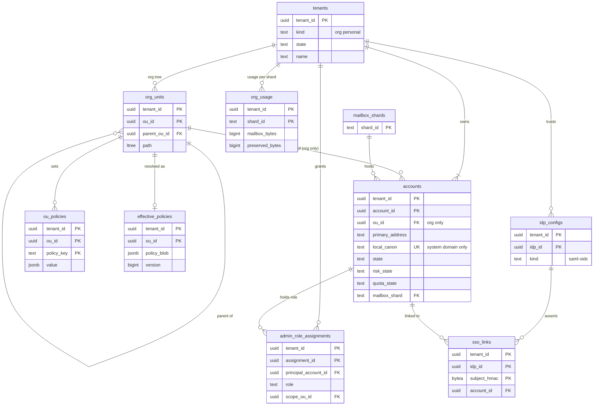

# Data model: テナント・アカウント・組織

[data-model.md](../data-model.md) の一部。規約はそちらの 3 節に従う。振る舞いは [accounts-and-security.md](../accounts-and-security.md)（4・10 節）と [organizations-domains-and-routing.md](../organizations-domains-and-routing.md)（4 節）を正とする。決定は [ADR-0007](../../decisions/0007-tenancy-accounts-orgs-and-rls.md)（テナントと RLS）。

| 表 | 置き場所 | 書く |
| --- | --- | --- |
| `tenants` | directory `xt`（RLS の外。ADR-0007 の「`tenants` の公開の属性」） | `accounts`、`admin-api` |
| `accounts` | directory `public` | `accounts`（作成・状態）、`admin-api`（組織の利用者）、`mailstore`（`quota_state` を outbox で写す） |
| `reserved_locals`・`retired_locals` | directory `sys` | `accounts`、運用（予約の一覧） |
| `org_units`・`ou_policies`・`effective_policies` | directory `public` | `admin-api` |
| `admin_role_assignments` | directory `public` | `admin-api` |
| `idp_configs`・`sso_links` | directory `public` | `admin-api`、`accounts` |
| `org_usage` | directory `public` | `mailstore`（outbox から集計）、`retention` の作業 |

- 個人のアカウントを作ると、その人だけの `personal` のテナントを同じトランザクションで作る（ADR-0007）。組織のテナントは多くのアカウントを持つ。
- アカウントのメールボックスの表は、`accounts.mailbox_shard` のシャードにだけある（[mailbox-labels-and-threads.md](mailbox-labels-and-threads.md) ほか）。directory とシャードの間に外部キーは張らない（別の DB）。

## 1. ER 図

- `org_units ||--o{ accounts`：組織のアカウントは 1 つの OU に属する。個人のアカウントの `ou_id` は NULL（任意の参照）。
- `org_units ||--o| effective_policies`：OU ごとに 1 行。OU の作成と同じトランザクションで作る。
- `mailbox_shards`（[keys-audit-and-lifecycle.md](keys-audit-and-lifecycle.md)）→ `accounts` は `sys` から `public` への参照で、外部キーを張る（同じ DB）。

## 2. 表

### 2.1 `tenants`

テナントの公開の属性。メールの中身・アドレスを持たない。RLS の外（ADR-0007）。読むのは宛先の解決（X1）、`accounts`、`admin-api`。

| 列 | 型 | NULL | 既定 | 説明 |
| --- | --- | --- | --- | --- |
| `tenant_id` | `uuid` | NOT NULL | `uuidv7()` | |
| `kind` | `text` | NOT NULL | — | `org`・`personal` |
| `state` | `text` | NOT NULL | `'active'` | `active`・`suspended`・`closing`（解約の 30 日の猶予）・`erasure_blocked`（保留があり消せない）・`erased`（TRK を破棄した墓標） |
| `name` | `text` | NULL | — | 組織の名前（`org` だけ）。個人は NULL |
| `primary_domain_id` | `uuid` | NULL | — | 組織の主のドメイン（[domains-groups-and-routing.md](domains-groups-and-routing.md) の `domains`） |
| `smtp_policy_class` | `text` | NOT NULL | `'default'` | 宛先の組（[ADR-0013](../../decisions/0013-recipient-validation-and-transaction-splitting.md)）。`default`・`dmarc_reject_to_quarantine` |
| `region` | `text` | NOT NULL | `'tyo'` | S3 でセルに固定する時に使う（[ADR-0065](../../decisions/0065-stage-up-criteria-and-cells.md)） |
| `created_at` | `timestamptz` | NOT NULL | `now()` | |
| `closing_at` | `timestamptz` | NULL | — | 解約の受け付け。`+30 日` で TRK を破棄する |
| `erased_at` | `timestamptz` | NULL | — | |

- キー：PK `(tenant_id)`。
- 索引：`(closing_at) WHERE state = 'closing'` — 解約の期限の作業（X4）。
- CHECK：`kind IN (…)`、`state IN (…)`、`kind = 'org' OR name IS NULL`、`state <> 'closing' OR closing_at IS NOT NULL`。
- 削除：行を消さない。`erased` の墓標で残す（ID を再利用しない）。
- S1 の量：約 80.2 万行（個人 80 万、組織 2,000）。

### 2.2 `accounts`

アカウントの正本。A1（主のアドレス、OU、状態）を持つ。C3 は表示の名前だけで、列の暗号化。

| 列 | 型 | NULL | 既定 | 説明 |
| --- | --- | --- | --- | --- |
| `tenant_id`・`account_id` | `uuid` | NOT NULL | `account_id` は `uuidv7()` | |
| `ou_id` | `uuid` | NULL | — | 組織のアカウントだけ |
| `primary_address` | `text` | NOT NULL | — | 主のアドレス（A1。正規化した形） |
| `primary_address_id` | `uuid` | NOT NULL | — | `addresses` の行 |
| `local_canon` | `text` | NULL | — | 本システムのドメインのアドレスの点を除き小文字にした形（[accounts-and-security.md](../accounts-and-security.md) の 4.1 節）。組織のドメインは NULL |
| `display_name_enc` | `bytea` | NULL | — | 表示の名前（C3、列の暗号化） |
| `state` | `text` | NOT NULL | `'provisional'` | `provisional`（2 つ目の要素の登録の前）・`active`・`suspended`・`archived`（退職者）・`deleted` |
| `risk_state` | `text` | NOT NULL | `'normal'` | `normal`・`at_risk`・`locked`・`recovering`（[ADR-0057](../../decisions/0057-account-takeover-response.md)） |
| `risk_state_since` | `timestamptz` | NOT NULL | `now()` | |
| `quota_bytes` | `bigint` | NOT NULL | `16106127360` | 容量（15 GiB。NFR-011） |
| `quota_state` | `text` | NOT NULL | `'ok'` | `ok`・`over`（[ADR-0031](../../decisions/0031-blob-references-gc-and-quota.md)。シャードの `account_usage` から outbox で写す） |
| `inbound_rate_multiplier` | `smallint` | NOT NULL | `1` | 宛先ごとの受信の速さの倍率（1〜10） |
| `mailbox_shard` | `text` | NOT NULL | — | シャードの ID。割り当ての正本 |
| `locale` | `text` | NOT NULL | `'ja'` | DSN・知らせの言語 |
| `created_at`・`updated_at` | `timestamptz` | NOT NULL | `now()` | |
| `deletion_due_at` | `timestamptz` | NULL | — | 個人の消去の 7 日の取り消しの期間の終わり |

- キー：PK `(tenant_id, account_id)`。UK `(account_id)`（シャードと Valkey の鍵は `account_id` だけで引くため。UUIDv7 なので衝突しない）。UK `(local_canon) WHERE local_canon IS NOT NULL`（本システムのドメインのアドレスの一意。`retired_locals` とも照らす）。FK `(tenant_id, ou_id)` → `org_units`、`mailbox_shard` → `mailbox_shards`。
- 索引：`(tenant_id, ou_id, state)` — 組織の利用者の一覧、OU の保留の範囲の解決。`(mailbox_shard)` — シャードの移し替えの計画。`(deletion_due_at) WHERE state = 'active' AND deletion_due_at IS NOT NULL` — 消去の期限（X4）。
- CHECK：`state IN (…)`、`risk_state IN (…)`、`quota_state IN (…)`、`inbound_rate_multiplier BETWEEN 1 AND 10`。
- RLS：`tenant_id` で FORCE RLS。宛先の解決は `address_index`（RLS の外）で `account_id` と `smtp_policy_class` を得て、状態は Valkey の `rcpt:{hmac}` に写す（[inbound-smtp.md](../inbound-smtp.md) の 8.1 節）。
- 削除：`deleted` は墓標で残す。行の列は `primary_address`・`display_name_enc` を消す（`primary_address` は `deleted:<account_id>` に置き換える）。期限は法務の L6。
- S1 の量：100 万行。

### 2.3 `reserved_locals`

本システムのドメインで作らせないローカル部（`postmaster`、`abuse`、役所・銀行の名前の一覧）。

| 列 | 型 | NULL | 既定 | 説明 |
| --- | --- | --- | --- | --- |
| `local_canon` | `text` | NOT NULL | — | 予約の形（点を除き小文字） |
| `match` | `text` | NOT NULL | `'exact'` | `exact`・`contains` |
| `reason` | `text` | NOT NULL | — | `role`・`brand`・`public_body`・`finance` |
| `created_at` | `timestamptz` | NOT NULL | `now()` | |

- キー：PK `(local_canon, match)`。S1 の量：数千行。

### 2.4 `retired_locals`

消したアカウントのアドレスの墓標。再利用を防ぐ（[accounts-and-security.md](../accounts-and-security.md) の 4.1 節）。

| 列 | 型 | NULL | 既定 | 説明 |
| --- | --- | --- | --- | --- |
| `local_canon_hmac` | `bytea` | NOT NULL | — | 本システムの鍵の HMAC-SHA256（32 バイト）。平文を持たない |
| `retired_at` | `timestamptz` | NOT NULL | `now()` | |

- キー：PK `(local_canon_hmac)`。作成の時、`accounts.local_canon` の一意と、この表の両方を確かめる。
- 保持：消さない（永く持つ）。S1 の量：年に数万行。

### 2.5 `org_units`

| 列 | 型 | NULL | 既定 | 説明 |
| --- | --- | --- | --- | --- |
| `tenant_id`・`ou_id` | `uuid` | NOT NULL | `ou_id` は `uuidv7()` | 根の OU は組織の作成で作る |
| `parent_ou_id` | `uuid` | NULL | — | 根は NULL |
| `name` | `text` | NOT NULL | — | 1〜128 文字 |
| `path` | `ltree` | NOT NULL | — | 根からの ID の列（`ou_id` の 32 桁の 16 進を `_` で） |
| `created_at`・`updated_at` | `timestamptz` | NOT NULL | `now()` | |

- キー：PK `(tenant_id, ou_id)`。UK `(tenant_id, parent_ou_id, name)`。FK `(tenant_id, parent_ou_id)` → 自分。
- 索引：`(tenant_id, path) USING gist` — 部分木（保留・規則・役割の範囲）。
- CHECK：`nlevel(path) <= 10`（深さ 10）。根は組織に 1 つ（`UK (tenant_id) WHERE parent_ou_id IS NULL`）。
- S1 の量：約 2 万行。

### 2.6 `ou_policies`・`effective_policies`

OU に置いた方針と、継いだ後の効く値（[organizations-domains-and-routing.md](../organizations-domains-and-routing.md) の 4.1・4.2 節）。

`ou_policies`：

| 列 | 型 | NULL | 既定 | 説明 |
| --- | --- | --- | --- | --- |
| `tenant_id`・`ou_id` | `uuid` | NOT NULL | — | |
| `policy_key` | `text` | NOT NULL | — | 4.2 節の鍵（`forwarding.external` など） |
| `value` | `jsonb` | NOT NULL | — | 鍵ごとの Zod の型で検証してから書く |
| `version` | `bigint` | NOT NULL | — | 書いた時の組織の方針のバージョン |
| `updated_by` | `uuid` | NOT NULL | — | 管理者の `account_id` |
| `updated_at` | `timestamptz` | NOT NULL | `now()` | |

- キー：PK `(tenant_id, ou_id, policy_key)`。FK → `org_units`（`ON DELETE CASCADE`）。

`effective_policies`：

| 列 | 型 | NULL | 既定 | 説明 |
| --- | --- | --- | --- | --- |
| `tenant_id`・`ou_id` | `uuid` | NOT NULL | — | |
| `policy_blob` | `jsonb` | NOT NULL | — | すべての鍵の効く値（最も近い祖先の値） |
| `version` | `bigint` | NOT NULL | — | 単調に増やす。outbox `policy.changed(tenant_id, version)` で配送の道のキャッシュを消す |
| `computed_at` | `timestamptz` | NOT NULL | `now()` | |

- キー：PK `(tenant_id, ou_id)`。CHECK：`version` を下げる更新をトリガーで拒む。
- 個人のテナントは方針を持たない（既定の値をコードに持つ）。S1 の量：`ou_policies` 約 5 万行、`effective_policies` 約 2 万行。

### 2.7 `admin_role_assignments`

| 列 | 型 | NULL | 既定 | 説明 |
| --- | --- | --- | --- | --- |
| `tenant_id`・`assignment_id` | `uuid` | NOT NULL | `uuidv7()` | |
| `principal_account_id` | `uuid` | NOT NULL | — | |
| `role` | `text` | NOT NULL | — | `super_admin`・`user_admin`・`domain_admin`・`security_admin`・`quarantine_reviewer`・`helpdesk`・`ediscovery_admin`・`investigator` |
| `extra_permissions` | `text[]` | NOT NULL | `'{}'` | `quarantine.read_body` など、役割の束の外の権限 |
| `scope_ou_id` | `uuid` | NULL | — | NULL は組織全体 |
| `granted_by` | `uuid` | NOT NULL | — | |
| `granted_at` | `timestamptz` | NOT NULL | `now()` | |

- キー：PK `(tenant_id, assignment_id)`。UK `(tenant_id, principal_account_id, role, scope_ou_id) NULLS NOT DISTINCT`。FK → `accounts`、`org_units`。
- 索引：`(tenant_id, principal_account_id)` — `authorize(actor, permission, target)`（DT-ORG-002）。
- CHECK：`role IN (…)`、`role <> 'super_admin' OR scope_ou_id IS NULL`。`super_admin` が 1 人になる削除は `admin-api` が 409 で拒む（同じトランザクションで数える）。
- 変更は `audit_events`（`tenant_admin`）に同じトランザクションで書く。S1 の量：約 1 万行。

### 2.8 `idp_configs`・`sso_links`

`idp_configs`：

| 列 | 型 | NULL | 既定 | 説明 |
| --- | --- | --- | --- | --- |
| `tenant_id`・`idp_id` | `uuid` | NOT NULL | `uuidv7()` | |
| `kind` | `text` | NOT NULL | — | `saml`・`oidc` |
| `metadata` | `jsonb` | NOT NULL | — | SAML の entityID・SSO の URL、OIDC の issuer・client_id（秘密を除く） |
| `client_secret_enc` | `bytea` | NULL | — | OIDC の秘密（列の暗号化） |
| `cert_fingerprints` | `bytea[]` | NOT NULL | `'{}'` | 署名の証明書の SHA-256（入れ替えの間は 2 つ） |
| `require_for_ou_ids` | `uuid[]` | NOT NULL | `'{}'` | SSO を求める OU |
| `state` | `text` | NOT NULL | `'active'` | `active`・`disabled` |
| `created_at`・`updated_at` | `timestamptz` | NOT NULL | `now()` | |

- キー：PK `(tenant_id, idp_id)`。S1 の量：約 2,000 行。

`sso_links`（この工程で足した。D-13）：IdP の主体（`NameID`・`sub`）と利用者の前もった結び付け（[organizations-domains-and-routing.md](../organizations-domains-and-routing.md) の 4.4 節。IdP の応答で利用者を作らない）。

| 列 | 型 | NULL | 既定 | 説明 |
| --- | --- | --- | --- | --- |
| `tenant_id`・`idp_id` | `uuid` | NOT NULL | — | |
| `subject_hmac` | `bytea` | NOT NULL | — | `NameID`・`sub` のテナントの鍵の HMAC |
| `account_id` | `uuid` | NOT NULL | — | |
| `linked_at` | `timestamptz` | NOT NULL | `now()` | |

- キー：PK `(tenant_id, idp_id, subject_hmac)`。UK `(tenant_id, idp_id, account_id)`。FK → `idp_configs`（`CASCADE`）、`accounts`（`CASCADE`）。S1 の量：約 20 万行。

### 2.9 `org_usage`

組織の保存の量（課金と管理の画面）。シャードごとの行で持ち、組織の量はその和にする。

| 列 | 型 | NULL | 既定 | 説明 |
| --- | --- | --- | --- | --- |
| `tenant_id` | `uuid` | NOT NULL | — | |
| `shard_id` | `text` | NOT NULL | — | 値を出したメールボックスのシャード |
| `mailbox_bytes` | `bigint` | NOT NULL | `0` | そのシャードの利用者の `account_usage.bytes` の和 |
| `archived_bytes` | `bigint` | NOT NULL | `0` | `archived` のアカウントの分 |
| `preserved_bytes` | `bigint` | NOT NULL | `0` | 保全の行の論理の大きさの和（[ADR-0053](../../decisions/0053-retention-rules-holds-and-preservation.md)） |
| `as_of` | `timestamptz` | NOT NULL | — | シャードで数えた時刻 |

- キー：PK `(tenant_id, shard_id)`。各シャードの X4 の作業が 1 時間ごとに組織ごとの和を数え直し、`as_of` の新しい値で上書きする（足し引きでないので、重複や欠けでずれない）。
- 個人のテナントは行を持たない。S1 の量：約 1 万行（組織 2,000 × 使うシャード）。
