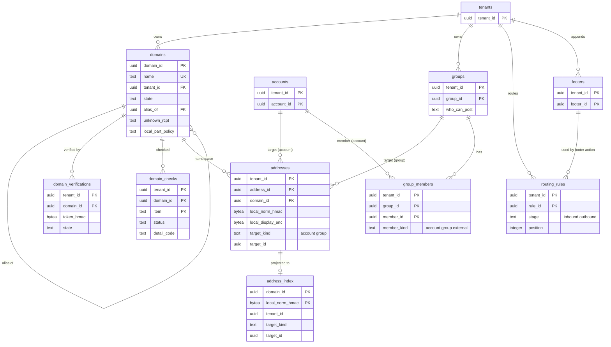

# Data model: ドメイン・アドレス・グループ・配送の規則

[data-model.md](../data-model.md) の一部。規約はそちらの 3 節に従う。振る舞いは [organizations-domains-and-routing.md](../organizations-domains-and-routing.md)（5・7・8 節）と [inbound-smtp.md](../inbound-smtp.md)（8・13 節）を正とする。決定は [ADR-0013](../../decisions/0013-recipient-validation-and-transaction-splitting.md)（宛先の確認）、[ADR-0050](../../decisions/0050-custom-domain-verification-and-dns-checks.md)（ドメインの確かめ）、[ADR-0051](../../decisions/0051-address-groups-expansion-and-loop-prevention.md)（アドレスとグループ）、[ADR-0052](../../decisions/0052-org-routing-rules-evaluation.md)（配送の規則）。

| 表 | 置き場所 | 書く |
| --- | --- | --- |
| `domains` | directory `xt`（RLS の外。宛先の解決の入口） | `admin-api`、ドメインの検査の作業（X4） |
| `domain_verifications`・`domain_checks` | directory `public` | ドメインの検査の作業（X4） |
| `addresses` | directory `public` | `accounts`、`admin-api` |
| `address_index` | directory `xt`（RLS の外。`addresses` の射影） | `addresses` のトリガーだけ |
| `groups`・`group_members` | directory `public` | `admin-api` |
| `system_addresses` | directory `sys` | 運用（コードの既定の行） |
| `routing_rules`・`footers` | directory `public` | `admin-api` |

- 宛先の解決（X1）は `domains` → `address_index` の 2 つだけを引く。どちらもローカル部を平文で持たない（ADR-0007）。
- アドレスの HMAC の鍵は、テナントごとのアドレスの鍵（`tenant_keys.addr_key_wrapped`。[keys-audit-and-lifecycle.md](keys-audit-and-lifecycle.md) の 2.1 節、D-21）。`mx-edge` は TRK を開けないので、別の KMS の鍵で包んだこの鍵を使う。

## 1. ER 図

- `domains ||--o{ domains`：別名のドメインの `alias_of` は主のドメインを指す（任意の参照）。
- `addresses` の `target_id` は `target_kind` で `accounts` か `groups` を指す多態の参照で、外部キーを張らない（トリガーで存在を確かめる）。
- `group_members` の `member_id` は `member_kind` が `account` なら `account_id`、`group` なら `group_id`、`external` なら行の ID（外のアドレスは暗号化した列に持つ）。

## 2. 表

### 2.1 `domains`

ドメイン → テナント。宛先の解決の入口（RLS の外）。ローカル部・中身を持たない。

| 列 | 型 | NULL | 既定 | 説明 |
| --- | --- | --- | --- | --- |
| `domain_id` | `uuid` | NOT NULL | `uuidv7()` | |
| `name` | `text` | NOT NULL | — | 小文字の A-label（IDNA） |
| `tenant_id` | `uuid` | NOT NULL | — | 本システムのドメイン（`<brand>.<domain>`）は本システムのテナント |
| `kind` | `text` | NOT NULL | — | `system`（本システムのドメイン）・`org` |
| `state` | `text` | NOT NULL | `'pending'` | `pending`・`verified`・`active`・`lapsed`・`transferring`・`released`・`expired`（[ADR-0050](../../decisions/0050-custom-domain-verification-and-dns-checks.md)） |
| `alias_of` | `uuid` | NULL | — | 別名のドメインの主（[organizations-domains-and-routing.md](../organizations-domains-and-routing.md) の 5.4 節） |
| `unknown_rcpt` | `text` | NOT NULL | `'reject'` | `reject`・`route`（分けた配送）・`catch_all` |
| `local_part_policy` | `text` | NOT NULL | — | `dots_ignored`（本システムのドメイン）・`dots_significant`（組織のドメイン）。大文字小文字は常に畳む |
| `catch_all_target_id` | `uuid` | NULL | — | `unknown_rcpt = catch_all` の配り先（`addresses.address_id`） |
| `smtp_policy_class` | `text` | NOT NULL | `'default'` | RCPT の組（テナントの値の写し） |
| `mta_sts_hosted` | `boolean` | NOT NULL | `false` | 本システムが方針と証明書を持つ（[ADR-0012](../../decisions/0012-inbound-tls-mta-sts-and-tls-rpt.md)） |
| `mta_sts_mode` | `text` | NULL | — | `testing`・`enforce` |
| `mta_sts_policy_id` | `text` | NULL | — | 方針の `id` |
| `transfer_to_tenant_id` | `uuid` | NULL | — | `transferring` の移し先 |
| `state_changed_at` | `timestamptz` | NOT NULL | `now()` | `lapsed`・`transferring`・`pending` の期限の起点 |
| `created_at` | `timestamptz` | NOT NULL | `now()` | |

- キー：PK `(domain_id)`。UK `(name) WHERE state NOT IN ('released', 'expired')`（同時に 1 つのテナントだけが持つ）。FK `alias_of` → 自分。
- 索引：`(tenant_id)` — 組織の一覧（`admin-api` は `tenant_id` の条件を必ず付ける）。`(state, state_changed_at)` — 検査の作業の期限（`pending` の 14 日、`transferring` の 7 日）。
- CHECK：`kind IN (…)`、`state IN (…)`、`unknown_rcpt IN (…)`、`unknown_rcpt <> 'catch_all' OR catch_all_target_id IS NOT NULL`、`alias_of IS NULL OR alias_of <> domain_id`。
- RLS：なし（`xt`）。読むのは X1 のロール（`mx-edge`・`inbound-pipeline`）と `admin-api`（自分のテナントの条件をコードで付ける。ロールの権限は `SELECT` と、自分のテナントの行への `UPDATE` を `SECURITY DEFINER` の関数で）。
- 削除：消さない（`released`・`expired` で残す）。S1 の量：約 5,000 行。

### 2.2 `domain_verifications`

| 列 | 型 | NULL | 既定 | 説明 |
| --- | --- | --- | --- | --- |
| `tenant_id`・`domain_id` | `uuid` | NOT NULL | — | |
| `token_hmac` | `bytea` | NOT NULL | — | TXT のトークン（160 ビット）のテナントの鍵の HMAC。トークンは作成の応答で 1 回だけ返す |
| `state` | `text` | NOT NULL | `'pending'` | `pending`・`seen`・`lost` |
| `first_seen_at`・`last_seen_at` | `timestamptz` | NULL | — | 3 つの解決のうち 2 つで見えた時刻 |
| `transfer_deadline` | `timestamptz` | NULL | — | 取り合いの 7 日 |
| `created_at` | `timestamptz` | NOT NULL | `now()` | |

- キー：PK `(tenant_id, domain_id)`（テナントとドメインの組で 1 つ。取り合いのときは別のテナントの行が並ぶ）。
- 索引：`(domain_id)` — 取り合いの検出。X4 の検査の作業が `sys_worker` のロールで読む（`domain_id` と状態の列だけ）。
- S1 の量：約 5,000 行。

### 2.3 `domain_checks`

DNS の検査の今の結果（[organizations-domains-and-routing.md](../organizations-domains-and-routing.md) の 5.3 節）。値の全文は持たない。

| 列 | 型 | NULL | 既定 | 説明 |
| --- | --- | --- | --- | --- |
| `tenant_id`・`domain_id` | `uuid` | NOT NULL | — | |
| `item` | `text` | NOT NULL | — | `mx`・`spf`・`dkim`・`dmarc`・`mta_sts`・`tls_rpt` |
| `status` | `text` | NOT NULL | — | `ok`・`warn`・`error` |
| `detail_code` | `text` | NULL | — | 理由のコード（`other_mx`、`spf_missing_include` など） |
| `detail` | `jsonb` | NULL | — | 残してよい値だけ（SPF の `include` の名前、DMARC の `p`、揃いの率） |
| `checked_at` | `timestamptz` | NOT NULL | — | |

- キー：PK `(tenant_id, domain_id, item)`。項目ごとに最新の 1 行だけを持つ（履歴は監査ログと指標。D-16）。
- S2 で書き込みの多い表として別のクラスタへ移す候補（[ADR-0065](../../decisions/0065-stage-up-criteria-and-cells.md)）。S1 の量：約 3 万行。

### 2.4 `addresses`

組織の中のアドレスの名前空間（主のアドレス、別名、グループ）。本システムのドメインの個人のアドレスも同じ表に置く（`domain_id` が本システムのドメイン）。

| 列 | 型 | NULL | 既定 | 説明 |
| --- | --- | --- | --- | --- |
| `tenant_id`・`address_id` | `uuid` | NOT NULL | `uuidv7()` | |
| `domain_id` | `uuid` | NOT NULL | — | |
| `local_norm_hmac` | `bytea` | NOT NULL | — | 正規化したローカル部（[ADR-0013](../../decisions/0013-recipient-validation-and-transaction-splitting.md)）の、ドメインの持ち主のテナントのアドレスの鍵の HMAC |
| `local_display_enc` | `bytea` | NOT NULL | — | 表示の形（列の暗号化。C3） |
| `target_kind` | `text` | NOT NULL | — | `account`・`group` |
| `target_id` | `uuid` | NOT NULL | — | |
| `is_primary` | `boolean` | NOT NULL | `false` | アカウントの主のアドレス |
| `created_at` | `timestamptz` | NOT NULL | `now()` | |

- キー：PK `(tenant_id, address_id)`。UK `(domain_id, local_norm_hmac)`（テナントをまたぐ一意。本システムのドメインの個人のアドレスのため）。UK `(tenant_id, target_id) WHERE is_primary`。FK `domain_id` → `domains`。
- 索引：`(tenant_id, target_kind, target_id)` — 利用者・グループのアドレスの一覧。
- CHECK：`target_kind IN (…)`、`NOT is_primary OR target_kind = 'account'`。利用者の別名は 1 人 30 まで（トリガー）。
- トリガー：挿入・削除・`target` の変更で `address_index` を同じトランザクションで書き換え、outbox `address.changed(domain_id, local_norm_hmac)` で宛先のキャッシュ（Valkey `rcpt:{hmac}`）を消す。
- 別名のドメインのアドレスは行を作らない（`domains.alias_of` で主のドメインの行を引く）。
- S1 の量：約 130 万行（主 100 万、別名と グループ 30 万）。

### 2.5 `address_index`

`addresses` の射影。宛先の解決（X1）だけが引く。

| 列 | 型 | NULL | 既定 | 説明 |
| --- | --- | --- | --- | --- |
| `domain_id` | `uuid` | NOT NULL | — | |
| `local_norm_hmac` | `bytea` | NOT NULL | — | |
| `tenant_id` | `uuid` | NOT NULL | — | |
| `target_kind` | `text` | NOT NULL | — | `account`・`group` |
| `target_id` | `uuid` | NOT NULL | — | `account_id` か `group_id` |
| `rcpt_state` | `text` | NOT NULL | `'active'` | `active`・`suspended`・`over_quota`（アカウントの `state`・`quota_state` の写し。`archived` は `suspended`） |

- キー：PK `(domain_id, local_norm_hmac)`。
- RLS：なし（`xt`）。書くのは `addresses` と `accounts` のトリガー（`SECURITY DEFINER`）だけ。X1 のロールは `SELECT` だけ。
- S1 の量：約 130 万行。

### 2.6 `groups`・`group_members`

`groups`：

| 列 | 型 | NULL | 既定 | 説明 |
| --- | --- | --- | --- | --- |
| `tenant_id`・`group_id` | `uuid` | NOT NULL | `uuidv7()` | |
| `name` | `text` | NOT NULL | — | 表示の名前 |
| `who_can_post` | `text` | NOT NULL | `'org'` | `anyone`・`org`・`members`・`managers` |
| `add_list_id` | `boolean` | NOT NULL | `true` | `List-Id: <group>.<domain>.<brand>` を足す |
| `max_recipients` | `integer` | NOT NULL | `10000` | 展開の後の受け手の上限（組織の管理者が 5 万まで上げる） |
| `created_at`・`updated_at` | `timestamptz` | NOT NULL | `now()` | |

- キー：PK `(tenant_id, group_id)`。CHECK：`who_can_post IN (…)`、`max_recipients BETWEEN 1 AND 50000`。S1 の量：約 10 万行。

`group_members`：

| 列 | 型 | NULL | 既定 | 説明 |
| --- | --- | --- | --- | --- |
| `tenant_id`・`group_id` | `uuid` | NOT NULL | — | |
| `member_id` | `uuid` | NOT NULL | — | `account_id`・`group_id`、外は `uuidv7()` |
| `member_kind` | `text` | NOT NULL | — | `account`・`group`・`external` |
| `role` | `text` | NOT NULL | `'member'` | `member`・`manager`（`who_can_post = managers` の判定） |
| `external_address_enc` | `bytea` | NULL | — | 外のアドレス（列の暗号化。C3） |
| `external_address_hmac` | `bytea` | NULL | — | 重複の除き |
| `added_at` | `timestamptz` | NOT NULL | `now()` | |

- キー：PK `(tenant_id, group_id, member_id)`。UK `(tenant_id, group_id, external_address_hmac) WHERE member_kind = 'external'`。FK `(tenant_id, group_id)` → `groups`（`CASCADE`）。
- 索引：`(tenant_id, member_id)` — 利用者の所属するグループ（`who_can_post = members` の判定、利用者の消去）。
- CHECK：`member_kind IN (…)`、`(member_kind = 'external') = (external_address_enc IS NOT NULL)`。1 グループ 5 万まで（トリガー）。
- 展開の結果はスプールの横の `expansion/<spool_id>`（[stores.md](stores.md) の 3.1 節）に置き、表を読み直さない。S1 の量：約 300 万行。

### 2.7 `system_addresses`

本システムのあて先（[inbound-smtp.md](../inbound-smtp.md) の 13 節）。

| 列 | 型 | NULL | 既定 | 説明 |
| --- | --- | --- | --- | --- |
| `local_part` | `text` | NOT NULL | — | `postmaster`、`abuse`、`fbl`、`dmarc-rua`、`tlsrpt`、`bounces` など。本システムの名前で個人の情報でない |
| `domain_name` | `text` | NOT NULL | — | `<brand>.<domain>`、`srs.<brand>.<domain>` |
| `handler` | `text` | NOT NULL | — | `report-ingest`（`fbl`・`dmarc`・`tlsrpt`）、`srs-bounce`、`role-mailbox`（運用の受け箱）、`dsn` |
| `created_at` | `timestamptz` | NOT NULL | `now()` | |

- キー：PK `(domain_name, local_part)`。`+` の後ろ（`dmarc-rua+<org_token>`）は外して引き、`handler` に渡す。S1 の量：数十行。

### 2.8 `routing_rules`

| 列 | 型 | NULL | 既定 | 説明 |
| --- | --- | --- | --- | --- |
| `tenant_id`・`rule_id` | `uuid` | NOT NULL | `uuidv7()` | |
| `stage` | `text` | NOT NULL | — | `inbound`・`outbound` |
| `position` | `integer` | NOT NULL | — | 段の中の順 |
| `conditions` | `jsonb` | NOT NULL | — | `recipient`・`sender`・`ou`・`size_gt`・`external_recipients`（8.2 節）。アドレスは HMAC で持つ |
| `actions` | `jsonb` | NOT NULL | — | `split_delivery`・`add_recipient`・`catch_all`・`reject_external_forwarding`・`outbound_gateway`・`footer`・`block_external` と引数（主機の名前とポート、`footer_id`） |
| `enabled` | `boolean` | NOT NULL | `true` | |
| `version` | `bigint` | NOT NULL | — | 組織の規則のバージョン（変更で 1 上げ、outbox `routing.changed(tenant_id, version)` で 60 秒以内に配送の道へ） |
| `created_by` | `uuid` | NOT NULL | — | |
| `updated_at` | `timestamptz` | NOT NULL | `now()` | |

- キー：PK `(tenant_id, rule_id)`。UK `(tenant_id, stage, position) DEFERRABLE INITIALLY DEFERRED`（並べ替え）。
- CHECK：`stage IN (…)`。段ごとに 200 まで（トリガー）。S1 の量：約 2 万行。

### 2.9 `footers`

| 列 | 型 | NULL | 既定 | 説明 |
| --- | --- | --- | --- | --- |
| `tenant_id`・`footer_id` | `uuid` | NOT NULL | `uuidv7()` | |
| `text` | `text` | NOT NULL | — | `text/plain` の葉に足す文（4 KiB まで） |
| `html_sanitized` | `text` | NOT NULL | — | 浄化した HTML の断片（16 KiB まで。[ADR-0044](../../decisions/0044-safe-html-rendering.md) の浄化を通す） |
| `updated_at` | `timestamptz` | NOT NULL | `now()` | |

- キー：PK `(tenant_id, footer_id)`。`routing_rules.actions` の `footer_id` は論理の参照（`jsonb` の中）。消すときは参照する規則がないことを `admin-api` が確かめる。S1 の量：数千行。
