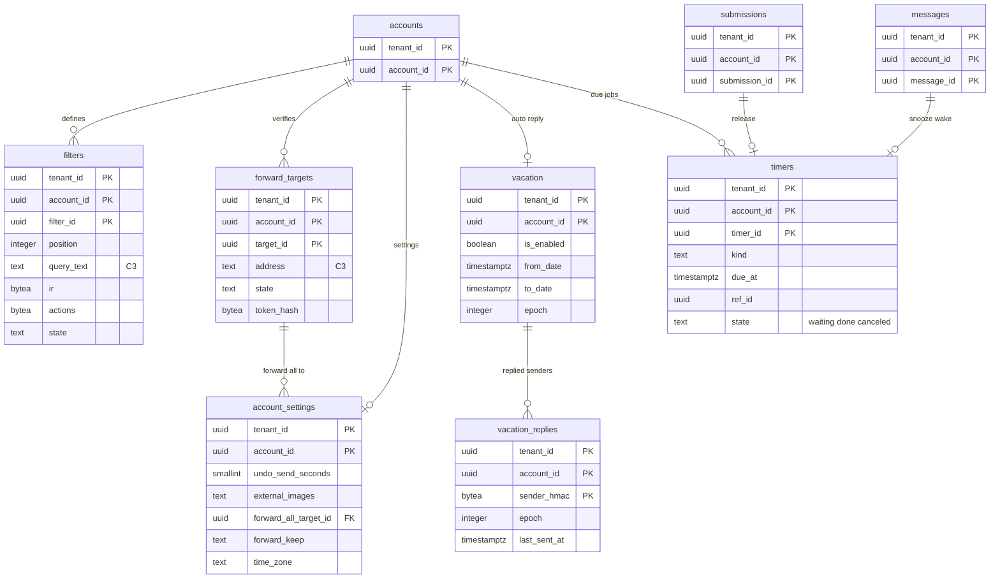

# Data model: フィルター・転送・不在の返信・設定・時刻の仕事

[data-model.md](../data-model.md) の一部。規約はそちらの 3 節に従う。振る舞いは [filters-forwarding-and-automation.md](../filters-forwarding-and-automation.md)（4〜7 節）と [web-client.md](../web-client.md)（14 節）を正とする。決定は [ADR-0047](../../decisions/0047-user-filter-evaluation.md)（フィルター）、[ADR-0048](../../decisions/0048-verified-forwarding.md)（確認つきの転送）、[ADR-0049](../../decisions/0049-timed-jobs-vacation-and-scheduled-send.md)（時刻の仕事・不在の返信・予約の送信）、[ADR-0057](../../decisions/0057-account-takeover-response.md)（見直しの止め）。

| 表 | 置き場所 | 書く |
| --- | --- | --- |
| `filters`・`forward_targets`・`account_settings`・`vacation`・`vacation_replies`・`timers` | メールボックスのシャード `public` | `mailstore`（JMAP の設定・`<Brand>` の拡張、配送、時刻の仕事） |

- 転送の先・フィルターの変更は、同じトランザクションで outbox `account.risk_signal` を書く（乗っ取りの信号。[ADR-0057](../../decisions/0057-account-takeover-response.md)）。
- 時刻の仕事の見張りは X4 の `sys_worker` のロールで、`timers` の ID と期限の列だけを読み、アカウントの文脈を設定して `mailstore` を呼ぶ（[ADR-0061](../../decisions/0061-operator-access-cross-tenant-paths-and-audit.md)）。

## 1. ER 図

- `forward_targets ||--o{ account_settings`：すべてを転送する先（`forward_all_target_id`、任意）。確かめた先だけを指せる。
- `submissions ||--o| timers`・`messages ||--o| timers`：`timers.ref_id` は `kind` で送信の依頼・メッセージ・`vacation`・転送の先を指す多態の参照（外部キーを張らない）。

## 2. 表

### 2.1 `filters`

| 列 | 型 | NULL | 既定 | 説明 |
| --- | --- | --- | --- | --- |
| `tenant_id`・`account_id` | `uuid` | NOT NULL | — | |
| `filter_id` | `uuid` | NOT NULL | `uuidv7()` | |
| `position` | `integer` | NOT NULL | — | 並び（評価は全部に当てて合わせる。DT-FILT-001） |
| `query_text` | `text` | NOT NULL | — | 利用者の書いた条件（C3。1,024 文字） |
| `ir` | `bytea` | NOT NULL | — | `SearchIr` v1（Protobuf。状態の節と相対の日付を含まない） |
| `analyzer_version` | `smallint` | NOT NULL | — | 語の分け方。変わったら保存し直す |
| `actions` | `bytea` | NOT NULL | — | Protobuf `FilterActions`：`addLabel`、`archive`、`markRead`、`star`、`trash`、`neverSpam`、`alwaysSpam`、`markImportant`、`neverImportant`、`forward`（`target_id`、5 先まで） |
| `state` | `text` | NOT NULL | `'active'` | `active`・`suspended_pending_review`（[ADR-0057](../../decisions/0057-account-takeover-response.md)） |
| `created_at`・`updated_at` | `timestamptz` | NOT NULL | `now()` | 見直しは「直近 7 日に作った・変えた」で選ぶ |

- キー：PK `(tenant_id, account_id, filter_id)`。UK `(tenant_id, account_id, position) DEFERRABLE INITIALLY DEFERRED`。
- CHECK：`state IN (…)`、`char_length(query_text) <= 1024`。1 アカウント 1,000、IR の節 256（`mailstore`）。
- S1 の量：平均 5 で約 500 万行。

### 2.2 `forward_targets`

| 列 | 型 | NULL | 既定 | 説明 |
| --- | --- | --- | --- | --- |
| `tenant_id`・`account_id` | `uuid` | NOT NULL | — | |
| `target_id` | `uuid` | NOT NULL | `uuidv7()` | |
| `address` | `text` | NOT NULL | — | 転送の先（C3） |
| `address_hmac` | `bytea` | NOT NULL | — | 重複の除き（同じ先の 2 行を作らない） |
| `state` | `text` | NOT NULL | `'pending'` | `pending`・`verified`・`disabled`・`expired`・`removed`・`suspended_pending_review` |
| `token_hash`・`code_hash` | `bytea` | NULL | — | 確かめのリンクのトークンと 9 桁の番号の SHA-256 |
| `verify_sent_count` | `smallint` | NOT NULL | `0` | 確かめのメールの数（アカウントで 1 日 10 通は Valkey で数える） |
| `verify_expires_at` | `timestamptz` | NULL | — | 送ってから 7 日（`timers` の `forward_verify_expire`） |
| `verified_at` | `timestamptz` | NULL | — | |
| `fail_count` | `smallint` | NOT NULL | `0` | 恒久のエラーの続いた数 |
| `first_fail_at` | `timestamptz` | NULL | — | 7 日の中で 5 回で `disabled` |
| `disabled_reason` | `text` | NULL | — | `permanent_errors`・`org_policy`・`user` |
| `created_at`・`updated_at` | `timestamptz` | NOT NULL | `now()` | |

- キー：PK `(tenant_id, account_id, target_id)`。UK `(tenant_id, account_id, address_hmac) WHERE state <> 'removed'`。
- 索引：`(tenant_id, account_id, token_hash) WHERE state = 'pending'` — 確かめのリンクの POST（リンクの URL はアカウントの ID とトークンを持つ）。
- CHECK：`state IN (…)`、`state <> 'verified' OR verified_at IS NOT NULL`。確かめた先は 20 まで。
- 組織の方針 `forwarding.external = deny` で、外の先を `disabled`（`org_policy`）にする。S1 の量：約 20 万行。

### 2.3 `account_settings`

アカウントごとの 1 行の設定（[web-client.md](../web-client.md) の 14 節と [filters-forwarding-and-automation.md](../filters-forwarding-and-automation.md) の 10 節の列をまとめた表）。

| 列 | 型 | NULL | 既定 | 説明 |
| --- | --- | --- | --- | --- |
| `tenant_id`・`account_id` | `uuid` | NOT NULL | — | |
| `undo_send_seconds` | `smallint` | NOT NULL | `5` | 5・10・20・30 |
| `external_images` | `text` | NOT NULL | `'show'` | `show`・`ask`（[ADR-0028](../../decisions/0028-external-image-proxy.md)。attachment-and-url-scanning.md の `image_settings` はこの列。D-6） |
| `offline_allowed` | `boolean` | NOT NULL | `true` | 「この端末にメールを保存しない」の逆（組織の `web.offline_cache` が優先） |
| `keyboard_shortcuts` | `boolean` | NOT NULL | `false` | |
| `time_zone` | `text` | NOT NULL | `'Asia/Tokyo'` | 検索の日付、静かな時間、不在の返信の期間 |
| `forward_all_target_id` | `uuid` | NULL | — | すべてを転送する先 |
| `forward_keep` | `text` | NOT NULL | `'keep'` | `keep`・`read`・`archive`・`trash` |
| `forward_notice_until` | `timestamptz` | NULL | — | 転送を始めた知らせの帯（7 日） |
| `updated_at` | `timestamptz` | NOT NULL | `now()` | |
| `modseq` | `bigint` | NOT NULL | — | |

- キー：PK `(tenant_id, account_id)`。FK `(tenant_id, account_id, forward_all_target_id)` → `forward_targets`。
- CHECK：`undo_send_seconds IN (5, 10, 20, 30)`、`external_images IN (…)`、`forward_keep IN (…)`。
- アカウントの作成で行を作る。S1 の量：100 万行。

### 2.4 `vacation`

| 列 | 型 | NULL | 既定 | 説明 |
| --- | --- | --- | --- | --- |
| `tenant_id`・`account_id` | `uuid` | NOT NULL | — | |
| `is_enabled` | `boolean` | NOT NULL | `false` | |
| `from_date`・`to_date` | `timestamptz` | NULL | — | 期間（アカウントの時間帯で入力） |
| `subject` | `text` | NULL | — | C3 |
| `text_body`・`html_body` | `text` | NULL | — | C3。HTML は浄化して保存（[ADR-0044](../../decisions/0044-safe-html-rendering.md)） |
| `scope` | `text` | NOT NULL | `'all'` | `all`・`contacts`・`org` |
| `epoch` | `integer` | NOT NULL | `1` | 文・開始日を変えたら 1 上げ、`vacation_replies` の覚えを古くする |
| `modseq` | `bigint` | NOT NULL | — | JMAP の `VacationResponse` の状態 |
| `updated_at` | `timestamptz` | NOT NULL | `now()` | |

- キー：PK `(tenant_id, account_id)`。CHECK：`scope IN (…)`、`to_date IS NULL OR from_date IS NULL OR from_date < to_date`。
- 期間の終わりは `timers`（`vacation_end`）。S1 の量：約 100 万行（行がないアカウントは無効）。

### 2.5 `vacation_replies`

| 列 | 型 | NULL | 既定 | 説明 |
| --- | --- | --- | --- | --- |
| `tenant_id`・`account_id` | `uuid` | NOT NULL | — | |
| `sender_hmac` | `bytea` | NOT NULL | — | 送り手のアドレスのテナントのアドレスの鍵の HMAC |
| `epoch` | `integer` | NOT NULL | — | 返した時の `vacation.epoch` |
| `last_sent_at` | `timestamptz` | NOT NULL | — | 96 時間に 1 回 |

- キー：PK `(tenant_id, account_id, sender_hmac)`。返すときは `epoch` が今と同じで `last_sent_at` から 96 時間の中なら返さない。
- 保持：`last_sent_at` から 7 日を過ぎた行を消す（X4）。S1 の量：常に約 500 万行。

### 2.6 `timers`

| 列 | 型 | NULL | 既定 | 説明 |
| --- | --- | --- | --- | --- |
| `tenant_id`・`account_id` | `uuid` | NOT NULL | — | |
| `timer_id` | `uuid` | NOT NULL | `uuidv7()` | |
| `kind` | `text` | NOT NULL | — | `submission_release`・`snooze_wake`・`vacation_end`・`forward_verify_expire` |
| `due_at` | `timestamptz` | NOT NULL | — | |
| `ref_id` | `uuid` | NOT NULL | — | `submission_id`・`message_id`・`account_id`・`target_id` |
| `state` | `text` | NOT NULL | `'waiting'` | `waiting`・`done`・`canceled` |
| `attempts` | `smallint` | NOT NULL | `0` | 解放の失敗で 5 秒後に再び |
| `created_at` | `timestamptz` | NOT NULL | `now()` | |
| `done_at` | `timestamptz` | NULL | — | 1 日の後に消す |

- キー：PK `(tenant_id, account_id, timer_id)`。UK `(tenant_id, account_id, kind, ref_id) WHERE state = 'waiting'`（同じものの起こしを 2 つ作らない）。
- 索引：`(due_at) WHERE state = 'waiting'` — X4 の発見の索引。見張りが 1 秒ごとに 500 行まで `FOR UPDATE SKIP LOCKED` で取る。`(done_at) WHERE state <> 'waiting'` — 1 日の後の削除。
- CHECK：`kind IN (…)`、`state IN (…)`、`state = 'waiting' OR done_at IS NOT NULL`。
- RLS：FORCE RLS。`sys_worker` には、`tenant_id`・`account_id`・`timer_id`・`kind`・`due_at`・`state` の列の `SELECT` と、行を取るための `UPDATE (state, done_at, attempts, due_at)` を、そのロールだけのポリシーで与える（[ADR-0061](../../decisions/0061-operator-access-cross-tenant-paths-and-audit.md) の列の権限）。
- S1 の量：平均 40 件/秒・ピーク 300 件/秒が流れ、常に約 500 万行（スヌーズと予約が長く残る）。
