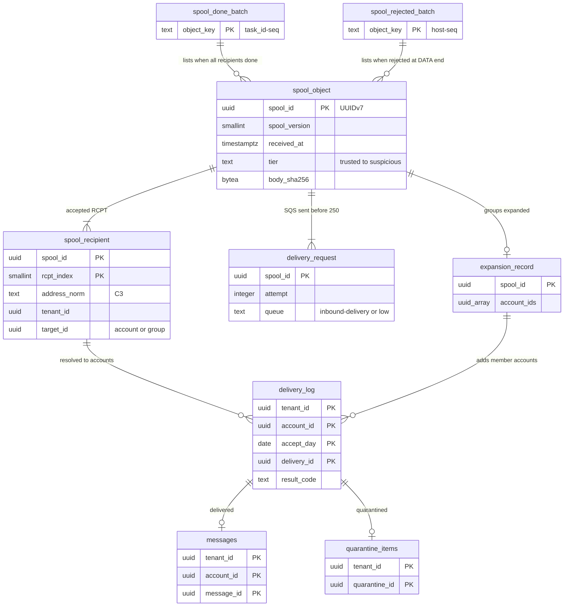

# Data model: 受信のスプールと配送

[data-model.md](../data-model.md) の一部。規約はそちらの 3 節に従う。振る舞いは [inbound-smtp.md](../inbound-smtp.md)（10・11 節）と [message-parsing-and-storage.md](../message-parsing-and-storage.md)（4 節）を正とする。決定は [ADR-0002](../../decisions/0002-accept-then-filter.md)（受け付けてから選別する）、[ADR-0011](../../decisions/0011-spool-commit-and-sweeper.md)（スプールの確定と掃除）、[ADR-0051](../../decisions/0051-address-groups-expansion-and-loop-prevention.md)（配送の鍵 `(spool_id, account_id)`）。

受信の道のデータは、ほとんどが Aurora の外にある。250 の前に確定するのは S3 のスプールと SQS の依頼の 2 つだけで、Aurora に書くのは配送（受け手のシャード）からである。

| もの | 置き場所 | 書く | 形 |
| --- | --- | --- | --- |
| スプールのオブジェクト（`SpoolEnvelope`＋生のメッセージ） | S3 `spool-tyo`・`spool-osa` | `mx-edge` | [stores.md](stores.md) の 3.1 節、この文書の 2 節 |
| 配送の依頼 | SQS `inbound-delivery`・`inbound-delivery-low` | `mx-edge`、掃除の役、隔離の解放 | [stores.md](stores.md) の 4.1 節 |
| 終わり・拒みの印の束 | S3 `spool-done/`・`spool-rejected/` | `inbound-pipeline`、`mx-edge` | [stores.md](stores.md) の 3.1 節 |
| 展開の記録 | S3 `expansion/` | `inbound-pipeline` | [stores.md](stores.md) の 3.1 節 |
| 再送の重複の抑え | Valkey `dup:{account_id}:{hash}` | `inbound-pipeline` | [stores.md](stores.md) の 1 節 |
| **配送の記録** `delivery_log` | **受け手のメールボックスのシャード**（D-1） | `mailstore`（配送と同じトランザクション） | 3 節 |

## 1. ER 図（概念：1 つの SMTP のトランザクション）

S3・SQS の項目は表でないが、どの単位でいくつできるかを示すため実体として描く。`delivery_log` から下が Aurora の行。

- `spool_done_batch ||--o{ spool_object`：1 つのスプールは、終わったら 1 つの束（載せ直しで重ねて書いたときは 2 つ以上）に載り、終わるまで載らない（任意）。拒んだスプールは `spool_rejected_batch` に載る。
- `spool_object ||--|{ delivery_request`：250 の前に両方を確定する（[ADR-0011](../../decisions/0011-spool-commit-and-sweeper.md)）。掃除の役が載せ直すと `attempt` が増えた依頼が増えるが、配送の鍵が同じなので受け手には 1 通（D-1 の UK）。
- `spool_recipient ||--o{ delivery_log`：1 つの宛先が 0（宛先の消失、投稿の許可の外）か 1 つのアカウント。グループの宛先は `expansion_record` を通して多くのアカウントになる。同じアカウントは `(delivery_id, account_id)` で 1 行（ADR-0051）。
- `delivery_log ||--o| messages`：`result_code = delivered` のときだけ 1 通。隔離（`quarantined`）・重複（`duplicate_suppressed`）・投稿の許可の外（`group_not_permitted`）・DSN（`dsn_created`）は行だけ。

## 2. `SpoolEnvelope`（スプールの頭）

`SpoolEnvelope` は Protobuf（`proto3`）で、バイトの並びは [stores.md](stores.md) の 3.1 節。中身は C1 と、宛先・`mail_from` のローカル部（C3）を含む。スプールは C3 の置き場所として扱う（[inbound-smtp.md](../inbound-smtp.md) の 10 節）。

| 番号 | 欄 | 型 | 区分 | 説明 |
| --- | --- | --- | --- | --- |
| 1 | `spool_version` | `uint32` | — | 1。読む側を先に出す（[ADR-0070](../../decisions/0070-format-versions-and-model-rollout.md)） |
| 2 | `spool_id` | `bytes(16)` | — | UUIDv7。時刻の部分が受け付けの時刻 |
| 3 | `received_at` | `int64`（UNIX マイクロ秒） | C1 | 終わりの印の時刻（`t_accept`） |
| 4 | `mx_host`・`region` | `string` | C1 | `mx-tyo-1a-03`、`tyo`・`osa` |
| 5 | `peer` | `Peer` | C1 | `ip`、`range`（/24・/48）、`asn`、`tier`（接続の層）、`ptr` |
| 6 | `helo` | `string` | C1 | |
| 7 | `tls` | `Tls` | C1 | バージョン、暗号、SNI、`none` |
| 8 | `mail_from` | `string` | C3 | 空は DSN |
| 9 | `rcpts` | `repeated Rcpt` | C3 | `address_norm`、`domain_id`、`tenant_id`、`target_kind`（`account`・`group`・`route`・`catch_all`・`system`）、`target_id`、`smtp_policy_class` |
| 10 | `auth_results` | `AuthResults` | C1 | SPF（結果、ドメイン、HELO）、DKIM（結果、`d`、`s`、`a`、`l_partial`、`b` の先頭 8 文字）の列、ARC（`cv`、組の数、封印者、記録された結果）、DMARC（結果、方針のドメイン、組織のドメイン、当てた方針、`t`、救い）、`psl_shadow_org_domain`（[sender-authentication.md](../sender-authentication.md) の 14 節） |
| 11 | `sync_checks` | `repeated Check` | C1・C2 | DATA の終わりの同期の検査（既知のマルウェアのハッシュ、確信の高い規則）の結果のコード |
| 12 | `timed_out_checks` | `repeated string` | — | 予算の 10 秒を超えた検査（後から選び直す） |
| 13 | `size` | `uint64` | C1 | 本文のバイトの数 |
| 14 | `body_sha256` | `bytes(32)` | C2 | 本文の SHA-256（重複の抑えの鍵の材料） |
| 15 | `queue` | `string` | — | 載せた待ち行列（`inbound-delivery`・`inbound-delivery-low`） |

- 欄の足し引きは番号を再利用しない。消した欄は `reserved` にする。
- `spool_id` は配送の鍵の半分で、blob の ID（`blob_id = UUIDv7(spool_id の時刻) ＋ spool_id の HMAC の下位`。[message-parsing-and-storage.md](../message-parsing-and-storage.md) の 4 節）と、`delivery_log.accept_day` の元になる。

## 3. `delivery_log`（D-1）

配送の記録。受け手（アカウント）ごとに 1 行で、**配送の冪等の正本**と、サポートの道具・突き合わせの元を兼ねる。

- **置き場所の決定（D-1、推奨の既定案）**：directory ではなく、受け手のメールボックスのシャードに置き、`mailstore` が配送と同じトランザクションで書く。
  - directory に置くと、1 日約 7,200 万行（受け付け 6,000 万 × 受け手 1.2）、90 日で約 65 億行・約 1.5 TB を 1 つのクラスタに足す。directory はアドレスの解決とサインインの正本で、S2 で書き込みの上限に近づく表を既に分ける予定がある（[ADR-0065](../../decisions/0065-stage-up-criteria-and-cells.md)）。
  - シャードに置くと、書き込みはシャードの数で分かれ（1 シャード 1 日約 900 万行）、配送のトランザクションの行が 8 から 9 に増えるだけになる（[capacity.md](../capacity.md) の 4 節）。RLS の外の表も増えない。
  - 配送の冪等の鍵 `(spool_id, account_id)`（ADR-0051）を、メッセージの行と別に持てる。利用者がメッセージを消しても、スプールの寿命（7 日）の中の読み直し・掃除の役・大阪での配り直しで、同じメッセージを再び配らない。
  - 引く人は、受け手のアカウントを知っている（サポートの道具は依頼の `account_id` で引く。[security.md](../security.md) の 7.2 節）。スプールの単位の突き合わせは `spool-done` の束で行い（[ADR-0011](../../decisions/0011-spool-commit-and-sweeper.md)）、この表を横に引かない。

| 列 | 型 | NULL | 既定 | 説明 |
| --- | --- | --- | --- | --- |
| `tenant_id`・`account_id` | `uuid` | NOT NULL | — | 受け手 |
| `accept_day` | `date` | NOT NULL | — | `delivery_id` の UUIDv7 の時刻の日（日本時間）。分割の鍵。読み直しでも同じ値になる |
| `delivery_id` | `uuid` | NOT NULL | — | 受信は `spool_id`。本システムの中の送信の宛先は `submission_id`（[outbound-smtp-and-reputation.md](../outbound-smtp-and-reputation.md) の 4.1 節） |
| `delivery_kind` | `text` | NOT NULL | — | `inbound`・`internal` |
| `message_id` | `uuid` | NULL | — | 配ったメッセージの行（`delivered` のとき） |
| `result_code` | `text` | NOT NULL | — | `delivered`・`quarantined`・`duplicate_suppressed`・`group_not_permitted`・`dsn_created`（受け付けた後の配送の不能）・`dropped_policy`（組織の規則の `block`） |
| `verdict` | `text` | NULL | — | `inbox`・`inbox_warn`・`spam`・`spam_phish`・`quarantine`（[ADR-0022](../../decisions/0022-verdict-score-composition-and-overrides.md)） |
| `addr_hmac` | `bytea` | NOT NULL | — | 宛先のアドレス（RCPT の形、グループなら展開の元のグループのアドレス）のテナントのアドレスの鍵の HMAC |
| `msgid_hmac` | `bytea` | NULL | — | `Message-ID` のテナントのアドレスの鍵の HMAC。「届かない」の調べの引き（[security.md](../security.md) の 7.2 節） |
| `t_accept` | `timestamptz` | NOT NULL | — | 250 の時刻（`SpoolEnvelope.received_at`） |
| `t_commit` | `timestamptz` | NOT NULL | `now()` | 配送の確定の時刻 |

- キー：PK `(tenant_id, account_id, accept_day, delivery_id)`。配送は `INSERT … ON CONFLICT DO NOTHING` で始め、0 行なら既に配ったとして何もせず成功を返す（[ADR-0002](../../decisions/0002-accept-then-filter.md)）。
- 索引：`(tenant_id, account_id, msgid_hmac, t_accept)` — サポートの道具の「届かない」の調べ。分割ごとの局所の索引。
- CHECK：`delivery_kind IN (…)`、`result_code IN (…)`、`(result_code = 'delivered') = (message_id IS NOT NULL)`。
- 書き込み：`mailstore.deliver` の 1 つのトランザクションで、メッセージの行・所属・スレッド・change log・outbox と一緒に書く。`delivered` 以外も、配送の作業が受け手について決めた時点で書く（隔離は `quarantine_items` を directory に書いた後、シャードにこの行を書く。D-1）。
- 読む：サポートの道具（`mailstore` の `DeliveryLog/query`、アカウントの文脈、列は ID・結果のコード・時刻だけを返す）、毎時の突き合わせの数え（X6 の SLI の集計：分割ごとの `count(*)` を時刻の範囲で数えるだけ）。
- RLS：`tenant_id`・`account_id` で FORCE RLS。追記だけ（UPDATE を与えない）。
- 分割：`accept_day` の日。保持：90 日（分割を `DROP`）。期限は**法務の確認待ち**（L1・L6）。90 日を変えるときは、スプールの寿命（7 日）と大阪の配り直しの範囲（2 時間）より長いことを守る（配送の冪等のため）。
- S1 の量：1 日約 7,200 万行（1 シャード約 900 万行）。1 行と索引で約 200 バイトとして、1 日約 14 GB、90 日で約 1.3 TB（1 シャード約 160 GB）。

## 4. 本システムの中の送信の配送

- 本システムの中の宛先は、`outbound-gate` が `inbound-pipeline` へ配送の依頼として渡す（[outbound-smtp-and-reputation.md](../outbound-smtp-and-reputation.md) の 4.1 節）。スプールは作らず、送信者の blob を参照する（ADR-0007 の X3）。
- 配送の鍵は `(submission_id, account_id)` で、`delivery_log.delivery_id = submission_id`、`delivery_kind = internal`。
- blob の参照は、受け手のシャードの outbox から `mailbox` の参照を足す（送信者の lease は `submission_id`。[messages-and-blobs.md](messages-and-blobs.md) の 2.5 節）。
