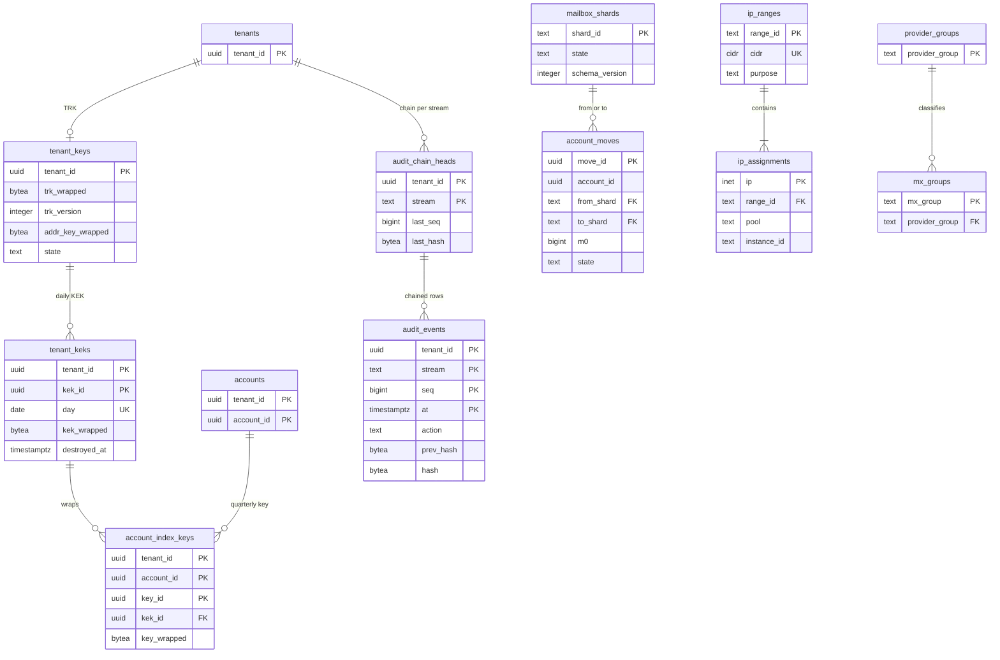

# Data model: 鍵・監査・基盤と運用の表

[data-model.md](../data-model.md) の一部。規約はそちらの 3 節に従う。振る舞いは [security.md](../security.md)（5〜9 節）、[infrastructure.md](../infrastructure.md)（3・6・7 節）、[delivery.md](../delivery.md)（5 節）、[observability.md](../observability.md)（5 節）を正とする。決定は [ADR-0060](../../decisions/0060-key-hierarchy-and-crypto-erasure.md)（4 段の鍵と暗号での消去）、[ADR-0061](../../decisions/0061-operator-access-cross-tenant-paths-and-audit.md)（運用者のアクセスと監査）、[ADR-0063](../../decisions/0063-network-byoip-ranges-and-egress.md)（IP の範囲）、[ADR-0064](../../decisions/0064-storage-classes-and-region-replication.md)（DR）、[ADR-0069](../../decisions/0069-mta-drain-and-shard-schema-waves.md)（スキーマの波）。

| 表 | 置き場所 | 書く |
| --- | --- | --- |
| `tenant_keys`・`tenant_keks`・`account_index_keys` | directory `public` | `mailstore`・`search-indexer`（KEK と索引の鍵の作成）、`accounts`（TRK の作成と破棄） |
| `audit_events`・`audit_chain_heads` | directory `public` | 操作と同じトランザクションで各サービス |
| `break_glass_sessions` | directory `sys` | 昇格の道具 |
| `mailbox_shards`・`account_moves`・`dr_events` | directory `sys` | 運用、`shard-mover`（X8） |
| `ip_ranges`・`ip_assignments`・`provider_groups` | directory `sys` | 運用、`mta-out`・`mx-edge` の起動と終わり |
| `schema_versions` | 各 DB の `sys` | マイグレーションの走り手 |

## 1. ER 図

- `tenant_keks ||--o{ account_index_keys`：索引の鍵は作った日の KEK で包む。blob の鍵（`blob_wrapped_keys`）も KEK で包むが、別の DB（blob の目録のシャード）なので図は [messages-and-blobs.md](messages-and-blobs.md) にある。
- `mailbox_shards ||--o{ account_moves`：`from_shard`・`to_shard` の両方で参照する。
- `break_glass_sessions`・`dr_events`・`schema_versions` は他の表と関係を持たない。

## 2. 表

### 2.1 `tenant_keys`

| 列 | 型 | NULL | 既定 | 説明 |
| --- | --- | --- | --- | --- |
| `tenant_id` | `uuid` | NOT NULL | — | |
| `trk_wrapped` | `bytea` | NULL | — | TRK（256 ビット）を KMS の `tenant-root` の鍵で包んだ暗号文（`GenerateDataKey`）。破棄で NULL |
| `kms_key_arn` | `text` | NOT NULL | — | |
| `trk_version` | `integer` | NOT NULL | `1` | 漏えいの疑いで新しくしたら 1 上げ、KEK を包み直す（blob を書き直さない） |
| `addr_key_wrapped` | `bytea` | NULL | — | アドレスの鍵（256 ビット。`address_index`・`addr_hmac`・`msgid_hmac` の HMAC）を KMS の `address-index` の鍵で包んだ暗号文（D-21） |
| `addr_kms_key_arn` | `text` | NOT NULL | — | |
| `state` | `text` | NOT NULL | `'active'` | `active`・`erasure_blocked`・`destroyed` |
| `created_at` | `timestamptz` | NOT NULL | `now()` | |
| `destroyed_at` | `timestamptz` | NULL | — | |

- キー：PK `(tenant_id)`。CHECK：`state IN (…)`、`(state = 'destroyed') = (trk_wrapped IS NULL)`。
- 破棄：テナントの消去（解約の 30 日、個人の消去の 7 日の後）で `trk_wrapped` と `addr_key_wrapped` を消す。`holds`・`preserved_messages`・`legal_preservations`・`archived` のアカウントが 1 つでもあれば `erasure_blocked` にして止める（[ADR-0060](../../decisions/0060-key-hierarchy-and-crypto-erasure.md)）。破棄は Valkey と各台のキャッシュに失効を流す。
- 列の暗号化（`*_enc`）の鍵は TRK から HKDF で導く（`info = "col:v1:<表>.<列>"`）。表に持たない。
- S1 の量：約 80 万行。

### 2.2 `tenant_keks`

| 列 | 型 | NULL | 既定 | 説明 |
| --- | --- | --- | --- | --- |
| `tenant_id` | `uuid` | NOT NULL | — | |
| `kek_id` | `uuid` | NOT NULL | `uuidv7()` | |
| `day` | `date` | NOT NULL | — | 書き込みのあった日（日本時間）。書かない日は作らない |
| `kek_wrapped` | `bytea` | NULL | — | KEK を TRK で AES-KW（40 バイト）。破棄で NULL |
| `trk_version` | `integer` | NOT NULL | — | 包んだ TRK のバージョン |
| `wrapped_key_count` | `bigint` | NOT NULL | `0` | 目安（毎日、目録のシャードと `account_index_keys` で数え直す）。破棄の判定は `EXISTS` で行う |
| `destroyed_at` | `timestamptz` | NULL | — | |

- キー：PK `(tenant_id, kek_id)`。UK `(tenant_id, day)`。CHECK：`kek_wrapped IS NOT NULL OR destroyed_at IS NOT NULL`。
- 破棄：包んだ blob の鍵・索引の鍵が 0 で、日が過ぎたとき（X4。`erasure_blocked` のテナントは、包んだ鍵が残る KEK を消さない）。
- `message-parsing-and-storage.md` の 12 節の `tenant_keks` の行（`kms_ciphertext` など）は、この表の古い書き方で、この表に合わせて直した（D-4）。
- S1 の量：1 日に動くテナント約 50 万 × 日で、3 年で約 5 億行（破棄で減る）。

### 2.3 `account_index_keys`

| 列 | 型 | NULL | 既定 | 説明 |
| --- | --- | --- | --- | --- |
| `tenant_id`・`account_id` | `uuid` | NOT NULL | — | |
| `key_id` | `uuid` | NOT NULL | `uuidv7()` | セグメントの頭の `key_id` |
| `kek_id` | `uuid` | NOT NULL | — | |
| `key_wrapped` | `bytea` | NOT NULL | — | AES-KW（40 バイト） |
| `created_at` | `timestamptz` | NOT NULL | `now()` | 四半期ごとに新しい鍵 |
| `retired_at` | `timestamptz` | NULL | — | 新しいセグメントに使わなくなった時刻 |

- キー：PK `(tenant_id, account_id, key_id)`。FK `(tenant_id, kek_id)` → `tenant_keks`。
- セグメントの鍵はこの鍵から `segment_id` ごとに導く（[stores.md](stores.md) の 2.5 節。D-28）。古い鍵は、その鍵のセグメントが合わせで消えたら消す。
- S1 の量：約 400 万行（アカウントあたり 1 年 4 つ）。

### 2.4 `audit_events`

監査ログ（[security.md](../security.md) の 8 節）。流れ × テナントのハッシュの鎖。

| 列 | 型 | NULL | 既定 | 説明 |
| --- | --- | --- | --- | --- |
| `tenant_id` | `uuid` | NOT NULL | — | `operator` の流れは本システムのテナント |
| `stream` | `text` | NOT NULL | — | `tenant_admin`・`tenant_ediscovery`・`account_security`・`operator` |
| `seq` | `bigint` | NOT NULL | — | 流れ × テナントの連番（`audit_chain_heads` で直列） |
| `at` | `timestamptz` | NOT NULL | `now()` | 分割の鍵 |
| `actor_type`・`actor_id` | `text` | NOT NULL | — | `account`・`operator`・`system` と ID |
| `action` | `text` | NOT NULL | — | `hold.create`、`export.approve`、`quarantine.read_body` など |
| `target_type`・`target_id` | `text` | NULL | — | |
| `result` | `text` | NOT NULL | — | `ok`・`denied`・`failed` |
| `reason_code` | `text` | NULL | — | |
| `detail_enc` | `bytea` | NULL | — | IR などの C3（組織の鍵・案件の鍵で暗号化。運用者は読めない） |
| `prev_hash` | `bytea` | NOT NULL | — | |
| `hash` | `bytea` | NOT NULL | — | `SHA-256(prev_hash || 行の正規化した形)` |

- キー：PK `(tenant_id, stream, seq, at)`。UK は付けられない（分割の鍵）ので、`seq` の一意は `audit_chain_heads` の行の `FOR UPDATE` で守る。
- 索引：`(tenant_id, stream, at DESC)` — 監査の画面。`(tenant_id, actor_id, at)` — 担当ごとの操作。
- RLS：`tenant_id` で FORCE RLS。追記だけ（ロールに UPDATE・DELETE を与えない）。eDiscovery と昇格は、書けなければ操作しない。
- 分割：`at` の月。DB の保持：13 か月（分割を `DROP`）。写しは監査のアカウントの S3（Object Lock、7 年。[stores.md](stores.md) の 3.8 節）。
- S2 で別のクラスタへ移す候補（[ADR-0065](../../decisions/0065-stage-up-criteria-and-cells.md)）。S1 の量：1 日約 100 万行。

### 2.5 `audit_chain_heads`（この工程で足した。D-13）

| 列 | 型 | NULL | 既定 | 説明 |
| --- | --- | --- | --- | --- |
| `tenant_id` | `uuid` | NOT NULL | — | |
| `stream` | `text` | NOT NULL | — | |
| `last_seq` | `bigint` | NOT NULL | `0` | |
| `last_hash` | `bytea` | NOT NULL | — | 最初は 32 バイトの 0 |
| `updated_at` | `timestamptz` | NOT NULL | `now()` | |

- キー：PK `(tenant_id, stream)`。書き手は同じトランザクションでこの行を `FOR UPDATE` で取り、`seq = last_seq + 1`、`prev_hash = last_hash` で `audit_events` を書いて行を進める。S1 の量：約 300 万行（個人のテナントは `account_security` だけ）。

### 2.6 `break_glass_sessions`

| 列 | 型 | NULL | 既定 | 説明 |
| --- | --- | --- | --- | --- |
| `session_id` | `uuid` | NOT NULL | `uuidv7()` | |
| `requester`・`approver` | `text` | NOT NULL | — | Ops の 2 人（違う人） |
| `reason` | `text` | NOT NULL | — | |
| `incident_ref` | `text` | NOT NULL | — | インシデントの番号 |
| `role` | `text` | NOT NULL | — | 与えた昇格のロール（メールボックスのシャードと blob の読みを含まない） |
| `started_at` | `timestamptz` | NOT NULL | `now()` | |
| `ends_at` | `timestamptz` | NOT NULL | — | 1 時間 |
| `ended_at` | `timestamptz` | NULL | — | |
| `recording_uri` | `text` | NOT NULL | — | セッションの記録の場所（監査のアカウント） |

- キー：PK `(session_id)`。CHECK：`requester <> approver`、`ends_at <= started_at + interval '1 hour'`。作成と終わりは `audit_events`（`operator`）に同期で書く。保持：7 年（監査と同じ）。

### 2.7 `mailbox_shards`

| 列 | 型 | NULL | 既定 | 説明 |
| --- | --- | --- | --- | --- |
| `shard_id` | `text` | NOT NULL | — | `mbx-tyo-01` など |
| `cluster_name` | `text` | NOT NULL | — | Aurora のクラスタ |
| `region` | `text` | NOT NULL | — | |
| `role` | `text` | NOT NULL | `'shared'` | `shared`・`dedicated`（大きなアカウント）・`canary`（見張りのシャード。スキーマの波の最初） |
| `state` | `text` | NOT NULL | `'active'` | `active`・`draining`・`full` |
| `schema_version` | `integer` | NOT NULL | — | シャードの `schema_versions` の写し（[ADR-0069](../../decisions/0069-mta-drain-and-shard-schema-waves.md)） |
| `account_count` | `integer` | NOT NULL | `0` | |
| `storage_bytes` | `bigint` | NOT NULL | `0` | 段階を上げる基準（2.5 TB） |
| `write_cpu_p95` | `real` | NULL | — | 4 週の値 |
| `updated_at` | `timestamptz` | NOT NULL | `now()` | |

- キー：PK `(shard_id)`。新しいアカウントは `active` のシャードのうち `storage_bytes` の小さいものに置く。S1 の量：8 行。

### 2.8 `account_moves`

シャードの移し替え（X8。[infrastructure.md](../infrastructure.md) の 6.2 節）。

| 列 | 型 | NULL | 既定 | 説明 |
| --- | --- | --- | --- | --- |
| `move_id` | `uuid` | NOT NULL | `uuidv7()` | |
| `tenant_id`・`account_id` | `uuid` | NOT NULL | — | ID だけ（中身を持たない） |
| `from_shard`・`to_shard` | `text` | NOT NULL | — | |
| `m0` | `bigint` | NULL | — | 写しを始めた時の `modseq` |
| `state` | `text` | NOT NULL | `'planned'` | `planned`・`copying`・`catching_up`・`frozen`・`switched`・`cleaned`・`failed` |
| `started_at`・`finished_at` | `timestamptz` | NULL | — | |

- キー：PK `(move_id)`。UK `(account_id) WHERE state NOT IN ('cleaned','failed')`（同時に 1 つ）。保持：2 年。

### 2.9 `dr_events`

| 列 | 型 | NULL | 既定 | 説明 |
| --- | --- | --- | --- | --- |
| `event_id` | `uuid` | NOT NULL | `uuidv7()` | |
| `kind` | `text` | NOT NULL | — | `failover`・`failback`・`drill` |
| `started_at`・`finished_at` | `timestamptz` | | | |
| `decided_by` | `text` | NOT NULL | — | |
| `redelivered_count` | `bigint` | NULL | — | 大阪で配り直したスプールの数 |
| `blob_missing_count` | `bigint` | NULL | — | |
| `notes` | `text` | NULL | — | 中身を書かない |

- キー：PK `(event_id)`。保持：消さない。

### 2.10 `ip_ranges`・`ip_assignments`

`ip_ranges`：

| 列 | 型 | NULL | 既定 | 説明 |
| --- | --- | --- | --- | --- |
| `range_id` | `text` | NOT NULL | — | `in-tyo`・`out-a`・`out-b`・`out-c`・`v6-tyo`・`in-osa`・`v6-osa` |
| `cidr` | `cidr` | NOT NULL | — | |
| `region` | `text` | NOT NULL | — | |
| `purpose` | `text` | NOT NULL | — | `inbound`・`outbound`・`v6` |
| `advertise_state` | `text` | NOT NULL | — | `provisioned`・`advertised`・`withdrawn` |
| `roa_expires_at` | `date` | NULL | — | |

- キー：PK `(range_id)`。UK `(cidr)`。

`ip_assignments`：

| 列 | 型 | NULL | 既定 | 説明 |
| --- | --- | --- | --- | --- |
| `ip` | `inet` | NOT NULL | — | |
| `range_id` | `text` | NOT NULL | — | |
| `pool` | `text` | NULL | — | 送信のプール（`ip_pools.pool`）。受信の IP は NULL |
| `region` | `text` | NOT NULL | — | |
| `ptr_name` | `text` | NOT NULL | — | |
| `instance_id` | `text` | NULL | — | いま持つ台（台の起動で取り、終わりで返す） |
| `state` | `text` | NOT NULL | `'free'` | `free`・`assigned`・`quarantined`（ブロックリストの掲載で外した） |
| `assigned_at` | `timestamptz` | NULL | — | |

- キー：PK `(ip)`。FK `range_id` → `ip_ranges`。UK `(instance_id, ip)`。CHECK：`(state = 'assigned') = (instance_id IS NOT NULL)`。S1 の量：千行前後。

### 2.11 `provider_groups`

| 列 | 型 | NULL | 既定 | 説明 |
| --- | --- | --- | --- | --- |
| `provider_group` | `text` | NOT NULL | — | 観測の群（指標の `ProviderGroup`） |
| `mx_patterns` | `text[]` | NOT NULL | — | MX の名前の形（後方一致） |
| `updated_at` | `timestamptz` | NOT NULL | `now()` | |

- キー：PK `(provider_group)`。`mx_groups.provider_group` から参照する。S1 の量：数十行。

### 2.12 `schema_versions`

各 DB（directory、各メールボックスのシャード、各 blob の目録のシャード）に置く。

| 列 | 型 | NULL | 既定 | 説明 |
| --- | --- | --- | --- | --- |
| `version` | `integer` | NOT NULL | — | |
| `phase` | `text` | NOT NULL | — | `expand`・`contract`（縮める段は広げる段の 14 日の後） |
| `description` | `text` | NOT NULL | — | |
| `applied_at` | `timestamptz` | NOT NULL | `now()` | |

- キー：PK `(version, phase)`。シャードの最大の `version` を directory の `mailbox_shards.schema_version` に写す。
