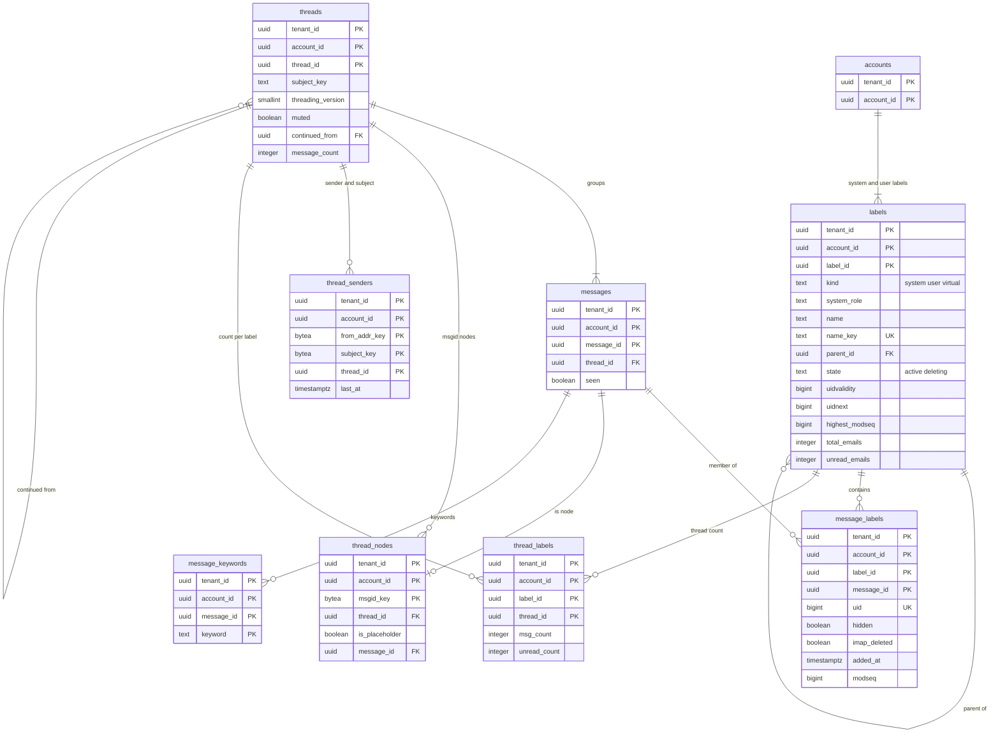

# Data model: ラベル・所属・スレッド

[data-model.md](../data-model.md) の一部。規約はそちらの 3 節に従う。振る舞いは [mailbox-model-labels-and-threads.md](../mailbox-model-labels-and-threads.md)（4〜7 節）と [client-sync-and-protocols.md](../client-sync-and-protocols.md)（6・7 節）を正とする。決定は [ADR-0004](../../decisions/0004-labels-as-primary-mailbox-model.md)（ラベルが正）、[ADR-0005](../../decisions/0005-threading-algorithm.md)・[ADR-0034](../../decisions/0034-threading-implementation-and-merge.md)（スレッド化と合わせ）、[ADR-0033](../../decisions/0033-label-operations-decision-table.md)（DT-MBX）、[ADR-0040](../../decisions/0040-imap-label-mailbox-mapping.md)（IMAP の対応）。

| 表 | 置き場所 | 書く |
| --- | --- | --- |
| `labels` | メールボックスのシャード `public` | `mailstore`（アカウントの作成でシステムのラベルの行を作る） |
| `message_labels` | 同上 | `mailstore` の `apply_label_op` だけ |
| `threads`・`thread_nodes`・`thread_senders`・`thread_labels` | 同上 | `mailstore.deliver`（`crates/threading` の純粋な関数の結果） |
| `message_keywords` | 同上 | `mailstore` |

- 所属を変えるのは `apply_label_op`（DT-MBX の 15 行）だけで、同じトランザクションで `modseq`・change log・`labels` の件数・`thread_labels` を書く（[ADR-0006](../../decisions/0006-sync-protocol-jmap-imap-and-modseq.md)）。
- 既読はラベルでなく `messages.seen`。スターは `STARRED` のラベル（JMAP では `$flagged`）。

## 1. ER 図

- `labels ||--o{ labels`：利用者のラベルの入れ子（`parent_id`、任意）。
- `messages ||--o| thread_nodes`：届いた節は 1 つのメッセージを指す。仮の節（`is_placeholder`）は `message_id` を持たない。同じ `Message-ID` の 2 通目は節を作らない（最初の 1 通を指す）。
- `threads ||--o{ threads`：`continued_from`（100 通で続きのスレッド、任意）。
- 役 `all` の箱は `kind = virtual` の `labels` の行（固定の `label_id`）で、`message_labels` の行を持たない。所属は「`SPAM`・`TRASH`・`SCHEDULED` を持たない」で決まり、IMAP の UID は `all_mail_uids` に持つ（[change-log-and-sync.md](change-log-and-sync.md) の 2.4 節）。

## 2. 表

### 2.1 `labels`

| 列 | 型 | NULL | 既定 | 説明 |
| --- | --- | --- | --- | --- |
| `tenant_id`・`account_id` | `uuid` | NOT NULL | — | |
| `label_id` | `uuid` | NOT NULL | `uuidv7()` | 名前の変更で変わらない。役 `all` は固定の `00000000-0000-7000-8000-000000000001`（D-9） |
| `kind` | `text` | NOT NULL | — | `system`・`user`・`virtual` |
| `system_role` | `text` | NULL | — | `inbox`・`sent`・`drafts`・`junk`・`trash`・`flagged`（`STARRED`）・`important`・`scheduled`・`snoozed`・`all` |
| `name` | `text` | NOT NULL | — | 利用者のラベルは NFC、1〜225 文字、`/` で入れ子。システムのラベルは役の名前 |
| `name_key` | `text` | NOT NULL | — | NFC と大文字小文字の畳み込みをした最後の段の名前 |
| `parent_id` | `uuid` | NULL | — | |
| `color` | `text` | NULL | — | `#rrggbb` |
| `state` | `text` | NOT NULL | `'active'` | `active`・`deleting`（所属を背景で外す間） |
| `uidvalidity` | `bigint` | NOT NULL | — | 作成の時刻から作る 32 ビットの値。作り直しのときだけ変わる |
| `uidnext` | `bigint` | NOT NULL | `1` | 次に振る UID |
| `uid_jump_floor` | `bigint` | NULL | — | 切り替えで跳ばした範囲の上の端（[ADR-0039](../../decisions/0039-change-log-states-and-jmap-changes.md)） |
| `highest_modseq` | `bigint` | NOT NULL | — | IMAP の `HIGHESTMODSEQ`。その箱の変更と同じトランザクションで上げる |
| `total_emails`・`unread_emails`・`total_threads`・`unread_threads` | `integer` | NOT NULL | `0` | 見える所属だけを数える |
| `modseq` | `bigint` | NOT NULL | — | ラベルの行（名前・色・状態）の最後の変更 |
| `created_at` | `timestamptz` | NOT NULL | `now()` | |

- キー：PK `(tenant_id, account_id, label_id)`。UK `(tenant_id, account_id, parent_id, name_key) NULLS NOT DISTINCT WHERE state = 'active'`。UK `(tenant_id, account_id, system_role) WHERE system_role IS NOT NULL`。FK `(tenant_id, account_id, parent_id)` → 自分。
- 索引：`(state) WHERE state = 'deleting'` — X4 の発見の索引（背景の所属の外し）。
- CHECK：`kind IN (…)`、`(kind = 'user') = (system_role IS NULL)`、`state IN (…)`、`uidnext BETWEEN 1 AND 4294967295`、`uidvalidity BETWEEN 1 AND 4294967295`、件数 `>= 0`。利用者のラベルは 1 アカウント 5,000 まで（トリガー）。名前の予約（`INBOX`、`[<Brand>]` で始まるもの）を拒む。
- `uidnext` と `highest_modseq` は下げる更新をトリガーで拒む。
- S1 の量：システムのラベル 10 行 × 100 万 ＋ 利用者のラベル平均 20 で、約 3,000 万行。

### 2.2 `message_labels`

ラベルの所属。ADR-0004 の `added_modseq` は、所属の最後の変更の `modseq` の列として持つ（D-3）。

| 列 | 型 | NULL | 既定 | 説明 |
| --- | --- | --- | --- | --- |
| `tenant_id`・`account_id` | `uuid` | NOT NULL | — | |
| `label_id`・`message_id` | `uuid` | NOT NULL | — | |
| `uid` | `bigint` | NULL | — | その箱の UID。見える所属を得るたびに `labels.uidnext` から振る。隠した所属は NULL |
| `hidden` | `boolean` | NOT NULL | `false` | `SPAM`・`TRASH` を持つ間の他の所属 |
| `imap_deleted` | `boolean` | NOT NULL | `false` | 所属ごとの `\Deleted` |
| `received_at` | `timestamptz` | NOT NULL | — | `messages.received_at` の写し（不変。箱の一覧の並び） |
| `added_at` | `timestamptz` | NOT NULL | `now()` | 所属を得た時刻（`INBOX` の `<brand>:inboxAt`。スヌーズから戻すと今） |
| `modseq` | `bigint` | NOT NULL | — | 所属の最後の変更（付けた、隠した、`\Deleted`）。箱の `MODSEQ` は `max(messages.modseq, この値)` |

- キー：PK `(tenant_id, account_id, label_id, message_id)`。UK `(tenant_id, account_id, label_id, uid)`（NULL を除く）。FK → `labels`、`messages`（`CASCADE`）。
- 索引：
  - `(tenant_id, account_id, message_id)` — メッセージのラベルの集合（JMAP の `mailboxIds`）。
  - `(tenant_id, account_id, label_id, received_at DESC) WHERE NOT hidden` — 箱の一覧（`Email/query` の `inMailbox`、IMAP の `SELECT`）。
  - `(tenant_id, account_id, label_id, added_at DESC) WHERE NOT hidden` — `<brand>:inboxAt` の並び。
- CHECK：`hidden = (uid IS NULL)`（見える所属だけが UID を持つ）、`uid BETWEEN 1 AND 4294967295`。`SPAM`・`TRASH` の両方の所属を持つ行の組をトリガーで拒む（[ADR-0004](../../decisions/0004-labels-as-primary-mailbox-model.md) の排他）。
- 所属を失うと（外す・隠す）、同じトランザクションで `imap_vanished` に `(label_id, uid)` を書く。
- S1 の量：3 年後 1 通あたり約 1.7 行で約 460 億行。1 行と索引で約 200 バイトとして約 9 TB（[messages-and-blobs.md](messages-and-blobs.md) の 3.1 節）。

### 2.3 `threads`

| 列 | 型 | NULL | 既定 | 説明 |
| --- | --- | --- | --- | --- |
| `tenant_id`・`account_id` | `uuid` | NOT NULL | — | |
| `thread_id` | `uuid` | NOT NULL | `uuidv7()` | 合わせでは ID の小さい（古い）方を残す |
| `subject_key` | `text` | NOT NULL | — | 作ったときの正規化した件名（`''` は件名なし） |
| `threading_version` | `smallint` | NOT NULL | `1` | 作ったときの規則のバージョン。新しいメッセージはこの規則で正規化し直して比べる |
| `muted` | `boolean` | NOT NULL | `false` | 合わせでは両方が真のときだけ真 |
| `continued_from` | `uuid` | NULL | — | 100 通で作った続きのスレッドの前 |
| `message_count` | `integer` | NOT NULL | `0` | 新しいメッセージを入れるときだけ 100 を見る |
| `placeholder_count` | `integer` | NOT NULL | `0` | 仮の節の数（1,000 を超えたら古いものから捨てる） |
| `last_message_at` | `timestamptz` | NOT NULL | — | 規則 4（同じ差出人・件名、7 日）と一覧の並び |
| `modseq` | `bigint` | NOT NULL | — | |
| `created_at` | `timestamptz` | NOT NULL | `now()` | |

- キー：PK `(tenant_id, account_id, thread_id)`。FK `(tenant_id, account_id, continued_from)` → 自分（`ON DELETE SET NULL`）。
- 合わせ：候補の行を `thread_id` の順に `FOR UPDATE` で取る（[ADR-0034](../../decisions/0034-threading-implementation-and-merge.md)）。消えるスレッドの行は同じトランザクションで消し、change log に `thread_destroyed`。
- CHECK：`message_count >= 0`、`placeholder_count BETWEEN 0 AND 1000`。
- 削除：メッセージがすべて完全に削除されたら、行と節を消す。
- S1 の量：3 年後 1 スレッド平均 2.5 通として約 110 億行。

### 2.4 `thread_nodes`

| 列 | 型 | NULL | 既定 | 説明 |
| --- | --- | --- | --- | --- |
| `tenant_id`・`account_id` | `uuid` | NOT NULL | — | |
| `msgid_key` | `bytea` | NOT NULL | — | 正規化した `Message-ID` の SHA-256（32 バイト）。`messages.msgid_hash` と同じ |
| `thread_id` | `uuid` | NOT NULL | — | |
| `is_placeholder` | `boolean` | NOT NULL | — | 届いていない親 |
| `message_id` | `uuid` | NULL | — | 届いた節のメッセージ |
| `created_at` | `timestamptz` | NOT NULL | `now()` | 仮の節を古い順に捨てる |

- キー：PK `(tenant_id, account_id, msgid_key)`。FK → `threads`（`DEFERRABLE`）。
- 索引：`(tenant_id, account_id, thread_id, created_at)` — 合わせの書き換え、仮の節の捨て。
- CHECK：`is_placeholder = (message_id IS NULL)`。
- S1 の量：届いた節（270 億）＋仮の節（1 通あたり平均 0.3）で約 350 億行。1 行と索引で約 120 バイトとして約 4 TB。

### 2.5 `thread_senders`

規則 4（参照のないメールを、同じ差出人・同じ件名・7 日の中で合わせる）の引き。

| 列 | 型 | NULL | 既定 | 説明 |
| --- | --- | --- | --- | --- |
| `tenant_id`・`account_id` | `uuid` | NOT NULL | — | |
| `from_addr_key` | `bytea` | NOT NULL | — | 正規化した差出人のアドレスの SHA-256 |
| `subject_key` | `bytea` | NOT NULL | — | `threads.subject_key` の SHA-256（行を小さくするため値でなくハッシュ） |
| `thread_id` | `uuid` | NOT NULL | — | |
| `last_at` | `timestamptz` | NOT NULL | — | その差出人のそのスレッドの最後のメッセージの時刻 |

- キー：PK `(tenant_id, account_id, from_addr_key, subject_key, thread_id)`。索引：`(tenant_id, account_id, thread_id)` — 合わせの書き換え。
- 削除：`last_at` から 30 日を過ぎた行は、X4 の作業で消す（規則 4 は 7 日しか見ない）。S1 の量：約 15 億行。

### 2.6 `thread_labels`

スレッドの数を数えるための、スレッド × ラベルの所属の数（[mailbox-model-labels-and-threads.md](../mailbox-model-labels-and-threads.md) の 7 節）。

| 列 | 型 | NULL | 既定 | 説明 |
| --- | --- | --- | --- | --- |
| `tenant_id`・`account_id` | `uuid` | NOT NULL | — | |
| `label_id`・`thread_id` | `uuid` | NOT NULL | — | |
| `msg_count` | `integer` | NOT NULL | — | 見える所属のメッセージの数 |
| `unread_count` | `integer` | NOT NULL | — | そのうち未読 |
| `last_received_at` | `timestamptz` | NOT NULL | — | 箱の中のスレッドの一覧（`collapseThreads`）の並び |

- キー：PK `(tenant_id, account_id, label_id, thread_id)`。索引：`(tenant_id, account_id, thread_id)` — 合わせ・スレッドへの操作。`(tenant_id, account_id, label_id, last_received_at DESC)` — スレッドの一覧。
- `msg_count` が 0 になった行は消す（0 から 1 で `labels.total_threads` を 1 足す）。CHECK：`msg_count > 0`、`unread_count BETWEEN 0 AND msg_count`。
- S1 の量：約 200 億行。

### 2.7 `message_keywords`

`$seen`・`$flagged`・`$draft` 以外のキーワード（`$answered`、`$forwarded`、`$junk`、`$notjunk`、`$mdnsent`、利用者のキーワード）。

| 列 | 型 | NULL | 既定 | 説明 |
| --- | --- | --- | --- | --- |
| `tenant_id`・`account_id`・`message_id` | `uuid` | NOT NULL | — | |
| `keyword` | `text` | NOT NULL | — | 小文字にした形（RFC 8621 の 4.1.1 節）。1〜255 文字、`( ) { ] % * " \` と空白を含まない |

- キー：PK `(tenant_id, account_id, message_id, keyword)`。FK → `messages`（`CASCADE`）。
- 上限：1 メッセージ 50、1 アカウントの違うキーワード 1,000（`mailstore` で数える）。`$junk` を `SPAM` に結び付けない。
- S1 の量：送ったメッセージへの返信の `$answered` が主で、約 30 億行。
