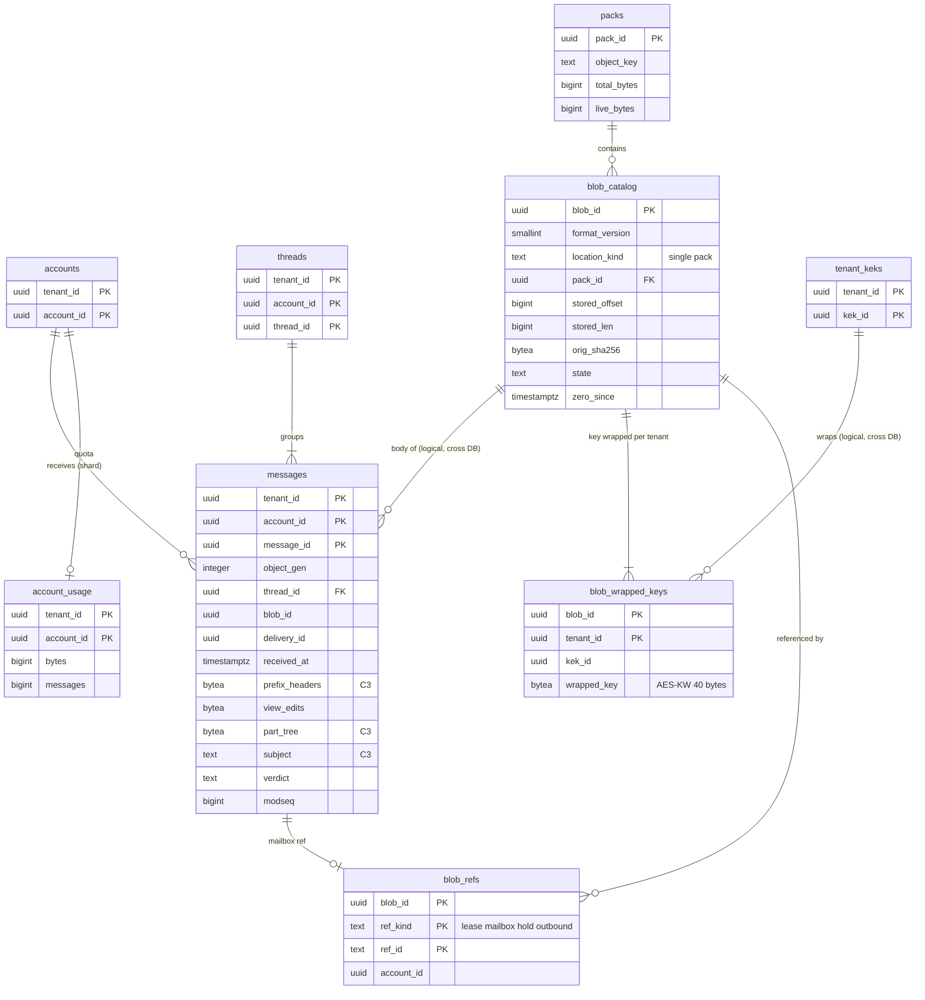

# Data model: メッセージと blob

[data-model.md](../data-model.md) の一部。規約はそちらの 3 節に従う。振る舞いは [message-parsing-and-storage.md](../message-parsing-and-storage.md)（4〜9 節）を正とする。決定は [ADR-0003](../../decisions/0003-message-storage-layout-and-dedupe.md)（保存の形と重複の排除）、[ADR-0029](../../decisions/0029-mime-parsing-limits-and-charsets.md)（解析の上限）、[ADR-0030](../../decisions/0030-blob-format-v1-and-envelope-keys.md)（blob の形式 v1）、[ADR-0031](../../decisions/0031-blob-references-gc-and-quota.md)（参照・GC・容量）、[ADR-0032](../../decisions/0032-served-view-edits.md)（配る形）。blob とパックのバイトの並びは [stores.md](stores.md) の 2 節。

| 表 | 置き場所 | 書く |
| --- | --- | --- |
| `messages` | メールボックスのシャード `public` | `mailstore` だけ |
| `account_usage` | メールボックスのシャード `public` | `mailstore`（変更と同じトランザクション） |
| `blob_catalog`・`blob_wrapped_keys`・`blob_refs`・`packs` | blob の目録のシャード（RLS なし。ADR-0007 の X5） | `inbound-pipeline`・`mailstore`（作成と lease）、`blob-ref-applier`（outbox の参照の増減）、`blob-packer`、`blob-gc` |

- メッセージの行は受け手ごと（同じ配送の 3 人の受け手には 3 行）。blob は同じ配送の受け手の間で 1 つ（[ADR-0003](../../decisions/0003-message-storage-layout-and-dedupe.md)）。
- blob の目録はメールの中身・件名・アドレスを持たない（場所、長さ、ハッシュ、包んだ鍵、参照だけ）。`blob_refs.account_id` は `mailbox` の参照の確かめに使う ID で、中身ではない。

## 1. ER 図

- `blob_catalog ||--o{ messages`：別の DB をまたぐ論理の参照。`mailbox` の参照の行（`blob_refs`）が、どのメッセージの行が blob を指すかを目録の側に持つ。
- `messages ||--o| blob_refs`：配送・送信のコミットの outbox で 1 行足し、完全な削除・期限の消去のコミットの outbox で外す。届く前と外した後は 0（任意）。
- `packs ||--o{ blob_catalog`：`location_kind = pack` の行だけが `pack_id` を持つ（任意の参照）。

## 2. 表

### 2.1 `messages`

受け手ごとのメッセージの行。ヘッダーの要約・パートの木・前置きなど、表示と同期に要る C3 のメタデータを持つ。本文のバイトは blob にある。

| 列 | 型 | NULL | 既定 | 説明 |
| --- | --- | --- | --- | --- |
| `tenant_id`・`account_id` | `uuid` | NOT NULL | — | |
| `message_id` | `uuid` | NOT NULL | `uuidv7()` | 中の ID。JMAP の Email の ID と `EMAILID` は `(message_id, object_gen)` から作る（[stores.md](stores.md) の 7 節） |
| `object_gen` | `integer` | NOT NULL | `0` | オブジェクトの世代。スレッドの合わせ（[ADR-0034](../../decisions/0034-threading-implementation-and-merge.md)）と配った後の編集（[ADR-0032](../../decisions/0032-served-view-edits.md)）で 1 進める |
| `thread_id` | `uuid` | NOT NULL | — | 変えない。合わせで移るときは `object_gen` を進めて移す |
| `blob_id` | `uuid` | NOT NULL | — | 本文の blob（目録のシャード） |
| `origin` | `text` | NOT NULL | — | `inbound`・`internal`（本システムの中の送信の受け手）・`submission`（自分の下書き・送信）・`append`（IMAP の `APPEND`）・`system`（DSN・知らせ） |
| `delivery_id` | `uuid` | NULL | — | `spool_id` か `submission_id`（`inbound`・`internal`）。`delivery_log` と同じ値 |
| `submission_id` | `uuid` | NULL | — | 自分の送信（`origin = submission`） |
| `received_at` | `timestamptz` | NOT NULL | — | 受け付けの時刻（送信は送った時刻、`APPEND` は引数の時刻）。検索の `after:`・`before:` と保持の規則の起点 |
| `sent_at` | `timestamptz` | NULL | — | `Date` ヘッダー（JMAP の `sentAt`） |
| `size_logical` | `bigint` | NOT NULL | — | 前置き＋元のバイト（容量の数え。ADR-0031） |
| `view_size` | `bigint` | NOT NULL | — | 配る形の大きさ（IMAP の `RFC822.SIZE`、JMAP の `size`） |
| `prefix_headers` | `bytea` | NOT NULL | — | 受け手ごとの前置き（`Received`、`Authentication-Results`、`Delivered-To`、`ARC-*`）。平均 400 バイト |
| `view_edits` | `bytea` | NULL | — | 編集の表（Protobuf `ViewEdits`。[stores.md](stores.md) の 2.4 節）。多くは NULL |
| `part_tree` | `bytea` | NOT NULL | — | パートの木（Protobuf `PartTree`、zstd。平均 400 バイト。[message-parsing-and-storage.md](../message-parsing-and-storage.md) の 5.3 節）。パートごとの `scan_result`・`blocked`・`scan_version` を含む（[attachment-and-url-scanning.md](../attachment-and-url-scanning.md) の 11 節） |
| `parse_flags` | `integer` | NOT NULL | `0` | 解析の理由のコードのビット（`mime_too_deep` など。登録簿は開発リポジトリの `formats/`） |
| `charset_flags` | `smallint` | NOT NULL | `0` | `charset_mismatch`・推定の有無 |
| `has_attachment` | `boolean` | NOT NULL | `false` | |
| `subject` | `text` | NOT NULL | `''` | 復号した件名（C3。998 文字で切る） |
| `from_addr` | `text` | NULL | — | 最初の `From` の正規化したアドレス（C3） |
| `header_summary` | `bytea` | NOT NULL | — | Protobuf `HeaderSummary`：表示の名前つきの `From`・`Sender`・`Reply-To`・`To`・`Cc`・`Bcc`（送信だけ）、`Message-ID`、`In-Reply-To`、`References`（100 まで）、`List-Id`、`List-Unsubscribe` の要約 |
| `msgid_hash` | `bytea` | NULL | — | 正規化した `Message-ID` の SHA-256（スレッドの節の鍵と同じ値） |
| `preview` | `text` | NOT NULL | `''` | 抜粋（256 文字） |
| `seen` | `boolean` | NOT NULL | `false` | `$seen` |
| `inbox_before_hide` | `boolean` | NOT NULL | `false` | DT-MBX の `H` |
| `trash_at`・`spam_at` | `timestamptz` | NULL | — | 30 日の期限の起点（[ADR-0033](../../decisions/0033-label-operations-decision-table.md)） |
| `snooze_until` | `timestamptz` | NULL | — | スヌーズの時刻 |
| `thread_flags` | `smallint` | NOT NULL | `0` | bit0 `suspicious_join`（[mailbox-model-labels-and-threads.md](../mailbox-model-labels-and-threads.md) の 6.7 節） |
| `verdict` | `text` | NULL | — | `inbox`・`inbox_warn`・`spam`・`spam_phish`。自分の送信・下書きは NULL |
| `reason_codes` | `text[]` | NOT NULL | `'{}'` | 3 つまで |
| `p_spam`・`p_phish` | `real` | NULL | — | |
| `filter_version` | `integer` | NULL | — | 判定したバージョン |
| `feature_id` | `uuid` | NULL | — | 特徴の記録（[spam-and-scanning.md](spam-and-scanning.md) の 3.1 節）。30 日を過ぎたら記録は消えるが列は残す |
| `rescan_state` | `text` | NOT NULL | `'none'` | `none`・`pending`（層が欠けた）・`done` |
| `attachment_blocked` | `boolean` | NOT NULL | `false` | 止めた添付がある（重ねる印。`view_edits` に `replace_blocked_part` がある） |
| `attachment_warn` | `boolean` | NOT NULL | `false` | 警告の添付がある |
| `url_warn` | `text` | NOT NULL | `'none'` | `none`・`warn`・`post_delivery_phish` |
| `unsubscribe_kind` | `text` | NULL | — | `one_click`・`mailto`（一括の配信停止のボタンを出せる条件を満たした。[sender-authentication.md](../sender-authentication.md) の 10.1 節） |
| `modseq` | `bigint` | NOT NULL | — | 最後に変わった `modseq` |

- キー：PK `(tenant_id, account_id, message_id)`。FK `(tenant_id, account_id, thread_id)` → `threads`（`DEFERRABLE INITIALLY DEFERRED`。合わせで同じトランザクションの中で書き換えるため）。
- 索引：
  - `(tenant_id, account_id, thread_id, received_at)` — スレッドの表示、スレッドへの操作。
  - `(tenant_id, account_id, received_at DESC)` — 役 `all` の箱の一覧、保持の規則の期限の処理（`(account_id, received_at)`。[retention-and-ediscovery.md](../retention-and-ediscovery.md) の 4.2 節）。
  - `(tenant_id, account_id, submission_id) WHERE submission_id IS NOT NULL` — 送信の依頼からメッセージを引く。
  - `(trash_at) WHERE trash_at IS NOT NULL`、`(spam_at) WHERE spam_at IS NOT NULL` — X4 の発見の索引（[data-model.md](../data-model.md) の 3.4 節）。期限の作業がアカウントをまたいで期限の来た行の ID だけを引く。
  - `(tenant_id, account_id, snooze_until) WHERE snooze_until IS NOT NULL` — スヌーズの一覧（起こしは `timers`）。
- CHECK：`object_gen >= 0`、`origin IN (…)`、`verdict IN (…)`、`rescan_state IN (…)`、`url_warn IN (…)`、`cardinality(reason_codes) <= 3`、`NOT (trash_at IS NOT NULL AND spam_at IS NOT NULL)`（迷惑メールとゴミ箱の排他。[ADR-0004](../../decisions/0004-labels-as-primary-mailbox-model.md)）、`origin NOT IN ('inbound','internal') OR delivery_id IS NOT NULL`。
- RLS：`tenant_id`・`account_id` で FORCE RLS。X4 の `sys_worker` は `message_id`・`tenant_id`・`account_id`・`trash_at`・`spam_at` の列だけを読める（列の権限と、そのロールだけの `SELECT` のポリシー）。
- 削除：行を消す（論理の削除の列を持たない）。保留・保持の規則に当たれば、同じトランザクションで `preserved_messages` へ移す（[retention-holds-and-ediscovery.md](retention-holds-and-ediscovery.md) の 2.6 節）。消したら outbox に `message.destroyed` と `blob.ref_removed`。
- S1 の量：3 年後 270 億行（1 シャード約 34 億行）。1 行の大きさは 3.1 節。

### 2.2 `account_usage`

| 列 | 型 | NULL | 既定 | 説明 |
| --- | --- | --- | --- | --- |
| `tenant_id`・`account_id` | `uuid` | NOT NULL | — | |
| `bytes` | `bigint` | NOT NULL | `0` | `messages.size_logical` の和（迷惑メール・ゴミ箱・下書き・予約の送信を含む。保全の行を含まない） |
| `messages` | `bigint` | NOT NULL | `0` | 行の数 |
| `quota_state` | `text` | NOT NULL | `'ok'` | 写しの元（100% で `over`、95% 未満で `ok`）。変わったら outbox `account.quota_changed` で directory の `accounts.quota_state` へ |
| `updated_modseq` | `bigint` | NOT NULL | `0` | |
| `reconciled_at` | `timestamptz` | NULL | — | 毎週の照らし合わせ |

- キー：PK `(tenant_id, account_id)`。メールボックスの変更と同じトランザクションで足し引きする（[ADR-0031](../../decisions/0031-blob-references-gc-and-quota.md)）。CHECK：`bytes >= 0`、`messages >= 0`。
- S1 の量：100 万行。

### 2.3 `blob_catalog`

blob の場所と状態。目録のシャードは `blob_id` のハッシュで分ける（S1 で 4）。

| 列 | 型 | NULL | 既定 | 説明 |
| --- | --- | --- | --- | --- |
| `blob_id` | `uuid` | NOT NULL | — | 配送の鍵から決める（`UUIDv7(spool_id の時刻) ＋ HMAC の下位`）。作成は冪等 |
| `format_version` | `smallint` | NOT NULL | `1` | blob の形式（[stores.md](stores.md) の 2.1 節） |
| `location_kind` | `text` | NOT NULL | `'single'` | `single`・`pack` |
| `object_key` | `text` | NOT NULL | — | `blobs/<shard>/<yyyy>/<mm>/<dd>/<blob_id>` か `packs/<shard>/…/<pack_id>` |
| `pack_id` | `uuid` | NULL | — | `pack` のとき |
| `stored_offset` | `bigint` | NOT NULL | `0` | オブジェクトの中の位置（`single` は 0） |
| `stored_len` | `bigint` | NOT NULL | — | 頭とフレームの合計 |
| `orig_len` | `bigint` | NOT NULL | — | 元のバイトの長さ |
| `orig_sha256` | `bytea` | NOT NULL | — | 元のバイトの SHA-256（照合と破損の検出。ID と探し方には使わない） |
| `state` | `text` | NOT NULL | `'leased'` | `leased`・`live`・`zero`・`shredded`・`purged`（[message-parsing-and-storage.md](../message-parsing-and-storage.md) の 8.2 節） |
| `zero_since` | `timestamptz` | NULL | — | 参照が 0 になった時刻 |
| `shredded_at` | `timestamptz` | NULL | — | 包んだ鍵を消した時刻（NFR-015 の 24 時間） |
| `created_at` | `timestamptz` | NOT NULL | `now()` | |

- キー：PK `(blob_id)`。
- 索引：`(state, zero_since) WHERE state = 'zero'` — 1 時間の確かめと鍵の破棄。`(state, shredded_at) WHERE state = 'shredded'` — 7 日の後の物理の消去。`(location_kind, created_at) WHERE location_kind = 'single' AND stored_len < 262144` — パックへの詰め直しの候補。`(pack_id) WHERE pack_id IS NOT NULL` — パックの詰め直し。
- CHECK：`location_kind IN (…)`、`state IN (…)`、`(location_kind = 'pack') = (pack_id IS NOT NULL)`、`state <> 'zero' OR zero_since IS NOT NULL`、`orig_len >= 0`。
- 遷移はトリガーで `leased → live → zero → shredded → purged` と `zero → live`（確かめで参照が見つかったとき）だけを許す。
- RLS：なし（X5）。ロール：`blob_writer`（作成）、`blob_ref_applier`（`blob_refs` と `state`・`zero_since`）、`blob_packer`（場所の列だけ）、`blob_gc`（`state` と鍵の削除）。
- 削除：`purged` の行は 30 日の後に消す（S3 のバージョンの期限に合わせる。法務の L6）。
- S1 の量：3 年後約 250 億行 × 約 200 バイト ≒ 5 TB（[capacity.md](../capacity.md) の 1.3 節。1 シャード約 1.25 TB）。

### 2.4 `blob_wrapped_keys`

テナントごとに包んだ blob の鍵。1 つの blob を複数のテナントの受け手が参照するとき、テナントの数だけ行がある。

| 列 | 型 | NULL | 既定 | 説明 |
| --- | --- | --- | --- | --- |
| `blob_id` | `uuid` | NOT NULL | — | |
| `tenant_id` | `uuid` | NOT NULL | — | |
| `kek_id` | `uuid` | NOT NULL | — | 包んだ日の KEK（directory の `tenant_keks`） |
| `wrapped_key` | `bytea` | NOT NULL | — | AES-KW（RFC 3394）で包んだ 256 ビットの blob の鍵（40 バイト） |
| `created_at` | `timestamptz` | NOT NULL | `now()` | |

- キー：PK `(blob_id, tenant_id)`。FK → `blob_catalog`（`CASCADE`）。
- 索引：`(tenant_id, kek_id)` — KEK の破棄の前に、包んだ鍵が残るかを `EXISTS` で確かめる。テナントの消去で、テナントの行をまとめて消す。
- CHECK：`octet_length(wrapped_key) = 40`。
- 鍵の破棄（参照 0 の 1 時間の後）は blob のすべての行を消す。テナントの消去はそのテナントの行だけを消す（他のテナントの受け手は読める。[ADR-0003](../../decisions/0003-message-storage-layout-and-dedupe.md)）。
- S1 の量：約 260 億行（組織の外の宛先との共有で blob の数の 1.05 倍）。

### 2.5 `blob_refs`

参照の行の集合。数を増減せず、行の挿入・削除で冪等にする（[ADR-0031](../../decisions/0031-blob-references-gc-and-quota.md)）。

| 列 | 型 | NULL | 既定 | 説明 |
| --- | --- | --- | --- | --- |
| `blob_id` | `uuid` | NOT NULL | — | |
| `ref_kind` | `text` | NOT NULL | — | `lease`・`mailbox`・`hold`・`outbound` |
| `ref_id` | `text` | NOT NULL | — | `lease`：`spool:<spool_id>` か `submission:<submission_id>`。`mailbox`：`<message_id>`。`hold`：`hold:<tenant_id>:<message_id>`。`outbound`：`<submission_id>` |
| `tenant_id`・`account_id` | `uuid` | NULL | — | `mailbox`・`hold` のとき。1 時間の確かめでメールボックスのシャードを引く |
| `added_at` | `timestamptz` | NOT NULL | `now()` | |

- キー：PK `(blob_id, ref_kind, ref_id)`。足すのは `INSERT … ON CONFLICT DO NOTHING`、外すのは `DELETE`（0 行でも成功）。
- 外した結果その blob の行が 0 になったら、同じトランザクションで `blob_catalog.state = 'zero'`、`zero_since = now()`。
- CHECK：`ref_kind IN (…)`、`ref_kind NOT IN ('mailbox','hold') OR account_id IS NOT NULL`。
- S1 の量：約 270 億行（`mailbox` がほとんど）。

### 2.6 `packs`

| 列 | 型 | NULL | 既定 | 説明 |
| --- | --- | --- | --- | --- |
| `pack_id` | `uuid` | NOT NULL | `uuidv7()` | |
| `object_key` | `text` | NOT NULL | — | `packs/<shard>/<yyyy>/<mm>/<dd>/<pack_id>` |
| `total_bytes` | `bigint` | NOT NULL | — | 目次を除いた blob の暗号文の合計 |
| `live_bytes` | `bigint` | NOT NULL | — | 鍵が残る blob の `stored_len` の和（鍵の破棄で減らす） |
| `blob_count` | `integer` | NOT NULL | — | |
| `state` | `text` | NOT NULL | `'live'` | `live`・`rewriting`・`retired`（中身を新しいパックへ移した。7 日の後にオブジェクトを消す） |
| `created_at` | `timestamptz` | NOT NULL | `now()` | |
| `retired_at` | `timestamptz` | NULL | — | |

- キー：PK `(pack_id)`。
- 索引：`((live_bytes::float8 / total_bytes)) WHERE state = 'live'` — 50% を下回ったパックの詰め直し。`(state, retired_at) WHERE state = 'retired'` — オブジェクトの消去。
- CHECK：`live_bytes BETWEEN 0 AND total_bytes`、`state IN (…)`。
- S1 の量：1 日約 1 万個、3 年で約 1,000 万行。

## 3. 大きさの見積もり

### 3.1 メッセージの行

列からの初期の見積もり（`mailbox-shard-poc` で測って置き換える）。

| 部分 | バイト |
| --- | --- |
| 固定の列（ID 7 つ、時刻、大きさ、旗、判定、`modseq`）と行の頭 | 約 300 |
| `subject`・`from_addr` | 約 100 |
| `header_summary` | 約 250 |
| `preview`（日本語 256 文字） | 約 600 |
| `part_tree` | 約 400 |
| `prefix_headers` | 約 400 |
| 索引 5 つ | 約 250 |
| 合計 | 約 2.3 KB |

- 3 年後の 270 億行で約 62 TB。所属（`message_labels`、1 通あたり 1.7 行、索引を含めて 1 行約 200 バイト）で約 9 TB、スレッドの表（`threads`・`thread_nodes`・`thread_labels`）で約 7 TB を足して、約 78 TB になる。[capacity.md](../capacity.md) の 1.3 節の最初の見積もり（1 行 600 バイトで 16 TB）の約 5 倍で、capacity.md と [README.md](../README.md) の 2 節をこの値に直した。1 シャード約 10 TB で、段階を上げる準備の基準（1 シャード 2.5 TB。[ADR-0065](../../decisions/0065-stage-up-criteria-and-cells.md)）を 1 年目の後半に超える。Aurora の保存の費用は東京と大阪で 3 年目に月 約 3.3 万 USD 増える。シャードの数と下の減らす手段は、`mailbox-shard-poc` の後に決める未解決事項に残した（data-model.md の 9 節）。
- 減らす候補（採否は `mailbox-shard-poc` の後に Dev と Ops）：`preview` を 100 文字にする（約 350 バイト減）、`prefix_headers` と `header_summary` を zstd でまとめて 1 つの列にする、`part_tree` の葉の少ないメッセージ（多くは 1〜3 パート）を短い形にする。
