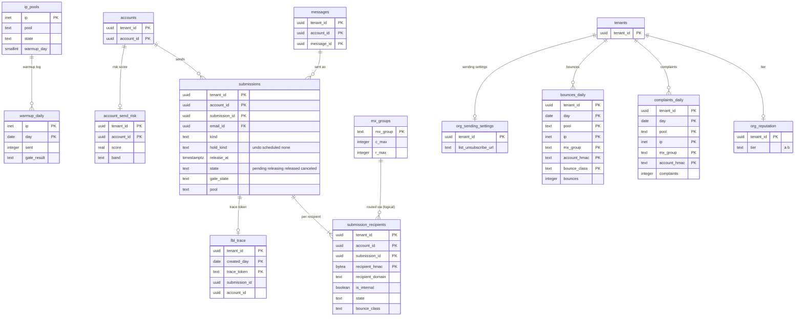

# Data model: 送信の依頼・待ち行列・評判

[data-model.md](../data-model.md) の一部。規約はそちらの 3 節に従う。振る舞いは [outbound-smtp-and-reputation.md](../outbound-smtp-and-reputation.md)（4〜11 節）、[filters-forwarding-and-automation.md](../filters-forwarding-and-automation.md)（7 節）、[client-sync-and-protocols.md](../client-sync-and-protocols.md)（6.6 節）を正とする。決定は [ADR-0018](../../decisions/0018-outbound-ip-pools-and-warmup.md)（IP プール）、[ADR-0019](../../decisions/0019-mta-out-queues-throttling-and-retries.md)（待ち行列と再試行）、[ADR-0020](../../decisions/0020-bounces-dsn-srs-and-feedback-loops.md)（不達・SRS・FBL）、[ADR-0021](../../decisions/0021-sending-limits-and-compromised-account-detection.md)（上限と乗っ取り）、[ADR-0049](../../decisions/0049-timed-jobs-vacation-and-scheduled-send.md)（解放）。待ち行列の項目 `delivery_job` は SQS のメッセージで、形は [stores.md](stores.md) の 4.2 節。

| 表 | 置き場所 | 書く |
| --- | --- | --- |
| `submissions`・`submission_recipients` | メールボックスのシャード `public` | `mailstore`（作成・取り消し・解放）、`outbound-gate`（関門の状態）、`mta-out`（宛先ごとの結果を `mailstore` の API で） |
| `account_send_risk` | メールボックスのシャード `public` | `outbound-gate` |
| `ip_pools`・`warmup_daily`・`mx_groups` | directory `sys` | 運用、ウォームアップの作業 |
| `org_reputation`・`complaints_daily`・`bounces_daily`・`org_sending_settings` | directory `public` | `report-ingest`、評判の作業（X4 の形でテナントごとに）、`admin-api` |
| `fbl_trace` | directory `public` | `outbound-gate`（書く）、`report-ingest`（X9 の `report_lookup` で引く） |

- 宛先ごとの状態の正本は `submission_recipients`。SQS の `delivery_job` を失っても、この表から作り直せる（[ADR-0019](../../decisions/0019-mta-out-queues-throttling-and-retries.md)）。
- 宛先のアドレスの平文は `submissions.envelope_enc`（列の暗号化）だけにあり、`submission_recipients` と SQS の `delivery_job` は HMAC とドメインだけを持つ（D-31）。
- プール・IP ごとの苦情と不達の率（NFR-012）は AMP の指標（`mail_outbound_complaints_total{pool,ip}` など）で見る。表はテナントごとの数だけを持ち、テナントをまたいで引かない（D-17）。

## 1. ER 図

- `messages ||--o{ submissions`：1 つの下書き（メッセージ）から 1 つの送信。取り消して送り直すと 2 つ目の送信になる。
- `submissions ||--o| fbl_trace`：外の宛先のある送信だけが行を持つ（任意）。directory とシャードの間の論理の参照。
- `mx_groups ||--o{ submission_recipients`：`submission_recipients.mx_group` は論理の参照（別の DB）。

## 2. 表

### 2.1 `submissions`

送信の依頼（JMAP の `EmailSubmission`、SMTP の submission、転送・不在の返信・DSN の送り）。

| 列 | 型 | NULL | 既定 | 説明 |
| --- | --- | --- | --- | --- |
| `tenant_id`・`account_id` | `uuid` | NOT NULL | — | 送信者 |
| `submission_id` | `uuid` | NOT NULL | `uuidv7()` | |
| `email_id` | `uuid` | NOT NULL | — | 送るメッセージの行（`messages.message_id`） |
| `blob_id` | `uuid` | NOT NULL | — | 送る blob（lease は `submission:<submission_id>`） |
| `kind` | `text` | NOT NULL | `'user'` | `user`・`forward`・`vacation`・`dsn`・`group_external` |
| `source` | `text` | NOT NULL | — | `jmap`・`smtp`・`system` |
| `identity_id` | `uuid` | NULL | — | From に使ったアドレス（`addresses.address_id` か `send_as_identities.identity_id`） |
| `envelope_enc` | `bytea` | NOT NULL | — | Protobuf `SubmissionEnvelope`（`MAIL FROM`（SRS の形を含む）、宛先のアドレスの列（Bcc を含む）、`HOLDUNTIL`・`HOLDFOR`）を列の暗号化で持つ（C3。D-31）。`mta-out` は送る時に `mailstore` から送信者の文脈で読む |
| `rcpt_count` | `integer` | NOT NULL | — | 送信の上限に数える宛先の数（中の宛先を含む） |
| `hold_kind` | `text` | NOT NULL | — | `undo`（元に戻す送信の窓）・`scheduled`（FUTURERELEASE）・`none` |
| `release_at` | `timestamptz` | NOT NULL | — | 解放の時刻（JMAP の `<brand>:releaseAt`） |
| `undo_status` | `text` | NOT NULL | `'pending'` | `pending`・`final`・`canceled` |
| `state` | `text` | NOT NULL | `'pending'` | `pending`・`releasing`・`released`・`canceled`（[filters-forwarding-and-automation.md](../filters-forwarding-and-automation.md) の 7.3 節） |
| `gate_state` | `text` | NULL | — | `pending`・`released`・`held`・`rejected_limit`・`canceled` |
| `gate_reason` | `text` | NULL | — | 理由のコード（`sending_limit`、`takeover_suspected` など） |
| `pool` | `text` | NULL | — | 選んだプール（DT-OUT-001） |
| `risk_score` | `real` | NULL | — | 解放の時の乗っ取りの点 |
| `outbound_verdict` | `text` | NULL | — | `pass`・`suspect`・`block` |
| `signed_blob_prefix` | `bytea` | NULL | — | DKIM の署名のヘッダーと、7 ビットに直したときの前置き（1 回だけ署名） |
| `created_modseq` | `bigint` | NOT NULL | — | |
| `released_at` | `timestamptz` | NULL | — | 関門を通った時刻 |
| `created_at`・`updated_at` | `timestamptz` | NOT NULL | `now()` | |

- キー：PK `(tenant_id, account_id, submission_id)`。FK `(tenant_id, account_id, email_id)` → `messages`。
- 索引：`(tenant_id, account_id, release_at) WHERE state = 'pending'` — 送信の保留の一覧。`(tenant_id, account_id) WHERE state = 'pending' AND hold_kind = 'scheduled'` — 予約 100 通の数え。`(tenant_id, account_id, released_at) WHERE gate_state = 'released'` — 送信の上限の数え直し（Valkey の桶を失ったとき、直近 24 時間）。
- CHECK：`hold_kind IN (…)`、`state IN (…)`、`undo_status IN (…)`、`gate_state IN (…)`、`hold_kind <> 'scheduled' OR release_at <= created_at + interval '366 days'`、`state <> 'released' OR released_at IS NOT NULL`。
- 遷移：取り消しと解放は `WHERE state = 'pending'` の条件つきの更新で競う。`released`・`canceled` からの更新はトリガーで拒む（宛先ごとの状態は `submission_recipients`）。
- `timers`（`submission_release`）を同じトランザクションで書く（[filters-forwarding-and-timers.md](filters-forwarding-and-timers.md) の 2.6 節）。
- 削除：すべての宛先が終わり、30 日を過ぎた行を消す（X4）。送信済みのメッセージは残る。S1 の量：1 日 300 万行、常に約 1 億行。

### 2.2 `submission_recipients`

| 列 | 型 | NULL | 既定 | 説明 |
| --- | --- | --- | --- | --- |
| `tenant_id`・`account_id`・`submission_id` | `uuid` | NOT NULL | — | |
| `recipient_hmac` | `bytea` | NOT NULL | — | 宛先のアドレスの送信者のテナントのアドレスの鍵の HMAC |
| `recipient_domain` | `text` | NOT NULL | — | |
| `is_internal` | `boolean` | NOT NULL | — | 本システムの中の宛先（MTA を通らない） |
| `mx_group` | `text` | NULL | — | 外の宛先の組 |
| `state` | `text` | NOT NULL | `'queued'` | `queued`・`delivered`・`deferred`・`bounced`・`expired`・`canceled` |
| `bounce_class` | `text` | NULL | — | 11 の種類（[ADR-0020](../../decisions/0020-bounces-dsn-srs-and-feedback-loops.md)） |
| `status_code` | `text` | NULL | — | 拡張の状態のコード（`5.1.1` など）。応答の文は持たない |
| `attempts` | `smallint` | NOT NULL | `0` | |
| `first_attempt_at`・`last_attempt_at` | `timestamptz` | NULL | — | 5 日の期限の起点 |
| `delayed_notified` | `boolean` | NOT NULL | `false` | 24 時間の遅れの DSN を送った |
| `dsn_submission_id` | `uuid` | NULL | — | 送信者へ配った DSN |

- キー：PK `(tenant_id, account_id, submission_id, recipient_hmac)`。FK → `submissions`（`CASCADE`）。
- 索引：`(tenant_id, account_id, submission_id) WHERE state IN ('queued','deferred')` — 終わっていない宛先（送信の待ちの参照を外す判定）。`(first_attempt_at) WHERE state IN ('queued','deferred')` — 毎時の突き合わせ（SQS の欠けの作り直し）の X4 の発見の索引。
- CHECK：`state IN (…)`、`state <> 'bounced' OR bounce_class IS NOT NULL`。終わった状態（`delivered`・`bounced`・`expired`・`canceled`）から動かさない（トリガー）。
- S1 の量：1 日約 600 万行（1 通 2 宛先）、30 日で約 1.8 億行。

### 2.3 `account_send_risk`

| 列 | 型 | NULL | 既定 | 説明 |
| --- | --- | --- | --- | --- |
| `tenant_id`・`account_id` | `uuid` | NOT NULL | — | |
| `score` | `real` | NOT NULL | — | 0〜1 |
| `model_version` | `integer` | NOT NULL | — | `risk_version` |
| `signals` | `jsonb` | NOT NULL | — | 理由のコードと値（サインインの危険、量の急変、新しい宛先の割合、苦情など） |
| `band` | `text` | NOT NULL | — | `low`・`suspect`（0.5〜0.7）・`verify`（0.7〜0.9）・`hold_all`（0.9 以上） |
| `updated_at` | `timestamptz` | NOT NULL | `now()` | |

- キー：PK `(tenant_id, account_id)`。CHECK：`score BETWEEN 0 AND 1`、`band IN (…)`。S1 の量：送信のあるアカウント約 60 万行。

### 2.4 `ip_pools`

| 列 | 型 | NULL | 既定 | 説明 |
| --- | --- | --- | --- | --- |
| `ip` | `inet` | NOT NULL | — | |
| `pool` | `text` | NOT NULL | — | `personal`・`org-a`・`org-b`・`system`・`forward`・`suspect`・`warmup`・`dr-out` |
| `family` | `smallint` | NOT NULL | — | 4・6 |
| `ptr_name` | `text` | NOT NULL | — | 逆引きと HELO の名前 |
| `state` | `text` | NOT NULL | `'warming'` | `warming`・`active`・`paused`・`retired` |
| `warmup_day` | `smallint` | NULL | — | ウォームアップの段（1〜14） |
| `daily_cap` | `integer` | NULL | — | 段の 1 日の上限 |
| `provider_cap` | `jsonb` | NULL | — | 大手の事業者（`provider_groups`）ごとの上限 |
| `updated_at` | `timestamptz` | NOT NULL | `now()` | |

- キー：PK `(ip)`（1 つの IP は 1 つのプールだけ）。索引：`(pool, state)`。FK `ip` は `ip_assignments`（[keys-audit-and-lifecycle.md](keys-audit-and-lifecycle.md)）と同じ値（論理の参照）。S1 の量：数百行。

### 2.5 `warmup_daily`

| 列 | 型 | NULL | 既定 | 説明 |
| --- | --- | --- | --- | --- |
| `ip` | `inet` | NOT NULL | — | |
| `day` | `date` | NOT NULL | — | |
| `sent` | `integer` | NOT NULL | — | |
| `complaint_rate`・`hard_bounce_rate`・`throttle_rate` | `real` | NOT NULL | — | 関門の値 |
| `canary_inbox` | `boolean` | NOT NULL | — | 見張りのメールが受信箱に入った |
| `gate_result` | `text` | NOT NULL | — | `advance`・`hold`・`back2` |

- キー：PK `(ip, day)`。保持：2 年。S1 の量：年に数万行。

### 2.6 `mx_groups`

| 列 | 型 | NULL | 既定 | 説明 |
| --- | --- | --- | --- | --- |
| `mx_group` | `text` | NOT NULL | — | 組の名前 |
| `match` | `text[]` | NOT NULL | — | MX の名前の型（後方一致） |
| `provider_group` | `text` | NULL | — | 観測の群（`provider_groups`） |
| `c_max`・`r_max` | `integer` | NOT NULL | — | 並行と速さの上限（既定 20・3,000） |
| `ipv6_enabled` | `boolean` | NOT NULL | `false` | 7 日の記録の後に有効 |

- キー：PK `(mx_group)`。手の一覧にない組は MX の登録ドメインで作り、行を持たない（既定の値）。S1 の量：数十行。

### 2.7 `org_reputation`

| 列 | 型 | NULL | 既定 | 説明 |
| --- | --- | --- | --- | --- |
| `tenant_id` | `uuid` | NOT NULL | — | |
| `tier` | `text` | NOT NULL | `'a'` | `a`・`b`（プールの `org-a`・`org-b`） |
| `complaint_rate_30d`・`bounce_rate_30d` | `real` | NOT NULL | `0` | |
| `updated_at` | `timestamptz` | NOT NULL | `now()` | |

- キー：PK `(tenant_id)`。評判の作業がテナントごとに文脈を設定して `complaints_daily`・`bounces_daily` から計算する。S1 の量：2,000 行。

### 2.8 `complaints_daily`・`bounces_daily`

テナント × 日 × プール × IP × 組 × アカウントの HMAC の数。

| 列 | 型 | NULL | 既定 | 説明 |
| --- | --- | --- | --- | --- |
| `tenant_id` | `uuid` | NOT NULL | — | 送信者のテナント |
| `day` | `date` | NOT NULL | — | |
| `pool`・`mx_group` | `text` | NOT NULL | — | |
| `ip` | `inet` | NOT NULL | — | |
| `account_hmac` | `text` | NOT NULL | — | `Feedback-ID` の `sender_bucket`（毎月入れ替える鍵の HMAC の 12 文字） |
| `sent_external` | `integer` | NOT NULL | `0` | 外の宛先の数（`complaints_daily` だけ） |
| `complaints` | `integer` | NOT NULL | `0` | `complaints_daily` だけ |
| `bounce_class` | `text` | NOT NULL | — | `bounces_daily` だけ。PK に含める |
| `bounces` | `integer` | NOT NULL | `0` | `bounces_daily` だけ |

- キー：`complaints_daily` は PK `(tenant_id, day, pool, ip, mx_group, account_hmac)`、`bounces_daily` は PK `(tenant_id, day, pool, ip, mx_group, account_hmac, bounce_class)`。書くのは `INSERT … ON CONFLICT DO UPDATE SET … = … + EXCLUDED…`（`report-ingest` と `mta-out` の 1 分ごとのまとめ）。
- RLS：`tenant_id` で FORCE RLS。書き手は送信者のテナントの文脈を設定する（`fbl_trace` の結果か、`delivery_job` の `tenant_id`）。
- 分割：`day` の月。保持：13 か月。S1 の量：1 日約 50 万行。

### 2.9 `org_sending_settings`

| 列 | 型 | NULL | 既定 | 説明 |
| --- | --- | --- | --- | --- |
| `tenant_id` | `uuid` | NOT NULL | — | |
| `list_unsubscribe_url` | `text` | NULL | — | 組織の大量の送信に付ける `List-Unsubscribe` の https の URL |
| `list_unsubscribe_post_enabled` | `boolean` | NOT NULL | `false` | `List-Unsubscribe-Post: List-Unsubscribe=One-Click` を付ける |
| `updated_at` | `timestamptz` | NOT NULL | `now()` | |

- キー：PK `(tenant_id)`。CHECK：`list_unsubscribe_url IS NULL OR list_unsubscribe_url ~ '^https://'`。S1 の量：2,000 行。

### 2.10 `fbl_trace`

苦情の報告の `X-<Brand>-Trace` から送信を引く（[ADR-0020](../../decisions/0020-bounces-dsn-srs-and-feedback-loops.md)）。

| 列 | 型 | NULL | 既定 | 説明 |
| --- | --- | --- | --- | --- |
| `tenant_id` | `uuid` | NOT NULL | — | |
| `created_day` | `date` | NOT NULL | `current_date` | 分割の鍵 |
| `trace_token` | `text` | NOT NULL | — | `submission_id` の HMAC（16 文字） |
| `submission_id`・`account_id` | `uuid` | NOT NULL | — | |
| `created_at` | `timestamptz` | NOT NULL | `now()` | |

- キー：PK `(tenant_id, created_day, trace_token)`。索引：`(trace_token)`（分割ごと）— X9 の引き。
- RLS：`tenant_id` で FORCE RLS。`report_lookup` のロール（X9）には、`trace_token` の一致の `SELECT` だけを通すポリシーと、`tenant_id`・`account_id`・`submission_id` の列の権限を与える（[ADR-0061](../../decisions/0061-operator-access-cross-tenant-paths-and-audit.md)）。
- 分割：`created_day` の日。保持：90 日。S1 の量：1 日約 200 万行、90 日で約 1.8 億行。
