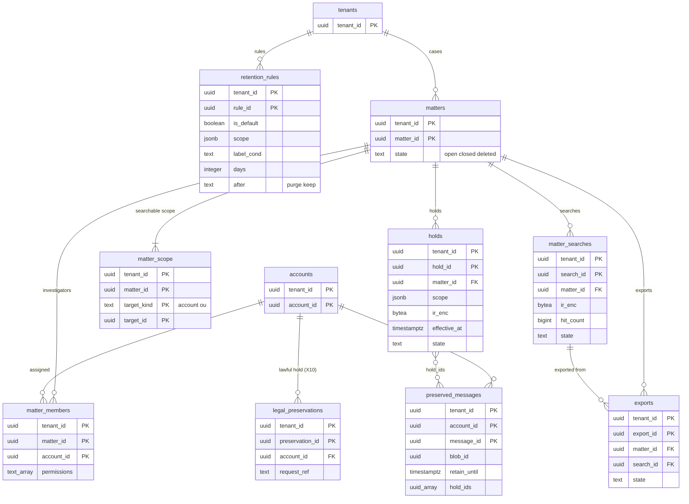

# Data model: 保持・保留・保全・eDiscovery

[data-model.md](../data-model.md) の一部。規約はそちらの 3 節に従う。振る舞いは [retention-and-ediscovery.md](../retention-and-ediscovery.md)（4〜8 節）を正とする。決定は [ADR-0053](../../decisions/0053-retention-rules-holds-and-preservation.md)（保持の規則・保留・保全）、[ADR-0054](../../decisions/0054-ediscovery-matters-search-export-and-audit.md)（案件・検索・書き出し・監査）、[ADR-0060](../../decisions/0060-key-hierarchy-and-crypto-erasure.md)（鍵の破棄を止める条件）、[ADR-0061](../../decisions/0061-operator-access-cross-tenant-paths-and-audit.md)（X7・X10）。

| 表 | 置き場所 | 書く |
| --- | --- | --- |
| `retention_rules` | directory `public` | `admin-api` |
| `matters`・`matter_members`・`matter_scope`・`holds`・`matter_searches`・`exports` | directory `public` | `admin-api`（X7 のロール）、`ediscovery-exporter` |
| `legal_preservations` | directory `public` | `lawful-access`（X10。**法務の L4 まで無効**） |
| `preserved_messages` | メールボックスのシャード `public` | `mailstore`（消す時の移し、評価し直し） |

- 保留を掛けても、メールボックスの行には触れない。効くのは消す時だけ（[ADR-0053](../../decisions/0053-retention-rules-holds-and-preservation.md)）。
- 保全の行・`archived` のアカウント・保留のある案件がある間は、TRK と包んだ鍵の残る KEK を破棄しない（`tenants.state = 'erasure_blocked'`）。
- 案件・保留・検索・閲覧・書き出しの操作は、`audit_events`（`tenant_ediscovery`）に先に書き、書けなければ操作しない。

## 1. ER 図

- `holds }o--o{ preserved_messages`：保全の行は当たる保留の ID を `hold_ids` に持つ（配列。外部キーを張らない）。保留を外すと評価し直しで配列から外し、空で規則にも当たらなければ行を消す。
- `matter_searches ||--o{ exports`：書き出しは 1 つの検索の結果から作る（`search_id` は任意。範囲全体の書き出しは NULL）。

## 2. 表

### 2.1 `retention_rules`

| 列 | 型 | NULL | 既定 | 説明 |
| --- | --- | --- | --- | --- |
| `tenant_id`・`rule_id` | `uuid` | NOT NULL | `rule_id` は `uuidv7()` | |
| `is_default` | `boolean` | NOT NULL | `false` | 組織の既定の規則（範囲が組織全体、ラベル `any`） |
| `scope` | `jsonb` | NOT NULL | — | `{"kind":"org"}`・`{"kind":"ou","ou_id":…}`・`{"kind":"accounts","account_ids":[…]}` |
| `label_cond` | `text` | NOT NULL | `'any'` | `any`・`INBOX`・`SENT`・`DRAFT`・`SPAM`・`TRASH`・`archived`・`label:<名前>` |
| `days` | `integer` | NOT NULL | — | 受け付けの時刻（送信は送った時刻）から |
| `after` | `text` | NOT NULL | — | 期間の後の動作：`purge`・`keep` |
| `version` | `bigint` | NOT NULL | — | 組織の規則のバージョン（変更で 1 上げ、outbox `holds.changed`） |
| `created_by` | `uuid` | NOT NULL | — | |
| `updated_at` | `timestamptz` | NOT NULL | `now()` | |

- キー：PK `(tenant_id, rule_id)`。UK `(tenant_id) WHERE is_default`（既定は 1 つ）。
- CHECK：`days BETWEEN 1 AND 36500`、`after IN (…)`、`NOT is_default OR (scope->>'kind' = 'org' AND label_cond = 'any')`。個別の規則は 100 まで（トリガー）。個人のテナントには置かない（`admin-api` が拒む）。
- 評価は `retention_decision(message, holds, rules, now)` の 1 つの関数（DT-RET-001）。S1 の量：約 2 万行。

### 2.2 `matters`・`matter_members`・`matter_scope`

`matters`：

| 列 | 型 | NULL | 既定 | 説明 |
| --- | --- | --- | --- | --- |
| `tenant_id`・`matter_id` | `uuid` | NOT NULL | `matter_id` は `uuidv7()` | |
| `name_enc` | `bytea` | NOT NULL | — | 案件の名前（調査の内容を含みうるので列の暗号化） |
| `state` | `text` | NOT NULL | `'open'` | `open`・`closed`・`deleted`（`closed` から 30 日） |
| `created_by` | `uuid` | NOT NULL | — | |
| `created_at` | `timestamptz` | NOT NULL | `now()` | |
| `closed_at` | `timestamptz` | NULL | — | |

- キー：PK `(tenant_id, matter_id)`。CHECK：`state IN (…)`、`state = 'open' OR closed_at IS NOT NULL`。

`matter_members`：

| 列 | 型 | NULL | 既定 | 説明 |
| --- | --- | --- | --- | --- |
| `tenant_id`・`matter_id`・`account_id` | `uuid` | NOT NULL | — | 担当（`investigator`） |
| `permissions` | `text[]` | NOT NULL | `'{}'` | `can_hold`・`ediscovery.read_body`・`ediscovery.export` |
| `added_by` | `uuid` | NOT NULL | — | |
| `added_at` | `timestamptz` | NOT NULL | `now()` | |

- キー：PK `(tenant_id, matter_id, account_id)`。FK → `matters`（`CASCADE`）、`accounts`。

`matter_scope`：

| 列 | 型 | NULL | 既定 | 説明 |
| --- | --- | --- | --- | --- |
| `tenant_id`・`matter_id` | `uuid` | NOT NULL | — | |
| `target_kind` | `text` | NOT NULL | — | `account`・`ou`（OU の部分木。今と将来のメンバー） |
| `target_id` | `uuid` | NOT NULL | — | |

- キー：PK `(tenant_id, matter_id, target_kind, target_id)`。範囲の外のアカウントは検索に出さない。S1 の量：3 表あわせて数万行。

### 2.3 `holds`

| 列 | 型 | NULL | 既定 | 説明 |
| --- | --- | --- | --- | --- |
| `tenant_id`・`hold_id` | `uuid` | NOT NULL | `hold_id` は `uuidv7()` | |
| `matter_id` | `uuid` | NOT NULL | — | |
| `scope` | `jsonb` | NOT NULL | — | アカウントの一覧か OU の部分木 |
| `date_from`・`date_to` | `timestamptz` | NULL | — | 受け付けの日付の範囲 |
| `ir_enc` | `bytea` | NULL | — | 条件の IR（`SearchIr` v1）を案件の鍵で暗号化。NULL は条件なし（アカウントの全部） |
| `notify_custodian` | `boolean` | NOT NULL | `false` | 枠だけ（法務の L4・L6・L7） |
| `effective_at` | `timestamptz` | NOT NULL | `now() + interval '60 seconds'` | 効き始め（キャッシュの 30 秒の後） |
| `state` | `text` | NOT NULL | `'active'` | `active`・`released` |
| `version` | `bigint` | NOT NULL | — | 組織の保留のバージョン（outbox `holds.changed`） |
| `created_by` | `uuid` | NOT NULL | — | |
| `created_at`・`released_at` | `timestamptz` | | | |

- キー：PK `(tenant_id, hold_id)`。FK → `matters`。
- 索引：`(tenant_id, state)` — シャードの `mailstore` の保留のキャッシュ（組織の `active` の保留の全部）。
- CHECK：`state IN (…)`、`date_to IS NULL OR date_from IS NULL OR date_from < date_to`。案件の `closed` で `released` にする。
- directory が止まって保留が読めないときは消さない（[ADR-0053](../../decisions/0053-retention-rules-holds-and-preservation.md)）。S1 の量：数千行。

### 2.4 `matter_searches`（この工程で足した。D-13）

eDiscovery の検索の記録。結果の本体は S3 `ediscovery/<tenant_id>/<matter_id>/results/<search_id>`（`message_id` の一覧。[stores.md](stores.md) の 3.7 節）。

| 列 | 型 | NULL | 既定 | 説明 |
| --- | --- | --- | --- | --- |
| `tenant_id`・`search_id` | `uuid` | NOT NULL | `search_id` は `uuidv7()` | |
| `matter_id` | `uuid` | NOT NULL | — | |
| `requested_by` | `uuid` | NOT NULL | — | |
| `ir_enc` | `bytea` | NOT NULL | — | 案件の鍵で暗号化した IR（C3） |
| `account_count` | `integer` | NOT NULL | — | 範囲のアカウントの数 |
| `hit_count` | `bigint` | NULL | — | 正確な件数（`PRESERVED` を含む） |
| `state` | `text` | NOT NULL | `'running'` | `running`・`done`・`failed`・`expired` |
| `created_at` | `timestamptz` | NOT NULL | `now()` | |
| `finished_at` | `timestamptz` | NULL | — | |

- キー：PK `(tenant_id, search_id)`。FK → `matters`。索引：`(tenant_id, matter_id, created_at DESC)`。
- 保持：案件の `deleted` で行と結果のオブジェクトを消す。S1 の量：年に数万行。

### 2.5 `exports`

| 列 | 型 | NULL | 既定 | 説明 |
| --- | --- | --- | --- | --- |
| `tenant_id`・`export_id` | `uuid` | NOT NULL | `export_id` は `uuidv7()` | |
| `matter_id` | `uuid` | NOT NULL | — | |
| `search_id` | `uuid` | NULL | — | |
| `requested_by` | `uuid` | NOT NULL | — | |
| `approved_by` | `uuid` | NULL | — | 別の `ediscovery_admin`（方針 `ediscovery.export_requires_approval`） |
| `state` | `text` | NOT NULL | `'requested'` | `requested`・`approved`・`rejected`・`running`・`ready`・`failed`・`expired`（[retention-and-ediscovery.md](../retention-and-ediscovery.md) の 7.3 節） |
| `failure_code` | `text` | NULL | — | |
| `message_count`・`total_bytes` | `bigint` | NULL | — | 1 回 100 万通・100 GB まで |
| `key_shown_at` | `timestamptz` | NULL | — | 書き出しの鍵を担当に 1 回だけ見せた時刻（鍵は持たない） |
| `manifest_sha256` | `bytea` | NULL | — | 目録の SHA-256（証拠の連続性） |
| `created_at` | `timestamptz` | NOT NULL | `now()` | |
| `ready_at`・`expires_at` | `timestamptz` | NULL | — | 準備から 15 日 |

- キー：PK `(tenant_id, export_id)`。FK → `matters`、`matter_searches`。
- CHECK：`state IN (…)`、`approved_by IS NULL OR approved_by <> requested_by`、`message_count <= 1000000`。
- 索引：`(expires_at) WHERE state = 'ready'` — X4 の発見の索引（15 日の削除）。S1 の量：年に数千行。

### 2.6 `preserved_messages`

保全の行。消したメッセージを、保留か保持の規則に当たる間だけ置く。利用者のどの経路にも出さない。

| 列 | 型 | NULL | 既定 | 説明 |
| --- | --- | --- | --- | --- |
| `tenant_id`・`account_id`・`message_id` | `uuid` | NOT NULL | — | 元のメッセージの行の ID |
| `blob_id` | `uuid` | NOT NULL | — | `hold:<tenant_id>:<message_id>` の参照で残す |
| `prefix_headers` | `bytea` | NOT NULL | — | 前置き（area の `prefix`） |
| `view_edits` | `bytea` | NULL | — | 書き出しに編集の表を添える |
| `part_tree` | `bytea` | NOT NULL | — | 保留の IR の評価と表示 |
| `subject`・`from_addr` | `text` | | — | C3（eDiscovery のヘッダーの要約） |
| `header_summary` | `bytea` | NOT NULL | — | |
| `received_at` | `timestamptz` | NOT NULL | — | |
| `size_logical` | `bigint` | NOT NULL | — | 組織の `preserved_bytes` に数える（area の `size`） |
| `labels_at_delete` | `uuid[]` | NOT NULL | — | 消した時のラベル |
| `thread_id` | `uuid` | NOT NULL | — | 消した時のスレッド |
| `deleted_at` | `timestamptz` | NOT NULL | `now()` | |
| `delete_reason` | `text` | NOT NULL | — | `user_delete`・`trash_expiry`・`spam_expiry`・`retention_purge`・`account_archive` |
| `retain_until` | `timestamptz` | NULL | — | 当たる規則の期間の終わり。保留だけなら NULL |
| `hold_ids` | `uuid[]` | NOT NULL | `'{}'` | 当たる保留 |

- キー：PK `(tenant_id, account_id, message_id)`。
- 索引：`(tenant_id, account_id, received_at)` — eDiscovery の日付の範囲。`(retain_until) WHERE retain_until IS NOT NULL AND cardinality(hold_ids) = 0` — X4 の発見の索引（規則の期間の後の削除）。
- CHECK：`delete_reason IN (…)`、`retain_until IS NOT NULL OR cardinality(hold_ids) > 0`（どちらにも当たらない行を置かない）。
- 移す時：同じトランザクションでメッセージの行を消し、change log に `destroyed`（`flags_changed` の bit5）、outbox に `blob.ref_added`（`hold`）と `blob.ref_removed`（`mailbox`）。消す時：change log に `preserved_purged`、outbox に `blob.ref_removed`（`hold`）。
- 利用者の容量（`account_usage`）に数えない。S1 の量：組織による。最大の組織で数億行。
- 個人のアカウントには保留が掛からないので行がない（`legal_preservations` を除く）。

### 2.7 `legal_preservations`

法務の手順（捜査機関への対応、法務の L4）で、本システムのテナントの外から 1 つのアカウントに掛ける保全（X10）。**法務の L4 の結論まで無効**で、形は L4 の後に確定する。ここでは枠だけを置く。

| 列 | 型 | NULL | 既定 | 説明 |
| --- | --- | --- | --- | --- |
| `tenant_id`・`preservation_id` | `uuid` | NOT NULL | `preservation_id` は `uuidv7()` | |
| `account_id` | `uuid` | NOT NULL | — | 1 つのアカウントだけ |
| `request_ref` | `text` | NOT NULL | — | 法務の請求の番号 |
| `approvals` | `jsonb` | NOT NULL | — | 法務と Ops の 2 人の承認の記録の ID |
| `date_from`・`date_to` | `timestamptz` | NULL | — | |
| `state` | `text` | NOT NULL | `'active'` | `active`・`released` |
| `created_at`・`released_at` | `timestamptz` | | | |

- キー：PK `(tenant_id, preservation_id)`。CHECK：`jsonb_array_length(approvals) >= 2`。
- RLS：`tenant_id` で FORCE RLS。書けるのは `lawful_access` のロール（X10）だけで、法務の L4 の結論まで、このロールを作らない。保全の評価では `holds` と同じに扱う。
