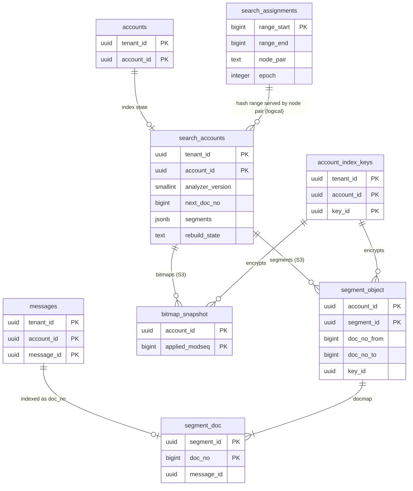

# Data model: 検索の索引

[data-model.md](../data-model.md) の一部。規約はそちらの 3 節に従う。振る舞いは [search.md](../search.md)（6・7・10 節）を正とする。決定は [ADR-0009](../../decisions/0009-search-index-design.md)（アカウントごとの不変のセグメント）、[ADR-0036](../../decisions/0036-search-language-and-ir.md)（文法と IR）、[ADR-0037](../../decisions/0037-segment-format-and-query-execution.md)（セグメントの形式 v1 と実行）。セグメントと状態のビットマップのバイトの並びは [stores.md](stores.md) の 2.5・2.6 節。

| もの | 置き場所 | 書く |
| --- | --- | --- |
| `search_accounts` | メールボックスのシャード `public` | `search-node`（合わせたセグメントを S3 に置いた後）、`search-indexer`（`next_doc_no`） |
| `search_assignments` | directory `sys` | 運用（受け持ちの移し） |
| `account_index_keys` | directory `public` | `search-indexer`（四半期ごとに新しい鍵）。表は [keys-audit-and-lifecycle.md](keys-audit-and-lifecycle.md) の 2.3 節 |
| 合わせたセグメント | S3 `search/<account_id>/<segment_id>` | `search-node` |
| 状態のビットマップのスナップショット | S3 `search/<account_id>/bitmaps/<modseq>` | `search-node` |
| 小さなセグメント | `search-node` の組の NVMe（S3 に書かない） | `search-indexer` → `search-node` |

- 索引のファイル・キャッシュの鍵・検索の計画は `account_id` を先頭に持つ（ADR-0007）。eDiscovery の横断の検索は X7 の署名つきの資格を持つ要求だけで、`PRESERVED` を含めて答える。
- 索引は作り直せる（正本は `mailstore` のメッセージの行・パートの木と blob）。大阪へ写さない（[ADR-0064](../../decisions/0064-storage-classes-and-region-replication.md)）。

## 1. ER 図

- `segment_object`・`bitmap_snapshot`・`segment_doc` は S3 のオブジェクトとその中の行で、表でない。
- `messages ||--o| segment_doc`：メッセージは届いた時に 1 つの `doc_no` を得る（索引に入る前は 0）。`object_gen` が変わっても `doc_no` は同じ（索引の中身は `message_id` で引く）。合わせで墓標の文書は落ちる（`PRESERVED` は落とさない）。
- `search_assignments ||--o{ search_accounts`：`account_id` のハッシュの区間による論理の関係（別の DB）。

## 2. 表

### 2.1 `search_accounts`

| 列 | 型 | NULL | 既定 | 説明 |
| --- | --- | --- | --- | --- |
| `tenant_id`・`account_id` | `uuid` | NOT NULL | — | |
| `analyzer_version` | `smallint` | NOT NULL | `1` | 語の分け方（NFKC、畳み込み、CJK の 2-gram）。変えたら作り直す |
| `next_doc_no` | `bigint` | NOT NULL | `0` | 次に振る `doc_no`（アカウントの中の 32 ビットの連番） |
| `segments` | `jsonb` | NOT NULL | `'[]'` | S3 に置いたセグメントの列：`segment_id`、`doc_no` の範囲、`received_at` の範囲、文書の数、`key_id`、大きさ、段 |
| `last_merged_doc_no` | `bigint` | NOT NULL | `0` | S3 に置いた最後の `doc_no`（組の 2 台を失ったら、これより後を作り直す） |
| `bitmap_modseq` | `bigint` | NULL | — | 最後のビットマップのスナップショットの `modseq` |
| `last_searched_at` | `timestamptz` | NULL | — | 30 日で NVMe に置くかを決める |
| `rebuild_state` | `text` | NOT NULL | `'none'` | `none`・`queued`・`running`・`failed` |
| `updated_at` | `timestamptz` | NOT NULL | `now()` | |

- キー：PK `(tenant_id, account_id)`。
- 索引：`(rebuild_state) WHERE rebuild_state IN ('queued','running')` — X4 の発見の索引（作り直しの作業）。
- CHECK：`next_doc_no BETWEEN 0 AND 4294967295`、`jsonb_array_length(segments) <= 32`（目標は 10 以下）、`rebuild_state IN (…)`。
- `doc_no` が 2^32 に近づいたら、作り直しで詰める（墓標の分を落とす）。
- S1 の量：100 万行。

### 2.2 `search_assignments`

| 列 | 型 | NULL | 既定 | 説明 |
| --- | --- | --- | --- | --- |
| `range_start` | `bigint` | NOT NULL | — | `account_id` の 64 ビットのハッシュの区間の始まり |
| `range_end` | `bigint` | NOT NULL | — | 区間の終わり（含まない） |
| `node_pair` | `text` | NOT NULL | — | 受け持つ `search-node` の組（2 台） |
| `next_node_pair` | `text` | NULL | — | 移しの間の新しい組（追いついてから切り替える） |
| `epoch` | `integer` | NOT NULL | `1` | 切り替えで 1 上げる（`jmap-api` の 30 秒のキャッシュの比べ） |
| `updated_at` | `timestamptz` | NOT NULL | `now()` | |

- キー：PK `(range_start)`。CHECK：`range_start < range_end`。区間の重なりを排他の制約で拒む（`EXCLUDE USING gist (int8range(range_start, range_end) WITH &&)`）。
- 置き場所：directory `sys`（テナントのデータを持たない）。S1 の量：数百行。

## 3. 状態のビットマップ

- `search-node` は受け持つアカウントごとに、ラベルごと（見える所属だけ）・旗ごと（`seen`、`muted` のスレッド）・`hidden`・`SPAM`・`TRASH`・`PRESERVED` の `doc_no` の Roaring ビットマップと、`applied_modseq` を持つ（[search.md](../search.md) の 7 節）。
- 当てる元は change log（[change-log-and-sync.md](change-log-and-sync.md) の 2.2 節）。`flags_changed` の bit5（`preserved`）の `destroyed` は墓標にせず `PRESERVED` に移し、`preserved_purged` で墓標にする。
- スナップショットは 10 分か 1 万の変更ごと。30 日（change log の保持）より古ければ、`mailstore` から全体を作り直す。
