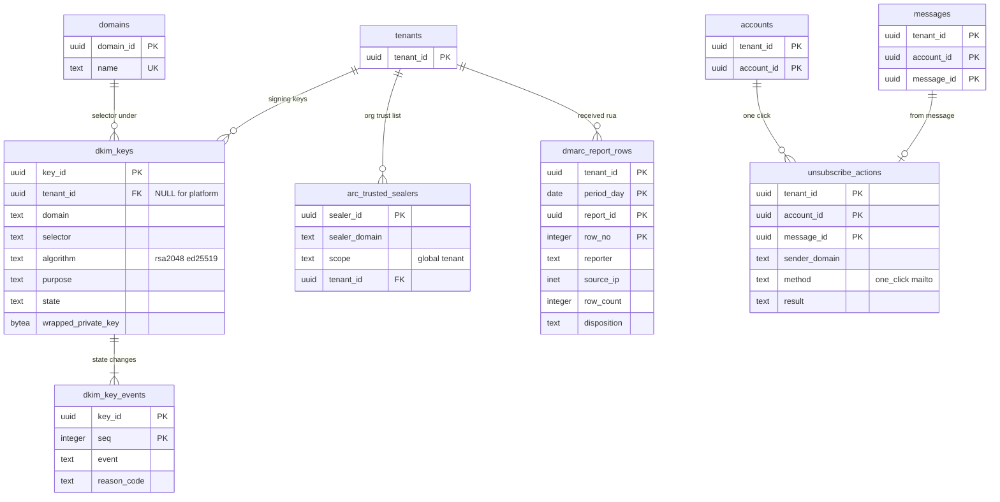

# Data model: 送信者の認証と報告

[data-model.md](../data-model.md) の一部。規約はそちらの 3 節に従う。振る舞いは [sender-authentication.md](../sender-authentication.md)（4〜10 節）と [inbound-smtp.md](../inbound-smtp.md)（7.3 節）、[outbound-smtp-and-reputation.md](../outbound-smtp-and-reputation.md)（6.5 節）を正とする。決定は [ADR-0014](../../decisions/0014-auth-evaluation-and-authentication-results.md)（認証の結果）、[ADR-0015](../../decisions/0015-dmarc-policy-and-organizational-domain.md)（DMARC）、[ADR-0016](../../decisions/0016-dkim-signing-keys-and-rotation.md)（DKIM の鍵）、[ADR-0017](../../decisions/0017-arc-sealing-trusted-sealers-and-dmarc-reports.md)（ARC と DMARC の報告）、[ADR-0012](../../decisions/0012-inbound-tls-mta-sts-and-tls-rpt.md)（TLS-RPT）。報告のファイルの置き場所は [stores.md](stores.md) の 3.6 節。

| 表 | 置き場所 | 書く |
| --- | --- | --- |
| `dkim_keys`・`dkim_key_events` | directory `public`（基盤の鍵は `tenant_id` が NULL の行） | `dkim-keyring` |
| `arc_trusted_sealers` | directory `public`（本システムの一覧は `tenant_id` が NULL の行） | 運用、`admin-api` |
| `dmarc_report_rows` | directory `public` | `report-ingest` |
| `dmarc_out_daily`・`tlsrpt_daily` | directory `sys` | `inbound-pipeline` の集計の作業、`report-ingest` |
| `unsubscribe_actions` | メールボックスのシャード `public` | `mailstore`（`<Brand>Unsubscribe/set`） |

- 認証の結果（SPF・DKIM・ARC・DMARC）の正本は、受信ではスプールの `SpoolEnvelope.auth_results`（[inbound-spool-and-delivery.md](inbound-spool-and-delivery.md) の 2 節）と、受け手ごとの前置きの `Authentication-Results`（`messages.prefix_headers`）。表を持たない。
- ARC の封印者ごとの救いと後の報告の数、`bulk_sender` の数えは評判のストア（Valkey `rep:arc_sealer:…`。[spam-and-scanning.md](spam-and-scanning.md) の 3.2 節）。

## 1. ER 図

- `tenants ||--o{ dkim_keys`：基盤のドメイン（`<brand>mail.<domain>`）と本システムのドメイン（`<brand>.<domain>`）の鍵、ARC の鍵は `tenant_id` が NULL（任意）。
- `domains ||--o{ dkim_keys`：`dkim_keys.domain` はドメインの名前で持つ論理の参照（`domains` は `xt`、名前の変更がないため）。
- `messages ||--o| unsubscribe_actions`：1 通につき 1 回だけ（2 回目は前の結果を返す）。メッセージを消しても行は残る（外部キーを張らない）。

## 2. 表

### 2.1 `dkim_keys`

| 列 | 型 | NULL | 既定 | 説明 |
| --- | --- | --- | --- | --- |
| `key_id` | `uuid` | NOT NULL | `uuidv7()` | |
| `tenant_id` | `uuid` | NULL | — | 組織の委任の鍵。基盤・本システムのドメイン・ARC は NULL |
| `domain` | `text` | NOT NULL | — | `d=` |
| `selector` | `text` | NOT NULL | — | `<brand>-<yyyymm>-r`・`-e` |
| `algorithm` | `text` | NOT NULL | — | `rsa2048`・`ed25519` |
| `purpose` | `text` | NOT NULL | — | `from_aligned`・`platform`・`arc` |
| `public_key` | `bytea` | NOT NULL | — | DER |
| `wrapped_private_key` | `bytea` | NOT NULL | — | KMS の `dkim` の鍵で包んだ秘密の鍵 |
| `kms_key_arn` | `text` | NOT NULL | — | |
| `state` | `text` | NOT NULL | `'generated'` | `generated`・`published`・`active`・`retired`・`revoked`・`deleted` |
| `delegation` | `text` | NULL | — | 組織のドメインの委任の形（`cname`・`txt`） |
| `published_checked_at` | `timestamptz` | NULL | — | 公開を 48 時間確かめた |
| `activated_at`・`retired_at`・`revoked_at`・`deleted_at` | `timestamptz` | NULL | — | |
| `created_at` | `timestamptz` | NOT NULL | `now()` | |

- キー：PK `(key_id)`。UK `(domain, selector)`。UK `(domain, purpose, algorithm) WHERE state = 'active'`（同時に有効な鍵は種類ごとに 1 つ）。
- CHECK：`algorithm IN (…)`、`purpose IN (…)`、`state IN (…)`、`purpose = 'from_aligned' OR tenant_id IS NULL`（基盤と ARC の鍵はテナントに属さない）。`from_aligned` で `tenant_id` が NULL の行は本システムのドメインの鍵だけ（`dkim-keyring` が確かめる）。`deleted` の行は `wrapped_private_key` を空にする。
- RLS：`tenant_id` で FORCE RLS。ポリシーは `tenant_id = current_setting('app.tenant_id')::uuid OR tenant_id IS NULL`（基盤の鍵は誰の文脈でも読める）。`outbound-gate` は送信者のテナントの文脈で、そのテナントの鍵だけを引いてキャッシュする（D-18。テナントをまたいで鍵をまとめて読まない）。
- 状態の変化は同じトランザクションで `dkim_key_events` に書く。S1 の量：組織 2,000 × 2 種類 × 交換の重なりで約 1 万行。

### 2.2 `dkim_key_events`

| 列 | 型 | NULL | 既定 | 説明 |
| --- | --- | --- | --- | --- |
| `key_id` | `uuid` | NOT NULL | — | |
| `seq` | `integer` | NOT NULL | — | 鍵ごとの番号 |
| `tenant_id` | `uuid` | NULL | — | 鍵の `tenant_id` の写し（RLS） |
| `event` | `text` | NOT NULL | — | `generated`・`published`・`activated`・`retired`・`revoked`・`deleted`・`resigned_queue`（漏えいで待ち行列を署名し直した） |
| `actor` | `text` | NOT NULL | — | `dkim-keyring`・運用の `account_id` |
| `reason_code` | `text` | NULL | — | `scheduled_rotation`・`suspected_leak` など |
| `created_at` | `timestamptz` | NOT NULL | `now()` | |

- キー：PK `(key_id, seq)`。FK → `dkim_keys`。追記だけ。保持：鍵の `deleted` から 2 年。

### 2.3 `arc_trusted_sealers`

| 列 | 型 | NULL | 既定 | 説明 |
| --- | --- | --- | --- | --- |
| `sealer_id` | `uuid` | NOT NULL | `uuidv7()` | |
| `sealer_domain` | `text` | NOT NULL | — | ARC の `d=` |
| `scope` | `text` | NOT NULL | — | `global`（本システムの一覧）・`tenant` |
| `tenant_id` | `uuid` | NULL | — | `tenant` のとき |
| `added_by` | `text` | NOT NULL | — | |
| `reason` | `text` | NOT NULL | — | |
| `created_at` | `timestamptz` | NOT NULL | `now()` | |
| `disabled_at` | `timestamptz` | NULL | — | 報告の率が 30 日で 1% を超えて外した |

- キー：PK `(sealer_id)`。UK `(sealer_domain, tenant_id) NULLS NOT DISTINCT WHERE disabled_at IS NULL`。CHECK：`(scope = 'tenant') = (tenant_id IS NOT NULL)`。
- RLS：`dkim_keys` と同じポリシー（`global` の行は誰でも読める）。S1 の量：数千行。

### 2.4 `dmarc_report_rows`

組織のドメインあてに受け取った DMARC の集計の報告の行（[sender-authentication.md](../sender-authentication.md) の 8.2 節）。

| 列 | 型 | NULL | 既定 | 説明 |
| --- | --- | --- | --- | --- |
| `tenant_id` | `uuid` | NOT NULL | — | `dmarc-rua+<org_token>` の `org_token` から決める（[stores.md](stores.md) の 3.6 節、D-11） |
| `period_day` | `date` | NOT NULL | — | 報告の期間の始まりの日（分割の鍵） |
| `report_id` | `uuid` | NOT NULL | — | 取り込みの ID（S3 の生のファイルの名前） |
| `row_no` | `integer` | NOT NULL | — | 報告の中の `<record>` の番号 |
| `reporter` | `text` | NOT NULL | — | 報告の送り手の組織のドメイン |
| `period_begin`・`period_end` | `timestamptz` | NOT NULL | — | |
| `source_ip` | `inet` | NOT NULL | — | |
| `row_count` | `integer` | NOT NULL | — | `count` |
| `spf`・`dkim`・`dmarc` | `text` | NOT NULL | — | 結果 |
| `disposition` | `text` | NOT NULL | — | `none`・`quarantine`・`reject` |
| `header_from` | `text` | NOT NULL | — | ドメイン |
| `source_ptr`・`source_asn` | `text`・`integer` | NULL | — | 取り込みで足す（管理の画面の表示） |

- キー：PK `(tenant_id, period_day, report_id, row_no)`。索引：`(tenant_id, header_from, period_day)` — ドメインごとの揃いの率（`domain_checks` の DMARC の項目）。
- RLS：`tenant_id` で FORCE RLS。`report-ingest` は `org_token` を開いてから文脈を設定して書く。
- 分割：`period_day` の月。保持：13 か月（法務の L6 の確認の後に見直す）。S1 の量：組織 2,000 × 1 日 500 行で、1 日約 100 万行。

### 2.5 `dmarc_out_daily`

送る集計の報告の元（受信の側で数える。[sender-authentication.md](../sender-authentication.md) の 8.1 節）。本システムの利用者の情報を持たない（外の方針のドメインと送り元の IP の数）。

| 列 | 型 | NULL | 既定 | 説明 |
| --- | --- | --- | --- | --- |
| `day` | `date` | NOT NULL | — | UTC の日 |
| `policy_domain` | `text` | NOT NULL | — | 外の From の方針のドメイン |
| `source_ip` | `inet` | NOT NULL | — | |
| `spf`・`dkim`・`dmarc`・`disposition` | `text` | NOT NULL | — | |
| `dkim_domain`・`spf_domain` | `text` | NULL | — | 揃いに使ったドメイン |
| `row_count` | `integer` | NOT NULL | `0` | |

- キー：PK `(day, policy_domain, source_ip, spf, dkim, dmarc, disposition)`。書くのは 1 分ごとのまとめの `ON CONFLICT DO UPDATE`。
- 送るのは `release.dmarc-aggregate-reports` の後（法務の L1）。それまでも数え、送らない。
- 分割：`day` の日。保持：30 日。S1 の量：1 日約 500 万行。

### 2.6 `tlsrpt_daily`

受け取った TLS-RPT（本システムのドメインと、本システムが MTA-STS を持つ組織のドメインあて）の集計。

| 列 | 型 | NULL | 既定 | 説明 |
| --- | --- | --- | --- | --- |
| `day` | `date` | NOT NULL | — | |
| `policy_domain` | `text` | NOT NULL | — | |
| `reporting_org` | `text` | NOT NULL | — | 送り手の組織 |
| `policy_type` | `text` | NOT NULL | — | `sts`・`tlsa`・`no-policy-found` |
| `result_type` | `text` | NOT NULL | — | `success` か失敗の種類（RFC 8460 の 4.3 節） |
| `session_count` | `bigint` | NOT NULL | — | |

- キー：PK `(day, policy_domain, reporting_org, policy_type, result_type)`。分割：`day` の月。保持：13 か月。
- MTA-STS の段を上げる関門（失敗の率 0.1% 未満が 14 日）に使う。S1 の量：1 日数千行。

### 2.7 `unsubscribe_actions`

一括の配信停止の記録（RFC 8058。[sender-authentication.md](../sender-authentication.md) の 10.1 節が正本。[web-client.md](../web-client.md) の 9 節の行は同じ表。D-5）。

| 列 | 型 | NULL | 既定 | 説明 |
| --- | --- | --- | --- | --- |
| `tenant_id`・`account_id` | `uuid` | NOT NULL | — | |
| `message_id` | `uuid` | NOT NULL | — | 押したメッセージ |
| `sender_domain` | `text` | NOT NULL | — | `List-Unsubscribe` の送り手の組織のドメイン（`list_domain`） |
| `method` | `text` | NOT NULL | — | `one_click`（本システムの egress から POST）・`mailto` |
| `result` | `text` | NOT NULL | `'requested'` | `requested`・`ok`・`http_error`・`timeout`・`blocked_address` |
| `created_at` | `timestamptz` | NOT NULL | `now()` | 押した時刻（`requested_at`） |
| `completed_at` | `timestamptz` | NULL | — | |

- キー：PK `(tenant_id, account_id, message_id)`。2 回目の押下は前の行を返す。
- CHECK：`method IN (…)`、`result IN (…)`。URL を持たない（blob の `List-Unsubscribe` から都度読む）。
- 保持：1 年（X4。法務の L6 で見直す）。S1 の量：1 日約 10 万行。
