# Data model: 選別・隔離・添付と URL の検査

[data-model.md](../data-model.md) の一部。規約はそちらの 3 節に従う。振る舞いは [spam-and-abuse-filtering.md](../spam-and-abuse-filtering.md)（5〜12 節）と [attachment-and-url-scanning.md](../attachment-and-url-scanning.md)（4〜7 節）を正とする。決定は [ADR-0008](../../decisions/0008-spam-pipeline-boundary-and-secrecy.md)（区分 C1〜C3 と人が中身を見る経路）、[ADR-0022](../../decisions/0022-verdict-score-composition-and-overrides.md)〜[ADR-0025](../../decisions/0025-org-quarantine-and-allow-block-lists.md)（判定・評判・学習・隔離）、[ADR-0026](../../decisions/0026-static-attachment-scanning-sandbox.md)〜[ADR-0028](../../decisions/0028-external-image-proxy.md)（添付・URL・画像）、[ADR-0070](../../decisions/0070-format-versions-and-model-rollout.md)（モデルの出し方）。

| 表 | 置き場所 | 書く |
| --- | --- | --- |
| `sender_affinity`・`filter_settings`・`sample_submissions` | メールボックスのシャード `public` | `mailstore`（報告、設定） |
| `quarantine_items`・`org_filter_lists`・`org_filter_policy`・`org_attachment_policy` | directory `public` | `inbound-pipeline`（隔離）、`admin-api` |
| `emergency_rules`・`confirmed_phish_urls`・`filter_rollouts` | directory `sys` | 選別の当番（2 人の承認）、`url-list-builder`、出し方の作業 |

- 判定の列（`verdict`・`reason_codes`・`p_spam`・`p_phish`・`filter_version`・`feature_id`・`rescan_state`・`url_warn`・`attachment_warn`・`attachment_blocked`）と、パートごとの検査の結果（`part_tree` の中）は `messages` にある（[messages-and-blobs.md](messages-and-blobs.md) の 2.1 節）。
- 外部の画像の表示の設定は `account_settings.external_images` にまとめた（[filters-forwarding-and-timers.md](filters-forwarding-and-timers.md) の 2.3 節。attachment-and-url-scanning.md の `image_settings` は同じもの。D-6）。

## 1. 区分と置き場所

選別のデータは、区分（[ADR-0008](../../decisions/0008-spam-pipeline-boundary-and-secrecy.md)）ごとに置ける場所を決める。どの置き場所も、区分の上の段のデータを持たない。

| 区分 | 中身 | 置いてよい場所 | 置かない場所 |
| --- | --- | --- | --- |
| C1 接続の情報 | 送り元の IP・範囲・ASN、接続の層、EHLO、TLS、MAIL FROM と宛先のドメイン、認証の結果、大きさ、時刻 | スプールの封筒、評判のストア（Valkey `rep:*`、S3 `reputation/`）、特徴の記録、`delivery_log`、集計の表（`dmarc_out_daily`・`tlsrpt_daily`）、指標 | — |
| C2 中身から作った特徴 | URL のドメインと、パス・問い合わせのハッシュ、添付のハッシュと種類と本当の形式、本文の指紋（局所に敏感なハッシュ）、規則の当たりの ID、分類器の点 | 特徴の記録（S3 `features/`）、評判のストア、学習のアカウントの `training/labels/`、Valkey の配った後の索引（`aidx:`・`uidx:`・`udidx:`）、`confirmed_phish_urls` | ログ・トレース（ハッシュでも出さない） |
| C3 中身そのもの | 件名、本文、添付のバイト、表示の名前、アドレスのローカル部 | スプール、blob、メールボックスのシャードの行、検索のセグメント、隔離の写し（S3 `quarantine/`）、保全の行、eDiscovery の書き出し、同意のある報告のサンプル（別のアカウント） | 評判のストア、特徴の記録、学習の行、directory（列の暗号化の `*_enc` を除く）、ログ・指標・トレース、Valkey（例外：描画のキャッシュ `render:` はアカウントの鍵で暗号化） |

- `spam-scorer` と `content-scanner` は C3 をメモリーの中だけで扱い、結果は C1・C2 と理由のコードだけを返す。
- 学習の置き場所に入るのは、ラベルつきの特徴の記録、同意のある報告のサンプル、合成のメール、評判の出来事だけ（[ADR-0024](../../decisions/0024-feedback-training-data-and-model-release.md)）。IAM でこの経路に限る。

## 2. ER 図

```mermaid
erDiagram
    accounts ||--o{ sender_affinity : "per sender weight"
    accounts ||--o| filter_settings : "filtering scope"
    tenants ||--o{ quarantine_items : "quarantined per recipient"
    accounts ||--o{ quarantine_items : "recipient"
    tenants ||--o{ org_filter_lists : "allow and block"
    tenants ||--o| org_filter_policy : "digest setting"
    tenants ||--o| org_attachment_policy : "extra block types"
    filter_rollouts ||--o{ emergency_rules : "applies within version (logical)"
    accounts ||--o{ sample_submissions : "consented samples"

    accounts {
        uuid tenant_id PK
        uuid account_id PK
    }
    tenants {
        uuid tenant_id PK
    }
    sender_affinity {
        uuid tenant_id PK
        uuid account_id PK
        text key_kind PK "domain address_hmac"
        text sender_key PK
        integer not_spam
        integer spam
    }
    filter_settings {
        uuid tenant_id PK
        uuid account_id PK
        text spam_filter_mode
        text content_classifier
        boolean training_consent
    }
    quarantine_items {
        uuid tenant_id PK
        uuid quarantine_id PK
        uuid spool_id
        uuid recipient_account_id FK
        text sender_domain
        text verdict
        text state
    }
    org_filter_lists {
        uuid tenant_id PK
        uuid entry_id PK
        text list "allow block"
        text kind
        text value
    }
    org_filter_policy {
        uuid tenant_id PK
        text recipient_digest
    }
    org_attachment_policy {
        uuid tenant_id PK
        text_array extra_block_types
    }
    filter_rollouts {
        text model_kind PK "filter risk"
        integer model_version PK
        text stage PK
        integer bucket_to
    }
    emergency_rules {
        uuid rule_id PK
        text direction
        boolean smtp_time
        timestamptz expires_at
    }
    sample_submissions {
        uuid tenant_id PK
        uuid account_id PK
        uuid submission_id PK
        uuid message_id
        timestamptz revoked_at
    }
    confirmed_phish_urls {
        bytea url_hash PK
        text url_domain
        timestamptz expires_at
    }
```

- `confirmed_phish_urls` は他の表と関係を持たない参照のデータ（`sys`）。
- `filter_rollouts ||--o{ emergency_rules`：緊急の規則は今のバージョンの規則の束に足して当たる（論理の関係。外部キーを張らない）。

## 3. Aurora の外の記録

### 3.1 特徴の記録（C1・C2）

S3 `features/<yyyy>/<mm>/<dd>/<hh>/<partition>.parquet`（本番のアカウント、SSE-KMS、30 日）。配送の時にメッセージごと（受信は配送ごと、送信は送信ごと）に 1 行。`feature_id` で引く索引は Valkey `feat:{feature_id}`（30 日。[stores.md](stores.md) の 1 節）。

| 列 | Parquet の型 | 区分 | 説明 |
| --- | --- | --- | --- |
| `feature_id` | `FIXED_LEN_BYTE_ARRAY(16)` | — | UUIDv7。`messages.feature_id` |
| `direction` | `BYTE_ARRAY`（列挙） | — | `inbound`・`outbound` |
| `created_at` | `INT64`（マイクロ秒） | C1 | |
| `feature_version`・`filter_version` | `INT32` | — | 特徴の作り方と判定のバージョン |
| `conn` | 構造 | C1 | `ip_range`、`asn`、`tier`、`tls`、`helo_ok`、`auth`（SPF・DKIM・DMARC・ARC の結果と揃いのドメイン）、`from_domain`、`rcpt_count`、`size_bucket` |
| `urls` | 繰り返し | C2 | `domain`、`path_hash`（SHA-256 の先頭 16 バイト）、`flags`（`display_mismatch`・`idn_mixed`・`scheme_risky`） |
| `attachments` | 繰り返し | C2 | `sha256`、宣言の種類、本当の形式、`scan_result` |
| `fingerprint` | `FIXED_LEN_BYTE_ARRAY(32)` | C2 | 本文の指紋（元の文を戻せない方式。PROP-FLT-007） |
| `rule_hits` | 繰り返し `INT32` | C2 | 規則の ID |
| `scores` | 構造 | C2 | 層ごとの寄与、`p_spam`、`p_phish` |
| `verdict`・`reason_codes` | `BYTE_ARRAY` | — | |
| `shadow_filter_version`・`shadow_verdict`・`shadow_score` | | — | 影の判定（[ADR-0070](../../decisions/0070-format-versions-and-model-rollout.md)） |

- アカウントの ID、メッセージの ID、アドレス、件名を持たない。報告は `feature_id` で記録を引く。

### 3.2 評判のストア

- Valkey（評判の専用のクラスタ）`rep:{kind}:{key}`：`kind` は `ip`・`range`・`asn`・`auth_domain`・`url_domain`・`url_hash`・`attachment_hash`・`fingerprint`・`arc_sealer`・`bulk_sender`。値はハッシュで、数え（`delivered`・`verdict_spam`・`verdict_phish`・`report_spam`・`report_phish`・`report_not_spam`・`engaged`）ごとに半減期 7 日・30 日の 2 つの減衰の値と最後の更新の時刻（[ADR-0023](../../decisions/0023-reputation-store-and-report-weighting.md)）。
- S3 `reputation/snapshots/<yyyymmddThhmm>/<shard>.bin`（5 分ごと。失ったら戻す）と `reputation/events/<yyyy>/<mm>/<dd>/<hh>/<task>.parquet`（出来事の C1・C2、90 日。法務の L1・L6）。
- 受信の接続の層は、評判のサービスが 5 分ごとに `rep:ip:{ip}`・`rep:range:{range}` に `tier`・理由のコード・更新の時刻を書き、`mx-edge` は読むだけ（[ADR-0010](../../decisions/0010-inbound-connection-tiers-and-rate-limits.md)）。

### 3.3 学習の行と報告のサンプル

| もの | 置き場所 | 中身 |
| --- | --- | --- |
| 学習の行 | 学習のアカウントの S3 `training/labels/<yyyy>/<mm>/<dd>/<task>.parquet` | `feature_id`、ラベル（`spam`・`phish`・`not_spam`）、重み（明示の報告 1、手で動かした 0.3、アカウントの重み）、報告の時刻、アカウントの HMAC の桶（`account_bucket`、64 個） |
| 報告のサンプル | サンプルのアカウントの S3 `samples/<submission_id>/message.eml.enc`（blob と前置きの写し、専用の KMS の鍵） | C3。`account_id` を付けない |
| サンプルの目録 | 同じバケットの `samples/<submission_id>/index.json`（D-12） | `submission_id`、種類（`spam`・`phish`・`not_spam`）、提出の時刻、取り消しの時刻、`account_bucket`。取り消しで本体を消し、目録に取り消しの時刻を書く |

- サンプルの目録を DB にしない（D-12）。サンプルのアカウントに DB を置くと、本番と別の運用の部品が増える。利用者の取り消しの引きは、メールボックスのシャードの `sample_submissions`（4.9 節）が持つ。
- 保持：サンプル 1 年、取り消しは 30 日以内（法務の L1・L6）。

### 3.4 モデル・定義・一覧

| キー | 中身 | 区分 |
| --- | --- | --- |
| `models/<filter_version>/`（本番のアカウント） | モデル、閾値、規則の束、特徴の作り方のバージョン、評価の結果、署名（`manifest.json` と各ファイルの SHA-256） | — |
| `scanner/defs/<version>/` | 署名つきのマルウェアの定義（1 時間ごと） | — |
| `scanner/malware-hashes/<version>` | 既知のマルウェアのハッシュの一覧（10 分ごと。`mx-edge` と `inbound-pipeline` が手元で当てる） | C2 |
| `url-lists/<version>/`、`url-lists/prefixes/<version>`、`url-lists/diffs/<from>-<to>` | URL の悪い一覧の全体のハッシュと種類、先頭 32 ビットの集合、差分 | C2 |

## 4. 表

### 4.1 `sender_affinity`

利用者ごとの送り手への寄与（−2.0〜+2.0。[spam-and-abuse-filtering.md](../spam-and-abuse-filtering.md) の 9.3 節）。

| 列 | 型 | NULL | 既定 | 説明 |
| --- | --- | --- | --- | --- |
| `tenant_id`・`account_id` | `uuid` | NOT NULL | — | |
| `key_kind` | `text` | NOT NULL | — | `domain`（送り手の組織のドメイン）・`address_hmac` |
| `sender_key` | `text` | NOT NULL | — | ドメインか、アドレスのテナントのアドレスの鍵の HMAC の 16 進 |
| `not_spam`・`spam` | `integer` | NOT NULL | `0` | 報告の数 |
| `contacted` | `boolean` | NOT NULL | `false` | 本人が送ったことのある相手（やりとりのある相手。DMARC の `pass` のときだけ効く） |
| `updated_at` | `timestamptz` | NOT NULL | `now()` | |

- キー：PK `(tenant_id, account_id, key_kind, sender_key)`。CHECK：`key_kind IN (…)`。
- 保持：`updated_at` から 2 年で消す（X4）。S1 の量：約 3 億行。

### 4.2 `filter_settings`

選別の範囲の設定（[ADR-0008](../../decisions/0008-spam-pipeline-boundary-and-secrecy.md) の同意と設定）。

| 列 | 型 | NULL | 既定 | 説明 |
| --- | --- | --- | --- | --- |
| `tenant_id`・`account_id` | `uuid` | NOT NULL | — | |
| `spam_filter_mode` | `text` | NOT NULL | `'on'` | `on`・`off`（(a)：すべて受信箱へ、印だけ） |
| `content_classifier` | `text` | NOT NULL | `'on'` | `on`・`off`（(b)） |
| `training_consent` | `boolean` | NOT NULL | `false` | 特徴の記録を学習に使うことの同意（既定の有効化は法務の L1） |
| `sample_consent_default` | `boolean` | NOT NULL | `false` | 報告の画面のサンプルの提出の既定 |
| `locked_by_org` | `boolean` | NOT NULL | `false` | 組織の方針 `filter.scope_locked` の写し |
| `updated_at` | `timestamptz` | NOT NULL | `now()` | |

- キー：PK `(tenant_id, account_id)`。行がなければ既定の値。S1 の量：最大 100 万行。

### 4.3 `quarantine_items`

組織の隔離（[ADR-0025](../../decisions/0025-org-quarantine-and-allow-block-lists.md)）。受け手ごとに 1 行。件名・アドレスを持たない。

| 列 | 型 | NULL | 既定 | 説明 |
| --- | --- | --- | --- | --- |
| `tenant_id`・`quarantine_id` | `uuid` | NOT NULL | `quarantine_id` は `uuidv7()` | S3 の写しのキーの最後 |
| `spool_id` | `uuid` | NOT NULL | — | 解放で `(spool_id, recipient_account_id)` の配送の依頼を載せ直す |
| `recipient_account_id` | `uuid` | NOT NULL | — | |
| `sender_domain` | `text` | NOT NULL | — | From のドメイン |
| `verdict` | `text` | NOT NULL | — | `spam`・`spam_phish`・`attachment_blocked`・`org_block`・`dmarc_reject` |
| `reason_codes` | `text[]` | NOT NULL | `'{}'` | |
| `state` | `text` | NOT NULL | `'held'` | `held`・`released`・`deleted`・`expired` |
| `created_at` | `timestamptz` | NOT NULL | `now()` | |
| `expires_at` | `timestamptz` | NOT NULL | `now() + interval '30 days'` | |
| `acted_by` | `uuid` | NULL | — | 解放・削除した管理者 |
| `acted_at` | `timestamptz` | NULL | — | |

- キー：PK `(tenant_id, quarantine_id)`。UK `(tenant_id, spool_id, recipient_account_id)`（読み直しで 2 行にしない）。
- 索引：`(tenant_id, state, created_at DESC)` — 管理者の一覧。`(expires_at) WHERE state = 'held'` — X4 の発見の索引（30 日の期限）。
- CHECK：`state IN (…)`、`verdict IN (…)`、`state = 'held' OR acted_at IS NOT NULL OR state = 'expired'`。
- RLS：`tenant_id` で FORCE RLS。解放・削除・本文の閲覧は `audit_events`（`tenant_admin`）に同じトランザクションで書く。
- 保持：写しは 30 日で消す。行は終わってから 90 日で消す（X4）。S1 の量：1 日約 2 万行。

### 4.4 `org_filter_lists`

| 列 | 型 | NULL | 既定 | 説明 |
| --- | --- | --- | --- | --- |
| `tenant_id`・`entry_id` | `uuid` | NOT NULL | `entry_id` は `uuidv7()` | |
| `list` | `text` | NOT NULL | — | `allow`・`block` |
| `kind` | `text` | NOT NULL | — | `domain`・`ip_range`・`attachment_type` |
| `value` | `text` | NOT NULL | — | ドメイン（小文字の A-label）、CIDR、拡張子か本当の形式 |
| `created_by` | `uuid` | NOT NULL | — | |
| `created_at` | `timestamptz` | NOT NULL | `now()` | |

- キー：PK `(tenant_id, entry_id)`。UK `(tenant_id, list, kind, value)`。CHECK：`list IN (…)`、`kind IN (…)`、`list = 'block' OR kind <> 'attachment_type'`。組織あたり 1 万件（トリガー）。
- 認証なしの許可（From のドメインだけ）は作らない。効き方はコード（DT-FLT-001）。S1 の量：約 50 万行。

### 4.5 `org_filter_policy`・`org_attachment_policy`

判定を隔離に置き換える方針（`filter.quarantine_map`）と、暗号化された書庫の扱い（`scan.encrypted_archive`）は、OU ごとに変えられる方針として `ou_policies` に置く（[directory-tenants-and-accounts.md](directory-tenants-and-accounts.md) の 2.6 節。D-19）。この 2 つの表は、OU の方針の一覧にない組織の単位の値だけを持つ。

`org_filter_policy`：

| 列 | 型 | NULL | 既定 | 説明 |
| --- | --- | --- | --- | --- |
| `tenant_id` | `uuid` | NOT NULL | — | |
| `recipient_digest` | `text` | NOT NULL | `'none'` | 受け手への隔離の要約（`none`・`daily`） |
| `updated_at` | `timestamptz` | NOT NULL | `now()` | |

`org_attachment_policy`：

| 列 | 型 | NULL | 既定 | 説明 |
| --- | --- | --- | --- | --- |
| `tenant_id` | `uuid` | NOT NULL | — | |
| `extra_block_types` | `text[]` | NOT NULL | `'{}'` | 本システムの一覧に足して止める形式（拡張子と本当の形式。100 まで） |
| `updated_at` | `timestamptz` | NOT NULL | `now()` | |

- キー：どちらも PK `(tenant_id)`。S1 の量：2,000 行ずつ。

### 4.6 `emergency_rules`

緊急の規則（[ADR-0024](../../decisions/0024-feedback-training-data-and-model-release.md)）。中身を持たない（規則の定義は C2 の特徴と規則の型だけ）。

| 列 | 型 | NULL | 既定 | 説明 |
| --- | --- | --- | --- | --- |
| `rule_id` | `uuid` | NOT NULL | `uuidv7()` | |
| `definition` | `jsonb` | NOT NULL | — | 規則の言語の木（URL のドメイン・ハッシュ、指紋、ヘッダーの形） |
| `direction` | `text` | NOT NULL | — | `spam`・`phish`（迷惑メールに寄せる向きだけ） |
| `smtp_time` | `boolean` | NOT NULL | `false` | SMTP の時点の規則（影 24 時間） |
| `approved_by` | `text[]` | NOT NULL | — | Dev と QA の 2 人 |
| `eval_result`・`shadow_result` | `jsonb` | NULL | — | 正規のメールの当たり 0、影の「迷惑メールではない」0 |
| `state` | `text` | NOT NULL | `'shadow'` | `shadow`・`active`・`expired`・`withdrawn` |
| `created_at` | `timestamptz` | NOT NULL | `now()` | |
| `expires_at` | `timestamptz` | NOT NULL | — | 作成から 7 日 |

- キー：PK `(rule_id)`。CHECK：`cardinality(approved_by) >= 2`、`direction IN (…)`、`expires_at <= created_at + interval '7 days'`。置き場所：directory `sys`。

### 4.7 `confirmed_phish_urls`

| 列 | 型 | NULL | 既定 | 説明 |
| --- | --- | --- | --- | --- |
| `url_hash` | `bytea` | NOT NULL | — | 正規化した URL の SHA-256。URL の全体を持たない |
| `url_domain` | `text` | NOT NULL | — | |
| `source` | `text` | NOT NULL | — | `user_reports`・`external_list`・`analyst` |
| `confirmed_by` | `text` | NOT NULL | — | |
| `confirmed_at` | `timestamptz` | NOT NULL | `now()` | |
| `expires_at` | `timestamptz` | NOT NULL | — | |

- キー：PK `(url_hash)`。索引：`(url_domain)`、`(expires_at)`。置き場所：directory `sys`。S1 の量：数十万行。

### 4.8 `filter_rollouts`

選別のバージョン（`filter_version`）とサインインの危険度（`risk_version`）の段（[ADR-0070](../../decisions/0070-format-versions-and-model-rollout.md)）。

| 列 | 型 | NULL | 既定 | 説明 |
| --- | --- | --- | --- | --- |
| `model_kind` | `text` | NOT NULL | — | `filter`・`risk` |
| `model_version` | `integer` | NOT NULL | — | |
| `stage` | `text` | NOT NULL | — | `shadow`・`p1`・`p10`・`p50`・`p100`・`rolled_back` |
| `bucket_to` | `integer` | NOT NULL | — | 組の番号 0〜9,999 のうち `[0, bucket_to)` が新しいバージョン |
| `started_at` | `timestamptz` | NOT NULL | `now()` | 各段 24 時間以上 |
| `gate_result` | `jsonb` | NULL | — | 報告の率、迷惑メールではないの率、隔離の解除の率、影の食い違い |
| `approved_by` | `text[]` | NOT NULL | `'{}'` | 50% → 100% だけ QA と Dev |

- キー：PK `(model_kind, model_version, stage)`。置き場所：directory `sys`。追記だけ（戻しは `rolled_back` の行を足す）。S1 の量：年に数百行。

### 4.9 `sample_submissions`

利用者が同意して提出した報告のサンプルの、本人の側の記録（取り消しの 30 日のため。D-12）。サンプルの本体は別のアカウントにあり、この表はその `submission_id` だけを持つ。

| 列 | 型 | NULL | 既定 | 説明 |
| --- | --- | --- | --- | --- |
| `tenant_id`・`account_id` | `uuid` | NOT NULL | — | |
| `submission_id` | `uuid` | NOT NULL | `uuidv7()` | サンプルの置き場所の名前（`account_id` を含まない） |
| `message_id` | `uuid` | NOT NULL | — | 提出したメッセージ |
| `kind` | `text` | NOT NULL | — | `spam`・`phish`・`not_spam` |
| `submitted_at` | `timestamptz` | NOT NULL | `now()` | |
| `revoked_at` | `timestamptz` | NULL | — | 取り消し（本体の削除を依頼した） |

- キー：PK `(tenant_id, account_id, submission_id)`。置き場所：メールボックスのシャード `public`。
- 保持：提出から 30 日で消す（取り消しの期間の後は本人の側に記録を残さない。X4）。S1 の量：1 日約 1 万行。
