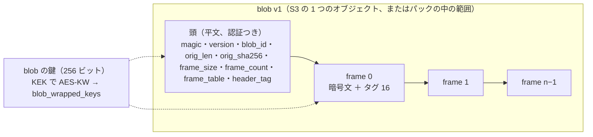
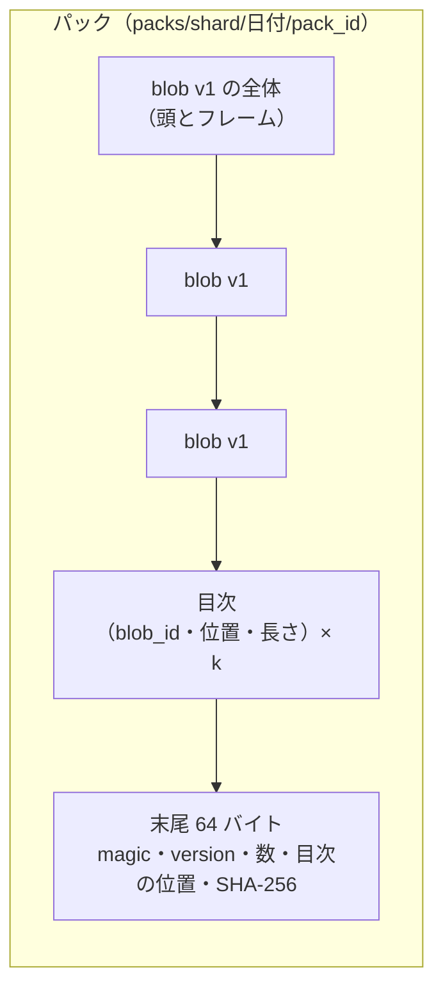
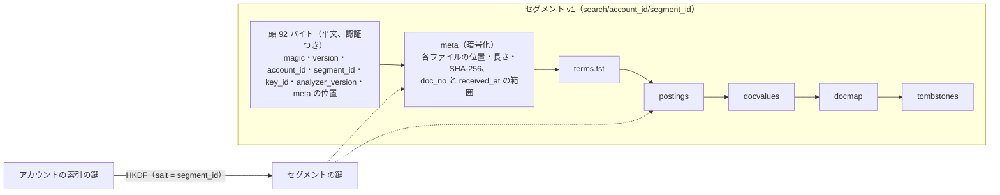

# Data model: Aurora の外（Valkey・形式・S3・SQS と SNS・状態の文字列と ID・プッシュ・端末）

[data-model.md](../data-model.md) の一部。Aurora の表の外に置くデータと、外へ出す形をまとめる。正本は Aurora か S3 で、Valkey と端末の中は失ってよい（作り直せるか、閉じる側に倒す）。

- **アカウントの区別のない鍵を作らない。** Valkey のアカウントのデータの鍵は `{account_id}` を含む（クラスタのハッシュタグ）。S3 のアカウントのデータのキーは `account_id` を先頭に持つか、`<shard>`・日付の後に ID を持つ。キーを作る関数は `AccountId`（か `TenantId`）を最初の引数に取る（[ADR-0007](../../decisions/0007-tenancy-accounts-orgs-and-rls.md) の Confirmation）。
- 鍵・キー・メッセージには ID・ハッシュ・数・理由のコードだけを入れる。アドレス・件名・本文を入れない。例外はスプール・blob・隔離の写し・サンプル（C3 の置き場所）と、暗号化した描画のキャッシュ。
- バイトの並びの整数は、断りがなければビッグエンディアン。形式は開発リポジトリの `formats/` に登録し、試験のベクトルを持つ（[ADR-0070](../../decisions/0070-format-versions-and-model-rollout.md)）。読む側を先に出す。
- ER 図は持たない（表でないため）。2 節の形式は構造の図とバイトの表で示す。名前のうち領域の文書で決めていなかったものは、この文書で決めた（「この文書」と書いたもの）。

## 1. Valkey

失ってよい。正本にしない。アカウントの鍵は `{account_id}` を含む。評判は専用のクラスタ、配った後の手当ての索引も専用のクラスタに置く。

| 鍵 | 種類 | TTL | 中身 | 書く・読む | 決めた場所 |
| --- | --- | --- | --- | --- | --- |
| `rep:{kind}:{key}` | HASH | なし（S3 の写しから戻す） | 評判の数え（2 つの半減期の値と時刻）。`kind` は [spam-and-scanning.md](spam-and-scanning.md) の 3.2 節 | 評判のサービス → `spam-scorer`・`mx-edge` | [ADR-0023](../../decisions/0023-reputation-store-and-report-weighting.md) |
| `rep:ip:{ip}`・`rep:range:{range}` | HASH | 1 時間 | 接続の層、理由のコード、更新の時刻 | 評判のサービス → `mx-edge` | [ADR-0010](../../decisions/0010-inbound-connection-tiers-and-rate-limits.md) |
| `rl:{kind}:{key}` | 文字列（TAT） | 上限の窓 | 受信の速さ（GCRA。IP・範囲・ASN を 1 つの Lua で） | `mx-edge` | 同上 |
| `rcpt:{hmac}` | HASH | あるもの 5 分、ないもの 60 秒 | 宛先の状態（`active`・`suspended`・`over_quota`・`none`）、`account_id`、`smtp_policy_class`。`{hmac}` は `address_index` の鍵 | `mx-edge`（外れは X1） | [inbound-smtp.md](../inbound-smtp.md) の 8.1 節 |
| `rrate:{account_id}:{range}`・`rrate:{account_id}` | 文字列（TAT） | 窓 | 宛先ごとの受信の速さ | `mx-edge` | 同 8.2 節 |
| `dup:{account_id}:{hash}` | 文字列（SET NX） | 24 時間 | 再送の重複の抑え。`hash = SHA-256(Message-ID ‖ body_sha256)` | `inbound-pipeline` | 同 11.4 節 |
| `shard:{account_id}` | 文字列 | 10 分 | `accounts.mailbox_shard` の写し（移し替えの通知で消す） | `mailstore`・`jmap-api`・`imap-server` | [ADR-0007](../../decisions/0007-tenancy-accounts-orgs-and-rls.md)（名前はこの文書） |
| `bcat:{blob_id}` | 文字列（Protobuf） | 10 分 | 目録の行（場所と包んだ鍵。包んだ形のまま） | `mailstore` | [message-parsing-and-storage.md](../message-parsing-and-storage.md) の 7.4 節（名前はこの文書） |
| `feat:{feature_id}` | 文字列 | 30 日 | 特徴の記録の Parquet のオブジェクトと行の位置 | `inbound-pipeline` → 報告の処理 | [spam-and-abuse-filtering.md](../spam-and-abuse-filtering.md) の 18 節（名前はこの文書） |
| `aidx:{attachment_hash}`・`uidx:{url_hash}`・`udidx:{url_domain}` | SET（`account_id:message_id`） | 72 時間 | 配った後の手当ての逆引き（専用のクラスタ） | `inbound-pipeline` → 手当ての作業 | [ADR-0027](../../decisions/0027-url-reputation-and-click-time-checks.md) |
| `orl:{pool}:{group}`・`ogrp:{pool}:{group}` | HASH | なし | 組の速さ（GCRA）と並行の `c`・`r`、止めの期限 | `mta-out` | [ADR-0019](../../decisions/0019-mta-out-queues-throttling-and-retries.md) |
| `slim:{account_id}` | HASH（分の桶 1,440） | 24 時間 | 送信の上限の数え | `outbound-gate` | [ADR-0021](../../decisions/0021-sending-limits-and-compromised-account-detection.md) |
| `sburst:{account_id}` | 文字列（TAT） | 1 時間 | 短い時間の上限（1 分 60、1 時間 300） | `outbound-gate` | 同上 |
| `mtasts:{domain}` | HASH | `max_age` | 相手の MTA-STS の方針、`id`、取得の時刻 | `mta-out` | [outbound-smtp-and-reputation.md](../outbound-smtp-and-reputation.md) の 6.4 節 |
| `tok:{token_hash}` | 文字列（JSON：アカウント、クライアント、スコープ、期限、`session_family`） | 60 秒 | トークンの写し | `jmap-api`・`imap-server`・`submission` | [ADR-0055](../../decisions/0055-sign-in-methods-sessions-and-protocol-auth.md) |
| `revoked:{session_family}` | 文字列 | 90 日 | 失効の印 | `accounts` → 各サービス | 同上 |
| `pwfail:{account_id}` | HASH | 1 時間 | パスワードの失敗の数と遅らせの期限 | `accounts` | 同上（名前はこの文書） |
| `signup:ip:{ip}`・`signup:range:{range}` | 文字列（窓の数） | 1 時間 | 作成の速さ（IP 5、範囲 20） | `accounts` | [accounts-and-security.md](../accounts-and-security.md) の 4.2 節（名前はこの文書） |
| `riskev:{event_id}` | 文字列（SET NX） | 24 時間 | `account-risk` の出来事の重複の除き | `accounts` | この文書 |
| `apirl:{kind}:{key}` | 文字列（TAT） | 窓 | API の費用の上限（`(account, client)`・`account`・`client`） | `jmap-api` | [ADR-0059](../../decisions/0059-api-rate-limits-and-third-party-push.md) |
| `imapbw:{account_id}:{hour}`・`imapbw:{account_id}:{day}` | 文字列（INCRBY） | 1 時間・1 日 | IMAP の読み出しの量 | `imap-server` | 同上 |
| `fwdv:{account_id}:{day}` | 文字列（INCR） | 1 日 | 転送の確かめのメールの数（10） | `mailstore` | [ADR-0048](../../decisions/0048-verified-forwarding.md)（名前はこの文書） |
| `fwd:{account_id}:{day}`・`vac:{account_id}:{day}` | 文字列（INCR） | 1 日 | 転送 5,000・不在の返信 500 の上限 | `outbound-gate` | [ADR-0048](../../decisions/0048-verified-forwarding.md)・[ADR-0049](../../decisions/0049-timed-jobs-vacation-and-scheduled-send.md)（名前はこの文書） |
| `render:{account_id}:{message_id}:{part_id}:{rules_version}` | 文字列 | 1 時間 | 浄化した HTML（アカウントの鍵で暗号化した C3） | `html-render` | [ADR-0044](../../decisions/0044-safe-html-rendering.md) |
| `imgrl:{account_id}` | 文字列（TAT） | 1 分 | 画像の代理の速さ（1 分 600） | 画像の代理 | [ADR-0028](../../decisions/0028-external-image-proxy.md)（名前はこの文書） |
| `pushq:{device_id}` | HASH | 2 秒 | まとめの中の数と最後の `modseq` | `push-notifier` | [ADR-0045](../../decisions/0045-push-payload-without-content.md) |
| `pushrate:{device_id}` | 文字列（INCR） | 10 分 | 1 分の数（30 を超えたら絞る） | `push-notifier` | 同上 |

- 画像の代理の取った画像は、代理の台のディスクのキャッシュ（鍵は `account_id` を先頭に、24 時間）に置き、Valkey に置かない。
- Valkey の障害：受信の速さは台の手元の数え（上限 ÷ 東京の台数）、宛先は台の LRU か 451、送信の上限は `mailstore` から数え直す（[ADR-0021](../../decisions/0021-sending-limits-and-compromised-account-detection.md)）、評判は 0 で合わせて S3 の写しから戻す、重複の抑えは効かない（失うより重複を選ぶ）。

## 2. バイナリの形式

### 2.1 blob 形式 v1

[ADR-0030](../../decisions/0030-blob-format-v1-and-envelope-keys.md)。受け取ったバイト（ドットの透過を外したもの）を 256 KiB のフレームに分け、zstd（水準 3、辞書なし。0.9 倍より縮まなければ生のまま）で縮め、フレームごとに AES-256-GCM で暗号化する。blob は不変。



| 位置 | 大きさ | 欄 | 値・意味 |
| --- | --- | --- | --- |
| 0 | 4 | `magic` | `"MBLB"` |
| 4 | 2 | `format_version` | 1 |
| 6 | 2 | `flags` | 予約（0） |
| 8 | 16 | `blob_id` | UUIDv7 |
| 24 | 8 | `orig_len` | 元のバイトの長さ |
| 32 | 32 | `orig_sha256` | 元のバイトの SHA-256 |
| 64 | 4 | `frame_size` | 262,144 |
| 68 | 4 | `frame_count` | `n = ceil(orig_len / frame_size)`（0 バイトのメッセージは 1） |
| 72 | 5 × n | `frame_table[i]` | `stored_len` u32（暗号文とタグの長さ）、`flags` u8（bit0 = zstd） |
| 72 + 5n | 16 | `header_tag` | AES-256-GCM のタグ。平文は空、nonce = `0x00 × 8 ‖ 0xFFFFFFFF`、AAD = 位置 0 から 72 + 5n の前まで ‖ `0xFFFFFFFF` |
| 88 + 5n | `stored_len[0]` | `frame[0]` | |
| … | … | `frame[i]` | 位置 = `88 + 5n + Σ stored_len[0..i)` |

- フレーム i：`AES-256-GCM(key = blob の鍵, nonce = 0x00 × 8 ‖ u32(i), aad = blob_id ‖ u32(i) ‖ u16(format_version), plaintext = zstd か生の最大 262,144 バイト)`。`stored_len[i]` は暗号文 ＋ タグ 16 バイト。
- nonce を番号にしてよいのは、blob の鍵が blob ごとに 1 つで、blob が不変だから。頭の nonce の `0xFFFFFFFF` はフレームの番号に使わない（フレームは 2^32 − 1 未満）。
- 読み出し：頭を範囲の GET で読み、`header_tag` を確かめ、要るフレームだけを範囲の GET で読む。全体を読んだら `orig_sha256` を確かめる。
- 4 フレームの頭は 108 バイト（[message-parsing-and-storage.md](../message-parsing-and-storage.md) の 7.1 節の例を 104 から直した）。

### 2.2 blob の鍵の包み

| 段 | 鍵 | 包む | 置き場所 |
| --- | --- | --- | --- |
| 1 | KMS の `tenant-root`（用途・リージョンごと） | — | KMS |
| 2 | TRK（テナントごと、256 ビット） | KMS（`GenerateDataKey`） | `tenant_keys.trk_wrapped` |
| 3 | 日ごとの KEK（テナント × 書き込みのあった日） | TRK で AES-KW（RFC 3394、40 バイト） | `tenant_keks.kek_wrapped` |
| 4 | blob の鍵・アカウントの索引の鍵 | KEK で AES-KW（40 バイト） | `blob_wrapped_keys.wrapped_key`、`account_index_keys.key_wrapped` |
| — | 列の暗号化の鍵（`*_enc`） | TRK から HKDF-SHA256（`info = "col:v1:<表>.<列>"`） | 持たない |
| — | アドレスの鍵（HMAC） | KMS の `address-index` の鍵（D-21） | `tenant_keys.addr_key_wrapped` |

- 列の暗号化の形：`v1 ‖ trk_version u32 ‖ nonce 12 ‖ 暗号文 ‖ タグ 16`（AES-256-GCM、AAD = `tenant_id ‖ 表 ‖ 列 ‖ 行の主キー`）。

### 2.3 パック

`blob-packer` が、1 日を過ぎた 256 KiB 未満の blob の暗号文を、そのまま 64 MiB を目安に並べる（鍵に触れない）。



| 部分 | 大きさ | 中身 |
| --- | --- | --- |
| blob の並び | 可変 | blob v1 の全体を目次の順に詰める（境目の詰め物なし） |
| 目次 | 40 × k | `blob_id` 16、`offset` u64、`length` u64（平文。ID と位置だけ） |
| 末尾 0〜3 | 4 | `magic` `"MPAK"` |
| 末尾 4〜5 | 2 | `format_version` 1 |
| 末尾 6〜7 | 2 | `flags`（0） |
| 末尾 8〜11 | 4 | `entry_count` k |
| 末尾 12〜19 | 8 | `toc_offset` |
| 末尾 20〜27 | 8 | `toc_len` |
| 末尾 28〜59 | 32 | `toc_sha256` |
| 末尾 60〜63 | 4 | 予約 |

- 目録（`blob_catalog`）の `stored_offset`・`stored_len` が正。目次は目録が壊れたときの作り直しにだけ使う。
- 詰め直しは、鍵の残る blob だけを新しいパックに写す。鍵を破棄した blob は写さない。

### 2.4 メッセージの行の Protobuf

`messages` の `bytea` の列の形（`proto3`。番号を再利用しない）。

| 型 | 欄 |
| --- | --- |
| `PartTree` | `repeated Part parts`：`part_id`（`1`、`2.1`）、`content_type`、`params`、`charset_declared`・`charset_used`・`charset_detected`、`cte`、`raw_offset`・`raw_len`、`body_offset`・`body_len`、`decoded_len`、`disposition`、`filename`、`content_id`、`sha256`、`parse_flags`、`scan_result`（種類、理由のコード）、`blocked`、`scan_version` |
| `HeaderSummary` | `from[]`・`sender`・`reply_to[]`・`to[]`・`cc[]`・`bcc[]`（表示の名前とアドレス）、`message_id`、`in_reply_to[]`、`references[]`（100 まで）、`list_id`、`list_unsubscribe`（`one_click`・`mailto` の有無と DKIM の覆い）、`date_raw` |
| `ViewEdits` | `repeated Edit edits`：`kind`（`RENAME_AUTHRES = 1`、`REPLACE_BLOCKED_PART = 2`）、`blob_offset` u64、`blob_len` u64、`replacement` bytes、`part_id`、`reason_code`。`blob_offset` の順で重ならない |

- 配る形 = `prefix_headers` ‖ edit(blob, `view_edits`)。範囲の読み出しは、編集の表で配る形の位置を blob の位置に写す（[ADR-0032](../../decisions/0032-served-view-edits.md)）。

### 2.5 検索のセグメント v1

[ADR-0037](../../decisions/0037-segment-format-and-query-execution.md)。合わせたセグメントを S3 `search/<account_id>/<segment_id>` の 1 つのオブジェクトに置く。6 つのファイル（`meta`・`terms.fst`・`postings`・`docvalues`・`docmap`・`tombstones`）を並べ、各ファイルを 1 MiB の塊ごとに AES-256-GCM で暗号化する。



| 位置 | 大きさ | 欄 | 値・意味 |
| --- | --- | --- | --- |
| 0 | 4 | `magic` | `"MSEG"` |
| 4 | 2 | `format_version` | 1 |
| 6 | 2 | `flags` | 0 |
| 8 | 16 | `account_id` | 読み手は要求のアカウントと比べ、違えば拒む |
| 24 | 16 | `segment_id` | UUIDv7 |
| 40 | 16 | `key_id` | `account_index_keys.key_id` |
| 56 | 2 | `analyzer_version` | |
| 58 | 2 | `file_count` | 6 |
| 60 | 8 | `meta_offset` | 92 |
| 68 | 8 | `meta_len` | 暗号文の長さ |
| 76 | 16 | `header_tag` | 平文は空、nonce = `0xFF ‖ 0x00 × 7 ‖ 0xFFFFFFFF`、AAD = 位置 0〜75 |

- **セグメントの鍵**（D-28）：`seg_key = HKDF-SHA256(ikm = アカウントの索引の鍵, salt = segment_id, info = "mseg:v1")`。アカウントの索引の鍵は四半期に 1 つで多くのセグメントに使うので、鍵を直接使うと nonce が重なる。セグメントごとに鍵を導いて避ける。
- 塊 j（ファイル番号 f、`meta` = 0 … `tombstones` = 5）：`AES-256-GCM(seg_key, nonce = u8(f) ‖ 0x00 × 7 ‖ u32(j), aad = segment_id ‖ u8(f) ‖ u32(j) ‖ u16(format_version))`。
- `meta`（平文の形は Protobuf）：`account_id`、`segment_id`、`analyzer_version`、`doc_no_from`・`doc_no_to`、`received_at_min`・`received_at_max`、`doc_count`、各ファイルの `offset`・`stored_len`・`plain_len`・`chunk_count`・`sha256`。範囲の GET で頭と `meta` を読み、要るファイルの塊だけを読む。
- 各ファイルの中身は [search.md](../search.md) の 6.1 節（`postings` は 128 文書の塊・飛ばしの表・頻度・位置、`docvalues` は `received_at` i64・`size` u32・`flags` u16・アドレスの語の集合・`list_id`・`msgid`、`docmap` は `doc_no` → `message_id` 16 バイト、`tombstones` は Roaring）。

### 2.6 状態のビットマップのスナップショット

S3 `search/<account_id>/bitmaps/<applied_modseq>`。セグメントと同じ形の頭（`magic` `"MBMP"`、`account_id`、`applied_modseq` u64、`key_id`）と、1 つの暗号化したファイル（Protobuf：`(kind, label_id, roaring)` の列。`kind` はラベル・`seen`・`muted`・`hidden`・`SPAM`・`TRASH`・`PRESERVED`）。鍵は `HKDF-SHA256(アカウントの索引の鍵, salt = account_id ‖ u64(applied_modseq), info = "mbmp:v1")`。

## 3. S3

| バケット（東京・大阪） | 写し | 暗号化 | 級 |
| --- | --- | --- | --- |
| `spool-tyo`・`spool-osa` | 互いに CRR＋RTC | SSE-KMS（スプールの鍵） | Standard |
| `blobs-tyo` → `blobs-osa` | CRR＋RTC | SSE-KMS（バケットキー）＋ 2.1 節のフレームの暗号化 | Standard → Standard-IA（256 KiB 以上の個別、30 日）→ Glacier IR（90 日）。パックは 90 日で Glacier IR |
| `search-tyo` | 写さない | SSE-KMS ＋ 2.5 節 | Standard |
| `quarantine-tyo` → 大阪 | CRR | SSE-KMS（テナントの隔離の鍵） | Standard |
| `filter-tyo`（特徴・評判・モデル・検査の定義・URL の一覧） | 写さない | SSE-KMS | Standard |
| `reports-tyo` | 写さない | SSE-KMS | Standard |
| `ediscovery-tyo`・`ediscovery-exports-tyo` | 写さない | SSE-KMS（`exports` の鍵）＋書き出しごとの鍵 | Standard |
| 別のアカウント：`training`、`samples`、`audit`（Object Lock）、`canary` | — | 各アカウントの KMS の鍵 | Standard |

- バケットの名前の対応は [ADR-0064](../../decisions/0064-storage-classes-and-region-replication.md)。S3 のバージョニングと大阪の写しの消去の期限は 30 日を既定にする（法務の L6）。

### 3.1 スプールのバケット

| キー | 中身 | 寿命 |
| --- | --- | --- |
| `spool/<yyyy>/<mm>/<dd>/<hh>/<spool_id>` | スプールのオブジェクト（下の表） | 7 日（法務の L6） |
| `spool-done/<yyyy>/<mm>/<dd>/<hh>/<task_id>-<seq>` | 終わった `spool_id` の列（16 バイトの並び、最後に SHA-256） | 8 日 |
| `spool-rejected/<yyyy>/<mm>/<dd>/<hh>/<host>-<seq>` | 拒んだ `spool_id` の列（同じ形） | 8 日。拒んだ本体は 1 日後に掃除の役が消す |
| `expansion/<yyyy>/<mm>/<dd>/<spool_id>` | グループの展開の結果（Protobuf：受け手の `account_id` の集合、外のアドレス（C3）、飛ばしたグループと理由のコード） | 8 日 |

スプールのオブジェクト：

| 位置 | 大きさ | 欄 |
| --- | --- | --- |
| 0 | 4 | `magic` `"MSPL"` |
| 4 | 2 | `spool_version`（1） |
| 6 | 2 | `flags`（0） |
| 8 | 4 | `envelope_len` |
| 12 | `envelope_len` | `SpoolEnvelope`（Protobuf。[inbound-spool-and-delivery.md](inbound-spool-and-delivery.md) の 2 節） |
| 12 + `envelope_len` | 残り | 本文（ドットの透過を外した、受け取ったバイト） |

- 8 MiB 以下のメッセージは、終わりの印の後に頭と本文を 1 回の PUT で書く。8 MiB を超えるときは、最初の 8 MiB を台のメモリーに残したまま 2 番目からの部分（8 MiB ごと）をマルチパートで先に送り、終わりの印の後に「頭 ＋ 最初の 8 MiB」を部分 1 として送って完了する（S3 のマルチパートは部分の番号の順に並べ、最後の部分を除き 5 MiB 以上であればよい）。
- 完了の要求に `x-amz-checksum-sha256` を付ける。`inbound-pipeline` と掃除の役だけが読める。

### 3.2 blob のバケット

| キー | 中身 |
| --- | --- |
| `blobs/<shard>/<yyyy>/<mm>/<dd>/<blob_id>` | 個別の blob v1（`<shard>` は blob の目録のシャード、日付は作った日） |
| `packs/<shard>/<yyyy>/<mm>/<dd>/<pack_id>` | パック |

### 3.3 検索のバケット

| キー | 中身 |
| --- | --- |
| `search/<account_id>/<segment_id>` | 合わせたセグメント v1 |
| `search/<account_id>/bitmaps/<applied_modseq>` | 状態のビットマップのスナップショット |

- アカウントの消去で `search/<account_id>/` を消す。索引の鍵の破棄でも読めなくなる。

### 3.4 隔離のバケット

`quarantine/<tenant_id>/<yyyy>/<mm>/<dd>/<quarantine_id>`：スプールのオブジェクトの写し（3.1 節の形）。30 日で消す。

### 3.5 選別のバケット

`features/…`、`reputation/…`、`models/<filter_version>/`、`scanner/…`、`url-lists/…`（[spam-and-scanning.md](spam-and-scanning.md) の 3 節）。

### 3.6 報告のバケット

| キー | 中身 | 寿命 |
| --- | --- | --- |
| `reports/tlsrpt/<yyyy>/<mm>/<dd>/<report_id>.json.gz` | 受け取った TLS-RPT の報告 | 30 日 |
| `reports/tlsrpt-out/<yyyy>/<mm>/<dd>/<domain>.json.gz` | 送った TLS-RPT | 30 日 |
| `reports/dmarc-in/<yyyy>/<mm>/<dd>/<report_id>` | 受け取った DMARC の集計の報告の生のファイル（gzip・zip のまま） | 30 日 |
| `reports/dmarc-out/<yyyy>/<mm>/<dd>/<policy_domain>.xml.gz` | 送る DMARC の集計の報告（RFC 9990、10 MiB まで。`dmarc_out_daily` から作る） | 30 日 |

- **DMARC の報告の受け取りと `org_token`**（D-11）：組織に案内する `rua` は `mailto:dmarc-rua+<org_token>@<brand>.<domain>`。`org_token = base32(v ‖ AES-SIV(本システムの鍵 v, tenant_id))`（`v` は鍵のバージョン 1 バイト、26 文字の小文字）。`report-ingest` は `org_token` を開いて `tenant_id` を得てから、そのテナントの文脈で `dmarc_report_rows` を書く。表で引かないので、RLS の外の表を足さない。組織の ID は推し量れない。鍵を替えるときは、古いバージョンを 1 年開ける。
- 取り込みの上限：添付は 1 つ、展開の後 50 MiB、倍率 100、XML の深さ 32、外部の実体と DTD を読まない、`<record>` は 10 万まで（[ADR-0017](../../decisions/0017-arc-sealing-trusted-sealers-and-dmarc-reports.md)）。

### 3.7 eDiscovery のバケット

| キー | 中身 | 寿命 |
| --- | --- | --- |
| `ediscovery/<tenant_id>/<matter_id>/results/<search_id>` | 検索の結果の `(account_id, message_id, preserved)` の列（案件の鍵で暗号化） | 案件の `deleted` まで |
| `ediscovery-exports/<tenant_id>/<export_id>/part-<nnnn>.zip` | 書き出し（1 GiB ごと。`<account_id>/<message_id>.eml` と編集の表。書き出しごとの鍵で AES-256-GCM） | 15 日 |
| `ediscovery-exports/<tenant_id>/<export_id>/manifest.csv`・`export.json` | 目録（`message_id`、アカウント、ラベル、日付、大きさ、SHA-256、保全の有無）と案件・IR・範囲・作成者・承認者 | 15 日 |

### 3.8 別のアカウント

| アカウント | キー | 中身 | 寿命 |
| --- | --- | --- | --- |
| 学習 | `training/labels/…` | 学習の行（C1・C2） | 学習の規則 |
| サンプル | `samples/<submission_id>/message.eml.enc`・`index.json` | 同意のある報告のサンプル（C3）と目録 | 1 年、取り消し 30 日 |
| 監査 | `audit/<stream>/<tenant_id>/<yyyy>/<mm>/<dd>/<hh>.jsonl.zst`、`heads/<yyyy>/<mm>/<dd>/<hh>.sig` | 監査ログの写し（1 分ごと）と、1 時間ごとの鎖の先頭の署名（KMS の `audit` の鍵）。Object Lock のコンプライアンスのモード | 7 年（法務の L6・L7） |
| 見張り | `canary/<経路>/<yyyy>/<mm>/<dd>.parquet` | 送った番号、時刻、届いた時刻、箱、認証の結果、各段の時刻 | 1 年 |

## 4. SQS・SNS

### 4.1 `inbound-delivery`・`inbound-delivery-low`（東京・大阪）と DLQ

`mx-edge` が 250 の前に送る配送の依頼。JSON（`v = 1`）。宛先のアドレスを入れない。

```json
{
  "v": 1,
  "spool_id": "0192f6a1-…",
  "bucket": "spool-tyo",
  "object_key": "spool/2026/10/10/09/0192f6a1-…",
  "rcpts": [
    {"i": 0, "kind": "account", "tenant_id": "0191…", "id": "0192…"},
    {"i": 1, "kind": "group", "tenant_id": "0191…", "id": "0193…"}
  ],
  "checks": {"tier": "good", "sync": "pass", "timed_out": []},
  "attempt": 1,
  "queued_at": "2026-10-10T09:00:01.234Z"
}
```

- 可視の時間切れ 5 分、10 回で DLQ（消さない）。掃除の役の載せ直しは `attempt` を足した同じ形。隔離の解放は `override = {"verdict": "inbox", "by": "released_by_admin"}` と、受け手を 1 つにした形。
- 本システムの中の宛先の配送の依頼（`outbound-gate` から）は `delivery_id = submission_id`、`kind = "internal"` で、`bucket`・`object_key` の代わりに `blob_id` を持つ。

### 4.2 `outbound-<pool>`（`delivery_job`）

```json
{
  "v": 1,
  "submission_id": "0193…",
  "tenant_id": "0191…",
  "account_id": "0192…",
  "blob_id": "0193…",
  "pool": "personal",
  "mx_group": "provider-a",
  "recipient_refs": ["base64(recipient_hmac)", "…"],
  "attempt": 3,
  "first_attempt_at": "2026-10-10T09:00:06Z",
  "dkim_key_ids": ["0190…", "0190…"]
}
```

- 宛先は 100 まで。宛先のアドレスは `mta-out` が `mailstore` から送信者の文脈で読む（`submissions.envelope_enc`。D-31）。可視の時間切れで後退を表す（最大 12 時間）。SQS の保持は 14 日。

### 4.3 `filter-events`・`rescan`

| 待ち行列 | 中身 |
| --- | --- |
| `filter-events` | 評判の出来事：`{v, kind: report_spam|report_phish|report_not_spam|engaged|verdict, feature_id, keys: [{kind, key}], weight, at}`（C1・C2） |
| `rescan` | 後から選び直す：`{v, tenant_id, account_id, message_id, reason: layer_missing|scanner_update|model_rollback, filter_version}` |

### 4.4 事象の封筒（outbox → SNS・SQS・内部の流れ）

```json
{
  "v": 1,
  "event_id": "0193…",
  "kind": "message.delivered",
  "db_id": "mbx-tyo-03",
  "tenant_id": "0191…",
  "account_id": "0192…",
  "created_at": "2026-10-10T09:00:02.001Z",
  "payload": {"message_id": "0193…", "object_gen": 0, "modseq": 90211, "thread_id": "0193…",
              "labels": ["0191…"], "inbox": true, "important": false, "muted": false, "verdict": "inbox"}
}
```

- `payload` は ID・数・理由のコードだけ（[change-log-and-sync.md](change-log-and-sync.md) の 3 節の種類）。受け手は `event_id` で重複を除く。
- SNS `account-risk`：`{v, event_id, account_id, tenant_id, source, reason_code, band, at}`。

## 5. プッシュの中身

| 経路 | 中身 | 決めた場所 |
| --- | --- | --- |
| APNs（`mutable-content: 1`）・FCM（優先度の高いデータのメッセージ） | `d`（`device_id`）、`a`（`account_slot`）、`m`（`modseq`）、`n`（新しいメッセージの数）、`thread-id`・まとめの鍵（スレッドの ID のアカウントごとの HMAC の先頭 8 文字）、決まった文の鍵（`loc-key`） | [ADR-0045](../../decisions/0045-push-payload-without-content.md) |
| EventSource・WebSocket（JMAP） | `StateChange`：`{"@type":"StateChange","changed":{"<accountId>":{"Email":"3.1z141z3","Mailbox":"3.1z141z2"}}}` | RFC 8620 の 7.1 節 |
| `PushSubscription`（第三者の webhook） | `StateChange` だけ（`keys` があれば RFC 8291 で暗号化）。ヘッダー `<Brand>-Signature: t=<時刻>, v1=<HMAC-SHA256(購読の鍵, t ‖ "." ‖ 本文)>` | [ADR-0059](../../decisions/0059-api-rate-limits-and-third-party-push.md) |
| IMAP の IDLE | `EXISTS`・`FETCH`・`VANISHED`（change log から作る） | [ADR-0040](../../decisions/0040-imap-label-mailbox-mapping.md) |

APNs の例：

```json
{"aps": {"mutable-content": 1, "alert": {"loc-key": "NEW_MAIL"}, "thread-id": "k3f9a1c2"},
 "d": "0193…", "a": 1, "m": 90211, "n": 1}
```

## 6. 端末の中

| 置き場所 | 中身 | 決めた場所 |
| --- | --- | --- |
| Web の IndexedDB `acct-<hmac>` | `mailboxes`、`emails`（各箱の直近 500 件の見出し）、`bodies`（直近 14 日・200 MB の浄化した本文）、`threads`、`state`（型ごとの状態の文字列）、`mutations`（`queued`・`inflight`・`confirmed`・`rejected`・`canceled`）、`drafts_local` | [ADR-0043](../../decisions/0043-web-offline-cache-and-optimistic-updates.md) |
| Web の IndexedDB `url_prefixes` | 悪い URL の一覧の先頭 32 ビットの集合（30 分ごとに差分） | [ADR-0027](../../decisions/0027-url-reputation-and-click-time-checks.md) |
| モバイルの SQLite（端末の鍵で暗号化） | 見出し 30 日（スター 90 日）、本文 7 日・500 MB、添付は開いたもの 7 日 | [ADR-0046](../../decisions/0046-mobile-offline-scope-and-device-management.md) |

- `<hmac>` は `account_id` の HMAC（端末の中の名前でアカウントを示さない）。サインアウト・セッションの失効・消去の命令で消す。

## 7. JMAP の状態の文字列と ID（D-9）

| もの | 形 | 例 |
| --- | --- | --- |
| 型ごとの状態 | `<epoch>.<modseq の 36 進>`（`Email` は `email_modseq` など） | `3.1z141z3` |
| `Email/query` の `queryState` | `<epoch>.<email_modseq の 36 進>.<filter_hash>`（並べ方と条件の SHA-256 の先頭 8 文字の 16 進） | `3.1z141z3.9f2c01ab` |
| Email の ID・IMAP の `EMAILID` | `M` ‖ base64url(`message_id` の 16 バイト、22 文字) ‖ base36(`object_gen`) | `MAZLxoc9bdxCnXyYp2xQx3A0`（`object_gen` 0） |
| Thread の ID・`THREADID` | `T` ‖ base64url(`thread_id`) | `TAZLxp…` |
| Mailbox の ID | `L` ‖ base64url(`label_id`)。役 `all` は固定の `label_id`（`00000000-0000-7000-8000-000000000001`） | |
| EmailSubmission の ID | `S` ‖ base64url(`submission_id`) | |
| blob の ID（JMAP の `blobId`） | `B` ‖ base64url(`message_id`) ‖ base36(`object_gen`)。パートは後ろに `_` ‖ `part_id`（`.` を `-` に）を足す | `BAZLxoc…0_2-1` |

- どれも RFC 8620 の 1.2 節の文字（`A-Za-z0-9-_`）だけで、255 文字以内。JMAP の `blobId` は配る形を指す（blob の目録の `blob_id` を外に出さない）。
- 古い `epoch` の状態は `cannotCalculateChanges`。`modseq < floor_modseq` も同じ（[ADR-0039](../../decisions/0039-change-log-states-and-jmap-changes.md)）。

## 8. IMAP の UID と MODSEQ の対応

| IMAP | 本システム |
| --- | --- |
| 箱 | `labels` の行（役 `all` は `kind = virtual` の行。`SCHEDULED`・`SNOOZED` は箱にしない） |
| `UIDVALIDITY` | `labels.uidvalidity`（作り直しのときだけ変わる。切り替えでは変えない） |
| `UIDNEXT` | `labels.uidnext` |
| UID | `message_labels.uid`（役 `all` は `all_mail_uids.uid`）。見える所属を得るたびに新しく振り、再利用しない |
| `MODSEQ`（箱 L の m） | `max(messages.modseq, message_labels(m, L).modseq)`（役 `all` は `all_mail_uids.modseq`） |
| `HIGHESTMODSEQ` | `labels.highest_modseq` |
| `VANISHED`・`VANISHED (EARLIER)` | `imap_vanished`（30 日）。古すぎる `CHANGEDSINCE` は全体の取り直し |
| 切り替えの後の古い `MODSEQ` | `< accounts_state.modseq_jump_floor` なら `CHANGEDSINCE 0` として全体の旗と、`[切り替えの前の uidnext, uid_jump_floor)` の `VANISHED (EARLIER)` |
| `\Deleted` | `message_labels.imap_deleted`（役 `all` は `all_mail_uids.imap_deleted`） |
| `EMAILID`・`THREADID` | 7 節の形 |

- 例と手順は [client-sync-and-protocols.md](../client-sync-and-protocols.md) の 7.3・7.4 節。
