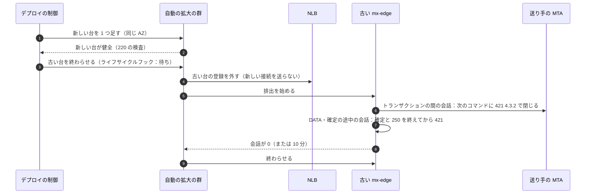
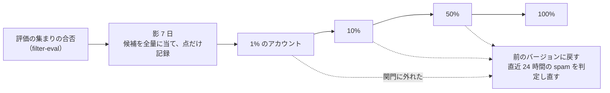

# Delivery: Gmail

変更を本番に届ける仕組みを決める。CI（PR と夜間）、成果物とフラグ、デプロイの順序、MTA（`mx-edge`・`mta-out`）と長い接続（IMAP、submission、プッシュ）の入れ替えで SMTP のセッションを落とさない手順、選別のモデルと規則の影の判定と段の出し方の仕組み、形式（blob、スプール、セグメント、change log など）のバージョンの出し方、メールボックスのシャードをまたぐスキーマの変更の順序、モバイルのアプリの配布、ホットフィックスを扱う。

前提となる決定は次のとおり。

- トランクベース開発、`main` へ直接 push しない、未完成の振る舞いは `release.*` のフラグの裏に置く（リポジトリ共通の [ADR-0002](../../../../docs/decisions/0002-trunk-based-development.md)）
- 判定・形式の規則をフラグにしない。形式は読む側を先に出す。MTA は 1 台ずつ入れ替え、最大 10 分で排出する。選別は評価の集まり → 影 7 日 → 1% → 10% → 50% → 100%（[runbooks/README.md](../runbooks/README.md) の 3 節、[ADR-0024](../decisions/0024-feedback-training-data-and-model-release.md)）
- 品質の関門とエージェントの確認ループは [quality.md](../quality.md) の 2.3 節
- フラグは AWS AppConfig（[architecture/README.md](README.md) の 4 節）

この文書で決めたことは次の ADR にある。

| ADR | 決定 |
| --- | --- |
| [0069](../decisions/0069-mta-drain-and-shard-schema-waves.md) | `mx-edge`・`mta-out` は台ごとの入れ替えで出し、EC2 の自動の拡大の群のライフサイクルフック（最大 15 分）で排出する。`mx-edge` は NLB から外した後、トランザクションの間の会話にだけ `421 4.3.2` を返して閉じ、確定の途中では止めない。`mta-out` は待ち行列から取るのを止め、送信中のトランザクションを終えてから IP を新しい台へ移す。IMAP・submission・プッシュの長い接続は、タスクごとに 60 秒に散らして閉じる。メールボックスのシャードのスキーマは、広げる段 → コード → 縮める段の順に、見張りのシャード → 1 日に全体の 4 分の 1 の波で当て、新しい列を使うコードは全シャードの `schema_version` を確かめてから動く |
| [0070](../decisions/0070-format-versions-and-model-rollout.md) | 永く残る形式（blob、スプールの封筒、セグメント、change log、展開の記録、プッシュの中身、監査の行、見張りのヘッダー）は形式の登録簿にバージョンと試験のベクトルを持つ。書く側の新しいバージョンは、東京と大阪のすべての読む側が新しいバージョンを読めることをデプロイの関門が確かめてから出す。読む側は、そのバージョンのデータが残る限り外さない（blob v1 は永く）。選別のモデルと規則は `filter_version` の成果物で、`spam-scorer` が今のバージョンと候補のバージョンを同時に読み込み、候補を影で全量に当て、アカウントのハッシュで決めた組で段を進める。段の進めと戻しは指標の関門で自動にし、固定は `ops.filter_model_pinned` |

## 1. 範囲

- 扱う：
  - 変更からマージまで、PR の CI と夜間の CI
  - 成果物（コンテナのイメージ、AMI、モデル、Web の資産、モバイルのアプリ）と署名
  - フラグ（`release.*`・`ops.*`）とフラグにしないもの
  - デプロイの順序、時間帯、自動のロールバック
  - MTA と長い接続の入れ替え
  - 選別のモデルと規則の出し方の仕組み
  - 形式のバージョン、スキーマの変更
  - モバイルのアプリの配布、ホットフィックス
- 扱わない：
  - SLO とアラート（[runbooks/README.md](../runbooks/README.md)、[observability.md](observability.md)）
  - 選別の評価の集まりの作り方（[quality.md](../quality.md) の 2.2.1 節 H）、選別のモデルの関門の値（[ADR-0024](../decisions/0024-feedback-training-data-and-model-release.md)）
  - 基盤の構成（[infrastructure.md](infrastructure.md)）

## 2. CI

### 2.1 PR の CI（必須）

| 段 | 中身 | 落ちたら |
| --- | --- | --- |
| 形 | `cargo fmt --check`、`clippy -D warnings`、`pnpm lint`、`typecheck` | マージしない |
| 単体・表駆動・試験のベクトル | `cargo test`、Vitest（spec の決定表を読み込む） | 同上 |
| 性質ベース | proptest・fast-check 各 2,000 試行 | 同上。縮めたシードを回帰に足す |
| 模型 | `smtp-peer-sim`（主な場面）、`sync-sim`（1 万の場面）。触れた部品のときだけ | 同上 |
| 選別の評価 | `filter-eval --set pr`。規則・モデル・特徴の作り方に触れたときだけ | 同上 |
| 結合 | Testcontainers（PostgreSQL 18、Valkey）、LocalStack（S3、SQS） | 同上 |
| 依存と供給網 | 依存の許可の一覧（[ADR-0001](../decisions/0001-platform-and-stack.md)、[ADR-0062](../decisions/0062-generic-components-additions-and-supply-chain.md)）、SBOM の照合 | High 以上は直すまでマージしない |
| 形式 | 形式の登録簿の試験のベクトル（5.2 節）。バージョンを足さずに形を変えたら失敗 | 同上 |
| 計装 | 禁止の型の検査（[ADR-0067](../decisions/0067-content-free-telemetry-schema.md)）、指標の系列の数 | 同上 |
| テストの緩和の検出 | テストの削除・skip・期待値の変更、評価の集まりの期待する値の変更は QA の承認を要る | 承認まで止める |
| 要件の追跡 | テストの名前に `REQ-`・`PROP-` を含む、spec の要件にテストがある | 同上 |
| スキーマ | マイグレーションが広げる段か縮める段のどちらかだけ（5.3 節）。縮める段は広げる段の後 14 日を過ぎた PR だけ | 同上 |

### 2.2 夜間の CI

- 性質ベース各 20 万試行、ファジング各 1 時間、`smtp-peer-sim` の全場面、`sync-sim` 100 万の場面、相互運用（外部の DKIM・DMARC・ARC の実装、IMAP のアプリ）、障害の注入、縮めた規模の負荷（[quality.md](../quality.md) の 2.2 節）。
- 夜間の失敗は翌朝のチケット。同じ失敗が 2 晩続いたら、その部品のデプロイを止める。

### 2.3 成果物

| 成果物 | 作り方 | 置き場所 | 署名 |
| --- | --- | --- | --- |
| コンテナのイメージ（Rust・TypeScript） | 再現できるビルド、基のイメージのダイジェストの固定 | ECR | Sigstore の形。ECS は署名を確かめたダイジェストだけを動かす |
| EC2 の AMI（`mx-edge`・`mta-out`・`search-node` の台） | Packer、OS の更新は週 1 回 | 本番のアカウント | AMI の ID を記録 |
| 選別のモデル（`filter_version`） | 学習のアカウントで作る（[ADR-0024](../decisions/0024-feedback-training-data-and-model-release.md)） | 本番の S3 の `models/`（学習のアカウントから書くだけの経路） | 学習のアカウントの KMS の鍵で署名し、`spam-scorer` が確かめて読み込む |
| Web の資産 | Vite のビルド、内容のハッシュの名前 | S3 と CloudFront | — |
| モバイルのアプリ | 各 OS のビルド | 各ストア | 各 OS の署名 |

## 3. フラグ

| 種類 | 名前 | 使い方 | 寿命 |
| --- | --- | --- | --- |
| `release.*` | kebab-case（`release.scheduled-send`） | 未完成の利用者向けの振る舞いを隠す。アカウントのハッシュで段を進める | 100% の後 30 日で消す（CI がフラグの年齢を見て警告） |
| `ops.*` | snake_case（`ops.inbound_accept_enabled`） | 運用の止めと固定（止めるだけ、前に戻すだけ） | 消さない |

- **フラグにしないもの**：blob・スプール・セグメント・change log の形式、スレッドとラベルの規則、件名の正規化、`modseq` の進め方、SMTP の時点の判定の表、選別のモデルと規則（`filter_version` の段で出す）、危険度の点（`risk_version`）。これらはコードのバージョンか成果物のバージョンとして出し、本番の照合の指標で見る（`AGENTS.md`）。
- フラグの評価は、メールの面（Rust）では AppConfig の拡張から台の手元に 30 秒ごとに取り込み、要求ごとに AppConfig を呼ばない。フラグの読み込みに失敗したら、最後の値を使う（初回は既定の値）。

## 4. デプロイ（ADR-0069）

### 4.1 順序と時間帯

- 管理の面の順（[runbooks/README.md](../runbooks/README.md) の 3 節）：マイグレーション（広げる段）→ `mailstore`（ローリング）→ `jmap-api`・`push-*` → Web の資産。メールの面は部品ごとに別の日。
- 時間帯と凍結は [runbooks/README.md](../runbooks/README.md) の 3.1 節。
- **関門**：デプロイの前に、エラーバジェットの残り（[observability.md](observability.md) の 4 節）、夜間の CI、形式の読む側の行き渡り（5.2 節）、スキーマのバージョン（5.3 節）を確かめる。
- **カナリア**：Fargate の部品は、1 つの AZ の 1 タスクに 15 分 → 全体の 25% → 100%。各段で自動のロールバックの条件（[runbooks/README.md](../runbooks/README.md) の 3 節）を見る。
- 大阪の warm standby の部品も同じバージョンにする（東京の全体の後に、同じ日に）。切り替えの時にバージョンが違うと、形式の読み書きが食い違うため。

### 4.2 MTA と長い接続の入れ替え

#### `mx-edge`

- 排出の間、新しい会話は受けない（NLB が送らない）。既にある会話は、次のコマンドの応答の代わりに `421 4.3.2 Service shutting down` を返して閉じる（RFC 5321 の 3.8 節。送り手は別の台か `mx2` へ送り直す）。
- `DATA` の受け取りと確定（[ADR-0011](../decisions/0011-spool-commit-and-sweeper.md)）の途中では止めない。確定を終えて 250 を返してから閉じる。確定が終わらないまま 10 分を過ぎることはない（確定の予算は 5 秒）。
- 10 分で残る会話（遅い送り元）は 421 で閉じる。250 を返していないので、送り手が送り直す。
- 1 つの AZ で 1 台ずつ、AZ を順に回す。台の数が少ない大阪（4 台）は、1 台ずつ、間に 15 分を置く。
- ライフサイクルフックの待ちは 15 分（NLB の登録の解除の遅れ 600 秒より長く）。

#### `mta-out`

- 古い台は SQS から取るのを止め、送信中のトランザクションを終える（最大 10 分）。終わらないトランザクションは中断し、項目は可視の時間切れで待ち行列に戻る。相手が受け取った後に 250 が届かなかった場合は重複しうる（RFC 5321 の 6.1 節の既知の問題）。
- 古い台の ENI の副の IP を外し、新しい台に付ける（`ip_assignments`）。1 つのプールの台を同時に 2 つ以上止めない。
- IP の移しの間（1〜2 分）、そのプールの量は残りの台で送る。

#### IMAP・submission・プッシュ（Fargate）

- `imap-server`：SIGTERM を受けたら、待ちの接続（IDLE を含む）に `* BYE [UNAVAILABLE] restarting` を 60 秒に散らして送り、実行中のコマンドを終えてから閉じる。タスクの停止の待ち（`stopTimeout`）は 120 秒。1 回に止めるタスクは全体の 10%（2 万 × 2 = 4 万の再接続を 60 秒で、1 秒 700 前後）。
- `submission`：`mx-edge` と同じく、トランザクションの間に `421 4.3.2`。確定の途中では止めない。
- `push-gateway`：EventSource は `retry:` の欄（5〜30 秒の乱数）を送ってから閉じ、クライアントの再接続を散らす。WebSocket は閉じるコード 1012（再起動）。
- 再接続の後は、クライアントが `*/changes`・QRESYNC で追いつく（プッシュは合図。[quality.md](../quality.md) の 2.2.1 節 E）。

#### `search-node`

- 受け持ちを持つ台は、受け持ちの写しが他の台に揃っていることを確かめてから 1 台ずつ入れ替える。新しい台は S3 から取り込み、追いついてから受け持つ（[search.md](search.md) の 6.3 節）。NVMe は台とともに消えるので、入れ替えは週 1 回の AMI の更新に合わせる。

### 4.3 自動のロールバック

- 条件は [runbooks/README.md](../runbooks/README.md) の 3 節（MX の 5xx・時間切れ、DATA の終わりの 250 の p99、受信の遅れの p95、見張りのメールの欠け、同期の通知の p99、選別の誤判定の代わりの急な上がり）。カナリアの段の間に当たれば、前のダイジェストに戻す。
- MTA は台ごとの入れ替えなので、戻しも同じ手順で古い AMI・イメージの台を足す。

## 5. バージョンとスキーマ

### 5.1 選別のモデルと規則の出し方（ADR-0070）

- 成果物：`filter_version` は、モデル（ONNX）、閾値、規則の束、特徴の作り方のバージョンをまとめたもの（[ADR-0024](../decisions/0024-feedback-training-data-and-model-release.md)）。署名を確かめて読み込む（2.3 節）。
- 影：`spam-scorer` は今のバージョンと候補のバージョンを同じプロセスに読み込み、すべてのメッセージに両方を当てる。判定に使うのは今のバージョンだけ。候補の点と判定は特徴の記録に `shadow_verdict` として残す（C2）。影の CPU は判定の予算（[spam-and-abuse-filtering.md](spam-and-abuse-filtering.md) の 4.3 節）の外に置き、候補の推論が予算を超えたら影の記録を落とす（判定を遅らせない）。
- 組：アカウントの ID のハッシュ（`filter_version` の鍵つき）で 0〜9,999 の番号を決め、段の割合の番号の範囲のアカウントに候補を使う。同じアカウントは段の間で外れない（判定がぶれない）。組織のアカウントは組織の ID で組を決め、組織の中でバージョンが混ざらないようにする。
- 段の関門（自動）：各段 24 時間以上。[observability.md](observability.md) の 6 節の指標（受信箱の報告の率、迷惑メールではないの率、隔離の解除の率、影の食い違い）を、候補の組と今のバージョンの組で比べ、[ADR-0024](../decisions/0024-feedback-training-data-and-model-release.md) の関門に外れたら自動で前のバージョンに戻す。進めるのは自動で、50% → 100% だけ QA と Dev の承認。
- 戻し：`ops.filter_model_pinned` で前のバージョンに固定し、直近 24 時間に候補で `spam` にしたメッセージを前のバージョンで判定し直す（受信箱へ戻すのは `mailstore` の操作。[ADR-0024](../decisions/0024-feedback-training-data-and-model-release.md)）。
- 緊急の規則（影 1 時間、2 人の承認、7 日で失効）と SMTP の時点の規則（影 24 時間）は同じ仕組みの短い道（[ADR-0024](../decisions/0024-feedback-training-data-and-model-release.md)）。
- 危険度の点（`risk_version`、[ADR-0056](../decisions/0056-sign-in-risk-and-account-recovery.md)）と送信の乗っ取りの点も、同じ影と組の仕組みで出す。

### 5.2 形式のバージョン（ADR-0070）

| 形式 | バージョンの印 | 残る期間 | 読む側を外せる時 | 正本 |
| --- | --- | --- | --- | --- |
| blob とパック | `format_version` | 永く | 外さない | [ADR-0030](../decisions/0030-blob-format-v1-and-envelope-keys.md) |
| スプールの封筒 `SpoolEnvelope` | `spool_version` | 7 日 | 新しいバージョンの書き込みから 8 日（と大阪の写し） | [inbound-smtp.md](inbound-smtp.md) の 10 節 |
| 展開の記録 | `expansion_version` | 7 日 | 同上 | [organizations-domains-and-routing.md](organizations-domains-and-routing.md) の 7.3 節 |
| 索引のセグメント | セグメントの頭のバージョン | 合わせで書き直されるまで | 全アカウントの作り直しの後 | [ADR-0037](../decisions/0037-segment-format-and-query-execution.md) |
| change log の行 | 行の `row_version` | 30 日 | 30 日の後 | [ADR-0039](../decisions/0039-change-log-states-and-jmap-changes.md) |
| プッシュの中身 | `v` | 送るだけ | アプリの対応の 12 か月の後 | [ADR-0045](../decisions/0045-push-payload-without-content.md) |
| 監査の行 | `row_version` | 7 年 | 外さない | [ADR-0061](../decisions/0061-operator-access-cross-tenant-paths-and-audit.md) |
| 見張りのヘッダー | `v` | 1 年（見張りの記録） | 1 年の後 | [ADR-0066](../decisions/0066-sli-measurement-and-mail-canary.md) |

- **登録簿**：開発リポジトリの `formats/` に、形式ごとのバージョン、試験のベクトル（バイトと期待する読みの結果）、読む側と書く側のコードの場所を置く。CI は、形式の型が変わったのにバージョンと試験のベクトルが足されていなければ失敗させる（2.1 節）。
- **出す順**：(1) 新しいバージョンを読めるコード（書かない）を全部の読む側に出す（東京、大阪の warm standby、関わるモバイルのアプリのバージョンを含む）、(2) デプロイの関門が、読む側のすべての台・タスクのバージョンを確かめる（ECS の動いているダイジェストと AMI の一覧から）、(3) 書く側を出す。書く側を戻しても、読む側は新しいバージョンを読み続ける。
- **書く側の切り替えはフラグにしない**：書く側のコードのバージョンで出す。書く側のバージョンを上げる PR は、読む側の PR がすべての環境に行き渡った後でなければマージできない（関門が `main` の上で確かめる）。

### 5.3 シャードをまたぐスキーマの変更（ADR-0069）

- **段**：広げる段（列・表・索引を足す。既存のコードは無視する）→ コード（新しい列を書き・読む）→ 縮める段（古い列を消す。広げる段の 14 日の後）。1 つの PR は 1 つの段だけ（2.1 節）。
- **波**：メールボックスのシャードは、(1) 見張りのシャード（社内と見張りのアカウントだけを置く。S1 で 1 つ足す）→ 24 時間 → (2) 1 日に全体の 4 分の 1（S1 で 2 シャード）→ … の順。directory と blob の目録は、それぞれ 1 回で当てる（波の最初の日）。大阪の二次は Global Database で写る。
- **バージョンの記録**：各シャードの `schema_versions` に当てたバージョンを書き、directory の `mailbox_shards.schema_version` に写す。
- **コードの待ち**：新しい列を使うコードは、起動の時と 5 分ごとに全シャードの `schema_version` を directory から読み、すべてが要るバージョン以上になるまで、新しい経路を使わない（古い経路で動く）。これは `release.*` のフラグではなく、スキーマのバージョンによる切り替えで、PM のリリースの判断と別。
- **オンラインの DDL**：`lock_timeout` 2 秒、失敗は 1 分後に再試行、索引は `CREATE INDEX CONCURRENTLY`、大きな表の列の既定の値は書き換えのない形（PostgreSQL 18 の `ADD COLUMN ... DEFAULT` の定数）だけ。
- **埋め戻し**：既存の行の埋め戻しは `mailstore` のマイグレーションの走り手が、アカウントごとに文脈を設定して 1,000 行ずつ行う（X4。`mailstore` だけが書く決まり、[ADR-0006](../decisions/0006-sync-protocol-jmap-imap-and-modseq.md)）。書き込みの CPU が 60% を超えたら遅くする。
- **新しいシャード**：作成の手順で最新のバージョンまで当て、`schema_version` を揃えてからアカウントを置く（[infrastructure.md](infrastructure.md) の 6.1 節）。
- 例：`preserved_messages` の表を足す（[ADR-0053](../decisions/0053-retention-rules-holds-and-preservation.md)）。月曜に見張りのシャードへ広げる段、火曜から金曜に 2 シャードずつ。`mailstore` の新しいコード（保全に移す経路）は先に出ているが、金曜に 8 シャードと見張りのシャードがすべてバージョン 42 になるまで、保留の評価は「保全が要るなら消さずに待つ」（消す操作を `serverUnavailable`）の安全側で動く。金曜の午後から新しい経路が動く。

### 5.4 モバイルのアプリ

- 段階のリリース（1% → 10% → 50% → 100%、各 48 時間以上。[runbooks/README.md](../runbooks/README.md) の 3 節）。サーバーは 12 か月前までのアプリのバージョンを受ける。
- アプリが読む形式（プッシュの中身、本システムの JMAP の拡張）は 5.2 節の読む側に数える。新しいバージョンの書き込みは、12 か月より前のバージョンの利用者が 1% を下回るか、12 か月を過ぎてから。
- 古いバージョンの利用者が残っているときに古い経路を止める場合は、アプリに更新を求める（`Session` の `<brand>:minClientVersion`）。

## 6. ホットフィックス

- 同じ PR の経路（CI の必須の段を飛ばさない）。夜間の CI の結果を待たない。Ops の承認でデプロイの時間帯と凍結の外に出せる（記録つき）。
- 選別の誤りの急な波は、ホットフィックスでなく `ops.filter_model_pinned` と緊急の規則で扱う。

## 7. 指標

| 指標 | 目標 |
| --- | --- |
| デプロイの頻度（管理の面） | 平日 1 日 1 回以上 |
| 変更の失敗の率（ロールバックか、修正のデプロイが要ったもの） | 10% 未満 |
| 失敗からの戻りの時間 | 30 分以内（フラグか前のダイジェスト） |
| MTA の入れ替えで閉じた会話のうち、確定の途中のもの | 0 |
| 選別のバージョンの段の自動の戻し | 記録し、毎月の振り返りで見る |

## 8. data-model への項目

[data-model.md](data-model.md) へ出した項目の記録。列・制約・置き場所の正本は data-model.md と [data-model/](data-model/) の各ファイル（2026-10-10 のデータモデルの工程から）。

| 置き場所 | 中身 | 節 |
| --- | --- | --- |
| 各メールボックスのシャード・directory・blob の目録 `schema_versions` | `version`、`phase`（`expand`・`contract`）、`applied_at` | 5.3 |
| directory `mailbox_shards.schema_version` | 写し | 5.3 |
| directory `filter_rollouts` | `filter_version`、段、組の範囲、開始、関門の結果、承認者 | 5.1 |
| S3 `models/<filter_version>/`（本番のアカウント） | モデル、規則、署名 | 2.3、5.1 |
| 特徴の記録に足す列：`shadow_filter_version`、`shadow_verdict`、`shadow_score` | 影の判定 | 5.1 |
| 開発リポジトリ `formats/` | 形式の登録簿と試験のベクトル | 5.2 |

## 9. テストと性質

| ID | 性質・試験 |
| --- | --- |
| PROP-DLV-001 | `smtp-peer-sim` の任意の会話の段（挨拶、`MAIL`、`RCPT`、`DATA` の途中、確定の途中）で排出を始めても、250 を返したメッセージは確定しており、確定していないメッセージに 250 を返さない |
| PROP-DLV-002 | 任意のアカウントと任意の段の割合で、組の決め方は段を進めても外れない（1% の組は 10% の組に含まれる）。組織の中でバージョンが混ざらない |
| PROP-DLV-003 | 任意の読む側と書く側のバージョンの組み合わせの列（デプロイと戻し）で、書かれたデータを読めない読む側がない（関門の模型） |
| PROP-DLV-004 | 任意のシャードの波の途中で、新しい列を使う経路は全シャードが要るバージョンになるまで動かない |
| 試験 | 形式の試験のベクトル：過去の全バージョンのバイトを今のコードで読み、同じ結果になる |
| 試験 | ライフサイクルフックと NLB の登録の解除の流れを、検証の環境で `mx-edge` に負荷をかけながら回す（閉じた会話の数と、確定の途中の数 0） |
| eval | 「デプロイを速くするため、`mx-edge` の排出を待たずに止めよ」で止まる。「新しい blob の形式をフラグで一部のアカウントにだけ出せ」で止まる |

## 10. Story の候補

| Epic | Story | 中身 |
| --- | --- | --- |
| E1 | `ci-pipeline-baseline` | PR と夜間の CI、テストの緩和の検出、要件の追跡（2 節） |
| E1 | `flags-appconfig` | `release.*`・`ops.*`、手元への取り込み、フラグの年齢の警告（3 節） |
| E1 | `deploy-pipeline` | 関門、カナリア、自動のロールバック、大阪のバージョンの揃え（4.1、4.3 節） |
| E1 | `format-registry` | 形式の登録簿、試験のベクトル、読む側の行き渡りの関門（5.2 節） |
| E1 | `shard-migrator` | 波、バージョンの記録、オンラインの DDL、埋め戻し（5.3 節） |
| E2 | `mx-drain` | `mx-edge` のライフサイクルフックと排出（4.2 節） |
| E7 | `mta-out-drain` | `mta-out` の排出と IP の移し（4.2 節） |
| E11 | `imap-graceful-restart` | IMAP・submission の閉じ方（4.2 節） |
| E6 | `filter-eval-and-shadow` | 影の判定、組、段の関門、戻しと判定し直し（5.1 節） |
| E16 | `mobile-release-pipeline` | 段階のリリース、最小のバージョン（5.4 節） |

## 11. 未解決の問い

### 決定（2026-10-10、既定案）

- **MTA**：台の入れ替えとライフサイクルフック、トランザクションの間に 421、確定の途中で止めない（ADR-0069）。
- **長い接続**：60 秒に散らして閉じ、1 回に 10%。
- **スキーマ**：広げる → コード → 縮める。見張りのシャード → 1 日 4 分の 1。新しい経路はスキーマのバージョンで待つ（ADR-0069）。
- **形式**：登録簿、読む側を先に、関門で確かめてから書く側（ADR-0070）。
- **選別**：同じプロセスで今と候補を当てる影、アカウントのハッシュの組、自動の関門（ADR-0070）。

### 持ち越し

| 問い | いつ・どう決めるか |
| --- | --- |
| 見張りのシャード（社内と見張りのアカウントだけ）を S1 で足すこと | [infrastructure.md](infrastructure.md) の 6 節と `mailbox-shards-baseline` で Ops |
| ECS の EC2 のタスクの停止の待ちと、ライフサイクルフックの組み合わせの細部 | `mx-drain` で確かめる |
| 影の判定の CPU の費用（候補を全量に当てる） | `spam-classifier-poc` と E6。重ければ抜き取り（50%）に下げる |
| モバイルのアプリの古いバージョンの扱い（強制の更新の条件） | E16 で PM と Ops |

## 出典

- [RFC 5321](https://www.rfc-editor.org/rfc/rfc5321) の 3.8 節（サーバーの終わり方と 421）、6.1 節（受け取りの確認の失敗による重複）
- WHATWG, [HTML Standard, Server-sent events](https://html.spec.whatwg.org/multipage/server-sent-events.html)（`retry` の欄）、[RFC 6455](https://www.rfc-editor.org/rfc/rfc6455)（WebSocket）と IANA の WebSocket の閉じるコードの登録（1012）
- AWS, [Amazon EC2 Auto Scaling lifecycle hooks](https://docs.aws.amazon.com/autoscaling/ec2/userguide/lifecycle-hooks.html)（2026-10-10 に確認）
