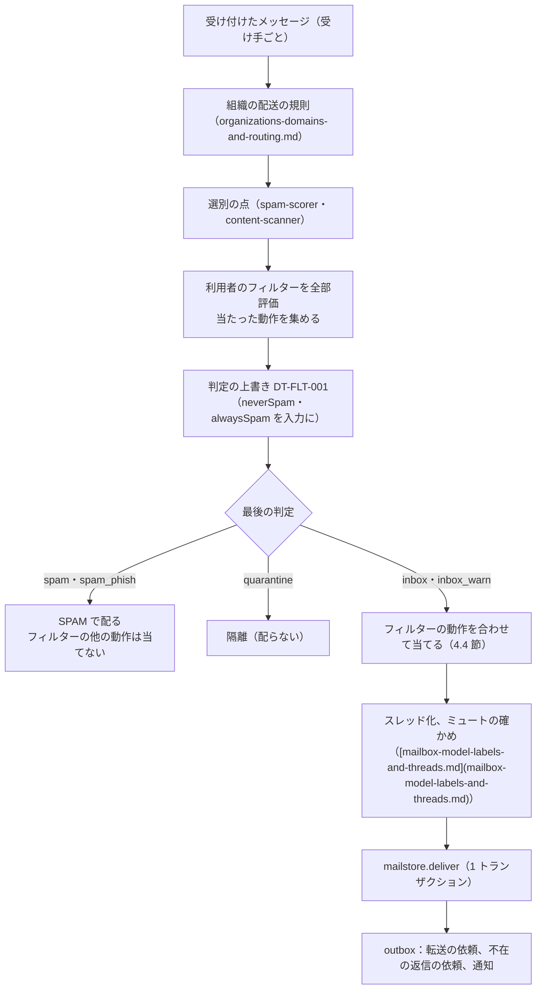
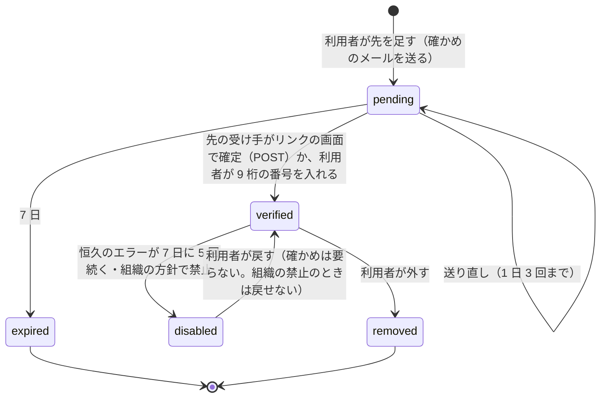
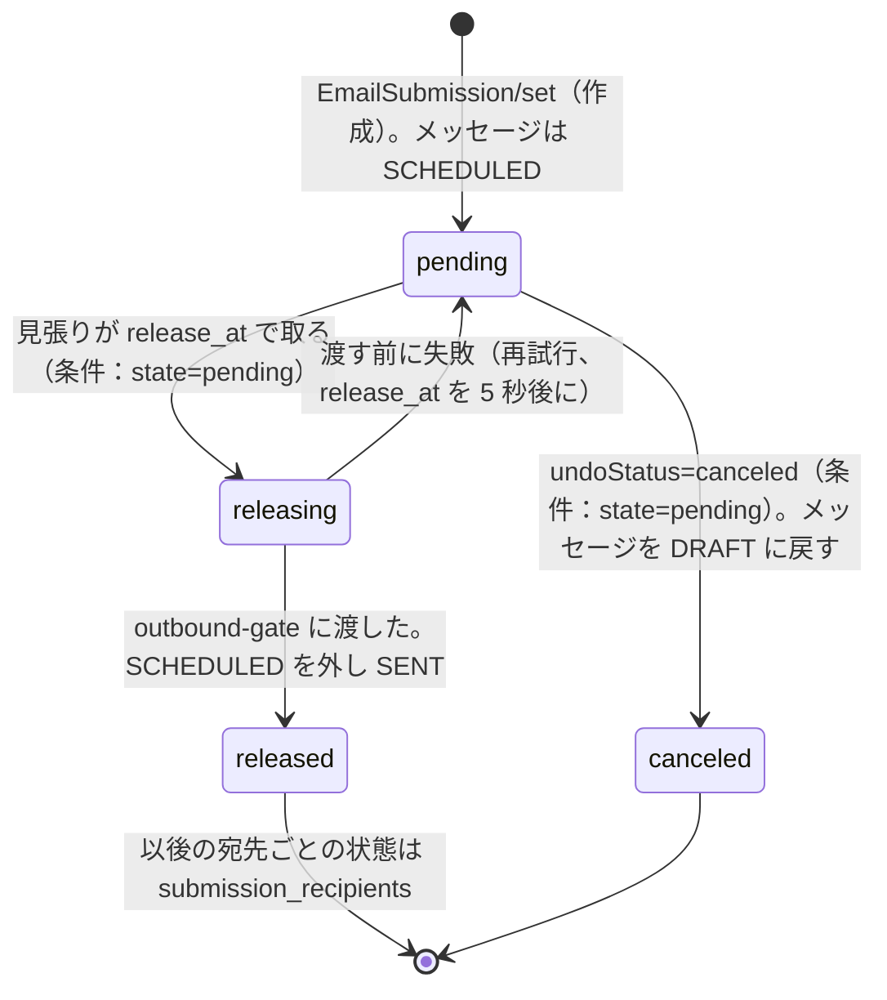

# Filters, Forwarding and Automation: Gmail

利用者のフィルター、確認つきの転送、不在の返信、時刻の仕事（元に戻す送信の窓、予約の送信、スヌーズの起こし）を決める。フィルターの条件（検索の IR）と動作、配送のパイプラインの中での評価の順序、動作の合わせ方、既存のメールへの適用、転送の先の確かめ、SRS と ARC と配る形での転送、ループの止め、失敗での停止、RFC 3834 に沿った不在の返信と 4 日の絞り、送信の依頼の状態の機械、時刻の仕事の仕組みを扱う。

前提となる決定は次のとおり。

- フィルターの条件は検索と同じ IR（`search-lang`）を使う（[ADR-0001](../decisions/0001-platform-and-stack.md)、[ADR-0036](../decisions/0036-search-language-and-ir.md)）
- 利用者のフィルターの「迷惑メールにしない」「迷惑メールにする」は、選別の判定の上書きの決定表 DT-FLT-001 の 5・6 行で当たる（[spam-and-abuse-filtering.md](spam-and-abuse-filtering.md) の 5.5 節、[ADR-0022](../decisions/0022-verdict-score-composition-and-overrides.md)）
- 転送は SRS で封筒を書き換え（[ADR-0020](../decisions/0020-bounces-dsn-srs-and-feedback-loops.md)）、ARC で封印し（[ADR-0017](../decisions/0017-arc-sealing-trusted-sealers-and-dmarc-reports.md)）、`forward` の IP プールから送る（[ADR-0018](../decisions/0018-outbound-ip-pools-and-warmup.md)）
- 元に戻す送信は 5・10・20・30 秒、予約の送信は 100 通・1 年先まで、不在の返信は同じ差出人へ 4 日に 1 回（[architecture/README.md](README.md) の 6 節の決定）
- 送信の依頼は `release_at` を過ぎたら `outbound-gate` が取る（[outbound-smtp-and-reputation.md](outbound-smtp-and-reputation.md)）

この文書で決めたことは次の ADR にある。

| ADR | 決定 |
| --- | --- |
| [0047](../decisions/0047-user-filter-evaluation.md) | フィルターの条件は、検索の IR のうち配送の時に決まる節（語、アドレス、件名、添付、大きさ、`list:`）だけにする。配送の時に、組織の規則と選別の点の後、判定の上書きの前に、すべてのフィルターを作った順に評価し、当たったものの動作を決めた優先で合わせる（最初に当たったもので止めない）。語の一致は検索と同じ語の分け方で、配送の時に 1 回だけ分けて全部のフィルターで使う。Sieve を中の形式に使わない。1 アカウント 1,000 まで |
| [0048](../decisions/0048-verified-forwarding.md) | 転送の先は、確かめのメールのリンクを押した先の画面での確定（POST）か、9 桁の番号の入力で確かめ、確かめるまで転送しない。転送するのは選別の後に迷惑メール・隔離でないものだけで、配る形に本システムのヘッダーを足し、SRS と ARC を付けて `forward` のプールから送る。ループは本システムのヘッダーで止める。恒久のエラーが 7 日の中で 5 回続いたら転送を止めて知らせる |
| [0049](../decisions/0049-timed-jobs-vacation-and-scheduled-send.md) | 時刻の仕事は、メールボックスのシャードの `timers` の表と、シャードごとの見張り（1 秒ごと、`SKIP LOCKED`）で動かす。送信の依頼は `pending → releasing → released`・`canceled` の状態の機械で、取り消しと解放は条件つきの更新で競う。不在の返信は RFC 3834 に沿い、差出人のアドレスの HMAC ごとに最後に返した時刻を持ち、96 時間に 1 回だけ返す。設定の文を変えたら覚えを消す |

## 1. 範囲

- 扱う：
  - フィルターの条件、動作、評価の順序、合わせ方、既存のメールへの適用、上限
  - 転送の先の確かめ、アカウントの全部の転送とフィルターの転送、転送するもの、SRS・ARC・配る形、ループの止め、失敗での停止、知らせ
  - 不在の返信の条件、絞り、返すメッセージの形
  - 時刻の仕事の仕組み、元に戻す送信の窓、予約の送信、スヌーズの起こし
  - 送信の依頼（`submissions`）の状態の機械
- 扱わない：
  - 組織の配送の規則（organizations-domains-and-routing.md）。この文書は、組織の規則の後に利用者のフィルターを当てるところから
  - 選別の点と判定（[spam-and-abuse-filtering.md](spam-and-abuse-filtering.md)）
  - SRS の形と鍵、転送の先の不達の戻し（[outbound-smtp-and-reputation.md](outbound-smtp-and-reputation.md) の 8.4 節）、ARC の封印の中（[sender-authentication.md](sender-authentication.md) の 7 節）
  - `EmailSubmission` のプロトコルの形（[client-sync-and-protocols.md](client-sync-and-protocols.md) の 6.6 節）
  - 転送の規則の変更を乗っ取りの印に使うこと（accounts-and-security.md、[outbound-smtp-and-reputation.md](outbound-smtp-and-reputation.md) の 11 節）

## 2. 要件

| 要件 | 値 | 出どころ |
| --- | --- | --- |
| 配送の遅れ | フィルターの評価を含めて、250 から受信箱まで p95 10 秒。フィルターの持ち分は 1 通 p99 20ms | NFR-001 |
| 送信の遅れ | 元に戻す送信の窓の後、外部の MX への最初の試行まで p95 5 秒 | NFR-002 |
| 検索との一致 | フィルターの条件に当たるメッセージと、同じ条件の検索で出るメッセージが同じ（配送の時に決まる節で） | [ADR-0036](../decisions/0036-search-language-and-ir.md) |
| 後方散乱を作らない | 転送と不在の返信で、確かめられない送り手・迷惑メールに送らない | [ADR-0002](../decisions/0002-accept-then-filter.md)、NFR-012 |
| 黙って捨てない | 転送を止めた、予約の送信が失敗したときは利用者に知らせる | [intent.md](../intent.md) の「守るべき振る舞い」 |

## 3. 本家の形と標準

いずれも 2026-10-10 に確認。

| 項目 | 本家・標準 | この設計 |
| --- | --- | --- |
| フィルターの動作 | ラベル、アーカイブ、削除、スター、自動の転送（[Create rules to filter your emails](https://support.google.com/mail/answer/6579)）。転送のフィルターは新しいメッセージだけに当たる | 4.2 節。転送は既存のメールに当てない（4.6 節） |
| フィルターの数の上限、評価の順序 | 公式の資料で確かめられなかった（**未検証**） | 1,000、全部を評価して合わせる（ADR-0047） |
| 転送の確かめ | 転送の先に確かめのリンクを送り、押して確かめる。複数の先へは、先ごとにフィルターを作る。転送を始めた最初の週は知らせを出す（[Automatically forward Gmail messages to another account](https://support.google.com/mail/answer/10957)） | 確かめのリンク（と番号）。知らせを 7 日出す（5 節） |
| 転送の先の数の上限、確かめの期限 | **未検証** | 20、7 日 |
| 不在の返信 | 同じ差出人へは原則 1 回、4 日たってから再び来たら再び送る。迷惑メールと購読のメーリングリストには返さない（[Send automatic replies](https://support.google.com/mail/answer/25922)） | 同じ（6 節） |
| 自動の返信の標準 | RFC 3834：`Auto-Submitted` のあるメール、メーリングリスト、`Precedence: bulk` などに返さない。返信に `Auto-Submitted: auto-replied` を付ける。返す先は `Return-Path` | 6 節 |
| 元に戻す送信 | 5・10・20・30 秒（[Undo sending](https://support.google.com/mail/answer/2819488)） | 同じ（7.2 節） |
| 予約の送信 | 100 通まで（[Schedule emails to be sent later](https://support.google.com/mail/answer/9214606)） | 100 通、1 年先まで（7.3 節） |
| Sieve | RFC 5228 の、メールの振り分けの言語 | 中の形式に使わない。読み込みと書き出しは MVP の後（[roadmap.md](../roadmap.md) の延期の一覧） |

## 4. フィルター（ADR-0047）

### 4.1 条件

- 条件は検索の文字列で書き、`search-lang` で IR にする（[search.md](search.md) の 5 節）。
- 配送の時に決まる節だけを受ける：`Text`（件名・本文・添付の名前）、`Addr`（`from`・`to`・`cc`・`bcc`・`deliveredto`）、`subject:`、`filename:`、`has:attachment`、`larger:`・`smaller:`、`list:`、否定・AND・OR・`AROUND`。
- 受けない節：`label:`、`in:`、`is:`（状態）、`before:`・`after:`・`older_than:`・`newer_than:`（時刻）、`rfc822msgid:`。保存の時に `unsupportedInFilter` で返す。
- `bcc:` は、封筒の宛先が利用者でヘッダーの `To`・`Cc` にないとき（Bcc で受けた）に当たる。

### 4.2 動作

| 動作 | 意味 | 当て方 |
| --- | --- | --- |
| `skipInbox` | 受信箱に入れない（アーカイブ） | `INBOX` を付けない |
| `markRead` | 既読にする | `seen` |
| `star` | スター | `STARRED` |
| `addLabel(L)` | ラベルを付ける（複数可） | L |
| `markImportant`・`neverImportant` | 重要の印 | `IMPORTANT` の有無 |
| `trash` | 削除（ゴミ箱へ） | `TRASH`（DT-MBX の行 9） |
| `neverSpam` | 迷惑メールにしない | DT-FLT-001 の 5 行 |
| `alwaysSpam` | 迷惑メールにする | DT-FLT-001 の 6 行 |
| `forward(addr)` | 確かめた先へ転送 | 5 節 |

### 4.3 評価の順序

- 迷惑メールの箱に入るメッセージには、ラベル・転送・不在の返信を当てない（転送と返信は後方散乱と迷惑メールの中継になるため）。
- `attachment_blocked` の印のメッセージも、箱の判定に従う。転送するときは配る形（止めた添付を置き換えたもの）を送る（5.2 節）。
- 本システムの中の宛先への送信も、外からのメールと同じ順序で当てる（[outbound-smtp-and-reputation.md](outbound-smtp-and-reputation.md) の 4.1 節）。

### 4.4 動作の合わせ方

当たったフィルターの動作を全部集め、次の決定表 DT-FILT-001 で 1 つにする。

| # | 集まった動作 | 結果 |
| --- | --- | --- |
| 1 | `trash` がある | `TRASH` で配る。`addLabel` は隠した所属で付ける（戻したときに出る）。`forward` は当てる。他は捨てる |
| 2 | `neverSpam` と `alwaysSpam` の両方 | `neverSpam` を採る（正規のメールを守る側。NFR-009） |
| 3 | `markImportant` と `neverImportant` の両方 | `neverImportant` |
| 4 | `skipInbox` がある | `INBOX` を付けない |
| 5 | `addLabel` が複数 | 全部付ける（同じラベルは 1 回） |
| 6 | `forward` が複数 | 違う先へ全部（1 通につき 5 先まで。超えた分は作った順で落とし、利用者に知らせる） |
| 7 | `markRead`・`star` | そのまま |

- 判定が `inbox_warn` のときも、フィルターの動作を当てる（警告の帯は残る）。

### 4.5 例

佐藤のアカウントのフィルター（作った順）：

| # | 条件 | 動作 |
| --- | --- | --- |
| F1 | `from:billing@shop.example` | `addLabel(請求)`、`skipInbox` |
| F2 | `has:attachment 請求書` | `star`、`forward(keiri@corp.example)` |
| F3 | `list:news.shop.example` | `trash` |

メッセージ：差出人 `billing@shop.example`、件名「9 月分の請求書」、PDF の添付、`List-Id` なし。選別の点は `inbox`。

1. F1 当たり：`addLabel(請求)`、`skipInbox`。
2. F2 当たり（添付あり、`請求`・`求書` の語句が件名に）：`star`、`forward(keiri@…)`。
3. F3 当たらない。
4. 上書き：`neverSpam`・`alwaysSpam` なし。判定は `inbox` のまま。
5. 合わせ：行 4 で `INBOX` なし、行 5 で `請求`、行 7 で `STARRED`、行 6 で転送 1 先。
6. `mailstore.deliver` が `請求`・`STARRED` で配り、outbox に転送の依頼を書く。

同じメッセージが選別で `spam` だったら、`SPAM` で配り、F1・F2 の動作も転送も当てない。

### 4.6 既存のメールへの適用

- フィルターを作るとき「既存のメールにも当てる」を選べる。同じ IR で検索し（[search.md](search.md)）、結果に `addLabel`・`skipInbox`・`markRead`・`star`・`trash`・`markImportant` を当てる。`forward` は当てない（本家と同じ）。`neverSpam`・`alwaysSpam` は迷惑メールの箱の移しとして当てる。
- 1,000 通ずつ `mailstore` の操作にする（1 回ごとに `modseq`）。1 回の適用は 10 万通まで。背景の作業で、進み具合を画面に出す。

### 4.7 評価の仕組み

- 配送の時、受け手のフィルターを（Valkey に 5 分キャッシュした）IR の表で読み、メッセージの語を 1 回だけ分ける（[search.md](search.md) の 4 節の語の分け方。同じ `analyzer_version`）。語と位置の手元の表を作り、すべてのフィルターの `Text` の節をその表で当てる。
- 1 通の評価の予算は CPU 20ms。超えたら、評価できたフィルターまでで合わせ、`filter_budget_exceeded` を数える（フィルターの数・入れ子の深いアカウントの調べ）。
- 語の分け方のバージョンを上げるときは、フィルターの評価と索引を同じ時に切り替える（検索との一致のため）。

## 5. 転送（ADR-0048）

### 5.1 転送の先の確かめ

- 確かめのメールは `system` のプールから先に送る。本文に、頼んだアカウントのアドレス、確定のリンク（`https://app.<brand>.<domain>/fwd/confirm/<token>`、`token` は 128 ビットの乱数でハッシュだけを持つ）と 9 桁の番号を入れる。
- リンクは GET で確定しない。開いた画面で「確定する」を押した POST で確定する（メールのリンクを自動で開く検査の仕組みで、勝手に確定しないため）。
- 1 アカウントの確かめた先は 20 まで、確かめのメールは 1 日 10 通まで。
- 組織の方針で外への転送を禁止できる（organizations-domains-and-routing.md）。禁止なら先を足せず、既存の先は `disabled`。
- 転送を始めた（先を確かめた、全部の転送を有効にした）ら、アカウントの受信箱に知らせのメールを送り、Web とアプリに 7 日間の帯を出す（本家の「最初の週の知らせ」に合わせる）。乗っ取りで仕込まれた転送に、本人が気づけるようにする。

### 5.2 転送するもの

- アカウントの全部の転送（設定）と、フィルターの `forward`。どちらも `verified` の先だけ。
- 送るのは、4.3 節の最後の判定が `inbox`・`inbox_warn` のメッセージ（`trash` のフィルターに当たったものも含む）。迷惑メールの箱・隔離のものは送らない。
- 中身は配る形（[message-parsing-and-storage.md](message-parsing-and-storage.md) の 7.5 節：偽の `Authentication-Results` の名前を変え、止めた添付を置き換えたもの）に、`Received` と `X-<Brand>-Forwarded-By: <アカウントの HMAC>` を足し、ARC の組で封印する（[ADR-0017](../decisions/0017-arc-sealing-trusted-sealers-and-dmarc-reports.md)）。本文は変えない。
- 封筒：`MAIL FROM` を SRS にし（[ADR-0020](../decisions/0020-bounces-dsn-srs-and-feedback-loops.md)）、宛先は転送の先。`forward` のプールから送る（[ADR-0018](../decisions/0018-outbound-ip-pools-and-warmup.md)）。
- 転送した後の元のメッセージの扱い（設定）：受信箱に残す（既定）、既読にする、アーカイブする、ゴミ箱へ移す。
- 1 アカウントの転送は 1 日 5,000 通まで。超えたら以後のその日の転送を止め、利用者に知らせる。数え方と送信の上限との関係は [outbound-smtp-and-reputation.md](outbound-smtp-and-reputation.md) の 10 節。

### 5.3 ループの止め

次のどれかなら転送しない（配送はする）。

- メッセージに、このアカウントの HMAC の `X-<Brand>-Forwarded-By` がある（自分が前に転送したもの）。
- `X-<Brand>-Forwarded-By` が 5 つ以上ある。
- `Received` が 50 以上ある（RFC 5321 の 6.3 節の考え方）。
- 転送の先が、このアカウント自身か、このアカウントに配る別名。

例：A（本システム）が B（本システム）へ、B が A へ全部を転送している。外から A に届いたメール m：A は m を配り、`Forwarded-By: hA` を足して B へ。B は配り、`Forwarded-By: hB` を足して A へ。A は m に `hA` があるので転送しない。A の受信箱には m が 2 通（外からと、B からの転送）。本システムの中の宛先への転送は、同じ blob を使わない（別の配送）。

### 5.4 失敗での停止

- 転送の先からの恒久のエラー（[outbound-smtp-and-reputation.md](outbound-smtp-and-reputation.md) の 8 節の `hard_invalid_recipient`・`hard_domain`・`policy_reputation`・`content_rejected`）を、先ごとに数える。7 日の中で 5 回続いたら（間に成功があれば数え直す）、その先を `disabled` にし、利用者に知らせのメールと帯を出す。
- 一時のエラーは数えない（再試行と期限は送信の側）。

## 6. 不在の返信（ADR-0049）

### 6.1 返す条件

JMAP の `VacationResponse`（RFC 8621 の 8 節）で設定する（`isEnabled`、`fromDate`、`toDate`、`subject`、`textBody`、`htmlBody`）。拡張で「連絡先だけに返す」「組織の中だけに返す」を足す。

新しいメッセージ m について、次の全部を満たすときだけ返す（RFC 3834 の 2 節と本家の振る舞い）。

| # | 条件 |
| --- | --- |
| 1 | 不在の返信が有効で、今が `fromDate`〜`toDate` の中 |
| 2 | 最後の判定が `inbox`・`inbox_warn`（迷惑メールに返さない） |
| 3 | 封筒の送り手（`Return-Path`）が空でない。`MAILER-DAEMON`・`postmaster`・`*-request`・`owner-*`・`noreply`・`no-reply` で始まらない |
| 4 | `Auto-Submitted` がないか `no` |
| 5 | `List-Id`・`List-Unsubscribe`・`List-Post` などの `List-*`、`Precedence: bulk`・`junk`・`list` がない |
| 6 | 利用者のアドレス（別名を含む）が `To`・`Cc` にある（Bcc とメーリングリストでの受け取りに返さない） |
| 7 | 封筒の送り手が利用者自身でない |
| 8 | 「連絡先だけ」なら送り手が連絡先、「組織の中だけ」なら送り手が同じ組織 |
| 9 | 送り手への最後の返信から 96 時間を過ぎている（6.2 節） |
| 10 | 送り手のドメインの認証（SPF の `pass` か、From と揃う DKIM の `pass`）が通っている（偽の送り手に返さない） |

### 6.2 4 日の絞り

- 覚えの鍵は、封筒の送り手のアドレス（ドメインを小文字にしたもの）の、アカウントの鍵での HMAC。アドレスを平文で持たない。
- `vacation_replies(account_id, sender_hmac, last_sent_at)` を見て、`last_sent_at` から 96 時間以内なら返さない。返したら同じトランザクションで書く（同じ送り手からの同時の 2 通で 2 回返さない）。
- 設定の文（件名・本文）を変えたとき、`fromDate` を変えたとき、無効から有効にしたときは、覚えを消す。
- 1 アカウントの返信は 1 日 500 通まで（送信の上限の中で数える）。

**例**：10/01 00:00 に有効。

| 時刻 | 送り手 | 結果 |
| --- | --- | --- |
| 10/01 09:00 | `tanaka@partner.example` | 返す。`last_sent_at = 10/01 09:00` |
| 10/02 15:00 | `tanaka@partner.example` | 返さない（30 時間） |
| 10/03 10:00 | `news@shop.example`（`List-Id` あり） | 返さない（条件 5） |
| 10/05 08:00 | `tanaka@partner.example` | 返さない（95 時間） |
| 10/05 10:00 | `tanaka@partner.example` | 返す（97 時間）。`last_sent_at = 10/05 10:00` |
| 10/05 11:00 | `TANAKA@Partner.Example` | 返さない（ドメインの小文字で同じ鍵。ローカル部の大文字小文字は別の鍵になるが、送り手の多くはローカル部を同じ形で送る） |

### 6.3 返すメッセージ

- `From`：利用者のアドレス。`To`：封筒の送り手。`Subject`：設定の件名（空なら `Re: <元の件名>`）。`In-Reply-To`・`References`：元のメッセージ。`Auto-Submitted: auto-replied`（RFC 3834 の 5 節）。
- 封筒の `MAIL FROM` は空（RFC 3834 の 4 節。返信への自動の返信のループを避ける）。DKIM は利用者のドメインで署名する（From と揃う）。
- 送信は普通の送信の依頼として `outbound-gate` を通す（窓なし、`release_at` は今）。送信済みのラベルは付けない（設定で付けられる）。

## 7. 時刻の仕事（ADR-0049）

### 7.1 仕組み

- メールボックスのシャードに `timers(tenant_id, account_id, timer_id, kind, due_at, ref_id, state)` を持つ。`kind` は `submission_release`・`snooze_wake`・`vacation_end`・`forward_verify_expire`。
- シャードごとの見張り（2 台、どちらも動く）が 1 秒ごとに、`due_at <= now()` で `state = 'waiting'` の行を `due_at` の順に 500 行まで `FOR UPDATE SKIP LOCKED` で取り、アカウントの文脈を設定して `mailstore` の操作を呼ぶ。見張りは [ADR-0007](../decisions/0007-tenancy-accounts-orgs-and-rls.md) の X4（システムの作業。アカウントを 1 つずつ文脈に設定して回す）のロールで動く。
- 1 つの行の処理は冪等にする（同じ送信の依頼の解放を 2 回しても 1 回、7.3 節）。処理の後に `state = 'done'` にし、1 日後に消す。
- 遅れ：見張りの間隔 1 秒と処理の時間で、`due_at` から p99 2 秒で動く。S1 の量は、送信 300 万通/日（窓の解放）とスヌーズ・予約で、平均 40 件/秒、ピーク 300 件/秒（8 シャードで分ける）。

### 7.2 元に戻す送信の窓

- 送信の依頼を作るとき、`release_at = 作成の時刻 + 窓`（アカウントの設定の 5・10・20・30 秒。既定 5 秒）とし、`timers` に `submission_release` を同じトランザクションで書く（[client-sync-and-protocols.md](client-sync-and-protocols.md) の 6.6 節）。
- SMTP の submission と不在の返信・転送は窓を持たない（`release_at` は今）。

### 7.3 送信の依頼の状態の機械

- 取り消しと解放は、どちらも `UPDATE submissions SET state = ... WHERE state = 'pending'` の条件つきの更新で競い、先にコミットしたほうが勝つ。取り消しが負けたら `cannotUnsend`（RFC 8621 の 7.5 節）を返す。
- 例：窓 5 秒の送信を 10:00:00.000 に作り、利用者が 10:00:05.300 に「元に戻す」を押した。見張りは 10:00:05.000〜10:00:06.000 の間に取る。見張りが 10:00:05.200 に `releasing` へ変えていれば、取り消しは負けて「送信を取り消せなかった」。10:00:05.800 に取る番だったなら、取り消しが勝ち、見張りの更新は 0 行で何もしない。画面は窓を 5 秒で閉じるので、5.3 秒の押下は画面の外の遅れ（通信）で、まれに起きる。
- 予約の送信：`HOLDUNTIL`・`HOLDFOR` の時刻が `release_at`。作成の時に、アカウントの `pending` で `hold_kind = scheduled` の数が 100 なら `forbiddenToSend`（理由 `scheduledLimit`）、`release_at` が 1 年（366 日）を超えるなら `invalidProperties`。
- 予約の送信の解放の時に、送信の上限や乗っ取りの疑いで止まった（[outbound-smtp-and-reputation.md](outbound-smtp-and-reputation.md) の `gate_state = held`・`rejected_limit`）ときは、メッセージを `DRAFT` に戻さず `SENT` も付けず、`SCHEDULED` のまま理由を付けて利用者に知らせる（黙って捨てない）。

### 7.4 スヌーズの起こし

- スヌーズ（[mailbox-model-labels-and-threads.md](mailbox-model-labels-and-threads.md) の 5.1 節の行 14）は、`timers` に `snooze_wake` を書く。時刻で DT-MBX の行 15 を当てる。
- 先に起きた（新しい返信、利用者が受信箱へ移した、ゴミ箱へ移した）ときは、同じトランザクションで `timers` の行を `canceled` にする。見張りが取っても、メッセージに `SNOOZED` がなければ何もしない。

## 8. 失敗と回復

| 事象 | 影響 | 扱い |
| --- | --- | --- |
| フィルターの評価の予算超え | 一部のフィルターが当たらない | 評価できた分で合わせる。数を見張り、アカウントに知らせる |
| フィルターの IR の誤り（保存の後に演算子が変わった） | 評価できない | そのフィルターを飛ばして数える。利用者に直すよう知らせる |
| 転送の依頼の作成の後、`outbound-gate` の停止 | 転送が遅れる | 依頼は `mailstore` にあり、再開の後に送る |
| 転送の先の恒久のエラーの連続 | 送り続ける | 5.4 節で止める |
| 見張りの停止 | 窓の後の送信、スヌーズが遅れる | 2 台で動かす。`due_at` から 30 秒を過ぎた行の数で警報（NFR-002） |
| 時計のずれ | 解放が早い・遅い | 見張りは DB の `now()` で比べる |
| 予約の送信の解放の時に関門で止まった | 送られない | 7.3 節。利用者に理由を示す |
| 不在の返信の同時の 2 通 | 2 回返す | `vacation_replies` の行のロックで 1 回 |

## 9. 上限

| 対象 | 値 | 持ち場所 |
| --- | --- | --- |
| フィルター | 1,000／アカウント、IR の節 256 | ADR-0047 |
| フィルターの評価 | CPU 20ms／通 | ADR-0047 |
| 1 通の転送の先 | 5 | ADR-0047 |
| 既存のメールへの適用 | 10 万通／回 | ADR-0047 |
| 転送の先 | 20 | ADR-0048 |
| 確かめのメール | 10 通／日、確かめの期限 7 日 | ADR-0048 |
| 転送 | 5,000 通／日 | ADR-0048 |
| 転送の停止 | 恒久のエラー 7 日に 5 回 | ADR-0048 |
| ループ | `Forwarded-By` 5、`Received` 50 | ADR-0048 |
| 不在の返信 | 96 時間／送り手、500 通／日 | ADR-0049 |
| 元に戻す送信 | 5・10・20・30 秒 | ADR-0049 |
| 予約の送信 | 100 通、366 日 | ADR-0049、[ADR-0041](../decisions/0041-jmap-extensions-and-mailbox-mapping.md) |
| 見張りの遅れ | p99 2 秒 | ADR-0049 |

## 10. data-model への項目

| 置き場所 | 中身 | 鍵・索引 | 節 |
| --- | --- | --- | --- |
| メールボックスのシャード `filters` | `filter_id`、`position`、`query_text`（C3：利用者が書いた条件）、`ir`（Protobuf）、`analyzer_version`、`actions`（Protobuf）、`created_at`、`state`（`active`・`suspended_pending_review`） | 主キー `(tenant_id, account_id, filter_id)` | 4 |
| `forward_targets` | `target_id`、`address`（C3）、`state`（`pending`・`verified`・`disabled`・`expired`・`removed`・`suspended_pending_review`）、`token_hash`、`code_hash`、`verify_sent_count`、`verified_at`、`fail_count`、`first_fail_at`、`disabled_reason` | 主キー `(tenant_id, account_id, target_id)` | 5.1 |
| `account_settings` に足す列 | `forward_all_target_id`、`forward_keep`（`keep`・`read`・`archive`・`trash`）、`forward_notice_until` | — | 5.2 |
| `vacation` | `is_enabled`、`from_date`、`to_date`、`subject`、`text_body`、`html_body`、`scope`（`all`・`contacts`・`org`）、`epoch`（覚えを消すため） | 主キー `(tenant_id, account_id)` | 6.1 |
| `vacation_replies` | `sender_hmac`、`epoch`、`last_sent_at` | 主キー `(tenant_id, account_id, sender_hmac)` | 6.2 |
| `timers` | `timer_id`、`kind`、`due_at`、`ref_id`、`state`（`waiting`・`done`・`canceled`） | 主キー `(tenant_id, account_id, timer_id)`。索引 `(due_at) WHERE state='waiting'` | 7.1 |
| `submissions` の `state` | `pending`・`releasing`・`released`・`canceled`（表の本体は [client-sync-and-protocols.md](client-sync-and-protocols.md) の 12 節。関門の列は [outbound-smtp-and-reputation.md](outbound-smtp-and-reputation.md)） | — | 7.3 |
| outbox の種類 | `forward.requested`（`message_id`、`target_id`）、`vacation.requested`（`message_id`）、`filter.apply_existing`（`filter_id`） | — | 4.6、5.2、6 |

## 11. テストと性質

| ID | 性質・試験 |
| --- | --- |
| PROP-FILT-001 | 任意のメッセージと、配送の時に決まる節だけの任意の IR で、配送の時のフィルターの当たりと、同じ IR の検索の結果（索引の後）が一致する |
| PROP-FILT-002 | 任意のフィルターの集合と順序で、合わせた結果は DT-FILT-001 に従い、`spam`・`spam_phish`・`quarantine` のメッセージにラベル・転送・不在の返信が当たらない |
| DT-FILT-001 | 4.4 節の合わせの表の全行 |
| PROP-FWD-001 | 任意の転送の設定（本システムの中のアカウントの間の輪を含む）と任意のメッセージで、転送の連鎖は有限で終わり、各アカウントは同じメッセージを 1 回までしか転送しない |
| PROP-FWD-002 | `verified` でない先へは転送しない。確かめのリンクの GET だけでは `verified` にならない |
| PROP-VAC-001 | 任意の到着の列（同時を含む）で、同じ送り手への返信の間は 96 時間以上 |
| DT-VAC-001 | 6.1 節の返す条件の全行 |
| PROP-SUB-001 | 任意の取り消しと見張りの順序の入れ替えで、送信の依頼はちょうど 1 つの終わり（`released` か `canceled`）になり、`released` なら外へ 1 回以上・中へちょうど 1 回届く（[quality.md](../quality.md) の 2.2.1 節 F） |
| 結合 | 予約の 100 通目と 101 通目、366 日の境、窓 5・10・20・30 秒の解放の時刻の分布（p99 2 秒） |
| 相互運用 | 転送したメールが、外部の受け手の模型で DMARC を通る（SRS と ARC。[quality.md](../quality.md) の 2.2.1 節 C） |

## 12. Story の候補

| Epic | Story | 中身 |
| --- | --- | --- |
| E12 | `user-filters` | 条件、動作、評価の順序、合わせ、予算、既存への適用（4 節） |
| E12 | `verified-forwarding` | 確かめ、転送するもの、配る形、SRS・ARC、ループ、停止、知らせ（5 節） |
| E12 | `vacation-responder` | 条件、96 時間の絞り、返すメッセージ（6 節） |
| E12 | `snooze-and-schedule-workers` | `timers` と見張り、送信の依頼の状態の機械、スヌーズの起こし（7 節） |
| E9 | `undo-and-scheduled-send` | 画面（[web-client.md](web-client.md) の 6.1 節）と 7.2・7.3 節 |

## 13. 未解決の問い

### 決定（2026-10-10、既定案）

- **フィルターの評価**：全部を評価して決めた優先で合わせる（ADR-0047）。
- **迷惑メールの箱のメッセージ**：フィルターの他の動作・転送・不在の返信を当てない（ADR-0047）。
- **転送の確かめ**：リンクの画面の POST か 9 桁の番号（ADR-0048）。
- **転送の停止**：7 日に 5 回の恒久のエラー（ADR-0048。[outbound-smtp-and-reputation.md](outbound-smtp-and-reputation.md) の 8.4 節の持ち越しへの答え）。
- **不在の返信**：96 時間、空の `MAIL FROM`、送り手の認証が通るときだけ（ADR-0049）。
- **時刻の仕事**：シャードの `timers` と見張り（ADR-0049）。

### 持ち越し

| 問い | いつ・どう決めるか |
| --- | --- |
| Sieve の読み込みと書き出し | MVP の後（[roadmap.md](../roadmap.md) の延期の一覧） |
| 見張りが X4 のロールでシャードの `timers` を引くこと | 統合の工程で決めた：X4 に含める。[ADR-0007](../decisions/0007-tenancy-accounts-orgs-and-rls.md) の X4 に、送信の解放・スヌーズの起こし・不在の返信の終わりを書き足した（[ADR-0061](../decisions/0061-operator-access-cross-tenant-paths-and-audit.md)） |
| 本家のフィルターの数の上限・評価の順序、転送の先の数 | 公式の資料が出れば 3 節を直す（**未検証**） |
| 組織の外への転送の既定（許すか） | organizations-domains-and-routing.md |

## 出典

いずれも 2026-10-10 に確認。

- Gmail Help, [Create rules to filter your emails](https://support.google.com/mail/answer/6579)
- Gmail Help, [Automatically forward Gmail messages to another account](https://support.google.com/mail/answer/10957)
- Gmail Help, [Send automatic replies](https://support.google.com/mail/answer/25922)
- Gmail Help, [Undo sending your mail](https://support.google.com/mail/answer/2819488)、[Schedule emails to be sent later](https://support.google.com/mail/answer/9214606)
- [RFC 3834](https://www.rfc-editor.org/rfc/rfc3834)（自動の返信）、[RFC 5228](https://www.rfc-editor.org/rfc/rfc5228)（Sieve）、[RFC 8621](https://www.rfc-editor.org/rfc/rfc8621) の 7.5 節・8 節、[RFC 5321](https://www.rfc-editor.org/rfc/rfc5321) の 6.3 節
