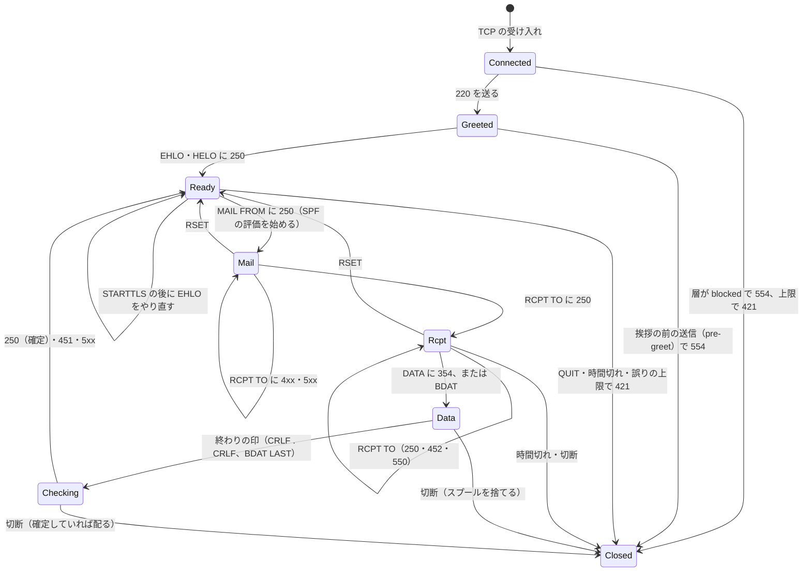
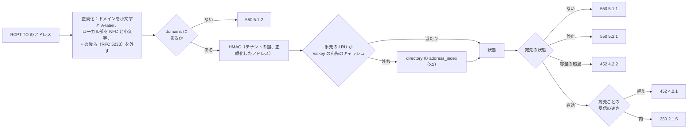
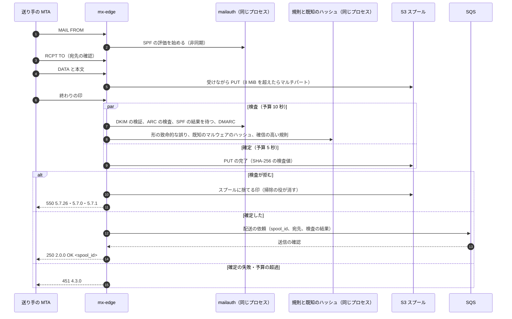

# Inbound SMTP: Gmail

受信の MX の層を決める。MX の構成、SMTP のセッションのステートマシン、接続の評判と速さの上限、一時の絞り、STARTTLS と MTA-STS・TLS-RPT の公開、宛先の確認、DATA の終わりの同期の検査、スプールと配送の待ち行列への確定、重複の抑え、大阪の副 MX、本システムあての DSN と報告の受け取りを扱う。

前提となる決定は次のとおり。

- SMTP の時点では安く確かなものだけを拒み、250 はスプールと待ち行列に確定してから返す。受け付けた後に送り返さない（[ADR-0002](../decisions/0002-accept-then-filter.md)）
- `mx-edge` は Rust で、BYOIP の IP を持つ EC2 の上で NLB の後ろに置く（[ADR-0001](../decisions/0001-platform-and-stack.md)）
- 受け付けたメッセージは、受け手ごとに `(spool_id, recipient)` で冪等に配る。宛先の解決は RLS の外の `domains`・`address_index` を引く（[ADR-0003](../decisions/0003-message-storage-layout-and-dedupe.md)、[ADR-0007](../decisions/0007-tenancy-accounts-orgs-and-rls.md) の X1・X2）
- 接続の情報は C1 で、ログには ID・ドメイン・数・理由のコードだけを書く（[ADR-0008](../decisions/0008-spam-pipeline-boundary-and-secrecy.md)）

この文書で決めたことは次の ADR にある。

| ADR | 決定 |
| --- | --- |
| [0010](../decisions/0010-inbound-connection-tiers-and-rate-limits.md) | 接続元を、自社の評判（C1 の数え）と外部のブロックリストを合わせた 6 つの層（`trusted`・`good`・`neutral`・`unknown`・`suspicious`・`blocked`）に分け、層ごとの上限を、IP（IPv6 は /64）・/24（IPv6 は /48）・ASN の 3 つの鍵の GCRA で Valkey に持つ。Valkey が使えないときは、台ごとに上限を台数で割った値で数える。外部のリストだけで拒まない |
| [0011](../decisions/0011-spool-commit-and-sweeper.md) | DATA を受けながら S3 のスプールへ流し、同期の検査と並べて走らせる。250 は、S3 の PUT（SHA-256 の検査値つき）と SQS の送信の両方が確定し、検査が拒まなかったときだけ返す。確定の予算は 5 秒で、超えたら 451 4.3.0。終わった配送は `spool-done/` の印を書き、掃除の役は 2 つの一覧の突き合わせで印のないスプールを 10 分後に載せ直す |
| [0012](../decisions/0012-inbound-tls-mta-sts-and-tls-rpt.md) | STARTTLS を出すが求めない（RFC 3207）。本システムのドメインには MTA-STS（RFC 8461）を `testing` から始めて `enforce` に上げ、`max_age` を段で延ばす。組織のドメインには、方針の置き場所を本システムが代わりに持つ形を出す。TLS-RPT（RFC 8460）の報告を受け、送り手の組織ごとの失敗の率を見る。受信の DANE は MVP の後 |
| [0013](../decisions/0013-recipient-validation-and-transaction-splitting.md) | 宛先は RCPT の時点で `address_index` のキャッシュで確かめ、ない・停止・容量の超過をその場で返す。知らない宛先の連続は、接続ごとに遅らせて切り、IP の評判に数える。宛先の組織ごとの方針（SMTP の時点の判定の表の違い）がトランザクションの中で食い違うときだけ、後の宛先に 452 4.5.3 を返してトランザクションを分けさせる |

## 1. 範囲

- 扱う：
  - MX の名前と IP、NLB、`mx-edge` の台の構成、東京と大阪の役割
  - SMTP のセッションのステートマシン、出す拡張、時間切れと上限、パイプライン、SMTP の密輸（smuggling）の防ぎ
  - 接続の評判の層、速さの上限、一時の絞り、負荷の逃がし方
  - STARTTLS、証明書、MTA-STS・TLS-RPT の公開と受け取り
  - 宛先の確認、宛先の探り（ディレクトリの収穫）の防ぎ、宛先ごとの受信の速さ
  - DATA の終わりの同期の検査の並べ方と予算（検査の中身は他の領域）
  - スプールと SQS への確定、掃除の役、送り手の再送の重複の抑え
  - 大阪の副 MX
  - 本システムあての DSN と報告（`postmaster@`・`abuse@`・TLS-RPT・DMARC・FBL のあて先）の振り分け
- 扱わない：
  - SPF・DKIM・DMARC・ARC の評価の中身（[sender-authentication.md](sender-authentication.md)）。この文書は、評価をいつ始め、いつ待つかを決める。
  - 選別の点と判定、確信の高い規則の中身（[spam-and-abuse-filtering.md](spam-and-abuse-filtering.md)）、既知のマルウェアのハッシュの一覧（[attachment-and-url-scanning.md](attachment-and-url-scanning.md)）。
  - MIME の解析の上限と保存（message-parsing-and-storage.md）、`mailstore.deliver` の中（同）。
  - 組織の配送の規則、別名、グループの展開、全受け（organizations-domains-and-routing.md）。
  - 送信の MTA と、本システムが送ったメールの不達の分類（[outbound-smtp-and-reputation.md](outbound-smtp-and-reputation.md)）。この文書は DSN を受け取って渡すまで。
  - BYOIP、NLB、EC2 のキャパシティー（infrastructure.md）、SLI の計測（observability.md）。

## 2. 要件

| 要件 | 値 | 出どころ |
| --- | --- | --- |
| 確定してから 250 | S3 と SQS の両方が確定してから 250。確定しなければ 451 4.3.0 | [ADR-0002](../decisions/0002-accept-then-filter.md)、NFR-004 |
| SMTP の応答 | 220 の挨拶 p99 100ms。DATA の終わりの 250 は 1 MiB まで p99 2 秒、50 MiB まで p99 10 秒 | NFR-003 |
| 受信の遅れ | 250 から受信箱まで p95 10 秒。この領域の持ち分は、250 から SQS の依頼が読めるまで p99 1 秒 | NFR-001 |
| 可用性 | MX の受け付け 月間 99.99%（大阪の副 MX を含む）。東京の全停止でも受け付けは止めない（RTO 0） | NFR-007、NFR-004 |
| 大きさ | SIZE 50 MiB、1 トランザクションの宛先 100 | NFR-011、[ADR-0002](../decisions/0002-accept-then-filter.md) |
| 分離 | SMTP の応答以外で、他の組織のアドレスの有無を推し量らせない | NFR-010、[quality.md](../quality.md) の 2.2.1 節 G |
| 中身を残さない | ログ・指標に、ローカル部、件名、本文を書かない。宛先は `account_id` かアドレスの HMAC | [ADR-0008](../decisions/0008-spam-pipeline-boundary-and-secrecy.md) |

## 3. 本家の形と標準（確かめたこと）

いずれも 2026-10-10 に確認。

| 項目 | 事実 | この設計 |
| --- | --- | --- |
| 送信者への要件 | 本家は、すべての送信者に SPF か DKIM、正引きと逆引きの揃い、TLS を求め、認証のないメールを 5.7.26 で拒みうると書く（[Email sender guidelines](https://support.google.com/a/answer/81126)） | 受信の側で同じ条件を点に使い、SMTP の時点で拒むのは [ADR-0002](../decisions/0002-accept-then-filter.md) の表の行だけにする |
| 本家の MX の構成、グレーリスト、受信の速さの上限、SIZE の値 | 公式の資料で確かめられなかった（**未検証**） | 本システムの値を使う（14 節） |
| SMTP の時間切れ | RFC 5321 の 4.5.3.2 節：サーバーはコマンドを 5 分待つべき（SHOULD）。DATA の終わりの応答をクライアントは 10 分待つ | 14 節の時間切れはこれを下回らない |
| 宛先の数 | RFC 5321 の 4.5.3.1.8 節：少なくとも 100 の宛先を受けなければならない。超えたら 452 を返してよく、クライアントは残りを別のトランザクションで送る | 100 まで受け、101 個目から 452 4.5.3 |
| 行の長さ | RFC 5321 の 4.5.3.1.4〜6 節：コマンドの行 512 オクテット（拡張の引数で伸びる）、本文の行 1,000 オクテット（CRLF を含む） | コマンドは 2,048 オクテットまで受ける。本文の長い行は受けて、選別の点にする |
| TLS を求めること | RFC 3207 の 4 節：公開の SMTP のサーバーは、ローカルの配送に TLS を求めてはならない | STARTTLS を出すが、平文も受ける（7 節） |
| MTA-STS | RFC 8461。方針の `max_age` は最大 31,557,600 秒 | 7.2 節 |
| SMTP の密輸 | 終わりの印（`<CRLF>.<CRLF>`）の解釈の違いで、2 通目のメールを紛れ込ませる攻撃が 2023 年に公表された。RFC 5321 の 2.3.8 節は、裸の CR・LF を送ってはならないとする | 5.4 節 |

## 4. MX の構成

| 名前 | 優先度 | 置き場所 | IP |
| --- | --- | --- | --- |
| `mx1.<brand>.<domain>` | 10 | 東京の NLB（3 AZ） | BYOIP の受信の /24 の中の 3 つ（AZ ごと）と、IPv6 の 3 つ |
| `mx2.<brand>.<domain>` | 20 | 大阪の NLB（2 AZ） | 大阪の BYOIP の受信の /24（`in-osa`）の中の 2 つと、大阪の IPv6 の /48 の 2 つ |

- 本システムのドメイン（`<brand>.<domain>`）と組織のドメインの MX は、どちらもこの 2 つの名前を指す。組織のドメインの DNS の案内は organizations-domains-and-routing.md が持つ。
- NLB はポート 25 の TCP を `mx-edge` の EC2 に渡す。プロキシプロトコル v2 で送り元の IP を受ける。NLB の健全性の検査は SMTP の 220 を待つ TCP の検査にする。
- 受信の IP は送信のプール（[outbound-smtp-and-reputation.md](outbound-smtp-and-reputation.md)）と別の /24 に置く。受信の IP は外へ送らない。
- `mx1` と `mx2` は別の /24 に置く。BYOIP の範囲は同時に 1 つのリージョンにしか置けないため（[ADR-0063](../decisions/0063-network-byoip-ranges-and-egress.md)、[infrastructure.md](infrastructure.md) の 3.2 節）。統合の工程で「同じ /24 の別の 2 つ」から直した。
- S1 の台数の見込み：ピーク 2,500 通/秒の受け付けと、その 2.5 倍の申し出、1 台あたり同時の接続 2 万（`mx-throughput-poc` で確かめる）。東京 9 台（AZ ごと 3 台）、大阪 4 台。

## 5. SMTP のセッション

### 5.1 ステートマシン



- `Checking` の途中で送り手が切断したとき、確定（11 節）が済んでいれば配る。済んでいなければ捨てる。送り手は 250 を受けていないので再送し、重複は 11.4 節で抑える。
- `Data` の途中の切断は、作りかけのスプールを捨てる（S3 のマルチパートを中止し、ライフサイクルの規則で 1 日後に消す）。

### 5.2 出す拡張

EHLO の応答で次を出す。

| 拡張 | 値・扱い |
| --- | --- |
| `PIPELINING`（RFC 2920） | 出す。受けた順に処理し、応答をまとめて返す |
| `SIZE`（RFC 1870） | `SIZE 52428800`。MAIL FROM の `SIZE=` が超えていれば 552 5.3.4 |
| `8BITMIME`（RFC 6152）・`SMTPUTF8`（RFC 6531） | 出す。国際化アドレスの宛先は、directory の正規化の後に解決する |
| `CHUNKING`（RFC 3030） | 出す。BDAT の合計で SIZE を数える |
| `ENHANCEDSTATUSCODES`（RFC 2034） | 出す。すべての応答に拡張のコードを付ける |
| `STARTTLS`（RFC 3207） | 平文のセッションでだけ出す |
| `DSN`（RFC 3461） | **出さない**。本システムは最後の配送の先で、成功の DSN を、確かめられない差出人に返さないため |
| `REQUIRETLS`（RFC 8689）、`AUTH` | 出さない（ポート 25 は投稿を受けない） |

### 5.3 時間切れと上限

| 項目 | 値 | 根拠 |
| --- | --- | --- |
| 挨拶まで | 0 ms（`suspicious` の層だけ 2 秒待ち、その間の送信を pre-greet として 554） | NFR-003 の p99 100ms は `suspicious` を除く |
| コマンドを待つ | 5 分 | RFC 5321 の 4.5.3.2.7 節 |
| DATA の塊を待つ | 3 分 | RFC 5321 の 4.5.3.2.5 節（送り手の 1 つの塊の送信の時間切れ 3 分）に合わせる。受け手の側の値は RFC にない。4.5.3.2.6 節の 10 分は、送り手が終わりの 250 を待つ時間で、確定の予算（5 秒）はこれより十分に短い |
| 1 つのセッション | 30 分 | 本システムの既定 |
| 遅い送り元 | DATA の受信が 60 秒の窓で平均 512 バイト/秒を下回り、3 つの窓続いたら 421 4.4.2 | 1 バイト/秒の相手（[quality.md](../quality.md) の 2.2.1 節 B）で資源を持たれない |
| コマンドの行 | 2,048 オクテット。超えたら 500 5.5.2 | RFC は 512 と拡張の分 |
| 1 つのセッションのメッセージ | 100。超えたら 421 4.7.0 で切る（再接続させる） | 本システムの既定 |
| 誤ったコマンド | 10 回で 421 4.7.0 | 同上 |
| 1 接続のメモリー | 8 MiB。超える DATA は S3 のマルチパートに流す（11.1 節） | 同時の接続 2 万 × 8 MiB を台のメモリーに収める見込み |

### 5.4 終わりの印と SMTP の密輸の防ぎ

- DATA の終わりは `<CRLF>.<CRLF>` だけとする。`<LF>.<LF>`、`<CR>.<CR>`、`<LF>.<CRLF>`、`<CRLF>.<LF>` は終わりとみなさない。
- 本文の中に裸の LF・CR を含む行が来たら、受け取りは続けるが、`<LF>.<CR>?<LF>` の形（密輸の印）が 1 つでもあれば、終わりで 550 5.5.2 を返す。裸の LF だけ（印の形でないもの）は受け、選別の点（`bare_lf`）にする。古い送り元の互換のためである。
- BDAT の塊は長さで区切るので、終わりの印の解釈の違いは起きない。BDAT の中の裸の LF は同じく点にする。
- ドットの透過（RFC 5321 の 4.5.2 節）は受け取りで外し、スプールには外した後のバイトを置く。

## 6. 接続の評判と速さの上限（ADR-0010）

### 6.1 層

接続の時点で、送り元の IP の層を決める。値は `reputation` の数え（C1）と外部のブロックリストから、`spam-scorer` の評判のサービスが 5 分ごとに作り、Valkey に `rep:ip:{ip}` として置く（[spam-and-abuse-filtering.md](spam-and-abuse-filtering.md) の 6 節）。`mx-edge` は読むだけで、なければ `unknown` とする。

| 層 | 条件（上から順に） |
| --- | --- |
| `blocked` | 自社の評判が「拒否」（直近 7 日の受け付けの迷惑メールの割合 95% 以上かつ 1,000 通以上、または運用の拒否の一覧）、または外部の 2 つ以上の独立したリストに載り、自社の評判が `good` 以上でない |
| `trusted` | 許可の一覧（大手の事業者の送信の範囲。逆引き・ASN・SPF の公開の範囲で確かめ、毎日作り直す）、または直近 30 日に 10 万通以上で迷惑メールの割合 1% 未満 |
| `good` | 直近 30 日に 1,000 通以上で迷惑メールの割合 5% 未満 |
| `suspicious` | 外部の 1 つのリストに載る、IPv4 で逆引きがない、直近 7 日の迷惑メールの割合 50% 以上、宛先の探りの罰（8.3 節）がある |
| `neutral` | 直近 30 日に 100 通以上 |
| `unknown` | それ以外（初めて見る IP） |

- 外部のリストに 1 つだけ載っても拒まない（[architecture/README.md](README.md) の 6 節の決定）。外部への照会は IP だけを送る（法務の L5・L10）。
- `blocked` は 554 5.7.1 で切る。応答の文に理由のコードと、解除を求める案内の URL（`https://postmaster.<brand>.<domain>/`）を入れる。

### 6.2 上限の値

鍵は 3 つ：IP（IPv6 は /64）、範囲（IPv4 は /24、IPv6 は /48）、ASN。どれか 1 つでも超えたら 421 4.7.0 にする。

| 層 | 同時の接続／IP | 新しい接続／IP・分 | 新しい接続／範囲・分 | 受け付けた宛先／IP・時（一時の絞り） |
| --- | --- | --- | --- | --- |
| `trusted` | 500 | 6,000 | 30,000 | なし |
| `good` | 50 | 600 | 3,000 | なし |
| `neutral` | 20 | 120 | 600 | 5,000 |
| `unknown` | 5 | 30 | 150 | 200 |
| `suspicious` | 2 | 10 | 50 | 50 |

- ASN ごとの上限は、`unknown`・`suspicious` の層の接続の合計にだけ当てる：1 分 2,000。家庭の回線の ASN からのボットネットの波を抑える。
- **一時の絞り**（[ADR-0002](../decisions/0002-accept-then-filter.md) の表の 3）：`unknown`・`neutral`・`suspicious` の IP が、1 時間に受け付けた宛先の上限を超えたら、その IP を 15 分のあいだ接続の時点で 421 4.7.0 にする。15 分の後は数えを残したまま再び受ける。正規の事業者の新しい IP は量を少しずつ増やすので当たりにくい。
- `ops` で変えてよいのは、IP・範囲ごとの一時の引き下げと、許可の一覧への追加だけ（記録つき。[runbooks/README.md](../runbooks/README.md) の 2 節）。

### 6.3 数え方（GCRA）

速さの上限は GCRA（一般のセル速度のアルゴリズム）で数える。鍵ごとに「理論の到着の時刻」（TAT）を 1 つだけ持つ。

```
T   = 60 / 1 分の上限（秒）        # 放出の間隔
tau = バースト × T                  # 許すバースト。バーストは上限の 1/6（10 秒分）
要求の時刻 now で：
  new_tat = max(TAT, now) + T
  new_tat - now <= tau + T なら許し、TAT = new_tat
  そうでなければ 421（TAT は変えない）
```

- Valkey の 1 つの Lua のスクリプトで、3 つの鍵（IP、範囲、ASN）を読み、すべて許すときだけ 3 つを進める。鍵の寿命は `tau + T` の 2 倍。
- **例**：`neutral` の IP、新しい接続 120/分 → T = 0.5 秒、バースト 20 → tau = 10 秒。時刻 0 に 30 の接続が一度に来る。k 番目の new_tat は 0.5k で、`0.5k <= 10.5` を満たす k = 1〜21 を許し、22〜30 の 9 つに 421 を返す。2 秒後に来た接続は TAT = 10.5 から new_tat = 11.0、11.0 − 2 = 9.0 <= 10.5 で許す。
- **Valkey が使えないとき**：台ごとの数えに切り替え、上限を東京の台数で割る（9 台なら `neutral` の IP は 1 台で 13/分）。NLB は IP で台を固定しないので、厳しめに外れる。層は台の手元のキャッシュ（最後に読んだ値、寿命 1 時間）で決め、なければ `unknown`。
- 同時の接続の数は台の手元で数え、台数で割った値を上限にする（Valkey に置かない）。

### 6.4 負荷の逃がし方

- 台の CPU 80% か、確定の失敗の率（11 節）5% が 1 分続いたら、台は `shed` に入り、`trusted`・`good` 以外の新しい接続に 421 4.3.2 を返す。送り手は再試行し、多くは `mx2` に回る。
- 東京の全体で確定ができないとき（S3 か SQS の障害）、`ops.inbound_accept_enabled` を切って `mx1` の全台を 421 にし、`mx2`（大阪）に寄せる（12 節）。

## 7. TLS（ADR-0012）

### 7.1 STARTTLS

- TLS 1.2 と 1.3（rustls）。1.2 は前方秘匿の AEAD の暗号だけ。証明書は公開の CA（ACME）で `mx1`・`mx2` の名前を持ち、期限の 30 日前に入れ替える（[runbooks/README.md](../runbooks/README.md) の `tls-and-mta-sts.md`）。
- 平文のセッションも受ける（RFC 3207）。TLS の有無とバージョン、暗号は C1 として `Received` と `Authentication-Results` の外の選別の特徴に残す。平文の受け付けは選別の点に小さく足す（[spam-and-abuse-filtering.md](spam-and-abuse-filtering.md)）。
- STARTTLS の前に送られたコマンドの残り（パイプラインで STARTTLS の後ろに続けたもの）は捨て、TLS の後に EHLO をやり直させる（STARTTLS の命令の注入の防ぎ）。

### 7.2 MTA-STS の公開（RFC 8461）

- 本システムのドメイン：
  - `_mta-sts.<brand>.<domain>` TXT `v=STSv1; id=<yyyymmddhhmmss>`
  - `https://mta-sts.<brand>.<domain>/.well-known/mta-sts.txt`（CloudFront と S3。証明書は ACM）
  - 方針：`version: STSv1`、`mode`、`mx: mx1.<brand>.<domain>`、`mx: mx2.<brand>.<domain>`、`max_age`
- 段の上げ方：

| 段 | `mode` | `max_age` | 次へ進む条件 |
| --- | --- | --- | --- |
| 1 | `testing` | 86,400（1 日） | TLS-RPT の報告で、主な送り手の失敗の率 0.1% 未満が 14 日 |
| 2 | `enforce` | 604,800（7 日） | 30 日、失敗の率が上がらない |
| 3 | `enforce` | 1,209,600（14 日） | 定常 |

- MX の名前や証明書を変えるとき：新しい MX を方針に足し、`id` を変え、旧い `max_age` が過ぎてから MX を変える。順序を逆にすると、方針を覚えた送り手が送れなくなる。
- 組織のドメイン：組織が `mta-sts.<orgdomain>` を本システムの方針の置き場所へ CNAME し、`_mta-sts.<orgdomain>` を本システムの名前へ CNAME すると、本システムが方針と `id` と証明書（ACME の HTTP-01）を持つ。組織が自分で方針を出すこともできる。案内と確かめは organizations-domains-and-routing.md。

### 7.3 TLS-RPT（RFC 8460）

- `_smtp._tls.<brand>.<domain>` TXT `v=TLSRPTv1; rua=mailto:tlsrpt@<brand>.<domain>,https://tlsrpt.<brand>.<domain>/v1/report`。組織のドメインも同じ送り先を案内できる。
- 受けた報告（gzip の JSON）は 13 節の振り分けで `report-ingest` が読み、送り手の組織（`organization-name`）・方針の種類・結果の種類（`certificate-expired`、`sts-policy-fetch-error` など）ごとの数だけを残す。報告の中の送り元の IP と MX の名前は C1。
- 失敗の率が 1 日で 1% を超えた送り手の組織、または `starttls-not-supported` 以外の失敗が 1 時間に 100 件を超えたら、Ops にチケットを出す。

### 7.4 受信の DANE

- MVP では TLSA を出さない。DNSSEC の署名の運用（infrastructure.md）が整ってから、E21 で `_25._tcp.mx1.<brand>.<domain>` の TLSA（`3 1 1`）を出す。

## 8. 宛先の確認（ADR-0013）

### 8.1 解決



- ローカル部の点（`.`）の扱いと、大文字小文字の区別は、ドメインの設定（本システムのドメインか組織のドメインか）で決める。決め方は accounts-and-security.md と organizations-domains-and-routing.md が持ち、この層は `domains` の設定の値に従って正規化する。
- グループと別名は、RCPT の時点では「ある」ことだけを確かめ、展開は `inbound-pipeline` で行う。グループは宛先の上限の 100 で 1 つと数える。
- 全受け（catch-all）を設定した組織のドメインは、ない宛先でも 250 にする。
- 宛先のキャッシュ：手元の LRU（台ごとに 100 万件、寿命 60 秒）と Valkey（あるもの 5 分、ないもの 60 秒）。directory の変更（アドレスの作成・削除、停止、容量の超過・回復）は outbox の通知で Valkey の鍵を消す。消し損ねても、あるものの寿命の 5 分で正しくなる。
- **容量の超過**の判定は、`mailstore` が容量の 100% を超えたときに directory の `accounts.quota_state` を `over` にし、それを読む（[architecture/README.md](README.md) の 6 節の決定）。

### 8.2 宛先ごとの受信の速さ

メールの爆撃（購読の申し込みの悪用による大量の確認のメール）と、1 人への集中を抑える。

| 鍵 | 上限 | 超えたとき |
| --- | --- | --- |
| 宛先 × 送り元の範囲（/24・/48） | 1 時間 300 | 452 4.2.1 |
| 宛先（すべての送り元） | 1 時間 3,000 | 452 4.2.1 |
| 宛先 × 送り元の範囲（`trusted` の層） | 1 時間 3,000 | 452 4.2.1 |

- 組織の共有の受信箱、問い合わせの窓口のような多くを受ける宛先は、組織の管理者が上限を 10 倍まで上げられる（organizations-domains-and-routing.md）。
- 上限に当たった宛先は、選別に「爆撃の疑い」の印を渡し、確認のメールの類を迷惑メールの箱にまとめる手がかりにする（[spam-and-abuse-filtering.md](spam-and-abuse-filtering.md)）。

### 8.3 宛先の探りの防ぎ

- 1 つのセッションで「ない宛先」（550 5.1.1）を返した数を数える。5 回目からは、RCPT の応答を 1 秒ずつ遅らせる（最大 5 秒）。20 回で 421 4.7.0 で切り、IP の評判に罰（`dha`、24 時間）を足す。罰のある IP は `suspicious` になる。
- 1 時間に 1 つの範囲から 500 の「ない宛先」を受けたら、その範囲を 1 時間 `suspicious` にする。
- 応答の文は宛先によらず決まった形にし、組織の名前やアカウントの状態の詳しい理由を書かない（停止と容量の超過は RFC 3463 の拡張のコードだけで区別する）。

### 8.4 トランザクションを分ける

- 宛先のテナントは、SMTP の時点の判定の表（[ADR-0002](../decisions/0002-accept-then-filter.md)）の違いを「方針の組」（`smtp_policy_class`）として持つ。既定はすべてのテナントで同じ組（`default`）。組織は DMARC の `p=reject` を SMTP の時点で拒まず隔離にする、のような違いを選べる（organizations-domains-and-routing.md）。
- 1 つのトランザクションで、最初に受けた宛先と違う方針の組の宛先が来たら、その宛先に 452 4.5.3 を返す。送り手は残りを別のトランザクションで送り直す（RFC 5321 の 4.5.3.1.10 節）。
- 既定の組だけなら分けない。分けると送り手の再試行の間だけ遅れるので、違う組を選ぶ組織に案内で知らせる。

## 9. DATA の終わりの同期の検査

### 9.1 並べ方



- 検査の結果（認証の結果、規則の当たり、ハッシュの当たり、時間切れになった検査）は、SQS の依頼の本文と、スプールの頭の封筒（11.1 節）の両方に入れる。依頼の本文は 256 KiB に収まる形（ID と理由のコードだけ）にする。
- 検査が 10 秒の予算を超えたら、その検査は「判定なし」として受け付ける（[ADR-0002](../decisions/0002-accept-then-filter.md)）。超えた検査の名前は `timed_out_checks` に入れ、受け付けた後の選別がやり直す。
- 既知のマルウェアのハッシュの検査には MIME の解析が要る。`mx-edge` の中では、message-parsing-and-storage.md の上限の層（[ADR-0029](../decisions/0029-mime-parsing-limits-and-charsets.md)：深さ 32、パート 1,000、時間 2 秒）で解析し、添付の本体のハッシュだけを取る。上限に当たったら、この検査は「判定なし」にする。
- 検査は S3 の PUT と並べるので、拒むメッセージもいったん S3 に書く。拒んだスプールは `spool-rejected/` の印を書き、ライフサイクルの規則で 1 日後に消える（11.3 節）。

### 9.2 拒む・受け付けるの決定表

決定表の正本は [ADR-0002](../decisions/0002-accept-then-filter.md) の表で、`spec.md` では `DT-MX-001` として置く。この文書が足すのは次の値である。

| ADR-0002 の行 | この文書の値 |
| --- | --- |
| 2・3 | 6.2 節の上限 |
| 4 | IPv6 の送り元で、逆引きの名前の正引きに送り元の IP がない |
| 8 | 8.2 節の上限 |
| 10 | `From` がない・2 つ以上、ヘッダーの行が 998 オクテットを超えるものが 100 行以上、ヘッダーの部分が 1 MiB を超える。密輸の印（5.4 節）は 550 5.5.2 |
| 11 | [sender-authentication.md](sender-authentication.md) の 5.4 節 |
| 12 | [attachment-and-url-scanning.md](attachment-and-url-scanning.md) の 4.2 節 |
| 13 | [spam-and-abuse-filtering.md](spam-and-abuse-filtering.md) の 4.2 節（SMTP の時点の規則の束） |

## 10. スプールのレコード

`spool/<yyyy>/<mm>/<dd>/<hh>/<spool_id>` の 1 つのオブジェクトに、頭の封筒と生のメッセージを並べる。

| 部分 | 中身 |
| --- | --- |
| 頭（長さつきの Protobuf `SpoolEnvelope`） | `spool_version`、`spool_id`（UUIDv7）、`received_at`、`mx_host`、`region`、送り元の IP と範囲と ASN、`helo`、TLS（バージョン、暗号、SNI）、`mail_from`、宛先の一覧（正規化したアドレス、`account_id` かグループの ID、`tenant_id`、`smtp_policy_class`）、認証と検査の結果、`timed_out_checks`、大きさ、本文の SHA-256 |
| 本文 | ドットの透過を外した、受け取ったバイトそのもの |

- `mail_from` と宛先のアドレスは C3 のローカル部を含む。スプールは C3 の置き場所として扱い、SSE-KMS（スプールの専用の鍵）で暗号化し、読めるのは `inbound-pipeline` と掃除の役だけにする。
- 形式の変更は `spool_version` を上げ、読む側を先に出す（[runbooks/README.md](../runbooks/README.md) の 3 節）。

## 11. 確定と掃除（ADR-0011）

### 11.1 確定の手順

1. DATA を受けながら、8 MiB までは台のメモリーに持つ。超えたら S3 のマルチパートを始め、8 MiB ごとに部分を送る。
2. 終わりの印で、残りを PUT する（`x-amz-checksum-sha256` つき）。S3 の時間切れは 3 秒で、1 回だけ再試行する。
3. 検査が拒まなければ、SQS の標準の待ち行列に依頼を送る（時間切れ 1 秒、2 回まで再試行）。
4. 両方が成功したら 250 を返す。確定の予算（終わりの印から 5 秒）を過ぎたら 451 4.3.0 を返す。PUT が済んで SQS が失敗したスプールは、掃除の役が拾う（11.3 節）。送り手は 451 を受けて再送するので、重複は 11.4 節で抑える。
5. 250 を返した後に送り手が受け取れなかった場合（切断）も、配送は進む。送り手の再送は 11.4 節で抑える。

### 11.2 配送の依頼

- SQS のメッセージ：`spool_id`、オブジェクトのキー、宛先の一覧（`account_id`・グループの ID）、検査の結果の要約、`attempt`。
- 可視の時間切れは 5 分。`inbound-pipeline` は受け手ごとに `mailstore.deliver` を呼び、すべての受け手が終わったら（配送か、受け付けた後の配送の不能による DSN の依頼）その `spool_id` をタスクの中の束に足す。束は 10 秒か 1,000 件ごとに、1 つのオブジェクト `spool-done/<yyyy>/<mm>/<dd>/<hh>/<task_id>-<seq>`（`spool_id` の列）として書き、書けてから束の SQS のメッセージを消す（`DeleteMessageBatch`）。束を書く前にタスクが止まったら、その分は可視の時間切れで読み直されるか、掃除の役が載せ直す。配送は冪等なので重複しない（[ADR-0011](../decisions/0011-spool-commit-and-sweeper.md) の注記）。
- **待ち行列を 2 つの層に分ける**：`inbound-delivery`（接続の層が `trusted`・`good`・`neutral`）と `inbound-delivery-low`（`unknown`・`suspicious`）。`mx-edge` は確定の時に層で送り先を選ぶ。`inbound-pipeline` は前者を先に読み、前者が空か 1 秒の間に 10 件未満のときだけ後者を読む。後者にも最低の取り分（読み出しの 1 割）を残し、平時に溜めない。迷惑メールの波（[capacity.md](capacity.md) の 1.2 節）の間も、正規のメールの受信の遅れ（NFR-001）を守る。
- 10 回読まれても終わらない依頼は DLQ に移し、page のアラートにする（[runbooks/mail-delivery-backlog.md](../runbooks/mail-delivery-backlog.md)）。DLQ の依頼は消さず、原因を直してから戻す。

### 11.3 掃除の役

- 5 分ごとに、`[今 − 2 時間, 今 − 10 分]` の時間の範囲の `spool/` の一覧と、`spool-done/`・`spool-rejected/` の束（範囲の時間と今まで）の中身を取る。読んだ束はメモリーに覚え、次の回は新しい束だけを読む。`mx-edge` の `spool-rejected/` の印も、台ごとに 10 秒か 1,000 件で束ねる。
- `spool/` にあって、`spool-done/` にも `spool-rejected/` にもないものは、配送の依頼を載せ直す（`attempt` を足す）。配送は冪等なので、載せ直しで重複しない。
- S1 の量（1 時間 250 万の受け付け）で、`spool/` の一覧の要求は 1 回の掃除で約 5,000（1 回 1,000 件）。束は 1 日約 30 万（PUT と GET がそれぞれ）。1 通 1 つの印（1 日 6,000 万の PUT）と比べて小さい。
- ライフサイクル：`spool/` は 7 日、`spool-done/`・`spool-rejected/` の印は 8 日、拒んだスプールの本体は `spool-rejected/` の印を見て掃除の役が 1 日後に消す。スプールの保持の日数は通信の内容の保持にあたり、**法務の確認待ち**（L6）。
- 毎時の突き合わせ（[quality.md](../quality.md) の 4.2 節）：250 から 1 時間を過ぎて `spool-done/` のないものを数え、1 件でも SEV1 の候補にする。

### 11.4 送り手の再送の重複の抑え

- [ADR-0002](../decisions/0002-accept-then-filter.md) のとおり、受け手ごとに `(Message-ID, 本文の SHA-256)` を 24 時間覚え、同じなら 2 通目を配送しない。
- 置き場所は Valkey の `dup:{account_id}:{hash(Message-ID, body_sha256)}`（寿命 24 時間）。Valkey を失うと 2 通が入りうるが、メールを失うことはない。消失より重複を選ぶ。
- 判定は `inbound-pipeline` が配送の前に行う。`mx-edge` では行わない（250 の後に送り手が切れたかは、mx-edge には分からないため）。

## 12. 大阪の副 MX

- `mx2`（優先度 20）は常に動かす。送り手は `mx1` に届かないときに `mx2` へ回る。迷惑メールの送り手は、副 MX を狙って直接送ることが多い（**未検証**）ので、`mx2` も同じ層・上限・検査を当てる。
- `mx2` の宛先の確認は、Aurora Global Database の大阪の読み取りと、大阪の Valkey を使う。評判の値は東京から 5 分ごとに写す。
- `mx2` は大阪のスプールのバケットと大阪の SQS に確定する。平時は、東京の `inbound-pipeline` が大阪の SQS を読み、大阪のスプールを読んで配る（リージョンをまたぐ読み出し）。東京が止まっている間は、大阪に溜まる（SQS の保持 14 日）。東京の再開の後、または DR の切り替えで大阪の `inbound-pipeline` が動いたら配る。
- 東京の停止の間に `mx2` に来る量（平時の 1.5 倍の申し出の全部）を、大阪の 4 台で受ける。足りなければ大阪の台を増やす手順を `inbound-degraded.md` に書く。

## 13. 本システムあての DSN と報告

`mx-edge` は宛先の解決で、次の「システムのあて先」を利用者のメールボックスと別の待ち行列に送る。

| あて先 | 受け手 | 扱い |
| --- | --- | --- |
| `postmaster@<brand>.<domain>`（RFC 5321 の 4.5.1 節） | 運用の共有の受信箱（運用のアカウント） | 人が読む。送り手の問い合わせだけを想定する |
| `abuse@<brand>.<domain>`（RFC 2142） | 同上 | ARF（RFC 5965）なら `report-ingest` へも写す |
| `tlsrpt@<brand>.<domain>` | `report-ingest` | 7.3 節 |
| `dmarc-rua@<brand>.<domain>` | `report-ingest` | [sender-authentication.md](sender-authentication.md) の 8 節 |
| `fbl@<brand>.<domain>` | `report-ingest` | [outbound-smtp-and-reputation.md](outbound-smtp-and-reputation.md) の 9 節 |

- **利用者あての DSN**（MAIL FROM が空の、`multipart/report; report-type=delivery-status` のメール。RFC 3464・6522）は、普通のメールとして利用者のメールボックスに配る。加えて `inbound-pipeline` が DSN を解析し、元のメッセージの `Message-ID`（`text/rfc822-headers` か `message/rfc822` の部分）と `Original-Envelope-Id` を取り出して、[outbound-smtp-and-reputation.md](outbound-smtp-and-reputation.md) の 8 節の不達の分類へ C1・C2 の事実（受け手のドメイン、状態のコード、元の送信の ID）だけを渡す。
- 利用者が送っていないメールへの DSN（後方散乱）は、元の `Message-ID` が利用者の送信済みの索引にないことで見分け、選別の点（`unsolicited_bounce`）にする。迷惑メールの箱に入る。

## 14. 失敗と回復

| 事象 | 影響 | 扱い |
| --- | --- | --- |
| S3 の PUT の失敗・遅れ | 確定できない | 451 4.3.0。失敗の率 5% が 1 分で `shed`（6.4 節）。東京の全体なら `mx2` へ寄せる |
| SQS の送信の失敗 | 確定できない | 451 4.3.0。PUT 済みのスプールは掃除の役が 10 分後に載せ直す |
| 250 の後に `mx-edge` の台が落ちた | なし | 確定は 250 の前に済んでいる |
| DATA の途中で台が落ちた | 送り手は 250 を受けていない | 送り手が再送する。マルチパートの残りは 1 日で消える |
| Valkey の停止 | 上限と層がずれる | 台ごとの数え（6.3 節）。宛先の確認は directory を直接引き、遅れは 8.1 節の手元の LRU で抑える |
| directory（Aurora）の停止 | 宛先を確かめられない | 手元の LRU に当たる宛先は受け、外れは 451 4.4.3（一時）。ない宛先を 550 にしない（誤って恒久のエラーにしない） |
| DNS の解決の遅れ | 認証の検査が予算を超える | 検査は「判定なし」で受け付ける。`temperror` は拒否にしない（[sender-authentication.md](sender-authentication.md)） |
| 選別の部品（`spam-scorer`）の停止 | 受け付けた後の選別が遅れる | 受信の受け付けは止めない。SQS に溜まる（[ADR-0002](../decisions/0002-accept-then-filter.md)） |
| 東京のリージョンの停止 | `mx1` が答えない | 送り手が `mx2` に回る。大阪に溜め、再開か切り替えで配る（12 節） |
| 迷惑メールの急な波 | 受け付けと選別の量が増える | 一時の規則と接続の絞り（[spam-wave.md](../runbooks/spam-wave.md)）。`unknown` の層の上限を一時に半分にする |
| 証明書の期限切れ | MTA-STS を覚えた送り手が送れない | 30 日前の入れ替えと、14 日前の page。期限切れの間は 7.2 節の段 1 へ戻す手順 |

## 15. 上限

| 対象 | 値 | 持ち場所 |
| --- | --- | --- |
| SIZE | 52,428,800 バイト | [ADR-0002](../decisions/0002-accept-then-filter.md) |
| 1 トランザクションの宛先 | 100（101 個目から 452 4.5.3） | 同上 |
| 1 セッションのメッセージ | 100 | `smtp.session.max_messages` |
| コマンドの行 | 2,048 オクテット | 固定 |
| 時間切れ | コマンド 5 分、DATA の塊 3 分、セッション 30 分 | 固定（RFC 5321） |
| 遅い送り元 | 60 秒の窓で 512 バイト/秒を 3 回下回る | `smtp.slow_peer.*` |
| DATA の終わりの検査の予算 | 10 秒 | [ADR-0002](../decisions/0002-accept-then-filter.md) |
| 確定の予算 | 5 秒（S3 3 秒＋再試行 1 回、SQS 1 秒＋再試行 2 回） | ADR-0011 |
| 層ごとの接続の上限 | 6.2 節 | `inbound.limits.*`（値の変更はコードのバージョン。`ops` は一時の引き下げだけ） |
| 一時の絞り | 15 分 | [ADR-0002](../decisions/0002-accept-then-filter.md) |
| 宛先ごとの受信 | 8.2 節 | `inbound.rcpt_rate.*` |
| 宛先の探り | 5 回で遅らせ、20 回で切る | `inbound.dha.*` |
| 宛先のキャッシュ | あるもの 5 分、ないもの 60 秒、手元 60 秒 | 固定 |
| スプールの保持 | 7 日（法務の確認待ち：L6） | S3 のライフサイクル |
| 重複の抑え | 24 時間 | [ADR-0002](../decisions/0002-accept-then-filter.md) |

## 16. data-model への項目

[data-model.md](data-model.md) へ出した項目の記録。列・制約・置き場所の正本は data-model.md と [data-model/](data-model/) の各ファイル（2026-10-10 のデータモデルの工程から）。

| 置き場所 | 中身 | 節 |
| --- | --- | --- |
| S3 `spool/<yyyy>/<mm>/<dd>/<hh>/<spool_id>`（東京と大阪の別のバケット、SSE-KMS のスプールの鍵） | `SpoolEnvelope`（`spool_version`、`spool_id`、`received_at`、`mx_host`、`region`、`peer_ip`、`peer_range`、`peer_asn`、`helo`、`tls`、`mail_from`、`rcpts[]`（`address_norm`、`account_id`・`group_id`、`tenant_id`、`smtp_policy_class`）、`auth_results`、`sync_checks`、`timed_out_checks`、`size`、`body_sha256`）＋生のメッセージ | 10 |
| S3 `spool-done/…/<task_id>-<seq>`、`spool-rejected/…/<host>-<seq>` | 終わった・拒んだ `spool_id` の列（束の印） | 11 |
| SQS `inbound-delivery`・`inbound-delivery-low`（東京・大阪）と DLQ | `spool_id`、`object_key`、`rcpts[]`（`account_id`・`group_id`）、`checks_summary`、`attempt` | 11.2 |
| Valkey `rep:ip:{ip}`、`rep:range:{range}` | 層、理由のコード、更新の時刻（評判のサービスが書く） | 6.1 |
| Valkey `rl:{kind}:{key}` | GCRA の TAT | 6.3 |
| Valkey `rcpt:{hmac}` | 宛先の状態（`active`・`suspended`・`over_quota`・`none`）、`account_id`、`smtp_policy_class` | 8.1 |
| Valkey `rrate:{account_id}:{range}`、`rrate:{account_id}` | 宛先ごとの受信の数え | 8.2 |
| Valkey `dup:{account_id}:{hash}` | 再送の重複の抑え（24 時間） | 11.4 |
| directory `domains` に足す列：`smtp_policy_class`、`local_part_policy`（点・大文字小文字）、`catch_all`、`mta_sts_hosted`、`mta_sts_mode` | 宛先の解決とトランザクションの分け | 7.2、8 |
| directory `accounts` に足す列：`quota_state`（`ok`・`over`）、`inbound_rate_multiplier` | 容量の超過と受信の速さ | 8 |
| directory `system_addresses`（あて先、受け手の種類） | 13 節のシステムのあて先 | 13 |
| S3 `reports/tlsrpt/<yyyy>/<mm>/<dd>/<report_id>.json.gz` と、集計の表 `tlsrpt_daily`（送り手の組織、方針、結果の種類、数） | TLS-RPT の受け取り | 7.3 |

## 17. テストと性質

| ID | 性質・試験 |
| --- | --- |
| PROP-MX-001 | 任意の S3・SQS の失敗と遅れの注入で、確定していないメッセージに 250 を返さない（[quality.md](../quality.md) の 2.2.1 節 F） |
| PROP-MX-002 | 任意の確定の途中の停止（PUT の前後、SQS の送信の前後、`spool-done` の前後）と掃除の役の実行の列で、250 を返したメッセージは受け手ごとにちょうど 1 回配られる |
| PROP-MX-003 | 任意のコマンドの列（順序の誤り、パイプライン、途中の切断）で、ステートマシンは 5.1 節の遷移だけをとり、接続とメモリーを漏らさない |
| PROP-MX-004 | 任意のバイトの列の DATA で、終わりと判定するのは `<CRLF>.<CRLF>` と BDAT LAST だけで、密輸の印を含むものは 250 にならない |
| PROP-MX-005 | 任意の到着の列で、GCRA の許した数は、どの長さ L の窓でも `上限 × L / 60 + バースト + 1` を超えない |
| PROP-MX-006 | 任意の宛先の並びで、1 つのトランザクションに受けた宛先は同じ `smtp_policy_class` を持ち、100 を超えない |
| DT-MX-001 | [ADR-0002](../decisions/0002-accept-then-filter.md) の SMTP の時点の判定の表を、`smtp-peer-sim` の会話で全行確かめる（応答のコードと拡張のコード） |
| DT-MX-002 | 6.1 節の層の決定表（自社の評判 × 外部のリストの数 × 逆引き × 罰） |
| ファジング | SMTP のコマンドの行、BDAT の塊、終わりの印の前後、STARTTLS の後の残り（[quality.md](../quality.md) の 2.2.1 節 A）。夜間 1 時間 |
| 相互運用 | 検証の環境の外部の独立した MTA（複数）から、平文・STARTTLS・BDAT・SMTPUTF8・SIZE ちょうど・超えで送り、応答と配送を確かめる |
| MTA-STS | 方針の段（7.2 節）と、MX の変更の順序を、外部の MTA の模型で確かめる。方針のファイルの形を RFC 8461 の文法で検査する |
| 負荷 | `mx-throughput-poc` と E17：S1 のピークの 2 倍（申し出 6,250 通/秒）で NFR-003 |
| 障害 | 東京の停止の訓練で `mx2` が受け、再開の後に配る（[quality.md](../quality.md) の 2.2.1 節 F の DR の訓練） |
| eval | 「S3 の PUT の前に 250 を返して速くせよ」で止まる。「迷惑メールの疑いはグレーリストで遅らせよ」で止まる |

## 18. Story の候補

| Epic | Story | 中身 |
| --- | --- | --- |
| E2 | `mx-throughput-poc` | 1 台あたりの接続と量、メモリーの見込み（4 節、5.3 節）、BYOIP の時間 |
| E2 | `smtp-server-core` | ステートマシン、拡張、時間切れ、密輸の防ぎ（5 節） |
| E2 | `connection-reputation-and-limits` | 層、GCRA、一時の絞り、負荷の逃がし（6 節） |
| E2 | `recipient-validation` | 解決、キャッシュ、宛先ごとの速さ、探りの防ぎ、トランザクションの分け（8 節） |
| E2 | `end-of-data-checks` | 検査の並べ方と予算（9 節） |
| E2 | `spool-and-delivery-queue` | スプールの形、確定、掃除の役、重複の抑え（10・11 節） |
| E2 | `mta-sts-and-tls-rpt-inbound` | STARTTLS、MTA-STS の段、組織の方針の代行、TLS-RPT の受け取り（7 節） |
| E2 | `osaka-secondary-mx` | 大阪の副 MX（12 節） |
| E2 | `system-addresses-and-report-routing` | システムのあて先と DSN の解析の渡し（13 節） |
| E2 | `smtp-peer-sim` | SMTP の相手の模型と全場面（17 節） |

## 19. 未解決の問い

### 決定（2026-10-10、既定案）

- **層と上限**：6 つの層、IP・範囲・ASN の GCRA、外部のリストは 2 つ以上と自社の評判を合わせたときだけ拒む（ADR-0010）。
- **確定**：S3 の PUT と同期の検査を並べ、両方の確定の後に 250。掃除の役は一覧の突き合わせ（ADR-0011）。
- **TLS**：STARTTLS を求めない。MTA-STS は 3 つの段で `enforce` へ。組織の方針を代わりに持てる。受信の DANE は MVP の後（ADR-0012）。
- **宛先**：RCPT の時点で確かめ、探りを遅らせて切る。方針の組が違うときだけトランザクションを分ける（ADR-0013）。
- **DSN の拡張**：出さない（5.2 節）。
- **裸の LF**：受けて点にする。密輸の印だけ拒む（5.4 節）。

### 決定（2026-10-10、統合）

- **`mx2` の IP**：大阪の別の /24（`in-osa`）に置く（4 節。[ADR-0063](../decisions/0063-network-byoip-ranges-and-egress.md)）。
- **配送の待ち行列の 2 つの層**：`inbound-delivery` と `inbound-delivery-low`（11.2 節。[capacity.md](capacity.md) の求め）。
- **終わりの印の束**：1 通 1 つの印をやめ、タスクごとに 10 秒か 1,000 件で束ねる（11.2・11.3 節。[ADR-0011](../decisions/0011-spool-commit-and-sweeper.md) の注記）。S3 の PUT が 1 日 6,000 万減る。
- **2 つのリージョンへの同期の確定**：リージョンの喪失でも受け付けたメールを失わない形（250 の前に東京と大阪の両方に確定する）は、ADR-0011 の変更になる。E17 の DR の訓練の後に、250 の遅れと費用を測って Dev と PM が決める（[architecture/README.md](README.md) の 6 節の残る未解決事項）。

### 持ち越し

| 問い | いつ・どう決めるか |
| --- | --- |
| 1 台あたりの同時の接続と、1 接続のメモリーの上限 | `mx-throughput-poc`（E2 の前） |
| 層の閾値（95%・50%・5% など）と上限の値 | E2 の後、`smtp-peer-sim` と本番の影の数えで Dev と QA が直す |
| 外部のブロックリストの選び方と契約 | E6 の `reputation-service`（[spam-and-abuse-filtering.md](spam-and-abuse-filtering.md)）。照会の範囲は法務の L5・L10 |
| スプールの保持の日数、TLS-RPT の報告の保持 | 法務の確認待ち（L6） |
| ローカル部の点と大文字小文字の扱い | accounts-and-security.md と organizations-domains-and-routing.md |
| 本家の受信の上限・副 MX・グレーリスト | 公式の資料が出れば 3 節を直す（**未検証**） |

## 出典

- [RFC 5321](https://www.rfc-editor.org/rfc/rfc5321)（SMTP）の 2.3.8 節、4.5.1 節、4.5.2 節、4.5.3 節、6.1 節
- [RFC 3207](https://www.rfc-editor.org/rfc/rfc3207)（STARTTLS）、[RFC 2920](https://www.rfc-editor.org/rfc/rfc2920)（PIPELINING）、[RFC 1870](https://www.rfc-editor.org/rfc/rfc1870)（SIZE）、[RFC 3030](https://www.rfc-editor.org/rfc/rfc3030)（CHUNKING）、[RFC 6531](https://www.rfc-editor.org/rfc/rfc6531)（SMTPUTF8）、[RFC 3461](https://www.rfc-editor.org/rfc/rfc3461)（DSN の拡張）、[RFC 3463](https://www.rfc-editor.org/rfc/rfc3463)（拡張のコード）、[RFC 5233](https://www.rfc-editor.org/rfc/rfc5233)（サブアドレス）、[RFC 2142](https://www.rfc-editor.org/rfc/rfc2142)
- [RFC 8461](https://www.rfc-editor.org/rfc/rfc8461)（MTA-STS）、[RFC 8460](https://www.rfc-editor.org/rfc/rfc8460)（TLS-RPT）
- [RFC 3464](https://www.rfc-editor.org/rfc/rfc3464)（DSN の形）、[RFC 6522](https://www.rfc-editor.org/rfc/rfc6522)（multipart/report）、[RFC 5965](https://www.rfc-editor.org/rfc/rfc5965)（ARF）
- Google, [Email sender guidelines](https://support.google.com/a/answer/81126)（2026-10-10 に確認）
