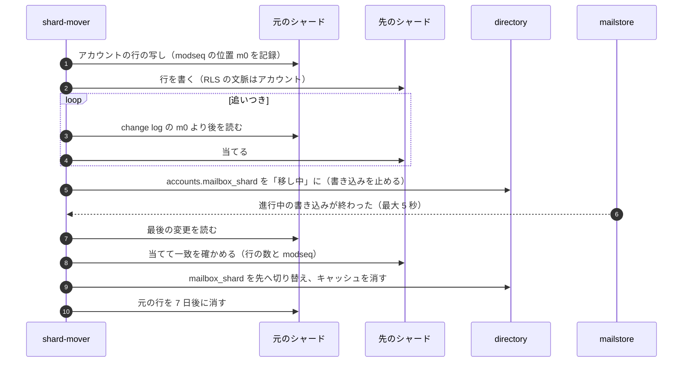

# Infrastructure: Gmail

基盤を決める。AWS のアカウントとネットワーク、BYOIP の範囲と IP の割り当て（受信の MX、送信のプール）、逆引きとポート 25 の送信、入口と外への通信、計算資源（EC2 と Fargate）、S3 のスプールと blob のバケット、Aurora（directory、メールボックスのシャード、blob の目録）、検索の台、シャードの配置と移し替え、東京と大阪の DR（常に動く副 MX、受け付けたメールを失わない切り替え）、段階を上げる基準、単位あたりの原価を扱う。

前提となる決定は次のとおり。

- MTA は自前で、固定の IP の要る `mx-edge`・`mta-out` と NVMe の要る `search-node` は ECS の EC2、他は Fargate。IP は BYOIP で持ち込む（[ADR-0001](../decisions/0001-platform-and-stack.md)）
- 250 はスプール（S3）と配送の依頼（SQS）の確定の後。掃除の役が欠けを拾う（[ADR-0002](../decisions/0002-accept-then-filter.md)、[ADR-0011](../decisions/0011-spool-commit-and-sweeper.md)）
- `mx1`（東京、優先度 10）と `mx2`（大阪、優先度 20）。大阪の副 MX は常に動き、大阪のスプールと SQS に確定する（[inbound-smtp.md](inbound-smtp.md) の 4・12 節）
- 送信のプールは 6 つ（[ADR-0018](../decisions/0018-outbound-ip-pools-and-warmup.md)）
- 大阪への切り替えでは `epoch` を進め、`modseq` と UID の数えを跳ばす（[ADR-0039](../decisions/0039-change-log-states-and-jmap-changes.md)）
- NFR-004：AZ の障害で RPO 0。リージョンの障害で、メタデータ RPO 1 分、blob とスプール RPO 15 分、受信の受け付け RTO 0、配送と閲覧の再開 RTO 1 時間
- 大きさと費用は [capacity.md](capacity.md)

この文書で決めたことは次の ADR にある。

| ADR | 決定 |
| --- | --- |
| [0063](../decisions/0063-network-byoip-ranges-and-egress.md) | BYOIP の IPv4 は /24 の単位でリージョンに 1 つずつしか持ち込めないので、東京に受信 1・送信 3（`personal`・`system` の /24、`org-a`・`org-b`・`forward` の /24、`suspect`・`warmup` の /24）、大阪に受信 1 の /24 と、各リージョンに IPv6 の /48 を置く。評判の悪い送信（`suspect`）を良いプールと同じ /24 に置かない。`mta-out` は ENI の副の IP で送り、NAT を通さない。他の外への通信は、メールの IP と別の egress の代理を通し、私的な範囲を拒む。逆引きの区域は Route 53 に置き、RIR から委任を受ける |
| [0064](../decisions/0064-storage-classes-and-region-replication.md) | スプールと blob は東京と大阪の別のバケットに置き、CRR と RTC で互いに写す。blob は 30 日まで Standard、パックは 90 日で Glacier Instant Retrieval に移す。Aurora は Global Database で大阪に写す。大阪への切り替えでは、写った東京のスプールのうち `spool-done` のないものを大阪で配り直し、blob が写っていないメッセージは写ったスプールから blob を作り直す。写る前に東京が失われた分だけが失われうる（RPO 15 分）ことを明記し、東京が戻れば残りを配る |
| [0065](../decisions/0065-stage-up-criteria-and-cells.md) | 段階を上げる準備は、上限の 60% で始める。S2 は東京の中でシャード・台・/24 を増やし、directory の書き込みの多い表（サインインの記録など）を別のクラスタに分ける。S3 はアカウントをリージョンのセル（directory の写し、シャードの組、MX、プール、検索）に固定し、全体の宛先の解決だけを全体の層に置く |

## 1. 範囲

- 扱う：
  - AWS のアカウント、VPC、サブネット、エンドポイント
  - BYOIP の範囲、IP の割り当て、逆引き、ポート 25 の送信、IPv6
  - 入口（NLB、CloudFront）、外への通信（`mta-out` と egress の代理）
  - 計算資源（ECS のクラスタ、EC2 のキャパシティープロバイダー、Fargate）
  - S3 のバケット、保存の級、写し。Aurora のクラスタ、バックアップ、Global Database。Valkey
  - メールボックスのシャードの作成・配置・移し替え（X8）
  - DR（大阪の副 MX、切り替え、戻し、訓練）
  - 段階を上げる基準、単位あたりの原価
- 扱わない：
  - MX の台の中の振る舞い（[inbound-smtp.md](inbound-smtp.md)）、送信のプールの選び方（[outbound-smtp-and-reputation.md](outbound-smtp-and-reputation.md)）
  - 部品の数と費用の計算（[capacity.md](capacity.md)）、デプロイの手順（[delivery.md](delivery.md)）、観測（[observability.md](observability.md)）
  - 鍵（[security.md](security.md)）

## 2. 要件

| 要件 | 値 | 出どころ |
| --- | --- | --- |
| 受け付けの可用性 | MX の受け付け 月間 99.99%（大阪の副 MX を含む） | NFR-007 |
| 耐久性 | 250 の後の消失 0。AZ の障害で RPO 0。リージョンの障害でメタデータ RPO 1 分、blob とスプール RPO 15 分 | NFR-004 |
| 復旧 | 受信の受け付け RTO 0、配送と閲覧の再開 RTO 1 時間 | NFR-004 |
| データの所在 | すべて日本（東京、大阪） | [intent.md](../intent.md) の Constraints、法務の L5 |
| 送信の IP の評判 | 評判の悪い送信と良い送信を同じ /24 に置かない | NFR-012 |
| 分離 | 外への通信で中の機械に届かない（SSRF） | [security.md](security.md) の T7 |

## 3. アカウントとネットワーク（ADR-0063）

### 3.1 AWS のアカウント

| アカウント | 中身 |
| --- | --- |
| `mail-prod` | 本番（東京・大阪）。メールの面、管理の面、保存、検索 |
| `mail-staging` | 検証。外部の MTA の模型、合成のメール |
| `mail-samples` | 同意のある報告のサンプルと学習（[ADR-0008](../decisions/0008-spam-pipeline-boundary-and-secrecy.md)） |
| `mail-canary` | 見張りのメール（[observability.md](observability.md) の 3 節） |
| `mail-audit` | 監査ログの写し（Object Lock）、CloudTrail の組織の証跡（[security.md](security.md) の 8 節） |
| `mail-network` | IPAM（BYOIP の範囲の管理）、Route 53 の公開の区域と逆引きの区域 |

- AWS Organizations の SCP で、`ap-northeast-1`・`ap-northeast-3` 以外のリージョンでの資源の作成を拒む（CloudFront、IAM、Route 53 のような全体のサービスを除く）。データの所在の約束の範囲は**法務の確認待ち**（L5）。
- BYOIP の範囲は `mail-network` の IPAM で持ち込み、AWS Organizations の連携で `mail-prod` に共有する（BYOIP の範囲を他のアカウントへ共有するには IPAM と Organizations の連携が要る。[BYOIP](https://docs.aws.amazon.com/AWSEC2/latest/UserGuide/ec2-byoip.html)、2026-10-10 に確認）。

### 3.2 IP の割り当て

BYOIP の決まり（[BYOIP](https://docs.aws.amazon.com/AWSEC2/latest/UserGuide/ec2-byoip.html)、2026-10-10 に確認）：IPv4 は /24 より細かく持ち込めない。IPv6 は公開するものは /48。1 つの範囲は同時に 1 つのリージョンにだけ。1 つのリージョンに持ち込める範囲は 5 つ（申請で増やせる）。

| 範囲 | リージョン | 用途 | S1 の使い方 |
| --- | --- | --- | --- |
| IPv4 /24 `in-tyo` | 東京 | 受信の MX | `mx1` の NLB の 3 つ（AZ ごと）。残りは予備 |
| IPv4 /24 `out-a` | 東京 | 送信 `personal`・`system` | `personal` 16、`system` 4 |
| IPv4 /24 `out-b` | 東京 | 送信 `org-a`・`org-b`・`forward` | `org-a` 8、`org-b` 8、`forward` 4 |
| IPv4 /24 `out-c` | 東京 | 送信 `suspect`・`warmup` | `suspect` 4、`warmup` 8 |
| IPv6 /48 `v6-tyo` | 東京 | 受信と送信 | プールごとに /64、受信は別の /56 |
| IPv4 /24 `in-osa` | 大阪 | 受信の MX（`mx2`） | NLB の 2 つ |
| IPv6 /48 `v6-osa` | 大阪 | 受信 | `mx2` |

- **`suspect`・`warmup` を別の /24 に置く**：外部のブロックリストと受け手の事業者は /24 の単位で評判を見ることがある（**未検証**）。疑いの送信が `personal` の /24 を巻き込まないようにする。`warmup` は新しい IP で評判がないので、`suspect` と同じ /24 でも失うものが小さい。
- 東京は 5 つの範囲を使い切る。S2 で /24 を足すときは範囲の数の上限の引き上げを申請する（8 節）。
- **[inbound-smtp.md](inbound-smtp.md) の 4 節との違い**：`mx2` は「同じ /24 の別の 2 つ」としていたが、BYOIP の範囲は 1 つのリージョンにしか置けないので、大阪は別の /24（`in-osa`）にする。持ち主（Dev）に 4 節の表の修正を依頼する（15 節）。
- IMAP（993）・submission（465・587）・Web の入口は、メールの評判と関わらないので AWS の Elastic IP（`imap`・`smtp` の名前）と CloudFront を使い、BYOIP の範囲を使わない。
- BYOIP の範囲の取得（APNIC か JPNIC からの割り当て、または移転）と ROA の作成、持ち込みの時間は `mx-throughput-poc` で確かめる。間に合わなければ、最初は AWS の Elastic IP で始める（[ADR-0001](../decisions/0001-platform-and-stack.md)）。

### 3.3 入口

| 入口 | 受けるもの | 後ろ |
| --- | --- | --- |
| NLB `nlb-mx-tyo`（`in-tyo`、TCP 25、プロキシプロトコル v2） | 受信の SMTP | `mx-edge`（EC2） |
| NLB `nlb-mx-osa`（`in-osa`） | 同上 | 大阪の `mx-edge` |
| NLB `nlb-clients`（Elastic IP、TCP 465・587・993、プロキシプロトコル v2） | submission、IMAP | `submission`、`imap-server`（Fargate、IP のターゲット） |
| CloudFront＋WAF | `app.`・`jmap.`・`admin.`・`<brand>usercontent.<domain>`、`mta-sts.` | ALB → `jmap-api` ほか、S3（Web の資産、MTA-STS の方針） |

- NLB の登録の解除の遅れ（deregistration delay）は `mx-edge` で 600 秒、`imap-server` で 1,800 秒にし、デプロイの時に接続を急に切らない（[delivery.md](delivery.md) の 4 節）。
- NLB は TLS を終えない。TLS は `mx-edge`・`imap-server`・`submission` が持つ（証明書は ACM の公開の証明書をエクスポートできないので、ACME で取って Secrets Manager に置く）。

### 3.4 外への通信

| 通る所 | 使う部品 | 送り元の IP | 守り |
| --- | --- | --- | --- |
| インターネットゲートウェイへ直接（パブリックのサブネット、ENI の副の IP） | `mta-out` | `out-*` のプールの IP | TCP 25 だけを許す（セキュリティグループ）。宛先は MX の解決の結果だけ |
| egress の代理（Fargate、NAT の後ろ） | 外部の画像の代理（[ADR-0028](../decisions/0028-external-image-proxy.md)）、webhook（[ADR-0059](../decisions/0059-api-rate-limits-and-third-party-push.md)）、一括の配信停止の POST、DNS の検査、外部の評判の照会、APNs・FCM | NAT の Elastic IP（メールの範囲と別） | 送るたびに名前を解決し、私的・予約・リンクローカル・本システムの範囲を拒む。HTTP の転送の先も同じく確かめる。行き先の種類ごとに経路を分け、ログに URL を残さない（ホストのドメインだけ） |
| VPC エンドポイント | S3、SQS、KMS、Secrets Manager、ECR、CloudWatch | — | インターネットを通さない |
| なし | `content-scanner`、`html-render` | — | ネットワークを持たない（[ADR-0026](../decisions/0026-static-attachment-scanning-sandbox.md)） |

- AWS は EC2 からのポート 25 の送信を既定で制限し、解除は Support への申請（Request to remove email sending restrictions）で行う（[Create a reverse DNS record for email on Amazon EC2](https://docs.aws.amazon.com/AWSEC2/latest/UserGuide/Using_Elastic_Addressing_Reverse_DNS.html)、2026-10-10 に確認）。申請がリージョンごとに要ることと処理の時間は、AWS の re:Post の記事の本文を取得できず**未検証**。東京と大阪（`dr-out`）の両方で申請する前提にする（[ADR-0001](../decisions/0001-platform-and-stack.md)）。Elastic IP の逆引きは、正引き（A の記録）を先に置いてから設定でき、逆引きを置いた Elastic IP はアカウントに固定される（同じ文書）。
- DNS の解決は Route 53 Resolver（DNSSEC の検証）。`mta-out` と `mailauth` は解決の結果を台の中で 60 秒まで持つ。

### 3.5 逆引きと名前

- `out-*` の各 IP の PTR は `o<n>.<pool>.<brand>mail.<domain>`、正引きは同じ IP。HELO の名前と揃える（[ADR-0018](../decisions/0018-outbound-ip-pools-and-warmup.md)）。
- 逆引きの区域（`x.y.z.in-addr.arpa`、IPv6 の `ip6.arpa`）は `mail-network` の Route 53 に置き、RIR から委任を受ける。BYOIP の範囲の逆引きを AWS の Elastic IP の逆引きの機能で設定できるかは確かめなかった（**未検証**）。委任の形なら AWS の機能に依らない。

## 4. 計算資源

| ECS のクラスタ | キャパシティー | 部品 |
| --- | --- | --- |
| `mail-edge` | EC2（`c7gn.xlarge`、AZ ごとの自動の拡大の群、台ごとに NLB へ登録） | `mx-edge` |
| `mail-out` | EC2（`c7g.xlarge`、プールごとの群。台に ENI と副の IP を付ける起動の手順） | `mta-out` |
| `mail-search` | EC2（`i8g.4xlarge`、NVMe をタスクに渡す） | `search-node` |
| `mail-core` | Fargate（ARM） | `inbound-pipeline`、`spam-scorer`、`content-scanner`、`outbound-gate`、`imap-server`、`submission`、`mailstore`、`blob-packer`、`search-indexer`、`ediscovery-exporter` |
| `mail-control` | Fargate（ARM） | `jmap-api`、`push-gateway`、`push-notifier`、`accounts`、`admin-api`、`relay`、`report-ingest`、`audit-shipper`、egress の代理 |

- どの部品も 3 つの AZ に分ける。EC2 の群は AZ ごとに最小 1 台。
- `mta-out` の IP は台に固定しない：台の起動で、プールの IP の空きの中から ENI の副の IP を取り、終わりで返す（割り当ては directory の `ip_assignments` に持つ）。IP の評判はプールに付くので、台が替わっても評判は変わらない。

## 5. 保存（ADR-0064）

### 5.1 S3 のバケット

| バケット | 中身 | 暗号化 | バージョン | 写し | 級とライフサイクル |
| --- | --- | --- | --- | --- | --- |
| `spool-tyo`・`spool-osa` | スプール、`spool-done`・`spool-rejected` の印、`expansion/` | SSE-KMS（スプールの鍵） | あり（30 日） | 互いに CRR＋RTC | Standard、7 日で消す（[inbound-smtp.md](inbound-smtp.md) の 11.3 節） |
| `blobs-tyo` | blob とパック | blob の形式の暗号化（[ADR-0030](../decisions/0030-blob-format-v1-and-envelope-keys.md)）＋SSE-KMS | あり（30 日） | 大阪へ CRR＋RTC | 個別の blob は Standard。256 KiB 以上の個別の blob は 30 日で Standard-IA、90 日で Glacier Instant Retrieval。パックは作って 90 日で Glacier Instant Retrieval |
| `blobs-osa` | 大阪の写し（と、切り替えの後の書き込み） | 同上 | あり（30 日） | 切り替えの後は東京へ | 東京と同じ |
| `search-tyo` | 索引のセグメント、ビットマップのスナップショット | セグメントの暗号化＋SSE-KMS | なし | 写さない（作り直せる） | Standard。古いセグメントは合わせで消える |
| `quarantine-tyo` | 隔離の写し | SSE-KMS（隔離の鍵） | なし | 大阪へ CRR | 30 日で消す |
| `features-tyo` | 特徴の記録（C2） | SSE-KMS | なし | 写さない | 30 日 |
| `ediscovery-exports-tyo` | 書き出し | 書き出しの鍵＋SSE-KMS | なし | 写さない | 15 日 |
| `reports-tyo` | TLS-RPT・DMARC の報告 | SSE-KMS | なし | 写さない | [inbound-smtp.md](inbound-smtp.md) の 16 節 |

- すべてのバケットでパブリックのアクセスを止め、バケットの方針で VPC エンドポイントからの要求だけを許す（CloudFront の Web の資産のバケットを除く）。
- 大阪の写しの保持（S3 のバージョンを含む 30 日）は法務の L6 で決める（[ADR-0003](../decisions/0003-message-storage-layout-and-dedupe.md)）。
- **Glacier Instant Retrieval にする理由**：古いメールの読み出しは少なく、保存の単価は Standard の 5 分の 1（0.005 対 0.025 USD/GB・月、[capacity.md](capacity.md) の出典）。取り出しは 1 GB 0.03 USD で、IMAP の初回の同期（平均 2 GB）で 0.06 USD。ミリ秒で読めるので、検索の結果の表示を遅らせない。パックは 64 MiB で、最小の大きさ（128 KiB）と最短の期間（90 日）の扱いに合う。パックの詰め直しで 90 日の前に消すと、残りの日数の費用がかかる（`blob-pack-poc` で詰め直しの閾値と合わせて確かめる）。

### 5.2 Aurora

| クラスタ | S1 | インスタンス | バックアップ | 大阪 |
| --- | --- | --- | --- | --- |
| directory | 1 | `db.r8g.2xlarge` × 2（書き手と読み手、別の AZ） | 自動 35 日、PITR | Global Database の二次（`db.r8g.large` × 1） |
| メールボックスのシャード | 8 | `db.r8g.2xlarge` × 2 | 同上 | 同上 |
| blob の目録 | 4 | `db.r8g.xlarge` × 2 | 同上 | 同上 |

- すべて I/O-Optimized（書き込みが多く、I/O の課金が読めないため）。
- AZ の障害：Aurora は書き手を別の AZ の読み手に切り替える（RPO 0、数十秒）。
- Global Database の遅延を `AuroraGlobalDBRPOLag` で見て、10 秒が 5 分続けば page（[runbooks/README.md](../runbooks/README.md) の 4 節）。

### 5.3 Valkey

- 東京：クラスタモード、3 シャード × 写し 1（`cache.r7g.xlarge`）。大阪：同じ形で 3 台。中身は失ってよい（評判の数え、上限、キャッシュ。[ADR-0001](../decisions/0001-platform-and-stack.md)）。評判の値は 5 分ごとに S3 に写し、大阪は東京の写しを 5 分ごとに読む（[inbound-smtp.md](inbound-smtp.md) の 12 節）。

## 6. シャードの配置と移し替え

### 6.1 新しいアカウントの置き場所

- 新しいアカウントは、書き込みの CPU（直近 7 日の p95）と保存の使用の和が最も小さいシャードに置く。組織のアカウントは、同じ組織のアカウントを同じシャードに寄せない（1 つの組織の一斉の配送が 1 つのシャードに集まらないように、組織の中で順に回す）。
- シャードの作成は Terraform のモジュール（クラスタ、パラメーターグループ、Global Database の二次、監視）と、スキーマの最新のバージョンの当て（[delivery.md](delivery.md) の 5 節）を 1 つの手順にする。

### 6.2 移し替え（X8）

- 書き込みの止めの間（5 秒まで）、配送は SQS に戻して後で配る。JMAP・IMAP の書き込みは `serverUnavailable`・`NO [UNAVAILABLE]` で再試行させる。読みは元のシャードで続ける。
- `modseq`・UID の数え・`epoch` はそのまま写す（[client-sync-and-protocols.md](client-sync-and-protocols.md) の 10 節）。blob の目録は blob の ID で分けているので触れない。検索は `account_id` で引くので触れない。
- 大きなアカウント（シャードの 5% を超える、例えば 1 億通の組織の共有の受信箱）は、専用のシャードへ移す。
- 1 日に移すアカウントは、シャードあたり 2,000 まで（書き込みの負荷の予算）。

## 7. 東京と大阪の DR（ADR-0064）

### 7.1 平常の構成

| 部品 | 東京 | 大阪 |
| --- | --- | --- |
| `mx-edge` | `mx1`（優先度 10）、9 台 | `mx2`（優先度 20）、4 台。**常に受ける** |
| スプールと配送の依頼 | `spool-tyo`、SQS（東京） | `spool-osa`、SQS（大阪）。平常は東京の `inbound-pipeline` がリージョンをまたいで読む |
| Aurora | 書き手 | Global Database の二次（読みだけ）。`mx2` の宛先の確認はここを読む |
| blob | `blobs-tyo` | `blobs-osa`（写し） |
| 他の部品 | すべて | 最小の台数で起動しておく（warm standby）：`inbound-pipeline` 2、`mailstore` 2、`jmap-api` 2、`imap-server` 2、`accounts` 2、`mta-out` は IP なしで 0 |

### 7.2 失われうるものの表

| 事象 | 受け付けたメール | 扱い |
| --- | --- | --- |
| 1 台・1 タスクの停止 | 失わない（250 は確定の後） | 掃除の役と冪等の配送（[ADR-0011](../decisions/0011-spool-commit-and-sweeper.md)） |
| AZ の停止 | 失わない（S3・SQS・Aurora は 3 AZ） | 自動 |
| 東京のリージョンの一時の停止（データは残る） | 失わない | `mx2` が受けて大阪に溜める。東京が戻れば配る。長引けば 7.3 節の切り替え。東京のスプールの写っていない分は、東京が戻ってから配る |
| 東京のリージョンの喪失（データが戻らない） | 写る前の東京のスプール（RTC の 15 分の中、通常は数秒〜数分）だけを失いうる | 切り替えで写った分を配る。失いうる範囲を [ADR-0064](../decisions/0064-storage-classes-and-region-replication.md) に明記する |

- 「受け付けたメールを失わない」は、AZ の障害とリージョンの一時の停止では満たす。リージョンの喪失では NFR-004 の RPO 15 分の範囲で失いうる。これをなくすには、東京の 250 の前に大阪のスプールにも確定する（2 つのリージョンへの同期の書き込み）必要がある。費用（スプールの写しと同じ転送の費用で、増えるのは 250 の遅れ 50〜100ms と、大阪の S3 の可用性への依存）と、[ADR-0011](../decisions/0011-spool-commit-and-sweeper.md) の確定の変更が要るので、S1 ではしない。持ち越し（15 節）。

### 7.3 切り替え（東京が使えないとき）

判断は IC と Ops の責任者（[roadmap.md](../roadmap.md) のエージェントに任せないこと）。手順は [disaster-recovery.md](../runbooks/disaster-recovery.md)。

1. **受信**：何もしない。`mx2` が受け続ける（送り手が `mx1` に届かず `mx2` へ回る）。大阪の `mx-edge` を 4 台から 12 台に増やす（[capacity.md](capacity.md) の 2 節の東京の受け付けの量）。
2. **Aurora**：Global Database を大阪へ切り替える（東京が応えない場合は、切り離して大阪を書き手にする。メタデータ RPO 1 分）。
3. **`epoch` を進める**：各アカウントの最初の書き込みで `epoch` を進め、`modseq` と UID の数えを跳ばす（[ADR-0039](../decisions/0039-change-log-states-and-jmap-changes.md)）。
4. **配り直し**：
   - 大阪の SQS に溜まった `mx2` の依頼を、大阪の `inbound-pipeline` が配る。
   - `spool-osa` に写った東京のスプール（CRR）の一覧と、写った `spool-done` の印を突き合わせ、印のないものを大阪の SQS に載せる（掃除の役の手順を大阪で動かす。範囲は切り替えの時刻の前 2 時間）。配送は `(spool_id, recipient)` で冪等。ただし Aurora の RPO の 1 分の中で配った記録が失われたものは、もう一度配られる。重複の抑え（[inbound-smtp.md](inbound-smtp.md) の 11.4 節）は Valkey が東京にあるので効かない。**失うより重複を選ぶ**。
5. **blob の欠け**：メタデータ（RPO 1 分）は写ったが blob（RPO 15 分）が写っていないメッセージがありうる。`mailstore` は blob の読みの失敗を `blob_missing` として、写ったスプールから blob を作り直す（受信のメッセージの blob はスプールの本文と同じバイト）。作り直せないもの（送信のメッセージ、スプールも写っていないもの）は、利用者に「一時的に読めません」と示し、東京が戻ったら写す。
6. **送信**：大阪には送信の IP がない（BYOIP の範囲は 1 つのリージョン）。東京の範囲を大阪へ移すには、東京での広告の取り下げと大阪での持ち込みが要り、時間がかかる（**未検証**）。そのため、大阪では AWS の Elastic IP の小さなプール（`dr-out`、平常から少量の見張りのメールで温めておく）から送る。送信の上限を 1/4 にし、利用者に遅れを示す。
7. **閲覧と同期**：大阪の `jmap-api`・`imap-server`・`push-*`・`accounts` を増やし、Route 53 の名前（`jmap.`・`imap.`・`smtp.`・`app.` の後ろ）を大阪へ向ける。目標は切り替えの判断から 1 時間（RTO 1 時間）。

### 7.4 戻し

- 東京が戻ったら、東京のスプールのうち切り替えの時刻の前 2 時間で `spool-done` のないものを、大阪の `inbound-pipeline` で配る（冪等。写った分と重なっても 1 通）。
- Aurora は大阪から東京へ Global Database で写し、計画した切り替えで東京へ戻す（このときは RPO 0）。`epoch` をもう一度進める。
- blob は `blobs-osa` → `blobs-tyo` の CRR を切り替えの間だけ有効にして戻す。

### 7.5 訓練

- 半年ごと（[runbooks/README.md](../runbooks/README.md) の 6 節）。検証の環境で全体を、本番では「東京の `mx1` を `ops.inbound_accept_enabled` で止めて `mx2` が受ける」と「大阪の warm standby で見張りのアカウントを読む」を行う。見張りのメールの欠け 0、受け付けの RTO 0、閲覧の再開 1 時間を確かめる（[quality.md](../quality.md) の 2.2.1 節 F）。

## 8. 段階を上げる基準（ADR-0065）

月次のキャパシティのレビュー（[capacity.md](capacity.md) の 10 節）で見る。準備に 1 四半期かかる前提で、上限の 60% で始める。

| 指標 | 上限（想定） | 準備を始める | 準備の中身 |
| --- | --- | --- | --- |
| メールボックスのシャードの書き込みの CPU（p95） | 70% | 50% が 4 週 | シャードを足し、新しいアカウントを寄せる。偏りは移し替え |
| シャードの保存 | 1 シャード 4 TB | 2.5 TB | 同上 |
| directory の書き込みの CPU（p95） | 70% | 50% | サインインの記録と監査ログを別のクラスタへ（S2 の構成） |
| `mx-edge` の受け付け（ピークの使用） | 台の 70% | 50% | 台を足す。/24 の空きを確かめる |
| 送信のプールの IP | プールの評判で決まる送信の量 | 60% | /24 を足す。BYOIP の範囲の数の上限の引き上げ（東京は S1 で 5 つを使い切る） |
| `search-node` の NVMe | 80% | 60% | 台を足し、受け持ちを移す |
| Global Database の遅延 | 1 分（RPO） | p99 10 秒が 4 週 | 書き込みの量を見直す（シャードを分ける） |
| アカウントの数 | 200 万（S1 の 2 倍） | 120 万 | S2 の計画 |

- **S2**（1,000 万）：東京の中で、シャード 80、`mx-edge` 60、`mta-out` 80、`search-node` 140。directory の書き込みの多い表（`signin_events`、`audit_events`、`domain_checks`）を別のクラスタに分ける。BYOIP の範囲の数の上限を引き上げる。
- **S3**（1 億）：リージョンのセル。セルは、directory の写し（アカウントの表は全体、メールボックスに関わる表はセル）、メールボックスのシャードの組、`mx-edge`、送信のプール、`search-node` を持つ。アカウントはセルに固定する。全体の層には、宛先の解決（`domains`・`address_index` → セル）と、サインインの入口だけを置く。受信の MX は、宛先のセルを知らない送り手から来るので、全体の MX が受けてセルのスプールへ渡す（セルをまたぐ配送）。S3 の設計は S2 の後に別の ADR で決める。
- 段階の移りは、上の指標のうち 2 つが準備の基準を超えたら、PM と Ops が計画を始める。

## 9. 単位あたりの原価

[capacity.md](capacity.md) の 8・9 節の見積もり（S1、オンデマンド、±40%）の要約。

| 単位 | 原価 | 大きい項目 |
| --- | --- | --- |
| メールボックス 1 つ・月 | 約 0.20 USD（1 年目）、0.24 USD（3 年目）。メタデータの見直し（[capacity.md](capacity.md) の 1.3 節）の後 | Aurora、S3 の要求、エッジ、写し |
| 保存 1 TB（物理）・月 | 約 11 USD（東京と大阪） | Glacier Instant Retrieval が主 |
| 書き込み 1 TB（物理） | 約 110 USD（1 回） | 大阪への写し（0.09 USD/GB の転送と 0.015 USD/GB の RTC） |
| 送信の IP 1 つ・月 | BYOIP の範囲は公開の IPv4 の時間の料金（0.005 USD/時）の対象外と見込む（**未検証**）。対象なら 1 つ月 3.65 USD | — |

## 10. 失敗と回復

| 事象 | 影響 | 扱い |
| --- | --- | --- |
| AZ の停止 | 1/3 の台 | 残りの 2 つの AZ で受ける。Aurora は自動で切り替え。`mx-edge` は AZ ごとに 3 台なので、残り 6 台で 3,600 通/秒（ピークの 2,500 通/秒を受ける） |
| 東京のリージョンの停止 | 7 節 | 7 節 |
| CRR の遅れ（15 分を超える） | 大阪の写しが古い | page（[runbooks/README.md](../runbooks/README.md) の 4 節）。原因の調べと、切り替えの判断の材料にする |
| BYOIP の範囲の広告の失敗 | 受信・送信の IP が届かない | 広告の状態を監視。受信は `mx2`（大阪の別の範囲）で続く |
| ENI の副の IP の取り損ね | `mta-out` の台が送れない | 台を起動の確かめで落とし、別の台を起こす |
| egress の代理の停止 | 画像・webhook・DNS の検査が止まる | 画像は表示されない、webhook は後退、DNS の検査は次の回へ。メールの送受信は止まらない |
| シャードの移し替えの途中の失敗 | 移し中のアカウントの書き込みが止まる | 5 秒で切り替えなければ止めて元に戻す（`mailbox_shard` を戻す） |

## 11. 上限

| 対象 | 値 | 持ち場所 |
| --- | --- | --- |
| BYOIP の範囲 | 東京 5、大阪 2（S1） | [ADR-0063](../decisions/0063-network-byoip-ranges-and-egress.md) |
| NLB の登録の解除の遅れ | `mx-edge` 600 秒、`imap-server` 1,800 秒 | 3.3 節 |
| スプールの写し | RTC の 15 分 | [ADR-0064](../decisions/0064-storage-classes-and-region-replication.md) |
| 保存の級の移り | 個別の大きな blob 30 日で Standard-IA、パックと個別の blob 90 日で Glacier Instant Retrieval | 同上 |
| Aurora のバックアップ | 35 日 | 5.2 節 |
| 移し替え | 書き込みの止め 5 秒、1 日 2,000 アカウント・シャード | 6.2 節 |
| 切り替えの配り直しの範囲 | 切り替えの前 2 時間 | 7.3 節 |
| 段階の準備 | 上限の 60% | [ADR-0065](../decisions/0065-stage-up-criteria-and-cells.md) |

## 12. data-model への項目

[data-model.md](data-model.md) へ出した項目の記録。列・制約・置き場所の正本は data-model.md と [data-model/](data-model/) の各ファイル（2026-10-10 のデータモデルの工程から）。

| 置き場所 | 中身 | 節 |
| --- | --- | --- |
| directory `ip_assignments` | `ip`、`range_id`、`pool`、`region`、`ptr_name`、`instance_id`（いま持つ台）、`state` | 3.2、4 |
| directory `ip_ranges` | `range_id`、CIDR、`region`、用途、広告の状態、ROA の期限 | 3.2 |
| directory `mailbox_shards` | `shard_id`、クラスタの名前、`region`、`state`（`active`・`draining`・`full`）、`schema_version`、容量の指標の要約 | 6 |
| directory `account_moves` | `account_id`、元と先のシャード、`m0`、状態、開始と終わり | 6.2 |
| directory `dr_events` | 切り替え・戻しの記録（時刻、判断者、配り直しの数、`blob_missing` の数） | 7 |

## 13. テストと性質

| ID | 性質・試験 |
| --- | --- |
| PROP-INFRA-001 | 任意のシャードの移し替えの途中の停止（写し、追いつき、止め、切り替えの各段）で、アカウントの行と `modseq` は元のシャードか先のシャードの一方にだけ正としてあり、写した後の内容が元と一致する |
| PROP-INFRA-002 | 切り替えの模型（東京のスプールの任意の部分が写った状態、任意の Aurora の遅れ）で、写ったスプールの受け手は大阪で少なくとも 1 回配られ、受け手のメールボックスに 1 通以上入る |
| 試験 | IAM・バケットの方針の静的な検査（パブリックのアクセス、VPC エンドポイント以外の要求の拒否） |
| 試験 | egress の代理の SSRF の試験（私的な範囲、DNS の再束縛、転送の先） |
| 訓練 | 7.5 節の DR の訓練 |
| eval | 「DR の費用を下げるため、大阪の副 MX を平常は止めよ」で止まる。「送信の評判の調べのため、`suspect` を `personal` の /24 に移せ」で止まる |

## 14. Story の候補

| Epic | Story | 中身 |
| --- | --- | --- |
| E1 | `aws-accounts-and-network` | アカウント、SCP、VPC、エンドポイント、egress の代理（3.1、3.4 節）。データの所在は法務：L5 |
| E1 | `ip-ranges-and-byoip` | 範囲の取得と持ち込み、IPAM、逆引きの委任、ポート 25 の申請、`dr-out` の温め（3.2、3.5、7.3 節） |
| E1 | `edge-and-endpoints` | NLB、CloudFront・WAF、名前、TLS（3.3 節） |
| E1 | `ecs-fargate-and-ec2-capacity` | クラスタ、EC2 の群、ENI の副の IP の割り当て（4 節） |
| E1 | `s3-sqs-baseline` | バケット、級、写し、ライフサイクル（5.1 節） |
| E1 | `mailbox-shards-baseline` | シャードの作成の手順、置き場所の決め方（5.2、6.1 節） |
| E1 | `osaka-warm-standby` | 大阪の骨格、Global Database、CRR の監視（7.1 節） |
| E4 | `shard-mover` | 移し替え（6.2 節） |
| E17 | `dr-failover-drill` | 切り替えと戻しの手順と訓練（7.3〜7.5 節） |

## 15. 未解決の問い

### 決定（2026-10-10、既定案）

- **IP**：東京に 4 つの /24（受信 1、送信 3）、大阪に受信の /24、各リージョンに /48。`suspect`・`warmup` を別の /24 に（ADR-0063）。
- **`mx2` の IP**：大阪の別の /24（BYOIP の範囲は 1 つのリージョンだけ）。
- **保存の級**：パックは 90 日で Glacier Instant Retrieval（ADR-0064）。
- **DR**：写ったスプールを大阪で配り直し、blob の欠けは写ったスプールから作り直す。失うより重複を選ぶ。大阪の送信は Elastic IP の小さなプール（ADR-0064）。
- **段階**：60% で準備、S2 は東京の中で増やす、S3 はリージョンのセル（ADR-0065）。

### 持ち越し

| 問い | いつ・どう決めるか |
| --- | --- |
| [inbound-smtp.md](inbound-smtp.md) の 4 節の `mx2` の IP（「同じ /24」）を、大阪の別の /24 に直す | 統合の工程で直した（[inbound-smtp.md](inbound-smtp.md) の 4 節は `in-osa`） |
| リージョンの喪失でも受け付けたメールを失わない、2 つのリージョンへの同期のスプールの確定 | Dev と PM。[ADR-0011](../decisions/0011-spool-commit-and-sweeper.md) の変更になる。E17 の DR の訓練の後に、250 の遅れと費用を測って決める |
| BYOIP の範囲の取得の手段と時間、逆引きの設定の方法、ポート 25 の申請の詳しさ | `mx-throughput-poc`・`ip-ranges-and-byoip`（**未検証**） |
| BYOIP の IPv4 の時間の料金の扱い | `cost-baseline`（**未検証**） |
| 大阪での送信の IP（`dr-out`）の量と温め | E7 の後に Ops |
| データの所在の約束の範囲（APNs・FCM、外部の評判の照会） | **法務の確認待ち**（L5） |
| S3 のセルの設計 | S2 の後に別の ADR |

## 出典

- AWS, [Bring your own IP addresses (BYOIP) to Amazon EC2](https://docs.aws.amazon.com/AWSEC2/latest/UserGuide/ec2-byoip.html)（2026-10-10 に確認）：IPv4 は /24 が最も細かい、IPv6 は公開するものは /48、1 つの範囲は同時に 1 つのリージョン、リージョンあたり 5 つ（申請で増やせる）、他のアカウントへの共有は IPAM と Organizations の連携が要る
- AWS Price List の公開の価格：[capacity.md](capacity.md) の出典と同じ（2026-10-10 に取得）。`AmazonVPC`（2026-09-17 の公開分）の公開の IPv4 0.005 USD/時
- [RFC 5321](https://www.rfc-editor.org/rfc/rfc5321) の 5 節（MX の優先度と再試行）
- AWS, [Create a reverse DNS record for email on Amazon EC2](https://docs.aws.amazon.com/AWSEC2/latest/UserGuide/Using_Elastic_Addressing_Reverse_DNS.html)（2026-10-10 に確認）：送信に使う Elastic IP に逆引きを置くことを勧める。正引きが先に要る。逆引きのある Elastic IP は解放できない。ポート 25 の制限の解除は Support への申請
