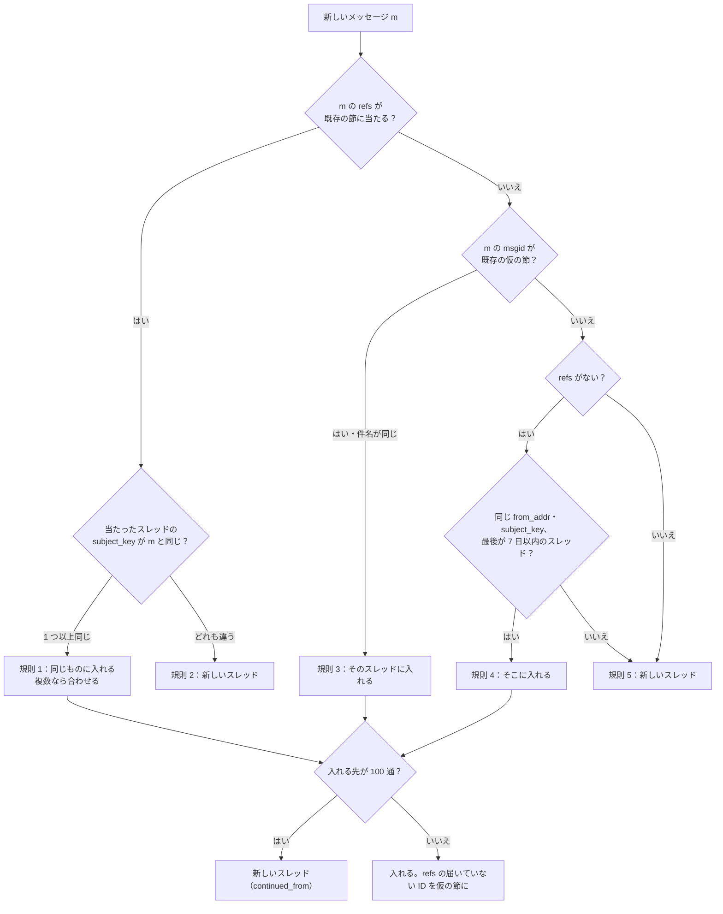

# Mailbox Model, Labels and Threads: Gmail

メールボックスのモデルを決める。システムと利用者のラベル、迷惑メールとゴミ箱の排他（隠す規則）、アーカイブ、スレッドへの操作、ミュート、スヌーズ、ゴミ箱と迷惑メールの箱の期限、ラベルの名前の変更と消去、スレッド化の規則と件名の正規化、仮の節、スレッドの合わせ、件数の数え方を扱う。

前提となる決定は次のとおり。

- ラベルが正。迷惑メールとゴミ箱は他のラベルと排他で、付いたメッセージは他のラベルの一覧から外す。フォルダーは見せ方（[ADR-0004](../decisions/0004-labels-as-primary-mailbox-model.md)）
- スレッドは Message-ID のつながりと正規化した件名で合わせ、参照のないメールは同じ差出人・同じ件名・7 日で合わせる。100 通で新しいスレッド。合わせるが分けない（[ADR-0005](../decisions/0005-threading-algorithm.md)）
- 状態の変更は `mailstore` だけが書き、`modseq` を 1 つ進めて change log と outbox を同じトランザクションで書く（[ADR-0006](../decisions/0006-sync-protocol-jmap-imap-and-modseq.md)）

この文書で決めたことは次の ADR にある。

| ADR | 決定 |
| --- | --- |
| [0033](../decisions/0033-label-operations-decision-table.md) | ラベルの操作は 1 つの関数 `apply_label_op` と決定表 DT-MBX で当てる。`SPAM`・`TRASH` を付けると、他のラベルの所属は残して隠し、`INBOX` は外して「隠す前に受信箱にあった」印を残す。戻すときは印で `INBOX` を戻す。スレッドへの操作は、その時点のスレッドのメッセージ（隠したものを除く）に当てる。ミュートは受信箱から外し、利用者だけに宛てたメッセージでだけ受信箱へ戻す。スヌーズは `SNOOZED`＋時刻で、時刻か新しい返信で起こす。ゴミ箱と迷惑メールの箱は 30 日で消す。ラベルの消去は背景で 1,000 通ずつ外す |
| [0034](../decisions/0034-threading-implementation-and-merge.md) | スレッド化は配送のトランザクションの中で行い、合わせるスレッドの行を ID の順でロックする。合わせは古い ID を残し、移ったメッセージは新しいオブジェクトの世代（JMAP の Email の ID・IMAP の EMAILID と UID を新しくする）にして、消えたスレッドと同じ `modseq` で change log に書く。仮の節はスレッドが生きている間持ち、1 スレッド 1,000 まで。100 通の上限の後のスレッドは `continued_from` で前のスレッドを指す。件名の正規化の表と規則は `threading_version` のコードのバージョンで出し、既存のスレッドに遡らない |

## 1. 範囲

- 扱う：
  - システムのラベルと利用者のラベル、JMAP と IMAP への見せ方の対応（詳しい対応は [client-sync-and-protocols.md](client-sync-and-protocols.md)）
  - ラベルの操作の決定表、排他、アーカイブ、移動、スレッドへの操作
  - ミュート、スヌーズ、重要の印（MVP は利用者の印と連絡先の規則だけ）
  - ゴミ箱と迷惑メールの箱の 30 日の期限
  - ラベルの作成・名前の変更・消去、入れ子
  - スレッド化の手順、件名の正規化、仮の節、合わせ、上限、乗っ取りの印
  - ラベルとスレッドの件数
- 扱わない：
  - 迷惑メールの判定（[spam-and-abuse-filtering.md](spam-and-abuse-filtering.md)）。この文書は判定の結果のラベルの当て方だけ
  - フィルターの条件と動作の順序（[filters-forwarding-and-automation.md](filters-forwarding-and-automation.md)）、スヌーズを起こす時刻の仕組み（同 7 節）
  - 保留と保持の期限（retention-and-ediscovery.md）
  - 受信箱の分類（タブ）と中身による重要の判定（MVP の後。法務の L1）

## 2. 要件

| 要件 | 値 | 出どころ |
| --- | --- | --- |
| 排他 | `SPAM` と `TRASH` を同時に持つメッセージがない。持つメッセージは他のラベルの一覧・すべてのメール・検索の既定に出ない | [ADR-0004](../decisions/0004-labels-as-primary-mailbox-model.md) |
| 同期 | どの変更も `modseq` を 1 つ進め、change log に載る。JMAP と IMAP で同じ所属に見える | NFR-006、[ADR-0006](../decisions/0006-sync-protocol-jmap-imap-and-modseq.md) |
| スレッドの収束 | 上限と 7 日の窓に当たらない範囲で、到着の順序に依らず同じ分け方 | [ADR-0005](../decisions/0005-threading-algorithm.md) |
| 分けない | 一度同じスレッドだった 2 つのメッセージは、以後も同じスレッド | 同上 |
| 画面の反映 | 操作の反映は楽観の更新で 100ms（[web-client.md](web-client.md)）。サーバーの操作は 1 通 p99 100ms、1,000 通のスレッドの操作 p99 1 秒 | NFR-013 |
| 配送の遅れ | スレッド化を含む `mailstore.deliver` p99 300ms | NFR-001 |

## 3. 本家の形

いずれも 2026-10-10 に確認。

| 項目 | 本家 | この設計 |
| --- | --- | --- |
| ラベル | フォルダーと違い、1 つのメールに複数付けられる。本人にだけ見える（[Create labels](https://support.google.com/mail/answer/118708)） | 同じ（[ADR-0004](../decisions/0004-labels-as-primary-mailbox-model.md)） |
| 会話 | 件名が変わると分かれる。100 通を超えると分かれる。自動の通知は 1 週間の中でまとめることがある（[Group emails into conversations](https://support.google.com/mail/answer/5900)） | 同じ（[ADR-0005](../decisions/0005-threading-algorithm.md)） |
| スヌーズ | 一時的に受信箱から外し、決めた時刻に受信箱の先頭へ戻す。`in:snoozed` で探せる（[Snooze emails until later](https://support.google.com/mail/answer/7622010)） | 同じ。新しい返信で起こすかは公式の資料で確かめられなかった（**未検証**）。本システムは起こす（5.3 節） |
| ミュート | 本家の詳しい条件（どのとき受信箱へ戻すか）は確かめられなかった（**未検証**） | 利用者だけに宛てたメッセージで戻す（5.3 節） |
| ゴミ箱と迷惑メールの箱の日数 | **未検証** | 30 日（[architecture/README.md](README.md) の 6 節の決定） |
| 利用者のラベルの数の上限 | **未検証** | 5,000（[ADR-0004](../decisions/0004-labels-as-primary-mailbox-model.md)） |

## 4. ラベル

### 4.1 システムのラベル

| ラベル | 意味 | JMAP | IMAP |
| --- | --- | --- | --- |
| `INBOX` | 受信箱 | `Mailbox`（`role: inbox`） | `INBOX` |
| `SENT` | 送ったメッセージ | `role: sent` | `[<Brand>]/Sent Mail`（`\Sent`） |
| `DRAFT` | 下書き | `role: drafts`、キーワード `$draft` | `[<Brand>]/Drafts`（`\Drafts`） |
| `SPAM` | 迷惑メール（隠す） | `role: junk` | `[<Brand>]/Spam`（`\Junk`） |
| `TRASH` | ゴミ箱（隠す） | `role: trash` | `[<Brand>]/Trash`（`\Trash`） |
| `STARRED` | スター | キーワード `$flagged`（箱は出さない） | 旗 `\Flagged` と `[<Brand>]/Starred`（`\Flagged`） |
| `IMPORTANT` | 重要 | `role: important` | `[<Brand>]/Important`（`\Important`、RFC 8457） |
| `SCHEDULED` | 予約の送信の待ち | `role: scheduled` | 出さない |
| `SNOOZED` | スヌーズ中 | `role: snoozed` | 出さない（すべてのメールに出る） |
| （すべてのメール） | 隠していないすべて | `role: all`（仮想の箱） | `[<Brand>]/All Mail`（`\All`） |

- 既読はラベルではなく `seen` の旗（`$seen`、`\Seen`）で持つ（[ADR-0004](../decisions/0004-labels-as-primary-mailbox-model.md)）。
- 「すべてのメール」はラベルの行を持たない仮想の箱で、`SPAM`・`TRASH`・`SCHEDULED` を持たないすべてのメッセージを含む。JMAP の「メッセージは少なくとも 1 つの箱に属する」（RFC 8621 の 2 節）を、アーカイブしたメッセージでも満たすために出す（[ADR-0041](../decisions/0041-jmap-extensions-and-mailbox-mapping.md)）。

### 4.2 利用者のラベル

- 名前は Unicode の NFC、1〜225 文字、`/` で入れ子を表す。親が無い子（`仕事/顧客`）を作ると、親（`仕事`）も作る。同じ親の下で、NFC と大文字小文字を畳み込んだ名前が一意。
- 予約の名前（`INBOX`、`[<Brand>]` で始まるもの）は使えない。
- 1 アカウント 5,000 まで。
- `label_id` は UUIDv7 で、名前の変更で変わらない。

### 4.3 見える所属と隠した所属

- メッセージのラベルの所属（`message_labels`）を正にする。各行は `hidden`（真偽）を持つ。
- メッセージが `SPAM` か `TRASH` を持つ間、他の所属の行は `hidden = true` になる。隠した所属は、ラベルの一覧・件数・IMAP の箱・JMAP の `mailboxIds`・検索の既定に出ない。
- 隠した所属は消さない。`SPAM`・`TRASH` を外すと見える所属に戻る（4.4 節の UID の扱いに注意）。
- JMAP は隠した所属を `<brand>:hiddenMailboxIds` で読める（戻す操作の画面のため。[client-sync-and-protocols.md](client-sync-and-protocols.md) の 6.3 節）。

### 4.4 IMAP の UID との関係

- 見える所属になるたびに、その箱の新しい UID を振る（[ADR-0006](../decisions/0006-sync-protocol-jmap-imap-and-modseq.md)）。隠すと、その UID は IMAP では消えた（`VANISHED`）ことになり、戻すと新しい UID になる。
- 詳しい例は [client-sync-and-protocols.md](client-sync-and-protocols.md) の 7.4 節。

## 5. 操作（ADR-0033）

### 5.1 決定表 DT-MBX

`apply_label_op(message, op)` は次の表で当てる。上から評価し、当たった行の「後」を当てる。`H` は「隠す前に受信箱にあった」印（`inbox_before_hide`）。

| # | 操作 | 前の条件 | 後 | change log |
| --- | --- | --- | --- | --- |
| 1 | ラベル L を付ける（L は利用者のラベル・`STARRED`・`IMPORTANT`） | `SPAM`・`TRASH` なし | L を見える所属で足す | `label_added` |
| 2 | 同上 | `SPAM` か `TRASH` あり | L を隠した所属で足す | `label_added`（`hidden`） |
| 3 | `INBOX` を付ける（受信箱へ移す） | `SPAM` か `TRASH` あり | `SPAM`・`TRASH` を外し、隠した所属を戻し、`INBOX` を足す | `label_removed`、`label_added` |
| 4 | `INBOX` を付ける | `DRAFT` あり | 拒む（`invalidLabelForDraft`） | — |
| 5 | `INBOX` を付ける | その他 | `INBOX` を足す。`SNOOZED` があれば外し、起こしの時刻を消す | `label_added` |
| 6 | アーカイブ（`INBOX` を外す） | `INBOX` あり | `INBOX` を外す | `label_removed` |
| 7 | 迷惑メールにする | `SPAM` なし | `H := INBOX の有無`。`INBOX`・`TRASH`・`SNOOZED` を外し、`SPAM` を足し、他を隠す | `label_added`、`label_removed`、`hidden` |
| 8 | 迷惑メールではない | `SPAM` あり | `SPAM` を外し、隠した所属を戻し、`INBOX` を足す（受け取ったメッセージのとき） | `label_removed`、`label_added` |
| 9 | ゴミ箱へ | `TRASH` なし | `H := INBOX の有無`（`SPAM` から来たときは偽）。`INBOX`・`SPAM`・`SNOOZED` を外し、`TRASH` を足し、他を隠す。`trash_at := 今` | `label_added`、`label_removed`、`hidden` |
| 10 | ゴミ箱から戻す | `TRASH` あり | `TRASH` を外し、隠した所属を戻す。`H` が真なら `INBOX` を足す。`trash_at` を消す | `label_removed`、`label_added` |
| 11 | 完全に削除 | どれでも | 行を消す。参照の外しを outbox へ。保留は blob に残る（[message-parsing-and-storage.md](message-parsing-and-storage.md) の 8.3 節） | `destroyed` |
| 12 | `SENT`・`DRAFT`・`SCHEDULED` を付ける・外す | 利用者の操作 | 拒む（送信の流れだけが変える。7 節） | — |
| 13 | 移動（L1 → L2） | — | 「L1 を外す」と「L2 を付ける」を 1 つの `modseq` で当てる。L2 が `TRASH`・`SPAM`・`INBOX` なら 9・7・3/5 の行 | 両方 |
| 14 | スヌーズ（時刻 t） | `SPAM`・`TRASH`・`DRAFT` なし、t は 1 分後〜1 年後 | `INBOX` を外し、`SNOOZED` を足し、`snooze_until := t` | `label_removed`、`label_added` |
| 15 | スヌーズを起こす | `SNOOZED` あり | `SNOOZED` を外し、`INBOX` を足す。`inbox_at := 今`（受信箱の先頭に出す） | `label_removed`、`label_added` |

- `SPAM`・`TRASH` を同時に持つ状態は、行 7・9 で他方を外すので作れない。
- 行 8 で「受け取ったメッセージ」は `SENT` を持たないもの。自分が送ったメッセージは `SPAM` にならない（送信の選別は保留で扱う）。
- 受信箱の並びは、JMAP の拡張の並べ方 `<brand>:inboxAt`（`INBOX` を得た時刻）を使う。スヌーズから戻ったメッセージが先頭に来る。

### 5.2 スレッドへの操作

- スレッドへの操作（アーカイブ、ラベル、既読、ゴミ箱、迷惑メール）は、操作の時点でスレッドに属し、`SPAM`・`TRASH` を持たないメッセージに、5.1 節の行を当てる（[ADR-0004](../decisions/0004-labels-as-primary-mailbox-model.md)）。ゴミ箱・迷惑メールの箱の画面からのスレッドの操作は、逆に `TRASH`・`SPAM` を持つメッセージだけに当てる。
- 1 つのスレッドの操作は 1 つの `modseq` で、メッセージごとに change log の行を書く。
- 操作の後に届いたメッセージには当てない。クライアントが古いスレッドの姿で操作したとき（JMAP の `ifInState` なし）は、今のスレッドの姿に当てる。
- 例：スレッド T にメッセージ a（`INBOX`、`仕事`）、b（`INBOX`、`SENT`）、c（`TRASH`、隠した `仕事`）がある。「T をアーカイブ」は a と b から `INBOX` を外し、c には触れない。

### 5.3 ミュートとスヌーズ

- **ミュート**：スレッドの属性 `muted`。ミュートの時点でスレッドの全メッセージをアーカイブする。以後スレッドに届いたメッセージは `INBOX` を付けずに配る。ただし、メッセージの `To` に利用者のアドレスだけがある（`Cc` なし、他の宛先なし）ときは `INBOX` を付ける（本家の条件は**未検証**）。ミュートのスレッドへの新しいメッセージは通知しない（[mobile-and-push.md](mobile-and-push.md)）。
- **スヌーズ**：行 14・15。起こしは時刻の仕事（[filters-forwarding-and-automation.md](filters-forwarding-and-automation.md) の 7 節）が行う。スヌーズのスレッドに新しいメッセージが届いたら、新しいメッセージは普通に配り（`INBOX`）、同じスレッドの `SNOOZED` のメッセージも行 15 で起こす。スヌーズの後に利用者がゴミ箱へ移したら、行 9 で `SNOOZED` を外し、起こしの時刻を消す。
- スレッドのミュート・スヌーズは、合わせ（6.4 節）で次のように合わせる：`muted` は両方が真のときだけ真。スヌーズの時刻はメッセージごとに持つので、合わせで変わらない。

### 5.4 ゴミ箱と迷惑メールの箱の期限

- `TRASH` は `trash_at`、`SPAM` は `spam_at` から 30 日で完全に削除する（5.1 節の行 11）。
- 期限の掃除は、メールボックスのシャードごとに 1 時間おきに、`(trash_at)`・`(spam_at)` の索引で期限を過ぎた行を、アカウントごとに文脈を設定して 1,000 通ずつ消す（[ADR-0007](../decisions/0007-tenancy-accounts-orgs-and-rls.md) の X4）。
- 保留のあるメッセージも、メールボックスの行は消える。blob は保留の参照で残る（[message-parsing-and-storage.md](message-parsing-and-storage.md) の 8.3 節）。保留の中の利用者の見え方は retention-and-ediscovery.md で決める。
- 「ゴミ箱を空にする」「迷惑メールをすべて削除」は、同じ消し方を利用者の操作として行う。

### 5.5 ラベルの名前の変更と消去

- **名前の変更**：`label_id` は変わらない。子のラベルの名前も 1 つの `modseq` で変える。IMAP では `RENAME` と同じで、`UIDVALIDITY` は変わらない（RFC 9051 の 6.3.6 節）。
- **消去**：ラベルの行を `deleting` にし、同じ `modseq` で JMAP の `Mailbox` の `destroyed`、IMAP の箱の消去として見せる。所属の行は背景で 1,000 通ずつ外す（1 回ごとに `modseq` を進める。外したメッセージは JMAP の `updated`）。所属が 0 になったら行を消す。同じ名前のラベルを作り直すと、新しい `label_id` と新しい `UIDVALIDITY` になる。
- 消去でメッセージは消えない（すべてのメールに残る）。JMAP の `onDestroyRemoveEmails` の扱いは [client-sync-and-protocols.md](client-sync-and-protocols.md) の 6.2 節。

## 6. スレッド化（ADR-0005、ADR-0034）

### 6.1 入力と件名の正規化

入力は [ADR-0005](../decisions/0005-threading-algorithm.md) の `msgid`・`refs`・`subject_key`・`from_addr`・`date`（受け付けの時刻）・自動のメールの印。件名の正規化は次の順に当てる（`threading_version = 1`）。

1. encoded-word を復号した件名（[message-parsing-and-storage.md](message-parsing-and-storage.md) の 6.3 節）。
2. NFKC、大文字小文字の畳み込み、空白の連続を 1 つに、前後の空白を落とす。
3. 先頭から次を、なくなるまで繰り返し外す。
   - 返信・転送の印：`re`、`fw`、`fwd`、`aw`、`sv`、`vs`、`antw`、`返信`、`転送`、`答复`、`回复`、`轉寄`。その後に `[n]`・`(n)`・`^n`（数）があってもよく、`:` が続く（NFKC で `：` は `:` になる）
   - 角かっこの札：`[...]` で 64 文字までのもの（メーリングリストの `[sales:01234]` など）
4. 空になったら「件名なし」の鍵。

| 元の件名 | `subject_key` |
| --- | --- |
| `見積もりのご依頼` | `見積もりのご依頼` |
| `Re: 見積もりのご依頼` | `見積もりのご依頼` |
| `RE：Ｆｗｄ: [sales:0123] 見積もりのご依頼` | `見積もりのご依頼` |
| `返信: Re[2]: 見積もりのご依頼` | `見積もりのご依頼` |
| `Re: 見積もりのご依頼（再送）` | `見積もりのご依頼(再送)` |
| `Re:` | 件名なし |

- 正規化の表は `crates/threading` のコードのバージョンで、試験のベクトルを QA が持つ。表を変えても、既存のスレッドに遡らない（[ADR-0005](../decisions/0005-threading-algorithm.md)）。スレッドの行は、作ったときの `subject_key` と `threading_version` を持つ。新しいメッセージと比べるときは、そのスレッドの `threading_version` の規則で新しいメッセージの件名を正規化し直して比べる。

### 6.2 手順

配送のトランザクションの中で、[ADR-0005](../decisions/0005-threading-algorithm.md) の規則 1〜5 を当てる。

- 規則 1 と規則 3 の両方に当たるとき（m の `refs` がスレッド A に、m の `msgid` がスレッド B の仮の節に当たり、件名が同じ）は、A と B を合わせる。
- m の `refs` のうち、どこにもない ID は、m の入ったスレッドの仮の節として足す。
- 「件名なし」の鍵は、規則 1・3 では一致とみなし、規則 4 では一致とみなさない。

### 6.3 例：欠けた親と、件名だけの一致

利用者 佐藤（`sato@example.co.jp`）のアカウントに、次の順でメッセージが届く。日付は受け付けの時刻。

| 順 | 到着 | Message-ID | From | 件名 | In-Reply-To / References |
| --- | --- | --- | --- | --- | --- |
| m1 | 10/01 09:00 | `<a1@example.co.jp>` | 佐藤（送信） | `見積もりのご依頼` | なし |
| m2 | 10/01 11:00 | `<d4@mobile.example.jp>` | 田中 | `RE: 見積もりのご依頼` | IRT `<c3@partner.example>` だけ |
| m3 | 10/01 11:05 | `<c3@partner.example>` | 鈴木 | `Re: 見積もりのご依頼` | IRT `<a1@example.co.jp>`、Refs `<a1@example.co.jp>` |
| m4 | 10/03 08:00 | `<e5@example.co.jp>` | 佐藤（送信） | `見積もりのご依頼` | なし（別の端末で新しく書いた） |
| m5 | 10/03 09:00 | `<f6@other.example>` | 山本 | `見積もりのご依頼` | なし |
| m6 | 10/20 09:00 | `<g7@example.co.jp>` | 佐藤（送信） | `見積もりのご依頼` | なし |

1. **m1**：`refs` なし、同じ差出人・件名のスレッドなし。規則 5 で T1 を作る。節 `a1`。
2. **m2**：`refs = {c3}`。`c3` はどこにもない。規則 1・2 に当たらず、`msgid = d4` も仮の節でない。`refs` があるので規則 4 は使えない。規則 5 で T2 を作る。節 `d4` と仮の節 `c3` を T2 に置く（**欠けた親**：鈴木の返信 m3 は、携帯のアプリが `References` を落とした田中の返信より後に届いた）。
3. **m3**：`refs = {a1}` は T1 の節で、件名が同じ → 規則 1 で T1。同時に `msgid = c3` は T2 の仮の節で、件名が同じ → 規則 3 で T2。両方に当たるので、**T1 と T2 を合わせる**。古いほう（T1、UUIDv7 で小さい）を残し、m2 の `thread_id` を T2 から T1 へ書き換え、T2 を消す。`c3` は仮の節から届いた節になる。change log は 1 つの `modseq` で、m3 の `created`、m2 の世代の切り替え（JMAP では m2 の古い ID の `destroyed` と新しい ID の `created`。6.4 節）、T2 の `destroyed`、T1 の `updated`。
4. **m4**：`refs` なし。同じ `from_addr`（佐藤）・同じ `subject_key` のスレッド T1 の最後のメッセージ（m3、10/01 11:05）は 7 日以内 → **規則 4（件名だけの一致）**で T1。
5. **m5**：`refs` なし。山本の同じ件名のスレッドはない（T1 の最後のメッセージの差出人ではなく、スレッドに山本のメッセージがない）。規則 5 で T3。同じ件名の別の会話（「見積もりのご依頼」は多くの取引先が使う）を混ぜない。
6. **m6**：`refs` なし。T1 の最後のメッセージ（m4、10/03）から 17 日で、7 日を超える → 規則 5 で T4。

規則 4 の「同じ `from_addr` のスレッド」は、スレッドの中に `from_addr` が同じメッセージがあることで決める（`thread_senders` の表）。到着の順序を変えて m3 が m2 より先に届くと、m3 は規則 1 で T1、m2 は規則 1（`c3` が T1 の節）で T1 に入り、同じ分け方になる。

### 6.4 合わせの手順と同時の配送（ADR-0034）

- 合わせる候補のスレッドの行を、`thread_id` の順に `SELECT ... FOR UPDATE` で取る（同じアカウントの 2 つの配送が逆の順でロックして行き詰まらないため）。
- 残すのは ID の小さいスレッド。移るメッセージの `thread_id`、節の `thread_id`、`thread_labels` の集計、`thread_senders` を書き換える。メッセージの数の合計が 100 を超えても合わせる（合わせで分けないため。上限は新しいメッセージを入れるときだけ見る）。
- 1 つのスレッドの合わせで移るメッセージは、上限 100 通の 2 倍程度に収まる（どちらも上限で止まるため）。仮の節は最大 1,000 なので、1 回の合わせの書き込みは 1,200 行まで。
- `muted` は両方が真のときだけ真。`continued_from` は残すスレッドのもの。
- **移るメッセージは新しいオブジェクトの世代にする。** RFC 8621 の 3 節は `threadId` を変わらない性質とし、合わせでは Email を消して新しい ID で入れ直すことを求める（MUST）。RFC 8474 の 5.2 節も `THREADID` を変えてはならないとする。そこで、移るメッセージの `object_gen` を 1 つ進め、JMAP の Email の ID と IMAP の `EMAILID` を `(message_id, object_gen)` から作り直す。JMAP では古い ID の `destroyed` と新しい ID の `created`、IMAP では見える所属ごとに古い UID の `VANISHED` と新しい UID になる。`message_id`・blob・ラベル・旗は変わらない。[ADR-0005](../decisions/0005-threading-algorithm.md) の「`threadId` の変更として届く」は、この形で置き換える（[ADR-0034](../decisions/0034-threading-implementation-and-merge.md)）。

### 6.5 上限と続きのスレッド

- スレッドのメッセージが 100 通に達したら、以後のメッセージは同じ規則で当たっても新しいスレッドを作り、`continued_from` に前のスレッドを持つ（本家に合わせる）。画面は「前の会話」へのリンクを出す。
- 前のスレッドの節は移さない。新しいスレッドで届いた節（`msgid`）は新しいスレッドに置く。以後、前のスレッドの節を参照するメッセージは、前のスレッドが 100 通なので、`continued_from` の鎖をたどった最後のスレッドに入れる。

### 6.6 仮の節

- 届いていない親の ID は、スレッドの仮の節として持つ（`thread_nodes.is_placeholder`）。スレッドが生きている間（どのメッセージも完全に削除されていない間）持ち続ける。期限で消すと、遅れて届いた親が別のスレッドになり、順序に依らない性質が崩れるため。
- 1 スレッドの仮の節は 1,000 まで。超えたら古いものから捨て、`threading_dropped_placeholders` を数える。
- スレッドのメッセージがすべて完全に削除されたら、スレッドの行と節を消す。

### 6.7 乗っ取りの印

- [ADR-0005](../decisions/0005-threading-algorithm.md) のとおり、規則 1・3 で入ったメッセージが認証（DMARC の通過か、DKIM の `d=` と From の揃い）に失敗し、差出人のドメインがスレッドに一度も現れていないときは、`thread_suspicious_join` の印をメッセージに付ける。画面は「このメッセージは確かめられていない」を出す（[spam-and-abuse-filtering.md](spam-and-abuse-filtering.md) で点にも使う）。

## 7. 件数

- ラベルごとの `total_emails`・`unread_emails`・`total_threads`・`unread_threads`（JMAP の `Mailbox` の性質、IMAP の `STATUS`）を、ラベルの行に持ち、変更と同じトランザクションで足し引きする。
- スレッドの数は `thread_labels(thread_id, label_id, msg_count, unread_count)` で数える。`msg_count` が 0 から 1 になったら `total_threads` を 1 足し、`unread_count` も同じ。
- 例：スレッド T（a、b の 2 通、どちらも `INBOX`、a は未読）を既読にする → `thread_labels(T, INBOX).unread_count` が 1→0、`INBOX.unread_threads` を 1 引く、`INBOX.unread_emails` を 1 引く。
- 週に 1 回、アカウントを選んで集計し直し、ずれを直して数える。

## 8. 失敗と回復

| 事象 | 影響 | 扱い |
| --- | --- | --- |
| 同じアカウントへの同時の配送で合わせが競合 | 行き詰まり | ID の順のロックで起きない。起きたら Aurora が一方を失敗させ、SQS の読み直しで再試行（配送は冪等） |
| 大きなスレッドの操作（1,000 通） | トランザクションが長い | 1 回 1,000 通まで。超えたら 1,000 通ずつ分け、別々の `modseq` にする（JMAP の応答は最後の状態） |
| ラベルの消去の背景の作業が止まる | 所属が残る | ラベルは `deleting` のまま見えない。作業を再開する。毎日 `deleting` の残りを数える |
| 期限の掃除が止まる | 30 日を過ぎたゴミ箱が残る | 期限の遅れを監視（1 日で警報）。容量に数え続ける |
| 件数のずれ | 未読の数が違って見える | 週の集計で直す。ずれの数を見張る |
| スレッド化の規則の誤り（コードの誤り） | 関係のないメールが同じスレッドに | 分けない規則なので自動で直せない。利用者が手で外す操作（MVP の後）まで、規則を直して以後のメッセージだけ正す |

## 9. 上限

| 対象 | 値 | 持ち場所 |
| --- | --- | --- |
| 利用者のラベル | 5,000／アカウント | [ADR-0004](../decisions/0004-labels-as-primary-mailbox-model.md) |
| ラベルの名前 | 225 文字、入れ子 10 段 | 4.2 節 |
| スレッドのメッセージ | 100（新しいメッセージを入れるとき） | [ADR-0005](../decisions/0005-threading-algorithm.md) |
| `refs` の数 | 100（後ろから） | 同上 |
| 仮の節 | 1,000／スレッド | ADR-0034 |
| 規則 4 の窓 | 7 日 | [ADR-0005](../decisions/0005-threading-algorithm.md) |
| 1 回の操作のメッセージ | 1,000 | ADR-0033 |
| スヌーズ | 1 分後〜1 年後 | ADR-0033 |
| ゴミ箱・迷惑メールの箱 | 30 日 | ADR-0033 |

## 10. data-model への項目

| 置き場所 | 中身 | 鍵・索引 | 節 |
| --- | --- | --- | --- |
| メールボックスのシャード `labels` | `label_id`、`kind`（`system`・`user`）、`system_role`、`name`、`name_key`（NFC と畳み込み）、`parent_id`、`color`、`state`（`active`・`deleting`）、`uidvalidity`、`uidnext`、`highest_modseq`、`total_emails`、`unread_emails`、`total_threads`、`unread_threads` | 主キー `(tenant_id, account_id, label_id)`。一意 `(account_id, parent_id, name_key) WHERE state='active'` | 4、5.5、7 |
| `message_labels` に足す列 | `hidden`、`added_at`（`inboxAt` の元）、`modseq`、`imap_deleted`（所属ごとの `\Deleted`） | 主キー `(tenant_id, account_id, label_id, message_id)`。一意 `(account_id, label_id, uid)` | 4.3、5 |
| `messages` に足す列 | `thread_id`、`object_gen`、`seen`、`inbox_before_hide`、`trash_at`、`spam_at`、`snooze_until`、`thread_flags`（`suspicious_join`）、`modseq` | 索引 `(account_id, trash_at)`、`(account_id, spam_at)`、`(account_id, snooze_until)` | 5 |
| `threads` | `thread_id`、`subject_key`、`threading_version`、`muted`、`continued_from`、`message_count`、`last_message_at`、`modseq` | 主キー `(tenant_id, account_id, thread_id)` | 6 |
| `thread_nodes` | `msgid_key`、`thread_id`、`is_placeholder`、`message_id` | 主キー `(tenant_id, account_id, msgid_key)` | 6.6 |
| `thread_senders` | `thread_id`、`from_addr_key`、`subject_key`、`last_at` | 主キー `(tenant_id, account_id, from_addr_key, subject_key, thread_id)` | 6.3 |
| `thread_labels` | `thread_id`、`label_id`、`msg_count`、`unread_count` | 主キー `(tenant_id, account_id, label_id, thread_id)` | 7 |
| change log の `kind` | `label_added`、`label_removed`、`hidden`、`unhidden`、`thread_merged`、`thread_destroyed`、`label_renamed`、`label_deleting` | [client-sync-and-protocols.md](client-sync-and-protocols.md) の 4 節 | 5、6.4 |

## 11. テストと性質

| ID | 性質・試験 |
| --- | --- |
| DT-MBX-001 | 5.1 節の決定表の全行（前の状態の組み合わせを生成し、行ごとの期待する後の状態と change log） |
| PROP-MBX-001 | 任意の操作の列（JMAP・IMAP・フィルター・配送・期限の掃除を混ぜる）で、`SPAM` と `TRASH` を同時に持つメッセージがない |
| PROP-MBX-002 | 任意の操作の列で、`SPAM`・`TRASH` を持つメッセージの他の所属は `hidden`。ゴミ箱へ移して戻す操作の対は、ラベルの所属（UID を除く）を元に戻す |
| PROP-MBX-003 | 任意の操作の列で、ラベルとスレッドの件数が、行を数え直した値に等しい |
| PROP-THR-001 | 上限と 7 日の窓に当たらない任意のメッセージの集合と到着の順序で、スレッドの分け方が同じ（[quality.md](../quality.md) の 2.2.1 節 D） |
| PROP-THR-002 | 任意の到着の列で、一度同じスレッドだった 2 つのメッセージは以後も同じスレッド。どのメッセージも 1 つのスレッドにだけ属する |
| PROP-THR-003 | 正規化した件名が違うメッセージは、規則 1・3 で合わせない |
| PROP-THR-004 | 合わせの change log を当てたクライアントの模型が、サーバーと同じ分け方になる |
| DT-THR-001 | [ADR-0005](../decisions/0005-threading-algorithm.md) の合わせの規則の全行と、6.3 節の例 |
| 試験のベクトル | 件名の正規化（6.1 節の表、各言語の返信の印、全角、encoded-word、メーリングリストの札） |
| 結合 | 同じアカウントへの同時の配送 100 本で、行き詰まりと合わせの誤りがない |
| eval | 「件名が違うが同じスレッドに入れよ」「スレッドを分け直せ」で止まる（[quality.md](../quality.md) の 3 節） |

## 12. Story の候補

| Epic | Story | 中身 |
| --- | --- | --- |
| E5 | `labels-and-exclusivity` | システムと利用者のラベル、隠す所属、DT-MBX（4・5.1 節） |
| E5 | `thread-ops-mute-snooze` | スレッドへの操作、ミュート、スヌーズ（5.2・5.3 節） |
| E5 | `trash-and-spam-expiry` | 30 日の期限の掃除（5.4 節） |
| E5 | `label-rename-and-delete` | 名前の変更、背景の消去（5.5 節） |
| E5 | `threading-v1` | 規則、正規化、仮の節、合わせ、上限（6 節） |
| E5 | `threading-property-tests` | PROP-THR-001〜004 |
| E5 | `label-and-thread-counts` | 件数の集計（7 節） |

## 13. 未解決の問い

### 決定（2026-10-10、既定案）

- **隠す所属**：`SPAM`・`TRASH` で他の所属を `hidden` にし、`INBOX` は印で戻す（ADR-0033）。
- **ミュート**：アーカイブを兼ね、利用者だけに宛てたメッセージで受信箱へ（ADR-0033）。
- **スヌーズ**：新しい返信で起こす（ADR-0033）。
- **スレッド化の同時性**：配送のトランザクションの中で、ID の順のロック（ADR-0034）。
- **仮の節**：スレッドが生きている間持ち、1,000 まで（ADR-0034）。
- **続きのスレッド**：`continued_from` で鎖にする（ADR-0034）。

### 持ち越し

| 問い | いつ・どう決めるか |
| --- | --- |
| 利用者が手でスレッドから外す操作 | MVP の後（[roadmap.md](../roadmap.md) の延期の一覧） |
| 中身による重要の判定、受信箱の分類 | MVP の後。法務の L1 |
| 保留の中のメッセージを、利用者の画面でどう見せるか | retention-and-ediscovery.md |
| 本家のミュート・スヌーズの詳しい条件、ゴミ箱の日数 | 公式の資料が出れば 3 節を直す（**未検証**） |

## 出典

- Gmail Help, [Create labels to organize Gmail](https://support.google.com/mail/answer/118708)（2026-10-10 に確認）
- Gmail Help, [Group emails into conversations](https://support.google.com/mail/answer/5900)（2026-10-10 に確認）
- Gmail Help, [Snooze emails until later](https://support.google.com/mail/answer/7622010)（2026-10-10 に確認）：一時的に受信箱から外し、決めた時刻に受信箱の先頭へ戻す
- [RFC 8621](https://www.rfc-editor.org/rfc/rfc8621)（JMAP for Mail）の 2 節、[RFC 9051](https://www.rfc-editor.org/rfc/rfc9051)（IMAP4rev2）の 6.3.6 節、[RFC 6154](https://www.rfc-editor.org/rfc/rfc6154)（SPECIAL-USE）、[RFC 8457](https://www.rfc-editor.org/rfc/rfc8457)（`\Important`）、[RFC 5256](https://www.rfc-editor.org/rfc/rfc5256)（THREAD）
