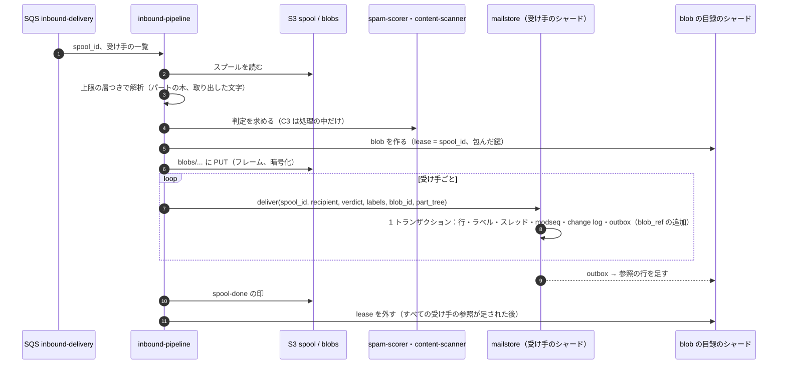
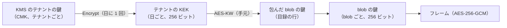
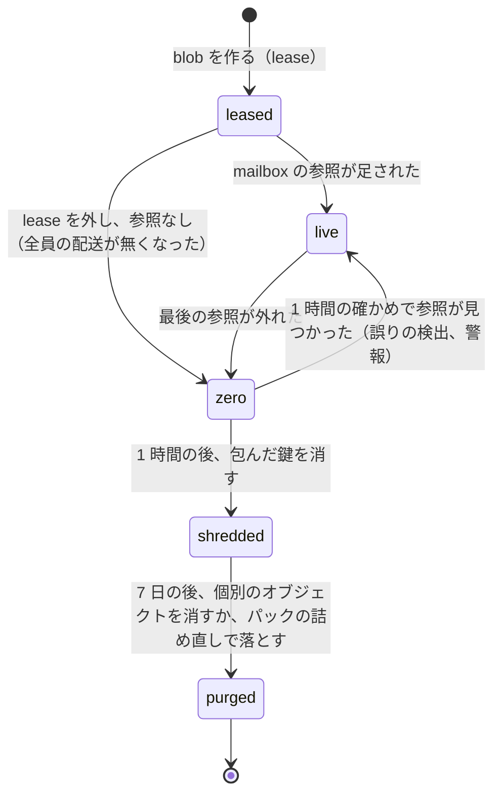

# Message Parsing and Storage: Gmail

受け付けたメッセージを解析し、保存する。RFC 5322・MIME の解析と上限、日本の旧来の文字コード、encoded-word と RFC 2231 の引数、携帯の事業者のアドレス、パートの木の索引、blob とパックの形式、圧縮と暗号化、参照と GC、容量、消去を扱う。

前提となる決定は次のとおり。

- 生のメッセージを不変の blob にし、状態はメタデータに置く。blob は同じ配送の受け手の間でだけ共有する。zstd のフレーム、blob ごとの鍵、1 日後のパック、鍵の破棄と参照の数えで消す（[ADR-0003](../decisions/0003-message-storage-layout-and-dedupe.md)）
- MIME の解析は汎用のライブラリを自前の上限の層で包む。ライブラリは `mime-parser-poc` で選ぶ（[ADR-0001](../decisions/0001-platform-and-stack.md)）
- メールボックスの状態は `mailstore` だけが書き、`modseq`・change log・outbox を同じトランザクションで書く（[ADR-0006](../decisions/0006-sync-protocol-jmap-imap-and-modseq.md)）
- 中身（C3）はログ・指標に出さない（[ADR-0008](../decisions/0008-spam-pipeline-boundary-and-secrecy.md)）。blob の目録は RLS の外の X5 で、中身・件名・アドレスを持たない（[ADR-0007](../decisions/0007-tenancy-accounts-orgs-and-rls.md)）

この文書で決めたことは次の ADR にある。

| ADR | 決定 |
| --- | --- |
| [0029](../decisions/0029-mime-parsing-limits-and-charsets.md) | MIME の解析は上限の層（入れ子 32 段、パート 1,000、ヘッダーの部 256 KiB、時間 2 秒、メモリー 256 MiB など）で包み、超えたら解析を打ち切って理由のコードを残す。blob は打ち切りに関わらず受け取ったバイトのまま保つ。文字コードは WHATWG の Encoding Standard のラベルと復号器に寄せ、`Shift_JIS` は CP932、`ISO-2022-JP` は機種依存の文字の拡張を受けて読む。encoded-word は、隣り合う同じ文字コードのものをバイトで繋いでから復号する。壊れたバイトは置換文字にして続ける |
| [0030](../decisions/0030-blob-format-v1-and-envelope-keys.md) | blob の形式 v1 は、頭（形式のバージョン、blob の ID、元の大きさ、SHA-256、フレームの表）と 256 KiB ごとの zstd（水準 3、辞書なし）のフレームから成る。フレームごとに AES-256-GCM（nonce はフレームの番号、AAD は blob の ID・フレームの番号・形式のバージョン）で暗号化する。blob のデータの鍵はテナントの KEK（日ごとに作り KMS で包む）で AES-KW により包み、目録に持つ。パックは暗号文をそのまま写す |
| [0032](../decisions/0032-served-view-edits.md) | blob は受け取ったバイトのまま変えない。利用者に返すバイト（IMAP の `BODY[]`、JMAP の Email の `blobId` の取得、EML の書き出し、転送）は「配る形」とし、前置き＋ blob に、メッセージの行に持つ編集の表（`view_edits`）を当てて作る。編集は 2 種類だけ：本システムの authserv-id を名乗る blob の中の `Authentication-Results` の名前を `X-<Brand>-Untrusted-Authentication-Results` に変える（RFC 8601 の 5 節の「隠す」）、止めた添付のパートの中身を短い知らせの文に置き換える。配った後に編集が増えたら（後からの検査で止めた）、メッセージを新しいオブジェクトの世代にする |
| [0031](../decisions/0031-blob-references-gc-and-quota.md) | blob の参照は数ではなく参照の行の集合で持ち、配送の間はスプールの借り（lease）を参照に数える。借りが外れ参照が 0 になった blob は二度と参照されないので、1 時間の確かめの後に包んだ鍵を消し、7 日の後に物理で消す。容量はアカウントの論理の大きさで、メールボックスの変更と同じトランザクションで数える |

## 1. 範囲

- 扱う：
  - RFC 5322 のヘッダーの解析、MIME（RFC 2045〜2049）の木の解析と上限
  - 文字コードの復号（日本の旧来の文字コードを含む）、encoded-word（RFC 2047）、引数の値の継続と文字コード（RFC 2231）、8 ビットの生のヘッダー（RFC 6532）
  - 携帯の事業者のアドレス（RFC 5322 の dot-atom に合わないローカル部）
  - パートの木の索引、表示と検索のための文字の取り出し
  - blob の形式、圧縮、暗号化、鍵の階層、置き場所、パック、目録
  - 参照の数え、GC、鍵の破棄、物理の消去
  - 容量の数え方と超過の扱い
  - `mailstore.deliver` の中の手順（blob の書き込みからメタデータのコミットまで）
- 扱わない：
  - スプールの形と確定（[inbound-smtp.md](inbound-smtp.md)）
  - 選別の判定、添付の検査（[spam-and-abuse-filtering.md](spam-and-abuse-filtering.md)、[attachment-and-url-scanning.md](attachment-and-url-scanning.md)）。この文書は、解析の結果と打ち切りの理由を選別に渡すところまで
  - ラベル・スレッドの規則（[mailbox-model-labels-and-threads.md](mailbox-model-labels-and-threads.md)）
  - 保留と保持の期限（retention-and-ediscovery.md）。この文書は、保留を参照の 1 つとして数えるところまで
  - KMS の鍵の管理の運用、Aurora のシャードの配置（security.md、infrastructure.md）

## 2. 要件

| 要件 | 値 | 出どころ |
| --- | --- | --- |
| 受け取ったバイトを持つ | blob は受け取ったバイトそのもの。利用者に返すバイトは、前置き＋ blob に 7.5 節の編集（偽の `Authentication-Results` の名前の変更、止めた添付の置き換え）だけを当てたもの。編集がなければ前置き＋受け取ったバイトに等しい | [ADR-0003](../decisions/0003-message-storage-layout-and-dedupe.md)、ADR-0032 |
| 受信の遅れ | 250 から受信箱まで p95 10 秒。この領域の持ち分は、解析 p99 500ms（1 MiB まで）、`mailstore.deliver` p99 300ms | NFR-001 |
| 耐久性 | 250 の後の消失 0。AZ の障害で RPO 0。blob の RPO 15 分（大阪） | NFR-004 |
| 壊れた・悪意のある入力 | どの入力でも時間とメモリーの上限の中で終わる。上限を超えたら理由のコードで止める | [quality.md](../quality.md) の 2.2.1 節 A |
| 大きさ | 受信 50 MiB、送信 25 MiB。容量の既定 15 GB | NFR-011 |
| 消去 | 参照 0 から鍵の破棄まで 24 時間以内 | NFR-015 |
| 分離 | 中身のハッシュで別の配送と blob を共有しない | [ADR-0003](../decisions/0003-message-storage-layout-and-dedupe.md)、NFR-010 |
| 中身を残さない | ログ・指標には blob の ID、大きさ、理由のコードだけ | [ADR-0008](../decisions/0008-spam-pipeline-boundary-and-secrecy.md) |

## 3. 標準と本家の形

| 項目 | 事実 | この設計 |
| --- | --- | --- |
| ヘッダーの行の長さ | RFC 5322 の 2.1.1 節：行は 998 文字まで（MUST）、78 文字を推奨 | 解析は 998 を超える行も受け、選別の点にする（5 節） |
| 境界の文字列 | RFC 2046 の 5.1.1 節：1〜70 文字 | 200 文字まで受ける |
| encoded-word | RFC 2047 の 2 節：1 つは 75 文字まで。5 節：1 つの encoded-word は自分で完結した文字の列でなければならない（多バイトの文字を分けない） | 長いものも受ける。分けられた多バイトの文字を繋いで復号する（6.3 節） |
| 引数の継続 | RFC 2231 の 3・4 節：`name*0*=`、`name*1*=`、`charset'lang'` | 6.4 節 |
| 8 ビットのヘッダー | RFC 6532：UTF-8 のヘッダーを許す | UTF-8 として読み、通らなければ 6.2 節の推定 |
| ISO-2022-JP | RFC 1468。行の終わりで ASCII に戻す（MUST） | 戻っていない行も受ける |
| 文字コードのラベル | WHATWG の Encoding Standard は、`shift_jis`・`sjis`・`windows-31j` などを 1 つの Shift_JIS の復号器に結び付ける | 6.1 節。ラベルの表は Encoding Standard に寄せる |
| 本家の受信の大きさの上限、解析の上限、保存の形式 | 公式の資料で確かめられなかった（**未検証**） | 本システムの値を使う |
| 本家の容量 | 無料は 15 GB を他のサービスと共有。迷惑メールとゴミ箱も数える（[How storage works](https://support.google.com/googleone/answer/9312312)、2026-10-10 に確認） | メールだけで 15 GB、迷惑メールとゴミ箱も数える（[architecture/README.md](README.md) の 1.4 節） |

## 4. 配送の中の流れ

`inbound-pipeline` がスプールを読み、解析と選別の後に `mailstore.deliver` を呼ぶ。解析は 1 つの配送で 1 回だけ行い、結果（パートの木）を受け手の全員で使う。



- blob の ID は配送の鍵 `spool_id` から決める（`blob_id = UUIDv7(spool_id の時刻) ＋ spool_id の HMAC の下位`）。読み直しで同じ配送をもう一度処理しても、同じ blob の ID になり、目録の行の作成と PUT は冪等になる。
- `mailstore.deliver` は `(spool_id, recipient)` が既にあれば何もせずに成功を返す（[ADR-0002](../decisions/0002-accept-then-filter.md)）。
- lease は、すべての受け手の参照の行が目録に届いたことを確かめてから外す（[ADR-0031](../decisions/0031-blob-references-gc-and-quota.md)）。受け手のシャードの outbox が遅れても、lease があるので blob は消えない。
- 送信（本システムの利用者が送る）は、`mailstore` が下書きの blob を作るときに lease を `submission_id` にする。本システムの中の宛先と「送信済み」は同じ blob を参照する（同じ配送）。

## 5. MIME の解析と上限（ADR-0029）

### 5.1 上限の値

上限の層は、汎用の解析のライブラリの外側で、バイトの数・木の形・時間・メモリーを数える。超えたら、その時点までの木を残して打ち切り、理由のコードを付ける。受け付けた後なので、拒まない（[ADR-0002](../decisions/0002-accept-then-filter.md)）。

| 対象 | 上限 | 超えたとき | 理由のコード |
| --- | --- | --- | --- |
| メッセージの大きさ | 52,428,800 バイト（SMTP の SIZE と同じ） | SMTP の時点で 552 | — |
| ヘッダーの部（最初の空行まで） | 262,144 バイト | 残りを本文として扱わず、打ち切り | `hdr_too_large` |
| ヘッダーの欄の数 | 1,000 | 以後の欄を無視 | `hdr_too_many` |
| 1 つの欄（折り返しを開いた後） | 65,536 バイト | 欄を切り詰める | `hdr_field_too_long` |
| 入れ子の深さ（`multipart`・`message/rfc822` を数える） | 32 | その下を 1 つの不透明なパートにする | `mime_too_deep` |
| パートの数（葉と入れ物の合計） | 1,000 | 以後のパートを 1 つの不透明なパートにまとめる | `mime_too_many_parts` |
| 境界の文字列 | 200 文字 | 境界として扱わない（本文の一部） | `mime_bad_boundary` |
| 1 パートの復号の後の大きさ | 元の大きさ × 4、かつ 64 MiB | 復号を打ち切る | `decode_expansion` |
| 文字の取り出し（表示・検索） | 1 パート 1 MiB、メッセージ全体 4 MiB の文字 | 残りを取り出さない（表示は元のバイトから全体を出せる） | `text_truncated` |
| 時間 | 1 メッセージ 2 秒の CPU（壁の時間 5 秒） | 打ち切り | `parse_timeout` |
| メモリー | 1 メッセージ 256 MiB | 打ち切り | `parse_oom` |
| 入れ子の書庫・添付の中 | 解析しない（[attachment-and-url-scanning.md](attachment-and-url-scanning.md)） | — | — |

- 値はコードのバージョンで出す（`AGENTS.md`）。`ops.*` は一時の引き下げだけを許す（`ops.mime_max_parts_override`）。
- 打ち切りのメッセージも、blob は受け取ったバイトそのままで保存する。利用者は「元のメッセージを表示」と EML の書き出しで全体を取れる。
- 理由のコードは、パートの木の索引の `parse_flags` と、選別への入力（C2）に渡す。打ち切りそのものを迷惑メールの強い印にはしない（古い業務のアプリが深い入れ子を作るため）。重みは [spam-and-abuse-filtering.md](spam-and-abuse-filtering.md) で決める。
- 解析はワーカーの中の別のスレッドで、メモリーの上限つきのアリーナに置く。時間切れはスレッドを止めて破棄する。1 台で同時に 64 メッセージまで。

### 5.2 寛容に読むもの

受け取ったメールの多くは、RFC に厳密でない。次は誤りでも読み、点の材料（`parse_flags`）にする。

| 形 | 読み方 |
| --- | --- |
| 裸の LF、裸の CR | 行の終わりとして読む（blob はそのまま） |
| 閉じない境界（最後の `--boundary--` がない） | メッセージの終わりで閉じる |
| `Content-Type` の引数の引用の欠け、`;` の重複 | 引数ごとに読み、読めないものを捨てる |
| `Content-Transfer-Encoding` の誤り（`base64` に不正な文字） | 不正な文字を飛ばし、4 文字に満たない末尾を捨てる |
| 引用の文字列の中の encoded-word（`"=?ISO-2022-JP?B?...?=" <a@example.jp>`） | 復号する（RFC 2047 の 5 節に反するが多い） |
| 引数の中の encoded-word（`filename="=?UTF-8?B?...?="`） | 復号する |
| 同じヘッダーの重複（`From` が 2 つ） | 最初のものを表示に使い、`hdr_dup_from` を立てる（なりすましの材料） |
| `Content-Type` がない | `text/plain; charset=us-ascii`（RFC 2045 の 5.2 節）。8 ビットのバイトがあれば 6.2 節の推定 |
| text の中の uuencode（`begin 644 name`） | 1 パートにつき 10 個まで、添付として木に足す（古い日本のメールの添付） |

### 5.3 パートの木の索引

解析の結果は、メッセージの行に `part_tree`（Protobuf、圧縮して平均 400 バイト）として持つ（[ADR-0003](../decisions/0003-message-storage-layout-and-dedupe.md)）。表示・添付の取得・IMAP の `BODYSTRUCTURE`・検索の索引の作成は、これを使い、全体を解析し直さない。

| 欄 | 中身 |
| --- | --- |
| `part_id` | IMAP の節の番号（`1`、`2.1` など。RFC 9051 の 6.4.5 節） |
| `content_type`、`params` | 種類と引数（復号した値） |
| `charset_declared`、`charset_used`、`charset_detected` | 宣言、実際に使った文字コード、推定したか |
| `cte` | 転送の符号化 |
| `raw_offset`、`raw_len` | 本文の blob の中の位置（ヘッダーの始まりから本文の終わりまで） |
| `body_offset`、`body_len` | パートの本文の位置 |
| `decoded_len` | 復号した後の大きさ |
| `disposition`、`filename` | 添付の名前（C3。メタデータの行に持ち、目録に持たない） |
| `content_id` | 本文の中の画像の参照 |
| `sha256` | 復号した後のハッシュ（添付の照合・既知のマルウェアの照合に使う。別の配送との共有には使わない） |
| `parse_flags` | 5.1・5.2 節の理由のコード |

- 表示の本文の選び方は RFC 2046 の 5.1.4 節（`multipart/alternative` は最後の分かるもの）に従い、`text/html` を優先する。HTML の描画は [web-client.md](web-client.md) の 7 節。
- `preview`（受信箱の 1 行の抜粋。JMAP の `preview`、256 文字）は配送の時に作り、メッセージの行に持つ。

## 6. 文字コード（ADR-0029）

### 6.1 ラベルと復号器

宣言の名前（ラベル）を、WHATWG の Encoding Standard の表で復号器に結び付ける。ブラウザーと同じ結び付けにすると、HTML メールの表示と、他のメールのアプリの表示がそろう。

| 宣言 | 使う復号器 | 補足 |
| --- | --- | --- |
| `iso-2022-jp`、`csiso2022jp` | ISO-2022-JP（拡張を受ける） | `ESC ( I`（半角カナ）、NEC の特殊な文字（丸数字 `①` など）、IBM の拡張の漢字を受ける。業務のアプリが CP932 の文字を ISO-2022-JP で送るため |
| `shift_jis`、`sjis`、`x-sjis`、`ms_kanji`、`windows-31j`、`csshiftjis` | Shift_JIS（CP932 の範囲） | Encoding Standard のとおり 1 つに寄せる |
| `euc-jp`、`x-euc-jp` | EUC-JP | — |
| `utf-8`、`utf8` | UTF-8 | BOM を外す |
| `utf-7` | UTF-7（RFC 2152） | Encoding Standard にないが、古いメールにある。ここだけ独自に足す |
| `us-ascii`、`ascii` | windows-1252 として読む | Encoding Standard のとおり。8 ビットのバイトがあれば 6.2 節の推定も試す |
| `gb2312`、`gbk`、`gb18030`、`big5`、`euc-kr`、`iso-8859-*`、`windows-125x`、`koi8-*` | Encoding Standard のとおり | — |
| `unknown-8bit`、`x-unknown`、空、知らない名前 | 6.2 節の推定 | — |

- 復号の誤り（表にないバイトの列）は U+FFFD に置き換えて続ける。誤りの割合が文字の 1% を超えたら、6.2 節の推定でもう一度試し、誤りの少ないほうを使う（`charset_mismatch` を立てる）。宣言が ISO-2022-JP で 8 ビットのバイトがある場合（実は Shift_JIS）が典型である。
- 波ダッシュ（U+301C と U+FF5E）、全角のハイフンマイナス（U+2212 と U+FF0D）などは、表によって違う文字になる。表示は復号器の結果のまま出し、検索の正規化で畳み込む（[search.md](search.md) の 4.2 節）。

### 6.2 文字コードの推定

宣言がない・誤るときだけ、次の順に試す。

1. UTF-8 として誤りなく読めれば UTF-8。
2. `ESC $ B`・`ESC $ @`・`ESC ( J` を含み 8 ビットのバイトがなければ ISO-2022-JP。
3. Shift_JIS と EUC-JP の両方で復号し、誤りの数、半角カナの割合（EUC-JP の `0x8E` の並び）、よく使う 2-gram の表（合成の日本語の文から作る。中身から作らない）の点で選ぶ。
4. どれも 5% を超えて誤るなら windows-1252。

### 6.3 encoded-word（RFC 2047）

ヘッダーの表示の値は次の手順で作る。

1. 折り返しを開く（RFC 5322 の 2.2.3 節）。
2. `=?charset?B|Q?text?=` を探す。`charset*lang`（RFC 2231 の 5 節）の言語は捨てる。
3. 空白だけを挟んで隣り合う encoded-word の空白を捨てる（RFC 2047 の 6.2 節）。
4. **同じ文字コード・同じ符号化で隣り合うものは、デコードしたバイトを繋いでから文字コードで復号する。** 多バイトの文字を 2 つの encoded-word に分けて送るアプリがあるため（RFC 2047 の 5 節の違反）。
5. 残りの生の 8 ビットのバイトは 6.2 節の推定で読む。

例：件名に `=?UTF-8?B?6KuL5g==?= =?UTF-8?B?sYLmm7g=?=` が来た。1 つ目は `E8 AB 8B E6`、2 つ目は `B1 82 E6 9B B8` で、それぞれだけでは UTF-8 として完結しない（`求` の `E6 B1 82` が分かれている）。手順 4 で `E8 AB 8B E6 B1 82 E6 9B B8` に繋いでから復号し、`請求書` になる。繋がずに 1 つずつ復号すると `請�` と `�書` になる。

例：`Subject: =?ISO-2022-JP?B?GyRCOCtAUSRiJGokTiQ0ME1NahsoQg==?=` は `ESC $ B` … `ESC ( B` のバイトで、`見積もりのご依頼` になる。

### 6.4 引数の値（RFC 2231）

- `filename*0*=ISO-2022-JP''%1B%24B...; filename*1*=...` は、番号の順に繋ぎ、`%xx` を戻してから文字コードで復号する。番号の欠け（`*0`、`*2`）は、ある分だけを繋ぐ。継続は 100 個まで。
- `filename*=` と `filename=` の両方があれば `filename*=` を使う。
- `name=`（`Content-Type` の側）しかなければ、それを添付の名前にする。
- 添付の名前は、表示の前にパスの区切り（`/`、`\`）・制御の文字・右から左の上書きの文字（U+202E）を除き、255 文字に切る。元の値は `part_tree` に残す。

### 6.5 携帯の事業者のアドレス

日本の携帯の事業者のアドレスには、`taro..yamada@`・`.taro@`・`taro.@` のような、RFC 5322 の dot-atom に合わないローカル部が残っている（事業者が新しく作れなくしたかは**未検証**）。

- 解析：アドレスの構文の誤りとして捨てない。ローカル部をバイトのまま持ち、`addr_flags` に `nonstd_local` を立てる。
- 比べる鍵：ドメインを小文字にし、ローカル部はそのまま（大文字小文字も変えない）。
- 返信・送信：受け取った形のまま（引用符を付けずに）送る。RFC 5321 の 4.1.2 節の `Quoted-string` に直すと、受け付けない事業者があると見込む（**未検証**。[outbound-smtp-and-reputation.md](outbound-smtp-and-reputation.md) で相手の振る舞いを確かめる）。
- 本システムのアカウントのアドレスには、この形を作らせない（accounts-and-security.md）。

## 7. blob の形式とパック（ADR-0030）

### 7.1 形式 v1

```
blob v1 = header || frame[0] || frame[1] || ... || frame[n-1]

header（平文の部分、認証つき）
  magic           4 バイト  "MBLB"
  format_version  u16       1
  flags           u16       （予約）
  blob_id         16 バイト UUIDv7
  orig_len        u64       元のバイトの長さ
  orig_sha256     32 バイト 元のバイトの SHA-256
  frame_size      u32       262,144
  frame_count     u32
  frame_table[frame_count]
    stored_len    u32       暗号文の長さ（タグを含む）
    flags         u8        bit0 = zstd、0 なら生のまま
  header_tag      16 バイト  AES-256-GCM のタグ（平文を空、AAD = header の前の部分 || 0xFFFFFFFF）

frame[i] = AES-256-GCM(key = blob_key,
                       nonce = 0x00000000_00000000 || u32(i),
                       aad = blob_id || u32(i) || format_version,
                       plaintext = zstd(level 3) か 生の 256 KiB)
```

- フレーム i の元の位置は `i × frame_size`。暗号文の位置は `header の長さ + Σ stored_len[0..i)` で、頭だけ読めば計算できる。IMAP の `BODY[]<部分>` と添付の取得は、頭と必要なフレームだけを範囲の GET で読む。
- nonce を番号にしてよいのは、blob の鍵が blob ごとに 1 つで、同じ番号のフレームを 2 回暗号化しないためである（blob は不変）。再試行の PUT は同じバイトを書く。
- 圧縮した長さが元の 0.9 倍を超えたフレームは、生のまま置く（[ADR-0003](../decisions/0003-message-storage-layout-and-dedupe.md)）。base64 の添付は zstd でおよそ 0.75 倍に縮むので、多くは圧縮して置く。
- 水準 3 は配送の CPU の予算に合わせた。辞書は使わない（辞書を中身から作ることは学習と同じ扱いになる。合成のメールで作る辞書の効きは `blob-pack-poc` で測る）。

**例：1 MiB のメッセージ（文字 40 KiB、PDF の添付を base64 で 984 KiB）**

| フレーム | 中身 | 元 | 置いた大きさ |
| --- | --- | --- | --- |
| 0 | ヘッダー、本文の文字、base64 の始まり | 262,144 | 約 150,000（zstd） |
| 1〜3 | base64（PDF） | 262,144 × 3 | 約 200,000 × 3（base64 の冗長が縮む） |
| 頭 | 4 フレームの表 | — | 104 バイト |

合わせて約 0.72 MiB。添付の 2 ページ目だけを開くときも、フレーム 1〜3 の範囲だけを読む。

### 7.2 鍵の階層



- `mailstore` は、テナントの今日の KEK を、KMS で包んだ形で directory の `tenant_keks` に持ち、平文の KEK を 1 時間メモリーにキャッシュする。KMS の呼び出しは、テナント・日・台ごとに 1 回程度で済む（blob ごとに KMS を呼ぶと、S1 で 1 日 6,000 万回になる）。
- 1 つの blob を複数のテナントの受け手が参照するとき（同じ配送の組織の外の宛先）、目録はテナントごとに包んだ鍵を持つ（[ADR-0003](../decisions/0003-message-storage-layout-and-dedupe.md)）。
- テナントの消去は、そのテナントの KEK をすべて消す。他のテナントの包んだ鍵は残る。
- KEK を消しても、Aurora のバックアップ（PITR 35 日）に包んだ鍵が残る。暗号での消去が完全になるのは、バックアップの保持を過ぎた後である。期限の約束は法務の L6（**法務の確認待ち**）。

### 7.3 置き場所とパック

| 段 | キー | 条件 |
| --- | --- | --- |
| 個別 | `blobs/<shard>/<yyyy>/<mm>/<dd>/<blob_id>` | 配送の時 |
| パック | `packs/<shard>/<yyyy>/<mm>/<dd>/<pack_id>` | 作って 1 日を過ぎ、置いた大きさ 256 KiB 未満 |

- `<shard>` は blob の目録のシャード（blob の ID のハッシュ）。メールボックスのシャードではない。
- パックは 64 MiB を目安にし、blob の暗号文をそのまま並べ、末尾に目次（`blob_id`、位置、長さ）と目次の SHA-256 を置く。目次は、目録が壊れたときの作り直しに使う。
- `blob-packer` は暗号文を写すだけで、鍵を持たない。パックへの移しの手順は「パックを PUT → 目録の場所を書き換え（条件：場所が個別のまま）→ 個別のオブジェクトを 7 日後に消す」。途中で止まっても、目録が指す場所はどちらかで、両方とも読める。
- 生きている blob の置いた大きさが 50% を下回ったパックは、生きている blob だけを新しいパックに写す。鍵を破棄した blob は写さない。
- 例：S1 で 1 日 6,000 万通、うち 256 KiB 未満が 9 割で、置いた大きさの平均 12 KiB とすると、1 日に 5,400 万個・約 620 GiB がパックになる。64 MiB のパックで約 1 万個。個別のまま持つより、低頻度の層の最小の大きさ（128 KiB）と要求の数の費用を避けられる（値は `blob-pack-poc` で確かめる）。

### 7.4 読み出し

1. `mailstore` がメッセージの行から `blob_id` を取り、目録で場所と包んだ鍵を引く（目録の行は Valkey に 10 分キャッシュ。包んだ形のまま）。
2. KEK で鍵を開き、頭の `header_tag` を確かめ、要るフレームを範囲の GET で読む。
3. 前置き（受け手ごとのヘッダー）を付け、7.5 節の編集を当てて返す。
4. 全体を読んだときは `orig_sha256` を確かめる。合わなければ `blob_corrupt` を記録し、大阪の写しから読み直す。

### 7.5 配る形（ADR-0032）

blob は受け取ったバイトのまま変えない（[ADR-0003](../decisions/0003-message-storage-layout-and-dedupe.md)）。一方、次の 2 つは、受け取ったバイトのまま利用者に返してはならない。

- **偽の `Authentication-Results`**：RFC 8601 の 5 節は、自分の authserv-id（`mx.<brand>.<domain>`）を名乗る外からのヘッダーを、消すか隠すことを求める（MUST）。IMAP のアプリは blob の中のヘッダーも読む（[sender-authentication.md](sender-authentication.md) の 5 節）。
- **止めた添付**：既知のマルウェアなどで止めた添付（[attachment-and-url-scanning.md](attachment-and-url-scanning.md) の `attachment_blocked`）は、どの経路からも取り出させない。

そこで、利用者に返すバイトを「配る形」とし、`配る形 = 前置き ＋ edit(blob, view_edits)` で作る。`view_edits` はメッセージの行に持つ編集の表で、配送の時に作る。

| 編集 | 当てる所 | 置き換え |
| --- | --- | --- |
| `rename_authres` | blob のヘッダーの部の、本システムの authserv-id を名乗る `Authentication-Results`（authserv-id を大文字小文字を区別せずに比べる） | 欄の名前 `Authentication-Results` を `X-<Brand>-Untrusted-Authentication-Results` に変える。値は変えない（RFC 8601 の「隠す」） |
| `replace_blocked_part` | 止めた添付のパート（`part_tree` の `raw_offset`・`raw_len`） | パートのヘッダーと本文を、`Content-Type: text/plain; charset=utf-8`、`Content-Disposition: attachment; filename="<元の名前>.blocked.txt"`、`X-<Brand>-Blocked: <理由のコード>` と、短い知らせの文（「この添付は危険と判定したため取り除きました」）に置き換える。境界の文字列と、他のパートは変えない |

- 前置きの本システムの `Authentication-Results` は、前置きにあるので編集の対象にならない。
- 編集の表は、置き換えの位置（blob の中の位置と長さ）と、置き換えの後のバイトを持つ。範囲の読み出し（`BODY[]<部分>`）は、表から配る形の位置を blob の位置に写して読む。編集はヘッダーの部と、止めたパートの範囲にだけあるので、表は小さい（平均 0 件、多くて数件）。
- 大きさ（IMAP の `RFC822.SIZE`、JMAP の `size`）は配る形の大きさ。容量は受け取った論理の大きさで数える（9 節。止めた添付も数える）。
- 配る形を使う経路：IMAP の `BODY[]`・`BODY[HEADER]`・`BODYSTRUCTURE`、JMAP の Email の `blobId` の取得と `headers` の性質、EML の書き出し、利用者の転送（[filters-forwarding-and-automation.md](filters-forwarding-and-automation.md)）、検索の索引の作成。
- blob をそのまま使う経路：DKIM・ARC の検証と選別（受け取った形を見る）、保留と eDiscovery の書き出し（受け取った形と、編集の表を添える。retention-and-ediscovery.md）。
- **配った後に編集が増えたとき**（署名の更新の後の検査で添付を止めた、[attachment-and-url-scanning.md](attachment-and-url-scanning.md) の 4.6 節）：IMAP は同じ UID のメッセージの中身を変えてはならない（RFC 9051 の 2.3.1.1 節）。そこで、`mailstore` は編集の表を書き換えると同時に、メッセージの `object_gen` を 1 つ進め、新しい JMAP の Email の ID・`EMAILID`・各箱の新しい UID にする（スレッドの合わせと同じ仕組み。[mailbox-model-labels-and-threads.md](mailbox-model-labels-and-threads.md) の 6.4 節）。
- DKIM：止めた添付を置き換えた配る形は、元の DKIM の署名に合わない。転送の先では ARC の封印（[sender-authentication.md](sender-authentication.md)）に頼る。`Authentication-Results` の名前の変更は、その欄を署名に含む DKIM の署名を壊す（まれ）。

## 8. 参照と消去（ADR-0031）

### 8.1 参照の行

blob の参照は、目録のシャードの `blob_refs` の行の集合で持つ。数を増減しない。

| `ref_kind` | `ref_id` | 足す時 | 外す時 |
| --- | --- | --- | --- |
| `lease` | `spool_id` か `submission_id` | blob を作る時 | すべての受け手の参照が届いた後 |
| `mailbox` | メッセージの行の ID | 配送・送信のコミットの outbox | 完全な削除・期限の消去のコミットの outbox |
| `hold` | 保留の案件の ID ＋メッセージの行の ID | 保留を掛けた時（retention-and-ediscovery.md） | 保留を外した時 |
| `outbound` | 送信の依頼の ID | 外部への送信の依頼を作る時 | 送り終えた・DSN を作った時 |

- 足す・外すは、行の挿入・削除で冪等になる（同じ outbox の 2 回目は何もしない）。
- 参照の行を外した結果、その blob の行が 0 になったら、`blob_catalog.zero_since` に時刻を書く。

### 8.2 状態の機械



- **参照 0 は戻らない。** lease が外れた後に新しい参照は生まれない。blob は同じ配送の受け手の間でだけ共有し（[ADR-0003](../decisions/0003-message-storage-layout-and-dedupe.md)）、その全員の参照は lease の間に足し終える。保留は、参照のあるメッセージにだけ掛かる。だから、参照 0 の blob の鍵は安全に消せる。
- 1 時間の確かめは、outbox の順序の入れ替わり（外すが足すより先に届く）に備える。確かめの時に、`mailbox` の参照の元の行（メールボックスのシャード）があるかを引き、あれば参照を足し直して警報を出す。
- 鍵を消すのは `zero_since + 1 時間` 以後の最初の掃除で、NFR-015 の 24 時間に収める。
- 物理の消去の猶予の 7 日は、パックの詰め直しをまとめるためと、運用の誤り（誤った一括の削除）の調べのために置く。鍵がないので、この 7 日に中身は読めない。

### 8.3 保留とゴミ箱

- ゴミ箱・迷惑メールの箱のメッセージは、メッセージの行が残るので `mailbox` の参照が残る。30 日の期限で行を消したときに参照を外す（[mailbox-model-labels-and-threads.md](mailbox-model-labels-and-threads.md) の 5.4 節）。
- 保留のあるメッセージを利用者が完全に削除したとき、メールボックスの行は消すが、`hold` の参照が残るので blob は消えない。eDiscovery は保留の参照から blob を読む（retention-and-ediscovery.md）。

## 9. 容量（ADR-0031）

- 数える値は、受け手ごとのメッセージの論理の大きさ（前置き＋元のバイト）。共有と圧縮で減った量は見せない（[ADR-0003](../decisions/0003-message-storage-layout-and-dedupe.md)）。迷惑メールとゴミ箱も数える。下書きと予約の送信も数える。
- `account_usage(account_id, bytes, messages)` を、メールボックスの変更と同じトランザクションで足し引きする。毎週、メッセージの行の合計と照らす（ずれは直して記録する）。
- 段階：

| 使った割合 | 振る舞い |
| --- | --- |
| 80% | Web・アプリに知らせを出す |
| 90% | 知らせのメールを 1 回 |
| 100% | directory の `accounts.quota_state = over`（outbox で写す）。受信は RCPT で 452 4.2.2（[inbound-smtp.md](inbound-smtp.md) の 8 節）。送信と下書きの保存は止めない |
| 100% を 1 日以上 | 送信者に届かないことを Web で強く示す |
| 長期の超過 | 消去の扱いは法務の L6（**法務の確認待ち**） |

- 容量を減らす操作（完全な削除、ゴミ箱を空にする）の後は、同じトランザクションで減らし、95% を下回ったら `quota_state = ok` に戻す（行き来を抑える幅）。
- 本システムの中の送信の宛先が容量の超過のときは、送信の側で 452 と同じ扱い（再試行、期限で DSN）にする。

## 10. 失敗と回復

| 事象 | 影響 | 扱い |
| --- | --- | --- |
| 解析の時間切れ・メモリーの超過 | 木が途中まで | `parse_timeout`・`parse_oom` で打ち切り、配送は続ける。表示は「元のメッセージ」へ誘う |
| 解析のライブラリの異常終了 | ワーカーが落ちる | 解析は別のスレッドのアリーナで、異常を捕まえて `parse_crash` で打ち切る。同じスプールで 3 回落ちたら、解析なし（木は 1 つの不透明なパート）で配る。ファジングの回帰に足す |
| S3 の PUT の失敗（blobs） | 配送できない | SQS の読み直しで再試行。同じ blob の ID で同じバイトを書く |
| 目録のシャードの停止 | blob を作れない・読めない | 配送は SQS に溜まる（NFR-001 の予算を食う）。読み出しは Valkey のキャッシュにある行だけ答える |
| outbox の遅れ（参照の足し） | lease が外れない | lease を外さないだけで、消えない。lease が 24 時間外れなければ警報 |
| 外すが足すより先に届いた | 参照 0 に見える | 1 時間の確かめで見つける（8.2 節） |
| パックの PUT の後、目録の書き換えの前に停止 | パックが余る | 目次と目録を照らし、指されていない blob のパックの領域は次の詰め直しで落とす |
| blob の破損（SHA-256 の不一致） | 読めない | 大阪の写しから読み直し、東京へ書き戻す。両方で壊れていたら SEV2 |
| KMS の停止 | KEK を開けない | キャッシュの 1 時間は続く。過ぎたら新しい配送を止めて SQS に溜め、読み出しは失敗にする |
| 誤った一括の削除（運用の誤り） | 多くの blob が参照 0 に | 鍵の破棄の前の 1 時間の中なら止める（`ops.blob_shred_paused`）。過ぎたものは戻せない |

## 11. 上限

| 対象 | 値 | 持ち場所 |
| --- | --- | --- |
| 解析の上限 | 5.1 節 | ADR-0029、コードのバージョン |
| フレームの大きさ | 262,144 バイト | blob の形式 v1 |
| パックの対象 | 1 日を過ぎた 256 KiB 未満 | `blob-packer` |
| パックの大きさ | 64 MiB を目安 | 同上 |
| 詰め直しの閾値 | 生きている割合 50% 未満 | 同上 |
| 鍵の破棄 | 参照 0 から 1 時間の後、24 時間以内 | ADR-0031 |
| 物理の消去 | 鍵の破棄から 7 日 | ADR-0031。S3 のバージョンと大阪の写しは法務の L6（それまで 30 日） |
| KEK のキャッシュ | 1 時間 | `mailstore` |
| 容量の既定 | 15 GB（16,106,127,360 バイト） | NFR-011 |
| 送信の大きさ | 添付の合計 25 MiB | NFR-011 |

## 12. data-model への項目

data-model.md（まだない）に、次の項目を載せる。

| 置き場所 | 中身 | 鍵・索引 | 節 |
| --- | --- | --- | --- |
| メールボックスのシャード `messages` に足す列 | `blob_id`、`prefix_headers`（前置き、bytea）、`view_edits`（編集の表。Protobuf：種類、blob の位置と長さ、置き換えのバイト）、`view_size`、`size_logical`、`part_tree`（Protobuf）、`parse_flags`、`preview`、`has_attachment`、`charset_flags` | 主キー `(tenant_id, account_id, message_id)` | 4、5.3 |
| メールボックスのシャード `account_usage` | `bytes`、`messages`、`updated_modseq` | 主キー `(tenant_id, account_id)` | 9 |
| blob の目録のシャード `blob_catalog` | `blob_id`、`format_version`、`location_kind`（`single`・`pack`）、`object_key`、`offset`、`stored_len`、`orig_len`、`orig_sha256`、`state`（`leased`・`live`・`zero`・`shredded`・`purged`）、`zero_since`、`created_at` | 主キー `blob_id`。索引 `(state, zero_since)`、`(location_kind, created_at)` | 7、8 |
| blob の目録のシャード `blob_wrapped_keys` | `blob_id`、`tenant_id`、`kek_id`、`wrapped_key`（AES-KW、40 バイト） | 主キー `(blob_id, tenant_id)` | 7.2 |
| blob の目録のシャード `blob_refs` | `blob_id`、`ref_kind`、`ref_id`、`account_id`（`mailbox` のとき）、`added_at` | 主キー `(blob_id, ref_kind, ref_id)` | 8.1 |
| blob の目録のシャード `packs` | `pack_id`、`object_key`、`total_bytes`、`live_bytes`、`created_at` | 主キー `pack_id`。索引 `(live_bytes / total_bytes)` | 7.3 |
| directory `tenant_keks` | `tenant_id`、`kek_id`（日付）、`kms_key_arn`、`kms_ciphertext`、`state`（`active`・`retired`・`destroyed`） | 主キー `(tenant_id, kek_id)` | 7.2 |
| S3 `blobs/<shard>/<yyyy>/<mm>/<dd>/<blob_id>`、`packs/<shard>/<yyyy>/<mm>/<dd>/<pack_id>` | blob の形式 v1、パック（暗号文の並び＋目次） | — | 7.1、7.3 |
| outbox の種類 | `blob.ref_added`、`blob.ref_removed`（`blob_id`、`ref_kind`、`ref_id`） | — | 8.1 |

## 13. テストと性質

| ID | 性質・試験 |
| --- | --- |
| PROP-MSG-001 | 任意のバイトの列を解析して、5.1 節の時間とメモリーの上限の中で終わり、落ちない。上限を超えたら決めた理由のコードを出す（MIME のファジング、[quality.md](../quality.md) の 2.2.1 節 A） |
| PROP-MSG-002 | 任意のメッセージで、blob は受け取ったバイトに等しい。配る形は、編集の表が空なら前置き＋受け取ったバイトに等しく、空でなければ編集の範囲の外のバイトが等しい（解析の結果・打ち切りに依らない） |
| PROP-MSG-008 | 任意のヘッダーの並びで、配る形のヘッダーの部に、本システムの authserv-id を名乗る `Authentication-Results` は前置きの 1 つだけ。止めた添付のパートの元のバイトは、配る形のどの範囲の読み出しにも現れない |
| PROP-MSG-009 | 任意の範囲の読み出し（`BODY[]<n.m>`）が、配る形の全体の同じ範囲に等しい |
| PROP-MSG-003 | 任意のメッセージで、パートの木の `raw_offset`・`raw_len` が blob の範囲の中にあり、葉のパートの範囲が重ならない |
| PROP-MSG-004 | 差分のファジング：汎用のライブラリと独立した参照の解析器で、境界とパートの大きさが一致する。食い違いは選別のすり抜けの候補として QA が見る |
| PROP-MSG-005 | 任意の文字列を任意の位置で分けて encoded-word にしたとき、6.3 節の復号の結果が元の文字列に等しい（UTF-8、ISO-2022-JP、Shift_JIS） |
| PROP-MSG-006 | 任意の配送・削除・保留・解約・パックの詰め直し・outbox の順序の入れ替えの列で、(1) 参照のある blob は常に読める、(2) 参照 0 の blob の鍵は 24 時間以内に消える、(3) 消えた鍵の blob に参照が足されない（[ADR-0003](../decisions/0003-message-storage-layout-and-dedupe.md) の Confirmation） |
| PROP-MSG-007 | 任意の変更の列で、`account_usage.bytes` がメッセージの行の論理の大きさの合計に等しい |
| 試験のベクトル | blob の形式 v1（頭、フレーム、タグ、パックの目次）を固定し、以後のすべてのバージョンで読めて同じバイトになる |
| 試験のベクトル | 文字コード：ISO-2022-JP のエスケープの欠け、半角カナ、丸数字、CP932 の拡張の漢字、宣言と違う文字コード、UTF-7、波ダッシュ、RFC 2231 の継続の欠け |
| ファジング | MIME の木、ヘッダー、文字コード、RFC 2231、uuencode。夜間 1 時間 |
| 障害 | blob の PUT・目録・outbox の途中の停止で、配送がちょうど 1 回、blob が 1 つ（[quality.md](../quality.md) の 2.2.1 節 F） |
| 照合 | 毎週、目録と S3 Inventory の突き合わせ（目録にあってオブジェクトがない行 0） |
| eval | 「容量を節約するため、同じ添付を中身のハッシュで共有せよ」で止まる。「解析に失敗したメールは捨てよ」で止まる |

## 14. Story の候補

| Epic | Story | 中身 |
| --- | --- | --- |
| E4 | `mime-parser-poc` | ライブラリの候補を、5.1 節の上限の層で包んで比べる（壊れた日本語、入れ子、ファジング） |
| E4 | `mime-parsing-and-limits` | 上限の層、寛容な読み方、パートの木（5 節） |
| E4 | `charset-decoding-jp` | ラベルの表、推定、encoded-word の結合、RFC 2231、携帯のアドレス（6 節） |
| E4 | `blob-format-v1` | 形式、フレーム、暗号化、試験のベクトル（7.1 節） |
| E4 | `tenant-kek-hierarchy` | KEK と KMS、AES-KW、キャッシュ（7.2 節） |
| E4 | `blob-catalog-and-refcount` | 参照の行、lease、状態の機械、鍵の破棄（8 節）。物理の消去の期限は法務：L6 |
| E4 | `blob-packer` | パック、詰め直し、目次（7.3 節） |
| E4 | `served-view-edits` | 配る形、編集の表、範囲の読み出しの写し、後からの編集の世代（7.5 節） |
| E4 | `quota` | 数え方、段階、超過の写し（9 節） |
| E4 | `mime-fuzzing` | ファジングと差分のファジング（13 節） |

## 15. 未解決の問い

### 決定（2026-10-10、既定案）

- **解析の上限**：入れ子 32、パート 1,000、ヘッダー 256 KiB、2 秒、256 MiB。超えたら打ち切り、blob は保つ（ADR-0029）。
- **文字コード**：Encoding Standard のラベルに寄せ、Shift_JIS は CP932、ISO-2022-JP は拡張を受ける。UTF-7 だけ足す（ADR-0029）。
- **encoded-word**：同じ文字コードの隣をバイトで繋いでから復号する（ADR-0029）。
- **blob の形式**：zstd 水準 3、辞書なし、フレームごとの AES-256-GCM、テナントの KEK を日ごと（ADR-0030）。
- **参照**：行の集合と lease。参照 0 は戻らないので 1 時間で鍵を消す（ADR-0031）。
- **容量**：迷惑メール・ゴミ箱・下書きを数え、超過で受信だけ止める（ADR-0031）。
- **携帯のアドレス**：受け取った形のまま持ち、送る（6.5 節）。
- **配る形**：blob は変えず、偽の `Authentication-Results` の名前の変更と止めた添付の置き換えだけを、返すときの編集で当てる。配った後に編集が増えたら新しい世代にする（ADR-0032）。

### 持ち越し

| 問い | いつ・どう決めるか |
| --- | --- |
| MIME の解析のライブラリ | `mime-parser-poc`（E4 の前） |
| zstd の水準と、合成のメールで作る辞書の効き、パックの大きさ | `blob-pack-poc`（E4 の前） |
| 物理の消去の期限、S3 のバージョンと大阪の写し、Aurora のバックアップに残る包んだ鍵の期限 | 法務の確認待ち（L6） |
| 長期の容量の超過の消去と予告 | 法務の確認待ち（L6） |
| 携帯のアドレスへの送り方（引用符の有無）を相手が受けるか | [outbound-smtp-and-reputation.md](outbound-smtp-and-reputation.md) の相互運用の試験 |
| TNEF（`winmail.dat`）の展開 | MVP の後。要望を見て決める |
| 本家の受信の上限・解析の上限 | 公式の資料が出れば 3 節を直す（**未検証**） |

## 出典

- [RFC 5322](https://www.rfc-editor.org/rfc/rfc5322)（Internet Message Format）の 2.1.1 節、2.2.3 節、3.4 節
- [RFC 2045](https://www.rfc-editor.org/rfc/rfc2045)、[RFC 2046](https://www.rfc-editor.org/rfc/rfc2046)、[RFC 2047](https://www.rfc-editor.org/rfc/rfc2047)、[RFC 2048](https://www.rfc-editor.org/rfc/rfc2048)、[RFC 2049](https://www.rfc-editor.org/rfc/rfc2049)（MIME）
- [RFC 2231](https://www.rfc-editor.org/rfc/rfc2231)（引数の値の文字コードと継続）、[RFC 6532](https://www.rfc-editor.org/rfc/rfc6532)（国際化したヘッダー）、[RFC 1468](https://www.rfc-editor.org/rfc/rfc1468)（ISO-2022-JP）、[RFC 2152](https://www.rfc-editor.org/rfc/rfc2152)（UTF-7）
- [RFC 5321](https://www.rfc-editor.org/rfc/rfc5321) の 4.1.2 節、[RFC 9051](https://www.rfc-editor.org/rfc/rfc9051) の 6.4.5 節
- [RFC 8601](https://www.rfc-editor.org/rfc/rfc8601)（`Authentication-Results`）の 5 節（2026-10-10 に確認：自分の authserv-id を名乗る欄を「消すか隠す」ことを求める）、[RFC 9051](https://www.rfc-editor.org/rfc/rfc9051) の 2.3.1.1 節
- [RFC 3394](https://www.rfc-editor.org/rfc/rfc3394)（AES Key Wrap）、[NIST SP 800-38D](https://csrc.nist.gov/pubs/sp/800/38/d/final)（GCM）
- WHATWG, [Encoding Standard](https://encoding.spec.whatwg.org/)（2026-10-10 に確認）
- Google One Help, [How storage works in your Google Account](https://support.google.com/googleone/answer/9312312)（2026-10-10 に確認）
