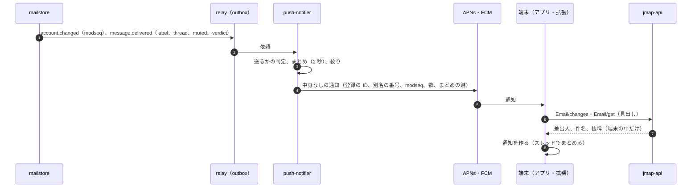

# Mobile and Push: Gmail

iOS と Android のアプリと、モバイルへのプッシュを決める。端末の中のオフラインの DB と JMAP の同期、同期の範囲、端末の保存の守り、プッシュの経路（`push-notifier` → APNs・FCM）、プッシュの中身（法務の L3）、通知のまとめと絞り、端末の登録と管理、通知からの操作を扱う。

前提となる決定は次のとおり。

- アプリは iOS（Swift）・Android（Kotlin）で、オフラインの DB と JMAP の同期の層を各 OS で持つ（[architecture/README.md](README.md) の 4 節）。API は JMAP とその拡張（[client-sync-and-protocols.md](client-sync-and-protocols.md)）
- モバイルのプッシュは「状態が変わった」だけを送り、中身（差出人、件名）を入れるかは法務の L3 の後に決める（[ADR-0006](../decisions/0006-sync-protocol-jmap-imap-and-modseq.md)）
- モバイルのプッシュの依頼（APNs・FCM への受け渡し）p95 5 秒（NFR-006）

この文書で決めたことは次の ADR にある。

| ADR | 決定 |
| --- | --- |
| [0045](../decisions/0045-push-payload-without-content.md) | APNs・FCM に送るプッシュの中身は、端末の登録の ID、アカウントの別名の番号、`modseq`、新しいメッセージの数、まとめの鍵だけにし、差出人・件名・本文・アドレスを入れない。iOS は `mutable-content` の通知を受けて Notification Service Extension が JMAP で見出しを取り、端末の中で通知を作る。Android は優先度の高いデータのメッセージを受けて、アプリが取って通知を作る。取れなかったときは「新しいメールがあります」だけを出す。中身を入れる形（端末の鍵で暗号化した中身）は法務の L3・L5 の後に足せる枠だけを持つ |
| [0046](../decisions/0046-mobile-offline-scope-and-device-management.md) | アプリの手元の DB は SQLite で、受信箱と利用者が開いたラベルの直近 30 日の見出し、受信箱の直近 7 日の本文を持ち、添付は開いたときだけ取る。DB は OS の保護（iOS の Data Protection、Android の暗号化）に加え、端末の鍵（Keychain・Keystore）で暗号化する。端末は `<Brand>Device` で登録し、利用者と組織の管理者が遠くからサインアウトと手元の消去を命じられる（次の接続で当てる） |

## 1. 範囲

- 扱う：
  - アプリの手元の DB、同期の範囲、オフラインの操作（Web と同じ待ち行列の形）
  - 端末の保存の暗号化、サインアウトと消去
  - `push-notifier` の流れ、通知を送るかの判定、まとめ、絞り
  - APNs・FCM に送る中身（法務の L3・L5）、iOS と Android の通知の作り方
  - 端末の登録（`<Brand>Device`）、トークンの更新と無効、端末の一覧と遠くからの消去
  - 通知からの操作（既読、アーカイブ、返信）
- 扱わない：
  - 同期のプロトコルそのもの（[client-sync-and-protocols.md](client-sync-and-protocols.md)）
  - HTML の描画の規則（[web-client.md](web-client.md) の 7 節。アプリも同じ `html-render` の結果を WebView の隔離した形で出す）
  - アプリの配布と段階のリリース（delivery.md）、サインイン（accounts-and-security.md）、MDM との連携（MVP の後）

## 2. 要件

| 要件 | 値 | 出どころ |
| --- | --- | --- |
| プッシュの速さ | 変更から APNs・FCM への受け渡し p95 5 秒 | NFR-006 |
| 収束 | プッシュを落としても、次の同期でサーバーと一致する | NFR-006、[quality.md](../quality.md) の 2.2.1 節 E |
| 中身を外へ出さない | 法務の L3 の結論まで、APNs・FCM（国外の事業者）に中身・アドレスを送らない | 法務の L3・L5 |
| 分離 | 他のアカウントの通知が届かない。共有の端末で前のアカウントの通知が出ない | NFR-010、[quality.md](../quality.md) の 2.2.1 節 G |
| 規模 | S1 でモバイルの端末 150 万 | [architecture/README.md](README.md) の 2 節 |

## 3. 外部の仕組みと本家の形

| 項目 | 事実 | この設計 |
| --- | --- | --- |
| APNs の中身の大きさ | 通常の通知は 4 KB まで。`mutable-content` で Notification Service Extension が表示の前に中身を変えられる。`apns-collapse-id` で同じ鍵の通知を置き換える。`thread-id` で通知をまとめる（Apple の開発者の文書。原文をこの設計の時点で確かめられなかった：**未検証**） | 6 節。着手の前に確かめる |
| FCM | データのメッセージと通知のメッセージ、優先度（高・通常）、`collapse_key`、中身 4 KB まで（Firebase の文書。同じく**未検証**） | 6 節 |
| 本家のプッシュの中身・経路 | 公式の資料で確かめられなかった（**未検証**） | 中身を入れない（ADR-0045） |

## 4. 手元の DB と同期（ADR-0046）

### 4.1 同期の範囲

| 置き場所 | 範囲 |
| --- | --- |
| 箱 | 全部 |
| 見出し | 受信箱と、利用者が直近 30 日に開いたラベルの、直近 30 日。スター付きは 90 日 |
| 本文 | 受信箱の直近 7 日と、開いたメッセージ（合計 500 MB まで、古いものから捨てる） |
| 添付 | 開いたときだけ取り、7 日で捨てる |
| 範囲の外 | 開いたときにサーバーから取る（オフラインでは「オフラインでは表示できない」） |

- 同期の手順は Web と同じ（`*/changes`、待ち行列、載せ直し。[web-client.md](web-client.md) の 5 節、[ADR-0043](../decisions/0043-web-offline-cache-and-optimistic-updates.md)）。共通の部分は、仕様（状態の機械と性質）を共有し、各 OS で実装する。
- 背景での同期：プッシュを受けたとき（6 節）と、OS の背景の更新の機会に `*/changes` を取る。前面に戻ったときは必ず取る。

### 4.2 端末の保存の守り

- DB（SQLite）は、OS の保護（iOS の Data Protection の「初回のロックの解除の後」の区分、Android のファイルの暗号化）に加え、端末で作った 256 ビットの鍵で暗号化する。鍵は iOS の Keychain（その端末だけ）、Android の Keystore に置く。
- Notification Service Extension（iOS）が DB を読むため、DB と鍵をアプリと拡張の共有の置き場所に置く（同じ区分）。
- サインアウト、アカウントの削除、遠くからの消去で、DB と鍵とファイルを消す。

## 5. 端末の登録と管理（ADR-0046）

- アプリは拡張の `<Brand>Device/set` で登録する（[client-sync-and-protocols.md](client-sync-and-protocols.md) の 6.5 節）。JMAP の `PushSubscription`（RFC 8620 の 7.2 節）は Web のプッシュの形なので、APNs・FCM には拡張を使う。

| 性質 | 中身 |
| --- | --- |
| `id` | 端末の登録の ID（UUIDv7） |
| `platform` | `apns`・`fcm` |
| `token` | APNs・FCM のトークン（サーバーでは暗号化して持つ） |
| `appVersion`、`osVersion`、`model` | 表示と相互運用の調べ |
| `notify` | `all`・`important`・`none` |
| `quietHours` | 通知を止める時間帯（アカウントの時間帯） |
| `accountsOnDevice` | 同じ端末にサインインしているアカウントの番号の表（中身なし） |

- 1 アカウント 20 端末まで。超えたら最も古いものを外す。
- APNs の `410 Unregistered`、FCM の `UNREGISTERED` を受けたら登録を消す。トークンが変わったら、アプリが `<Brand>Device/set` で更新する。90 日つながらない端末の登録は消す。
- 端末の一覧を Web の設定に出し、利用者は端末ごとに「サインアウトとデータの消去」を命じられる。組織の管理者も、組織のアカウントの端末に命じられる（organizations-domains-and-routing.md）。命令は次の接続（JMAP の要求か、プッシュで起こした同期）で当て、アプリが消去を終えたら知らせる。届かない端末は、セッションを無効にしてから消去を待つ（accounts-and-security.md）。

## 6. プッシュ（ADR-0045）

### 6.1 流れ



### 6.2 送るかの判定

新しいメッセージ m について、次の全部を満たすときだけ通知の対象にする。

| # | 条件 |
| --- | --- |
| 1 | m が配送で `INBOX` を得た（フィルターでアーカイブ・ゴミ箱・迷惑メールにしたものは除く） |
| 2 | m のスレッドがミュートでない（[mailbox-model-labels-and-threads.md](mailbox-model-labels-and-threads.md) の 5.3 節） |
| 3 | 端末の `notify` が `all`、または `important` で m が `IMPORTANT` を持つ |
| 4 | 端末の `quietHours` の外 |
| 5 | m が利用者自身の送信でない（`SENT` を持たない） |
| 6 | スヌーズから戻ったメッセージは、`notify` が `all` なら対象にする |

- 既読・アーカイブ・削除などの状態の変化は、通知ではなく、通知の取り下げ（iOS の背景の更新の合図、Android のデータのメッセージ）として送る。他の端末で読んだメールの通知が残らないようにする。取り下げは 1 分にまとめる。

### 6.3 中身

APNs の例（中身なし）：

```json
{
  "aps": {
    "alert": { "title-loc-key": "NEW_MAIL_TITLE", "loc-key": "NEW_MAIL_BODY" },
    "mutable-content": 1,
    "thread-id": "a3"
  },
  "d": "0191f6c0-...-device",
  "a": 3,
  "m": "1z141z3",
  "n": 2
}
```

- `d` は端末の登録の ID、`a` は端末の中のアカウントの番号（`accountsOnDevice` の表の番号。アカウントの ID もアドレスも送らない）、`m` は `modseq`、`n` は新しいメッセージの数。`thread-id` は、スレッドの ID のアカウントごとの HMAC の先頭 8 文字（同じスレッドを端末でまとめるため。他から推し量れない）。
- `alert` の文は端末の言語の決まった文（「新しいメールがあります」）で、拡張が取れなかったときにそのまま出る。
- Android（FCM）は優先度の高いデータのメッセージで、同じ `d`・`a`・`m`・`n` を送る。アプリが受けて取り、通知を作る。
- **入れないもの**：差出人の名前とアドレス、件名、抜粋、ラベルの名前、アカウントのアドレス。法務の L3（外国にある第三者への提供）・L5（データの所在）の結論まで、APNs・FCM に渡さない。
- **後で足せる枠**：L3・L5 の結論で中身を入れてよいとなったときは、端末の公開鍵で暗号化した中身（`e`）を足す。鍵は登録の時に端末が作って送る。それでも中身は APNs・FCM には読めない。MVP は `e` を送らない。

### 6.4 端末の中で通知を作る

- iOS：Notification Service Extension が `a` と `m` を受け、Keychain のセッションで JMAP の `Email/changes`（`m` まで）と `Email/get`（見出しだけ、新しいもの最大 5 通）を取り、差出人・件名・抜粋で通知の文を作り直す。拡張の時間の上限（OS の決まり）の中で取れなければ、決まった文のまま出す。
- Android：アプリの受け手が同じことを行い、通知をスレッドごとのグループにまとめる。
- 端末に複数のアカウントがあれば、`a` で選び、通知にアカウントの名前（端末の中の表示の名前）を出す。
- サインアウトした端末に古いトークンで届いた通知は、`d` と `a` が端末の表にないので捨て、何も出さない。

### 6.5 まとめと絞り

- 同じ端末への通知は 2 秒まとめる（組織の全員へのメールと返信が同時に届くとき）。まとめた数を `n` に入れる。
- `apns-collapse-id`・`collapse_key` に `a` とスレッドの HMAC を入れ、同じスレッドの通知を置き換える。
- 1 端末に 1 分 30 通を超えたら、以後 10 分は 1 分 1 通の「新しいメールが n 通あります」にする。
- APNs・FCM の応答の 429・503 は後退して再送し、5 分を超えたら捨てる（次の同期で収束する）。

### 6.6 通知からの操作

- 通知の操作（既読にする、アーカイブ、返信）は、拡張・アプリが JMAP で `Email/set`（差分）・`EmailSubmission/set` を送る。オフラインなら待ち行列に入れる。
- 返信の文は端末の中で作り、JMAP で送る（元に戻す送信の窓はサーバーが足す）。

## 7. Web のプッシュ

- ブラウザーの通知（Web Push）は、JMAP の `PushSubscription`（RFC 8620 の 7.2 節）で登録し、中身は 6.3 節と同じく状態の合図だけ。Service Worker が受けて JMAP で見出しを取り、通知を作る。Web Push の配送の事業者（ブラウザーの会社）も国外にありうるので、同じ規則にする（法務の L5）。

## 8. 失敗と回復

| 事象 | 影響 | 扱い |
| --- | --- | --- |
| APNs・FCM の障害 | 通知が遅れる・届かない | 後退して再送、5 分で捨てる。アプリは前面に戻ったときに追いつく |
| 拡張が時間の中で取れない | 決まった文の通知 | そのまま出す。取れなかった率を見張る |
| トークンの無効 | 通知が届かない | 登録を消す。アプリは次の起動で登録し直す |
| `push-notifier` の遅れ | NFR-006 のプッシュの p95 5 秒を外す | relay の遅れとともに監視。通知の依頼は 10 分を過ぎたら捨てる（古い通知を出さない） |
| 共有の端末でアカウントを替えた | 前のアカウントの通知 | 端末の表で捨てる（6.4 節）。サインアウトで登録を消す |
| 遠くからの消去が届かない | 端末にデータが残る | セッションを無効にし、管理の画面に「未完了」を出す |

## 9. 上限

| 対象 | 値 | 持ち場所 |
| --- | --- | --- |
| 端末 | 20／アカウント | ADR-0046 |
| 見出しの範囲 | 30 日（スター 90 日） | ADR-0046 |
| 本文の範囲 | 受信箱の 7 日、500 MB | ADR-0046 |
| 通知のまとめ | 2 秒 | ADR-0045 |
| 通知の絞り | 1 分 30 通を超えたら 10 分は 1 分 1 通 | ADR-0045 |
| 通知の依頼の期限 | 10 分 | ADR-0045 |
| つながらない端末の登録 | 90 日で消す | ADR-0046 |

## 10. data-model への項目

| 置き場所 | 中身 | 鍵・索引 | 節 |
| --- | --- | --- | --- |
| メールボックスのシャード `devices` | `device_id`、`platform`、`token_enc`、`app_version`、`os_version`、`model`、`notify`、`quiet_hours`、`account_slot`（端末の中の番号）、`public_key`（後の枠）、`last_seen_at`、`wipe_requested_at`、`wipe_done_at` | 主キー `(tenant_id, account_id, device_id)` | 5 |
| Valkey `pushq:{device_id}` | まとめの中の数と最後の `modseq` | 2 秒 | 6.5 |
| Valkey `pushrate:{device_id}` | 1 分の数 | 10 分 | 6.5 |
| outbox の種類 | `message.delivered` に足す項目：`inbox`、`important`、`muted`、`thread_id` | — | 6.2 |
| 端末の中 | SQLite（暗号化）、Keychain・Keystore の鍵 | 端末の中だけ | 4 |

## 11. テストと性質

| ID | 性質・試験 |
| --- | --- |
| PROP-PUSH-001 | 任意の配送とプッシュの落としの列で、アプリの模型が次の同期でサーバーと一致する |
| PROP-PUSH-002 | APNs・FCM に送る値は、決めた項目（`d`、`a`、`m`、`n`、`thread-id` の HMAC、決まった文の鍵）だけ（送る値の型の検査。[quality.md](../quality.md) の 2.2.1 節 G のプッシュの経路） |
| PROP-PUSH-003 | 2 つのアカウントが同じ端末にあるとき、A の通知の取得は A のセッションでだけ行われ、B の中身が A の通知に出ない |
| DT-PUSH-001 | 6.2 節の送るかの判定の全行（受信箱、ミュート、`notify`、静かな時間、自分の送信、スヌーズ） |
| E2E | XCUITest・Espresso：通知の受け取り、拡張での通知の作り直し、通知からの既読・返信、オフラインの操作、遠くからの消去 |
| 負荷 | 150 万端末で、組織の全員（1 万人）へのメールの通知の波を NFR-006 の p95 5 秒の中で送る |

## 12. Story の候補

| Epic | Story | 中身 |
| --- | --- | --- |
| E8 | `mobile-push-pipeline` | `push-notifier`、判定、まとめ、絞り、APNs・FCM（6 節）。本文の中身は法務：L3・L5 |
| E16 | `mobile-sync-core` | 手元の DB、範囲、待ち行列、暗号化（4 節） |
| E16 | `mobile-device-registration` | `<Brand>Device`、トークン、遠くからの消去（5 節） |
| E16 | `mobile-notifications` | 拡張・受け手での通知の作り直し、通知からの操作（6.4・6.6 節） |
| E16 | `mobile-inbox-and-compose` | 受信箱、スレッド、作成 |
| E16 | `mobile-analytics` | アプリの計測。法務：L8 |

## 13. 未解決の問い

### 決定（2026-10-10、既定案）

- **プッシュの中身**：入れない。端末で取って通知を作る（ADR-0045）。
- **同期の範囲**：見出し 30 日、本文 7 日、添付は開いたとき（ADR-0046）。
- **端末の保存**：OS の保護に加え、端末の鍵で暗号化（ADR-0046）。
- **遠くからの消去**：利用者と組織の管理者が命じられる。次の接続で当てる（ADR-0046）。

### 持ち越し

| 問い | いつ・どう決めるか |
| --- | --- |
| プッシュに中身（暗号化したもの）を入れるか | 法務の確認待ち（L3・L5） |
| アプリの計測 | 法務の確認待ち（L8） |
| MDM との連携、組織の端末の方針（画面の写しの禁止など） | MVP の後（organizations-domains-and-routing.md） |
| APNs・FCM の大きさの上限と、拡張の時間の上限 | 着手の前に Apple・Google の公式の文書で確かめる（**未検証**） |

## 出典

- [RFC 8620](https://www.rfc-editor.org/rfc/rfc8620) の 7.2 節（`PushSubscription`）
- [RFC 8030](https://www.rfc-editor.org/rfc/rfc8030)（Web Push）、[RFC 8291](https://www.rfc-editor.org/rfc/rfc8291)（Web Push の暗号化）
- Apple Developer, [Generating a remote notification](https://developer.apple.com/documentation/usernotifications/generating-a-remote-notification)（2026-10-10 に開いたが本文を読めなかった。**未検証**）
- Firebase, Cloud Messaging の文書（**未検証**）
