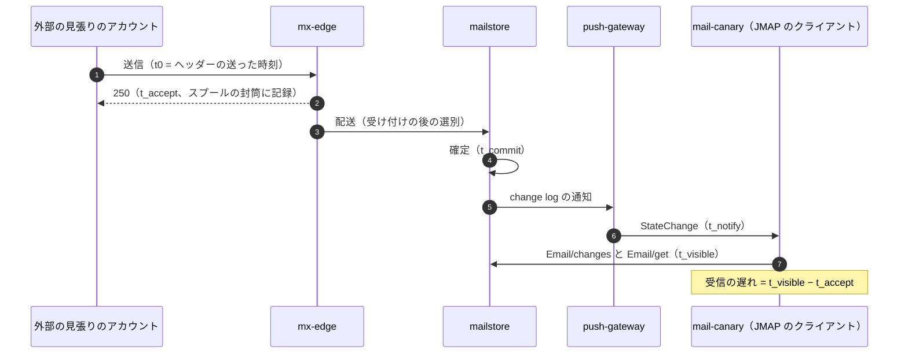

# Observability: Gmail

観測を決める。計装の規則（利用者の中身を含めない）、見張りのメール（外部の見張りのアカウントとの送受）、runbooks の SLI の計測（受け付けから受信箱まで、送信の遅れ、受け付けたメールの欠け、到達、同期、検索）、到達性のダッシュボード（ブロックリスト、苦情の率、相手の応答）、選別の誤り（誤判定・見逃し）の監視、アラート、ログの保持とアクセス、観測の部品の障害を扱う。

前提となる決定は次のとおり。

- SLO の値とアラートの一覧の正本は [runbooks/README.md](../runbooks/README.md)。この文書は計測とアラートの条件の実装を書く
- 中身（C3）をログ・指標・トレースの属性に出さない。ID・ドメイン・数・理由のコードだけ。宛先と差出人のドメインも集計の外のログに書かない（`AGENTS.md`、[ADR-0008](../decisions/0008-spam-pipeline-boundary-and-secrecy.md)）
- 見張りのメールは別の AWS アカウントの `mail-canary` が、外部の見張りのアカウントと 1 分ごとに送り合う（[quality.md](../quality.md) の 2.2.1 節 K）
- 観測の道具は OpenTelemetry → CloudWatch・AMP・Managed Grafana（[architecture/README.md](README.md) の 4 節）

この文書で決めたことは次の ADR にある。

| ADR | 決定 |
| --- | --- |
| [0066](../decisions/0066-sli-measurement-and-mail-canary.md) | 受信・送信・同期・検索の新しさの SLI は、見張りのメール（受信・送信・転送・中の送信の 4 つの経路、1 分ごと、経路ごとの番号）で端から端まで測り、正とする。部品の時刻の記録（受け付け、確定、通知）は全メッセージで測り、原因の切り分けとアラートの早い兆しに使う。見張りのアカウントの要求は、要求の数で数える SLI（可用性）から除く。番号の欠けが 1 時間続いたら SEV1 の候補にする |
| [0067](../decisions/0067-content-free-telemetry-schema.md) | 計装の属性は、型で決めた許可の一覧（ID、理由のコード、数、大きさの段、層、プール、事業者の群）だけを出せる。メールアドレス、件名、本文、検索の語、URL のパス、添付の名前の型は、ログ・指標・トレースの属性の関数に渡すとコンパイルで失敗させる。ドメインは集計の指標でだけ、上位 50 と「その他」に丸めて出す。毎日のログの走査で C3 の検出 0 を確かめる |

## 1. 範囲

- 扱う：
  - 計装の規則と属性の許可の一覧、名前と次元、トレース
  - 見張りのメール（`mail-canary`）の仕組み
  - runbooks の 1 節の SLI ごとの計測の点と式
  - 到達性のダッシュボード、選別の誤りの監視、同期と検索の観測
  - アラートの条件（バーンレート）と手順への結び付き
  - ログの保持とアクセス、観測の部品の障害
- 扱わない：
  - SLO の値、アラートの一覧、手順の中身（[runbooks/README.md](../runbooks/README.md)）
  - 品質の判定基準（[quality.md](../quality.md) の 4 節）
  - 監査ログ（[security.md](security.md) の 8 節）

## 2. 計装の規則（ADR-0067）

### 2.1 中身を出さない

| 型（Rust・TypeScript） | 区分 | 属性に出せるか |
| --- | --- | --- |
| `AccountId`、`TenantId`、`MessageId`、`SpoolId`、`SubmissionId`、`ThreadId`、`BlobId` | ID | 出せる（ログとトレース。指標の次元には出さない） |
| `ReasonCode`、`VerdictCode`、`SmtpReplyCode` | 理由 | 出せる |
| `Tier`（接続の層）、`Pool`、`ProviderGroup`、`SizeBucket`、`FilterVersion`、`Region`、`Az` | 分類 | 出せる（指標の次元を含む） |
| `Domain` | C1 | 集計の指標でだけ。上位 50 と `other` に丸める（2.2 節）。ログに出さない |
| `IpAddr` | C1 | ログに出せる（受信の評判の調べ）。指標の次元には `/24`・ASN に丸めて、上位 50 だけ |
| `EmailAddress`、`LocalPart`、`Subject`、`MessageContent`、`SearchQuery`、`UrlPath`、`AttachmentName`、`DisplayName` | C3 | **出せない** |

- 計装の関数（`log_event`、`span.set_attribute`、`metric.record`）は `TelemetryAttr` の型だけを受け、C3 の型は `TelemetryAttr` を実装しない。Rust はトレイトの境界で、TypeScript はブランドの型と lint（`no-restricted-syntax`）で、渡すとビルドが失敗する。
- エラーの報告（パニックの文、例外の文）は、文字列を組み立てる前に型で包み、`Display` に C3 を含めない。解析の誤りの報告は、位置（バイトの位置）と理由のコードだけ。
- 宛先と差出人を示す必要のあるログ（配送の記録）は、アドレスのテナントの鍵の HMAC（`addr_hmac`）を使う（[security.md](security.md) の 7.3 節）。

### 2.2 指標の名前と次元

- 名前は `mail_<部品>_<量>_<単位>`（例：`mail_mx_data_end_seconds`、`mail_delivery_accept_to_commit_seconds`）。
- 次元の上限：1 つの指標の系列は 1 万まで。`Domain` と `ProviderGroup` は上位 50 と `other`。上位の一覧は日ごとに作り直し、「その日の量の上位」で決める（特定の利用者の相手を指さないよう、受け手の数が 100 以上のドメインだけを上位に入れる）。
- アカウント・テナントの ID を指標の次元にしない（系列が爆発し、特定の利用者の振る舞いが見える）。アカウントごとの調べはログと、ID で引く道具（[security.md](security.md) の 7.2 節）で行う。

### 2.3 トレース

- 抜き取りは、普通の要求 1%、誤り（5xx、451、例外）と遅いもの（p99 を超えたもの）は全部。受信の配送は `spool_id` を根にしたトレースで、`mx-edge` → `inbound-pipeline` → `spam-scorer` → `mailstore` → `relay` → `push-gateway` を繋ぐ（SQS をまたぐ文脈はメッセージの属性で渡す）。
- 属性は 2.1 節の許可の一覧だけ。

### 2.4 ログの走査

- 毎日、ログの抜き取り（各群 10 万行）を C3 の検出器（メールアドレスの形、長い日本語の連なり、件名の形）で走査し、群と部品ごとの件数だけを数える（[quality.md](../quality.md) の 4.2 節）。1 件でも `content-in-logs.md` の手順（[runbooks/README.md](../runbooks/README.md) の 4 節）。
- 検出器の誤検出（見張りのメールの決まった件名、システムのアドレス `postmaster@` など）は、許可の形の一覧で除く。一覧の変更は QA の承認。

## 3. 見張りのメール（ADR-0066）

### 3.1 アカウントと経路

| 経路 | 送り手 | 受け手 | 頻度 | 測るもの |
| --- | --- | --- | --- | --- |
| `inbound` | 外部の見張りのアカウント（他社のメールのサービスの試験のアカウント、事業者ごと） | 本システムの見張りのアカウント（個人と組織） | 1 分ごと × 事業者 | 受け付けから受信箱、迷惑メールの箱か、認証の結果、欠け |
| `outbound` | 本システムの見張りのアカウント（プールごと：`personal`・`org-a`・`org-b`・`forward`・`system`） | 外部の見張りのアカウント | 1 分ごと × プール × 事業者 | 窓の後から外部の MX への最初の試行、外部の受信箱・迷惑メールの箱・不達 |
| `forward` | 外部 → 本システムの転送を設定したアカウント | 外部の見張りのアカウント | 5 分ごと | SRS・ARC を経た到達 |
| `internal` | 本システムの見張りのアカウント | 本システムの別の見張りのアカウント（別のシャード） | 1 分ごと | 中の送信の受信箱まで |

- 外部の見張りのアカウントは、主な事業者（国内の携帯の事業者のメール、主な無料のメールのサービス、主な組織のメールのサービス）に人が作る。作り方と利用の条件（各事業者の利用規約）は Ops が確かめる（**未検証**）。読み出しは各事業者の IMAP（OAuth）か API で、資格は `mail-canary` の Secrets Manager に置く。
- 送る量は小さく保つ（事業者ごとに 1 分 1 通、1 日 1,440 通）。外部の事業者に負荷や迷惑をかけない（[quality.md](../quality.md) の 2.4 節）。

### 3.2 見張りのメールの形

- 件名と本文は `mail-canary` が作る決まった文と乱数（本システムの利用者の中身ではない）。
- ヘッダー `X-<Brand>-Canary: v=1; f=<経路>; s=<番号>; t=<送った時刻>; h=<HMAC>`。HMAC は見張りの鍵で、偽の見張りのメールを見分ける。
- 番号は経路 × 送り手 × 受け手ごとに 1 ずつ増やす。`mail-canary` は送った番号と届いた番号を、自分のアカウントの S3 の日ごとの表（Parquet）と、直近 2 時間の手元の表で照らす。

### 3.3 時刻の測り方

- **受け付けから受信箱**（NFR-001）：`t_visible − t_accept`。`t_accept` は `mx-edge` が `Received` と前置きに書く時刻（本システムの時計）で、`mail-canary` は前置きから読む。`t_visible` は `mail-canary` の JMAP のクライアントが `Email/get` で見た時刻。時計は両方とも Amazon Time Sync（誤差は無視できると見込む、**未検証**）。
- **迷惑メールの箱か**：`mailboxIds` に役 `junk` があるか。見張りのメールが迷惑メールの箱に入ったら、選別の誤判定として数える（[quality.md](../quality.md) の 4.1 節）。
- **送信の遅れ**（NFR-002）：`mail-canary` が `EmailSubmission/set` を出した時刻 ＋ 窓 → `mta-out` が外部の MX へ最初の `MAIL FROM` を送った時刻（`mta-out` が `submission_id` ごとに記録し、`mail-canary` は `mail-prod` の指標の API から読む）。外部の受信箱の到達は、外部の見張りのアカウントの読み出しで確かめる。
- 全メッセージでの補い：`mailstore` は配送ごとに `t_commit − t_accept` を `mail_delivery_accept_to_commit_seconds` に、`push-gateway` は `t_notify − t_commit` を `mail_sync_commit_to_notify_seconds` に記録する。SLO は見張りの値で判定し、全メッセージの値はアラートの早い兆しと原因の切り分けに使う。

### 3.4 欠けの検出

- 経路ごとに、送った番号の集合と届いた番号の集合を照らす。届かない番号を、送った後 15 分で「遅れ」、1 時間で「欠け」とする。
- `inbound` の欠けが 1 時間で 1 件でもあれば、page（SEV1 の候補。[runbooks/README.md](../runbooks/README.md) の 1 節の「受け付けたメールの欠け」）。外部の事業者の側で送れなかった（外部の事業者の送信の誤り）ものは、外部の見張りのアカウントの送信の記録で除く。
- スプールと配送の突き合わせ（毎時、[quality.md](../quality.md) の 4.2 節）は `inbound-smtp` の掃除の役の数え（`spool-done` のない 1 時間を超えたスプール）を指標 `mail_spool_unfinished_over_1h` にする。

## 4. SLI の計測（ADR-0066）

[runbooks/README.md](../runbooks/README.md) の 1 節の SLI ごとに、計測の点と式を決める。

| SLI | 計測の点 | 式（良いイベント ÷ すべて） | 除くもの |
| --- | --- | --- | --- |
| MX の受け付けの可用性 | `mail-canary` の SMTP の探り（東京と大阪から、`mx1`・`mx2` へ 1 分ごと、`RCPT` まで進めて `RSET`、5 分ごとに `DATA` まで） | 220 と 250 まで通った探り ÷ すべての探り。東京と大阪の MX の「どちらかが通った」で数える | 探りの側の失敗（探りの台の健全性で除く） |
| SMTP の応答 | `mx-edge` の `mail_mx_data_end_seconds`（大きさの段 `≤1MiB`・`≤50MiB`） | 1 MiB までで 2 秒以内 ÷ 1 MiB までのすべて | 拒んだもの（5xx） |
| 受信の遅れ | 見張り（3.3 節） | 分位（p50・p95・p99） | — |
| 受け付けたメールの欠け | 見張りの欠け（3.4 節）、`mail_spool_unfinished_over_1h` | 0 | — |
| 送信の受け付け | `jmap-api`・`submission` の送信の依頼の結果 | 5xx・時間切れでない ÷ すべて | 上限の超過（`rejected_limit`）、見張りのアカウント |
| 送信の遅れ | 見張り（3.3 節） | 分位 | — |
| 送信の到達 | 見張りの `outbound` の外部の受信箱 | 受信箱 ÷ 送ったすべて（事業者ごと） | — |
| Web・JMAP・IMAP の可用性 | ALB の 5xx、`jmap-api`・`imap-server` の応答（IMAP は `BAD`・`NO [UNAVAILABLE]`・切断） | 5xx・時間切れでない ÷ すべて | 429・`NO [LIMIT]`、見張りのアカウント |
| 同期の通知 | 見張り（`t_notify − t_commit` を見張りのアカウントで）と全メッセージの `mail_sync_commit_to_notify_seconds` | 分位（SLO は見張り） | — |
| 検索 | `search-node` の `mail_search_seconds`（`temp=hot`・`cold`） | `hot` で 1 秒以内 ÷ `hot` のすべて | 予算で止めた重い検索（理由のコード `budget`） |
| 検索の新しさ | 見張り：届いた見張りのメールの乱数の語を 10 秒ごとに検索し、出るまで | 分位 | — |
| 選別の報告の率 | `mailstore` の報告の出来事（`report_spam`）と受信箱への配送 | 報告 ÷ 受信箱への配送（日ごと） | 見張りのアカウント |
| 選別の誤判定の代わり | `report_not_spam`、隔離の解除 | ÷ 迷惑メールの箱・隔離への配送 | 同上 |
| 分離 | 応答の監査（[ADR-0007](../decisions/0007-tenancy-accounts-orgs-and-rls.md)） | 不一致 0 | — |
| 後方散乱 | `mta-out` の DSN の送信のうち `mail_from_verified=false` | 0 | — |
| blob の突き合わせ | 毎週の目録と S3 Inventory の突き合わせ | 0 | — |

- SLO の窓は 30 日の移動の窓。エラーバジェットの残りは Grafana に出し、デプロイの前に [delivery.md](delivery.md) の関門が読む。

## 5. 到達性のダッシュボード

| パネル | 中身 | 頻度 | 出どころ |
| --- | --- | --- | --- |
| ブロックリスト | 送信のプールの IP（IPv4 は /24、IPv6 は /64）と受信の IP の、主なブロックリストへの掲載の有無と時間 | 5 分 | `blocklist-monitor`（[runbooks/README.md](../runbooks/README.md) の 5.1 節） |
| 外部の受信箱への到達 | 見張りの `outbound` の受信箱・迷惑メールの箱・不達を、プール × 事業者の群で | 1 分 | 3 節 |
| 苦情の率 | フィードバックループの報告 ÷ 送信（プール × 事業者の群、日ごと）。0.1% の線（NFR-012） | 5 分 | `report-ingest`（[ADR-0020](../decisions/0020-bounces-dsn-srs-and-feedback-loops.md)） |
| 相手の応答 | 宛先の事業者の群ごとの 4xx・5xx の率と、評判を示す応答の理由のコード | 1 分 | `mta-out` |
| ウォームアップ | IP ごとの段、関門の指標 | 1 時間 | [ADR-0018](../decisions/0018-outbound-ip-pools-and-warmup.md) |
| TLS-RPT と DMARC | 送信の TLS の失敗の率（相手からの報告）、本システムのドメインの揃いの率 | 毎日 | [sender-authentication.md](sender-authentication.md) の 8 節 |
| 乗っ取りの疑い | 送信の点の帯ごとのアカウントの数、`held` の数、`locked` の数 | 5 分 | [ADR-0021](../decisions/0021-sending-limits-and-compromised-account-detection.md)、[ADR-0057](../decisions/0057-account-takeover-response.md) |

- 事業者の群（`ProviderGroup`）は、宛先の MX の名前から作る決まった一覧（主な事業者 20 と `other`）。個々の宛先のドメインは出さない。
- このダッシュボードは Ops と到達性の担当が見る。組織の管理者向けの「あなたの組織の送信の評判」の画面は MVP の後（[intent.md](../intent.md) の延期の機能）。

## 6. 選別の誤りの監視

| 指標 | 意味 | 次元 | 見方 |
| --- | --- | --- | --- |
| 受信箱の報告の率 | 見逃しの代わり（FN） | `FilterVersion`、個人・組織、言語（本文の言語の分類器の出力。C2） | 0.05% 以下（NFR-008） |
| 迷惑メールではないの率 | 誤判定の代わり（FP） | 同上、理由のコード | 前の 7 日の平均の 1.5 倍以内（NFR-009） |
| 隔離の解除の率 | 組織の誤判定の代わり | `FilterVersion`、理由のコード | 同上 |
| 影の判定の食い違い | 新しい `filter_version` と今のバージョンの判定の違いの率、違ったメッセージへの報告の率 | 新旧のバージョン | 段を進める判断（[delivery.md](delivery.md) の 6 節） |
| 評価の集まりの結果 | 種類ごとの捕捉と誤判定（95% の上限） | `FilterVersion` | 毎日（[quality.md](../quality.md) の 2.2.1 節 H） |
| 見張りの迷惑メールの箱 | 見張りの `inbound` が迷惑メールの箱に入った数 | 事業者 | 0 |
| やりとりのある相手からの誤判定 | 連絡先・やりとりのある相手からのメールの `report_not_spam` | `FilterVersion` | NFR-009 の 0.005% の兆し |

- 報告の数は利用者の行動で遅れて出る（届いて数時間〜数日）。段を進める判断は、届いてから 24 時間の報告で比べる（[spam-and-abuse-filtering.md](spam-and-abuse-filtering.md) の 12.2 節）。
- 迷惑メールの波の検知：受信の申し出の率（層ごと）、新しい指紋の群の急増、SMTP の時点の拒否の率を 1 分ごとに見る（[spam-wave.md](../runbooks/spam-wave.md)）。

## 7. 同期と検索

- 同期：`mail_sync_commit_to_notify_seconds`（全メッセージ）、`relay` の outbox の遅れ、`push-gateway` の接続の数、IMAP の接続の数と `NO [LIMIT]` の率、JMAP の `cannotCalculateChanges` の率、`epoch` の進み（切り替えの後）。同期の抜き取りの照合（[quality.md](../quality.md) の 4.2 節）の不一致の数。
- 検索：`mail_search_seconds`（`hot`・`cold`）、`search-node` の `applied_modseq` の遅れ（change log の追いつき）、索引の作成の遅れ（outbox からセグメントまで）、予算で止めた検索の率、NVMe の使用。

## 8. アラート

- バーンレートは Google の SRE の多窓の形：1 時間で 14.4 倍かつ 5 分で 14.4 倍 → page、6 時間で 6 倍かつ 30 分で 6 倍 → page、3 日で 1 倍 → チケット（[runbooks/README.md](../runbooks/README.md) の 1 節）。
- 分位の SLO（受信の遅れ、送信の遅れ、同期、検索）は、runbooks の「外れたときの扱い」の条件をそのまま AMP の規則にする（例：受信の遅れの p95 が 60 秒を 5 分超え → page）。
- 早い兆し（page しない、チケット）：全メッセージの `mail_delivery_accept_to_commit_seconds` の p95 が 10 秒を 10 分、配送の待ち行列（`inbound-delivery`）の最も古いメッセージが 30 秒、`inbound-delivery-low` が 2 時間（[capacity.md](capacity.md) の 2 節）。
- すべてのアラートは手順の URL を注釈に持つ（CI で検査。[runbooks/README.md](../runbooks/README.md) の 4 節）。
- 本システムの指標の外のアラート：KMS の呼び出しの急増（[ADR-0060](../decisions/0060-key-hierarchy-and-crypto-erasure.md)）、監査ログの写しの遅れ（[security.md](security.md) の 8 節）、BYOIP の範囲の広告の状態（[infrastructure.md](infrastructure.md) の 10 節）。

## 9. ログの保持とアクセス

| 種類 | 置き場所 | 保持 | 読める人 |
| --- | --- | --- | --- |
| 部品のログ | CloudWatch Logs（`mail-prod`） | 30 日（法務の L1・L6 で見直す） | Ops、Dev の当番 |
| 配送の記録（`delivery_id`、受け手の `account_id`、結果のコード） | 受け手のメールボックスのシャードの分割の表（[data-model/inbound-spool-and-delivery.md](data-model/inbound-spool-and-delivery.md) の 3 節） | 90 日 | サポートの道具（[security.md](security.md) の 7.2 節） |
| 指標 | AMP | 15 か月（集計） | Ops、Dev、PM |
| トレース | X-Ray か AMP の Tempo の互換（選定は E1） | 7 日 | Ops、Dev の当番 |
| 見張りの記録 | `mail-canary` の S3 | 1 年 | Ops、QA |

- ログの群ごとに KMS の鍵で暗号化し、`mail-prod` の外へ写さない（データの所在。法務の L5）。

## 10. 観測の部品の障害

- **デッドマンスイッチ**：`mail-canary` は自分の送受とは別に、AMP への書き込みの心拍を 1 分ごとに出し、`mail-audit` のアカウントの CloudWatch で途切れを見る（AMP・Grafana の停止で全アラートが黙ることを防ぐ）。
- **循環の依存を避ける**：見張りのメールの読み出しは本システムの JMAP を使うが、アラートの送り先（オンコールの通知）は本システムのメールに頼らない（外部の呼び出しのサービスと SMS・電話）。
- 見張りのアカウント自身の障害（外部の事業者の側の不調）は、事業者ごとの探りの成功の率で分け、SLO から除く期間を記録する。

## 11. data-model への項目

[data-model.md](data-model.md) へ出した項目の記録。列・制約・置き場所の正本は data-model.md と [data-model/](data-model/) の各ファイル（2026-10-10 のデータモデルの工程から）。

| 置き場所 | 中身 | 節 |
| --- | --- | --- |
| `mail-canary` の S3 `canary/<経路>/<yyyy>/<mm>/<dd>.parquet` | 送った番号、時刻、受け手、届いた時刻、箱、認証の結果、各段の時刻 | 3 |
| メールボックスのシャード `delivery_log`（日の分割、90 日。2026-10-10 のデータモデルの工程で directory から移した） | `delivery_id`（`spool_id` か `submission_id`）、`account_id`、`tenant_id`、`result_code`、`t_accept`、`t_commit`、`addr_hmac`、`msgid_hmac` | 3.3、9 |
| directory `provider_groups` | MX の名前の形 → 事業者の群 | 5 |
| AMP の記録の規則 | 4 節の式、8 節のアラート | 4、8 |

## 12. テストと性質

| ID | 性質・試験 |
| --- | --- |
| PROP-OBS-001 | C3 の型の値を、計装の関数（ログ、属性、指標）に渡すコードがビルドを通らない（コンパイルの失敗の試験） |
| PROP-OBS-002 | 任意の見張りのメールの送受の列（欠け、遅れ、重複、順序の入れ替わり）で、欠けの検出は 1 時間を過ぎて届かない番号だけを欠けとし、重複を欠けと数えない |
| 試験 | ログの走査の検出器を、わざと C3 を入れたログで確かめる（検出 100%）。許可の形の一覧で見張りの件名を除けること |
| 試験 | 各アラートの規則を、合成の時系列で発火させる（バーンレートの両方の窓） |
| 試験 | 指標の系列の数の上限（1 万）を超える次元の組み合わせを CI で拒む |
| 訓練 | 観測の停止（AMP の書き込みを止める）で、デッドマンスイッチが呼び出す |

## 13. Story の候補

| Epic | Story | 中身 |
| --- | --- | --- |
| E1 | `observability-and-mail-canary` | 計装の規則と型、OpenTelemetry の経路、見張りのメールの骨格（2、3 節） |
| E1 | `telemetry-content-guard` | 属性の許可の一覧、ビルドの検査、ログの走査（2.1、2.4 節） |
| E2 | `inbound-sli` | 受け付けと SMTP の応答の計測、欠けの検出（3.4、4 節） |
| E7 | `deliverability-dashboard` | 5 節のダッシュボード |
| E6 | `filter-quality-monitoring` | 6 節の監視 |
| E17 | `slo-dashboards-alerts` | SLO の計算、アラートの規則、手順の注釈、デッドマンスイッチ（4、8、10 節） |

## 14. 未解決の問い

### 決定（2026-10-10、既定案）

- **SLI の正**：見張りのメールを正、全メッセージの部品の時刻を補いと兆しに使う（ADR-0066）。
- **見張りのアカウントの扱い**：要求の数の SLI から除き、遅れの SLI は見張りで測る。
- **中身を出さない**：型の許可の一覧とビルドの検査、ドメインは上位 50 に丸めて集計だけ（ADR-0067）。
- **アカウントの ID**：指標の次元にしない。

### 持ち越し

| 問い | いつ・どう決めるか |
| --- | --- |
| 外部の見張りのアカウントの作り方と、各事業者の利用規約 | E1 の前に Ops（**未検証**） |
| ログ・配送の記録の保持の期間 | **法務の確認待ち**（L1・L6） |
| トレースの置き場所の選定 | E1 |
| 見張りの時計の誤差の扱い | E1 の計測で確かめる（**未検証**） |
| 組織の管理者向けの送信の評判の画面 | MVP の後 |

## 出典

- Google, [The Site Reliability Workbook, Alerting on SLOs](https://sre.google/workbook/alerting-on-slos/)（多窓のバーンレート。2026-10-10 に確認）
- OpenTelemetry, [Semantic Conventions](https://opentelemetry.io/docs/specs/semconv/)（2026-10-10 に確認）
