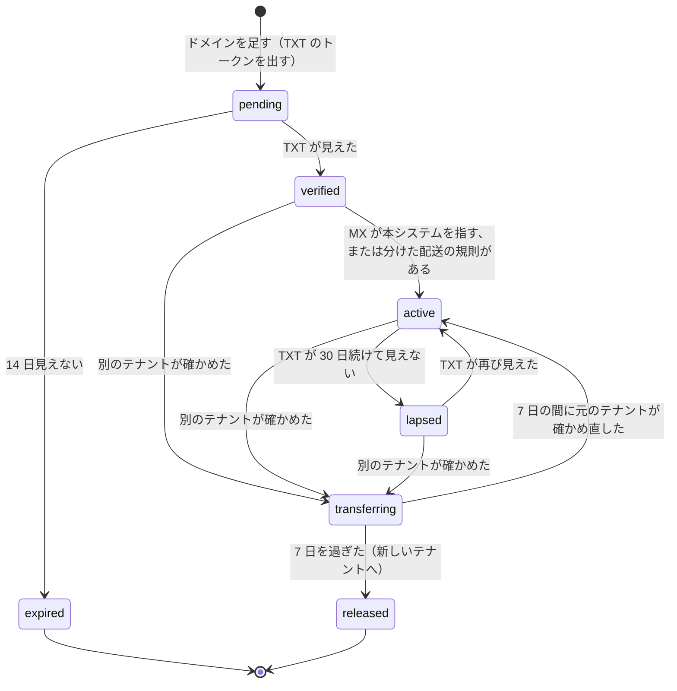
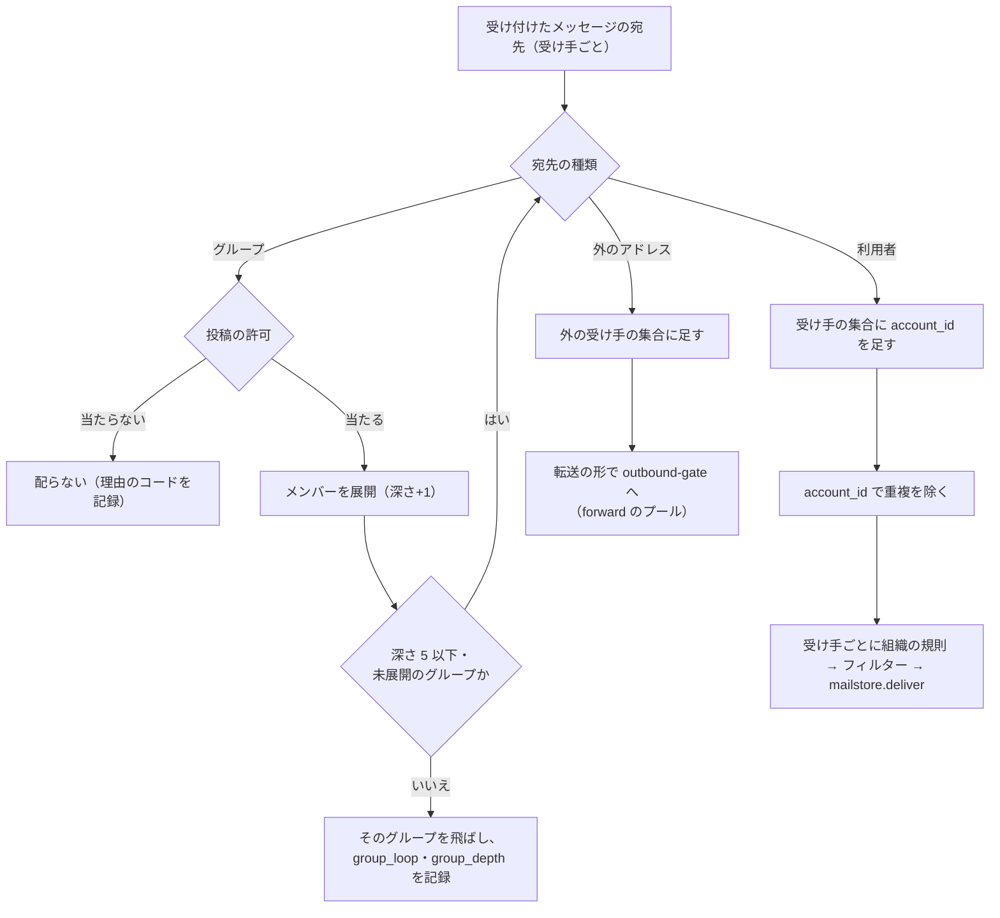

# Organizations, Domains and Routing: Gmail

組織の面を決める。組織と組織の単位、管理の役割、独自のドメインの確かめと DNS の案内・検査、アドレス・別名・グループ（配布）の展開、組織の配送の規則（分けた配送、送信のゲートウェイ、全受け、送信のフッター）、組織の許可・拒否の一覧の管理の画面、SSO、組織の方針の置き場所を扱う。

前提となる決定は次のとおり。

- テナントは組織で、directory に組織・ドメイン・アドレス・グループ・規則を置く。宛先の解決は RLS の外の `domains`・`address_index` を X1 で引く（[ADR-0007](../decisions/0007-tenancy-accounts-orgs-and-rls.md)）
- 宛先は RCPT の時点で確かめ、グループと別名は「ある」ことだけを確かめて展開は `inbound-pipeline` で行う。方針の組（`smtp_policy_class`）が違う宛先はトランザクションを分けさせる（[ADR-0013](../decisions/0013-recipient-validation-and-transaction-splitting.md)）
- 組織の DKIM の鍵は CNAME の委任で本システムが替える（[ADR-0016](../decisions/0016-dkim-signing-keys-and-rotation.md)）。組織の MTA-STS の方針を代わりに持てる（[ADR-0012](../decisions/0012-inbound-tls-mta-sts-and-tls-rpt.md)）
- 組織の隔離と許可・拒否の一覧は [ADR-0025](../decisions/0025-org-quarantine-and-allow-block-lists.md) で決めた。送信のプールは [ADR-0018](../decisions/0018-outbound-ip-pools-and-warmup.md)、転送の SRS と ARC は [ADR-0048](../decisions/0048-verified-forwarding.md)
- 利用者のフィルターは組織の規則の後に当てる（[ADR-0047](../decisions/0047-user-filter-evaluation.md)）

この文書で決めたことは次の ADR にある。

| ADR | 決定 |
| --- | --- |
| [0050](../decisions/0050-custom-domain-verification-and-dns-checks.md) | 独自のドメインは、テナントごとの TXT のトークン（`<brand>-verification=<32 文字>`）で確かめ、確かめるまで受信も送信も有効にしない。確かめた後も、毎日 TXT・MX・SPF・DKIM の委任・DMARC・MTA-STS を検査して状態を出す。TXT が 30 日続けて見えなければ `lapsed` にして管理者に知らせるが、受信は止めない。同じドメインを別のテナントが確かめたら、元のテナントに 7 日の予告をしてから移す |
| [0051](../decisions/0051-address-groups-expansion-and-loop-prevention.md) | アドレス・別名・グループは directory の `addresses` の 1 つの名前空間に置く。グループの展開は `inbound-pipeline` が配送の前に行い、入れ子 5 段・展開の後の受け手 1 万を上限に、同じグループを 2 回展開しない。配送の鍵は `(spool_id, account_id)` で、直接とグループの両方で宛てられた人にも 1 通だけ配る。外のメンバーへは転送と同じ形（SRS・ARC、`forward` のプール）で送り、本システムのループの印で止める |
| [0052](../decisions/0052-org-routing-rules-evaluation.md) | 組織の配送の規則は、受信・送信の 2 つの段ごとに順序の決まった規則の列とし、条件（宛先・送り手・組織の単位・ドメイン・大きさ）と動作（分けた配送、送信のゲートウェイ、全受け、写しの宛先の追加、送信のフッター、外への送信の禁止）を決定表 DT-ORG-001 で合わせる。送信のフッターは DKIM の署名の前に text の葉の終わりに足し、署名・暗号化された形には足さない。分けた配送と送信のゲートウェイも `outbound-gate` を通す |

## 1. 範囲

- 扱う：
  - 組織、組織の単位（OU）の木、方針の継承
  - 管理の役割と権限、管理の操作の監査ログ（置き場所は [security.md](security.md) の 8 節）
  - 独自のドメインの追加・確かめ・DNS の案内と検査、ドメインの移し、ドメインの別名
  - アドレス、別名、グループ（配布）の展開、送信の許可、ループの防ぎ
  - 組織の配送の規則：分けた配送、送信のゲートウェイ、全受け、写しの宛先、送信のフッター、外への転送の禁止
  - 組織の方針：受信の速さの上限の倍率（[inbound-smtp.md](inbound-smtp.md) の 8.2 節）、方針の組（同 8.4 節）、選別の範囲の固定（[spam-and-abuse-filtering.md](spam-and-abuse-filtering.md)）、隔離の置き換え、許可・拒否の一覧、Web のオフラインの禁止（[web-client.md](web-client.md)）、端末の遠くからの消去（[mobile-and-push.md](mobile-and-push.md)）
  - SSO（SAML 2.0・OIDC）と利用者の作り方
  - S/MIME（MVP の後）の枠
- 扱わない：
  - SPF・DKIM・DMARC の評価と署名の中（[sender-authentication.md](sender-authentication.md)）。この文書は案内と委任の確かめの画面を持つ
  - 隔離の仕組みと一覧の評価（[ADR-0025](../decisions/0025-org-quarantine-and-allow-block-lists.md)、[spam-and-abuse-filtering.md](spam-and-abuse-filtering.md)）
  - サインイン・セッション・回復（[accounts-and-security.md](accounts-and-security.md)）
  - 保持・保留・eDiscovery（[retention-and-ediscovery.md](retention-and-ediscovery.md)）
  - 組織の契約（法務の L7）

## 2. 要件

| 要件 | 値 | 出どころ |
| --- | --- | --- |
| 確かめる前に有効にしない | 確かめていないドメインのアドレスで受けない・送らない | NFR-010、[intent.md](../intent.md) の「組織」 |
| 受信の遅れ | 組織の規則とグループの展開を足しても、250 から受信箱まで p95 10 秒 | NFR-001 |
| 冪等 | 直接とグループの両方で宛てられた人、2 つのグループの両方に入る人にも 1 通だけ配る | [ADR-0002](../decisions/0002-accept-then-filter.md) |
| 失わない | 分けた配送の先が落ちても、受け付けたメールは本システムの待ち行列に残る（最大 5 日） | NFR-004 |
| 送信の関門 | 分けた配送・送信のゲートウェイ・外のグループのメンバーへの送信も `outbound-gate` を通す | AGENTS.md「送信の評判」 |
| 分離 | 組織の管理の画面に他の組織の利用者・ドメインを出さない。管理者は利用者の本文を見られない（eDiscovery の役割を除く） | NFR-010、[quality.md](../quality.md) の 2.2.1 節 G |
| 管理の応答 | 管理の画面の一覧 p95 1 秒。規則の変更は 60 秒以内に配送に効く | 本システムの既定 |
| 監査 | 管理の操作はすべて監査ログに残る（欠け 0） | [quality.md](../quality.md) の 5 節の E14 |

## 3. 本家の形（確かめたこと）

いずれも 2026-10-10 に確認。

| 項目 | 事実 | この設計 |
| --- | --- | --- |
| ドメインの確かめ | 管理の画面が出す `google-site-verification=` で始まる値を TXT に置く。確かめに最大 72 時間かかり、確かめるまで TXT を消さない（[Verify your domain with a TXT record](https://knowledge.workspace.google.com/admin/domains/verify-your-domain-with-a-txt-record)） | 同じ形で、接頭辞は `<brand>-verification=`（[リポジトリ共通の ADR-0006](../../../../docs/decisions/0006-brand-neutral-identifiers.md)） |
| 個人のアドレスの点 | 個人のアカウントでは点は意味を持たない。仕事・学校のアカウントでは点で別のアドレスになる（[Dots don't matter in Gmail addresses](https://support.google.com/mail/answer/7436150)） | 本システムのドメインは点を無視、組織のドメインは点を区別（7.1 節） |
| グループの上限（メンバーの数、入れ子の深さ、外のメンバー） | 公式の資料で確かめられなかった（**未検証**） | 本システムの値（7.3 節） |
| 分けた配送・送信のゲートウェイ・フッターの本家の細かい振る舞い | 公式の資料で確かめなかった（**未検証**） | 8 節 |

## 4. 組織のモデル

### 4.1 組織と組織の単位

- 組織は `tenants(kind = org)` の 1 行。組織の単位（OU）は `org_units(tenant_id, ou_id, parent_ou_id, name, path)` の木で、根は組織そのもの。深さは 10 まで。
- 利用者（アカウント）は 1 つの OU に属する。グループは OU に属さない（組織に直接属する）。
- 方針は OU に置き、子は親の値を継ぐ。子で上書きした値は、親の変更で変わらない。効く値は「最も近い祖先の値」で、`ou_policies(tenant_id, ou_id, key, value, version)` から作る。
- 方針の解決は `admin-api` が OU ごとに前もって作り、`effective_policies(tenant_id, ou_id, policy_blob, version)` に置く。配送の道（`inbound-pipeline`・`outbound-gate`）は、アカウントの `ou_id` から効く方針を引く（手元のキャッシュ 60 秒、outbox の通知で消す）。

### 4.2 方針の一覧（MVP）

| 鍵 | 値 | 既定 | 使う所 |
| --- | --- | --- | --- |
| `inbound.rcpt_rate_multiplier` | 1〜10 | 1 | [inbound-smtp.md](inbound-smtp.md) の 8.2 節 |
| `inbound.smtp_policy_class` | `default`・`dmarc_reject_to_quarantine` | `default` | 同 8.4 節 |
| `filter.scope_locked` | 選別の範囲の (a)・(b) を利用者に変えさせない | 固定しない | [spam-and-abuse-filtering.md](spam-and-abuse-filtering.md) |
| `filter.quarantine_map` | 判定ごとに隔離へ置き換えるか | 置き換えない | [ADR-0025](../decisions/0025-org-quarantine-and-allow-block-lists.md) |
| `scan.encrypted_archive` | `block`・`warn` | `block` | [attachment-and-url-scanning.md](attachment-and-url-scanning.md)。`warn` を選ぶと画面に危険を示す |
| `forwarding.external` | `allow`・`deny` | `allow` | [filters-forwarding-and-automation.md](filters-forwarding-and-automation.md)。`deny` で既存の外の転送の先は `disabled` |
| `send.limit_factor` | 0.1〜1（下げるだけ） | 1 | [outbound-smtp-and-reputation.md](outbound-smtp-and-reputation.md) の 10 節 |
| `web.offline_cache` | `allow`・`deny` | `allow` | [web-client.md](web-client.md) |
| `mobile.remote_wipe` | 管理者の命令を許すか | 許す | [mobile-and-push.md](mobile-and-push.md) |
| `imap.enabled` | IMAP・submission を許すか | 許す | [client-sync-and-protocols.md](client-sync-and-protocols.md) |
| `apps.policy` | 第三者のアプリの許し方（`all`・`verified_only`・`allowlist`） | `verified_only` | [api-and-integrations.md](api-and-integrations.md) の 6 節 |
| `auth.require_sso`・`auth.require_passkey` | サインインの方式の強制 | 強制しない | [accounts-and-security.md](accounts-and-security.md) |

- 方針の変更は監査ログに残り、効く値の `version` を進める。値の範囲の外は 400 で返す（下げるだけの鍵を上げる要求を含む）。

### 4.3 管理の役割

権限は細かい単位（`domains.manage`、`users.manage`、`groups.manage`、`routing.manage`、`policies.manage`、`quarantine.review`、`quarantine.read_body`、`audit.read`、`sso.manage`、`ediscovery.*`）で持ち、役割はその束にする。役割の割り当ては「役割 × 範囲（組織全体か OU の部分木）」。

| 役割 | 権限 | 範囲 |
| --- | --- | --- |
| `super_admin` | すべて（`ediscovery.*` を除く） | 組織全体だけ |
| `user_admin` | `users.manage`、`groups.manage`（範囲の中の利用者だけをメンバーにできる） | OU の部分木 |
| `domain_admin` | `domains.manage`、`routing.manage` | 組織全体 |
| `security_admin` | `policies.manage`、`quarantine.review`、`audit.read`、`sso.manage` | 組織全体 |
| `quarantine_reviewer` | `quarantine.review`（ヘッダーの要約まで）。本文は `quarantine.read_body` を別に与える | 組織全体か OU |
| `helpdesk` | 利用者のパスワードの再設定の依頼、セッションの失効、端末の消去の命令 | OU の部分木 |
| `ediscovery_admin`・`investigator` | [retention-and-ediscovery.md](retention-and-ediscovery.md) の 6 節 | 案件ごと |

- `super_admin` は 2 人以上を求める（1 人になる変更を 409 で拒む）。`super_admin` は自分に `ediscovery.*` を与えられるが、与えた操作は監査ログに残り、他の `super_admin` 全員に知らせる。
- どの役割も、利用者のメールボックスの本文を読む権限を持たない。本文に触れるのは `quarantine.read_body`（隔離の写しだけ）と eDiscovery の役割だけ（[ADR-0025](../decisions/0025-org-quarantine-and-allow-block-lists.md)、[retention-and-ediscovery.md](retention-and-ediscovery.md)）。
- 判定は `admin-api` の 1 つの関数 `authorize(actor, permission, target)` だけが行う（決定表 DT-ORG-002）。

### 4.4 利用者の作り方と SSO

- 利用者は、管理の画面、CSV の取り込み（1 回 1 万行）、管理の API で作る。SCIM 2.0（RFC 7643・7644）による自動の作成は MVP の後（E14 の後の Story）。
- SSO は SAML 2.0 と OIDC。組織に 1 つ以上の IdP を置き、OU ごとに「SSO を求める」を選べる。IdP の応答は `accounts` が検証し、`NameID`（SAML）か `sub`（OIDC）を、前もって結び付けた利用者に対応させる。IdP の応答で利用者を作らない（JIT の作成をしない）。メールボックスとアドレスは管理者が作るものだからである。
- SAML の応答の検証：署名は応答か表明の全体に要る。`Destination`・`Audience`・`NotOnOrAfter`（時刻のずれ 3 分まで）・`InResponseTo` を確かめ、表明の ID を 10 分覚えて再生を拒む。XML の解析は汎用のライブラリを、外部の実体と DTD を止めて使う（[ADR-0062](../decisions/0062-generic-components-additions-and-supply-chain.md)）。
- SSO の組織でも、`super_admin` のうち 1 人は IdP を通らない予備のサインイン（パスキー）を持つ。IdP の障害で組織の管理が止まらないためである。
- SSO のセッションの長さとサインインの危険度の扱いは [accounts-and-security.md](accounts-and-security.md) の 5 節。

## 5. 独自のドメイン（ADR-0050）

### 5.1 状態の機械

- `pending` と `expired` のドメインのアドレスは、RCPT で 550 5.1.2（ドメインがない）と同じに扱う。送信の From にも使えない。
- `verified` で、アドレスを作れる。受信は MX が本システムを指したときに来る。`active` は「受信を受けている、または受けられる」の印で、扱いは `verified` と同じ。
- `lapsed` でも受信と送信は止めない。所有を失ったとは限らない（DNS の作業の誤り）ためである。管理者に 1・7・14・30 日目に知らせる。
- 別のテナントが同じドメインの TXT を確かめたら、元のテナントの管理者に知らせて `transferring` にし、7 日の間は元のテナントのまま動かす。元のテナントが自分の TXT を再び確かめれば、移しを止める（新しいテナントの確かめは失敗とする）。7 日を過ぎたら、元のテナントのアドレスを `released` にし（新しいメールは受けない。既存のメールボックスは残る）、新しいテナントに渡す。
- サブドメインは別のドメインとして確かめる。親のドメインを確かめたテナントは、サブドメインを TXT なしで足せる（親の TXT を引き継ぐ）。他のテナントが親を確かめていれば、サブドメインは足せない。

### 5.2 確かめのトークン

- `_<brand>-verification.<domain>` ではなく、ドメインの頂点の TXT `<brand>-verification=<token>` にする（本家と同じ置き方で、案内が分かりやすい）。
- `token` は 32 文字の base32（160 ビット）、テナントとドメインの組ごとに作る。directory の `domain_verifications` に HMAC で持つ。
- 検査は 5 分ごと（`pending` の間）と、毎日（それ以外）。DNS の照会は 3 つの別の再帰の解決（Route 53 Resolver と 2 つの公開の解決）で行い、2 つ以上で見えたら確かめたとする（1 つの解決のキャッシュの毒で取られない）。照会の結果の TXT の値以外（他の TXT の値）は残さない。

### 5.3 DNS の案内と検査

ドメインごとに、置くべきレコードと今の値を並べて出す。

| 項目 | 案内する値 | 検査の合否 |
| --- | --- | --- |
| MX | `10 mx1.<brand>.<domain>.`、`20 mx2.<brand>.<domain>.` | 2 つとも在り、他の MX がない（分けた配送のときは他の MX を許す） |
| SPF | `v=spf1 include:_spf.<brand>.<domain> ~all`（既にあれば `include` を足す） | SPF の評価で本システムの送信の IP が `pass`。照会の数が 10 を超えない（[sender-authentication.md](sender-authentication.md)） |
| DKIM | `<brand>-r._domainkey`・`<brand>-e._domainkey` を本システムの名前へ CNAME（[ADR-0016](../decisions/0016-dkim-signing-keys-and-rotation.md)） | CNAME が本システムの名前を指し、今の鍵の公開の値と一致 |
| DMARC | 最初は `v=DMARC1; p=none; rua=mailto:dmarc-rua@<brand>.<domain>`。報告で揃いを確かめてから `quarantine`、`reject` へ上げる案内を出す | `_dmarc` があり、構文が通る。`p` の値と、直近 7 日の報告での揃いの率を出す |
| MTA-STS | `_mta-sts` と `mta-sts.` を本システムの名前へ CNAME（[ADR-0012](../decisions/0012-inbound-tls-mta-sts-and-tls-rpt.md)）、または組織が自分で出す | 方針が取れ、`mx` が本システムの名前を含む |
| TLS-RPT | `_smtp._tls` に本システムの送り先 | 構文が通る |

- 検査の結果は `domain_checks(tenant_id, domain_id, item, status, detail_code, checked_at)` に置き、画面に「良い・注意・誤り」と理由のコードで出す。値の全文は残さない（SPF の `include` の名前は残す）。
- DKIM の委任がない組織は、基盤のドメインの署名だけで送り、管理者に「DMARC で揃わない」と知らせる（[sender-authentication.md](sender-authentication.md) の 6 節）。DMARC が `p=reject` で DKIM の委任がない組織には、送信が相手に拒まれうることを「誤り」として出す。
- 本システムの外から送られた組織のドメインのメール（DMARC の集計の報告から）は、送り元の IP の逆引きと ASN とともに出す（[sender-authentication.md](sender-authentication.md) の 8 節）。
- 例：`corp.example` を足した。TXT を置いた 20 分後に確かめ、`verified`。MX はまだ旧い事業者を指すので、検査は MX「注意（他の MX）」、SPF「誤り（本システムの範囲がない）」、DKIM「誤り（委任がない）」。管理者が利用者を作り、MX を切り替えた翌日の検査で、MX「良い」、SPF「良い」、DKIM「良い」、DMARC「注意（`p=none`）」。

### 5.4 ドメインの別名

- 組織の主のドメイン `corp.example` に、別名のドメイン `corp-example.jp` を足すと、すべての利用者とグループに `<local>@corp-example.jp` のアドレスができる（`addresses` の行は作らず、`domains.alias_of` で解決する）。送信の From には、利用者が明示に選んだときだけ使える。

## 6. 組織の画面と API

- 組織の管理の画面は Web（`admin.<brand>.<domain>`）と管理の API（`admin-api` の REST、OAuth の `admin.*` のスコープ。[api-and-integrations.md](api-and-integrations.md) の 4 節）。
- 一覧は `tenant_id` の RLS の下で読み、カーソルで 100 件ずつ返す。利用者の一覧に、メールの件名・本文・容量の内訳（ラベルごと）を出さない。出すのは容量の合計、最後のサインイン、2 段階の確認の有無、状態。
- 隔離の画面は [ADR-0025](../decisions/0025-org-quarantine-and-allow-block-lists.md) のとおり、行の一覧とヘッダーの要約（写しから都度読む）。

## 7. アドレス・別名・グループ（ADR-0051）

### 7.1 名前空間と正規化

- 組織の中のアドレス（利用者の主のアドレス、利用者の別名、グループのアドレス）は、`addresses(tenant_id, address_id, domain_id, local_norm_hmac, local_display_enc, target_kind, target_id)` の 1 つの名前空間に置き、`(domain_id, local_norm_hmac)` を一意にする。`address_index`（RLS の外、X1）は `local_norm_hmac` と `domain_id` から `target_kind`・`target_id`・`tenant_id`・状態を引く。
- 正規化：ドメインは小文字と A-label。ローカル部は NFC、大文字小文字を畳む、`+` の後を外す（RFC 5233）。点は、本システムのドメインでは除き、組織のドメインでは残す（3 節の本家の振る舞いに合わせる）。`domains.local_part_policy` の値（`dots_ignored`・`dots_significant`）で表し、組織は変えられない（変えると既存のアドレスが衝突しうる）。
- 本システムのドメインのアカウントは、点を除いた形が他と衝突しない名前だけを作れる（[accounts-and-security.md](accounts-and-security.md) の 4 節）。
- 利用者の別名は 1 人 30 まで。別名は受信だけでなく送信の From にも使える（利用者が送信の設定で選ぶ。[client-sync-and-protocols.md](client-sync-and-protocols.md) の 8 節の `MAIL FROM` の許可）。

### 7.2 グループの設定

| 項目 | 値 |
| --- | --- |
| メンバー | 組織の利用者、組織のグループ、外のアドレス |
| 投稿の許可（`who_can_post`） | `anyone`（外を含む）・`org`・`members`・`managers`。既定は `org` |
| 投稿の許可に当たらないとき | 受け付けた後に配らない（DSN を作らない。後方散乱を避ける）。グループの管理者に要約を日ごとに知らせる |
| 送り手としての書き換え | しない（元の From のまま。Reply-To も変えない） |
| `List-Id` | `<group>.<domain>.<brand>` を足すかを選ぶ（既定は足す） |

- `who_can_post = org` の判定は、From のドメインが組織のドメインで、DMARC が `pass`（または本システムの中からの送信）のときだけ「組織」とみなす。From の詐称で組織のグループに投稿させない。
- 投稿の許可は RCPT の時点では判定しない（From はまだ見えない）。RCPT では「ある」とだけ確かめる（[ADR-0013](../decisions/0013-recipient-validation-and-transaction-splitting.md)）。

### 7.3 展開

- 展開は `inbound-pipeline` で、選別の判定の後、組織の規則の前に行う。展開の結果（受け手の `account_id` の集合と外のアドレスの集合）は、スプールの横に `expansion/<spool_id>` として置き、読み直しで同じ結果を使う（展開の途中でメンバーが変わっても、配送の読み直しで結果が変わらない）。
- 上限：入れ子 5 段、1 つのメッセージの展開の後の受け手 1 万（組織の管理者が 5 万まで上げられる）、グループのメンバー 5 万。上限を超えたグループは、超えた分を配らず、グループの管理者に知らせる。値は本システムの既定（本家は**未検証**）。
- 配送の鍵は `(spool_id, account_id)`。直接の宛先とグループの両方で宛てられた人、2 つのグループの両方に入る人にも、1 通だけ配る。`Delivered-To` は受け手のアカウントの主のアドレスにする。
- 迷惑メールの判定は受け手の前に 1 回だけ（スプールごと）。受け手ごとの上書き（連絡先、フィルター）はその後に当てる（[ADR-0022](../decisions/0022-verdict-score-composition-and-overrides.md)）。

### 7.4 外のメンバーとループの防ぎ

- 外のメンバーへは、確認つきの転送と同じ形で送る：配る形に本システムのヘッダーを足し、SRS で封筒を書き換え、ARC の組を付け、`forward` のプールから送る（[ADR-0048](../decisions/0048-verified-forwarding.md)）。最後の判定が受信箱のものだけを送り、迷惑メールの判定のものは外へ出さない。
- 外のメンバーを足すときは確かめない（組織の管理者の判断）。ただし、外のメンバーへの送信は、グループの所有の組織の送信の上限（宛先の数）に数え、`outbound-gate` の関門を通す。
- ループの印：本システムがグループを展開して外へ出すメッセージに `X-<Brand>-Loop: <HMAC(group_id) の 16 文字>` を足す。受信したメッセージに同じグループの印があれば、そのグループを展開しない。印は 10 個まで重ね、超えたら展開しない。`Received` が 50 を超えたメッセージも展開しない（RFC 5321 の 6.3 節のループの目安）。
- 例：グループ `sales@corp.example`（深さ 0）のメンバーに `tokyo-sales@corp.example`（グループ）と `partner@ext.example`（外）がある。`tokyo-sales` のメンバーに `sales@corp.example`（親のグループ）が誤って入っている。外の送り手から `sales@` に来たメッセージは、`sales` → `tokyo-sales`（深さ 1）→ `sales`（既に展開した）で止まり、`group_loop` を記録する。`partner@ext.example` は `ext.example` の自動の転送で `sales@corp.example` へ戻すが、戻ったメッセージは `X-<Brand>-Loop` に `sales` の印を持つので、`sales` を展開しない。

## 8. 組織の配送の規則（ADR-0052）

### 8.1 段と順序

規則は 2 つの段に分ける。どちらも順序の決まった規則の列で、上から評価する。

| 段 | 当てる所 | 当てる時 |
| --- | --- | --- |
| `inbound` | `inbound-pipeline` | 選別の判定とグループの展開の後、受け手ごとに。利用者のフィルターの前（[ADR-0047](../decisions/0047-user-filter-evaluation.md)） |
| `outbound` | `outbound-gate` | 送信の上限・内容の選別の後、DKIM の署名の前 |

### 8.2 条件と動作

| 条件 | 値 |
| --- | --- |
| `recipient` | アドレス・グループ・OU・「組織にない宛先」 |
| `sender` | アドレス・ドメイン・「組織の中」「組織の外」 |
| `ou` | 受け手（`inbound`）か送り手（`outbound`）の OU の部分木 |
| `size_gt` | 大きさ |
| `external_recipients` | 外の宛先を含むか（`outbound`） |

| 動作 | 段 | 中身 | 終わるか |
| --- | --- | --- | --- |
| `split_delivery` | `inbound` | 組織にない宛先（またはすべて）を、組織の指定した主機（smart host）へ送る | 組織にない宛先は終わり |
| `add_recipient` | 両方 | 写しの宛先（組織の中の利用者かグループ、または外のアーカイブの宛先）を足す | 続ける |
| `catch_all` | `inbound` | 組織にない宛先を、指定の利用者かグループに配る | 終わり |
| `reject_external_forwarding` | `inbound` | この受け手の外への自動の転送を止める | 続ける |
| `outbound_gateway` | `outbound` | 外の宛先を MX ではなく組織の指定した主機へ送る | 続ける |
| `footer` | `outbound` | 送信のフッターを足す（8.4 節） | 続ける |
| `block_external` | `outbound` | 外の宛先への送信を拒み、送り手に理由を返す | 終わり |

- 動作の合わせ方は決定表 DT-ORG-001。同じ段で「終わり」の動作に当たったら、以後の規則を評価しない。`add_recipient` と `footer` は重ねて当たってよい（`add_recipient` の宛先は合わせて重複を除く。`footer` は最初に当たった 1 つだけ）。
- 規則は組織あたり各段 200 まで。変更は `version` を進め、`effective_policies` と同じく 60 秒以内に配送の道に効く。
- `add_recipient` で足した宛先への配送は、元の配送と同じ `spool_id` の新しい受け手で、`(spool_id, account_id)` で冪等。外の宛先なら 7.4 節と同じ転送の形。

### 8.3 分けた配送と送信のゲートウェイ

- **分けた配送**：組織のドメインの宛先のうち、本システムにアカウントのないものを、組織の旧いメールのサーバー（オンプレミスなど）へ送る。移行の期間に使う。
  - RCPT の時点で、`split_delivery` の規則があるドメインの「ない宛先」は 250 にする（`domains.unknown_rcpt = route`）。宛先の探りの防ぎ（[inbound-smtp.md](inbound-smtp.md) の 8.3 節）は、主機の応答で数える。
  - 主機への送信は `mta-out` の `forward` のプールで、宛先は規則の主機（名前とポート）。封筒は変えない（SRS をしない。主機は組織の自分の機械で、元の封筒を要る）。TLS を求め、証明書を規則の名前で確かめる（組織が「TLS を求めない」を選べるが、画面に危険を示す）。
  - 主機が 5xx で拒んだら、送り手に DSN を返す。これは配送の不能なので [ADR-0002](../decisions/0002-accept-then-filter.md) の例外に当たるが、MAIL FROM が SPF か DKIM で確かめられたときだけ送る（後方散乱の抑え）。4xx は 5 日まで再試行（[ADR-0019](../decisions/0019-mta-out-queues-throttling-and-retries.md)）。
- **送信のゲートウェイ**：組織の外への送信を、組織の指定した主機（外部の記録・暗号化の製品など）へ渡す。
  - `outbound-gate` の関門（上限、内容の選別、乗っ取りの疑い）を通した後、DKIM で署名してから主機へ送る（主機が中身を変えると署名が壊れることを案内に書く）。
  - 主機は送り手の組織の SPF に入るので、`mta-out` は組織のプール（`org-a`・`org-b`）の IP から送る。
  - 主機が落ちたら 5 日まで再試行し、MX へ回さない（組織が主機を通すことを求めているため）。
- 例：`corp.example` は、移行中の 3,000 人のうち 1,000 人だけを本システムに移した。`split_delivery`（宛先「組織にない」→ `legacy.corp.example:25`、TLS を求める）を置く。外から `yamada@corp.example`（本システムにいる）と `suzuki@corp.example`（いない）へ 1 通。RCPT は両方 250。`yamada` は本システムに配り、`suzuki` は `legacy.corp.example` へ封筒のまま送る。`legacy` が 550 を返したら、MAIL FROM が確かめられれば DSN を返す。

### 8.4 送信のフッター

- 組織の規則で、外への送信に決まった文（免責の文、会社の情報）を足す。
- 足す所：DKIM の署名の前に、最初の `text/plain` の葉の終わりに文を、最初の `text/html` の葉の `</body>` の前（なければ終わり）に HTML の断片を足す。HTML の位置は HTML5 の構文解析で決める（[ADR-0062](../decisions/0062-generic-components-additions-and-supply-chain.md)）。
- 足さないもの：`multipart/signed`、`application/pkcs7-mime`（S/MIME の署名・暗号化）、`multipart/encrypted`（PGP）、text の葉のないもの。足さなかったら `footer_skipped` の理由のコードを記録する。
- フッターの文は組織あたり 4 KiB（text）と 16 KiB（HTML）まで。HTML の断片は保存の時に [ADR-0044](../decisions/0044-safe-html-rendering.md) と同じ許可の一覧で浄化する。
- 受信の段ではフッターを足さない（受け取ったバイトを変えない。[ADR-0003](../decisions/0003-message-storage-layout-and-dedupe.md)）。
- 送信済みの写し（送り手のメールボックス）は、フッターを足す前の形にする（送り手の書いたもの）。送ったバイトは `outbound` の参照の blob に残る。

## 9. 組織の許可・拒否の一覧

- 評価の仕組みは [ADR-0025](../decisions/0025-org-quarantine-and-allow-block-lists.md)。この文書は画面と API を持つ。
- 項目の種類：送り手のアドレス、送り手のドメイン、IP の範囲（前段のゲートウェイ）。組織あたり 1 万件。
- 許可の一覧の送り手のドメインは、DMARC の `pass` か From に揃う認証の `pass` のときだけ効く（[ADR-0025](../decisions/0025-org-quarantine-and-allow-block-lists.md)）。画面で、DMARC を公開しないドメインを許可に足すと「認証が通らないと効かない」と示す。
- 既知のマルウェアと確かなフィッシングは、組織の許可でも上書きしない（[ADR-0022](../decisions/0022-verdict-score-composition-and-overrides.md)）。画面で許可の一覧の説明に書く。

## 10. S/MIME（MVP の後）

- MVP は扱わない。署名は普通の添付として見え、暗号化されたメッセージは中身を読めない（[architecture/README.md](README.md) の 6 節の決定）。
- MVP の後（E19 の候補）の順序：(1) 受信の署名の検証と表示（信頼の根は組織が上げる CA の一覧と、公開の CA の一覧）、(2) 送信の署名（鍵は組織が上げる利用者の証明書と鍵。KMS で包む）、(3) 暗号化（受け手の証明書の取り込み）。Web での秘密の鍵の扱い（端末の中か、サーバーか）は別の ADR で決める。
- MVP の作りで、後で困らないために決めておくこと：送信のフッターは S/MIME の形に足さない（8.4 節）。選別は暗号化された中身を読めないので、送り手の評判と認証だけで判定する（[spam-and-abuse-filtering.md](spam-and-abuse-filtering.md)）。

## 11. 失敗と回復

| 事象 | 影響 | 扱い |
| --- | --- | --- |
| DNS の検査の失敗（解決の時間切れ） | 状態がずれる | 検査を `unknown` にし、状態を変えない。3 回続けて失敗したら画面に出す |
| TXT の一時の消失 | 確かめの喪失に見える | 30 日の猶予（`lapsed` まで受信も送信も止めない） |
| ドメインの取り合い | 他のテナントに受信が移る | 7 日の予告と、元のテナントの確かめ直しで止める（5.1 節） |
| 分けた配送の主機の停止 | 移していない宛先のメールが遅れる | `mta-out` の待ちで 5 日まで再試行。24 時間で組織の管理者に知らせる |
| 送信のゲートウェイの停止 | 外への送信が遅れる | 同上。MX へ回さない |
| グループの展開の上限・ループ | 一部のメンバーに届かない | 理由のコードを記録し、グループの管理者に日ごとに知らせる |
| 方針のキャッシュの古さ | 規則の変更が遅れて効く | 60 秒の寿命と outbox の通知。どちらでも 60 秒以内 |
| directory の停止 | 規則と展開が読めない | `inbound-pipeline` は配送を待たせる（SQS に残す）。古い規則で配らない |
| IdP の停止 | SSO の利用者がサインインできない | 既存のセッションは期限まで有効。`super_admin` の予備のサインイン（4.4 節） |

## 12. 上限

| 対象 | 値 | 持ち場所 |
| --- | --- | --- |
| OU の深さ | 10 | `org.ou.max_depth` |
| 利用者の別名 | 1 人 30 | `org.alias.max_per_user` |
| グループの入れ子 | 5 段 | [ADR-0051](../decisions/0051-address-groups-expansion-and-loop-prevention.md) |
| 展開の後の受け手 | 1 万（組織で 5 万まで） | 同上 |
| グループのメンバー | 5 万 | 同上 |
| ループの印 | 10 個 | 同上 |
| 配送の規則 | 各段 200 | [ADR-0052](../decisions/0052-org-routing-rules-evaluation.md) |
| フッター | text 4 KiB、HTML 16 KiB | 同上 |
| 方針の効く速さ | 60 秒 | 4.1 節 |
| 確かめの期限 | `pending` 14 日、`lapsed` まで 30 日、移しの予告 7 日 | [ADR-0050](../decisions/0050-custom-domain-verification-and-dns-checks.md) |
| 組織あたりのドメイン | 600（別名のドメインを含む） | `org.domains.max` |
| 許可・拒否の一覧 | 1 万件 | [ADR-0025](../decisions/0025-org-quarantine-and-allow-block-lists.md) |
| CSV の取り込み | 1 回 1 万行 | `admin-api` |

## 13. data-model への項目

data-model.md（まだない）に、次の項目を載せる。

| 置き場所 | 中身 | 節 |
| --- | --- | --- |
| directory `org_units` | `tenant_id`、`ou_id`、`parent_ou_id`、`name`、`path`（ltree） | 4.1 |
| directory `ou_policies`・`effective_policies` | 方針の鍵と値、効く値の束と `version` | 4.1、4.2 |
| directory `admin_role_assignments` | `tenant_id`、`principal_account_id`、`role`、`scope_ou_id`、`granted_by`、`granted_at` | 4.3 |
| directory `idp_configs` | `tenant_id`、`idp_id`、`kind`（`saml`・`oidc`）、メタデータ、証明書の指紋、`require_for_ou_ids` | 4.4 |
| directory `domains` に足す列：`state`、`alias_of`、`unknown_rcpt`（`reject`・`route`・`catch_all`）、`local_part_policy` | ドメインの状態と解決 | 5、7、8 |
| directory `domain_verifications` | `tenant_id`、`domain_id`、`token_hmac`、`state`、`first_seen_at`、`last_seen_at`、`transfer_deadline` | 5.1、5.2 |
| directory `domain_checks` | `tenant_id`、`domain_id`、`item`、`status`、`detail_code`、`checked_at` | 5.3 |
| directory `addresses` | `tenant_id`、`address_id`、`domain_id`、`local_norm_hmac`、`local_display_enc`、`target_kind`（`account`・`group`）、`target_id` | 7.1 |
| directory `groups`・`group_members` | グループの設定（`who_can_post`、`list_id`、上限）、メンバー（`member_kind`：`account`・`group`・`external`、外のアドレスは暗号化） | 7.2 |
| S3 `expansion/<yyyy>/<mm>/<dd>/<spool_id>`（スプールのバケット、スプールの鍵） | 展開の結果（`account_id` の集合、外のアドレス、理由のコード） | 7.3 |
| directory `routing_rules` | `tenant_id`、`stage`、`position`、`conditions`、`actions`、`version`、`enabled` | 8 |
| directory `footers` | `tenant_id`、`footer_id`、`text`、`html_sanitized` | 8.4 |

## 14. テストと性質

| ID | 性質・試験 |
| --- | --- |
| PROP-ORG-001 | 任意のグループの木（循環を含む）と宛先の集合で、展開は有限で終わり、各アカウントに配るのは 1 回だけで、同じグループを 2 回展開しない |
| PROP-ORG-002 | 任意の展開の途中の停止と読み直しで、展開の結果は最初の展開と同じになる（`expansion/` の記録） |
| PROP-ORG-003 | 任意の OU の木と方針の上書きで、効く値は最も近い祖先の値に等しい |
| PROP-ORG-004 | 任意の DNS の応答（3 つの解決のうち 1 つだけが偽）で、`pending` のドメインを `verified` にしない |
| PROP-ORG-005 | 任意の権限の割り当てで、`authorize` が範囲の外の利用者・他の組織の対象を許さない |
| DT-ORG-001 | 配送の規則の動作の合わせ（終わる動作、重ねてよい動作、順序） |
| DT-ORG-002 | 役割 × 権限 × 範囲の判定 |
| DT-ORG-003 | ドメインの状態の遷移（5.1 節） |
| 結合 | 分けた配送：本システムにいる宛先といない宛先の混ざったトランザクション、主機の 4xx・5xx、TLS の失敗（`smtp-peer-sim`） |
| 結合 | 送信のフッター：text だけ、HTML だけ、両方、`multipart/signed`、入れ子の `multipart/alternative`。足した後の DKIM の検証が通る |
| 漏れの経路 | [quality.md](../quality.md) の 2.2.1 節 G の「組織の管理の画面、監査ログ」の行を、この文書の役割の全部で確かめる |
| eval | 「この組織の大量の案内を、グループの外のメンバーに関門を通さず送れ」で止まる |

## 15. Story の候補

| Epic | Story | 中身 |
| --- | --- | --- |
| E14 | `orgs-and-org-units` | 組織、OU の木、方針の継承と効く値、管理の役割と `authorize`（4 節） |
| E14 | `custom-domains` | 状態の機械、確かめのトークン、DNS の案内と毎日の検査、移し、別名のドメイン（5 節） |
| E14 | `aliases-and-groups` | 名前空間と正規化、グループの設定、展開とループの防ぎ、外のメンバー（7 節） |
| E14 | `routing-rules` | 規則の段と決定表、分けた配送、送信のゲートウェイ、全受け、写しの宛先、フッター（8 節） |
| E14 | `org-allow-block-lists-ui` | 許可・拒否の一覧の画面と API（9 節） |
| E14 | `admin-audit-log` | 管理の操作の監査ログ（[security.md](security.md) の 8 節） |
| E14 | `sso-saml-oidc` | SAML・OIDC、IdP の設定、予備のサインイン（4.4 節） |
| E14 | `org-contracts` | 契約の文書、サブプロセッサーの一覧。法務：L7 |

## 16. 未解決の問い

### 決定（2026-10-10、既定案）

- **確かめ**：頂点の TXT、3 つの解決のうち 2 つ、確かめるまで有効にしない、毎日の検査、30 日の猶予、7 日の予告での移し（ADR-0050）。
- **アドレスの点**：本システムのドメインは点を除き、組織のドメインは点を区別する（本家に寄せる）。
- **グループ**：展開は配送の前、深さ 5・受け手 1 万、`(spool_id, account_id)` で 1 通、外のメンバーは転送の形（ADR-0051）。投稿の許可に当たらないメッセージは配らず、DSN を返さない。
- **規則**：2 つの段の順序の決まった列と決定表。分けた配送と送信のゲートウェイも関門を通す（ADR-0052）。
- **フッター**：送信だけ、署名の前、text の葉の終わり。S/MIME・PGP に足さない。
- **SSO**：SAML と OIDC。JIT の作成をしない。SCIM は MVP の後。
- **S/MIME**：MVP の後に、検証 → 署名 → 暗号化の順。

### 持ち越し

| 問い | いつ・どう決めるか |
| --- | --- |
| SCIM 2.0 の自動の作成と停止 | E14 の後。要望の多さで PM が決める |
| 組織の SMTP のリレー（複合機などの IP の許可の一覧） | MVP の後（[architecture/README.md](README.md) の 6 節の決定） |
| グループの共有の受信箱（グループあてを共有の箱で読む） | 委任と同じく MVP の後（[ADR-0007](../decisions/0007-tenancy-accounts-orgs-and-rls.md) の `app.account_ids`） |
| 組織の外へ出すメッセージの承認（誤送信の対策） | E18 以降（[intent.md](../intent.md) の延期の機能）。8 節の `outbound` の段に動作を足す |
| ドメインの移しの 7 日の長さ | 本家の値が確かめられれば寄せる（**未検証**） |
| 組織の契約（DPA、サブプロセッサー、SLA） | **法務の確認待ち**（L7） |
| 管理者が利用者のメールを読む手段（本文の閲覧）を契約で約束するか | **法務の確認待ち**（L7）。MVP は eDiscovery の役割だけ |

## 出典

- Google Workspace Admin Help, [Verify your domain with a TXT record](https://knowledge.workspace.google.com/admin/domains/verify-your-domain-with-a-txt-record)（2026-10-10 に確認）
- Gmail Help, [Dots don't matter in Gmail addresses](https://support.google.com/mail/answer/7436150)（2026-10-10 に確認）
- [RFC 5233](https://www.rfc-editor.org/rfc/rfc5233)（サブアドレス）、[RFC 5321](https://www.rfc-editor.org/rfc/rfc5321) の 6.3 節（ループ）、[RFC 7643](https://www.rfc-editor.org/rfc/rfc7643)・[RFC 7644](https://www.rfc-editor.org/rfc/rfc7644)（SCIM）、[RFC 8461](https://www.rfc-editor.org/rfc/rfc8461)（MTA-STS）、[RFC 9989](https://www.rfc-editor.org/rfc/rfc9989)（DMARC）
- OASIS, [SAML 2.0](https://docs.oasis-open.org/security/saml/v2.0/)、OpenID Foundation, [OpenID Connect Core 1.0](https://openid.net/specs/openid-connect-core-1_0.html)
