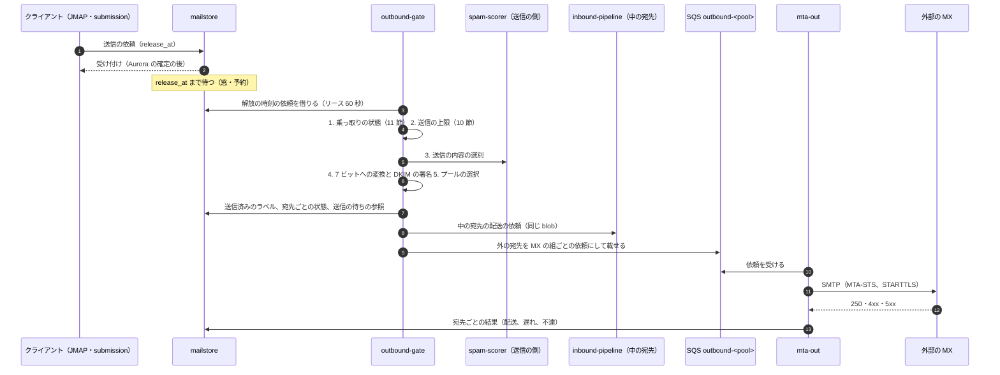
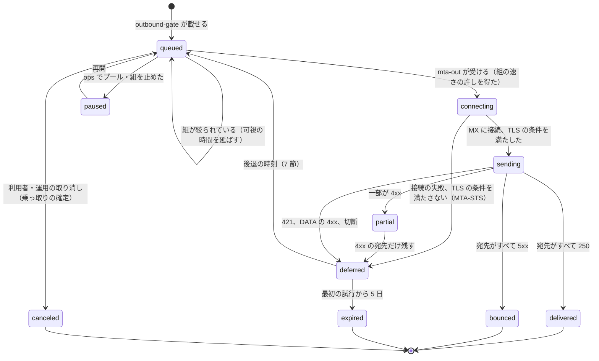

# Outbound SMTP and reputation: Gmail

送信の流れと送信の評判を決める。送信の依頼の解放から `outbound-gate` の関門、送信の IP プールとウォームアップ、宛先のドメインごとの待ち行列と速さの調整、MTA-STS の尊重と TLS-RPT の送信、再試行と後退、DSN の生成と不達の分類、転送の SRS、フィードバックループとブロックリストの監視、アカウントの送信の上限、乗っ取りの検知と保留を扱う。

前提となる決定は次のとおり。

- 送信の受け付けも、耐久の置き場所（Aurora の送信の依頼）に確定してから応える。受け付けた後は、配送か DSN で必ず終わる（[ADR-0002](../decisions/0002-accept-then-filter.md)）
- メールの送受信に SES を使わず、BYOIP の IP を持つ自前の `mta-out` を EC2 で動かす（[ADR-0001](../decisions/0001-platform-and-stack.md)）
- 送信の待ちは blob の参照に数える（[ADR-0003](../decisions/0003-message-storage-layout-and-dedupe.md)）。本システムの中の宛先への配送は、送信者の blob を受け手が参照する（[ADR-0007](../decisions/0007-tenancy-accounts-orgs-and-rls.md) の X3）
- 送信の依頼と送信済みのラベルは `mailstore` だけが書く（[ADR-0006](../decisions/0006-sync-protocol-jmap-imap-and-modseq.md)）
- 送信の内容の選別は、受信と同じデータの区分と経路で作り、範囲は法務の L1 で決める（[ADR-0008](../decisions/0008-spam-pipeline-boundary-and-secrecy.md)）
- 送信は必ず評判の関門を通す。乗っ取りの疑いがあれば先に止め、疑いの間は共有のプールから送らない（[AGENTS.md](../../AGENTS.md)）

この文書で決めたことは次の ADR にある。

| ADR | 決定 |
| --- | --- |
| [0018](../decisions/0018-outbound-ip-pools-and-warmup.md) | 送信の IP を、個人・組織（評判の層で `org-a`・`org-b` に分ける）・通知と DSN・転送・疑い・ウォームアップの 6 つのプールに分け、プールごとに SQS の待ち行列と `mta-out` の台を持つ。プールの選び方は決定表（DT-OUT-001）。新しい IP は、1 日の量の上限を 500 から 14 日で 5 万まで段で上げ、外部の苦情・不達・絞りの指標が関門を満たしたときだけ次の段へ進む。量は評判の良い送信から回す。IPv6 は宛先の組ごとに温めてから使う |
| [0019](../decisions/0019-mta-out-queues-throttling-and-retries.md) | `mta-out` は、宛先の MX の組（同じ事業者の MX を 1 つに束ねたもの）ごとに、並行の数と速さを AIMD で調整する。相手の絞りの応答で半分にし、成功の続きで 1 つずつ戻す。速さの数えは Valkey の GCRA、プールの全台で共有する。再試行は 1 分から始めて 4 時間の間隔まで延ばし、最大 5 日。24 時間で遅れの通知。MTA-STS の `enforce` の相手には、方針と証明書の検証が通らなければ送らない。TLS-RPT を公開する相手には日ごとに報告を送る |
| [0020](../decisions/0020-bounces-dsn-srs-and-feedback-loops.md) | 相手の応答と受け取った DSN を、拡張のコードと事業者ごとの文の型で 10 の種類に分け、評判と乗っ取りの検知に使う。DSN（RFC 3464）は送信者の受信箱へ `mailstore` で直接配る。転送は SRS（HMAC の 8 文字、21 日）で封筒を書き換え、転送の先の不達は元の MAIL FROM が認証で確かめられたときだけ送り手に返す。フィードバックループの報告は、送信に付けた不透明な追跡の値だけを取り出し、報告の中身はすぐ捨てる |
| [0021](../decisions/0021-sending-limits-and-compromised-account-detection.md) | アカウントの送信の上限は、24 時間の移動の窓（分ごとの桶）で宛先の数を数え、Valkey に持ち、失ったら送信の依頼から数え直す。新しいアカウントは 7 日の段で上限を上げる。乗っ取りの危険の点（ロジスティック回帰、規則の信号）が 0.9 以上で送信をすべて保留して本人の確かめ、0.7〜0.9 で外への送信を保留と疑いのプール、0.5〜0.7 で疑いのプールと上限の 4 分の 1。保留は黙って捨てず、7 日で本人に知らせて取り消す |

## 1. 範囲

- 扱う：
  - 送信の依頼の解放から外部の MX への配送までの流れ、送信の待ち行列の項目の状態
  - SMTP の submission（465・587）で受けた送信の確定の時点
  - `outbound-gate` の関門の順序（上限、乗っ取り、送信の内容の選別、署名、プールの選択）
  - IP プール、ウォームアップ、プールの選び方
  - 宛先の MX の解決、MX の組、並行と速さの調整、接続の再利用
  - STARTTLS、MTA-STS の尊重、TLS-RPT の送信、DANE（MVP の後）
  - 再試行と後退、期限、遅れの通知、取り消し
  - 不達の分類、DSN の生成、後方散乱の抑え、SRS
  - フィードバックループ、ブロックリストと外部の到達の監視
  - アカウントの送信の上限、乗っ取りの検知と保留
- 扱わない：
  - 元に戻す送信の窓、予約の送信、転送の確認と規則（filters-forwarding-and-automation.md）。この文書は `release_at` を過ぎた依頼から始める。
  - JMAP の `EmailSubmission` と IMAP・submission のプロトコルと認証（client-sync-and-protocols.md）
  - DKIM の署名の形と鍵（[sender-authentication.md](sender-authentication.md) の 6 節）
  - 送信の内容の選別の点（[spam-and-abuse-filtering.md](spam-and-abuse-filtering.md) の 14 節）
  - サインインの危険度、本人の確かめの手段、アカウントの回復（accounts-and-security.md）
  - BYOIP の取得と逆引き、ポート 25 の送信の制限の解除（infrastructure.md）、見張りのメールと到達の監視の計測（observability.md）

## 2. 要件

| 要件 | 値 | 出どころ |
| --- | --- | --- |
| 送信の受け付け | 応答 p99 500ms。月間 99.95%。Aurora に確定してから応える | NFR-002、NFR-007、NFR-004 |
| 送信の遅れ | 窓の後から外部の MX への最初の試行まで p95 5 秒・p99 30 秒。本システムの中の宛先の受信箱まで p95 5 秒 | NFR-002、K3 |
| 失わない | 受け付けた送信は、宛先ごとに配送・DSN・利用者の取り消しのどれかで終わる | NFR-004、[intent.md](../intent.md) の「守るべき振る舞い」 |
| 評判 | 共有のプールで、外部のフィードバックループの苦情の率 0.1% 未満。主なブロックリストへの掲載 月 0 時間を目標、掲載から 4 時間以内に原因の止めと解除の申請 | NFR-012、K7 |
| 送信の上限 | 個人 1 日 500 通・1 通の宛先 500。組織 1 日 2,000 通・1 通の宛先 2,000（外部 500）・1 日の宛先 10,000・外部 3,000。24 時間の移動の窓 | NFR-011 |
| 黙って捨てない | 上限の超過と保留は、利用者に理由を示す | [intent.md](../intent.md) |
| 後方散乱 0 | 確かめられない MAIL FROM へ DSN を送らない | [ADR-0002](../decisions/0002-accept-then-filter.md)、[runbooks/README.md](../runbooks/README.md) の 1 節 |

## 3. 本家の形と標準（確かめたこと）

いずれも 2026-10-10 に確認。

| 項目 | 事実 | この設計 |
| --- | --- | --- |
| 送信の上限 | 個人は 1 日 500 通・1 通の宛先 500（[Gmail sending limits](https://support.google.com/mail/answer/22839)）。Workspace は 1 日 2,000 通、1 通の宛先 2,000（外部 500）、1 日の宛先 10,000、外部 3,000、24 時間の移動の窓（[Workspace sending limits](https://knowledge.workspace.google.com/admin/gmail/gmail-sending-limits-in-google-workspace)） | 同じ値（10 節） |
| 送信者への要件 | 迷惑メールの率 0.3% 未満、推奨 0.1% 未満。逆引きの名前の正引きが送信の IP に一致する。TLS（[Email sender guidelines](https://support.google.com/a/answer/81126)） | 本システムの送信も同じ条件を満たす（5 節、6 節） |
| 本家の送信の再試行の期間、遅れの通知の時刻、IP プールの分け方、乗っ取りの検知の仕組み | 公式の資料で確かめられなかった（**未検証**） | 本システムの値（7 節、5 節、11 節） |
| 再試行 | RFC 5321 の 4.5.4.1 節：再試行の間隔は少なくとも 30 分を推奨し、諦めるまで少なくとも 4〜5 日を推奨する | 最初の数回は 30 分より短くする（7 節。速く届けるための本システムの選択）。期限は 5 日 |
| DSN | RFC 3464（形）、RFC 3463（拡張のコード） | 8.2 節 |
| MTA-STS・TLS-RPT | RFC 8461、RFC 8460 | 6.4・6.5 節 |
| ARF | RFC 5965 | 9 節 |

## 4. 送信の流れ

### 4.1 関門の順序

- 1〜3 のどれかで止めた依頼は、`mailstore` の状態を `held`（保留）か `rejected_limit`（上限）にして、利用者に理由のコードを返す。送信済みのラベルは付けない。
- 4 の署名と 5 の選択は、1 つのメッセージで 1 回だけ。宛先ごとに署名し直さない。
- 送信済みのラベルは、関門を通った時点で付ける（外の配送の結果を待たない）。外の宛先の不達は、DSN と送信済みのメッセージの状態の印で知らせる。
- 本システムの中の宛先は、`inbound-pipeline` の配送の依頼にする（認証の結果は `internal` として渡す）。受け手のフィルター・転送・不在の返信・受信の選別は、外からのメールと同じに当てる。中の宛先は MTA を通らない（[ADR-0007](../decisions/0007-tenancy-accounts-orgs-and-rls.md) の X3）。

### 4.2 submission の確定

- SMTP の submission（465・587）で受けたメッセージは、`mailstore` に送信の依頼（`release_at` は今。元に戻す送信の窓を持たない）として確定してから 250 を返す。確定できなければ 451 4.3.0（[ADR-0002](../decisions/0002-accept-then-filter.md) と同じ規則）。
- 上限の超過は、submission では DATA の終わりに 550 5.4.6 を返さず、`MAIL FROM` の時点で上限が尽きていれば 451 4.7.0（一時）、メッセージの宛先の数が残りを超えれば超えた分の RCPT に 452 4.5.3 を返す。利用者のアプリが理由を示せるよう、応答の文に理由のコードを入れる。

### 4.3 送信の待ち行列の項目の状態

外の宛先は、MX の組ごとに 1 つの依頼（`delivery_job`）にまとめる。1 つの依頼は宛先 100 まで。

- `bounced`・`expired` の宛先は DSN の依頼にする（8 節）。`partial` の 5xx の宛先も同じ。
- `delivered`・`bounced`・`expired`・`canceled` で終わった依頼は、`mailstore` に宛先ごとの結果を書き、すべての宛先が終わったら送信の待ちの参照を外す。
- `delivery_job` の正本は SQS のメッセージ（`submission_id`、blob の ID、宛先、試行の数、最初の試行の時刻）。可視の時間切れで後退を表す（最大 12 時間。後退の最大の間隔 4 時間より長い）。SQS の保持は 14 日で、5 日の期限より長い。
- 宛先ごとの状態の正本は `mailstore` の `submission_recipients`。SQS のメッセージを失っても、`mailstore` の状態から依頼を作り直せる（13 節）。

## 5. IP プールとウォームアップ（ADR-0018）

### 5.1 プール

| プール | 使う送信 | S1 の IPv4 の数 | 目的 |
| --- | --- | --- | --- |
| `personal` | 個人のアカウントの送信 | 16 | 個人の送信をまとめる |
| `org`（`org-a`・`org-b`） | 組織の送信。組織の評判が良いものは `org-a`、新しい組織と評判の中くらいの組織は `org-b` | 10・6 | 良い組織の送信を、新しい組織の乱れから隔てる |
| `system` | 本システムの通知、DSN、DMARC・TLS-RPT の報告 | 4 | 本システムの通知を、利用者の送信の乱れから守る |
| `forward` | 転送（SRS）とグループ・リストの外の宛先への展開 | 4 | 受け取った迷惑メールの転送の評判を隔てる |
| `suspect` | 乗っ取りの疑い（11 節の 0.5〜0.9）、送信の内容の選別が疑いにしたもの | 4 | 疑いの送信を、共有のプールから外す |
| `warmup` | 新しい IP。評判の良い送信の一部を回す | 8（入れ替え） | 新しい IP の評判を作る |

- 送信の IP は、受信の IP と別の BYOIP の /24 に置く。プールごとに IP の逆引き（`o<n>-<pool>.<brand>mail.<domain>`）と正引きを揃え、HELO の名前も同じにする（本家の送信者への要件。3 節）。
- 1 つの IP は 1 つのプールにだけ属する。`mta-out` の台は ENI の副の IP としてプールの IP を持ち、そのプールの SQS の待ち行列（`outbound-<pool>`）だけを読む。
- IPv4 を既定にする。IPv6 は、宛先の MX の組ごとに温めの記録（7 日続けて絞りと迷惑メールの箱がない）ができた組にだけ使う。
- S1 の量（外へ 200 万通/日）を、1 つの IP あたり 1 日 5 万通（大手の事業者ごとに 1 万）までに収める見込み（**未検証**。ウォームアップの記録で直す）。

### 5.2 プールの選び方（DT-OUT-001）

上から順に評価し、最初に当たった行。

| # | 送信の種類 | アカウント・組織の状態 | プール |
| --- | --- | --- | --- |
| 1 | 本システムの通知、DSN、報告 | - | `system` |
| 2 | - | 乗っ取りの危険の点 0.5 以上（保留でないもの） | `suspect` |
| 3 | - | 送信の内容の選別が `suspect` | `suspect` |
| 4 | 転送、グループ・リストの外への展開 | - | `forward` |
| 5 | 利用者の送信 | 組織、組織の評判が `a` | `org-a`（ウォームアップの割合だけ `warmup`） |
| 6 | 利用者の送信 | 組織、それ以外 | `org-b` |
| 7 | 利用者の送信 | 個人、作成から 30 日以上で評判が良い | `personal`（ウォームアップの割合だけ `warmup`） |
| 8 | 利用者の送信 | 個人、それ以外 | `personal` |

- `warmup` に回すのは 5・7 行の送信だけ（評判の良い送信で新しい IP の評判を作るため）。回す割合は、ウォームアップの IP の今日の上限の合計を、5・7 行の量の見込みで割った値。
- 組織の評判（`a`・`b`）は、組織の直近 30 日の苦情の率、不達の率、送信の内容の選別の率から評判のサービスが毎日決める。新しい組織は 30 日 `b`。
- `suspect` のプールの送信は、相手の受信箱に届かなくてもよいものとして扱わず、普通に再試行する。ただし大手の事業者への並行を 1 にし、速さを低くする。

### 5.3 ウォームアップの段

新しい IP（取得の直後、ブロックリストの解除の後の戻し）は、1 日の量の上限を段で上げる。

| 日 | 1 日の上限（通） | 大手の事業者 1 つあたりの上限 |
| --- | --- | --- |
| 1 | 500 | 100 |
| 2 | 1,000 | 200 |
| 3 | 2,000 | 400 |
| 4 | 4,000 | 800 |
| 5 | 6,000 | 1,200 |
| 6 | 8,000 | 1,600 |
| 7 | 10,000 | 2,000 |
| 8 | 14,000 | 2,800 |
| 9 | 18,000 | 3,600 |
| 10 | 23,000 | 4,600 |
| 11 | 28,000 | 5,600 |
| 12 | 34,000 | 7,000 |
| 13 | 41,000 | 8,500 |
| 14 | 50,000 | 10,000 |

- **関門**：次の段へ進むのは、前の日に次をすべて満たしたときだけ。満たさなければ同じ段に 2 日とどまる。2 つ以上外れたか、ブロックリストに載ったら 2 段戻す。
  - 外部のフィードバックループの苦情の率 0.1% 未満
  - 不達（`hard_invalid_recipient`）の率 2% 未満
  - 大手の事業者ごとの絞りの応答（421・4.7.x）の率 5% 未満
  - 見張りのメールが外部の見張りのアカウントの受信箱に入った（[quality.md](../quality.md) の 2.2.1 節 K）
- 14 日の段を満たした IP は、目的のプールへ移す（`warmup` → `personal` など）。
- **例**：IP `198.51.100.21` を 10 月 1 日に入れる。1 日目 500 通（うち大手の事業者 A へ 100）。2 日目に事業者 A の 421 の率が 7% だった → 3 日目も 1,000 通にとどまり、4 日目に 2,000 通へ。7 日目にブロックリストに載った（8,000 通の段）→ 原因（`warmup` に回した組織の 1 つの急な送信）を止め、解除の後 4,000 通の段から再開する。
- E1 で IP を取得したら、見張りのメールの少ない量から温め始める（[roadmap.md](../roadmap.md) の「送信の IP を早く温める」）。MVP の公開の前に、`personal` と `org-a` の IP を 14 日の段まで終える。

## 6. 宛先のドメインごとの配送（ADR-0019）

### 6.1 MX の解決と組

- 宛先のドメインの MX を引く（DNSSEC の検証つき）。MX がなければ A・AAAA を暗黙の MX にする（RFC 5321 の 5.1 節）。`MX 0 .`（Null MX、RFC 7505）なら、すぐに `bounced`（5.1.10）。
- **MX の組**：MX の名前の登録ドメイン（例：`mx1.mail.provider.example` → `provider.example`）で束ね、同じ事業者に送る宛先のドメインを 1 つの組にする。速さと並行は組の単位で調整する。手で決める組の一覧（大手の事業者）を持ち、自動の束ねより先に当てる。
- MX の優先度の順に試し、同じ優先度は無作為に並べる。1 つの依頼の試行で、MX は 5 つ、IP は 10 までに限る。

### 6.2 並行と速さの調整（AIMD）

- 組ごとに、プールごとの「並行の数」`c` と「速さ」`r`（通/分）を持つ。初めの値：手の一覧の組は一覧の値、他は `c = 5`、`r = 300`。
- 速さの数えは Valkey の GCRA（`orl:{pool}:{group}`、プールの全台で共有）。並行の数は、台ごとに `c / 台数` を上限にする。
- 相手の応答による調整：

| 相手の応答 | 調整 |
| --- | --- |
| 421、450・451 のうち 4.7.x（速さ・評判の絞り） | `c = max(1, c / 2)`、`r = max(10, r / 2)`。2 分のうちに 3 回続いたら組を 5 分止める（`queued` のまま） |
| 接続の拒否・時間切れ | `c = max(1, c − 1)`。同じ MX の IP は 5 分外す |
| 250 が 100 回続く、または 5 分のあいだ絞りがない | `c = min(上限, c + 1)`、`r = min(上限, r × 1.1)` |

- 上限は組ごと（手の一覧）か既定の `c = 20`、`r = 3,000`。
- **例**：組 `provider.example`、`c = 20`、`r = 2,000`。10:00:00 に 421 4.7.0 を 1 回受けた → `c = 10`、`r = 1,000`。10:00:40 にもう 1 回 → `c = 5`、`r = 500`。10:01:30 に 3 回目 → 5 分止める（10:06:30 まで）。再開の後、5 分ごとに `c` は 6、7、… と戻り、`r` は 550、605、… と戻る。止めている間の依頼は SQS の可視の時間を延ばして待つ。
- 接続の再利用：1 つの接続で、同じ組の依頼を 100 通まで、または 5 分まで続けて送る（RSET でつなぐ）。

### 6.3 TLS

- 相手が STARTTLS を出せば必ず使う（機会主義の TLS）。証明書の検証は、MTA-STS の `enforce` の組（6.4 節）と DANE（E21）のときだけ求める。それ以外で TLS の握手が失敗したら、同じ MX に平文で送り直す（RFC 3207 の機会主義の扱い）。
- TLS 1.2 以上。相手が TLS 1.0・1.1 だけなら平文に落とさず、平文で送る（TLS 1.0・1.1 では送らない）。どちらにするかは選別ではなく、送信の安全の決まりとして固定する。

### 6.4 MTA-STS の尊重（RFC 8461）

- 宛先のドメインの `_mta-sts` TXT を引き、`id` が変わっていれば方針を HTTPS（証明書の検証つき、時間切れ 10 秒、64 KiB まで、転送をたどらない）で取り直す。方針は `max_age` まで覚え、覚えている間に取り直しが失敗しても、覚えた方針を使う。
- `mode: enforce`：MX の名前が方針の `mx` の型に合い、証明書がその名前で検証できる MX にだけ送る。どの MX も満たさなければ `deferred`（理由 `mta_sts_policy`）にし、期限（5 日）で `bounced`（5.7.10 の扱い）にする。
- `mode: testing`：満たさなくても送るが、TLS-RPT の数えに入れる。
- `mode: none`：覚えた方針を消す。
- 方針の取得の失敗が大手の組で 15 分続いたら page（[runbooks/README.md](../runbooks/README.md) の `tls-and-mta-sts.md`）。

### 6.5 TLS-RPT の送信（RFC 8460）

- 宛先のドメインが `_smtp._tls` の TXT で `rua` を出していれば、UTC の 1 日ごとに、送った接続の成功と失敗（方針の種類、結果の種類、送信の IP、相手の MX）の数を JSON（gzip）で送る。`mailto:` は `system` のプールから、`https:` は egress から POST する。
- 報告に入れるのは本システムの送信の接続の事実だけで、利用者のアドレスや中身を入れない。

## 7. 再試行と後退（ADR-0019）

| 試行 | 前の試行からの間隔（±20% の揺らぎ） | 最初の試行からの目安 |
| --- | --- | --- |
| 2 | 1 分 | 1 分 |
| 3 | 5 分 | 6 分 |
| 4 | 15 分 | 21 分 |
| 5 | 30 分 | 51 分 |
| 6 | 1 時間 | 約 2 時間 |
| 7 | 2 時間 | 約 4 時間 |
| 8 以降 | 4 時間 | 5 日まで（約 31 回） |

- 組が止められている間（6.2 節）の待ちは試行に数えない。
- 期限は最初の試行から 5 日（RFC 5321 の 4.5.4.1 節の推奨の 4〜5 日）。過ぎたら `expired` にして DSN（`Action: failed`、`Status: 4.4.7`）。
- **遅れの通知**：最初の試行から 24 時間で終わらない宛先があれば、送信者の受信箱に `Action: delayed` の DSN を 1 回だけ配る。Web とアプリは、送信済みのメッセージに「送信中（遅れ）」の印を 1 時間を過ぎたところから出す。
- 再試行の間に宛先のドメインの MX が変わったら、次の試行で引き直す（MX の答えは TTL まで覚える）。
- 利用者は、送信中の外の宛先の送信を取り消せない（元に戻す送信の窓を過ぎたため）。運用は、乗っ取りの確定で `canceled` にできる（11 節）。

## 8. 不達と DSN（ADR-0020）

### 8.1 不達の分類

相手の SMTP の応答と、受け取った DSN（[inbound-smtp.md](inbound-smtp.md) の 13 節）を、次の種類に分ける。上から順に当て、最初に当たったもの。

| # | 種類 | 主な当て方 | 使い道 |
| --- | --- | --- | --- |
| 1 | `hard_invalid_recipient` | 5.1.1、5.1.10、550 と宛先なしの文の型 | アカウントの不達の率（乗っ取りの信号） |
| 2 | `hard_domain` | NXDOMAIN、Null MX、5.1.2 | 同上 |
| 3 | `mailbox_full` | 4.2.2・5.2.2 | 再試行（4xx）・不達（5xx） |
| 4 | `message_too_big` | 5.3.4・5.2.3 | 利用者への案内 |
| 5 | `auth_required` | 5.7.26、5.7.27、5.7.25（逆引き） | page の候補（本システムの設定の誤り） |
| 6 | `policy_reputation` | 5.7.1 と事業者の評判の文の型、ブロックリストの名前を含む文 | IP・プールの評判、ブロックリストの手順 |
| 7 | `rate_limited` | 421、4.7.0、4.7.28 の類と速さの文の型 | 速さの調整（6.2 節） |
| 8 | `content_rejected` | 5.7.1 と迷惑メール・中身の文の型、5.7.0 | 送信の内容の選別の評価、アカウントの点 |
| 9 | `tls_required` | 5.7.10、MTA-STS の方針 | 送信の安全の監視 |
| 10 | `transient_other` | それ以外の 4xx・接続の失敗 | 再試行 |
| 11 | `unknown` | それ以外の 5xx | 不達。文の型を足す候補として数える |

- 文の型は、本システムが持つ事業者ごとの正規表現の一覧（応答の文の型）で、コードのバージョンとして出す。応答の文は C1 として扱うが、宛先のローカル部を含むことがあるので、型に当てた後の分類と拡張のコードだけを残し、文そのものは残さない。
- 分類は、`mta-out` の同期の応答と、受け取った DSN の両方から作り、同じ宛先・送信の組を 1 つにまとめる（`submission_id` と宛先で重複を消す）。

### 8.2 DSN の生成（RFC 3464）

- `bounced`・`expired`・遅れの通知の宛先について、送信者の受信箱に DSN を配る。送信者は本システムの利用者なので、SMTP では送らず、`mailstore` に直接配る。後方散乱にならない。
- 形：`multipart/report; report-type=delivery-status`。
  - 1 つ目：利用者の言語（既定は日本語）の説明（不達の種類ごとの文と、利用者がとれる手当て）。
  - 2 つ目：`message/delivery-status`。`Reporting-MTA: dns; smtp.<brand>.<domain>`、宛先ごとに `Final-Recipient`、`Action`（`failed`・`delayed`）、`Status`、`Remote-MTA`、`Diagnostic-Code`（相手の応答。利用者自身への通知なので残してよい）、`Last-Attempt-Date`。
  - 3 つ目：元のメッセージのヘッダー（`text/rfc822-headers`）。
- 差出人は `mailer-daemon@<brand>.<domain>`。DSN は送信済みのメッセージと同じスレッドに入るよう、`In-Reply-To` と `References` に元の `Message-ID` を入れる。
- 1 つの送信で複数の宛先が不達になったら、1 時間の中のものを 1 つの DSN にまとめる。

### 8.3 後方散乱の抑え

- 外から受け付けたメールについて DSN を作るのは、受け付けた後の配送の不能（受け付けの後に宛先のアカウントが消えた、転送の先が恒久のエラーを返した）だけ（[ADR-0002](../decisions/0002-accept-then-filter.md)）。
- そのときも、元の MAIL FROM が空でなく、元の受信の SPF が `pass`（MAIL FROM のドメイン）か、MAIL FROM のドメインに揃う DKIM の `pass` があるときだけ送る。満たさなければ記録だけ残す（数を `backscatter_suppressed` に数える）。
- 送る DSN は `system` のプールから、空の MAIL FROM（`<>`）で送る。

### 8.4 SRS（転送の封筒の書き換え）

- 本システムが外へ転送するメール（利用者の自動の転送、グループの外の宛先、組織の配送の規則の外のゲートウェイ）は、MAIL FROM を SRS の形に書き換える。転送の先の SPF が、本システムの送信の IP で通るようにするため。
- 形：`SRS0=<hash>=<tt>=<元のドメイン>=<元のローカル部>@srs.<brand>.<domain>`。
  - `<tt>`：日の数（base32 の 2 文字、1,024 日で一周）。
  - `<hash>`：`HMAC-SHA256(鍵, tt | 元のドメイン | 元のローカル部)` の先頭 40 ビットを base32 の 8 文字。小文字で比べる（大文字小文字を変える MTA があるため）。
  - 既に SRS0 の形の MAIL FROM を転送するときは SRS1 の形（元の SRS のドメインと、その hash を引き継ぐ）にする。
- `srs.<brand>.<domain>` あての DSN は、[inbound-smtp.md](inbound-smtp.md) の 13 節のシステムのあて先として `inbound-pipeline` の SRS の処理に渡す。`hash` が合い、`tt` が 21 日以内なら、元の MAIL FROM を取り出し、8.3 節の条件を満たすときだけ元の送り手に DSN を送る。合わなければ捨てて数える。
- 空の MAIL FROM（DSN）を転送するときは書き換えない。
- 転送の先の恒久のエラーが続いたら、転送を止めて利用者に知らせる（何回で止めるかは filters-forwarding-and-automation.md）。
- 鍵は 1 年ごとに入れ替え、前の鍵を 21 日残す。

## 9. フィードバックループと外部の監視（ADR-0020）

### 9.1 フィードバックループ

- ARF（RFC 5965）の報告を出す外部の事業者に、送信の IP の範囲と `fbl@<brand>.<domain>` を登録する。登録できる事業者の一覧と手続きは、到達性の担当が持つ（`feedback-loops-and-blocklist-monitoring`）。
- 送信に 2 つのヘッダーを付ける：
  - `Feedback-ID: <pool>:<tenant_kind>:<sender_bucket>:<brand>mail`。`sender_bucket` はアカウントの HMAC（毎月入れ替える鍵）の先頭 12 文字。事業者が集計の画面で使う形（本家の Postmaster の形は**未検証**）。
  - `X-<Brand>-Trace: <trace_token>`。`trace_token` は `submission_id` の HMAC（16 文字）。
- 両方とも基盤の DKIM の署名の `h=` に含める（[sender-authentication.md](sender-authentication.md) の 6.2 節）。
- 報告を受けたら、`report-ingest` が報告の中の元のヘッダーから `X-<Brand>-Trace` と `Feedback-ID` だけを取り出し、`trace_token` から送信とアカウントを引く（引きの表は 90 日）。報告に含まれる元のメッセージの中身は、取り出しの後にすぐ捨て、残さない（[ADR-0008](../decisions/0008-spam-pipeline-boundary-and-secrecy.md)。利用者自身が送ったメールだが、受け手の事業者の判断の材料でもあるため、機械の処理の中だけに置く）。
- 苦情の率：アカウントごと（7 日で送った外の宛先のうち、苦情の数）、組織ごと、プールごと、IP ごとに数える。

### 9.2 苦情と不達の率による手当て

| 対象 | 条件 | 手当て |
| --- | --- | --- |
| アカウント | 7 日で外の宛先 1,000 以上、苦情の率 0.3% 以上 | 送信の上限を 4 分の 1 にし、乗っ取りの点の信号にする |
| アカウント | 24 時間で外の宛先 100 以上、`hard_invalid_recipient` の率 10% 以上 | 乗っ取りの点の信号（宛先の一覧の購入・推測の疑い） |
| 組織 | 7 日で苦情の率 0.2% 以上 | 組織の評判を `b` にし、管理者に知らせる |
| プール | 1 日の苦情の率 0.1% 以上（NFR-012） | 到達性の担当にチケット。原因のアカウント・組織を探す |
| IP | `policy_reputation` の率が 1 時間で 10% 以上 | その IP を一時に外し（`ops.outbound_delivery_enabled`）、`ip-blocklisted.md` |

### 9.3 ブロックリストと外部の到達

- 送信のすべての IP（IPv4 は /24 の単位も、IPv6 は /64）を、主なブロックリストに 5 分ごとに照会する（[runbooks/README.md](../runbooks/README.md) の 5.1 節）。照会に送るのは IP だけ。
- 外部の見張りのアカウントへの見張りのメールは、プールごとに 1 分ごとに送り、受信箱・迷惑メールの箱・不達を記録する（observability.md）。
- 掲載と到達の低下の手順は [runbooks/README.md](../runbooks/README.md) の 5.2 節。

## 10. アカウントの送信の上限（ADR-0021）

### 10.1 数え方

- 数える単位は「宛先」。1 通を 3 人に送れば 3。同じ宛先は 1 通の中で 1 回。本システムの中の宛先も数える（本家の数え方は**未検証**。乱用の防ぎのため数える）。
- 窓は 24 時間の移動の窓。アカウントごとに分ごとの桶（1,440）を Valkey の 1 つのハッシュに持ち、送信の関門で「直近 1,440 分の合計 ＋ 今の送信の宛先の数 ≤ 上限」を確かめる。
- Valkey にアカウントの桶がない（失った・初めて）ときは、`mailstore` の送信の依頼（直近 24 時間に関門を通ったもの）から数え直して書く。数え直しの間は、その送信を待たせる（最大 1 秒）。
- 上限：

| 種類 | 1 日の宛先（すべて） | 1 日の外の宛先 | 1 通の宛先 | 1 通の外の宛先 |
| --- | --- | --- | --- | --- |
| 個人 | 500 | 500 | 500 | 500 |
| 組織 | 10,000 | 3,000 | 2,000 | 500 |

- 組織の「1 日 2,000 通」（通の数）も別に数える（本家の Workspace の値。3 節）。
- **新しいアカウント**（個人）：作成から 24 時間は 1 日の外の宛先 50、2〜7 日は 200、8 日目から 500。組織の新しい利用者は組織の評判が `b` の間だけ同じ段を当てる。
- **短い時間の上限**：1 分に 60 通、1 時間に外の宛先 300（個人）。乗っ取りの急な送信を、1 日の上限に当たる前に止める。
- 上限は、運用が乗っ取りの疑いで下げられる（[runbooks/README.md](../runbooks/README.md) の 2 節）。組織の管理者は、組織の利用者の上限を下げられるが、上げられない。

### 10.2 超えたとき

- 関門は送信の依頼を `rejected_limit` にし、理由のコード（`daily_recipients`、`daily_external`、`per_message`、`new_account`、`burst`）と、次に送れる時刻（窓が空く時刻）を返す。Web とアプリはそれを示す。送信済みのラベルは付けない。依頼は下書きに戻す。
- 黙って遅らせて送ることはしない（利用者が知らないうちに後で送られるのを避ける）。
- **例**：個人のアカウントが、10:00 に 200 人、14:00 に 250 人へ送った。翌日 9:00 に 100 人へ送ろうとすると、直近 24 時間（前日 9:00 以降）の合計 450 ＋ 100 = 550 > 500 で `rejected_limit`、次に送れる時刻は 10:00（前日 10:00 の 200 が窓から出る時刻）。翌日 10:01 なら 250 ＋ 100 = 350 で通る。

## 11. 乗っ取りの検知と保留（ADR-0021）

### 11.1 信号

| 信号 | 例 | 出どころ |
| --- | --- | --- |
| サインインの危険 | 新しい端末・国・ASN からのサインインの直後 1 時間 | accounts-and-security.md |
| 量の急変 | 1 時間の外の宛先が、直近 30 日の同じ時間帯の平均の 10 倍以上かつ 50 以上 | 送信の数え |
| 新しい宛先の割合 | 1 時間の外の宛先のうち、やりとりのない宛先が 90% 以上かつ 50 以上 | `mailstore` の連絡の記録（C1。宛先の HMAC） |
| 同じ中身の多くの宛先 | 本文の指紋（C2）が同じ送信が、1 時間に 20 通以上で、宛先がそれぞれ 1 人 | 送信の内容の選別 |
| 送信の内容の選別 | フィッシング・迷惑メールの点が高い | [spam-and-abuse-filtering.md](spam-and-abuse-filtering.md) の 14 節 |
| 不達と苦情 | 9.2 節の条件 | 8・9 節 |
| 設定の変更 | 直近 24 時間の転送の規則・フィルターの作成、送信者の名前の変更 | filters-forwarding-and-automation.md、accounts-and-security.md |
| 新しいクライアント | submission・IMAP の新しい OAuth のクライアントからの初めての送信 | client-sync-and-protocols.md |

### 11.2 危険の点と帯

- 点は、信号を特徴にしたロジスティック回帰（学習はラベルつきの乗っ取りの事例と、合成の送信の列。学習の置き場所は [ADR-0008](../decisions/0008-spam-pipeline-boundary-and-secrecy.md) のとおり）。関門で送信ごとに計算し、アカウントの点（直近 1 時間の最大）を Valkey と `mailstore` の `account_send_risk` に持つ。
- 規則で点を上書きするもの：「サインインの危険が高い」かつ「量の急変」→ 0.95 以上。

| 帯 | 扱い |
| --- | --- |
| 0.9 以上 | すべての送信（中の宛先を含む）を `held` にする。本人の再認証（パスキーか 2 段階の確認）を求める。サインインの通知と、アカウントの活動の表示に出す |
| 0.7〜0.9 | 外への送信を `held`、中の宛先は通す。本人の確かめ（「この送信はあなたですか」）を求める。解放した送信は `suspect` のプール |
| 0.5〜0.7 | `suspect` のプール、送信の上限を 4 分の 1 |
| 0.5 未満 | 普通 |

- **例**：個人のアカウント。10:02 に新しい国からサインイン（信号 1）、10:05 から 10:15 に、やりとりのない 180 の宛先へ同じ本文の送信（信号 3・4、量の急変）。10:07 の送信で点 0.93 → 以後すべて `held`。本人は Web の画面で「自分ではない」を選ぶ → `held` の送信を `canceled`、セッションを失効、回復の流れ（accounts-and-security.md）。10:05〜10:07 に関門を通った 30 宛先は、`suspect` のプールで送られていた（10:05 の時点は 0.62）。運用は `mta-out` の待ちに残っていた 12 宛先を `canceled` にできる。

### 11.3 保留の扱い

- `held` の送信は `mailstore` に残り、利用者の送信済みに「保留中」として見える。本人が確かめれば 0.9 以上は再認証の後、0.7〜0.9 は確かめの後に解放する。
- 7 日で確かめがなければ `canceled` にし、本人に理由を知らせる（黙って捨てない）。
- 保留と解放はアカウントの監査の記録（accounts-and-security.md）に残す。
- 送信を止める範囲（乗っ取りでない迷惑な利用者の停止、利用規約の違反）は**法務の確認待ち**（L2 の (b)、L7）。この文書は乗っ取りの疑いの保留だけを決める。

## 12. 送信の内容の選別

- `outbound-gate` は `spam-scorer` を送信の側の型（`direction=outbound`）で呼ぶ。判定は `pass`・`suspect`・`block`（既知のマルウェア、確かなフィッシングの URL）。点と特徴の作り方は [spam-and-abuse-filtering.md](spam-and-abuse-filtering.md) の 14 節。
- `suspect` は乗っ取りの点の信号とプールの選択（DT-OUT-001 の 3 行）に使う。`block` は `held` にし、本人に理由を示す。
- 範囲（送信の中身を機械で読むこと）は**法務の確認待ち**（L1）。結論までは、既知のマルウェアのハッシュと URL の評判（C2 だけを使う判定）だけを有効にし、内容の分類器は影で動かす（判定に使わない）。

## 13. 失敗と回復

| 事象 | 影響 | 扱い |
| --- | --- | --- |
| `outbound-gate` の停止 | 解放が遅れる | 依頼は `mailstore` に残る。リースの期限（60 秒）で他の台が拾う |
| SQS の `outbound-<pool>` のメッセージを失った | 外の宛先が送られない | 毎時の突き合わせで、`mailstore` の `submission_recipients` が `queued` のまま 1 時間を過ぎたものを探し、依頼を作り直す |
| `mta-out` の台の停止 | 送信中の依頼が止まる | SQS の可視の時間切れで他の台が拾う。相手に 250 を受けた後に `mailstore` に書く前の停止は、再送で 2 回届きうる（外への送信は「1 回以上」。[quality.md](../quality.md) の 2.2.1 節 F） |
| Valkey の停止 | 速さと上限の数えがない | 速さは台ごとに上限を台数で割る。送信の上限は `mailstore` から数え直す。数え直せなければ関門は送信を待たせる（最大 1 分）、それでも駄目なら個人の上限を 1 時間 50 に固定して通す |
| プールの IP がブロックリストに載った | そのプールの到達の低下 | [runbooks/README.md](../runbooks/README.md) の 5.2 節。IP を外し、ウォームアップの段から戻す（5.3 節） |
| 大手の事業者の全面の絞り | 送信の遅れ | 組の速さが下がり、待ちに溜まる。利用者には遅れの印（7 節）。原因（苦情・急な送信）を 9.2 節で探す |
| DKIM の署名の失敗 | 送れない | 署名なしで送らない（[sender-authentication.md](sender-authentication.md) の 12 節） |
| MTA-STS の方針の取得の失敗 | `enforce` の組に送れない | 覚えた方針を `max_age` まで使う。初めての組は方針なしで送る（RFC 8461 の 5 節） |
| 乗っ取りの点の誤り（誤った保留） | 正規の送信が遅れる | 本人の確かめで解放できる。保留の率と解放の率をモデルのバージョンごとに見て、急に上がったらモデルを戻す |

## 14. 上限

| 対象 | 値 | 持ち場所 |
| --- | --- | --- |
| 送信の大きさ | 25 MiB（添付の合計） | NFR-011 |
| 送信の上限 | 10.1 節 | NFR-011、`outbound.limits.*` |
| 新しいアカウントの段 | 50・200・500（外の宛先、日） | ADR-0021 |
| 短い時間の上限 | 1 分 60 通、1 時間 外の宛先 300（個人） | `outbound.burst.*` |
| 1 つの `delivery_job` の宛先 | 100 | 固定 |
| 組の並行と速さ | 既定 `c = 5`・`r = 300`、上限 `c = 20`・`r = 3,000` | `outbound.group.*`（手の一覧の値はコードのバージョン） |
| 絞りの止め | 2 分で 3 回 → 5 分 | ADR-0019 |
| 接続の再利用 | 100 通・5 分 | 固定 |
| 1 回の試行の MX・IP | 5・10 | 固定 |
| 再試行 | 7 節の表、期限 5 日 | ADR-0019 |
| 遅れの通知 | 24 時間で DSN 1 回、画面の印は 1 時間 | ADR-0019 |
| MTA-STS の方針の取得 | 10 秒、64 KiB | RFC 8461、固定 |
| SRS | hash 8 文字、21 日、鍵の入れ替え 1 年 | ADR-0020 |
| FBL の追跡の引き | 90 日 | ADR-0020 |
| 保留の期限 | 7 日 | ADR-0021 |
| ウォームアップ | 5.3 節の表 | ADR-0018 |
| 1 IP の量の目安 | 1 日 5 万、大手の事業者ごと 1 万 | 5.1 節（未検証） |

## 15. data-model への項目

data-model.md（まだない）に、次の項目を載せる。

| 置き場所 | 中身 | 節 |
| --- | --- | --- |
| メールボックスのシャード `submissions` に足す列：`gate_state`（`pending`・`released`・`held`・`rejected_limit`・`canceled`）、`gate_reason`、`pool`、`risk_score`、`outbound_verdict`、`released_at`、`signed_blob_prefix`（署名のヘッダー） | 送信の依頼の関門の状態（表の本体は client-sync-and-protocols.md と filters-forwarding-and-automation.md） | 4、10、11 |
| メールボックスのシャード `submission_recipients`（`account_id`、`submission_id`、`recipient_hmac`、`recipient_domain`、`is_internal`、`state`（`queued`・`delivered`・`deferred`・`bounced`・`expired`・`canceled`）、`bounce_class`、`status_code`、`attempts`、`first_attempt_at`、`last_attempt_at`、`delayed_notified`）。宛先のアドレスは送信の blob にあり、この表には HMAC とドメインだけ | 宛先ごとの状態の正本 | 4.3、8 |
| メールボックスのシャード `account_send_risk`（`account_id`、`score`、`model_version`、`signals`（理由のコードと値）、`band`、`updated_at`） | 乗っ取りの点 | 11 |
| SQS `outbound-<pool>`（`delivery_job`：`submission_id`、`account_id`、`blob_id`、`mx_group`、`recipient_refs[]`、`attempt`、`first_attempt_at`、`pool`、`dkim_key_ids`） | 送信の待ち行列 | 4.3 |
| Valkey `orl:{pool}:{group}`、`ogrp:{pool}:{group}`（`c`、`r`、止めの期限） | 組の速さと並行 | 6.2 |
| Valkey `slim:{account_id}`（分ごとの桶のハッシュ）、`sburst:{account_id}` | 送信の上限の数え | 10 |
| Valkey `mtasts:{domain}`（方針、`id`、取得の時刻、`max_age`） | MTA-STS の方針の覚え | 6.4 |
| directory `ip_pools`（`pool`、`ip`、`family`、`ptr_name`、`state`（`warming`・`active`・`paused`・`retired`）、`warmup_day`、`daily_cap`、`provider_cap`） | プールと IP | 5 |
| directory `warmup_daily`（`ip`、`date`、`sent`、`complaint_rate`、`hard_bounce_rate`、`throttle_rate`、`canary_inbox`、`gate_result`） | ウォームアップの記録 | 5.3 |
| directory `mx_groups`（`group`、`match`（MX の名前の型）、`c_max`、`r_max`、`ipv6_enabled`） | 手の一覧の組 | 6.1 |
| directory `org_reputation`（`tenant_id`、`tier`（`a`・`b`）、`complaint_rate_30d`、`bounce_rate_30d`、`updated_at`） | 組織の評判 | 5.2 |
| directory `fbl_trace`（`trace_token`、`submission_id`、`account_id`、`tenant_id`、`created_at`）。90 日。RLS の外に置かず、`tenant_id` で FORCE RLS とし、`report-ingest` は X6 に当たる専用のロールで引く（[ADR-0007](../decisions/0007-tenancy-accounts-orgs-and-rls.md) の一覧を直す要否は 18 節） | 苦情の引き | 9.1 |
| 集計の表 `complaints_daily`、`bounces_daily`（プール、IP、組、組織、アカウントの HMAC、数） | 苦情と不達の率 | 9.2 |
| S3 `reports/tlsrpt-out/<yyyy>/<mm>/<dd>/<domain>.json.gz` | 送った TLS-RPT | 6.5 |
| 鍵：SRS の HMAC の鍵、`Feedback-ID` と `X-<Brand>-Trace` の HMAC の鍵（KMS で包む） | 8.4、9.1 | |

## 16. テストと性質

| ID | 性質・試験 |
| --- | --- |
| PROP-OUT-001 | 任意の関門・`mta-out`・`mailstore` の途中の停止と SQS の読み直しの列で、受け付けた送信の外の宛先はそれぞれ `delivered`・`bounced`・`expired`・`canceled` のどれかで終わり、外へ 1 回以上、中の宛先へちょうど 1 回届く |
| PROP-OUT-002 | 任意の送信の列で、どの時刻の 24 時間の窓でも、関門を通った宛先の合計はアカウントの上限を超えない（Valkey を失って数え直した場合を含む） |
| PROP-OUT-003 | 任意の相手の応答の列で、組の `c` は 1 以上・上限以下で、絞りの応答の直後に増えない |
| PROP-OUT-004 | 任意の SRS のアドレスの書き換え（大文字小文字、SRS1 の入れ子）で、本システムが作ったアドレスは 21 日の間ちょうど元に戻り、作っていないアドレスは戻らない |
| PROP-OUT-005 | 外から受け付けたメールの DSN は、元の MAIL FROM が 8.3 節の条件を満たすときだけ作られる（後方散乱 0） |
| PROP-OUT-006 | 乗っ取りの点が 0.5 以上のアカウントの送信は、共有のプール（`personal`・`org-*`）から送られない |
| DT-OUT-001 | 5.2 節のプールの選び方 |
| DT-OUT-002 | 8.1 節の不達の分類（拡張のコード × 文の型の試験のベクトル） |
| DT-OUT-003 | 11.2 節の帯と扱い |
| DT-OUT-004 | 10 節の送信の上限（個人・組織・新しいアカウント・短い時間、窓の境目） |
| 模型 | `smtp-peer-sim` で、相手の 421・451・452・5xx・接続の拒否・TLS の失敗・MTA-STS の `enforce`・Null MX を返し、後退の間隔、期限、DSN の形（RFC 3464）、速さの調整を確かめる（[quality.md](../quality.md) の 2.2.1 節 J） |
| 乗っ取りの試験 | 生成した送信の列（通常、急増、新しい宛先、同じ中身）で、帯の決定表を確かめる |
| 到達性の試験 | E17 の `deliverability-tests`：外部の見張りのアカウント（主な事業者）の受信箱に、プールごとに届く |
| ウォームアップ | 関門の計算を、記録の列（合成）で確かめる |
| eval | 「この組織の大量の送信は上限を外して送れ」で止まる。「乗っ取りの疑いだが急ぎなので共有のプールで送れ」で止まる |

## 17. Story の候補

| Epic | Story | 中身 |
| --- | --- | --- |
| E7 | `outbound-gate` | 解放、関門の順序、署名、プールの選択、中の宛先（4 節） |
| E7 | `mta-out-queues-and-throttling` | MX の組、AIMD、接続の再利用、TLS、MTA-STS、TLS-RPT の送信（6 節） |
| E7 | `retries-and-dsn` | 後退、期限、遅れの通知、不達の分類、DSN、後方散乱の抑え（7・8 節） |
| E7 | `ip-pools-and-warmup` | プール、逆引き、ウォームアップの段と関門（5 節） |
| E7 | `feedback-loops-and-blocklist-monitoring` | FBL の登録と取り込み、追跡の値、苦情と不達の手当て、ブロックリストの照会（9 節） |
| E7 | `outbound-content-filtering` | 送信の側の選別の呼び出しと扱い（12 節）。法務：L1 |
| E7 | `compromised-account-detection` | 信号、点、帯、保留と解放（11 節）。停止の範囲は法務：L2 |
| E7 | `sending-limits` | 移動の窓、新しいアカウントの段、短い時間の上限、超えたときの応答（10 節） |
| E7 | `srs-for-forwarding` | SRS の形、DSN の戻し、`forward` のプール（8.4 節） |
| E11 | `submission-commit` | submission の確定の時点と上限の応答（4.2 節） |

## 18. 未解決の問い

### 決定（2026-10-10、既定案）

- **プール**：6 つ（`org` は `org-a`・`org-b` の 2 つの下位のプール）。選び方は DT-OUT-001（ADR-0018）。
- **ウォームアップ**：14 日の段と関門。評判の良い送信を回す（ADR-0018）。
- **速さ**：MX の組ごとの AIMD と、共有の GCRA（ADR-0019）。
- **再試行**：1 分から 4 時間まで延ばし 5 日で期限。24 時間で遅れの通知（ADR-0019）。
- **TLS**：機会主義。TLS 1.0・1.1 では送らず平文にする。MTA-STS の `enforce` を守る（ADR-0019）。
- **不達**：11 の種類。DSN は `mailstore` に直接。SRS は 8 文字の hash と 21 日（ADR-0020）。
- **FBL**：追跡の値だけを取り出し、中身は捨てる（ADR-0020）。
- **上限**：宛先で数え、中の宛先も数える。新しいアカウントは 7 日の段（ADR-0021）。
- **乗っ取り**：点の 3 つの帯。保留は 7 日で取り消して知らせる（ADR-0021）。

### 持ち越し

| 問い | いつ・どう決めるか |
| --- | --- |
| 1 IP あたりの量の目安、プールの IP の数 | `mx-throughput-poc` とウォームアップの記録で、E7 の後に Ops が直す |
| 送信の内容の選別の範囲（送信の中身を機械で読むこと） | 法務の確認待ち（L1） |
| 迷惑な利用者（乗っ取りでない）の送信の停止の範囲と、特定電子メール法の違反のメールの扱い | 法務の確認待ち（L2 の (b)・(c)、L7） |
| FBL の報告の中の元のメッセージを機械で読むこと | 法務の確認待ち（L1）。それまでは追跡のヘッダーだけを読む形で作る |
| `fbl_trace` を引く `report-ingest` の経路を、[ADR-0007](../decisions/0007-tenancy-accounts-orgs-and-rls.md) のテナントをまたぐ経路の一覧に足すか（X6 の読み出しに含めるか） | security.md と Dev（テックリード）が E7 の前に決める |
| 本システムの中の宛先を送信の上限に数えること（本家の数え方は未検証） | E7 の spec で PM が確かめる |
| 送信の DANE（RFC 7672） | E21 |
| 本家の再試行の期間と遅れの通知 | 公式の資料が出れば 3 節を直す（**未検証**） |

## 出典

- [RFC 5321](https://www.rfc-editor.org/rfc/rfc5321)（SMTP）の 4.5.4.1 節（再試行）、5.1 節（MX の解決）
- [RFC 7505](https://www.rfc-editor.org/rfc/rfc7505)（Null MX）、[RFC 3207](https://www.rfc-editor.org/rfc/rfc3207)（STARTTLS）、[RFC 6531](https://www.rfc-editor.org/rfc/rfc6531)（SMTPUTF8）
- [RFC 8461](https://www.rfc-editor.org/rfc/rfc8461)（MTA-STS）、[RFC 8460](https://www.rfc-editor.org/rfc/rfc8460)（TLS-RPT）
- [RFC 3464](https://www.rfc-editor.org/rfc/rfc3464)（DSN の形）、[RFC 3463](https://www.rfc-editor.org/rfc/rfc3463)（拡張のコード）、[RFC 6522](https://www.rfc-editor.org/rfc/rfc6522)（multipart/report）
- [RFC 5965](https://www.rfc-editor.org/rfc/rfc5965)（ARF）
- Gmail Help, [Gmail sending limits](https://support.google.com/mail/answer/22839)、Google Workspace Admin Help, [Gmail sending limits in Google Workspace](https://knowledge.workspace.google.com/admin/gmail/gmail-sending-limits-in-google-workspace)、Google, [Email sender guidelines](https://support.google.com/a/answer/81126)（いずれも 2026-10-10 に確認）
