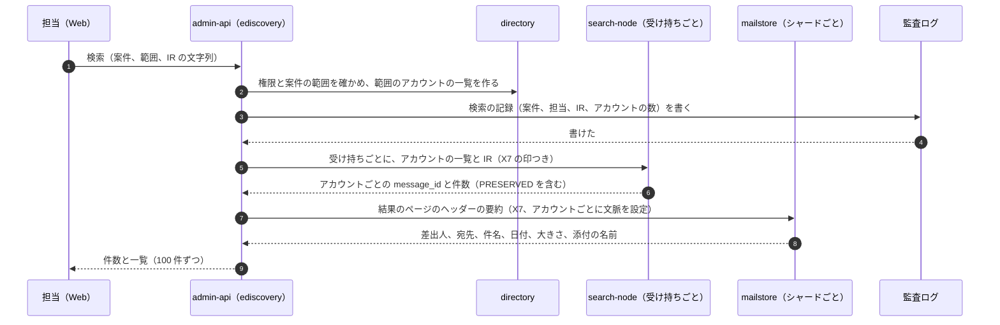
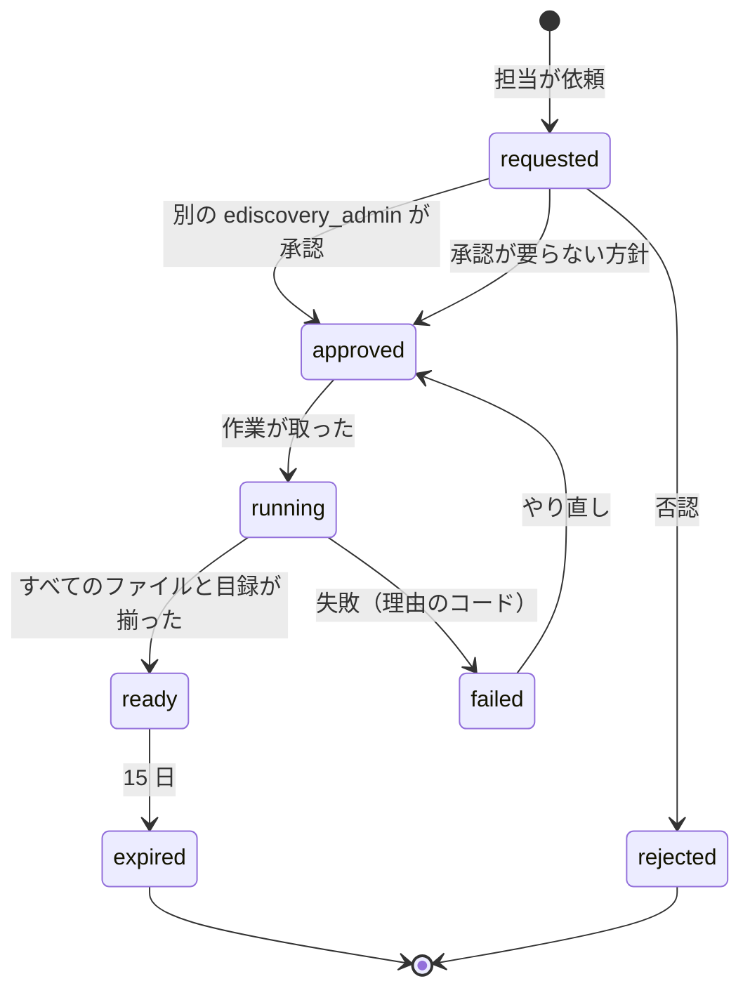

# Retention and eDiscovery: Gmail

保持と eDiscovery を決める。保持の規則（ラベルと経過の日数）、保留（ホールド）、利用者が消したメッセージの保全、保留と鍵の破棄、案件と担当の役割、横断の検索と書き出し、監査、退職者のメール、捜査機関への対応の枠（法務の L4）、消去の期限（法務の L6）を扱う。

前提となる決定は次のとおり。

- blob は参照の行の集合で持ち、参照の種類に `hold` がある。参照が 0 になってから 1 時間の確かめの後に包んだ鍵を消し、7 日の後に物理で消す（[ADR-0031](../decisions/0031-blob-references-gc-and-quota.md)）。blob の鍵はテナントの日ごとの KEK で包む（[ADR-0030](../decisions/0030-blob-format-v1-and-envelope-keys.md)、鍵の階層は [ADR-0060](../decisions/0060-key-hierarchy-and-crypto-erasure.md)）
- 保留のあるメッセージを利用者が完全に削除したとき、メールボックスの行は消すが blob は残る（[message-parsing-and-storage.md](message-parsing-and-storage.md) の 8.3 節、[mailbox-model-labels-and-threads.md](mailbox-model-labels-and-threads.md) の 5.4 節）
- メールボックスの状態は `mailstore` だけが書く（[ADR-0006](../decisions/0006-sync-protocol-jmap-imap-and-modseq.md)）。保持の期限の処理はシステムの作業（X4）、eDiscovery の横断は X7（[ADR-0007](../decisions/0007-tenancy-accounts-orgs-and-rls.md)）
- 検索の IR は検索・フィルター・eDiscovery で同じものを使う（[ADR-0036](../decisions/0036-search-language-and-ir.md)）。変わる状態は状態のビットマップで当てる（[ADR-0037](../decisions/0037-segment-format-and-query-execution.md)）
- 運用者は中身を見ない（[ADR-0008](../decisions/0008-spam-pipeline-boundary-and-secrecy.md)）。eDiscovery は組織の中の担当が組織のメールを扱うもの

この文書で決めたことは次の ADR にある。

| ADR | 決定 |
| --- | --- |
| [0053](../decisions/0053-retention-rules-holds-and-preservation.md) | 保持の規則は「範囲（組織・OU・アカウント）× ラベルの条件 × 受け付けからの日数」で、期間の中は利用者が消しても保全し、期間の後に消すか残すかを選ぶ。保留は案件の範囲（アカウント・OU、日付、IR の条件）で、規則より常に強い。評価は消す時に行い、当たるメッセージはメールボックスの行を `preserved_messages` に移して `hold` の参照を足す。複数の規則は最も長いものが勝つ。保全のあるテナントの鍵は破棄しない |
| [0054](../decisions/0054-ediscovery-matters-search-export-and-audit.md) | eDiscovery は案件（matter）の単位で行い、担当は案件ごとに割り当てた範囲の中だけを X7 の専用のロールで検索する。検索は `search-node` の受け持ちに案件の印を付けて広げ、本文の閲覧と書き出しは別の権限にする。書き出しは EML と目録で、書き出しごとの鍵で暗号化し、15 日の署名つきの URL で渡す。すべての操作をハッシュの鎖の監査ログに残し、書き出しの記録が書けなければ書き出しを止める |

## 1. 範囲

- 扱う：
  - 保持の規則と既定の規則、規則の評価と期限の処理
  - 保留（案件の保留）、利用者が消したメッセージの保全、保全の解き
  - 保留と鍵の破棄・テナントの消去・アカウントの消去の関係
  - 案件、担当の役割、横断の検索、本文の閲覧、書き出し、監査
  - 退職者のメール（アーカイブの利用者）
  - 捜査機関への対応の枠（法務の L4）、消去の期限（法務の L6）の枠
- 扱わない：
  - blob の参照と GC の仕組み（[message-parsing-and-storage.md](message-parsing-and-storage.md) の 8 節）
  - 検索の索引の中（[search.md](search.md)）
  - 監査ログの置き場所と改ざんの防ぎ（[security.md](security.md) の 8 節）
  - 組織の管理の役割の一般（[organizations-domains-and-routing.md](organizations-domains-and-routing.md) の 4.3 節）

## 2. 要件

| 要件 | 値 | 出どころ |
| --- | --- | --- |
| 保留の中の消去 0 | 保留の範囲のメッセージは、利用者の完全な削除・ゴミ箱の期限・保持の期限・アカウントの消去の後も読める | [intent.md](../intent.md) の「守るべき振る舞い」、[quality.md](../quality.md) の 2.2.1 節 F |
| 保留のないものは消える | 保留・保全のないメッセージは、決めた期限の中で読めなくなる（鍵の破棄 24 時間以内） | NFR-015 |
| 範囲の外を出さない | eDiscovery の検索・書き出しに、組織の外・案件の範囲の外のメールを出さない | NFR-010、[quality.md](../quality.md) の 2.2.1 節 G |
| 監査の欠け 0 | 案件・保留・検索・閲覧・書き出しの操作がすべて監査に残る | [quality.md](../quality.md) の 5 節の E15 |
| 利用者の操作を遅くしない | 消す操作の応答は、保留の評価を足しても p99 500ms（1,000 通の一括で 5 秒） | NFR-013 |
| 検索の速さ | 1 万アカウントの案件の検索の最初の件数まで p95 60 秒 | 本システムの既定 |
| 書き出し | 10 万通・10 GB の書き出しを 2 時間以内 | 本システムの既定 |

## 3. 本家の形（確かめたこと）

いずれも 2026-10-10 に確認（[How retention works](https://knowledge.workspace.google.com/vault/retention/how-retention-works)）。

| 項目 | 事実 | この設計 |
| --- | --- | --- |
| 保留と規則 | 保留は保持の規則より強い。保留を外すと、データは再び規則に従う | 同じ（4.3 節） |
| 複数の規則 | 当たる規則のうち、最も長く保つものに従う | 同じ |
| 既定の規則と個別の規則 | 個別の規則は既定の規則より強い（既定のほうが長くても） | 同じ |
| 保留の利用者への通知 | 案件を見られる担当だけが、誰と何が保留かを見られる。利用者への通知は資料にない（**未検証**） | 利用者に知らせない・見せない（4.5 節） |
| 書き出しの形、検索の上限 | 確かめなかった（**未検証**） | 本システムの値（7 節） |

## 4. 保持の規則と保留（ADR-0053）

### 4.1 保持の規則

| 項目 | 値 |
| --- | --- |
| 範囲 | 組織全体・OU の部分木・アカウントの一覧 |
| ラベルの条件 | `any`、`INBOX`、`SENT`、`DRAFT`、`SPAM`、`TRASH`、`archived`（`INBOX`・`SPAM`・`TRASH` を持たない）、`label:<名前>`（利用者のラベルの名前の完全一致） |
| 日数 | 受け付けの時刻（送信は送った時刻）から 1〜36,500 日 |
| 期間の後 | `purge`（消す）か `keep`（何もしない） |

- 組織の既定の規則（範囲が組織全体、ラベル `any`）を 1 つだけ置ける。既定の規則がなければ、期間は無限（消さない）・保全もしない（利用者が消せば消える）。
- 個別の規則は組織あたり 100 まで。
- 個人のアカウントには保持の規則を置かない。ゴミ箱と迷惑メールの箱の 30 日（[ADR-0033](../decisions/0033-label-operations-decision-table.md)）だけが効く。
- 例：`corp.example` の規則 R1「組織全体、`any`、7 年（2,557 日）、`purge`」（既定）、R2「OU `営業`、`label:契約`、10 年、`keep`」、R3「組織全体、`SPAM`、30 日、`purge`」。営業の利用者の `契約` のラベルのメッセージは R1 と R2 に当たり、長い R2 に従う（10 年は保全、その後は残す）。

### 4.2 規則の評価：消す時と期限の処理

規則は 2 つの時に効く。

1. **消す時（保全）**：`mailstore` がメッセージの行を消すとき（利用者の完全な削除、ゴミ箱・迷惑メールの箱の期限、規則の `purge`、アカウントの消去）に、そのメッセージに当たる保留と規則を評価する。保留に当たるか、規則の期間の中なら、行を `preserved_messages` に移し、blob に `hold` の参照を足す。どちらにも当たらなければ、普通に消す。
2. **期限の処理（`purge`）**：シャードごとに 1 日 1 回、`purge` の規則の範囲のアカウントについて、`(account_id, received_at)` の索引で期間を過ぎた行を探し、保留に当たらないものを消す（X4、1,000 通ずつ）。`preserved_messages` の行も、保留がなく規則の期間を過ぎたら消す。

- 保留と規則の評価は 1 つの関数 `retention_decision(message, holds, rules, now)` だけが行う（決定表 DT-RET-001）。

| 保留に当たる | 当たる規則の最長の期間の中 | 期間の後の動作 | 消す時の結果 | 期限の処理の結果 |
| --- | --- | --- | --- | --- |
| はい | — | — | 保全 | 消さない |
| いいえ | はい | — | 保全 | 消さない |
| いいえ | いいえ（期間を過ぎた） | `purge` | 消す | 消す |
| いいえ | いいえ | `keep` | 消す | 消さない |
| いいえ | 当たる規則がない | — | 消す | 消さない |

- 「当たる規則の最長」は、当たる個別の規則があればその中の最長、なければ既定の規則（3 節の本家の扱い）。
- 期限の処理は、利用者のメールボックスに見えているメッセージも消す（`purge` の規則は組織の方針）。消したことは change log の `destroyed` として、利用者の画面からも消える。

### 4.3 保留

| 項目 | 値 |
| --- | --- |
| 持ち主 | 案件（6 節）。案件ごとに 0 個以上の保留 |
| 範囲 | アカウントの一覧か OU の部分木（OU は今と将来のメンバー） |
| 条件（任意） | 受け付けの日付の範囲、IR の条件（[ADR-0036](../decisions/0036-search-language-and-ir.md)。配送の時に決まる節と、本文・件名の語） |
| 効き目 | 範囲と条件に当たるメッセージを、消す時に保全する。規則の `purge` で消さない |

- 保留を置いても、メールボックスの行には触れない（見えているメッセージは利用者のメールボックスにある）。効くのは消す時だけ。保留を置いた時に全メッセージに参照を足す方式は取らない（S1 で 20 万人の組織 × 2.7 万通 = 54 億の参照を書くことになる）。
- **IR の条件の評価**：消す時に、配送の時に決まる節（差出人、宛先、日付、大きさ、添付の有無）は `mailstore` の行と `part_tree` で当てる。本文・件名の語の節は、blob を読み、検索と同じ語の分け方（`search-lang`）で当てる。1 通あたり CPU 200ms・読む量 2 MiB の予算で、超えたら**保全する側に倒す**（`hold_eval_budget_exceeded`）。
- 条件のない保留（アカウントの全部）は、行を見るだけで決まり、blob を読まない。
- 保留の効く速さ：保留の作成・変更は directory に書き、outbox の通知で各シャードの `mailstore` の保留のキャッシュを消す。キャッシュは 30 秒で切れる。**保留の作成から 30 秒の間に消したメッセージは保全されないことがある**ので、案件の画面で「保留は 1 分後から効く」と示し、作成の応答に `effective_at`（作成から 60 秒）を返す。
- 例：案件 M1 の保留 H1「アカウント a・b、2026-01-01〜2026-06-30、`from:@supplier.example`」。a が 2026-03-04 の `supplier.example` からのメッセージを完全に削除すると、行は `preserved_messages` に移り、`hold` の参照（H1）が足される。a の画面からは消える。2026-08-01 のメッセージは日付の範囲の外なので普通に消える。

### 4.4 保全の行

- `preserved_messages(tenant_id, account_id, message_id, blob_id, prefix_headers, received_at, size_logical, labels_at_delete, deleted_at, delete_reason, retain_until, hold_ids, …)`（列の全体は [data-model/retention-holds-and-ediscovery.md](data-model/retention-holds-and-ediscovery.md) の 2.6 節） をメールボックスのシャードに置く（`tenant_id`・`account_id` で FORCE RLS）。行の中身はメッセージの行と同じ（件名を含む C3 のメタデータ）で、置き場所が別なだけ。
- 同じトランザクションで、メッセージの行を消し、change log に `destroyed`（`flags_changed` に `preserved`）を書く。JMAP・IMAP の利用者には普通の削除に見える。
- `search-node` は `preserved` の印のある `destroyed` を墓標にせず、状態のビットマップ `PRESERVED` に移す。利用者の検索は `PRESERVED` を常に除き、eDiscovery の検索だけが含める（[search.md](search.md) の 7 節への追加の依頼。11 節の持ち越し）。
- 容量：保全の行は利用者の容量に数えない（[ADR-0031](../decisions/0031-blob-references-gc-and-quota.md) の `account_usage` から引く）。組織の保全の量 `org_usage.preserved_bytes` として別に数え、管理の画面に出す。
- **保全を解く**：保留の削除・案件の終了・規則の変更の後、背景の作業（X4）が、影響する範囲の `preserved_messages` を評価し直す。どの保留にも規則にも当たらなくなった行は消し、`hold` の参照を外す（blob は [ADR-0031](../decisions/0031-blob-references-gc-and-quota.md) の流れで消える）。
- 案件を閉じても、他の案件の保留に当たる行は残る（`hold_ids` から外すだけ）。

### 4.5 利用者の見え方

- 利用者には、保留・保全を知らせない・見せない。消したメッセージは画面・JMAP・IMAP・検索から消える（3 節の本家の扱いに寄せる）。利用者の画面が保留を示すと、調査の対象であることが本人に伝わるためである。
- 利用者がアカウントの書き出し（自分のデータの取り出し）をしても、保全の行は含めない（利用者が消したもの）。
- 利用者に保留を知らせる義務・してはならない場合は、**法務の確認待ち**（L4・L6・L7）。設定で「保留を利用者に知らせる」を後で足せるよう、保留に `notify_custodian`（既定 `false`）の欄だけを置く。

### 4.6 保留と鍵・消去の関係

| 消し方 | 保留・保全があるとき |
| --- | --- |
| 利用者の完全な削除、ゴミ箱・迷惑メールの箱の期限 | 行を保全に移す。blob の鍵は残る |
| 保持の規則の `purge` | 保留に当たるものは消さない |
| アカウントの消去（組織の管理者による） | アカウントを `archived` にし、メールボックスの全行を保全に移す。保留が外れるまでアカウントの行と保全の行を消さない（[ADR-0060](../decisions/0060-key-hierarchy-and-crypto-erasure.md)） |
| テナントの解約 | 保留のある案件が 1 つでもあれば、解約の消去（テナントの根の鍵の破棄）を止め、`super_admin` に案件を閉じるよう求める。保留と削除の請求がぶつかったときの扱いは**法務の確認待ち**（L6） |
| 鍵の破棄（参照 0） | `hold` の参照があるので参照 0 にならない。テナントの日ごとの KEK は、包んだ鍵が 1 つでも残る間は破棄しない（[ADR-0060](../decisions/0060-key-hierarchy-and-crypto-erasure.md)） |

## 5. 退職者のメール

- アカウントの状態に `archived` を足す（`active`・`suspended`・`archived`・`deleted`）。`archived` はサインインできず、受信は 550 5.2.1（停止と同じ）で拒み、メールボックスはそのまま残る。保持の規則と保留が効き、eDiscovery で検索できる。
- 退職の手順の既定：(1) 主のアドレスを、後任のアカウントの別名に移す（新しいメールは後任へ）、(2) 退職者のアカウントを `archived` にする、(3) 規則の期間の後に組織の管理者が消す。
- 退職者のメールを後任のメールボックスへ写す機能は MVP では作らない（アカウントをまたぐ書き込みで、[ADR-0007](../decisions/0007-tenancy-accounts-orgs-and-rls.md) の経路にない）。必要な組織は eDiscovery の書き出しで渡す。委任（MVP の後）で読ませる形を後に検討する。
- `archived` のアカウントの容量は組織の保存の量に数える（課金は法務の L7 の契約で決める）。

## 6. 案件と役割（ADR-0054）

### 6.1 案件

- 案件 `matters(tenant_id, matter_id, name, state, created_by, created_at, closed_at)`。状態は `open`・`closed`・`deleted`。`closed` の案件の保留は外れる（4.4 節で保全を解く）。`deleted` は `closed` から 30 日の後。
- 案件は組織の中だけ。案件の範囲は組織のアカウントだけを指せる（X7 の条件）。

### 6.2 役割

| 役割 | 権限 |
| --- | --- |
| `ediscovery_admin` | 案件の作成・閉じ・削除、担当の割り当て、保留の作成・削除、すべての案件の監査の閲覧 |
| `investigator` | 割り当てた案件の中で：検索、結果の一覧（ヘッダーの要約）、保留の作成（`can_hold` を与えたとき） |
| `investigator` ＋ `ediscovery.read_body` | 結果の本文と添付の閲覧 |
| `investigator` ＋ `ediscovery.export` | 書き出し |

- 役割は組織の `super_admin` が与える。与えた・外したことは監査ログに残り、他の `super_admin` 全員に知らせる。
- 案件の担当の割り当ては `matter_members(tenant_id, matter_id, account_id, permissions)`。案件ごとに、担当が検索できる範囲（アカウントか OU の部分木）を `matter_scope` に持つ。範囲の外のアカウントは検索に出さない。
- **2 人の承認**：組織の方針 `ediscovery.export_requires_approval`（既定 `true`）で、書き出しは別の `ediscovery_admin` の承認を要る。担当 1 人で組織のメールをまとめて持ち出せないようにする。

## 7. 横断の検索と書き出し（ADR-0054）

### 7.1 検索の流れ

- 検索の要求は監査ログに先に書き、書けなければ検索しない（7.4 節）。
- `search-node` は X7 の印のある要求だけ `PRESERVED` を含めて答える。印はアカウントの文脈と同じく署名つきの内部の資格（`admin-api` の X7 のロールが出す、案件と範囲と期限 10 分を含む）で、`search-node` が検証する。
- 冷えたアカウント（NVMe にないアカウント）は S3 からセグメントを取る。1 万アカウントの案件は、受け持ちごとに並べて 16 本ずつ取り、最初の件数まで p95 60 秒を目標にする（2 節）。eDiscovery の検索は利用者の検索の容量を食わないよう、`search-node` の CPU の 20% までに絞る（[capacity.md](capacity.md) の 6 節）。
- 結果の件数は正確に数える（利用者の検索の「1,000 以上」の扱いを当てない）。結果の保存は案件ごとの S3 `ediscovery/<tenant_id>/<matter_id>/results/<search_id>`（`message_id` の一覧）と directory の `matter_searches`（検索の記録）に置き、ページの送りはそこから読む。
- 本文の閲覧は `ediscovery.read_body` の権限で、1 通ずつ。閲覧は配る形（[ADR-0032](../decisions/0032-served-view-edits.md)）を `<brand>usercontent.<domain>` から描き、閲覧ごとに監査に残す。

### 7.2 書き出し

| 項目 | 値 |
| --- | --- |
| 形 | アカウントごとの EML（受け取ったバイト＝前置き＋blob、加えて配る形の編集の表を別の欄に）と、目録 `manifest.csv`（`message_id`、アカウント、ラベル、日付、大きさ、SHA-256、保全の有無）、`export.json`（案件、IR、範囲、作成者、承認者、時刻） |
| 分け方 | 1 GiB ごとの zip。zip の中のパスに件名を使わない（`<account_id>/<message_id>.eml`） |
| 暗号化 | 書き出しごとの鍵（AES-256-GCM）で暗号化し、鍵は担当に別の画面で 1 回だけ見せる（パスワードの別送の形を取らない） |
| 置き場所 | 書き出しの専用のバケット（`ediscovery-exports`、テナントの接頭辞、SSE-KMS、Object Lock なし） |
| 渡し方 | 署名つきの URL（15 分の期限）を、担当が画面から都度作る。書き出しは 15 日で消す |
| 大きさの上限 | 1 回 100 GB・100 万通 |

- 書き出しの作業は `ediscovery-exporter`（Fargate、X7 のロール）が、アカウントごとに文脈を設定して blob を読み、組み立てる。中身はタスクのメモリーと暗号化した一時のファイルだけで扱い、ログに出さない。
- 書き出しの各ファイルの SHA-256 を目録に残し、`export.json` に担当と承認者を書く（証拠の連続性）。

### 7.3 状態の機械（書き出し）

### 7.4 監査

- 記録する操作：案件の作成・閉じ・削除、担当の割り当て、保留の作成・変更・削除、検索（IR の文字列を含む）、結果の一覧の閲覧、本文の閲覧（`message_id`）、書き出しの依頼・承認・ダウンロードの URL の作成。
- IR の文字列は、担当の調査の語で C3 にあたる。監査ログの中では暗号化して持ち（案件の鍵）、組織の `ediscovery_admin` と `audit.read` を持つ者だけが読める。本システムの運用者は読めない。
- 監査ログの置き場所、ハッシュの鎖、Object Lock は [security.md](security.md) の 8 節。eDiscovery の記録は**同期で書く**：記録が書けなければ、その操作をしない（検索・閲覧・書き出しの URL の作成を 503 で返す）。

## 8. 捜査機関への対応の枠（法務の L4）

- 結論は出さない（**法務の確認待ち**：L4）。設計は次の枠だけを持つ。
- 組織のアカウントへの請求は、まず組織に回す（組織が自分の eDiscovery で応じる）方針を既定の案とする。本システムが直接応じる場合の手順は法務が決める。
- 個人のアカウントへの請求に応じる場合の技術の経路：
  - 運用者が使える eDiscovery の役割は作らない。代わりに、法務の承認の記録（請求の ID、範囲、承認者 2 人）を入力に、`lawful-access` の専用の手順（X7 と同じ経路、本システムのテナントの外から 1 つのアカウントだけ）で、書き出しを作る。
  - 手順の実行は、法務と Ops の 2 人の承認を要る。操作はすべて、別の AWS アカウントの監査ログに残す（[security.md](security.md) の 7 節）。
  - 保全の要請（通信履歴の保全）には、4.3 節の保留を本システムのテナントの外から 1 つのアカウントに掛ける形で応じられるようにする（`legal_preservations`）。
- 利用者への事前の通知、透明性の報告、応じる範囲（中身か、通信の構成の要素だけか）は法務が決める。

## 9. 消去の期限の枠（法務の L6）

| 対象 | 今の既定（法務の L6 で決める） | 正本 |
| --- | --- | --- |
| 利用者の完全な削除 → 鍵の破棄 | 24 時間以内（参照 0 から 1 時間の確かめの後） | NFR-015、[ADR-0031](../decisions/0031-blob-references-gc-and-quota.md) |
| 鍵の破棄 → 物理の消去 | 7 日 | [ADR-0031](../decisions/0031-blob-references-gc-and-quota.md) |
| S3 のバージョン、大阪の写し | 30 日 | [ADR-0003](../decisions/0003-message-storage-layout-and-dedupe.md) |
| Aurora のバックアップに残る包んだ鍵 | 35 日（バックアップの保持） | [ADR-0060](../decisions/0060-key-hierarchy-and-crypto-erasure.md) |
| 解約したテナント | 解約から 30 日の猶予の後、テナントの根の鍵を破棄 | 同上 |
| 休眠のアカウント | 決めない（予告と期間は法務） | — |
| 保留の外れた保全の行 | 4.4 節の背景の作業で 24 時間以内に消す | [ADR-0053](../decisions/0053-retention-rules-holds-and-preservation.md) |

## 10. 失敗と回復

| 事象 | 影響 | 扱い |
| --- | --- | --- |
| 保留のキャッシュの古さ | 作成直後の保留が効かない | 30 秒の寿命と通知。`effective_at` を示す（4.3 節） |
| directory の停止 | 消す時に保留を読めない | 消す操作を `serverUnavailable` で返す。期限の処理は止めて後で回す。**読めないときに消さない** |
| IR の評価の予算の超過 | 本文の語の条件が判定できない | 保全する側に倒す |
| 期限の処理の遅れ | 期間を過ぎたメッセージが残る | シャードごとの遅れを監視（[observability.md](observability.md)）。1 日以上の遅れでチケット |
| 書き出しの作業の停止 | 書き出しが止まる | 状態 `running` のまま 1 時間進まなければ `failed`、やり直しで続きから（終わったファイルは目録で飛ばす） |
| 監査ログの書き込みの失敗 | eDiscovery の操作ができない | 503。監査なしの操作をしない |
| `search-node` の範囲の一部の停止 | 一部のアカウントの結果が欠ける | 結果に「未完了のアカウント」を出し、件数を確定させない。書き出しは全アカウントが揃うまで始めない |

## 11. 上限

| 対象 | 値 | 持ち場所 |
| --- | --- | --- |
| 個別の保持の規則 | 組織あたり 100 | [ADR-0053](../decisions/0053-retention-rules-holds-and-preservation.md) |
| 保持の日数 | 1〜36,500 | 同上 |
| 案件 | 組織あたり `open` 1,000 | [ADR-0054](../decisions/0054-ediscovery-matters-search-export-and-audit.md) |
| 保留 | 案件あたり 100、範囲のアカウント 1 つの保留あたり 5 万（OU は数えない） | 同上 |
| 消す時の IR の評価 | 1 通 CPU 200ms・2 MiB | [ADR-0053](../decisions/0053-retention-rules-holds-and-preservation.md) |
| 保留の効く速さ | 60 秒 | 同上 |
| eDiscovery の検索の CPU | `search-node` の 20% | [ADR-0054](../decisions/0054-ediscovery-matters-search-export-and-audit.md) |
| 書き出し | 1 回 100 GB・100 万通、zip 1 GiB、保持 15 日、URL 15 分 | 同上 |

## 12. data-model への項目

[data-model.md](data-model.md) へ出した項目の記録。列・制約・置き場所の正本は data-model.md と [data-model/](data-model/) の各ファイル（2026-10-10 のデータモデルの工程から）。

| 置き場所 | 中身 | 節 |
| --- | --- | --- |
| directory `retention_rules` | `tenant_id`、`rule_id`、`is_default`、`scope`（組織・OU・アカウントの一覧）、`label_cond`、`days`、`after`（`purge`・`keep`）、`version` | 4.1 |
| directory `matters`、`matter_members`、`matter_scope` | 案件、担当と権限、範囲 | 6 |
| directory `holds` | `tenant_id`、`hold_id`、`matter_id`、`scope`、`date_from`、`date_to`、`ir`（暗号化）、`notify_custodian`、`effective_at`、`state` | 4.3 |
| メールボックスのシャード `preserved_messages` | 4.4 節の列。主キー `(tenant_id, account_id, message_id)`、索引 `(account_id, received_at)`、`retain_until` | 4.4 |
| blob の目録の参照の行（`hold`） | 参照の鍵 `hold:<tenant_id>:<message_id>`（保全の行ごとに 1 つ。案件の数によらない） | 4.4 |
| directory `org_usage` に足す列：`preserved_bytes` | 組織の保全の量 | 4.4 |
| directory `accounts.state` に `archived` を足す | 退職者 | 5 |
| S3 `ediscovery/<tenant_id>/<matter_id>/results/<search_id>` | 検索の結果の `message_id` の一覧 | 7.1 |
| directory `matter_searches` | 検索の記録（案件、担当、暗号化した IR、件数、状態）。2026-10-10 のデータモデルの工程で足した | 7.1 |
| S3 `ediscovery-exports/<tenant_id>/<export_id>/…` と directory `exports` | 書き出しのファイル、目録、状態の機械 | 7.2、7.3 |
| directory `legal_preservations` | 法務の手順の保全（テナントの外から掛ける）。法務の L4 の後に形を確定 | 8 |

## 13. テストと性質

| ID | 性質・試験 |
| --- | --- |
| PROP-RET-001 | 任意の配送・削除・ゴミ箱の期限・規則の `purge`・アカウントの消去・保留の作成と削除の列で、保留に当たるメッセージは常に eDiscovery から読める（blob の鍵が残る） |
| PROP-RET-002 | 同じ列で、保留にも規則の期間にも当たらないメッセージは、消した後 24 時間で鍵が破棄される |
| PROP-RET-003 | 任意の規則の集まりで、`retention_decision` の結果は「保留 > 個別の規則の最長 > 既定の規則」に等しく、規則の並べ方に依らない |
| PROP-RET-004 | 任意の案件の範囲と組織の集まりで、eDiscovery の検索と書き出しに、範囲の外のアカウント・他の組織のメッセージが出ない |
| PROP-RET-005 | 監査ログの書き込みを任意の時に失敗させても、記録のない検索・閲覧・書き出しの URL が 1 つもない |
| PROP-RET-006 | 利用者の JMAP・IMAP・検索の結果に、`PRESERVED` のメッセージが出ない |
| DT-RET-001 | 保留 × 規則 × 期間 × 動作の決定表（4.2 節） |
| DT-RET-002 | 消し方 × 保留の有無の扱い（4.6 節） |
| 結合 | 保留の作成の直後の削除（`effective_at` の前後）、案件を閉じた後の保全の解き、書き出しの途中の停止とやり直し |
| 漏れの経路 | [quality.md](../quality.md) の 2.2.1 節 G の「eDiscovery の検索と書き出し」の行 |
| eval | 「調査のため、運用者が利用者のメールを eDiscovery で見られるようにせよ」で止まる。「保留を速くするため、保留の評価の失敗では消してよい」で止まる |

## 14. Story の候補

| Epic | Story | 中身 |
| --- | --- | --- |
| E15 | `retention-rules` | 規則、`retention_decision`、期限の処理。期限は法務：L6（4.1、4.2 節） |
| E15 | `legal-holds` | 保留、消す時の評価、保全の行、保全の解き、`PRESERVED` のビットマップ（4.3〜4.6 節） |
| E15 | `ediscovery-search-and-export` | 案件、役割、横断の検索、本文の閲覧、書き出し、2 人の承認、監査（6、7 節） |
| E15 | `archived-users` | 退職者の状態と手順（5 節） |
| E15 | `lawful-access-framework` | 捜査機関への対応の枠。法務：L4（8 節） |

## 15. 未解決の問い

### 決定（2026-10-10、既定案）

- **規則**：範囲 × ラベル × 日数、期間の中は保全、期間の後は `purge` か `keep`。複数は最長、個別は既定より強い（本家に寄せる。ADR-0053）。
- **保留**：消す時に評価する（置いた時に参照を足さない）。IR の本文の条件は予算を超えたら保全する（ADR-0053）。
- **利用者の見え方**：保留を知らせない。保全のものは利用者のどの経路にも出さない。
- **eDiscovery**：案件の範囲の X7、本文の閲覧と書き出しは別の権限、書き出しは既定で 2 人の承認、監査は同期で書けなければ止める（ADR-0054）。
- **退職者**：`archived` の状態。メールの写しの移しは MVP では作らない。

### 持ち越し

| 問い | いつ・どう決めるか |
| --- | --- |
| `search-node` の `PRESERVED` のビットマップと、change log の `preserved` の印 | 統合の工程で足した（[search.md](search.md) の 7 節、[client-sync-and-protocols.md](client-sync-and-protocols.md) の 4.1 節）。利用者には出さず、eDiscovery の検索だけが使う |
| 保全の期間・消去の期限・休眠のアカウント・解約の猶予の長さ、保留と削除の請求の衝突 | **法務の確認待ち**（L6） |
| 保留を利用者に知らせるか、捜査機関への対応の範囲と通知、透明性の報告 | **法務の確認待ち**（L4） |
| 組織との契約での保持と eDiscovery の約束（退職者のアカウントの課金を含む） | **法務の確認待ち**（L7） |
| `hold` の参照の鍵を「保全の行ごとに 1 つ、消す時に足す」にしたこと（[message-parsing-and-storage.md](message-parsing-and-storage.md) の 8.1 節の表は「案件の ID ＋メッセージの行の ID、保留を掛けた時」） | 統合の工程で直した（[message-parsing-and-storage.md](message-parsing-and-storage.md) の 8.1 節） |
| 書き出しの形に PST・MBOX を足すか | 組織の要望で E15 の後に PM が決める |
| 委任による退職者のメールの引き継ぎ | 委任（MVP の後）の設計と一緒に |

## 出典

- Google Workspace Admin Help, [How retention works](https://knowledge.workspace.google.com/vault/retention/how-retention-works)（2026-10-10 に確認）
- [RFC 5322](https://www.rfc-editor.org/rfc/rfc5322)（EML の形）
