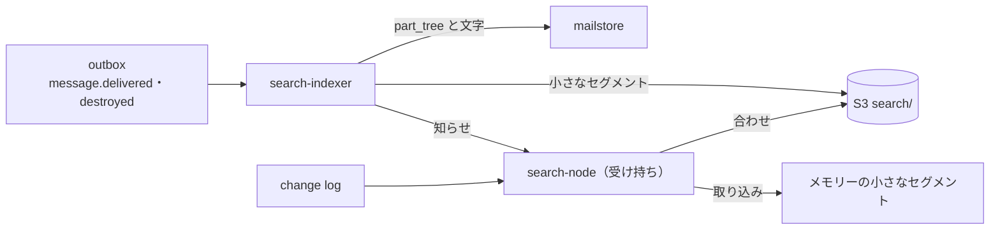

# Search: Gmail

メールの検索を決める。検索の文法と IR（フィルターと共有）、演算子、語の分け方と正規化（日本語の 2-gram）、セグメントの形式、`search-indexer` と `search-node` の受け持ち、状態のビットマップと change log の追いつき、検索の実行の手順、候補の表示、索引の作り直しを扱う。

前提となる決定は次のとおり。

- 索引は自前で、アカウントごとの不変のセグメントを S3 に置き、`search-node` が受け持って NVMe にキャッシュする。日本語は 2-gram、英語は語。変わる状態は索引に入れず、change log から追う状態のビットマップで当てる（[ADR-0009](../decisions/0009-search-index-design.md)）
- 検索の文法の構文解析と IR は Rust の `search-lang` に置き、WASM でも配る（[ADR-0001](../decisions/0001-platform-and-stack.md)）
- `SPAM`・`TRASH` は検索の既定から外す（[ADR-0004](../decisions/0004-labels-as-primary-mailbox-model.md)）
- 索引・キャッシュの鍵・検索の計画は `account_id` を先頭に持つ（[ADR-0007](../decisions/0007-tenancy-accounts-orgs-and-rls.md)）。検索の語はログに書かない（[ADR-0008](../decisions/0008-spam-pipeline-boundary-and-secrecy.md)）

この文書で決めたことは次の ADR にある。

| ADR | 決定 |
| --- | --- |
| [0036](../decisions/0036-search-language-and-ir.md) | 検索の文法は、空白の AND、大文字の `OR` と `{...}`、`-` の否定、かっこ、引用の語句、`AROUND n` と、`name:value` の演算子から成る。IR は正規化した論理式の木で、構文解析は `search-lang` の 1 つの実装（ネイティブと WASM）だけが行う。日付はアカウントの時間帯で解き、`after:` は以上、`before:` は未満。大きさの単位は 1024 の累乗。文字列は 1,024 文字、IR の節は 256 まで。フィルターは IR のうち配送の時に決まる部分だけを使う |
| [0037](../decisions/0037-segment-format-and-query-execution.md) | セグメントの形式 v1 は、語の辞書（FST）、128 文書の塊の転置の並びと位置、doc values の列、`doc_no` から `message_id` への表、墓標のビットマップから成り、アカウントの鍵で 1 MiB ごとに暗号化する。日本語・中国語の文字の連なりは 2-gram と、連なりの最後の 1 文字の 1-gram で索引し、1 文字の検索は「その文字で始まる 2-gram」と 1-gram の和で引く。状態のビットマップは Roaring で持ち、要求の `modseq` まで追いついてから答える。日付の条件はセグメントの日付の範囲で塊を飛ばす |

## 1. 範囲

- 扱う：
  - 検索の文法、演算子、IR、誤りの応答
  - 語の分け方と正規化（日本語・中国語・英数字・アドレス・URL）
  - セグメントの形式、作成、合わせ、暗号化、置き場所
  - `search-node` の受け持ちと写し、NVMe のキャッシュ、冷えたアカウント
  - 状態のビットマップと change log の追いつき
  - 検索の実行、並べ方、ページ、件数
  - 候補の表示（検索の文字の入力中の補い）
  - 索引の作り直し（語の分け方のバージョンの更新、壊れたセグメント）
- 扱わない：
  - JMAP の `Email/query` の形と `queryState`（[client-sync-and-protocols.md](client-sync-and-protocols.md) の 5 節）
  - フィルターの動作と評価の順序（[filters-forwarding-and-automation.md](filters-forwarding-and-automation.md)）
  - 添付の中身（PDF、Office）の文字の取り出し（MVP の後。[attachment-and-url-scanning.md](attachment-and-url-scanning.md)）
  - eDiscovery の横断の検索（retention-and-ediscovery.md）。同じ IR を使うが、受け持ちと権限は別

## 2. 要件

| 要件 | 値 | 出どころ |
| --- | --- | --- |
| 速さ | 10 万通までのアカウントで p95 300ms・p99 1 秒（NVMe にあるアカウント）。冷えたアカウントは p99 3 秒 | NFR-005、[ADR-0009](../decisions/0009-search-index-design.md) |
| 新しさ | 新しいメールが検索に出るまで p95 10 秒・p99 60 秒 | NFR-005 |
| 取りこぼし 0 | 索引の結果が、全走査の参照の実装の結果と一致する | [quality.md](../quality.md) の 2.2.1 節 I |
| 状態の一致 | ビットマップの結果が `mailstore` の状態の結果と一致する | 同上 |
| 分離 | 結果・件数・候補・速さ・エラーに、他のアカウントの情報が出ない | NFR-010、[quality.md](../quality.md) の 2.2.1 節 G |
| 中身を残さない | 検索の語・候補をログ・指標・トレースに書かない。数と遅れと理由のコードだけ | [ADR-0008](../decisions/0008-spam-pipeline-boundary-and-secrecy.md) |

## 3. 本家の形

| 項目 | 本家 | この設計 |
| --- | --- | --- |
| 演算子 | `from:`、`to:`、`cc:`、`bcc:`、`subject:`、`OR`・`{}`、`-`、`AROUND`、`label:`、`has:attachment`、`list:`、`filename:`、引用、かっこ、`in:anywhere`、`is:important`・`is:starred`・`is:unread`・`is:read`、`after:`・`before:`・`older:`・`newer:`、`older_than:`・`newer_than:`、`deliveredto:`、`size:`・`larger:`・`smaller:`、`+`、`rfc822msgid:`、`has:userlabels`・`has:nouserlabels` など（[Search operators](https://support.google.com/mail/answer/7190)、2026-10-10 に確認） | 5.1 節の表。文法をどこまで似せるかは法務の L9（**法務の確認待ち**）。演算子の名前は標準的な英単語で、識別子の問題はない |
| 日付の時間帯、`larger:` の単位、`after:` が当日を含むか | 公式の資料で確かめられなかった（**未検証**） | 5.4 節の本システムの値 |
| 日本語の語の分け方、索引の内部 | **未検証** | 2-gram（[ADR-0009](../decisions/0009-search-index-design.md)） |

## 4. 語の分け方（ADR-0037）

### 4.1 欄

| 欄 | 中身 | 位置 |
| --- | --- | --- |
| `subject` | 件名（encoded-word を復号した後） | あり |
| `body` | text/plain と、text/html から取り出した文字（`style`・`script` を除き、実体参照を戻す）。1 メッセージ 4 MiB の文字まで（[message-parsing-and-storage.md](message-parsing-and-storage.md) の 5.1 節） | あり |
| `filename` | 添付の名前 | あり |
| `from`、`to`、`cc`、`bcc`、`deliveredto` | アドレスと表示の名前（4.4 節） | なし |
| `list` | `List-Id` | なし |
| `msgid` | `Message-ID`（正規化） | なし |

- `bcc` は、利用者が送ったメッセージ（`SENT`）の `Bcc` と、受け取ったメッセージの封筒の宛先のうち利用者のアドレスだけを入れる。他の受け手を推し量らせない。
- 位置のない欄も、doc values に元の値を持つ（並べ方と表示のため）。

### 4.2 正規化

各欄の文字に、次を順に当てる（`analyzer_version = 1`）。

1. NFKC（全角の英数字と半角のカナを揃える）。
2. 大文字小文字の畳み込み（Unicode の単純な畳み込み）。
3. 畳み込みの表：表によって違う文字になるものを 1 つにする。

| 元 | 畳み込んだ後 | 理由 |
| --- | --- | --- |
| U+301C（〜 WAVE DASH）、U+FF5E（～）、U+007E | U+007E | Shift_JIS・CP932 の表の違い（[message-parsing-and-storage.md](message-parsing-and-storage.md) の 6.1 節） |
| U+2212（−）、U+FF0D、U+2010〜U+2015、U+30FC の後でない U+2015 | U+002D | 同上、ハイフンの類 |
| U+FFE0〜U+FFE5 と対の半角 | 半角 | NFKC で揃わないもの（波ダッシュの類は NFKC の対象外） |
| 結合の濁点・半濁点（U+3099、U+309A） | 合成済みの文字 | NFKC で合成されるが念のため |

- ひらがなとカタカナは揃えない（[ADR-0009](../decisions/0009-search-index-design.md)。`search-index-poc` で揃えるかを決める）。
- 長音の記号（ー）は文字として残す（「メール」と「メル」を分ける）。
- 絵文字と記号は語の区切りとして捨てる。ただし 1 つの絵文字だけの検索は、絵文字を 1 つの語として引けるよう、件名の欄にだけ絵文字の語を入れる。

### 4.3 日本語・中国語の文字

正規化した文字を、種類（漢字・ひらがな・カタカナ・ハングル、英数字、その他）の連なりに分ける。漢字・ひらがな・カタカナ・ハングルの連なり（以下「CJK の連なり」。種類が混ざっても 1 つの連なり）は、次の語を作る。

- 連なりの中の隣り合う 2 文字ごとの 2-gram。位置は 1 文字目の位置。
- 連なりの最後の 1 文字の 1-gram（連なりが 1 文字なら、その 1 文字だけ）。位置はその文字の位置。

検索の語も同じに分け、2-gram の位置の連続で語句として当てる。1 文字の検索の語 c は、「c で始まる 2-gram」（語の辞書の前方一致）と「c の 1-gram」の和で引く。どの位置の c も、連なりの中なら次の文字との 2-gram の頭に、連なりの最後なら 1-gram になるので、取りこぼさない。

**例：本文の「2026年9月分の請求書を送付します」**

| 連なり | 種類 | 語（位置） |
| --- | --- | --- |
| `2026` | 英数字 | `2026`(0) |
| `年` | CJK | `年`(1)（1 文字の連なりの 1-gram） |
| `9` | 英数字 | `9`(2) |
| `月分の請求書を送付します` | CJK | `月分`(3)、`分の`(4)、`の請`(5)、`請求`(6)、`求書`(7)、`書を`(8)、`を送`(9)、`送付`(10)、`付し`(11)、`しま`(12)、`ます`(13)、`す`(14)（最後の 1-gram） |

- 検索の `請求書` → `請求`(p)、`求書`(p+1) の語句。位置 6・7 で当たる。
- 検索の `9月` → `9`(p)、`月`(p+1)。`月` は 1 文字なので「`月` で始まる 2-gram」（`月分`）か `月` の 1-gram が p+1 にあればよい。位置 2・3 で当たる。
- 検索の `求` → `求` で始まる 2-gram（`求書`）か `求` の 1-gram。位置 7 で当たる。

### 4.4 英数字、アドレス、URL

- 英数字の連なりは語にする（記号で区切る）。`invoice_2026-09.pdf` は `invoice`、`2026`、`09`、`pdf`。
- メールアドレスは、全体（`sato@example.co.jp`）、ローカル部（`sato`）、ローカル部を `.`・`_`・`-`・`+` で分けたもの、ドメイン（`example.co.jp`）、ドメインの各段の後ろからの並び（`co.jp`、`jp`）と各段（`example`）を入れる。
- 表示の名前は 4.3 節で分ける（`佐藤 太郎` → `佐藤`(0)、`藤`(1)、`太郎`(2)、`郎`(3)）。
- URL は、全体を入れず、ホスト（と各段）とパスの語を入れる（本文の欄）。

## 5. 文法と IR（ADR-0036）

### 5.1 演算子

| 演算子 | 意味 | IR | 当て方 |
| --- | --- | --- | --- |
| （語）、`"語句"` | 件名・本文・添付の名前に含む | `Text(fields=[subject, body, filename], phrase)` | 転置の並び |
| `+word` | 語の一致（英数字の語幹を広げない） | `Text(exact)` | 同上（MVP は語幹の展開をしないので普通の語と同じ） |
| `from:`、`to:`、`cc:`、`bcc:`、`deliveredto:` | アドレス・表示の名前 | `Addr(field, terms)` | doc values の語の集合 |
| `subject:` | 件名 | `Text(fields=[subject])` | 転置の並び |
| `filename:` | 添付の名前（`filename:pdf` は拡張子も） | `Text(fields=[filename])` | 同上 |
| `list:` | `List-Id` | `Attr(list)` | doc values |
| `rfc822msgid:` | `Message-ID` | `Attr(msgid)` | doc values |
| `has:attachment` | 添付あり | `Attr(has_attachment)` | doc values |
| `larger:`・`smaller:`、`size:` | 大きさ（`size:` は以上） | `Size(op, bytes)` | doc values |
| `after:`・`before:`、`newer:`・`older:` | 日付 | `Date(op, instant)` | doc values |
| `newer_than:`・`older_than:` | 今からの相対（`d`・`m`・`y`） | `Date(op, now - n)` | 同上（実行の時に解く） |
| `label:` | 利用者のラベル・システムのラベル | `Label(id)` | 状態のビットマップ |
| `in:inbox`・`in:sent`・`in:drafts`・`in:spam`・`in:trash`・`in:snoozed`・`in:scheduled`・`in:anywhere` | 箱 | `Label(id)`、`in:anywhere` は既定の除外を外す | 同上 |
| `is:unread`・`is:read`・`is:starred`・`is:important`・`is:muted` | 旗 | `Flag(...)` | 同上 |
| `has:userlabels`・`has:nouserlabels` | 利用者のラベルの有無 | `AnyUserLabel` | 同上 |
| `AROUND n` | 2 つの語が n 語以内 | `Near(a, b, n)` | 位置 |

- `category:`、`has:drive` のような、本システムにない機能の演算子は「知らない演算子」として、語として扱わずに誤りを返す（5.5 節）。
- 演算子の名前は大文字小文字を区別しない。`OR` と `AROUND` は大文字のときだけ演算子。

### 5.2 文法

```
query      := or_expr
or_expr    := and_expr ( "OR" and_expr )*
and_expr   := unary ( WS unary )*
unary      := "-" unary | primary
primary    := "(" or_expr ")" | "{" unary ( WS unary )* "}" | near | operator | term
near       := term WS "AROUND" WS NUMBER WS term
operator   := NAME ":" value
value      := WORD | QUOTED | "(" or_expr ")"
term       := WORD | QUOTED | "+" WORD
```

- `{a b}` は `(a OR b)` と同じ。`from:(sato OR tanaka)` のように値にかっこを書ける。
- 結合の強さは `-` ＞ 空白の AND ＞ `OR`。
- `-` だけの式（`-label:済み`）は、既定の範囲（`SPAM`・`TRASH` を除くすべて）からの差にする。

### 5.3 IR

構文解析の後、次の正規化をした木を IR とする。IR は Protobuf で、検索・フィルター・eDiscovery が同じものを使う。

1. 演算子を IR の節に変え、ラベルの名前を `label_id` に解く（解けない名前は誤り）。
2. 否定を内側へ押す（ド・モルガン）。
3. 同じ種類の AND・OR を平らにする。
4. 状態に依らない節（`Text`・`Addr`・`Attr`・`Size`・`Date`）と状態の節（`Label`・`Flag`）に印を付ける。フィルターは状態の節と相対の日付を含む IR を拒む（[filters-forwarding-and-automation.md](filters-forwarding-and-automation.md) の 4.1 節）。
5. 既定の除外（`SPAM`・`TRASH`）を、`in:spam`・`in:trash`・`in:anywhere` がなければ AND で足す。

**例**：`from:sato has:attachment 請求書 before:2026/09/01`

```
And[
  Addr(from, ["sato"]),
  Attr(has_attachment),
  Text([subject, body, filename], phrase["請求", "求書"]),
  Date(lt, 2026-09-01T00:00:00+09:00),
  Not(Label(SPAM)), Not(Label(TRASH))
]
```

### 5.4 日付と大きさ

- 日付（`2026/09/01`、`2026-09-01`、`2026/9/1`）は、アカウントの時間帯（既定 `Asia/Tokyo`）のその日の 0 時に解く。`after:d` は `d 0 時` 以上、`before:d` は `d 0 時` 未満。秒の数（`after:1788000000`）はそのまま時刻にする。
- 比べる日付は受け付けの時刻（`receivedAt`）。`Date` ヘッダーは使わない（[ADR-0005](../decisions/0005-threading-algorithm.md) と同じ理由）。
- `older_than:2m` は暦の月で、今の時刻から 2 か月前の同じ日の同じ時刻（その日がなければ月末）。`d` は 24 時間 × n、`y` は暦の年。
- 大きさは `10M`・`10MB` を 10 × 1,048,576 バイト、`K` は 1,024、単位なしはバイト。比べるのは論理の大きさ（[message-parsing-and-storage.md](message-parsing-and-storage.md) の 9 節）。

### 5.5 誤りと上限

| 場合 | 応答 |
| --- | --- |
| 文字列が 1,024 文字を超える | `queryTooLong` |
| IR の節が 256 を超える、`OR` の枝が 64 を超える | `queryTooComplex` |
| 知らない演算子 | `unknownOperator`（位置を返す。画面は語として探すかを尋ねる） |
| 解けないラベル | `unknownLabel` |
| 日付・大きさの形の誤り | `invalidValue` |
| 1 文字の語だけの検索（`の`） | 実行する。ただし候補の数が 10 万を超えたら、新しい順に 1,000 件で止める（8.4 節） |

## 6. セグメントと受け持ち（ADR-0037）

### 6.1 セグメントの形式 v1

| ファイル | 中身 |
| --- | --- |
| `meta` | `account_id`、`segment_id`、`analyzer_version`、`doc_no` の範囲、`received_at` の最小と最大、文書の数、各ファイルの SHA-256 |
| `terms.fst` | 語の辞書（欄＋語 → 並びの位置、文書の数）。前方一致が引ける形 |
| `postings` | 文書の番号の差を 128 個ずつビットで詰めた塊、塊ごとの最大の番号（飛ばしの表）、語の頻度、位置（可変長の差） |
| `docvalues` | 列：`received_at`（i64）、`size`（u32）、`flags`（u16：添付あり、など）、`from`・`to`・`cc`・`bcc`・`deliveredto` の語の集合（辞書の番号の列）、`list_id`、`msgid` |
| `docmap` | `doc_no` → `message_id`（16 バイト） |
| `tombstones` | 削除した `doc_no` の Roaring ビットマップ |

- 各ファイルを 1 MiB の塊にし、アカウントの索引の鍵（[ADR-0030](../decisions/0030-blob-format-v1-and-envelope-keys.md) と同じ形で、テナントの KEK で包む）で AES-256-GCM にする。
- 置き場所は `search/<account_id>/<segment_id>/<file>`。`doc_no` はアカウントの中の 32 ビットの連番（[ADR-0009](../decisions/0009-search-index-design.md)）。

### 6.2 作成と合わせ



- `search-indexer` は outbox の `message.delivered` を読み、`mailstore` からパートの木と取り出した文字を受け、アカウントごとに 2 秒か 200 通で小さなセグメントを作る。NFR-005 の p95 10 秒は、outbox の遅れ（p95 2 秒）＋集め（2 秒）＋作成と S3 の PUT（p95 2 秒）＋`search-node` の取り込み（1 秒）で見積もる。
- 完全な削除（`message.destroyed`）は、`search-node` が墓標のビットマップに足す（索引は書き直さない）。
- 合わせは階層の形：同じ大きさの段のセグメントが 10 を超えたら 1 つに合わせる。合わせで墓標の文書を落とす。アカウントあたりのセグメントは 10 以下を目標にする（[ADR-0009](../decisions/0009-search-index-design.md)）。
- 例：2.7 万通・索引 100 MB のアカウントに、1 日 60 通が届く。小さなセグメント（数十 KB）が 1 日数十できて、1 日 1 回の合わせで 1 つになり、月に 1 回、大きなセグメントと合わせる。

### 6.3 受け持ちと冷えたアカウント

- `account_id` のハッシュの区間を、`search-node` の組（2 つの写し）に割り当てる。割り当ては directory の `search_assignments` が正で、`jmap-api` は 30 秒キャッシュする。
- 直近 30 日に検索したアカウントのセグメントとビットマップを NVMe に置く。他は検索の時に S3 から取る（冷えた読み出し）。冷えたアカウントの最初の検索は、セグメントの取得（100 MB を並べて 8 本で取る、約 1 秒）と、ビットマップのスナップショットの取得と change log の追いつきを足して、p99 3 秒を目標にする。
- 受け持ちの移し：新しい組が S3 から取り込み、追いついてから割り当てを切り替える。切り替えの間は古い組が答える。

## 7. 状態のビットマップ（ADR-0037）

- `search-node` は受け持つアカウントごとに、ラベルごと（見える所属だけ）・旗ごと（`seen`、`muted` のスレッド）・`hidden`・`SPAM`・`TRASH` の `doc_no` の Roaring ビットマップと、`applied_modseq` を持つ。
- change log（[client-sync-and-protocols.md](client-sync-and-protocols.md) の 4 節）を `modseq` の順に当てる。`message_id` → `doc_no` は `docmap` の逆の表（メモリー）で引く。まだ索引にない新しいメッセージの状態は、取り込みの時にビットマップへ足す。
- 検索の要求は、クライアントの知る `modseq`（JMAP の状態の文字列から取る。なければ要求の時点のアカウントの `modseq`）を持つ。`applied_modseq` がそれ以上になるまで 1 秒待ち、超えたら遅い経路（候補の `message_id` の状態を `mailstore` から引いて当てる）に落とす。
- ビットマップは 10 分ごとか 1 万の変更ごとに S3 にスナップショットし（`search/<account_id>/bitmaps/<modseq>`）、change log の保持（30 日）の中で作り直せるようにする。スナップショットが 30 日より古ければ、`mailstore` から全体を作り直す。

**例**：利用者が Web でメッセージ x を既読にした直後（`modseq` 1,002）に `is:unread` で検索する。要求は `modseq ≥ 1,002` を求める。`search-node` の `applied_modseq` は 1,001 で、change log の通知（p95 1 秒）を受けて 1,002 を当ててから答えるので、x は結果に出ない。

## 8. 実行（ADR-0037）

### 8.1 計画

1. IR を受け、状態に依らない節と状態の節に分ける。
2. `Text` の節の語の文書の数（辞書から）で、最も少ない語から並べ、塊の飛ばしの表で交わりを取る。語句は位置の連続、`Near` は位置の差で確かめる。
3. `Date` は、セグメントの `received_at` の最小と最大でセグメントを飛ばし、残りは列で当てる。`doc_no` は受け付けの順なので、多くのセグメントで日付は `doc_no` の範囲になる（取り込み・`APPEND` の古い日付のメッセージがあるので、列での確かめは省かない）。
4. `Addr`・`Attr`・`Size` を doc values で当てる。
5. 状態の節を、ビットマップの AND・OR・差で当てる。墓標を引く。
6. `received_at` の新しい順に並べ、上位 k を取る。カーソルは `(received_at, doc_no)`。

### 8.2 例

アカウント：3 万通、セグメント 4 つ（S0：2023〜2025 の 2.5 万通、S1：2026/01〜08 の 4,000 通、S2：2026/09 の 900 通、S3：直近の 100 通）。検索：`from:sato has:attachment 請求書 before:2026/09/01`。

1. `Date(lt, 2026-09-01)`：S2・S3 は最小の日付が 9/1 以後なので飛ばす。S0・S1 を見る。
2. `Text`：S0 で `求書` は 180 文書、`請求` は 420 文書。`求書` の並びから始めて交わりを取り、位置の連続で 150 文書。S1 で 40 文書。
3. `Addr(from, sato)`：`from` の語の集合に `sato` を含むもの。S0 で 30、S1 で 8。
4. `Attr(has_attachment)`：S0 で 22、S1 で 7。
5. 状態：`SPAM ∪ TRASH` のビットマップを引く。S0 で 21、S1 で 7。
6. 新しい順に 28 件。読んだ塊は数百 KB で、NVMe の上では数十 ms で終わる。

### 8.3 結果の返し方

- `search-node` は `message_id` の列と、次のカーソルを返す。中身は `jmap-api` が `mailstore` から取る。
- スレッドでまとめる（JMAP の `collapseThreads`）ときは、`jmap-api` が `message_id` からスレッドを引き、スレッドごとに最初の 1 件を残す。
- 件数は 1,000 までは正確、それより上は「1,000 以上」（[ADR-0009](../decisions/0009-search-index-design.md)）。

### 8.4 重い検索の止め方

- 1 回の検索の予算は、CPU 500ms・読む塊 64 MiB。超えたら、そこまでの上位 k と `partial = true` を返す（画面は「さらに探す」を出す）。
- 1 アカウントの同時の検索は 4 まで。超えたら待たせる。速さで他のアカウントの有無を推し量らせないため、待ちと予算はアカウントの中だけで数える。

## 9. 候補の表示

- 検索の入力中の候補は、そのアカウントのデータだけから作る：(1) アカウントの連絡先と、最近やりとりした相手（`from`・`to` の doc values の上位）、(2) ラベルの名前、(3) 端末に残す最近の検索（サーバーに残さない）。
- 他のアカウント・全体の語の頻度から候補を作らない（他人のメールの語が漏れるため）。
- 候補の要求はアカウントの文脈で `search-node` が答え、ログに入力の文字を書かない。

## 10. 作り直し

| 理由 | 手順 |
| --- | --- |
| 語の分け方のバージョンの更新（`analyzer_version`） | 背景でアカウントごとに全体を作り直し（`mailstore` から文字を読み直す）、終わったら切り替える。切り替えまで古いセグメントで答える。1 つのアカウントで 2 つのバージョンを混ぜない |
| セグメントの破損（SHA-256 の不一致） | そのセグメントの `doc_no` の範囲を `mailstore` から作り直す |
| ビットマップの不一致（抜き取りの照合） | スナップショットを捨て、`mailstore` から作り直す |
| 受け持ちの組の全損 | S3 のセグメントとスナップショットから作り直す |

- 全体の作り直しは、S1 で 100 万アカウント・100 TB。1 日 2 万アカウントずつ回すと 50 日。`mailstore` と S3 の読み出しの量は capacity.md で見積もる。

## 11. 失敗と回復

| 事象 | 影響 | 扱い |
| --- | --- | --- |
| `search-indexer` の遅れ | 新しいメールが検索に出ない | outbox の遅れを監視（p95 10 秒の SLO）。遅れの間、直近 1 分のメッセージは `mailstore` の一覧で補う（件名・差出人だけの一致） |
| `search-node` の 1 台の停止 | 受け持ちの半分の写しを失う | もう 1 つの写しが答える。新しい台に S3 から取り込む |
| 組の両方の停止 | そのアカウントの範囲の検索が止まる | 別の台が冷えたアカウントとして S3 から取って答える（p99 3 秒を超えうる） |
| change log の追いつきの遅れ | 状態の条件がずれる | 1 秒を超えたら遅い経路（7 節） |
| S3 の停止 | 冷えたアカウントの検索と新しいセグメントの PUT が止まる | NVMe にあるアカウントは答える。作成は outbox に溜める |
| 検索の爆発（1 文字、長い OR） | CPU を使い切る | 8.4 節の予算と同時の数の上限 |

## 12. 上限

| 対象 | 値 | 持ち場所 |
| --- | --- | --- |
| 検索の文字列 | 1,024 文字 | ADR-0036 |
| IR の節、`OR` の枝 | 256、64 | ADR-0036 |
| 1 回の予算 | CPU 500ms、読む塊 64 MiB | ADR-0037 |
| 同時の検索 | 4／アカウント | ADR-0037 |
| 件数の正確な数 | 1,000 | [ADR-0009](../decisions/0009-search-index-design.md) |
| 追いつきの待ち | 1 秒 | 同上 |
| 小さなセグメント | 2 秒か 200 通 | 6.2 節 |
| セグメントの数 | 10 以下／アカウント（目標） | [ADR-0009](../decisions/0009-search-index-design.md) |
| 1 メッセージの索引の文字 | 4 MiB | [message-parsing-and-storage.md](message-parsing-and-storage.md) の 5.1 節 |
| NVMe に置く期間 | 最後の検索から 30 日 | [ADR-0009](../decisions/0009-search-index-design.md) |

## 13. data-model への項目

| 置き場所 | 中身 | 鍵・索引 | 節 |
| --- | --- | --- | --- |
| S3 `search/<account_id>/<segment_id>/{meta,terms.fst,postings,docvalues,docmap,tombstones}` | セグメントの形式 v1 | — | 6.1 |
| S3 `search/<account_id>/bitmaps/<modseq>` | 状態のビットマップのスナップショット | — | 7 |
| directory `search_assignments` | ハッシュの区間、`search-node` の組、`epoch` | 主キー `(range_start)` | 6.3 |
| メールボックスのシャード `search_accounts` | `account_id`、`analyzer_version`、`segments[]`（ID、`doc_no` の範囲、日付の範囲）、`next_doc_no`、`last_searched_at`、`rebuild_state` | 主キー `(tenant_id, account_id)` | 6、10 |
| outbox の種類 | `message.delivered`、`message.destroyed`（`account_id`、`message_id`、`modseq`） | — | 6.2 |
| IR | `search-lang` の Protobuf（`SearchIr` v1） | — | 5.3 |

## 14. テストと性質

| ID | 性質・試験 |
| --- | --- |
| PROP-SRCH-001 | 任意のメッセージの集まり（日本語、全角と半角、絵文字、記号、旧来の文字コードから変換したもの、HTML のみ）と任意の検索で、索引の結果が全走査の参照の実装の結果と一致する（見つけ損ね 0、余分 0）（[quality.md](../quality.md) の 2.2.1 節 I） |
| PROP-SRCH-002 | 任意の状態の変更の列の後、ビットマップを使った結果が `mailstore` の状態で当てた結果と一致する |
| PROP-SRCH-003 | 任意の CJK の文字列 s と、s の任意の部分の文字列 q（1 文字を含む）で、s を含む文書は q で見つかる（4.3 節の 1-gram の規則） |
| PROP-SRCH-004 | 任意の検索の文字列で、ネイティブと WASM の `search-lang` が同じ IR を出す（[ADR-0001](../decisions/0001-platform-and-stack.md)） |
| PROP-SRCH-005 | 2 つのアカウントの任意の中身で、A の検索の結果・件数・候補・誤りの応答に B の情報が出ない（[quality.md](../quality.md) の 2.2.1 節 G） |
| DT-SRCH-001 | 演算子の決定表（日付の境界と時間帯、`older_than` の月末、大きさの単位、否定だけの式、既定の除外） |
| 試験のベクトル | 文法 → IR（演算子の全種、結合の強さ、誤り） |
| ファジング | 検索の文法の解析器。夜間 1 時間 |
| 負荷 | 10 万通のアカウントで NFR-005、冷えたアカウントの p99 3 秒 |

## 15. Story の候補

| Epic | Story | 中身 |
| --- | --- | --- |
| E10 | `search-index-poc` | 2-gram と形態素、索引の大きさ、ひらがなとカタカナの揃え |
| E10 | `search-language-and-ir` | 文法、IR、演算子の決定表、WASM（5 節）。演算子の確定は法務：L9 |
| E10 | `search-analyzer-v1` | 正規化、CJK の 2-gram と 1-gram、アドレス（4 節） |
| E10 | `search-indexer-and-segments` | 形式 v1、作成、合わせ（6.1・6.2 節）。索引の作成は法務：L1 |
| E10 | `search-node-and-placement` | 受け持ち、写し、冷えたアカウント（6.3 節） |
| E10 | `state-bitmaps` | ビットマップと追いつき（7 節） |
| E10 | `search-suggestions` | 候補（9 節） |
| E10 | `search-reference-compare` | 参照の実装との一致（14 節） |

## 16. 未解決の問い

### 決定（2026-10-10、既定案）

- **文法**：空白の AND、`OR`・`{}`、`-`、かっこ、引用、`AROUND`、演算子（ADR-0036）。
- **日付**：アカウントの時間帯、`after:` 以上・`before:` 未満、受け付けの時刻（ADR-0036）。
- **1 文字の検索**：連なりの最後の 1-gram と、前方一致の 2-gram の和（ADR-0037）。
- **候補**：アカウントのデータだけ。最近の検索は端末だけ（9 節）。
- **予算**：CPU 500ms と読む量 64 MiB で途中の結果を返す（ADR-0037）。

### 持ち越し

| 問い | いつ・どう決めるか |
| --- | --- |
| 形態素の併用、ひらがなとカタカナの揃え | `search-index-poc`（E10 の前） |
| 演算子の文法をどこまで本家に寄せるか | 法務の確認待ち（L9） |
| 索引を作ることの扱い（通信の秘密） | 法務の確認待ち（L1） |
| 添付の中身の文字の索引 | MVP の後（[attachment-and-url-scanning.md](attachment-and-url-scanning.md) の抽出の隔離） |
| 関係の強さの並べ方（新しい順の外） | MVP の後。中身を使う順位は法務の L1 |
| 本家の日付の時間帯と単位 | 公式の資料が出れば 3 節を直す（**未検証**） |

## 出典

- Gmail Help, [Search operators you can use with Gmail](https://support.google.com/mail/answer/7190)（2026-10-10 に確認）
- [Unicode Standard Annex #15](https://www.unicode.org/reports/tr15/)（正規化の形式）、[Unicode の CaseFolding.txt](https://www.unicode.org/Public/UCD/latest/ucd/CaseFolding.txt)
- [RFC 8621](https://www.rfc-editor.org/rfc/rfc8621)（JMAP for Mail）の 4.4 節（`Email/query`）
