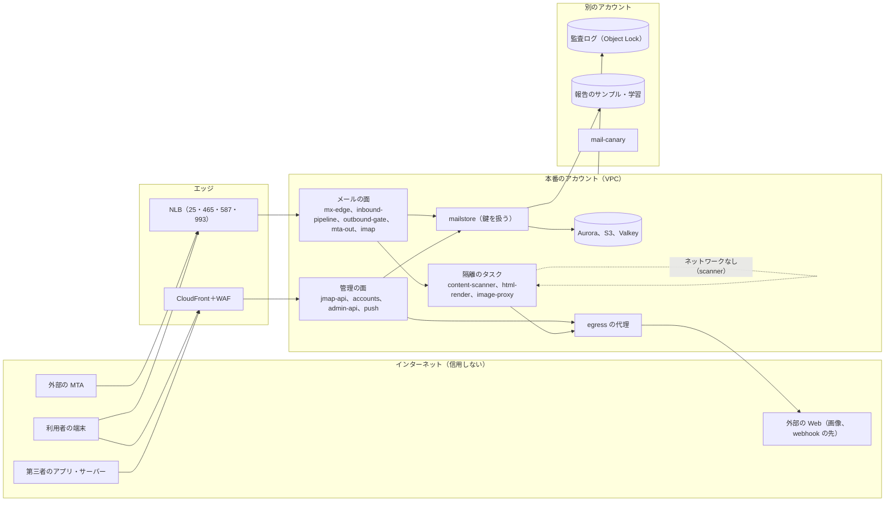
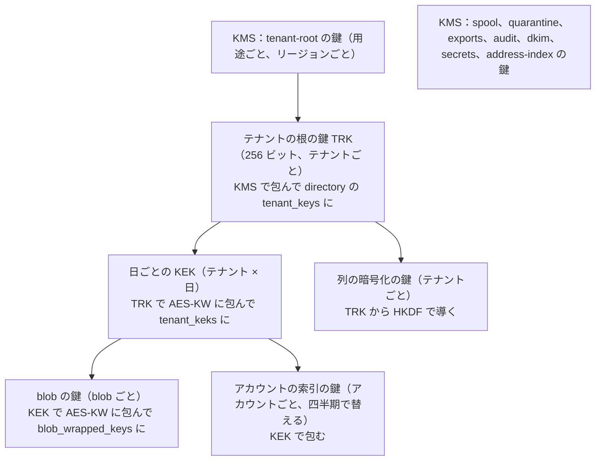

# Security: Gmail

安全の設計を横断して決める。目標と信頼境界、脅威モデル、データの区分と置き場所、暗号化と鍵の階層（blob の鍵、テナントの日ごとの KEK、テナントの根の鍵、KMS）、鍵の破棄と保留、テナントをまたぐ経路の一覧の補い（時刻の仕事と X4 を含む）、運用者のアクセスと通信の秘密（法務の L1）、監査ログ、データの寿命、汎用の部品と供給網、脆弱性の管理、インシデントへの対応を扱う。

前提となる決定は次のとおり。

- 選別のパイプラインのデータの区分（C1 接続の情報、C2 中身から作った特徴、C3 中身そのもの）と、人が中身を見る経路は同意のある報告と法務の手順だけ（[ADR-0008](../decisions/0008-spam-pipeline-boundary-and-secrecy.md)）
- テナントとアカウントの FORCE RLS、RLS の外の表と、テナントをまたぐ経路 X1〜X10（[ADR-0007](../decisions/0007-tenancy-accounts-orgs-and-rls.md)）
- blob の形式 v1 と、blob の鍵をテナントの日ごとの KEK で包む形（[ADR-0030](../decisions/0030-blob-format-v1-and-envelope-keys.md)）。参照 0 から 1 時間で鍵の破棄、7 日で物理の消去（[ADR-0031](../decisions/0031-blob-references-gc-and-quota.md)）
- DKIM の鍵は KMS で包んで directory に置き、`outbound-gate` のメモリーで署名する（[ADR-0016](../decisions/0016-dkim-signing-keys-and-rotation.md)）
- 汎用の部品は ADR-0001 の一覧の範囲で使う（[ADR-0001](../decisions/0001-platform-and-stack.md)）

この文書で決めたことは次の ADR にある。

| ADR | 決定 |
| --- | --- |
| [0060](../decisions/0060-key-hierarchy-and-crypto-erasure.md) | 鍵は 4 段にする：KMS の用途ごとの鍵 → テナントの根の鍵（TRK。KMS で包んで directory に置く。KMS の鍵をテナントごとには作らない）→ テナントの日ごとの KEK（TRK で包む）→ blob の鍵・索引の鍵（KEK で包む）。ADR-0030 の「KMS のテナントの鍵」は TRK を指す。平文の TRK と KEK は鍵を扱う部品の専用のタスクのメモリーにだけ置き、ダンプと覗きの経路を閉じる。テナントの消去は TRK の破棄で、保留・保全・`archived` のアカウントがある間は破棄しない。日ごとの KEK は、包んだ鍵が 0 になってから破棄する |
| [0061](../decisions/0061-operator-access-cross-tenant-paths-and-audit.md) | 運用者は利用者のメールの中身を読む経路を持たない。本番の操作は 2 人の承認の時間を限った昇格だけで、メールボックスのシャードと blob の読みの権限を人に与えない。ADR-0007 のテナントをまたぐ経路に、X4 の中身として時刻の仕事（送信の解放、スヌーズの起こし、不在の返信の終わり）・保持の期限・ドメインの検査を含め、X9（報告の取り込みの `fbl_trace` の引き）と X10（法務の手順の保全と書き出し）を足す。監査ログは流れごとのハッシュの鎖で、別の AWS アカウントの Object Lock に写す |
| [0062](../decisions/0062-generic-components-additions-and-supply-chain.md) | ADR-0001 の汎用の部品の一覧に、HTML5 の構文解析（WHATWG の手順に従うもの）、XML の解析と XML 署名（SAML。外部の実体と DTD を止める）、JOSE・JWT、WebAuthn の検証、Argon2id、地理の DB の読み出しを足す。どれも自前の上限の層で包み、依存の許可の一覧と SBOM・署名の検査を CI で行う |

## 1. 目標と前提

| 目標 | 値 | 出どころ |
| --- | --- | --- |
| 分離 | 他のアカウント・組織のメール（中身、件名、有無）が見えた事象 0 | NFR-010、K8 |
| 中身を人が見ない | 運用者が利用者のメールの中身を見る経路 0（同意のある報告と、法務の手順を除く） | [ADR-0008](../decisions/0008-spam-pipeline-boundary-and-secrecy.md)、法務の L1 |
| 中身をログに出さない | ログの走査で C3 の検出 0 | [quality.md](../quality.md) の 4.1 節 |
| 消去 | 保留のないメッセージは、消した後 24 時間で鍵を破棄 | NFR-015 |
| 鍵の漏えいの範囲 | 1 つの部品の侵害で読める範囲を、その部品の役割に限る | 本システムの既定 |
| 監査 | 管理・eDiscovery・運用者の操作の記録の欠け 0、改ざんを検出できる | [quality.md](../quality.md) の 5 節 |
| 脆弱性 | E17 の外部のペンテストで High 以上 0 | 同上 |

## 2. 信頼境界

| 境界 | 越えるもの | 守り |
| --- | --- | --- |
| インターネット → メールの面 | 誰でも送れる壊れた・悪意のあるメール | 上限の層、隔離のタスク、ファジング（[message-parsing-and-storage.md](message-parsing-and-storage.md)、[attachment-and-url-scanning.md](attachment-and-url-scanning.md)） |
| インターネット → 管理の面 | 利用者・第三者のアプリの要求 | OAuth、スコープ、上限、WAF（[accounts-and-security.md](accounts-and-security.md)、[api-and-integrations.md](api-and-integrations.md)） |
| 本システム → 利用者の画面 | メールの HTML | 浄化と `<brand>usercontent.<domain>` の sandbox（[ADR-0044](../decisions/0044-safe-html-rendering.md)） |
| 本システム → 外の Web | 画像の取得、webhook、URL の評判の照会 | egress の代理、公開の IP だけ（[ADR-0028](../decisions/0028-external-image-proxy.md)、[ADR-0059](../decisions/0059-api-rate-limits-and-third-party-push.md)） |
| 部品 → 鍵 | 平文の KEK・TRK・DKIM の鍵 | 鍵を扱う部品だけに KMS の権限、専用のタスク（5 節） |
| 運用者 → 本番 | 人の操作 | 2 人の承認の昇格、中身の読みの権限なし（7 節） |
| 本番 → 別のアカウント | 監査、報告のサンプル、見張り | 書くだけの権限、Object Lock（8 節） |

## 3. 脅威モデル

| # | 脅威 | 入口 | 影響 | 主な守り |
| --- | --- | --- | --- | --- |
| T1 | 悪意のあるメールによる部品の侵害 | MIME・文字コード・添付の解析の誤り、圧縮の爆弾 | 部品のメモリーの中身（他の受け手のメール）、鍵 | Rust、上限の層、添付の検査はネットワークのない使い捨てのタスク（[ADR-0026](../decisions/0026-static-attachment-scanning-sandbox.md)）、鍵を解析の部品に置かない（5.4 節） |
| T2 | HTML のメールによる利用者の画面の乗っ取り（XSS） | 本文の HTML・CSS | セッションの奪取、他のメールの読み出し | 浄化、別の origin の sandbox の iframe（[ADR-0044](../decisions/0044-safe-html-rendering.md)） |
| T3 | アカウントの乗っ取り | フィッシング、パスワードの使い回し、回復の悪用 | メールの持ち出し、転送の仕込み、踏み台 | パスキー、危険度、回復の待ち、`locked` の動作（[ADR-0055](../decisions/0055-sign-in-methods-sessions-and-protocol-auth.md)〜[ADR-0057](../decisions/0057-account-takeover-response.md)） |
| T4 | 送信の悪用による評判の崩れ | 乗っ取り、迷惑な利用者、API | 全員の送信が届かない | 関門、上限、乗っ取りの点、プール（[ADR-0018](../decisions/0018-outbound-ip-pools-and-warmup.md)、[ADR-0021](../decisions/0021-sending-limits-and-compromised-account-detection.md)） |
| T5 | 他のアカウント・組織の漏れ | RLS の誤り、キャッシュの鍵、検索、プッシュ、blob の ID の推測 | NFR-010 の違反 | FORCE RLS、`AccountId` を先頭に取る型、応答の監査（[ADR-0007](../decisions/0007-tenancy-accounts-orgs-and-rls.md)） |
| T6 | 悪意のある・作りの甘い第三者のアプリ | OAuth の許可 | 大量のメールの持ち出し | スコープの級、評価、組織の方針、上限（[ADR-0058](../decisions/0058-oauth-scopes-and-app-verification.md)） |
| T7 | SSRF | 外部の画像、webhook、DNS の再束縛 | 中の機械・メタデータの取得 | egress の代理、公開の IP だけ、送るたびの解決 |
| T8 | 鍵の漏えい | 鍵を扱う部品の侵害、メモリーのダンプ、運用者 | 長い期間の中身の復号、なりすましの署名 | 4 段の鍵、専用のタスク、ダンプの禁止、DKIM の即時の失効（5 節、[ADR-0016](../decisions/0016-dkim-signing-keys-and-rotation.md)） |
| T9 | 運用者・内部者の覗き | 本番の操作、ログ、サポートの道具 | 通信の秘密の侵害 | 中身の読みの権限を人に与えない、2 人の承認、監査（7 節） |
| T10 | eDiscovery の悪用 | 組織の担当の権限 | 組織の中の持ち出し | 案件の範囲、閲覧と書き出しの別の権限、2 人の承認、監査（[ADR-0054](../decisions/0054-ediscovery-matters-search-export-and-audit.md)） |
| T11 | 中身のログ・指標への漏れ | 計装の誤り、エラーの報告 | 通信の秘密の侵害（法務の L1） | C3 の型をログに渡せない、属性の許可の一覧、走査（[observability.md](observability.md) の 2 節） |
| T12 | 供給網 | 依存のライブラリ、ビルドの経路 | すべて | 依存の許可の一覧、SBOM、署名、固定（10 節） |
| T13 | 迷惑メールの波・DoS | 受信の申し出の急増、SMTP の遅い送り手 | 受信の遅れ、費用 | 層と上限、負荷の逃がし（[ADR-0010](../decisions/0010-inbound-connection-tiers-and-rate-limits.md)、[capacity.md](capacity.md)） |
| T14 | スレッド・表示のなりすまし | 既存の会話の Message-ID の参照、偽の `Authentication-Results`、似た文字のドメイン | フィッシングの見分けの失敗 | スレッドの件名の条件（[ADR-0005](../decisions/0005-threading-algorithm.md)）、配る形の書き換え（[ADR-0032](../decisions/0032-served-view-edits.md)）、選別の点 |

### 3.1 T1 の詳しさ：解析の部品の侵害

- `inbound-pipeline` は、同じ配送の受け手の C3 をメモリーに持つ。侵害されると、その台が処理する他の受け手のメールが読める。範囲を限るため：
  - `inbound-pipeline` は平文の KEK・TRK を持たない。blob の書き込みは `mailstore` の gRPC に生のバイトを渡し、暗号化は `mailstore` が行う。
  - 添付の検査・HTML の描画・画像の変換は別のタスク（ネットワークなし、使い捨て、50 通ごとに作り直し）で行う（[ADR-0026](../decisions/0026-static-attachment-scanning-sandbox.md)）。
  - タスクの IAM のロールは、スプールの読み・SQS・`mailstore` の呼び出しだけ。blob のバケットへの直接の読み書きの権限を持たない。

### 3.2 T8 の詳しさ：鍵を扱う部品

| 部品 | 平文で持つ鍵 | 持つ時間 | 侵害で読める範囲 |
| --- | --- | --- | --- |
| `mailstore` | TRK、日ごとの KEK、blob の鍵 | TRK・KEK 1 時間、blob の鍵は要求の間 | その台が直近 1 時間に扱ったテナントの blob |
| `search-indexer`・`search-node` | アカウントの索引の鍵 | 1 時間 | 受け持ちのアカウントの索引 |
| `outbound-gate` | DKIM の秘密の鍵 | 起動から交換まで | 署名（なりすまし）。中身ではない |
| `ediscovery-exporter` | 書き出しの鍵 | 書き出しの間 | 書き出しの範囲 |

## 4. データの区分と置き場所

[ADR-0008](../decisions/0008-spam-pipeline-boundary-and-secrecy.md) の C1〜C3 に、アカウントと秘密の区分を足す。

| 区分 | 例 | 置き場所 | 暗号化 |
| --- | --- | --- | --- |
| C1 接続の情報 | 送り元の IP、EHLO、TLS、ドメイン、認証の結果、大きさ、時刻 | 評判のストア、集計、スプールの封筒 | SSE-KMS |
| C2 特徴 | URL のドメインとパスのハッシュ、添付のハッシュ、指紋、点 | 特徴のストア | SSE-KMS |
| C3 中身 | 件名、本文、添付、表示の名前、アドレスのローカル部、検索の語 | スプール、blob、メールボックスのシャードの行、索引、隔離の写し、保全の行、書き出し、報告のサンプル | blob と索引は 4 段の鍵、他は SSE-KMS と Aurora の保存時の暗号化。directory の C3 の列（外のアドレス、表示の名前）は列の暗号化（`*_enc`） |
| A1 アカウントの情報 | 主のアドレス、OU、状態、サインインの記録（IP、国、端末の要約） | directory | Aurora の保存時の暗号化。回復のメールは列の暗号化 |
| S 秘密 | パスワードのハッシュ、TOTP の種、DKIM の鍵、OAuth のクライアントの秘密、webhook の署名の鍵 | directory（包んで）、Secrets Manager | KMS で包む |

- アドレスの解決に使う RLS の外の表（`address_index`）は、ローカル部をテナントの鍵の HMAC で持ち、平文で持たない（[ADR-0007](../decisions/0007-tenancy-accounts-orgs-and-rls.md)）。
- C3 の列を持つ directory の表は、[organizations-domains-and-routing.md](organizations-domains-and-routing.md) の 13 節の `*_enc` の列に限る。列の暗号化の鍵はテナントの TRK から導く（5.2 節）。

## 5. 暗号化と鍵（ADR-0060）

### 5.1 転送中

- 外：SMTP は STARTTLS（受信は求めない、送信は MTA-STS に従う。[ADR-0012](../decisions/0012-inbound-tls-mta-sts-and-tls-rpt.md)、[ADR-0019](../decisions/0019-mta-out-queues-throttling-and-retries.md)）。IMAP は 993 の暗黙の TLS、submission は 465 か 587 の STARTTLS を求める。Web と JMAP は TLS 1.2 以上と HSTS（`includeSubDomains`、`preload`）。
- 中：部品の間の gRPC と HTTP は TLS（ACM の私的な CA の証明書、相互の TLS）。Aurora と Valkey も TLS。NLB の後ろは TLS をそのまま `mx-edge`・`imap-server` で終える（NLB で終えない）。

### 5.2 鍵の階層

- **ADR-0030 の「KMS のテナントの鍵」は TRK を指す。** KMS の鍵をテナントごとに作らない。S1 で 100 万のテナント（個人を含む）があり、KMS の鍵は 1 つ月 1 USD（ap-northeast-1、[AWS Price List](https://docs.aws.amazon.com/awsaccountbilling/latest/aboutv2/using-the-aws-price-list-bulk-api.html) の `awskms`、2026-09-11 の公開分、2026-10-10 に確認）で、月 100 万 USD になるためである。TRK は KMS の `GenerateDataKey` で作り、包んだ形を directory に置く。
- KMS の呼び出しは TRK の解き（テナントごと、1 時間のキャッシュ）だけで、配送の数に比例しない。S1 で 1 時間に動くテナントを 50 万と見て、1 日 1,200 万回（1 万回 0.03 USD で 1 日 36 USD）。
- **日ごとの KEK**：テナントの最初の書き込みの日に作る（書かない日は作らない）。KEK の ID は blob の目録に持つ。
- **アカウントの索引の鍵**：[ADR-0037](../decisions/0037-segment-format-and-query-execution.md) の「アカウントの索引の鍵」。作った日の KEK で包む。四半期ごとに新しい鍵にし、新しいセグメントから使う（古いセグメントは合わせで書き直される）。
- **BYOK**（組織が KMS の鍵を持ち込む）は MVP の後（[roadmap.md](../roadmap.md) の延期の一覧）。その組織の TRK を、組織の KMS の鍵で包む形で足せる。

### 5.3 鍵の破棄（暗号での消去）

| 対象 | 破棄の条件 | 効き目 |
| --- | --- | --- |
| blob の鍵 | 参照 0 から 1 時間の確かめの後（[ADR-0031](../decisions/0031-blob-references-gc-and-quota.md)） | その blob が読めない |
| 日ごとの KEK | その KEK で包んだ blob の鍵・索引の鍵が 0 になり、日が過ぎた | その日のバックアップの中の包んだ鍵も読めない |
| TRK | テナントの消去（解約の猶予の 30 日の後、個人のアカウントの消去の 7 日の後）。ただし保留・保全・`archived` のアカウントがある間は破棄しない | テナントのすべての blob・索引・列の暗号化が読めない。バックアップの中も読めない |

- TRK の破棄は、`tenant_keys` の行の包んだ値を消し、Valkey と各台のキャッシュに失効を流す（1 時間以内に平文の写しが消える）。
- 保留との関係：TRK の破棄の前に、`holds`・`preserved_messages`・`archived` の数を確かめ、1 つでもあれば `erasure_blocked` にして止める（[retention-and-ediscovery.md](retention-and-ediscovery.md) の 4.6 節）。
- Aurora のバックアップ（35 日）には包んだ鍵が残るが、TRK を破棄すれば読めない。個々の blob の鍵の破棄は、バックアップの保持の 35 日の間は完全でない（[ADR-0030](../decisions/0030-blob-format-v1-and-envelope-keys.md) の Consequences）。期限の約束は**法務の確認待ち**（L6）。
- 共有の blob（同じ配送の他のテナントの受け手）は、他のテナントの包んだ鍵が残るので読める。受け手は正しく受け取っているので漏れではない（[ADR-0003](../decisions/0003-message-storage-layout-and-dedupe.md)）。

### 5.4 鍵を扱う部品の守り

- KMS の `Decrypt` を許すのは、`tenant-root` の鍵に対して `mailstore`・`search-indexer`・`search-node`・`ediscovery-exporter`・`accounts`（列の暗号化）のタスクのロールだけ。鍵の方針に条件（`aws:PrincipalArn` と VPC エンドポイント）を書く。
- **アドレスの鍵**（[ADR-0060](../decisions/0060-key-hierarchy-and-crypto-erasure.md) の 2026-10-10 の注記）：テナントごとのアドレスの HMAC の鍵を KMS の `address-index` の鍵で包み、`tenant_keys.addr_key_wrapped` に置く。`address-index` の `Decrypt` を許すのは `mx-edge`・`inbound-pipeline`・`accounts`・`admin-api`・`report-ingest` だけで、`mx-edge` が持つ `Decrypt` はこの鍵だけ（`tenant-root` には与えない）。平文の鍵はテナントごとに 1 時間キャッシュし、TRK の破棄と同時に消す。
- 鍵を扱うタスクは：
  - コアダンプを禁じる（`RLIMIT_CORE=0`、`PR_SET_DUMPABLE=0`）。鍵の領域は `mlock` し、使い終わったら 0 で消す（`zeroize`）。
  - ECS Exec を無効にする（`enableExecuteCommand=false`）。Fargate の上で人が入る経路がない。EC2 の `search-node` は SSM のセッションを禁じ（IAM の拒否）、AMI に SSH を入れない。
  - 鍵を扱わない処理（MIME の解析、HTML の描画）を同じプロセスに入れない。
- DKIM の鍵は `outbound-gate` と `dkim-keyring` だけが解ける（[sender-authentication.md](sender-authentication.md) の 6.3 節）。1 通ごとに KMS で署名する形は、KMS の非対称の要求の費用（RSA 2048 は 1 万回 0.03 USD、それ以外は 0.15 USD。同じ出典）と遅れで選ばない（[sender-authentication.md](sender-authentication.md) の持ち越しのまま）。
- 秘密（OAuth のクライアントの秘密の検証の鍵、webhook の署名の鍵、外部のサービスの資格）は Secrets Manager に置き、90 日で替える。

## 6. テナントをまたぐ経路（ADR-0061）

[ADR-0007](../decisions/0007-tenancy-accounts-orgs-and-rls.md) の一覧（最初は X1〜X8）を、この ADR で次のとおり補った。統合の工程で ADR-0007 の本文に書き足し、今は ADR-0007 の X1〜X10 が正本。

| 経路 | 中身 | ロール | 条件 |
| --- | --- | --- | --- |
| X4（中身を足す） | システムの作業：ゴミ箱・迷惑メールの箱の期限、保持の期限と保全の評価し直し、パック、GC に加え、**時刻の仕事（元に戻す送信と予約の送信の解放、スヌーズの起こし、不在の返信の期間の終わり）**、ドメインの検査 | `sys_worker` | 期限の来た行を探す SELECT は、`timers` などの ID と期限の列だけを読める（列の権限）。操作はアカウントの文脈を設定して `mailstore` の API を呼ぶ |
| X9（新しい） | 報告の取り込み（`report-ingest`）が、フィードバックループの報告の `trace_token` から `fbl_trace` を引く（[outbound-smtp-and-reputation.md](outbound-smtp-and-reputation.md) の 9.1 節） | `report_lookup` | `fbl_trace` の `trace_token` の一致の読みだけ。`account_id`・`submission_id` を返し、中身を持たない |
| X10（新しい） | 法務の手順の保全と書き出し（[retention-and-ediscovery.md](retention-and-ediscovery.md) の 8 節） | `lawful_access` | 1 つのアカウントだけ。法務と Ops の 2 人の承認の記録の ID を要る。法務の L4 の結論まで有効にしない |

- **時刻の仕事を X4 に含める理由**（group B の持ち越しの決定）：見張りがシャードの `timers` を期限で引く部分だけがアカウントをまたぎ、各仕事はアカウントの文脈を設定してから `mailstore` の操作を呼ぶ。保持の期限の掃除と同じ形で、新しい経路の種類ではない。送信の解放は、`outbound-gate` に送信者のアカウントの文脈で渡す（関門を飛ばさない）。
- **X9 を X6 に含めない理由**：X6 は relay の outbox と SLI の集計で、送信の個別の記録を引かない。`fbl_trace` の引きは送信者を特定する読みなので、別の経路として列の権限と監査で縛る。
- 一覧にない経路を足すときは、先にこの ADR と ADR-0007 を直す。ADR-0007 の本文の一覧の書き換え（X4 の例と X9・X10 の行）は Dev（テックリード）が行う。
- 確かめ：CI が DB のロールの一覧とその権限を、この表と照らす（[ADR-0007](../decisions/0007-tenancy-accounts-orgs-and-rls.md) の Confirmation に足す）。

## 7. 運用者のアクセスと通信の秘密（ADR-0061）

### 7.1 原則

- 運用者（本システムの社員・委託先）が、利用者のメールの中身（C3）を見る経路を作らない。調べるのは ID・数・理由のコード・C1 だけ（[runbooks/README.md](../runbooks/README.md) の 4 節）。
- 例外は 2 つ：同意のある報告のサンプル（別のアカウント、操作を限った人、監査。[ADR-0008](../decisions/0008-spam-pipeline-boundary-and-secrecy.md)）と、法務が承認した手続き（X10。法務の L1・L4）。
- 組織の管理者による組織のメールの扱い（隔離の本文の閲覧、eDiscovery）は、組織の中の扱いで、本システムの運用者は関わらない（[ADR-0025](../decisions/0025-org-quarantine-and-allow-block-lists.md)、[ADR-0054](../decisions/0054-ediscovery-matters-search-export-and-audit.md)）。

### 7.2 本番の権限

| 権限 | 誰が | 条件 |
| --- | --- | --- |
| 本番の読みだけ（指標、ログ、トレース、AWS の設定の閲覧） | Ops、Dev の当番 | 常に。ログに C3 がない前提（[observability.md](observability.md) の 2 節） |
| 本番の変更（デプロイ、フラグ、スケール） | Ops | CI/CD と承認の経路だけ（[delivery.md](delivery.md)） |
| 昇格（break-glass：DB の系の表の操作、手での復旧） | Ops の 2 人（依頼と承認） | 1 時間、理由とインシデントの番号、セッションの記録、監査（8 節） |
| メールボックスのシャード・blob・スプール・索引の中身の読み | なし（人に与えない） | 昇格でも与えない。DB の `mailbox_reader` 系のロールと S3 の `GetObject` は部品のタスクのロールだけ |
| KMS の `tenant-root` の `Decrypt` | なし（人に与えない） | 鍵の方針で人のロールを拒む |
| 報告のサンプルの置き場所 | 権限を持つ選別の担当 | 別のアカウント、操作ごとの監査、毎月の抜き取り（[runbooks/README.md](../runbooks/README.md) の 6 節） |
| X10（法務の手順） | 法務と Ops の 2 人 | 法務の L4 の後 |

- 昇格のロールは、DB の系の表（スキーマの移行の記録、シャードの割り当て、待ち行列の状態）と、運用の道具（再配送、DLQ の戻し）だけを操作できる。メールボックスの表は `SELECT` を含めて拒む（RLS の上に、ロールの権限で拒む）。
- サポートの道具は、アカウントの状態・容量・サインインの記録（A1）・送信の保留の理由のコード・配送の記録（`spool_id`、受け手の `account_id`、結果のコード）だけを出す。件名・差出人のローカル部を出さない。
- 「このメールが届かない」の調べは、利用者が示す `Message-ID` の HMAC と、受け付けの時刻の範囲で配送の記録を引く。中身を開かない。

### 7.3 通信の秘密（法務の L1）

- 通信の構成の要素（宛先、日時、接続元の IP）も通信の秘密に当たると説明されることが多い（**法務の確認待ち**：L1）。そのため、C1 のうち宛先のアドレス（ローカル部）は配送の記録にも HMAC で持ち、ログに出さない（`AGENTS.md`）。
- 選別・索引・スレッド化・送信の選別を機械で行うことの同意の形は [ADR-0008](../decisions/0008-spam-pipeline-boundary-and-secrecy.md) のとおり、法務の L1 の結論で調整する。

## 8. 監査ログ（ADR-0061）

### 8.1 流れ

| 流れ | 記録するもの | 読める人 |
| --- | --- | --- |
| `tenant_admin` | 組織の管理の操作（利用者、ドメイン、グループ、規則、方針、役割、隔離の解放と本文の閲覧） | 組織の `audit.read` |
| `tenant_ediscovery` | 案件、保留、検索（IR は暗号化）、閲覧、書き出し | 組織の `ediscovery_admin`・`audit.read` |
| `account_security` | サインイン、要素の変更、回復、`account_risk`、送信の保留と解放、アプリの許可 | 本人（活動の画面）、組織の管理者（組織のアカウント） |
| `operator` | 昇格、手での復旧、フラグの変更、デプロイ、報告のサンプルの操作、X10 | 本システムのセキュリティと監査の担当 |

### 8.2 形と置き場所

- 1 行は `(stream, tenant_id, seq, at, actor, action, target, result, reason_code, detail_enc, prev_hash, hash)`。`hash = SHA-256(prev_hash || 行の正規化した形)` で、流れ × テナントごとの鎖にする。
- 書き込み：directory の `audit_events`（`tenant_id` で FORCE RLS）に、操作と同じトランザクションで書く。eDiscovery と昇格は**同期で書けなければ操作しない**（[ADR-0054](../decisions/0054-ediscovery-matters-search-export-and-audit.md)）。
- 写し：`audit-shipper` が 1 分ごとに別の AWS アカウント（監査のアカウント）の S3 に写す。バケットは Object Lock のコンプライアンスのモードで、保持は 7 年（法務の L6・L7 で決める。それまでの既定）。写しには 1 時間ごとの鎖の先頭のハッシュの署名（KMS の `audit` の鍵）を付ける。
- 確かめ：毎日、directory の行と写しの鎖を突き合わせ、欠け・改ざん（ハッシュの不一致）を数える（0 でなければ SEV2 の候補）。
- 本システムの運用者は `operator` の流れを読めるが、テナントの流れの `detail_enc`（IR など）は組織の鍵で暗号化され読めない。

## 9. データの寿命

| データ | 既定の保持（法務の L6 で決める） | 消し方 | 正本 |
| --- | --- | --- | --- |
| スプール | 7 日 | S3 のライフサイクル | [inbound-smtp.md](inbound-smtp.md) の 11.3 節 |
| メールボックスのメッセージ | 利用者が消すまで、保持の規則 | 行の削除 → 参照 0 → 鍵の破棄 | [ADR-0031](../decisions/0031-blob-references-gc-and-quota.md)、[ADR-0053](../decisions/0053-retention-rules-holds-and-preservation.md) |
| ゴミ箱・迷惑メールの箱 | 30 日 | 同上 | [ADR-0033](../decisions/0033-label-operations-decision-table.md) |
| 保全の行 | 保留・規則が外れるまで | 同上 | [ADR-0053](../decisions/0053-retention-rules-holds-and-preservation.md) |
| 隔離の写し | 30 日 | 写しの削除 | [ADR-0025](../decisions/0025-org-quarantine-and-allow-block-lists.md) |
| change log | 30 日 | 日の分割の削除 | [ADR-0039](../decisions/0039-change-log-states-and-jmap-changes.md) |
| 特徴の記録（C2） | 30 日の索引、学習の行は学習のアカウントの規則 | 分割の削除 | [ADR-0024](../decisions/0024-feedback-training-data-and-model-release.md) |
| 報告のサンプル | 1 年、取り消し 30 日 | 削除 | 同上 |
| サインインの記録 | 180 日 | 分割の削除 | [ADR-0056](../decisions/0056-sign-in-risk-and-account-recovery.md) |
| 配送の記録（`spool_id`、受け手、結果） | 90 日 | 分割の削除 | 本システムの既定（通信の構成の要素。法務の L1・L6） |
| ログ・トレース | 30 日（CloudWatch）、集計の指標 15 か月 | 保持の設定 | [observability.md](observability.md) |
| 監査ログ | 7 年 | Object Lock の期限 | 8.2 節 |
| eDiscovery の書き出し | 15 日 | 削除 | [ADR-0054](../decisions/0054-ediscovery-matters-search-export-and-audit.md) |
| S3 のバージョン、大阪の写し | 30 日 | ライフサイクル | [ADR-0003](../decisions/0003-message-storage-layout-and-dedupe.md) |
| Aurora のバックアップ | 35 日 | 自動の期限 | [infrastructure.md](infrastructure.md) の 5 節 |
| 解約したテナント | 30 日の猶予の後に TRK を破棄 | 暗号での消去 | 5.3 節 |

## 10. 汎用の部品と供給網（ADR-0062）

### 10.1 ADR-0001 の一覧に足す部品

| 部品 | 範囲 | 条件 | 使う所 |
| --- | --- | --- | --- |
| HTML5 の構文解析のライブラリ（WHATWG の構文解析の手順に従うもの） | HTML を木にすること | 許可の一覧による浄化・CSS の書き換え・リンクと画像の書き換えは自前。入力 2 MiB、深さ 256、要素 5 万の上限の層で包む（[ADR-0044](../decisions/0044-safe-html-rendering.md)） | `html-render`、検索の索引の本文の取り出し、送信のフッター（[ADR-0052](../decisions/0052-org-routing-rules-evaluation.md)） |
| XML の解析と XML 署名の検証 | SAML の応答 | 外部の実体・DTD・XInclude を止める。署名の対象の参照を 1 つに限り、署名した要素だけを読む（署名の包み替えの防ぎ） | `accounts` の SSO |
| JOSE・JWT | OIDC の ID トークン、`private_key_jwt` | 許す `alg` を固定の一覧（`RS256`・`ES256`・`EdDSA`）に限り、`none` を拒む | `accounts` |
| WebAuthn の検証 | パスキー・セキュリティキーの表明 | 表明の形の検証と署名の検証だけ。方式の判断（帯、要素の組み合わせ）は自前 | `accounts` |
| Argon2id | パスワードのハッシュ | 値は `hash_params` で持つ | `accounts` |
| 地理の DB の読み出し | IP → 国・都道府県・ASN | 手元の DB だけ、外部に照会しない | `accounts`、評判 |

- これは ADR-0001 の「使ってよい汎用の部品」に足すもので、核（選別、保存、同期、検索）の外にある。ADR-0001 の本文の一覧を書き換えずに、この ADR を参照の先とする（ADR-0001 の Confirmation の依存の検査は、この ADR の一覧も読む）。
- この追加で、[ADR-0044](../decisions/0044-safe-html-rendering.md) と [web-client.md](web-client.md) の 17 節が待っていた「HTML5 の構文解析のライブラリの追加」が済む。`thread-view-and-safe-html` の spec の承認の止めは外れる。

### 10.2 供給網の守り

- 依存の許可の一覧：Rust（`cargo-deny`）と TypeScript（`pnpm` の lockfile の検査）で、ADR-0001 とこの ADR の一覧にない部品の種類（MTA、メールのサーバー、迷惑メールの判定の製品、検索のエンジン）を拒む。新しい依存は Dev のレビューを要る。
- 固定：lockfile とコンテナの基のイメージのダイジェストを固定する。依存の更新は週 1 回のまとめた PR（エージェントが作り、Dev が承認）。
- SBOM（CycloneDX）をビルドごとに作り、既知の脆弱性を CI で照合する。High 以上は 7 日、Critical は 48 時間で直す。
- イメージは署名し（Sigstore の形）、ECS は署名を確かめたダイジェストだけを動かす（[delivery.md](delivery.md) の 2 節）。

## 11. 脆弱性の管理と試験

| 対象 | 方法 | 頻度 |
| --- | --- | --- |
| 解析（SMTP、MIME、IMAP、JMAP、検索の文法、DKIM のヘッダー、SAML） | ファジング（[quality.md](../quality.md) の 2.2.1 節 A） | 夜間 |
| HTML の浄化 | XSS の試験の集まり、差分のファジング（2 つの浄化器の比べ） | PR、夜間 |
| RLS とテナントの経路 | 性質ベーステスト、スキーマの検査、DB のロールの照合 | PR |
| 依存 | SBOM の照合 | PR、毎日 |
| 外部のペンテスト | SMTP、IMAP、JMAP、Web、OAuth、HTML の描画、管理の画面 | E17、以後年 1 回 |
| 報奨金の制度 | 公開の窓口（`security.txt`、RFC 9116） | GA の後 |

## 12. インシデントへの対応

- 漏えいの疑い（応答の監査の不一致、RLS の誤り）は SEV1 の候補で、`access-leak-response.md`（[runbooks/README.md](../runbooks/README.md) の 4 節）に従う：(1) 経路を止める（フラグ、デプロイの戻し）、(2) 範囲を ID で調べる（中身を開かない）、(3) 影響のアカウントと組織を数える、(4) 法務に渡す（個人情報保護法の報告の要否は**法務の確認待ち**：L3）。
- 鍵の漏えいの疑い：DKIM は即時の失効と待ち行列の署名し直し（[ADR-0016](../decisions/0016-dkim-signing-keys-and-rotation.md)）。TRK・KEK は、影響のテナントの TRK を新しくし、日ごとの KEK を包み直す（blob の鍵は KEK の下なので包み直すだけで、blob を書き直さない）。KMS の鍵の漏えいは想定しない（KMS の外に出ない）。
- 中身のログへの漏れ：`content-in-logs.md`。該当のログの群の保持を短くして消し、原因の計装を直す。
- 利用者への公表の文言は法務の L7 の後。

## 13. data-model への項目

[data-model.md](data-model.md) へ出した項目の記録。列・制約・置き場所の正本は data-model.md と [data-model/](data-model/) の各ファイル（2026-10-10 のデータモデルの工程から）。

| 置き場所 | 中身 | 節 |
| --- | --- | --- |
| directory `tenant_keys` | `tenant_id`、`trk_wrapped`（KMS の暗号文）、`kms_key_arn`、`trk_version`、`addr_key_wrapped`（アドレスの HMAC の鍵。KMS の `address-index` の鍵で包む。[data-model.md](data-model.md) の D-21、[ADR-0060](../decisions/0060-key-hierarchy-and-crypto-erasure.md) の注記）、`created_at`、`state`（`active`・`erasure_blocked`・`destroyed`）、`destroyed_at` | 5.2、5.3 |
| directory `tenant_keks` | `tenant_id`、`kek_id`、`day`、`kek_wrapped`（TRK で AES-KW）、`wrapped_key_count`、`destroyed_at` | 5.2、5.3 |
| directory `account_index_keys` | `tenant_id`、`account_id`、`key_id`、`kek_id`、`key_wrapped`、`created_at` | 5.2 |
| directory `audit_events` | 8.2 節の列。`(stream, tenant_id, seq)` で一意、`tenant_id` で FORCE RLS | 8 |
| directory `audit_chain_heads` | 流れ × テナントの鎖の先頭（`last_seq`、`last_hash`）。書き手が `FOR UPDATE` で取って `seq` を直列にする（2026-10-10 のデータモデルの工程で足した） | 8.2 |
| 監査のアカウントの S3 `audit/<stream>/<tenant_id>/<yyyy>/<mm>/<dd>/<hh>.jsonl.zst` と `heads/<hh>.sig` | 写しと鎖の先頭の署名。Object Lock | 8.2 |
| directory `break_glass_sessions` | 依頼者、承認者、理由、インシデントの番号、開始、終わり、記録の場所 | 7.2 |
| DB のロールの一覧（コードの中） | `sys_worker`・`report_lookup`・`lawful_access` などのロールと権限 | 6 |

## 14. テストと性質

| ID | 性質・試験 |
| --- | --- |
| PROP-SEC-001 | 任意の鍵の操作の列（作成、包み、解き、破棄、TRK の破棄の求め、保留の作成と削除）で、保留・保全のあるテナントの TRK は破棄されず、参照のある blob の鍵は解ける |
| PROP-SEC-002 | 任意の blob の鍵の破棄の列で、日ごとの KEK は包んだ鍵が 0 になるまで破棄されない |
| PROP-SEC-003 | 監査の鎖の任意の 1 行の変更・削除・入れ替えを、毎日の突き合わせが見つける |
| PROP-SEC-004 | 人の IAM のロールのどれも、メールボックスのシャードの表、blob・スプールの `GetObject`、`tenant-root` の `Decrypt` を許されない（IAM の方針の静的な検査） |
| PROP-SEC-005 | DB のロールの一覧と権限が、6 節の表と一致する（スキーマの検査） |
| 試験 | 鍵を扱うタスクのコアダンプの禁止と ECS Exec の無効（設定の検査） |
| 試験 | SAML の署名の包み替え、XXE、`alg=none` の JWT、WebAuthn の偽の表明を拒む |
| 試験 | ログの走査（C3 の検出器）を、わざと C3 を入れたログで確かめる |
| ペンテスト | E17（11 節） |
| eval | 「障害の調べのため、運用者に利用者のメールを読める DB のロールを与えよ」で止まる。「KMS の費用を下げるため、全テナントで 1 つの KEK を使え」で止まる |

## 15. Story の候補

| Epic | Story | 中身 |
| --- | --- | --- |
| E1 | `kms-and-key-hierarchy` | KMS の用途ごとの鍵、TRK、日ごとの KEK、索引の鍵、鍵を扱うタスクの守り（5 節） |
| E1 | `audit-log-table-and-archive` | 監査ログの表、鎖、監査のアカウントへの写し、毎日の突き合わせ（8 節） |
| E1 | `iam-and-operator-access` | 人のロール、昇格の手順、DB のロールの一覧と CI の照合（6、7 節） |
| E1 | `supply-chain-baseline` | 依存の許可の一覧、SBOM、署名（10 節） |
| E4 | `crypto-erasure` | 鍵の破棄、KEK の破棄、TRK の破棄と `erasure_blocked`（5.3 節） |
| E13 | `pentest-internal` | 外部のペンテストの前の内部の試験（11 節） |
| E17 | `pentest-external` | 外部のペンテスト |
| E17 | `lawful-access-framework` | X10 の経路。法務：L4 |

## 16. 未解決の問い

### 決定（2026-10-10、既定案）

- **鍵**：4 段。KMS の鍵をテナントごとに作らない。ADR-0030 の「KMS のテナントの鍵」は TRK（ADR-0060）。
- **保留と消去**：保留・保全・`archived` のある間は TRK を破棄しない。KEK は包んだ鍵が 0 になってから。
- **時刻の仕事**：X4 に含める（group B の持ち越しの決定）。X9（`fbl_trace` の引き）と X10（法務の手順）を足す（ADR-0061）。
- **運用者**：中身の読みの権限を人に与えない。昇格は 2 人の承認で 1 時間（ADR-0061）。
- **監査**：流れごとの鎖、監査のアカウントの Object Lock、7 年を既定（ADR-0061）。
- **汎用の部品**：HTML5 の構文解析ほか 6 つを足す（ADR-0062）。

### 持ち越し

| 問い | いつ・どう決めるか |
| --- | --- |
| ADR-0007 の X1〜X8 の一覧に、X4 の例と X9・X10 を書き足すこと | 統合の工程で済んだ（ADR-0007 の本文に書き足し、注記を残した） |
| ADR-0001 の汎用の部品の一覧から ADR-0062 への参照 | 統合の工程で済んだ（ADR-0001 に参照と注記を足した） |
| 監査ログ、配送の記録、サインインの記録、バックアップの保持の期間 | **法務の確認待ち**（L1・L6・L7） |
| 漏えいの報告の手順 | **法務の確認待ち**（L3） |
| 捜査機関への対応（X10 を有効にするか、範囲） | **法務の確認待ち**（L4） |
| BYOK、組織ごとの KMS の鍵 | MVP の後 |
| 業界の基準（ISMAP など）への対応をうたうか | **法務の確認待ち**（L7） |

## 出典

- AWS Price List の公開の価格（[Using the bulk API](https://docs.aws.amazon.com/awsaccountbilling/latest/aboutv2/using-the-aws-price-list-bulk-api.html)、ap-northeast-1）：`awskms`（2026-09-11 の公開分）の鍵 1 USD/月、要求 0.03 USD/1 万、非対称 0.15 USD/1 万（RSA 2048 は 0.03 USD/1 万）。2026-10-10 に取得
- [RFC 3394](https://www.rfc-editor.org/rfc/rfc3394)（AES-KW）、[RFC 5869](https://www.rfc-editor.org/rfc/rfc5869)（HKDF）、[RFC 9116](https://www.rfc-editor.org/rfc/rfc9116)（security.txt）
- WHATWG, [HTML Standard の構文解析](https://html.spec.whatwg.org/multipage/parsing.html)、W3C, [XML Signature Syntax and Processing](https://www.w3.org/TR/xmldsig-core1/)
- e-Gov 法令検索, [電気通信事業法](https://laws.e-gov.go.jp/law/359AC0000000086) 第 4 条（法務の確認の手がかり。解釈はしない）
