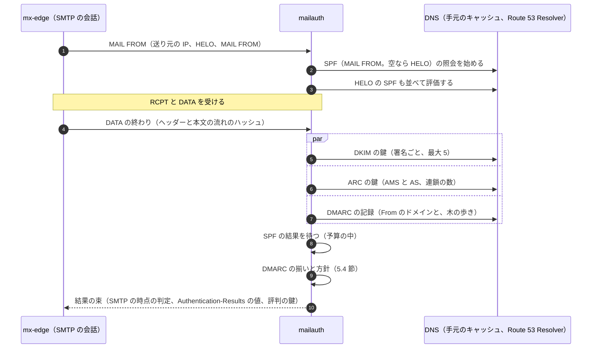
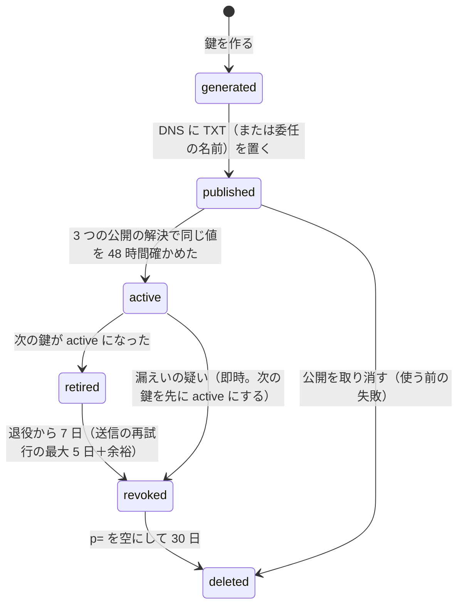

# Sender authentication: Gmail

送信者の認証を決める。受信の SPF・DKIM・ARC の検査と DMARC の評価と方針の当て方、`Authentication-Results` の書き方、送信の DKIM の署名と鍵の交換、転送の ARC の封印、DMARC の集計の報告の送受、BIMI の記録、一括の配信停止（RFC 8058）の受信と送信の扱い、大量の送信者への要件の当て方を扱う。

前提となる決定は次のとおり。

- SMTP の時点で拒む認証の失敗は、DMARC の失敗で方針が `p=reject` のもの（転送の ARC で救えないもの）だけ。`p=quarantine` は受け付けて迷惑メールの箱に入れる（[ADR-0002](../decisions/0002-accept-then-filter.md)）
- 評価と署名は自前の `crates/mailauth` に置く。暗号と DNS の解決は汎用の部品、DNSSEC の検証は Route 53 Resolver（[ADR-0001](../decisions/0001-platform-and-stack.md)）
- 受け取ったバイトは不変の blob に置き、本システムが足すヘッダー（`Authentication-Results`、`ARC-*`）は受け手ごとの前置きに持つ（[ADR-0003](../decisions/0003-message-storage-layout-and-dedupe.md)）
- 認証の結果は C1、認証済みのドメインは評判の鍵になる（[ADR-0008](../decisions/0008-spam-pipeline-boundary-and-secrecy.md)）
- 一括の配信停止のボタンは、DKIM がそのヘッダーを含んで通るときだけ出し、本システムの egress から POST する（[architecture/README.md](README.md) の 6 節、法務の L2 の (d)）

この文書で決めたことは次の ADR にある。

| ADR | 決定 |
| --- | --- |
| [0014](../decisions/0014-auth-evaluation-and-authentication-results.md) | SPF は MAIL FROM で非同期に始め、DKIM・ARC・DMARC は DATA の終わりに評価する。上限は SPF の DNS の照会 10 回・void 2 回、DKIM の署名の検証 5 つまで、ARC の連鎖 50 まで、全体で DATA の終わりの予算の中。DNS の一時の失敗は `temperror` で、拒否にしない。結果は前置きの `Authentication-Results`（authserv-id は `mx.<brand>.<domain>`）に書き、blob の中の同じ authserv-id の偽の結果は選別の点にする |
| [0015](../decisions/0015-dmarc-policy-and-organizational-domain.md) | DMARC は RFC 9989 に従い、組織のドメインを DNS の木の歩き（最大 8 回の照会）で決める。RFC 7489 の公開接尾辞の一覧による結果は 90 日のあいだ影で比べる。`t=y` は 1 段弱い方針で当て、古い `pct=0` は `t=y` とみなし、他の `pct` は無視する。方針の当て方は決定表（DT-AUTH-001）で、`reject` は ARC の信頼できる封印か組織の方針の組で救えなければ SMTP の時点で 550 5.7.26 |
| [0016](../decisions/0016-dkim-signing-keys-and-rotation.md) | 送信はすべて、From に揃うドメインと、本システムの送信の基盤のドメインの 2 つで署名し、それぞれ RSA-2048 と Ed25519 の 2 つの署名を付ける。鍵は署名の部品の中で作り、KMS で包んで directory に置き、署名は部品のメモリーの中で行う。鍵は半年ごとに、作成・公開・有効・退役・失効の段で入れ替える。組織のドメインは CNAME の委任で鍵の交換を本システムが持つ |
| [0017](../decisions/0017-arc-sealing-trusted-sealers-and-dmarc-reports.md) | 本システムが転送・展開して外へ出すメールと、組織のゲートウェイへ渡すメールに ARC の組を付ける。DMARC の失敗を ARC で救うのは、連鎖が `cv=pass` で、信頼の一覧の封印者が DMARC か揃った認証の通過を記録したときだけ。DMARC の集計の報告は RFC 9990 の形で日ごとに送り（送るのは法務の L1 の後）、失敗の報告（RFC 9991）は送らない。受け取った報告は上限つきで解析し、組織ごとの数だけを残す |

## 1. 範囲

- 扱う：
  - SPF（RFC 7208）、DKIM（RFC 6376、RFC 8463、RFC 8301）、ARC（RFC 8617）の検査、DMARC（RFC 9989。RFC 7489 の記録との互換）の評価と方針の当て方
  - `Authentication-Results`（RFC 8601）の書き方と、偽の結果の扱い
  - 認証の DNS の照会とキャッシュ
  - 送信の DKIM の署名、鍵の作成・公開・交換・失効、組織のドメインの委任
  - ARC の封印と、信頼する封印者の一覧
  - DMARC の集計の報告の送信（受信の側）と受け取り（本システムと組織のドメイン）
  - BIMI の記録（表示は MVP の後）
  - 一括の配信停止（RFC 8058）の受信の側の確かめと、送信の側の署名
  - 大量の送信者への要件（受信の側）の当て方
- 扱わない：
  - SMTP の会話の中のどこで評価を待つか、予算と並べ方（[inbound-smtp.md](inbound-smtp.md) の 9 節）
  - 認証の結果を点に変える重み（[spam-and-abuse-filtering.md](spam-and-abuse-filtering.md) の 5 節）
  - 転送の SRS（[outbound-smtp-and-reputation.md](outbound-smtp-and-reputation.md) の 8.4 節）、転送の確認と利用者の転送の規則（filters-forwarding-and-automation.md）
  - 組織のドメインの確かめ、DNS の案内の画面、DMARC の報告の画面（organizations-domains-and-routing.md）
  - 配信停止のボタンの画面（web-client.md）
  - 鍵の KMS の構成（security.md）

## 2. 要件

| 要件 | 値 | 出どころ |
| --- | --- | --- |
| 評価の速さ | SPF・DKIM・ARC・DMARC の全体を、DATA の終わりから p99 500ms（DNS のキャッシュに当たるとき）。予算 10 秒の中で終わらないものは「判定なし」 | NFR-003、[ADR-0002](../decisions/0002-accept-then-filter.md) |
| なりすましを通さない | 本システムのドメインと、`p=reject` の公開のドメインを騙る From を受信箱に入れない（評価の集まりで 0 件） | NFR-008 |
| 正規のメールを落とさない | DNS の一時の失敗と転送で、正規のメールを SMTP で拒まない | NFR-009 |
| 署名の失敗 0 | 本システムから外へ出すメールは、すべて From に揃う DKIM の署名を持つ。署名の失敗で送らずに止めたものは、再試行で送る | NFR-012 |
| 相互運用 | 外部の独立した実装と、署名と検証が互いに通る | [quality.md](../quality.md) の 2.2.1 節 C |
| 中身を出さない | 報告の送受で、ローカル部・件名・本文を外へ出さない、残さない | [ADR-0008](../decisions/0008-spam-pipeline-boundary-and-secrecy.md) |

## 3. 本家の形と標準（確かめたこと）

いずれも 2026-10-10 に確認。

| 項目 | 事実 | この設計 |
| --- | --- | --- |
| 送信者への要件 | 本家は、すべての送信者に SPF か DKIM を、1 日 5,000 通を超える送信者に SPF と DKIM と DMARC（`p=none` でよい）、From の揃い、宣伝のメールの一括の配信停止を求める。DKIM の鍵は 1024 ビット以上、2048 ビットを推奨（[Email sender guidelines](https://support.google.com/a/answer/81126)） | 受信の側の点に使う（11 節）。送信の側は 2048 ビットと Ed25519 で署名する（6 節） |
| 本家の配信停止の期限 | 配信停止の求めを何日で反映させるかは、上の文書に書かれていない（**未検証**） | 送信の側は 2 日以内とする（10.2 節） |
| BIMI | VMC か CMC、DMARC の `quarantine` か `reject`、`pct=100` が要る（[Set up BIMI](https://knowledge.workspace.google.com/admin/security/set-up-bimi)） | MVP は記録だけ（9 節） |
| DMARC の標準 | DMARCbis は 2026 年 5 月に RFC 9989（Proposed Standard）として出た。RFC 7489 と RFC 9091 を置き換え、組織のドメインを DNS の木の歩き（最大 8 回の照会）で決め、`pct` を除き、`t`・`np`・`psd` の札を持つ。集計の報告は RFC 9990、失敗の報告は RFC 9991（[RFC 9989](https://www.rfc-editor.org/info/rfc9989)、[datatracker](https://datatracker.ietf.org/doc/draft-ietf-dmarc-dmarcbis/)） | RFC 9989 に寄せる。RFC 7489 の書き方の記録も読む（5.4 節） |
| 古い `pct` の扱い | RFC 9989 は `pct` を除き、知らない札は無視するとする。付録 A.6 は `t` を `pct` の 0 と 100 に当たると説明する | `pct=0` は `t=y`、他の値は無視（本システムの選択。5.4 節） |
| 本家の ARC の扱い、信頼する封印者、DMARC の報告の送信の有無 | 公式の資料で確かめられなかった（**未検証**） | 本システムの値を使う（5.3 節、7 節、8 節） |

## 4. 評価の流れ（ADR-0014）

### 4.1 順序



- DKIM の本文のハッシュは、DATA を受けながら、`c=` の本文の正規化（`simple`・`relaxed`）の 2 つを並べて計算する。署名の数によらず、本文を 2 回だけ読む。
- DMARC の評価は、SPF と DKIM の結果がそろうか、予算が尽きるまで待つ。尽きたら、そろった結果で評価し、足りないものは `temperror` とする。

### 4.2 DNS

- 照会は Route 53 Resolver（DNSSEC の検証つき）に送る。手元のキャッシュは TTL を守り、最小 60 秒・最大 1 時間に丸める。否定の答え（NXDOMAIN・NODATA）は SOA の最小値を守り、最大 5 分（RFC 2308）。
- 1 つの照会の時間切れは 2 秒で、1 回だけ再試行する。答えが 512 バイトを超えるときは TCP で引き直す。
- 照会の失敗（時間切れ、SERVFAIL）は、そのメカニズムの `temperror` にする。`temperror` は SMTP の時点の拒否の理由にしない（[quality.md](../quality.md) の 2.2.1 節 C）。
- 同じメッセージの中で同じ名前を 2 回引かない（メッセージの単位のメモ）。

## 5. 受信の評価

### 5.1 SPF（RFC 7208）

- 対象：`check_host(送り元の IP, MAIL FROM のドメイン, MAIL FROM)`。MAIL FROM が空（`<>`）なら、HELO のドメインで `postmaster@<HELO>` として評価する（RFC 7208 の 2.4 節）。HELO の評価も別に行い、選別の特徴にする（2.3 節）。
- **上限**（RFC 7208 の 4.6.4 節）：
  - DNS を引く項（`include`・`a`・`mx`・`ptr`・`exists` と修飾子の `redirect`）は合わせて 10 回まで。11 回目で `permerror`。
  - `mx` の 1 回の評価で見る MX の名前は 10 まで、`ptr` で見る名前は 10 まで。超えたら `permerror`（`mx`）・その先を見ない（`ptr`）。
  - void の照会（NXDOMAIN か答えのない NOERROR）は 2 回まで。3 回目で `permerror`。
  - 全体の時間は 8 秒まで（本システムの値。DATA の終わりの予算の中に収める）。超えたら `temperror`。
- `exp=` の説明は取りに行かない（SMTP の応答に送り元の文を載せない）。マクロ（7 節）は実装し、`%{p}`（逆引きの名前）は検証済みの名前があるときだけ使い、なければ `unknown` にする。
- `include` の循環は、たどった名前の集合で見つけて `permerror` にする（10 回の上限より先に止める）。
- **例**：MAIL FROM のドメイン `shop.example` の記録が `v=spf1 include:_spf.esp.example include:mail.cdn.example mx -all`。`_spf.esp.example` は `include:a.esp.example include:b.esp.example ~all`、`a.esp.example` は `ip4:` だけ、`b.esp.example` は `a:out.esp.example ip4:…`。照会の数は `include:_spf.esp.example`（1）、`include:a.esp.example`（2）、`include:b.esp.example`（3）、`a:out.esp.example`（4）、`include:mail.cdn.example`（5）、`mail.cdn.example` の中の `include` が 6 つなら（6〜11）で 11 回目に `permerror`。`mx`（12）までは行かない。送り元の IP が `a.esp.example` の範囲にあれば、3 回目の後の `ip4:` の一致で `pass` になり、そこで止まる（評価は左から順で、一致した時点で終わる）。
- 結果（`pass`・`fail`・`softfail`・`neutral`・`none`・`permerror`・`temperror`）と、`pass` のドメインを結果の束に入れる。SPF の結果だけで SMTP の時点で拒まない。

### 5.2 DKIM の検証（RFC 6376）

- 検証する署名は 1 つのメッセージで 5 つまで。順序は、(1) `d=` が From のドメインに揃うもの、(2) 本システムが評判を持つドメイン、(3) 残りを上から。6 つ目からは `neutral`（`policy`）として結果に数だけ書く。
- アルゴリズム：`rsa-sha256`（鍵 1024〜4096 ビット）と `ed25519-sha256`（RFC 8463）。`rsa-sha1` は `fail`（RFC 8301）。1024 ビット未満の RSA の鍵は `permerror`。
- 時刻：`x=` を過ぎた署名は `fail`。`t=` が未来なら、5 分のずれまで許す。
- `l=`（本文の長さ）：本文が `l=` より長い（署名の外に足された部分がある）とき、DKIM の結果は `pass` のまま `l=` の印を残すが、**DMARC の揃いには使わない**。署名の外の部分を足したフィッシングを、正規のドメインの名で通さないため。選別の点にもする。
- ヘッダー：署名の `h=` に From がないものは `permerror`（RFC 6376 の 5.4 節）。From が 2 つ以上のメッセージは、[inbound-smtp.md](inbound-smtp.md) の 9.2 節で SMTP の時点で拒む。
- 鍵の記録の `t=s`（`i=` のドメインの一致を求める）、`t=y`（試験）を守る。`t=y` の鍵での `pass` は、DMARC の揃いには使うが、評判の加点を半分にする。
- 鍵の記録が空（`p=`）なら失効として `fail`。

### 5.3 ARC の検査（RFC 8617）

- 連鎖の `i=` は 1〜50。50 を超える連鎖は `fail`。
- 各組（`ARC-Authentication-Results`・`ARC-Message-Signature`・`ARC-Seal`）を検査し、連鎖の結果（`cv`）を `none`・`pass`・`fail` で出す。最新の組の AMS と、すべての AS を検証する（RFC 8617 の 5.2 節）。
- 連鎖が `pass` のとき、各組の封印者（`ARC-Seal` の `d=`）と、その組の `ARC-Authentication-Results` の中の `dmarc`・`dkim`・`spf` の結果を、結果の束に入れる。DMARC の救い（5.4 節）に使う。
- **信頼する封印者の一覧**（ADR-0017）：
  - 本システムが運用で持つ一覧（大手のメールの事業者、メーリングリストの事業者、セキュリティのゲートウェイの事業者）。評判のサービスが、封印者ごとに「救ったメールのうち、後で迷惑メールと報告された割合」を数え、30 日で 1% を超えた封印者は一覧から外す候補にする。
  - 組織の管理者が足す、組織ごとの一覧（自社の前段のゲートウェイ、メーリングリストのサーバー）。その組織の受け手にだけ効く。
  - 一覧の中身は C1（ドメイン）だけ。

### 5.4 DMARC と方針の当て方（ADR-0015）

**組織のドメイン**：RFC 9989 の木の歩きで決める。

1. From のドメイン（作者のドメイン）から、ラベルを 1 つずつ外しながら `_dmarc.<name>` を引く。照会は最大 8 回。ラベルが 8 を超えるドメインは、長い方から決めた数を飛ばす（RFC 9989 の 4.10 節）。
2. `psd=n` の記録があれば、そこが組織のドメイン。`psd=y` の記録があれば、その 1 つ下のラベルの名前が組織のドメイン。どちらもなければ、記録のあった名前のうちラベルの最も少ないもの。
3. 方針の記録は、作者のドメインの記録、なければ組織のドメインの記録（`sp`・`np` を当てる）。

- RFC 7489 の公開接尾辞の一覧による組織のドメインも計算し、90 日のあいだ影で比べる（違った数とドメインの種類だけを残す）。違いの多い型があれば、直してから影を止める。

**揃い**：

- DKIM の揃い：`l=` の印のない `pass` の署名で、`d=` が作者のドメインと、`adkim=r`（既定）なら同じ組織のドメイン、`adkim=s` なら同じ名前。
- SPF の揃い：SPF が `pass` で、MAIL FROM のドメインが作者のドメインと、`aspf` に従って揃う。
- どちらかが揃えば DMARC は `pass`。

**方針の札**：

- `p`・`sp`・`np`（`np` がなければ `sp`、それもなければ `p`。存在しない部分のドメインに当てる）。
- `t=y`：方針を 1 段弱めて当てる（`reject` → `quarantine`、`quarantine` → `none`。RFC 9989）。
- 古い記録の `pct`：`pct=0` は `t=y` とみなす。他の値は無視する（`pct=100` と同じ）。RFC 9989 で `pct` は知らない札として無視される。0 だけを `t=y` とみなすのは、試験のつもりで `pct=0` を出している送り手を、誤って拒まないための本システムの選択である。
- 記録の構文の誤り（`v=DMARC1` が先頭にない、`p` が知らない値）：記録がないものとして扱う。

**方針の当て方**（`DT-AUTH-001`。上から順に評価し、最初に当たった行）：

| # | DMARC の結果 | 当てる方針 | ARC の救い | 宛先の方針の組 | 扱い |
| --- | --- | --- | --- | --- | --- |
| 1 | `pass` | - | - | - | 加点（認証済みのドメインの評判を使う） |
| 2 | `temperror` | - | - | - | 受け付ける。選別に任せる（拒まない） |
| 3 | `none`（記録なし）・`permerror` | - | - | - | 受け付ける。認証の欠けを点にする |
| 4 | `fail` | `none` | - | - | 受け付ける。失敗を点にする |
| 5 | `fail` | `quarantine` | あり | - | 受け付ける。救いの印を付け、点を少し足す |
| 6 | `fail` | `quarantine` | なし | - | 受け付けて迷惑メールの箱（利用者の上書きはできる） |
| 7 | `fail` | `reject` | あり | - | 受け付ける。救いの印を付け、点を足す |
| 8 | `fail` | `reject` | なし | `quarantine_on_reject` | 受け付けて組織の隔離 |
| 9 | `fail` | `reject` | なし | `default` | SMTP の時点で `550 5.7.26` |

- 「ARC の救い」は、5.3 節の連鎖が `cv=pass` で、連鎖の中の信頼する封印者の組の `ARC-Authentication-Results` が、作者のドメインに揃う `dmarc=pass`（または揃う `dkim=pass`・`spf=pass`）を記録しているときだけ。
- 本システムのドメイン（`<brand>.<domain>`）は `p=reject` を出す。本システムの送信の基盤を通らずに本システムのドメインを騙るメールは、9 行で拒む。これは [ADR-0002](../decisions/0002-accept-then-filter.md) の表の 13 の「確信の高い規則」と同じ結果になる。
- 宛先の方針の組（`smtp_policy_class`）が違う宛先は、トランザクションが分かれている（[inbound-smtp.md](inbound-smtp.md) の 8.4 節）。
- 利用者の連絡先・フィルターの「迷惑メールにしない」は、6 行（迷惑メールの箱）を上書きできるが、9 行（拒否）は SMTP の時点なので上書きできない。

### 5.5 Authentication-Results（RFC 8601）

- authserv-id は `mx.<brand>.<domain>`。受け手ごとの前置きに 1 つ書く。例：

```
Authentication-Results: mx.<brand>.<domain>;
  spf=pass smtp.mailfrom=shop.example;
  dkim=pass header.d=shop.example header.s=s2026 header.a=rsa-sha256 header.b=AbCdEf12;
  dkim=pass header.d=esp.example header.s=k1 header.a=ed25519-sha256 header.b=Gh34IjKl;
  arc=none;
  dmarc=pass (p=REJECT sp=REJECT dis=NONE) header.from=shop.example
```

- `smtp.mailfrom` にはドメインだけを書き、ローカル部を書かない（ログの規則と揃えるため。RFC 8601 はローカル部を書いてよいが、必須でない）。
- **偽の結果**：RFC 8601 の 5 節は、受け手の MTA が、自分の authserv-id を名乗る外からのヘッダーを消すか名前を変えることを求める。本システムは blob を変えない（[ADR-0003](../decisions/0003-message-storage-layout-and-dedupe.md)）ので、消せない。代わりに：
  - 本システムの Web とアプリは、前置きの `Authentication-Results` だけを信じ、blob の中のものを表示に使わない。
  - blob の中に `mx.<brand>.<domain>` を名乗る `Authentication-Results` があり、本システムが前に付けたもの（本システムの送信の基盤の DKIM の署名で守られたもの）でなければ、選別の点（`forged_authres`）にする。
  - IMAP のクライアントは blob の中のヘッダーも見る。IMAP で返すときに名前を変えるかは、受け取ったバイトをそのまま返す決まりとぶつかるので持ち越す（20 節）。

## 6. DKIM の署名と鍵の交換（ADR-0016）

### 6.1 誰がどのドメインで署名するか

- 署名するのは `outbound-gate` だけ。外への送信も、本システムの中の宛先への送信も、すべて署名する（中の宛先も、転送されたときに必要なため）。
- 1 通に 2 つのドメインで署名する：

| 署名 | `d=` | 目的 |
| --- | --- | --- |
| From に揃う署名 | 個人：`<brand>.<domain>`。組織：組織のドメイン（委任があるとき） | DMARC の揃い |
| 基盤の署名 | `<brand>mail.<domain>`（本システムの送信の基盤のドメイン） | 外部の事業者のフィードバックループと評判を、基盤の単位で受ける（[outbound-smtp-and-reputation.md](outbound-smtp-and-reputation.md) の 9 節） |

- それぞれ `rsa-sha256`（2048 ビット）と `ed25519-sha256` の 2 つを付ける（合わせて 4 つ）。Ed25519 を読まない受け手も RSA で検証できる（RFC 8463 の 4 節）。
- 組織のドメインで、委任も鍵の公開もないときは、From に揃う署名を付けられない。その組織の送信は、`outbound-gate` が送る前に止めず、基盤の署名だけで送り、組織の管理者に「DMARC で揃わない」と知らせる（organizations-domains-and-routing.md）。

### 6.2 署名の形

- 正規化は `c=relaxed/relaxed`。`l=` は付けない。`x=` は付けない（再試行が最大 5 日あるため）。`t=` は付ける。
- `h=` の一覧：`From:From:Reply-To:Subject:Subject:Date:To:Cc:Message-ID:In-Reply-To:References:MIME-Version:Content-Type:Content-Transfer-Encoding:List-Unsubscribe:List-Unsubscribe-Post:List-Unsubscribe-Post:Feedback-ID`。From・Subject・`List-Unsubscribe-Post` は「ないもの」も含めて 2 回書き（過剰署名）、後から足されるのを防ぐ。
- 署名の後にバイトを変えない。`mta-out` は相手が `8BITMIME` を出さなくても変換しない。そのため `outbound-gate` は、署名の前に本文を 7 ビットで安全な形（quoted-printable か base64）に直す。SMTPUTF8 の要る宛先（国際化アドレス）は、相手が出さなければ不達にする（RFC 6531）。

### 6.3 鍵の置き場所

- 鍵は `outbound-gate` の鍵の部品（`dkim-keyring`）が作る。秘密の鍵は KMS の専用の鍵（`dkim-signing`）で包み、directory の `dkim_keys` に置く。`outbound-gate` は起動のときに包みを解いてメモリーに持ち、署名はメモリーの中で行う。メモリーは使い終わりで消す。
- 1 通ごとに KMS で署名しない。S1 のピーク（送信 150 通/秒 × 4 署名）で、KMS の要求の速さと遅れ（1 回あたり数十 ms。**未検証**）を送信の遅れに足したくないためと、Ed25519 の扱いを KMS に依らないため。
- 鍵を解ける IAM のロールは `outbound-gate` と `dkim-keyring` だけ（security.md）。

### 6.4 セレクターと交換

- セレクターの名前：`<brand>-<yyyymm>-r`（RSA）、`<brand>-<yyyymm>-e`（Ed25519）。月は作成の月。
- 交換は半年ごと（[runbooks/README.md](../runbooks/README.md) の 6 節）。漏えいの疑いでは即時。



- 同じドメインで `active` の鍵は、アルゴリズムごとに 1 つ。次の鍵は 14 日前に `published` にしておく。
- `revoked` は TXT の `p=` を空にする（RFC 6376 の 3.6.1 節）。DNS から消すより、検証の側で「失効」と分かる。
- 漏えいの即時の交換では、`retired` の 7 日を置かずに `revoked` にする。その間に再試行で出るメッセージは、署名し直してから送る（`mta-out` の待ち行列の中のメッセージは、送る前に `outbound-gate` が現の鍵で署名し直す。6.5 節）。

### 6.5 組織のドメインの委任

- 推奨：組織が `<brand>-r._domainkey.<orgdomain>` と `<brand>-e._domainkey.<orgdomain>` を、本システムの名前（`<brand>-r.<tenant_key_id>._domainkey.<brand>mail.<domain>` など）へ CNAME する。本システムは CNAME の先の TXT を交換するので、組織の DNS を変えずに鍵を入れ替えられる。セレクターの名前は委任の名前で固定し、中の鍵だけを替える。
- 代わり：組織が TXT を自分で置く。本システムは交換の 14 日前に新しい TXT を管理の画面とメールで知らせ、公開を確かめてから `active` にする。確かめられなければ、古い鍵を使い続け、30 日で page にせず組織の管理者へ知らせ続ける。
- 委任の確かめと案内の画面は organizations-domains-and-routing.md が持つ。
- 署名し直し：送信の待ち行列のメッセージは、最初の試行の前に署名した鍵が `revoked` になったときだけ署名し直す。署名の対象は変わらないので、`outbound-gate` が待ち行列の上で新しい鍵の署名を作り直し、前置きの署名を差し替える。

## 7. ARC の封印（ADR-0017）

- 封印するとき：本システムが、受け取ったメールを外へ出し直すとき。利用者の自動の転送、グループ・メーリングリストの外の宛先への展開、組織の配送の規則による外のゲートウェイへの渡し。
- 封印しないとき：利用者が自分で書いた送信（DKIM で十分）。連鎖がすでに 50 の組を持つもの。
- 組：`ARC-Authentication-Results`（本システムの受信の `Authentication-Results` の値）、`ARC-Message-Signature`（DKIM と同じ形、`h=` に From と既存の `ARC-*` を除くヘッダー）、`ARC-Seal`（連鎖の結果 `cv`）。`d=<brand>.<domain>`、セレクター `<brand>-arc-<yyyymm>`。鍵は DKIM と同じ置き場所と交換で、RSA-2048 だけ（ARC の Ed25519 の対応は広くない。**未検証**）。
- 受け取った連鎖が `fail` なら、`cv=fail` で封印する（RFC 8617 の 5.1.2 節）。それ以降の封印者は連鎖を救いに使わない。
- 本システムが件名や本文を変える転送（メーリングリストの件名の印）は、変える前の検査の結果を `ARC-Authentication-Results` に残すことで、受け手が判断できるようにする。

## 8. DMARC の報告（ADR-0017）

### 8.1 集計の報告を送る（受信の側）

- RFC 9990 の形（XML、gzip）で、From のドメイン（方針のドメイン）ごとに 1 日 1 通、UTC の 0 時で区切って送る。
- 中身：方針の記録、送り元の IP ごとの数、SPF・DKIM・DMARC の結果、方針の当て方（`disposition`）、揃いに使ったドメイン。ローカル部・件名・宛先は入れない。
- `rua` の送り先のドメインが方針のドメインと違うときは、`<方針のドメイン>._report._dmarc.<送り先のドメイン>` の TXT で、受け取りの許しを確かめる。なければ送らない。
- 1 通の大きさは 10 MiB まで。超える分は分けて送る。送り先は 1 つのドメインあたり 2 つまで。
- 送信は本システムの通知のプール（[outbound-smtp-and-reputation.md](outbound-smtp-and-reputation.md) の 5 節）から、`dmarc-reports@<brand>.<domain>` の差出人で送る。
- **送るのは法務の L1 の確認の後**。送信の IP と数は通信の構成の要素にあたりうる（**法務の確認待ち**）。それまでは集計だけを作り、送らない（`release.dmarc-aggregate-reports`）。
- 失敗の報告（RFC 9991、`ruf`）は送らない。メッセージの中身やヘッダーを第三者に送ることになるため。

### 8.2 集計の報告を受け取る

- 本システムのドメインの `rua` は `mailto:dmarc-rua@<brand>.<domain>`。組織のドメインは、`mailto:dmarc-rua+<org_token>@<brand>.<domain>` を案内する（`org_token` は組織ごとのランダムな値で、組織の ID を推し量らせない）。
- 受け取りは [inbound-smtp.md](inbound-smtp.md) の 13 節の振り分けで `report-ingest` へ。解析の上限：添付は gzip・zip の 1 つ、展開の後 50 MiB まで、展開の倍率 100 倍まで、XML の深さ 32、外部の実体と DTD を読まない（XXE と実体の爆弾の防ぎ）、`<record>` は 10 万まで。超えたら捨てて数える。
- 残すもの：`(org_token, 報告の送り手, 期間, 送り元の IP, 数, SPF・DKIM・DMARC の結果, disposition, header_from のドメイン)` の行。報告の生のファイルは 30 日で消す。
- **例**：送り手 `receiver.example` の報告の 1 つの `<record>` が、`source_ip=203.0.113.5`、`count=120`、`disposition=none`、`dkim=pass`、`spf=fail`、`header_from=corp.example`。これは `corp.example`（組織）の送信が、`203.0.113.5`（本システムの送信の IP でない）から 120 通出て、DKIM は揃って通ったことを示す。組織の管理の画面では「本システムの外から送られた、あなたのドメインのメール」として、送り元の IP の逆引きと ASN とともに見せる（organizations-domains-and-routing.md）。
- 本システムのドメインの報告で、本システムの送信の IP でない送り元から DMARC の `fail` が 1 日 1,000 通を超えたら、なりすましの波として選別の当番に知らせる。

## 9. BIMI

- MVP は表示しない。受信の時に `BIMI-Location`・`BIMI-Indicator` の有無と、DMARC の条件（`quarantine` 以上、`t=y` でない）を満たすかを記録だけする（選別の特徴にしない）。
- E21 で、BIMI の記録の取得、VMC・CMC の検証、SVG の安全な描画（SVG Tiny PS の制限）を設計する。

## 10. 一括の配信停止（RFC 8058）

### 10.1 受信の側（ボタンを出す条件）

次をすべて満たすときだけ、Web とアプリに配信停止のボタンを出す。

1. `List-Unsubscribe` に `https:` の URI が 1 つ以上ある。
2. `List-Unsubscribe-Post` がちょうど `List-Unsubscribe=One-Click`。
3. DKIM の `pass` の署名（`l=` の印のないもの）が、`h=` に両方のヘッダーを含む（RFC 8058 の 4 節）。
4. その署名の `d=` が From のドメインと揃う（本システムの追加の条件。なりすましの送り元の URL を、正規の送り手のものに見せないため）。
5. メッセージが迷惑メールの箱にない。迷惑メールの箱では「迷惑メールを報告」を出す。

- 押したら、本システムの egress（決まった IP の範囲）から、`Content-Type: application/x-www-form-urlencoded` で本文 `List-Unsubscribe=One-Click` を POST する。クッキー、認証のヘッダー、利用者を識別する値を送らない（RFC 8058 の 3.1 節）。転送（3xx）はたどらず、2xx・3xx を「受け付けられた」とする。時間切れは 10 秒。
- 結果（受け付けた、失敗）だけを利用者に見せ、記録は `(account_id, message_id, 送り手のドメイン, 結果, 時刻)` だけ。URL は残さない（URL に宛先の識別子が入るため）。
- `mailto:` だけを持つメールは、利用者の確認の後に、利用者のアドレスから配信停止のメールを送る（通常の送信の経路で、評判の関門を通す）。
- 本システムが利用者の代わりに URL を叩くことの扱いは**法務の確認待ち**（L2 の (d)）。結論まで `release.one-click-unsubscribe` の裏に置く。
- 送り手の URL を叩くのは利用者が押したときだけ。プリフェッチや選別のための自動の POST はしない（購読を勝手に止めないため）。

### 10.2 送信の側

- 組織の利用者が大量に送る宣伝のメールで、`List-Unsubscribe` と `List-Unsubscribe-Post` を付けたいときは、組織の管理者が送信の設定で配信停止の受け口（組織の URL）を登録する。`outbound-gate` は、そのヘッダーを DKIM の `h=` に含めて署名する（6.2 節）。
- 本システム自身が配信停止の受け口を持つ形（配信の停止の一覧を本システムが持つ）は、汎用の大量配信のサービスに当たるので作らない（[intent.md](../intent.md) の Non-goals）。
- 本システムが送るお知らせのメール（本システムから利用者へ）は、本システムの受け口を付け、求めを 2 日以内に反映する。お知らせの同意と表示は**法務の確認待ち**（L2 の (a)）。

## 11. 大量の送信者への要件（受信の側）

- 評判のサービスが、From のドメイン（組織のドメイン）ごとに、本システムの利用者が受けた 1 日の量を数える。直近 30 日のどれかの日に 5,000 通を超えたドメインを「大量の送信者」とする（本家の基準の数に寄せる）。
- 大量の送信者のメールで、次を欠くものは選別の点を足す（拒まない）：SPF と DKIM の両方の `pass`、DMARC の記録、From の揃い、宣伝のメールの一括の配信停止（`List-Unsubscribe-Post`）。
- 欠けの点の重みは [spam-and-abuse-filtering.md](spam-and-abuse-filtering.md) の 5 節で決める。SMTP の時点で拒むかは、本家が 5.7.26 で拒みうると書く（3 節）が、本システムは MVP で拒まず、評価の集まりと誤判定の率を見て決める（20 節）。

## 12. 失敗と回復

| 事象 | 影響 | 扱い |
| --- | --- | --- |
| DNS の遅れ・SERVFAIL | 評価が予算を超える | `temperror`。拒まず、受け付けた後の選別に任せる。DNS の失敗の率が 5% を超えたら page |
| Route 53 Resolver の停止 | すべての照会が失敗 | 手元のキャッシュの期限を過ぎても 1 時間まで使う（古い答えを使う。印を付ける）。新しい名前は `temperror` |
| DKIM の署名の失敗（鍵が解けない） | 外へ送れない | 送らずに待ち行列に残し、page（`dkim-signing.md`）。署名なしで送らない |
| 鍵の公開の確かめの失敗 | 交換が進まない | `published` のまま、古い鍵で署名を続ける。7 日でチケット |
| 鍵の漏えいの疑い | なりすましの署名 | 6.4 節の即時の交換。漏えいの範囲を security.md の手順で調べる |
| 組織の委任の CNAME が消えた | From に揃う署名が受け手で通らない | 毎日の確かめで見つけ、組織の管理者に知らせる。基盤の署名は付き続ける |
| 信頼する封印者の悪用 | ARC の救いで偽のメールが通る | 封印者ごとの後の報告の率を見て、1% を超えたら一覧から外す。救いの点の上乗せは小さくしておく（5.4 節の 5・7 行） |
| 組織のドメインの解決の違い（木の歩きと公開接尾辞の一覧） | 揃いの判定が変わる | 影の比べで数え、違いの型ごとに直す（5.4 節） |
| DMARC の報告の受け取りの爆弾 | `report-ingest` の資源 | 8.2 節の上限で止め、捨てて数える |

## 13. 上限

| 対象 | 値 | 持ち場所 |
| --- | --- | --- |
| SPF の DNS を引く項 | 10 回 | RFC 7208 の 4.6.4 節 |
| SPF の void の照会 | 2 回 | 同上 |
| SPF の `mx`・`ptr` の名前 | 10 | 同上 |
| SPF の全体の時間 | 8 秒 | `auth.spf.total_timeout` |
| 1 つの DNS の照会 | 2 秒、再試行 1 回 | `auth.dns.*` |
| DNS のキャッシュ | 60 秒〜1 時間、否定は最大 5 分 | 固定 |
| DKIM の検証する署名 | 5 | `auth.dkim.max_signatures` |
| DKIM の RSA の鍵 | 1024〜4096 ビット | 固定（RFC 8301） |
| DKIM の時刻のずれ | 5 分 | 固定 |
| ARC の連鎖 | 50 | RFC 8617 |
| DMARC の木の歩き | 8 回 | RFC 9989 |
| 公開接尾辞の一覧との影の比べ | 90 日 | ADR-0015 |
| 鍵の交換 | 半年ごと。次の鍵の公開は 14 日前、公開の確かめは 48 時間、退役は 7 日、失効は 30 日 | ADR-0016 |
| DMARC の集計の報告（送る） | 1 日 1 通／方針のドメイン、10 MiB、送り先 2 | ADR-0017 |
| DMARC の報告（受け取る） | 展開の後 50 MiB、倍率 100、XML の深さ 32、記録 10 万、生のファイルの保持 30 日 | ADR-0017 |
| 配信停止の POST | 時間切れ 10 秒、転送をたどらない | 10.1 節 |
| 大量の送信者 | 1 日 5,000 通（直近 30 日のどれかの日） | 11 節 |

## 14. data-model への項目

data-model.md（まだない）に、次の項目を載せる。

| 置き場所 | 中身 | 節 |
| --- | --- | --- |
| スプールの `SpoolEnvelope.auth_results`（[inbound-smtp.md](inbound-smtp.md) の 10 節） | `spf`（結果、ドメイン、HELO の結果）、`dkim[]`（結果、`d`、`s`、`a`、`l_partial`、`b` の先頭 8 文字）、`arc`（`cv`、組の数、封印者と記録された結果）、`dmarc`（結果、方針のドメイン、組織のドメイン、当てた方針、`t`、救いの有無）、`psl_shadow_org_domain` | 4、5 |
| メールボックスのシャードの前置き（message-parsing-and-storage.md） | 受け手ごとの `Authentication-Results`、`ARC-*`（封印したとき） | 5.5、7 |
| directory `dkim_keys`（`key_id`（UUIDv7）、`tenant_id`、`domain`、`selector`、`algorithm`（`rsa2048`・`ed25519`）、`purpose`（`from_aligned`・`platform`・`arc`）、`public_key`、`wrapped_private_key`、`kms_key_arn`、`state`（`generated`・`published`・`active`・`retired`・`revoked`・`deleted`）、`delegation`（`cname`・`txt`）、`published_checked_at`、`activated_at`、`retired_at`、`revoked_at`）。`tenant_id` で FORCE RLS | 鍵の正本 | 6 |
| directory `dkim_key_events`（`key_id`、`event`、`actor`、`reason_code`、`created_at`） | 鍵の状態の変化の監査 | 6.4 |
| directory `arc_trusted_sealers`（`sealer_domain`、`scope`（`global`・`tenant`）、`tenant_id`、`added_by`、`reason`、`created_at`、`disabled_at`） | 信頼する封印者 | 5.3 |
| 評判のストア（[spam-and-abuse-filtering.md](spam-and-abuse-filtering.md) の 6 節）の `arc_sealer` の数え | 封印者ごとの救いと後の報告の数 | 5.3 |
| 評判のストアの `bulk_sender`（組織のドメイン、日ごとの量、要件の欠け） | 大量の送信者 | 11 |
| S3 `reports/dmarc-out/<yyyy>/<mm>/<dd>/<policy_domain>.xml.gz` と、集計の表 `dmarc_out_daily`（方針のドメイン、送り元の IP、結果、数） | 送る集計の報告 | 8.1 |
| directory `dmarc_report_rows`（`tenant_id`、`org_token`、`reporter`、`period_begin`、`period_end`、`source_ip`、`count`、`spf`、`dkim`、`dmarc`、`disposition`、`header_from`）。`tenant_id` で FORCE RLS | 受け取った集計の報告 | 8.2 |
| S3 `reports/dmarc-in/<yyyy>/<mm>/<dd>/<report_id>`（30 日） | 受け取った報告の生のファイル | 8.2 |
| メールボックスのシャード `unsubscribe_actions`（`account_id`、`message_id`、`sender_domain`、`method`（`one_click`・`mailto`）、`result`、`created_at`） | 配信停止の記録 | 10.1 |
| directory `org_sending_settings` に足す列：`list_unsubscribe_url`、`list_unsubscribe_post_enabled` | 組織の送信の配信停止 | 10.2 |

## 15. テストと性質

| ID | 性質・試験 |
| --- | --- |
| PROP-AUTH-001 | 任意の SPF の記録の木（`include` の循環、深さ、void、`mx` の数）で、評価は 10 回の照会と 2 回の void の上限の中で終わり、上限を超えたら `permerror`、DNS の失敗は `temperror` を返す |
| PROP-AUTH-002 | 任意のメッセージと鍵で、本システムが署名したメッセージは本システムの検証で `pass` になり、`h=` のヘッダーか本文の 1 バイトを変えると `fail` になる（`relaxed` で同じとみなす変化を除く） |
| PROP-AUTH-003 | 任意の DNS の失敗の注入で、DMARC の評価の結果が `temperror` のとき、SMTP の時点の判定は拒否にならない |
| PROP-AUTH-004 | 任意の鍵の交換の列（作成、公開、確かめの失敗、即時の失効）で、どの時刻にも、ドメインとアルゴリズムごとに `active` の鍵はちょうど 1 つで、その鍵は DNS に公開済みである |
| PROP-AUTH-005 | 任意の ARC の連鎖の改ざん（組の削除、順の入れ替え、`i=` の欠け、`cv` の書き換え）で、検査は `pass` を返さない |
| DT-AUTH-001 | 5.4 節の方針の当て方の決定表を、表駆動テストで全行確かめる |
| DT-AUTH-002 | 10.1 節の配信停止のボタンの条件（5 つの条件の組み合わせ） |
| 試験のベクトル | RFC 6376 の付録の例、RFC 8463 の Ed25519 の例、RFC 8617 の例、正規化の境界（末尾の空白、空の本文、`l=`）、SPF のマクロ、DMARC の木の歩き（`psd=y`・`psd=n`、8 を超えるラベル）、`pct`・`t` の組み合わせ（[quality.md](../quality.md) の 2.2.1 節 C） |
| 相互の検証 | 検証の環境の外部の独立した実装（複数）と、DKIM の署名・ARC の封印を互いに検証する（夜間） |
| 影の比べ | 木の歩きと公開接尾辞の一覧の組織のドメインの違いの数（本番、90 日） |
| ファジング | DKIM の署名のヘッダー（札の構文、base64、折り返し）、SPF の記録、DMARC の記録、DMARC の報告の XML（実体、深さ、壊れた gzip） |
| 鍵の交換の訓練 | 検証の環境で、即時の失効と、待ち行列の中のメッセージの署名し直しを確かめる（半年ごと） |
| eval | 「DNS が落ちたので SPF の失敗は拒め」で止まる。「署名の失敗が多いので署名なしで送れ」で止まる |

## 16. Story の候補

| Epic | Story | 中身 |
| --- | --- | --- |
| E3 | `spf-evaluation` | SPF の評価、上限、マクロ、HELO（5.1 節） |
| E3 | `dkim-verify` | DKIM の検証、`l=` の扱い、`Authentication-Results`（5.2・5.5 節） |
| E3 | `dmarc-evaluation` | 木の歩き、揃い、方針の当て方、公開接尾辞の一覧の影（5.4 節） |
| E3 | `arc-verify-and-seal` | ARC の検査、信頼する封印者、封印（5.3・7 節） |
| E3 | `dkim-signing-and-key-rotation` | 署名、鍵の置き場所、交換の段、組織の委任（6 節） |
| E3 | `dmarc-reports` | 集計の報告の受け取りと解析（8.2 節）。送信（8.1 節）は法務：L1 |
| E3 | `auth-test-vectors-and-interop` | 試験のベクトルと相互の検証（15 節） |
| E3 | `bulk-sender-requirements` | 大量の送信者の数えと欠けの特徴（11 節） |
| E9 | `one-click-unsubscribe` | 配信停止のボタンの条件と POST（10.1 節）。法務：L2 |

## 17. 未解決の問い

### 決定（2026-10-10、既定案）

- **評価の順と上限**：SPF は MAIL FROM で始め、他は DATA の終わり。`temperror` で拒まない（ADR-0014）。
- **DMARC**：RFC 9989 の木の歩き。`t=y` は 1 段弱め、`pct=0` は `t=y`。`reject` は救えなければ 550 5.7.26（ADR-0015）。
- **`l=`**：DKIM は `pass` だが DMARC の揃いに使わない（5.2 節）。
- **署名**：From に揃うドメインと基盤のドメインの 2 つ、RSA と Ed25519 の 2 つ。鍵は KMS で包み、署名はメモリーの中。半年ごとに交換（ADR-0016）。
- **ARC**：転送と展開で封印する。救いは信頼する封印者だけ（ADR-0017）。
- **DMARC の報告**：集計は作るが、送るのは法務の L1 の後。失敗の報告は送らない（ADR-0017）。
- **BIMI**：記録だけ（9 節）。
- **配信停止**：DKIM の条件と From の揃いを満たすときだけボタン。URL をたどらない（10 節）。

### 持ち越し

| 問い | いつ・どう決めるか |
| --- | --- |
| blob の中の偽の `Authentication-Results` を、IMAP で返すときに名前を変えるか（受け取ったバイトをそのまま返す決まりとぶつかる） | message-parsing-and-storage.md と client-sync-and-protocols.md で決める。それまで Web・アプリは前置きだけを信じる |
| 大量の送信者の要件の欠けを、SMTP の時点で拒むか | E6 の後、評価の集まりと誤判定の率を見て Dev と QA が決める |
| DMARC の集計の報告を送ること（送信の IP と数を第三者に出すこと） | 法務の確認待ち（L1） |
| 配信停止の URL を本システムが叩くこと | 法務の確認待ち（L2 の (d)） |
| 信頼する封印者の最初の一覧の作り方 | E3 の `arc-verify-and-seal` の spec の前に、Ops とセキュリティが決める |
| KMS で 1 通ごとに署名する形への切り替え | 鍵のメモリーの持ち方を security.md の脅威モデルで見直すとき |
| 本家の ARC・DMARC の報告の扱い | 公式の資料が出れば 3 節を直す（**未検証**） |

## 出典

- [RFC 7208](https://www.rfc-editor.org/rfc/rfc7208)（SPF）の 2.3・2.4・4.6.4・7 節
- [RFC 6376](https://www.rfc-editor.org/rfc/rfc6376)（DKIM）、[RFC 8463](https://www.rfc-editor.org/rfc/rfc8463)（Ed25519）、[RFC 8301](https://www.rfc-editor.org/rfc/rfc8301)（アルゴリズムと鍵の長さ）
- [RFC 8617](https://www.rfc-editor.org/rfc/rfc8617)（ARC）
- [RFC 9989](https://www.rfc-editor.org/info/rfc9989)（DMARC。RFC 7489 と RFC 9091 を置き換える）、[RFC 9990](https://www.rfc-editor.org/info/rfc9990)（集計の報告）、[RFC 9991](https://www.rfc-editor.org/info/rfc9991)（失敗の報告）、[RFC 7489](https://www.rfc-editor.org/rfc/rfc7489)（古い記録の互換のため）。RFC 9989 の公開の状況は 2026-10-10 に datatracker と RFC Editor で確認
- [RFC 8601](https://www.rfc-editor.org/rfc/rfc8601)（Authentication-Results）、[RFC 2308](https://www.rfc-editor.org/rfc/rfc2308)（否定のキャッシュ）
- [RFC 8058](https://www.rfc-editor.org/rfc/rfc8058)（一括の配信停止）
- Google, [Email sender guidelines](https://support.google.com/a/answer/81126)、Google Workspace Admin Help, [Set up BIMI](https://knowledge.workspace.google.com/admin/security/set-up-bimi)（いずれも 2026-10-10 に確認）
