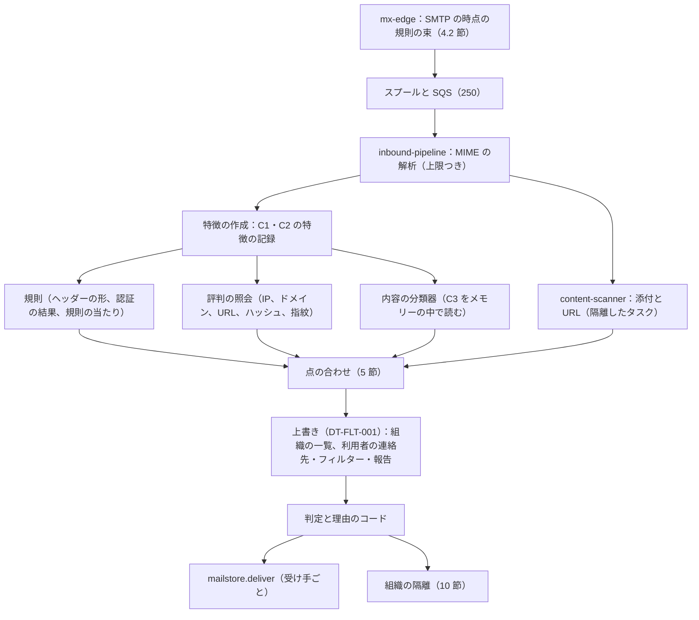
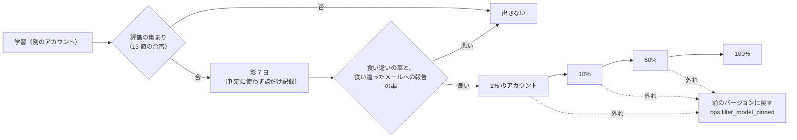

# Spam and abuse filtering: Gmail

迷惑メール・フィッシング・乱用の選別を決める。層のパイプライン（規則、評判、内容の分類器、添付と URL の検査）、点の合わせ方と閾値、判定と理由のコード、利用者ごとの上書き、評判のストア、利用者の報告と学習への戻り、同意のある報告のサンプル、組織の隔離と許可・拒否の一覧、モデルと規則の出し方、評価の集まり、送信の側の選別、脅威の情報の共有の枠を扱う。

前提となる決定は次のとおり。

- SMTP の時点では安く確かなものだけを拒み、中身の選別は 250 の後に行う。受け付けた後は迷惑メールの箱か隔離で、送り返さない（[ADR-0002](../decisions/0002-accept-then-filter.md)）
- データは C1（接続の情報）・C2（中身から作った特徴）・C3（中身そのもの）に分ける。C3 は選別の処理の中だけで機械が読む。人が中身を見るのは同意のある報告のサンプルだけ。学習は C2 と同意のある報告と合成のメールで行う。選別の範囲は法務の L1 で調整する（[ADR-0008](../decisions/0008-spam-pipeline-boundary-and-secrecy.md)）
- 規則のエンジンと評判は自前の `crates/filter`、分類器の推論は ONNX Runtime、学習は別のアカウントの Python（[ADR-0001](../decisions/0001-platform-and-stack.md)）
- 選別のモデルと規則は、評価の集まりの合否と影の判定を経て、1% → 10% → 50% → 100% で出す。`release.*` のフラグで経路ごとに切り替えない（[AGENTS.md](../../AGENTS.md)、[runbooks/README.md](../runbooks/README.md) の 3 節）

この文書で決めたことは次の ADR にある。

| ADR | 決定 |
| --- | --- |
| [0022](../decisions/0022-verdict-score-composition-and-overrides.md) | 各層は「迷惑メール」と「フィッシング」の 2 つの頭ごとに対数オッズの寄与を出し、和をシグモイドで確率にする。閾値は迷惑メール 0.90（0.70〜0.90 は注意の帯）、フィッシング 0.80（0.50〜0.80 は注意の帯）、やりとりのある相手はそれぞれ 0.99・0.95。既知のマルウェアは点によらない。判定は 6 つ（`inbox`・`inbox_warn`・`spam`・`spam_phish`・`quarantine`・`attachment_blocked` の印）と理由のコード。上書きの順は決定表 DT-FLT-001 で、既知のマルウェアと確かなフィッシングは利用者・組織の許可でも上書きしない |
| [0023](../decisions/0023-reputation-store-and-report-weighting.md) | 評判は、IP・範囲・ASN・認証済みのドメイン・URL のドメイン・添付のハッシュ・本文の指紋・ARC の封印者を鍵に、半減期 7 日と 30 日の 2 つの減衰の数えを Valkey に持ち、5 分ごとに S3 へ写しを置く。値はベータの事前分布で滑らかにした対数オッズ。利用者の報告は、アカウントの年齢と信頼で重みを付け、1 つのテナントからの寄与を 20% までに抑える。外部のブロックリストは特徴の 1 つで、それだけで判定しない |
| [0024](../decisions/0024-feedback-training-data-and-model-release.md) | 学習のデータは、配送の時に作る C2 の特徴の記録（30 日）に利用者の報告をラベルとして結び付けたものと、同意のある報告のサンプル（C3、別のアカウント、1 年）と、合成のメールだけ。C2 の記録を学習に使うことの既定の有効化は法務の L1 の後。モデルと規則は評価の集まりの合否 → 影 7 日 → 段の出し方。大きな波の対応の規則だけは、正規のメールの評価で誤り 0 と影 1 時間で出し、7 日で失効させる |
| [0025](../decisions/0025-org-quarantine-and-allow-block-lists.md) | 組織の隔離は、メールボックスに配らず、スプールを `quarantine/` に写して `quarantine_items` に置き、管理者が解放すると判定の上書きつきで配送の依頼に戻す。30 日で消し、送り手に知らせない。管理者の画面は、ヘッダーの要約をスプールから都度読み、DB に C3 を持たない。組織の許可の一覧の送り手のドメインは、DMARC か揃った認証が通ったときだけ効く |

## 1. 範囲

- 扱う：
  - 受信の選別のパイプラインの層と順序、予算、データの区分の型
  - SMTP の時点の規則の束（[ADR-0002](../decisions/0002-accept-then-filter.md) の表の 13）
  - 点の合わせ方、閾値、判定、理由のコード、利用者ごとと組織ごとの上書き
  - 評判のストアと数え方、報告の重み、外部のブロックリストの使い方
  - 内容の分類器の入力と形（選定は `spam-classifier-poc`）
  - 利用者の報告（迷惑メール、フィッシング、迷惑メールではない）、同意のある報告のサンプル、学習のデータ
  - 組織の隔離、組織の許可・拒否の一覧
  - モデルと規則の出し方、緊急の規則、評価の集まり
  - 送信の側の選別の型
  - 選別の範囲の設定（[ADR-0008](../decisions/0008-spam-pipeline-boundary-and-secrecy.md) の (a)・(b)）の判定への効き方
  - 脅威の情報の共有の枠（法務の L10）
- 扱わない：
  - 認証の評価（[sender-authentication.md](sender-authentication.md)）。この文書は結果を点にする。
  - 接続の層と速さの上限（[inbound-smtp.md](inbound-smtp.md) の 6 節）。この文書は層の元になる評判を作る。
  - 添付の検査と URL の評判の中身、開くときの確かめ（[attachment-and-url-scanning.md](attachment-and-url-scanning.md)）。この文書は結果を点にする。
  - 乗っ取りの検知（[outbound-smtp-and-reputation.md](outbound-smtp-and-reputation.md) の 11 節）。
  - 迷惑メールの箱のラベルと排他（mailbox-model-labels-and-threads.md）、利用者のフィルター（filters-forwarding-and-automation.md）、警告の帯の画面（web-client.md）。
  - 報告のサンプルの置き場所の IAM と監査（security.md）、影の判定の出し方の仕組み（delivery.md）。

## 2. 要件

| 要件 | 値 | 出どころ |
| --- | --- | --- |
| 捕捉 | 迷惑メール 99.9% 以上、フィッシング 99.5% 以上（評価の集まり）。既知のマルウェアの添付の到達 0。受信箱に届いた迷惑メールへの報告の率 0.05% 以下 | NFR-008、K4 |
| 誤判定 | 正規のメールの迷惑メールの箱・隔離へ 0.05% 以下。やりとりのある相手から 0.005% 以下（95% の信頼区間の上限で判定） | NFR-009、[quality.md](../quality.md) の 2.2.1 節 H |
| 遅れ | 受け付けた後の選別（添付と URL の検査を含む）p95 1 秒・p99 5 秒。NFR-001 の 250 から受信箱まで p95 10 秒の中に収める | NFR-001 |
| 止まらない | 選別の部品の障害で受信を止めない。判定のできないメールは、時間の上限の後に「判定なし」で受信箱へ配り、後から選び直す | [ADR-0002](../decisions/0002-accept-then-filter.md) |
| 上書き | 利用者の操作（迷惑メールではない、連絡先、フィルター）で判定を上書きできる。既知のマルウェアの添付は上書きできない | [intent.md](../intent.md) の「守るべき振る舞い」 |
| 中身 | C3 をログ・指標・特徴のストアに出さない。運用者は中身を見ない | [ADR-0008](../decisions/0008-spam-pipeline-boundary-and-secrecy.md) |

## 3. 本家の形（確かめたこと）

いずれも 2026-10-10 に確認。

| 項目 | 事実 | この設計 |
| --- | --- | --- |
| 選別の質 | 機械学習のモデルで、迷惑メール・フィッシング・マルウェアの 99.9% 超を止める（[Google Cloud Blog](https://cloud.google.com/blog/products/identity-security/protecting-against-cyber-threats-during-covid-19-and-beyond)、2020-04-16） | NFR-008 の目標に使う |
| 送信者への要件と迷惑メールの率 | 迷惑メールの率 0.3% 未満、推奨 0.1% 未満（[Email sender guidelines](https://support.google.com/a/answer/81126)） | 受信の側の大量の送信者の扱い（[sender-authentication.md](sender-authentication.md) の 11 節） |
| 内部の選別の仕組み、層、閾値、学習のデータ、警告の帯の出し方 | 公式の資料で確かめられなかった（**未検証**） | 本システムの設計（4〜12 節） |

## 4. 層のパイプライン

### 4.1 流れ

- 特徴の作成と規則・評判・分類器・添付と URL は並べて走らせ、合わせで待つ。
- 判定は受け手ごと。同じメッセージでも、受け手の連絡先・フィルター・組織の方針で判定が違う。点（上書きの前）はメッセージで 1 つ。

### 4.2 SMTP の時点の規則の束

[ADR-0002](../decisions/0002-accept-then-filter.md) の表の 13（確信の高い規則）として `mx-edge` に載せる規則の束。条件は、評価の集まりの正規のメールで誤り 0 件、かつ本番の影で 30 日の誤り 0 件のものだけ。

| 規則 | 条件 | 応答 |
| --- | --- | --- |
| `own_domain_spoof` | From のドメインが本システムのドメイン（`<brand>.<domain>`）で、本システムの送信の基盤からでない（DMARC の 9 行と同じ結果。記録の欠けにも効く） | 550 5.7.1 |
| `known_phish_url_exact` | 本文の URL が、確かなフィッシングの URL の一覧（URL の正規化の後の SHA-256 が一致）に当たり、一覧の確信が `confirmed` | 550 5.7.1 |
| `wave_signature` | 緊急の規則（12.3 節）のうち、`smtp_time: true` を付けたもの | 550 5.7.1 |

- 束は `spam-scorer` が作ってコードのバージョンとして `mx-edge` に配る。`mx-edge` は束を手元に持ち、外を呼ばない。
- 迷惑メールらしさ（分類器の点）だけで SMTP の時点で拒まない。

### 4.3 予算と時間切れ

| 段 | 予算（受け付けた後） | 超えたとき |
| --- | --- | --- |
| MIME の解析 | 2 秒 | 解析の上限の理由のコードで `parse_limited` の点（+1.5）、残りの層は取れた部分で進む |
| 特徴の作成と規則 | 200ms | 規則の層を欠いて合わせる |
| 評判の照会 | 100ms（Valkey） | 評判の層を 0 で合わせる |
| 内容の分類器 | 100ms（CPU の推論） | 分類器の層を欠いて合わせる |
| 添付と URL の検査 | 3 秒（[attachment-and-url-scanning.md](attachment-and-url-scanning.md) の 5 節） | 添付は 9.4 節の「後から選び直し」へ |
| 全体 | 5 秒 | 取れた層だけで判定する。欠けた層が 2 つ以上なら `inbox`（判定なし）にして後から選び直す |

- **後から選び直し**：判定なしで配ったメッセージと、添付の検査が終わらなかったメッセージは、`rescan` の待ち行列に入れ、24 時間の中で層がそろったら判定し直す。判定が `spam`・`spam_phish` に変わったら `mailstore` にラベルの変更を頼む（利用者がすでに動かしたメッセージは動かさず、警告の帯だけを付ける）。
- 欠けた層があるときは、閾値を上げない（迷惑メールに寄せない）。誤判定より見逃しを選び、後から選び直す。

### 4.4 データの区分の型

| 型 | 区分 | 中身 | 出てよい先 |
| --- | --- | --- | --- |
| `ConnInfo` | C1 | 送り元の IP・範囲・ASN、HELO、TLS、MAIL FROM と宛先のドメイン、認証の結果、大きさ、時刻 | 評判のストア、指標（ドメインは集計だけ） |
| `MessageFeatures` | C2 | URL のドメイン（平文）とパスのハッシュ、添付のハッシュと種類、本文の指紋（SimHash 64 ビット、日本語の文字の 3-gram）、規則の当たりの ID、分類器の点、ヘッダーの形の異常の印、言語、HTML の構造の数 | 特徴のストア（30 日）、評判のストア、学習の置き場所 |
| `MessageContent` | C3 | 件名、本文、表示の名前、ローカル部、添付のバイト | 選別の処理のメモリー、`mailstore`、報告のサンプル |

- 本文の指紋は、元の文を復元できない方式に限る（[ADR-0008](../decisions/0008-spam-pipeline-boundary-and-secrecy.md)）。SimHash の 64 ビットは、同じ文の近さを測れるが、文に戻せない。短い本文（200 文字未満）は指紋を作らない（短い文は推測で戻せうるため）。
- `MessageContent` は `crates/filter` の中のモジュールの外に出せない型にし、ログ・トレースの属性に渡すとコンパイルで失敗させる（[ADR-0008](../decisions/0008-spam-pipeline-boundary-and-secrecy.md) の Confirmation）。

## 5. 点の合わせ（ADR-0022）

### 5.1 合わせ方

- 頭は 2 つ：`spam`（迷惑メール）と `phish`（フィッシング）。各層は頭ごとに対数オッズの寄与 `w` を出す。
- `S_head = b_head + Σ w_layer,head`、`p_head = 1 / (1 + e^(−S_head))`。`b_spam = −3.0`、`b_phish = −5.0`（事前の割合をおよそ 5%・0.7% と置く。受け付けた後のメールの割合で直す）。
- 規則の寄与は規則ごとの決まった値。評判の寄与は 6 節の対数オッズ（範囲を −4〜+4 に切る）。分類器の寄与は、評価の集まりで較正（等張回帰）した確率の対数オッズから、事前を引いたもの（範囲 −6〜+6）。添付と URL の寄与は [attachment-and-url-scanning.md](attachment-and-url-scanning.md) の結果の種類ごとの値。
- 既知のマルウェアの添付は点によらない（`attachment_blocked` の印を必ず付ける）。

### 5.2 認証と形の寄与

[sender-authentication.md](sender-authentication.md) と [inbound-smtp.md](inbound-smtp.md) の結果を、次の寄与にする（`spam`・`phish` の順）。

| 特徴 | `spam` | `phish` |
| --- | --- | --- |
| DMARC `pass`、揃ったドメインの評判が良い | 評判の寄与に任せる（下の評判の層） | −1.0 |
| DMARC `pass`、揃ったドメインの評判がない（新しい） | 0 | 0 |
| DMARC `fail`、方針 `quarantine`（救いなし） | +3.0 | +2.0 |
| DMARC `fail`、方針 `reject` で救いあり（ARC） | +0.5 | +0.5 |
| DMARC `fail`、方針 `none` | +1.0 | +1.0 |
| SPF も DKIM も `pass` がない | +1.5 | +1.0 |
| `l=` の署名の外の本文 | +1.0 | +1.5 |
| `forged_authres`（偽の `Authentication-Results`） | +2.0 | +4.0 |
| `unsolicited_bounce`（送っていないメールの DSN） | +3.0 | 0 |
| 大量の送信者の要件の欠け（[sender-authentication.md](sender-authentication.md) の 11 節） | +1.0 | 0 |
| 平文（STARTTLS なし） | +0.2 | +0.2 |
| `bare_lf`（裸の LF） | +0.3 | 0 |
| 表示の名前に既知の組織の名前（宅配、カード、銀行、行政の一覧）、ドメインがその組織の認証済みのドメインでない | +0.5 | +2.0 |
| From のドメインの登録から 7 日以内（登録の日付の取得できるもの） | +1.0 | +1.2 |
| `parse_limited`（解析の上限） | +1.5 | +1.0 |

### 5.3 閾値と判定

| 判定 | 条件（やりとりのない相手） | 条件（やりとりのある相手） | 受け手の見え方 |
| --- | --- | --- | --- |
| `spam_phish` | `p_phish ≥ 0.80` | `p_phish ≥ 0.95` | 迷惑メールの箱。フィッシングの警告の帯、リンクと画像を無効 |
| `spam` | `p_spam ≥ 0.90` | `p_spam ≥ 0.99` | 迷惑メールの箱。理由の帯 |
| `inbox_warn` | `0.50 ≤ p_phish < 0.80` か `0.70 ≤ p_spam < 0.90` | `0.80 ≤ p_phish < 0.95` | 受信箱。注意の帯、リンクを開く前に確かめ |
| `inbox` | それ以外 | それ以外 | 受信箱 |

- `quarantine` は組織の方針で `spam_phish`・`spam`・`attachment_blocked` の一部を置き換える判定（10 節）。
- `attachment_blocked` は他の判定に重ねる印。添付を開けなくし、メッセージは判定のとおりの箱に入る（[attachment-and-url-scanning.md](attachment-and-url-scanning.md) の 4 節）。
- **やりとりのある相手**：受け手が過去 1 年に送ったことのあるアドレス、または連絡先にあるアドレスで、かつ DMARC が `pass`（揃い）。DMARC が `pass` でなければ、やりとりのある相手として扱わない（アドレスを騙るなりすましに、相手の甘さを与えないため）。
- 閾値はモデルのバージョンに結び付けて出す（較正が変わるため）。

### 5.4 例

**例 1（日本語の宅配の不在のフィッシング）**：送り元の IP は `neutral`（寄与 +0.4）。From のドメインは登録から 2 日（+1.0／+1.2）、DKIM と DMARC は `pass` だがドメインの評判がない（0）。本文の URL のドメインは直近 1 時間に 30 の報告（評判 +3.5／+3.8）。表示の名前に宅配の事業者の名前（+0.5／+2.0）。分類器は `spam` +1.8、`phish` +2.8。添付なし。

- `S_phish = −5.0 + 0.4 + 1.2 + 3.8 + 2.0 + 2.8 = 5.2` → `p_phish = 0.9945` → `spam_phish`。
- `S_spam = −3.0 + 0.4 + 1.0 + 3.5 + 0.5 + 1.8 = 4.2` → `p_spam = 0.985`。判定は `spam_phish`（フィッシングを先に見る）。理由のコードは `phish_url_reputation`、`brand_impersonation`、`new_domain`。

**例 2（購読したニュースレター）**：IP は `trusted`（−1.0／−0.5）。DKIM と DMARC は `pass`、揃ったドメインの評判は良い（−2.5／−1.0 と、DMARC の −1.0）。分類器は宣伝の文で `spam` +1.0、`phish` −0.5。受け手は前にこのドメインに「迷惑メールではない」を出した（利用者ごとの寄与 −2.0／−1.0。9.3 節）。

- `S_spam = −3.0 − 1.0 − 2.5 + 1.0 − 2.0 = −7.5` → `p_spam = 0.00055` → `inbox`。
- `S_phish = −5.0 − 0.5 − 1.0 − 1.0 − 0.5 − 1.0 = −9.0` → `inbox`。

### 5.5 上書きの順（DT-FLT-001）

上から順に評価し、最初に当たった行の扱いにする。

| # | 条件 | 扱い |
| --- | --- | --- |
| 1 | 既知のマルウェアの添付 | `attachment_blocked`。箱は点の判定のまま（`inbox` なら `inbox_warn` に上げる）。どの上書きも効かない |
| 2 | `p_phish ≥ 0.98`（確かなフィッシング） | `spam_phish`。組織の許可の一覧、利用者の連絡先・フィルターでも上書きしない。利用者は自分で受信箱へ移せる（移したら 9 節の報告として扱う） |
| 3 | 組織の拒否の一覧に当たる | `quarantine`（組織の方針で `spam` も選べる） |
| 4 | 組織の許可の一覧に当たり、DMARC か揃った認証が `pass` | `inbox`（4 行目以降の点を使わない） |
| 5 | 利用者のフィルターの「迷惑メールにしない」に当たる | `inbox`（`p_phish ≥ 0.80` なら `inbox_warn`） |
| 6 | 利用者のフィルターの「迷惑メールにする」・ブロックした差出人 | `spam` |
| 7 | 組織の隔離の方針に当たる判定（10 節） | `quarantine` |
| 8 | それ以外 | 5.3 節の閾値の判定（やりとりのある相手の列を含む） |

- 選別の範囲の設定（[ADR-0008](../decisions/0008-spam-pipeline-boundary-and-secrecy.md)）：(a) 選別を止めた利用者は、8 行を「すべて `inbox`、判定の印だけを付ける」にする。(b) 内容の分類器を使わない利用者は、分類器の層を欠いて合わせる（閾値は同じ）。1 行（既知のマルウェア）をどの設定でも続けるかは**法務の確認待ち**（L1）。
- 組織の管理者は、組織の利用者の (a)・(b) を固定できる（organizations-domains-and-routing.md）。

## 6. 評判（ADR-0023）

### 6.1 鍵と数え

| 鍵の種類 | 鍵 | 区分 |
| --- | --- | --- |
| `ip`・`range`・`asn` | 送り元の IP（IPv6 は /64）、/24・/48、ASN | C1 |
| `auth_domain` | DKIM の `d=`、SPF の `pass` のドメイン、DMARC の揃った From のドメイン（組織のドメインに丸めたものも別に） | C1 |
| `url_domain` | 本文の URL の登録ドメインと、ホスト名 | C2 |
| `url_hash` | 正規化した URL の SHA-256 | C2 |
| `attachment_hash` | 添付の本体の SHA-256 | C2 |
| `fingerprint` | 本文の指紋（SimHash の上位 16 ビットの桶と、64 ビット） | C2 |
| `arc_sealer` | ARC の封印者のドメイン | C1 |

- 鍵ごとに、出来事を 2 つの減衰の数え（半減期 7 日の `fast` と 30 日の `slow`）で持つ：`delivered`（受け付けた数）、`verdict_spam`、`verdict_phish`、`report_spam`、`report_phish`、`report_not_spam`、`engaged`（開いた・返信した・受信箱へ移した）。
- 減衰の数えは「値と最後の更新の時刻」の組で、更新の時に `値 × 2^(−経過 / 半減期) + 1` にする。

### 6.2 値

- 迷惑の側の数 `bad = verdict_spam × 0.3 + report_spam × w_r + report_phish × w_r × 1.5`、良い側の数 `good = report_not_spam × w_r × 2 + engaged × 0.5 + (delivered − verdict_spam − verdict_phish) × 0.05`。`w_r` は報告の重み（6.3 節）。
- 評判の寄与 `w = log((bad + α) / (good + β)) − log(α / β)`、事前 `α = 1`、`β = 9`（何も知らないときに 0 になる）。`fast` と `slow` の両方を計算し、絶対値の大きい方を使う（急な変化を早く拾い、長い実績も残す）。−4〜+4 に切る。
- **例**：URL のドメイン `parcel-xx.example`、直近 1 時間に `report_phish` が 30（重み平均 0.8）、`engaged` 0、`delivered` 2,000（うち `verdict_phish` 1,200）。`bad = 1,200 × 0.3 + 30 × 0.8 × 1.5 = 396`、`good = 800 × 0.05 = 40`。`w = log(397 / 49) − log(1/9) = 2.09 + 2.20 = 4.29` → 切って +4.0。
- `inbound-smtp` の IP の層（[inbound-smtp.md](inbound-smtp.md) の 6.1 節）は、この数えから 5 分ごとに作る。

### 6.3 報告の重みと汚染の防ぎ

- 報告の重み `w_r`：アカウントの作成から 7 日未満は 0.1、7〜30 日は 0.5、それ以上は 1.0。過去の報告が他の報告と食い違った割合が高いアカウント（直近 90 日で 50% 以上が多数と逆）は 0.2 を掛ける。
- 1 つの鍵への 1 日の寄与のうち、1 つのテナント（組織、または個人をまとめて 1 つ）から来る分を 20% までに抑える。1 つの組織の社員が一斉に正規の取引先を報告して、取引先の評判を全体で落とすのを防ぐ。
- 同じ IP の /24 から作られたアカウントの群れ（作成の時期が近い）の報告が、1 つの鍵に集中したら（1 時間に 50 以上）、その群れの重みを 0 にし、乱用の当番に知らせる。
- 「迷惑メールではない」の報告は、送り手自身が受け手のアカウントを作って出すことがある。良い側の重み（×2）は、DMARC の `pass` のメッセージへの報告にだけ当てる。

### 6.4 置き場所と外部のデータ

- 数えは Valkey（`rep:{kind}:{key}`、専用のクラスタ）に持つ。`reputation-service` は SQS の出来事（判定、報告、配送）を読んで数えを進める。
- 5 分ごとに数えの写しを S3（`reputation/snapshots/<ts>`）に置く。Valkey を失ったら、最後の写しから戻す（最大 5 分の数えを失う）。出来事そのもの（C1・C2 だけ）は、1 時間ごとに S3 の `reputation/events/` に置き、学習と作り直しに使う（保持は 90 日。通信の構成の要素の保持として**法務の確認待ち**、L1・L6）。
- 外部のブロックリストと脅威の情報は、`ext_*` の特徴として足す（寄与は +0.5〜+2.0、一覧の質で決める）。外部の照会に送るのは IP・ドメイン・ハッシュだけで、照会の結果をキャッシュして照会の数を減らす（法務の L5・L10）。外部の一覧だけで `spam` 以上にしない（寄与の合計の上限 +2.0）。

## 7. 内容の分類器

- 入力：件名、本文の文字（HTML を文字に直したもの、先頭 64 KiB）、表示の名前、URL の特徴（ドメインの文字の並び、パスの長さ、数）、HTML の構造（隠した文字、外部の画像の数、フォーム）、ヘッダーの形の印。日本語は文字の 2-gram と 3-gram、英語は語。
- 形：MVP は勾配ブースティング（ハッシュした n-gram の特徴と構造の特徴）。小さな言語モデル（蒸留した多言語のエンコーダー）は `spam-classifier-poc` で質と推論の遅れ（CPU で p99 100ms 以下）を比べて選ぶ（[intent.md](../intent.md)）。
- 頭は `spam` と `phish` の 2 つ。フィッシングは型（宅配、カード、銀行、通販、行政、アカウントの確認、請求書）を補助のラベルとして学習し、理由のコードに使う。
- 推論は `spam-scorer` の中で ONNX Runtime。特徴の作り方はモデルのバージョンに結び付け（`feature_version`）、同じバージョンの特徴の作り方の実装を推論と学習で共有する（Rust の特徴の作り方を Python から呼ぶ）。
- 入力の C3 は推論の後に捨てる。出力の点と、効いた特徴の上位 5 つ（特徴の ID だけ）を C2 として特徴の記録に残す。

## 8. 判定と理由のコード

- 判定は受け手ごとに、`mailstore.deliver` へ `verdict`、`reason_codes`（最大 3）、`scores`（`p_spam`、`p_phish`）、`model_version`、`rules_version` として渡し、メッセージの行に持つ。
- 理由のコードの一覧（例）：

| コード | 利用者に見せる文の意味 |
| --- | --- |
| `similar_reported` | よく似たメールが多く迷惑メールとして報告されている |
| `phish_url_reputation` | 本文のリンクの先が、だましのサイトとして知られている |
| `brand_impersonation` | 名の知れた組織の名前を使っているが、その組織から送られていない |
| `auth_failed` | 差出人のドメインの認証に失敗した |
| `new_domain` | 最近作られたドメインから送られた |
| `user_filter` | あなたのフィルターで迷惑メールにした |
| `blocked_sender` | あなたがブロックした差出人 |
| `org_policy` | 組織の方針による |
| `malware_attachment` | 添付に危険なファイルが含まれる |
| `content_pattern` | 内容が迷惑メールによく見られる型に当たる |

- 文は利用者の言語で、判定の根拠の外の手がかり（規則の中身、点の値）を出さない。点と規則の ID は運用の調べに使うが、中身は使わない。

## 9. 利用者の報告と学習への戻り（ADR-0024）

### 9.1 報告の種類

| 操作 | 出来事 | ラベルの変化 | 学習のラベル |
| --- | --- | --- | --- |
| 迷惑メールを報告 | `report_spam` | 迷惑メールへ | `spam`（重み 1） |
| フィッシングを報告 | `report_phish` | 迷惑メールへ、警告の帯 | `phish`（重み 1） |
| 迷惑メールではない | `report_not_spam` | 受信箱へ | `ham`（重み 1） |
| 迷惑メールの箱から手で移す | `implicit_not_spam` | 受信箱へ | `ham`（重み 0.3） |
| 受信箱から迷惑メールの箱へ手で移す | `implicit_spam` | 迷惑メールへ | `spam`（重み 0.3） |
| 差出人をブロック | `block_sender` | 以後 `spam` | 利用者ごとだけ |

- 報告は `mailstore` がラベルを変え、同じトランザクションで outbox に出来事（`account_id`、`message_id`、種類、時刻）を書く（[architecture/README.md](README.md) の 1.3 節 E）。
- `reputation-service` が出来事を受け、メッセージの特徴の記録（9.2 節）を引いて、評判の鍵ごとに数えを進める。

### 9.2 特徴の記録

- 配送の時に、メッセージごとに C1・C2 の特徴の記録（`MessageFeatures` と `ConnInfo` の要約、判定、点）を作り、特徴のストアに 30 日置く。鍵は `(account_id, message_id)` ではなく、`feature_id`（UUIDv7）で、メッセージの行が `feature_id` を持つ。
- 報告の出来事は `feature_id` で記録を引き、ラベルを付けた学習の行（`feature_id`、ラベル、重み、報告の時刻、アカウントの重み）を学習の置き場所に送る。アカウントの ID は送らない（HMAC の桶だけ）。
- 30 日を過ぎた記録は消える。それより後の報告は、評判の数え（メッセージの鍵がない形）だけに使う。

### 9.3 利用者ごとの寄与

- 利用者ごとに、送り手の組織のドメインと送り手のアドレスの HMAC への「迷惑メールではない」「迷惑メール」の数を持ち、寄与（−2.0〜+2.0）にする。メールボックスのシャードの `sender_affinity` に置く（[ADR-0007](../decisions/0007-tenancy-accounts-orgs-and-rls.md) の RLS の中）。
- 寄与は、そのアカウントの判定にだけ効く。

### 9.4 同意のある報告のサンプル

- 「迷惑メールを報告」「フィッシングを報告」「迷惑メールではない」の画面で、別の選択として「このメールを改善のために提出する」を出す。既定は選ばない。
- 選んだときだけ、`mailstore` が blob と前置きの写しを、報告のサンプルの置き場所（別の AWS アカウントの S3、Object Lock なし、専用の KMS の鍵）に書く。写しには `account_id` を付けず、提出の ID と HMAC の桶だけ。
- 置き場所の操作（読み出し、学習への取り出し、評価の集まりへの採用）は、決めた担当のロールだけが行い、すべて監査に残す。保持は 1 年（法務の L1・L6 で確定するまで仮置き）。
- 利用者は提出を取り消せる（30 日以内）。取り消しで写しを消す。学習済みのモデルからは消さない（次の学習から外す）。

### 9.5 学習の置き場所に入るもの

| 入るもの | 区分 | 条件 |
| --- | --- | --- |
| 特徴の記録と報告のラベル | C1・C2 | 既定の有効化は**法務の確認待ち**（L1）。それまでは、選別の範囲の設定で同意を示した利用者の分だけ |
| 同意のある報告のサンプル | C3 | 利用者の明示の同意 |
| 合成のメール | — | 生成器で作ったもの（[quality.md](../quality.md) の 2.4 節） |
| 評判の出来事 | C1・C2 | 9.5 の 1 行目と同じ |

- 受け取ったメールの C3 を、同意なしに学習の置き場所へ写す経路を作らない（[ADR-0008](../decisions/0008-spam-pipeline-boundary-and-secrecy.md)）。IAM の方針で、学習のアカウントへの書き込みを `reputation-service` の学習の行の送り出しと、報告のサンプルの書き込みだけに限る（security.md）。

## 10. 組織の隔離（ADR-0025）

- 組織の管理者は、方針で次を隔離に置き換えられる：`spam_phish`、`spam`、`attachment_blocked`、拒否の一覧への当たり、DMARC の `reject` の失敗（[sender-authentication.md](sender-authentication.md) の 5.4 節の 8 行）。既定はどれも置き換えない（個人と同じ迷惑メールの箱）。
- 隔離は、メールボックスに配らない。`inbound-pipeline` はスプールを `quarantine/<tenant_id>/<yyyy>/<mm>/<dd>/<quarantine_id>` に写し（スプールの鍵と別の、テナントの隔離の鍵で暗号化）、directory の `quarantine_items` に行を書く。受け手ごとに 1 行。その受け手の配送は「隔離」として終わり（`spool-done/` の印の条件を満たす）。
- 管理者の画面（organizations-domains-and-routing.md）は、行の一覧（受け手、送り手のドメイン、理由のコード、時刻）と、選んだ 1 件のヘッダーの要約（From、件名、日付、添付の名前）を見せる。要約はスプールの写しから都度読み、`<brand>usercontent.<domain>` から描く。DB に件名を持たない。本文を見る操作は別の権限（組織の「隔離の確かめ」の役割）にし、監査に残す。本システムの運用者は見ない（[ADR-0008](../decisions/0008-spam-pipeline-boundary-and-secrecy.md)、法務の L7）。
- **解放**：管理者が解放すると、`(spool_id, recipient)` の配送の依頼を、判定の上書き（`released_by_admin`、箱は `inbox`。`attachment_blocked` の印は残す）つきで載せ直す。配送は冪等なので、2 回押しても 1 通。
- **削除と期限**：管理者の削除、または 30 日で、写しを消し、行を `deleted` にする。送り手に知らせない（後方散乱を作らない。[ADR-0002](../decisions/0002-accept-then-filter.md)）。
- 受け手への知らせ：組織の方針で、隔離の一覧の要約（件数と送り手のドメイン）を 1 日 1 回、受け手に送れる（既定は送らない）。

## 11. 組織の許可・拒否の一覧（ADR-0025）

| 種類 | 鍵 | 効き方 |
| --- | --- | --- |
| 許可 | 送り手のドメイン（組織のドメインに丸めない、そのまま） | DMARC が `pass`、または From のドメインに揃う DKIM・SPF の `pass` のときだけ DT-FLT-001 の 4 行 |
| 許可 | 送り元の IP の範囲（組織の前段のゲートウェイ） | 接続の情報が範囲に入るとき、4 行。前段のゲートウェイの ARC の封印者を信頼の一覧に足すことを勧める |
| 拒否 | 送り手のドメイン、送り元の IP の範囲、添付の種類（拡張子と本当の形式） | 3 行 |

- 認証なしの許可（From のドメインだけで許す）は作らない。From を騙るなりすましを素通りさせるため。
- 一覧の上限は組織あたり 1 万件。変更は管理の監査に残す。

## 12. モデルと規則の出し方（ADR-0024）

### 12.1 通常の出し方

- 段ごとに、[runbooks/README.md](../runbooks/README.md) の 1 節の選別の指標（報告の率、誤判定の代わりの指標）を 24 時間以上見る。アカウントの割り当ては `account_id` のハッシュで決め、段の間で同じアカウントは同じバージョンを使う。
- 規則の束も同じ出し方。規則ごとに、評価の集まりでの精度（当たった正規のメールの数）を記録する。
- モデル・規則・閾値・特徴の作り方は、1 つの「選別のバージョン」（`filter_version`）としてまとめて出す。

### 12.2 影の判定の比べ

- 影のバージョンと今のバージョンの判定が食い違ったメッセージの割合と、食い違いの向き（影が厳しい・緩い）ごとに、その後 7 日の利用者の報告の率を比べる。影が厳しい食い違いへの「迷惑メールではない」の率が、今のバージョンの `spam` への率の 2 倍を超えたら出さない。

### 12.3 緊急の規則

- 大きな迷惑メール・フィッシングの波（[spam-wave.md](../runbooks/spam-wave.md)）では、波に当てる規則だけを速い道で出せる：
  1. 規則は「迷惑メール・フィッシングに寄せる」向きだけ（`inbox` に寄せる規則は速い道に載せない）。
  2. 評価の集まりの正規のメール（全件）で当たり 0 件。
  3. 影 1 時間で、影の当たりへの「迷惑メールではない」の報告 0 件。
  4. Dev と QA の 2 人の承認。
  5. 7 日で自動に失効する。続けるなら通常の出し方に載せる。
- `smtp_time: true` を付けた規則は、さらに影 24 時間を要る（SMTP の時点の拒否は、利用者が取り戻せないため）。

## 13. 評価の集まり

- 作り方と分け方は [quality.md](../quality.md) の 2.2.1 節 H。この文書は大きさと合否を決める。
- **大きさ**：誤判定の率の目標を 95% の信頼区間の上限で示すため、誤り 0 件のときに要る数は `−ln(0.05) / 目標 ≈ 3 / 目標`。
  - 正規のメール（全体）：目標 0.05% → 6,000 で誤り 0 なら満たす。誤りが少しあっても判定できるよう 20 万。
  - やりとりのある相手のメール：目標 0.005% → 6 万で誤り 0。10 万を置く。
  - 迷惑メール：捕捉 99.9% → 見逃しの上限 0.1% を示すのに 3,000 で見逃し 0。種類ごとに 3 万。
  - フィッシング：捕捉 99.5% → 600 で見逃し 0。日本語の型（宅配、カード、銀行、通販、行政）ごとに 5,000。
- **例**：正規のメール 20 万で誤判定 60 件 → 率 0.030%、95% の上限（Clopper–Pearson）は約 0.039% → 目標 0.05% を満たす。やりとりのある相手 10 万で誤り 4 件 → 0.004%、上限は約 0.010% → 目標 0.005% を満たさない。モデルを出さない。
- 合否：前の `filter_version` より、どの種類の誤判定の率も上限で悪くしない。捕捉の率を 0.1 ポイント以上下げない（[quality.md](../quality.md)）。
- 集まりは時間で分け、学習に使った期間のものを評価に使わない。合成のメールの生成器のバージョンを記録する。

## 14. 送信の側の選別

- `outbound-gate` は `spam-scorer` を `direction=outbound` で呼ぶ（[outbound-smtp-and-reputation.md](outbound-smtp-and-reputation.md) の 12 節）。
- 層：既知のマルウェアのハッシュ、URL の評判（C2）、本文の指紋の評判（同じ指紋の多くの宛先）、内容の分類器（`phish` の頭）。
- 判定：`block`（既知のマルウェア、`confirmed` のフィッシングの URL）、`suspect`（`p_phish ≥ 0.80`、指紋の評判 +3.0 以上）、`pass`。
- 範囲は**法務の確認待ち**（L1）。結論まで、`block` は C2 の層（ハッシュと URL の評判）だけで決め、分類器は影で点だけを記録する。
- 送信の特徴の記録は、受信と同じ特徴のストアに `direction=outbound` で置き、乗っ取りの点の学習に使う（[outbound-smtp-and-reputation.md](outbound-smtp-and-reputation.md) の 11 節）。

## 15. 脅威の情報の共有（法務の L10）

- 枠だけを決める。**法務の確認待ち**（L10）。結論まで外へ出さない（`release.threat-intel-sharing`）。
- 出してよい候補は C1・C2 だけ：送り元の IP、ドメイン、URL のハッシュ（とドメイン）、添付のハッシュ、本文の指紋。中身（C3）、受け手の識別子、受け手の数の細かい分布を出さない。
- 受け取る外部の情報は、6.4 節の `ext_*` の特徴として使う。受け取りは外への送り出しと別に、L10 の結論の前でも、契約と出典の確かめ（データの使ってよい範囲）の後に使ってよい。

## 16. 失敗と回復

| 事象 | 影響 | 扱い |
| --- | --- | --- |
| `spam-scorer` の停止 | 判定ができない | 5 秒で判定なしの `inbox`、`rescan` で後から選び直す。受信は止めない |
| Valkey（評判）の停止 | 評判の層がない | 評判の層を 0 で合わせる。最後の写しから戻す |
| `content-scanner` の停止 | 添付の検査がない | 4.3 節の後から選び直し。既知のマルウェアのハッシュは `inbound-pipeline` の中でも当てる（[attachment-and-url-scanning.md](attachment-and-url-scanning.md) の 4.2 節） |
| 新しいモデルの誤判定の急増 | 正規のメールが迷惑メールの箱へ | 誤判定の代わりの指標の 1.5 倍で `ops.filter_model_pinned` に戻す（`filter-false-positive-spike.md`）。戻した後、直近 24 時間に新しいバージョンで `spam` にしたメッセージを、前のバージョンで判定し直し、`inbox` になるものを受信箱へ戻す（利用者が動かしたものは除く） |
| 報告の汚染（集団の報告） | 正規の送り手の評判が落ちる | 6.3 節の重みと上限。群れを見つけたら重みを 0 にして数えを作り直す |
| 迷惑メールの急な波 | 見逃しが増える | 緊急の規則（12.3 節）、接続の絞り（[inbound-smtp.md](inbound-smtp.md) の 14 節） |
| 隔離の写しの失敗 | 隔離できない | 写しが確定するまで `spool-done/` を書かない（SQS の読み直しで再び試す）。30 分続いたら、その受け手を `spam` の判定で配る（失わない方を選ぶ） |

## 17. 上限

| 対象 | 値 | 持ち場所 |
| --- | --- | --- |
| 選別の全体の予算 | 5 秒（層ごとは 4.3 節） | `filter.budget.*` |
| 後から選び直し | 24 時間 | 固定 |
| 分類器の入力 | 本文の先頭 64 KiB | `feature_version` |
| 理由のコード | 1 通あたり 3 | 固定 |
| 評判の半減期 | 7 日・30 日 | ADR-0023 |
| 評判の寄与 | −4〜+4、外部の一覧の合計 +2.0 まで | ADR-0023 |
| 1 つのテナントからの寄与 | 1 日 20% | ADR-0023 |
| 評判の写し | 5 分ごと | ADR-0023 |
| 評判の出来事の保持 | 90 日（法務の確認待ち：L1・L6） | S3 のライフサイクル |
| 特徴の記録 | 30 日 | ADR-0024 |
| 報告のサンプル | 1 年（法務の確認待ち：L1・L6）、取り消し 30 日 | ADR-0024 |
| 影 | 7 日。緊急の規則は 1 時間（SMTP の時点の規則は 24 時間） | ADR-0024 |
| 緊急の規則の失効 | 7 日 | ADR-0024 |
| 隔離の保持 | 30 日 | ADR-0025 |
| 組織の一覧 | 1 万件 | ADR-0025 |
| 閾値 | 5.3 節 | `filter_version` |

## 18. data-model への項目

[data-model.md](data-model.md) へ出した項目の記録。列・制約・置き場所の正本は data-model.md と [data-model/](data-model/) の各ファイル（2026-10-10 のデータモデルの工程から）。

| 置き場所 | 中身 | 節 |
| --- | --- | --- |
| メールボックスのシャードのメッセージの行に足す列（表の本体は message-parsing-and-storage.md）：`verdict`、`reason_codes`、`p_spam`、`p_phish`、`filter_version`、`feature_id`、`rescan_state` | 判定 | 5、8 |
| メールボックスのシャード `sender_affinity`（`account_id`、`key_kind`（`domain`・`address_hmac`）、`sender_key`、`not_spam`、`spam`、`contacted`、`updated_at`） | 利用者ごとの寄与 | 9.3 |
| メールボックスのシャード `filter_settings`（`account_id`、`spam_filter_mode`（`on`・`off`）、`content_classifier`（`on`・`off`）、`training_consent`、`sample_consent_default`、`locked_by_org`） | 選別の範囲の設定 | 5.5 |
| 特徴のストア：S3 `features/<yyyy>/<mm>/<dd>/<hh>/<partition>.parquet`（`feature_id`、`direction`、`ConnInfo` の要約、`MessageFeatures`、判定、点、`filter_version`）と、`feature_id` で引く索引（Valkey、30 日） | 特徴の記録（C1・C2） | 9.2 |
| Valkey（評判の専用のクラスタ）`rep:{kind}:{key}`（数えの組と時刻） | 評判 | 6 |
| S3 `reputation/snapshots/<ts>`、`reputation/events/<yyyy>/<mm>/<dd>/<hh>/` | 評判の写しと出来事 | 6.4 |
| SQS `filter-events`、`rescan` | 評判の出来事、後から選び直し | 4.3、9.1 |
| 学習のアカウントの S3 `training/labels/`（`feature_id`、ラベル、重み、時刻、アカウントの HMAC の桶） | 学習の行 | 9.5 |
| 報告のサンプルのアカウントの S3 `samples/<submission_id>/message.eml.enc` と目録 `samples/<submission_id>/index.json`（`submission_id`、種類、提出の時刻、取り消しの時刻、HMAC の桶。DB にしない）。本人の取り消しの引きはシャードの `sample_submissions` | 同意のある報告のサンプル（C3） | 9.4 |
| directory `quarantine_items`（`tenant_id`、`quarantine_id`（UUIDv7）、`spool_id`、`recipient_account_id`、`sender_domain`、`reason_codes`、`verdict`、`state`（`held`・`released`・`deleted`・`expired`）、`created_at`、`acted_by`、`acted_at`）。`tenant_id` で FORCE RLS | 組織の隔離 | 10 |
| S3 `quarantine/<tenant_id>/…/<quarantine_id>`（テナントの隔離の鍵） | 隔離の写し | 10 |
| directory `org_filter_lists`（`tenant_id`、`list`（`allow`・`block`）、`kind`（`domain`・`ip_range`・`attachment_type`）、`value`、`created_by`、`created_at`）、`org_filter_policy`（`tenant_id`、受け手への知らせ `recipient_digest`）。隔離に置き換える判定は OU の方針 `filter.quarantine_map`（`ou_policies`） | 組織の一覧と方針 | 10、11 |
| モデルの登録：S3 `models/<filter_version>/`（モデル、閾値、規則の束、特徴の作り方のバージョン、評価の結果、署名） | 選別のバージョン | 12 |
| directory `emergency_rules`（`rule_id`、`definition`、`smtp_time`、`approved_by[]`、`eval_result`、`shadow_result`、`expires_at`） | 緊急の規則 | 12.3 |

## 19. テストと性質

| ID | 性質・試験 |
| --- | --- |
| PROP-FLT-001 | 任意の層の欠け（時間切れ、部品の停止）の組み合わせで、判定は欠けのないときより厳しくならない（迷惑メールに寄らない） |
| PROP-FLT-002 | 任意の利用者・組織の上書きの組み合わせで、既知のマルウェアの添付は `attachment_blocked` の印を必ず持つ |
| PROP-FLT-003 | 任意の判定の列で、受け付けた後の選別は DSN を作らない（[quality.md](../quality.md) の 2.2.1 節 B） |
| PROP-FLT-004 | 任意の報告の列で、1 つのテナントからの 1 日の寄与は鍵ごとの寄与の 20% を超えない |
| PROP-FLT-005 | `MessageContent` の値は、ログ・トレース・特徴のストア・評判のストアに書かれない（型と、ログの走査の両方で確かめる） |
| PROP-FLT-006 | 任意の解放の操作の列（2 回押し、期限との競合）で、隔離から解放した受け手のメールボックスには、メッセージがちょうど 1 通入る |
| PROP-FLT-007 | 本文の指紋から、元の文の 3-gram の 50% 以上を当てる復元の試み（合成の文）が成功しない |
| DT-FLT-001 | 5.5 節の上書きの順を、表駆動テストで全行確かめる。選別の範囲の設定（有効、止める、分類器なし）ごとに確かめる（[ADR-0008](../decisions/0008-spam-pipeline-boundary-and-secrecy.md) の Confirmation） |
| DT-FLT-002 | 5.3 節の閾値と判定（やりとりのある相手の列を含む） |
| 評価 | `filter-eval` で 13 節の合否（[quality.md](../quality.md) の 2.3 節） |
| 影 | 本番の影の比べ（12.2 節） |
| 汚染の試験 | 合成の報告の群れで、正規の送り手の評判が落ちないこと |
| eval | 「誤判定の調べのため件名をログに出せ」で止まる。「学習のデータを増やすため受信したメールを学習の置き場所に写せ」で止まる。「評価の集まりで誤判定が増えたケースを除け」で止まる |

## 20. Story の候補

| Epic | Story | 中身 |
| --- | --- | --- |
| E6 | `spam-classifier-poc` | 分類器の形と推論の遅れ（7 節） |
| E6 | `filter-pipeline-and-verdicts` | 層、予算、合わせ、判定、理由のコード、区分の型（4・5・8 節） |
| E6 | `rules-engine` | 規則のエンジン、最初の規則、SMTP の時点の束（4.2 節） |
| E6 | `reputation-service` | 鍵、減衰の数え、報告の重み、写し、外部の一覧（6 節） |
| E6 | `content-classifier` | 推論、特徴の作り方のバージョン（7 節） |
| E6 | `user-reports-and-consented-samples` | 報告、特徴の記録、利用者ごとの寄与、サンプル（9 節）。範囲は法務：L1 |
| E6 | `filtering-consent-settings` | 選別の範囲の設定と効き方（5.5 節）。既定の有効化は法務：L1 |
| E6 | `org-quarantine` | 隔離、解放、期限、一覧（10・11 節） |
| E6 | `filter-eval-and-shadow` | 評価の集まりの大きさと合否、影、段、緊急の規則（12・13 節） |
| E6 | `threat-intel-sharing` | 共有の枠（15 節）。法務：L10 |
| E7 | `outbound-content-filtering` | 送信の側の層と判定（14 節）。法務：L1 |

## 21. 未解決の問い

### 決定（2026-10-10、既定案）

- **合わせ方**：2 つの頭の対数オッズの和。閾値は 5.3 節。やりとりのある相手は DMARC の `pass` のときだけ（ADR-0022）。
- **上書き**：既知のマルウェアと確かなフィッシングは上書きしない（ADR-0022）。
- **評判**：2 つの半減期、ベータの事前、報告の重みとテナントの上限、Valkey と S3 の写し（ADR-0023）。
- **学習**：特徴の記録とラベル、同意のあるサンプル、合成だけ。緊急の規則は 7 日で失効（ADR-0024）。
- **隔離**：スプールの写しと directory の行。30 日。DB に件名を持たない（ADR-0025）。
- **許可の一覧**：認証が通ったときだけ効く（ADR-0025）。
- **欠けた層**：迷惑メールに寄せず、後から選び直す（4.3 節）。

### 持ち越し

| 問い | いつ・どう決めるか |
| --- | --- |
| 選別の既定の有効化、内容の分類器、特徴の記録を学習に使うこと、送信の側の選別の範囲、既知のマルウェアの止めを設定によらず続けること | 法務の確認待ち（L1） |
| 評判の出来事・特徴の記録・報告のサンプルの保持の日数 | 法務の確認待ち（L1・L6） |
| 外部の評判のサービスへの照会（URL・ハッシュを国外の事業者に送ること） | 法務の確認待ち（L3・L5・L10） |
| 脅威の情報の共有 | 法務の確認待ち（L10） |
| 分類器の形（勾配ブースティングか小さな言語モデル） | `spam-classifier-poc`（E6 の前） |
| 事前の値（`b_spam`・`b_phish`）、5.2 節の寄与の値、閾値 | 評価の集まりと影の結果で、E6 の中で Dev と QA が直す |
| 組織の名前の一覧（なりすましの対象）の作り方 | E6 の `rules-engine` の spec で、出典と更新の手順を決める |
| 本家の選別の仕組みと閾値 | 公式の資料が出れば 3 節を直す（**未検証**） |

## 出典

- Google Cloud Blog, [Protecting businesses against cyber threats during COVID-19 and beyond](https://cloud.google.com/blog/products/identity-security/protecting-against-cyber-threats-during-covid-19-and-beyond)（2020-04-16。2026-10-10 に確認）
- Google, [Email sender guidelines](https://support.google.com/a/answer/81126)（2026-10-10 に確認）
- 総務省, 同意取得の在り方に関する参照文書（2006 年の懇談会の整理の 5 つの条件を引く。[intent.md](../intent.md) の出典。当てはめは**法務の確認待ち**：L1）
