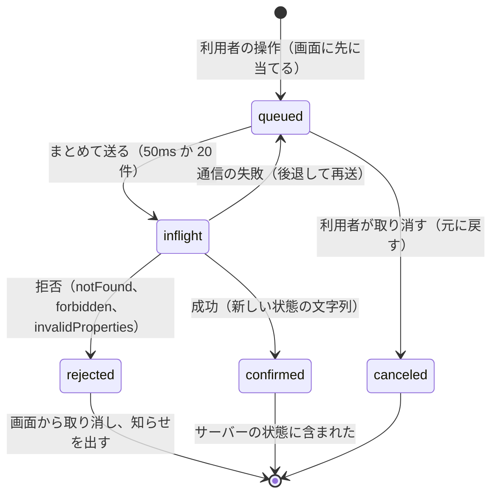
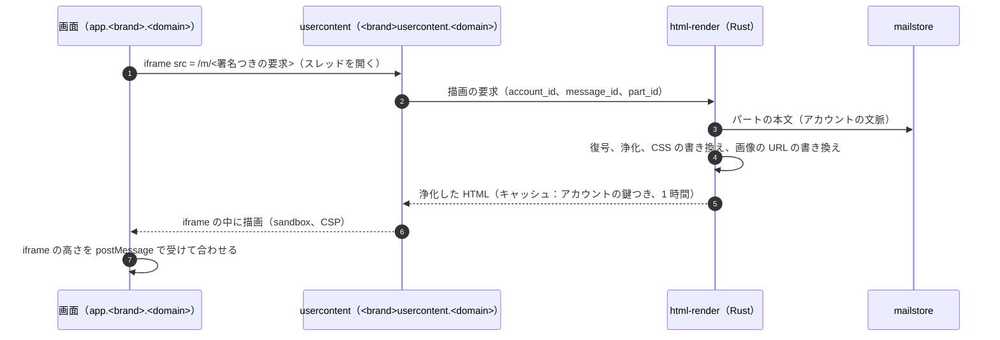

# Web Client: Gmail

Web のクライアントを決める。画面の構成と表示の速さ、オフラインの保存と楽観の更新、作成と下書き、元に戻す送信と予約の送信の画面、HTML メールの安全な描画、外部の画像とリンク、一括の配信停止のボタン、画面の計測を扱う。

前提となる決定は次のとおり。

- Web は React（TypeScript）で、JMAP のクライアントのライブラリは自前（[architecture/README.md](README.md) の 4 節）。API は JMAP とその拡張（[ADR-0006](../decisions/0006-sync-protocol-jmap-imap-and-modseq.md)、[client-sync-and-protocols.md](client-sync-and-protocols.md)）
- 利用者の中身を返すのは `<brand>usercontent.<domain>` からだけ（`AGENTS.md`）。本文の URL を書き換えない。外部の画像は代理で取る。迷惑メールの箱の画像は表示しない（[architecture/README.md](README.md) の 6 節の決定）
- 操作の画面の反映は 100ms 以内（楽観の更新）、受信箱の最初の表示 p95 1.5 秒、スレッドを開く p95 500ms（NFR-013）

この文書で決めたことは次の ADR にある。

| ADR | 決定 |
| --- | --- |
| [0043](../decisions/0043-web-offline-cache-and-optimistic-updates.md) | Web はアカウントごとの IndexedDB に、箱・スレッド・メッセージの見出しと直近の本文と JMAP の状態の文字列を持ち、最初の表示を手元から出してから差分で追いつく。操作は手元の変更の待ち行列に入れて画面に先に当て、JMAP の差分（集合の足し引き）で送る。サーバーの差分を受けたら、待ち行列の未確定の操作を上に当て直す。共有の端末では手元に保存しない設定を出し、サインアウトで消す |
| [0044](../decisions/0044-safe-html-rendering.md) | HTML メールは、サーバー（`jmap-api` の前の Rust の `html-render`）で許可の一覧による浄化と CSS の書き換えをし、`<brand>usercontent.<domain>` の origin の、スクリプトを許さない sandbox の iframe に置く。画像は代理の URL（ADR-0028）に書き換え、リンクは書き換えずに iframe の中の固定のスクリプトが親へ渡し、親が先頭のハッシュで確かめてから開く（ADR-0027）。迷惑メールの箱では画像とリンクを無効にする |

## 1. 範囲

- 扱う：
  - 画面の構成（受信箱、スレッド、作成、検索、ラベル、設定）、経路、表示の速さの予算
  - オフラインの保存、楽観の更新、変更の待ち行列、載せ直し
  - 作成、下書きの自動保存と衝突、添付のアップロード、署名
  - 元に戻す送信と予約の送信の画面
  - HTML メールの浄化と描画、外部の画像の代理、リンクの開き方
  - 一括の配信停止のボタン（法務の L2）、画面の計測（法務の L8）
  - キーボードの操作と、支援技術への対応の方針
- 扱わない：
  - 外部の画像の代理の取得の中（SSRF の防ぎ、画像の変換）と URL の評判、`url-check`（[attachment-and-url-scanning.md](attachment-and-url-scanning.md)、[ADR-0027](../decisions/0027-url-reputation-and-click-time-checks.md)、[ADR-0028](../decisions/0028-external-image-proxy.md)）。この文書は、画面がそれらの経路を使うところまで
  - 時刻の仕事（元に戻す送信の解放、予約の送信、スヌーズ）の仕組み（[filters-forwarding-and-automation.md](filters-forwarding-and-automation.md)）
  - サインインとセッション（accounts-and-security.md）
  - モバイルのアプリ（[mobile-and-push.md](mobile-and-push.md)）

## 2. 要件

| 要件 | 値 | 出どころ |
| --- | --- | --- |
| 受信箱の最初の表示 | p95 1.5 秒（手元の保存がない最初のサインインを含む） | NFR-013 |
| スレッドを開く | p95 500ms | NFR-013 |
| 操作の反映 | 既読、アーカイブ、ラベル、スター、ゴミ箱の画面の反映 100ms 以内 | NFR-013 |
| 同期 | 他の端末の変更が p95 2 秒で出る | NFR-006 |
| 安全な描画 | 受け取った HTML のスクリプトがどの origin でも動かない。本システムの画面の DOM・クッキー・保存に届かない | `AGENTS.md`、[quality.md](../quality.md) の 2.2.1 節 G |
| 中身を外へ出さない | 画面の計測に件名・本文・アドレス・検索の語を入れない | [ADR-0008](../decisions/0008-spam-pipeline-boundary-and-secrecy.md)、法務の L8 |

## 3. 本家の形

| 項目 | 本家 | この設計 |
| --- | --- | --- |
| 元に戻す送信 | 5・10・20・30 秒から選ぶ（[Undo sending](https://support.google.com/mail/answer/2819488)、2026-10-10 に確認） | 同じ。既定は 5 秒（本家の既定は**未検証**） |
| 予約の送信 | 100 通まで（[Schedule emails to be sent later](https://support.google.com/mail/answer/9214606)、2026-10-10 に確認） | 100 通、1 年先まで（[architecture/README.md](README.md) の 1.4 節は 100 通を**未検証**としていたが、この出典で確かめた） |
| 画面の配置、見た目 | — | 寄せる範囲は法務の L9（**法務の確認待ち**） |
| 画像の代理、HTML の浄化の詳細 | 公式の資料で確かめられなかった（**未検証**） | 7 節の本システムの方式 |

## 4. 画面の構成と表示の速さ

### 4.1 構成

- 1 つのページのアプリ。経路は `/u/<n>/inbox`、`/u/<n>/label/<label_id>`、`/u/<n>/thread/<thread_id>`、`/u/<n>/search?q=`、`/u/<n>/settings/*`。URL の `q` は検索の語だが、本システムの計測とログに URL を送らない（10 節）。
- 本システムの画面の origin は `app.<brand>.<domain>`。メールの本文・添付・画像は `<brand>usercontent.<domain>` からだけ返す。
- Service Worker は画面の骨格（JS・CSS・字形）をキャッシュし、オフラインでも開けるようにする。メールの中身は Service Worker のキャッシュに置かない（IndexedDB だけ。5 節）。

### 4.2 受信箱の最初の表示の予算（p95 1.5 秒）

| 段 | 手元の保存あり | 手元の保存なし |
| --- | --- | --- |
| 骨格（Service Worker か CDN） | 100ms | 400ms |
| セッションの確かめ（JMAP の Session） | 並べて | 150ms |
| 一覧のデータ | IndexedDB から 50 件 100ms | 1 回の JMAP の要求（`Mailbox/get`、`Email/query`（`collapseThreads`、50 件）、`#ids` の後ろの参照で `Email/get` の見出しだけ）400ms |
| 描画 | 150ms | 200ms |
| 合計 | 約 350ms。その後に `*/changes` で追いつく | 約 1,150ms |

- 見出しの性質は `id`、`threadId`、`mailboxIds`、`keywords`、`from`、`subject`、`preview`、`receivedAt`、`<brand>:inboxAt`、`hasAttachment`、`size` に限る。
- スレッドを開く p95 500ms：一覧の上位 10 スレッドと、指を載せたスレッドの本文を先に取る（`fetchHTMLBodyValues` は使わず、7 節の浄化した HTML を `<brand>usercontent.<domain>` から取る）。

## 5. オフラインの保存と楽観の更新（ADR-0043）

### 5.1 手元の保存

IndexedDB の、アカウントごとのデータベース（`acct-<account_id の HMAC>`）に持つ。

| 置き場所 | 中身 | 範囲 |
| --- | --- | --- |
| `mailboxes` | `Mailbox` の全部 | 全部 |
| `emails` | 見出し | 各箱の直近 500 件、検索で開いたもの |
| `bodies` | 浄化した HTML と text | 直近 14 日に開いたか届いたもの、合計 200 MB まで（古いものから捨てる） |
| `threads` | `Thread` | `emails` のもの |
| `state` | 型ごとの状態の文字列、`queryState` | — |
| `mutations` | 変更の待ち行列（5.2 節） | 未確定のもの |
| `drafts_local` | 送る前の下書きの手元の写し | 未保存のもの |

- 添付は保存しない（開くたびに取る）。
- 「この端末にメールを保存しない」（共有の端末向け）を選ぶと、IndexedDB を使わず、メモリーだけで動く。
- サインアウト、セッションの失効、アカウントの消去の知らせで、そのアカウントのデータベースを消す。消せなかったら、次の起動で消す（`state` に消去の印）。
- ブラウザーの保存は暗号化しない（端末の保護に任せる）。共有の端末の設定と、組織の管理者が「Web のオフラインを禁止」を選べるようにする（organizations-domains-and-routing.md）。

### 5.2 変更の待ち行列

- 操作は JMAP の差分（`mailboxIds/<id>: true|null`、`keywords/$seen: true|null`）か、拡張の `<Brand>Thread/set` で表し、全体の置き換えを使わない（[client-sync-and-protocols.md](client-sync-and-protocols.md) の 9 節）。集合の足し引きなので、他の端末の変更と順序を入れ替えても結果が同じ。
- 各操作は手元の ID を持ち、同じ操作の再送が 2 回当たっても結果が同じ（差分が冪等）。
- 「元に戻す」（アーカイブの直後のトースト）は、逆の差分を待ち行列に足す。まだ `queued` なら、元の操作を `canceled` にする。

### 5.3 載せ直し

- `StateChange` を受けたら `Email/changes` などで差分を取り、手元の `emails` をサーバーの値で置き換える。その後、待ち行列の `queued`・`inflight` の操作を、置き換えた値の上にもう一度当てて画面に出す。
- 操作が `confirmed` になるのは、その操作の応答の状態の文字列（`newState`）以上の差分を当てた時。

**例**：Web でスレッド T（2 通、受信箱）をアーカイブした直後に、スマートフォンで同じスレッドの 1 通にスターを付けた。

1. Web：操作 op1（T をアーカイブ）を `queued` にし、画面から T を消す（10ms）。
2. Web：op1 を送る（`inflight`）。サーバーは `modseq` 2001 で 2 通から `INBOX` を外す。
3. スマートフォン：`modseq` 2002 で 1 通に `STARRED`。
4. Web：`StateChange` を受け、`Email/changes` で 2 通の `updated` を取る。2 通とも `INBOX` なし、1 通に `$flagged`。待ち行列に未確定の操作はないので、そのまま出す。スターの付いたメッセージは「スター付き」の一覧に出る。
5. 2 と 3 の順が逆でも、どちらも差分なので、最後の状態は同じ。

### 5.4 オフラインの間

- 接続を失ったら、画面の上に「オフライン」を出し、操作を `queued` に溜める（1,000 件まで。超えたら新しい操作を止めて知らせる）。
- 送信はオフラインでも受け付け、`mutations` に `EmailSubmission/set` を溜める。画面は「送信待ち」の印を出し、戻ったら送る。元に戻す送信の窓は、サーバーが受け付けた時から数える。
- 戻ったら、手元の変更を先に送ってから差分を取る（[client-sync-and-protocols.md](client-sync-and-protocols.md) の 5.6 節）。`cannotCalculateChanges` のときは、待ち行列を保ったまま取り直し、上に当て直す。

## 6. 作成と下書き

- 下書きは、変更から 2 秒後と、作成の画面を閉じる時に `Email/set` で保存する。JMAP の Email は中身を変えられないので、保存は「新しい下書きを作り、古いものを消す」になる（RFC 8621 の 4.6 節）。下書きは拡張の `<brand>:draftVersion` を持ち、古いバージョンからの保存は `stateMismatch` になる（[client-sync-and-protocols.md](client-sync-and-protocols.md) の 9 節）。
- 衝突（2 つの端末で同じ下書きを書いた）：新しいほうをサーバーから読み、画面に「別の端末で変更された」と出し、どちらを残すかを利用者に選ばせる。選ばれなかったほうは、新しい下書きとして残す（失わない）。
- 添付は JMAP のアップロード（RFC 8620 の 6.1 節）で `<brand>usercontent.<domain>` の受け口に送る。1 ファイル 25 MiB、合計 25 MiB（NFR-011）。アップロードした blob は 24 時間で、下書きに使われなければ消える。
- 返信と転送は `In-Reply-To` と `References` を必ず付ける（[ADR-0005](../decisions/0005-threading-algorithm.md)）。引用は元の浄化した HTML を `blockquote` に入れる。
- 署名は、アカウントの設定（送信の別名ごと）から差し込む。署名の HTML も 7 節の浄化を通す。

### 6.1 元に戻す送信と予約の送信の画面

- 送信を押すと、`EmailSubmission/set` を送り、画面の下に「送信しています… 元に戻す」と、窓の残り（5・10・20・30 秒）を出す。窓は EmailSubmission の `<brand>:releaseAt` から数え、端末の時計のずれを `Date` の応答のヘッダーで補う。
- 「元に戻す」は `undoStatus: canceled` の更新を送る。成功すれば作成の画面を元の内容で開く。`cannotUnsend` なら「送信を取り消せなかった」と出す。
- 予約の送信は、日時の選び方（今日の夕方、明日の朝、月曜の朝、任意）と、アカウントの時間帯で `HOLDUNTIL` を作る（[client-sync-and-protocols.md](client-sync-and-protocols.md) の 6.6 節）。予約の一覧は `in:scheduled`。100 通を超えたら作れないと出す。

## 7. HTML メールの安全な描画（ADR-0044）

### 7.1 流れ

- 浄化はサーバーで行い、結果を `account_id`・`message_id`・`part_id`・浄化の規則のバージョンを鍵にキャッシュする。浄化の規則を変えたら、バージョンでキャッシュを捨てる。
- iframe の `src` は `<brand>usercontent.<domain>` の、アカウントとメッセージに結び付いた署名つきの短い期限（5 分）の URL。他のアカウントの `message_id` を入れても署名が合わない（[quality.md](../quality.md) の 2.2.1 節 G の blob の取得）。

### 7.2 浄化の規則（許可の一覧）

| 対象 | 規則 |
| --- | --- |
| 要素 | 許すもの：文字の構造（`p`、`div`、`span`、`br`、`h1`〜`h6`、`ul`、`ol`、`li`、`blockquote`、`pre`、`code`、`b`、`i`、`u`、`s`、`strong`、`em`、`small`、`sub`、`sup`、`hr`、`font`、`center`）、表（`table` の一族）、`a`、`img`。それ以外（`script`、`style` の外の CSS の読み込み、`iframe`、`object`、`embed`、`form`、`input`、`button`、`svg`、`math`、`video`、`audio`、`meta`、`base`、`link`）は消す（中の文字は残す。`script`・`style` の中は捨てる） |
| 属性 | 見た目の属性（`align`、`width`、`height`、`bgcolor`、`color`、`border`、`cellpadding` など）、`a` の `href`、`img` の `src`・`alt`、`style`。`on*`、`id`・`name`（画面の DOM と混ざらないよう `m-` を前に付ける）、`class`（同じ）。他は消す |
| URL | `href` は `http`・`https`・`mailto` だけ。`img` の `src` は `http`・`https`・`cid` だけ。`data:` は 64 KiB までの画像だけ。`javascript:` などは消す |
| CSS | `<style>` の中と `style` の属性を構文解析し、選択子を `.m-body` の下に閉じ込め、許す性質（色、字、余白、枠、表、幅と高さの上限つき）だけを残す。`position: fixed`、`url()`（画像の代理に書き換えるものを除く）、`@import`、`expression`、`behavior` を消す |
| 大きさ | 浄化の入力 2 MiB（[message-parsing-and-storage.md](message-parsing-and-storage.md) の 5.1 節の文字の上限の中）、DOM の深さ 256、要素 5 万。超えたら text の表示に落とす |

- 浄化器は、HTML の構文解析は汎用の HTML5 の解析のライブラリ（WHATWG の構文解析の手順に従うもの）を使い、許可の一覧と CSS の書き換えは自前で書く（[ADR-0001](../decisions/0001-platform-and-stack.md) の汎用の部品の一覧に足すかは 17 節の持ち越し）。
- 浄化した HTML を、もう一度構文解析して同じ木になること（変わらないこと）を性質ベーステストで確かめる（解析の違いを突く攻撃の防ぎ）。

### 7.3 iframe と CSP

- iframe：`sandbox="allow-popups allow-popups-to-escape-sandbox"`（スクリプト・同じ origin・フォーム・最上位の移動を許さない）、`referrerpolicy="no-referrer"`。
- `<brand>usercontent.<domain>` の応答の CSP：`default-src 'none'; img-src https://<brand>usercontent.<domain> data:; style-src 'unsafe-inline'; frame-ancestors https://app.<brand>.<domain>; base-uri 'none'; form-action 'none'`。
- 高さの合わせ：iframe の中はスクリプトが動かないので、`html-render` が描画の後の高さを出せない。画面は iframe の `ResizeObserver` で外から測れないため、iframe の文書に `<brand>usercontent.<domain>` の小さな固定のスクリプト（本システムが書いたもの、`script-src` に hash で許す）を 1 つだけ置き、高さと、リンクの押下（7.5 節）だけを `postMessage` で親へ送る。メールの HTML は、この hash に合わないので動かない。この 1 つのために `sandbox` に `allow-scripts` を足すが、`allow-same-origin` は足さない（origin は不透明のまま）。

### 7.4 画像

- 外部の画像の URL は、`html-render` が `https://<brand>usercontent.<domain>/img/<token>` に書き換える。`token` の形と代理の取得（SSRF の防ぎ、描き直し、アカウントごとのキャッシュ）は [ADR-0028](../decisions/0028-external-image-proxy.md)（`(account_id, message_id, URL の SHA-256, 期限 24 時間)` の署名。URL は `token` に入れず、メッセージの行から引く）。
- 利用者の IP、クッキー、`Referer` を送り手に渡さない。追跡の画像の送り手は、代理の取得の時刻だけを知りうる（法務の L8 の説明に含める）。
- 設定：「外部の画像を表示する」（既定）、「表示の前に確かめる」。迷惑メールの箱では常に表示しない。
- `cid:` の画像は、同じメッセージの添付のパートを `<brand>usercontent.<domain>` から返す（配る形。[message-parsing-and-storage.md](message-parsing-and-storage.md) の 7.5 節）。

### 7.5 リンク

- 保存した本文も、描画した HTML の `href` も変えない（[ADR-0027](../decisions/0027-url-reputation-and-click-time-checks.md)。サーバーに利用者の開いたリンクを渡さない）。`html-render` は `a` に `target="_blank" rel="noopener noreferrer"` を付けるだけにする。
- 開くときの確かめ：iframe の中の本システムの固定のスクリプト（7.3 節）が、リンクの押下を止めて `href` を親の画面へ `postMessage` で渡す。親は送り元の origin が `<brand>usercontent.<domain>` であることを確かめ、URL を正規化して、手元の悪い一覧の先頭 32 ビットの集合と比べる。当たったら `url-check` に先頭だけを送り、返った全体のハッシュと手元で比べる（[ADR-0027](../decisions/0027-url-reputation-and-click-time-checks.md)）。一致すれば警告の画面、しなければ `window.open(url, "_blank", "noopener,noreferrer")`。
- 先頭の集合は IndexedDB に持ち、30 分ごとに差分で取る。容量の都合で上位の分だけを持つ（数十 MiB の全部が入らないブラウザーでは、手元にない分を `url-check` の先頭の照会に回す。先頭 32 ビットだけを送るので、開いた URL はサーバーに分からない）。
- 固定のスクリプトが動かない場合（読み込みの失敗）は、確かめなしで新しいタブに開く（守りは配送の時の判定と配った後の手当て）。
- `mailto:` は作成の画面を開く。
- 迷惑メールの箱では、リンクを押せない（文字として出す）。

### 7.6 表示の印

- 差出人の確かめの印（DMARC の失敗、スレッドの乗っ取りの印、`<brand>:authWarning`）を、本文の上に本システムの画面として出す。本文の中には出さない（本文で偽の印を作れないため）。
- 迷惑メール・フィッシングの判定の理由のコードを、利用者向けの文で出す（[spam-and-abuse-filtering.md](spam-and-abuse-filtering.md)）。

## 8. 検索の画面

- 入力の候補は [search.md](search.md) の 9 節。最近の検索は IndexedDB にだけ持つ（共有の端末の設定では持たない）。
- 文法の誤りは、WASM の `search-lang` で入力中に示す（サーバーと同じ IR。[ADR-0036](../decisions/0036-search-language-and-ir.md)）。
- 検索の結果は `Email/query` の `<brand>:query`。オフラインの間は、手元の `emails` の見出しの単純な一致（件名・差出人）だけを出し、「オフラインの結果」と示す。

## 9. 一括の配信停止のボタン

- 受け取ったメールに `List-Unsubscribe-Post: List-Unsubscribe=One-Click` と HTTPS の `List-Unsubscribe` があり、DKIM の署名がその 2 つのヘッダーを含んで通るとき（RFC 8058 の 4 節）、`jmap-api` は `<brand>:unsubscribe = true` を返し、画面は件名の横に「配信停止」を出す（判定の中は [sender-authentication.md](sender-authentication.md)）。
- 押したら確かめの画面を出し、同意で `<Brand>Unsubscribe/set` を送る。本システムの egress が `List-Unsubscribe=One-Click` を本文に持つ POST を送る（クッキーなし、利用者の IP を使わない、転送をたどらない、時間切れ 10 秒）。
- 結果（成功、失敗）を利用者に示す。POST の後に同じ送り手から届いたメールは、2 日の後から「配信停止したのに届いた」として選別の点にする（[spam-and-abuse-filtering.md](spam-and-abuse-filtering.md)）。
- 利用者の代わりに URL を叩くことの扱いは法務の L2 の (d)（**法務の確認待ち**）。それまで `release.one-click-unsubscribe` の裏に置く。

## 10. 画面の計測

- 計測は、画面の速さ（4.2 節の各段）、誤りの数、操作の種類の数だけを、本システムの計測の受け口（`app.<brand>.<domain>` の同じ origin）へ送る。第三者の計測のサービスを使わない。
- 件名、本文、アドレス、検索の語、ラベルの名前、URL の経路の値（`thread_id` も含めて）を送らない。経路は型（`/thread/:id`）に置き換える。
- 端末の外へ情報を送らせることの通知・公表は法務の L8（**法務の確認待ち**）。それまで `release.ui-analytics` の裏に置く。

## 11. 操作と支援技術

- キーボードの操作（一覧の移動、開く、アーカイブ、返信、検索）を出し、設定で切れるようにする。キーの割り当てを本家にどこまで寄せるかは法務の L9。
- 一覧とスレッドは、見出しの構造と ARIA のランドマークを持ち、画面の読み上げで使える。メールの本文の iframe には `title` を付ける。
- 色だけで状態（未読、迷惑メール）を示さない。

## 12. 失敗と回復

| 事象 | 影響 | 扱い |
| --- | --- | --- |
| IndexedDB の容量の不足・壊れ | 手元の保存が書けない | メモリーだけで動く形に落とし、データベースを作り直す |
| 待ち行列の操作の拒否 | 画面と違う状態 | 画面から取り消し、知らせる（5.2 節） |
| 長いオフライン（30 日超え） | 差分が取れない | 取り直し。待ち行列は保ち、上に当て直す |
| `html-render` の停止 | 本文を描画できない | text のパートを画面の側で文字として出す（HTML を解釈しない） |
| 浄化の規則の誤り（すり抜け） | スクリプトが動く恐れ | iframe の sandbox と CSP の 2 段で、メールの HTML のスクリプトは動かない。規則を直し、浄化のキャッシュをバージョンで捨てる |
| 代理の画像の取得の失敗 | 画像が出ない | 空の枠を出す |
| 固定のスクリプトの読み込みの失敗 | 開くときの確かめが効かない | 確かめなしで開く。読み込みの失敗の率を見張る |
| 時計のずれ | 元に戻す送信の残りの表示がずれる | サーバーの時刻で補う。取り消しの成否はサーバーが決める |

## 13. 上限

| 対象 | 値 | 持ち場所 |
| --- | --- | --- |
| 手元の本文 | 200 MB、直近 14 日 | ADR-0043 |
| 手元の見出し | 箱ごとに 500 件 | ADR-0043 |
| 待ち行列 | 1,000 件 | ADR-0043 |
| 下書きの自動保存 | 変更から 2 秒 | 6 節 |
| 添付 | 25 MiB（合計） | NFR-011 |
| 浄化の入力 | 2 MiB、深さ 256、要素 5 万 | ADR-0044 |
| iframe の URL の期限 | 5 分 | ADR-0044 |
| 浄化のキャッシュ | 1 時間 | ADR-0044 |
| 予約の送信 | 100 通、1 年先 | [client-sync-and-protocols.md](client-sync-and-protocols.md) の 6.6 節 |

## 14. data-model への項目

| 置き場所 | 中身 | 鍵・索引 | 節 |
| --- | --- | --- | --- |
| ブラウザーの IndexedDB `acct-<hmac>` | `mailboxes`、`emails`、`bodies`、`threads`、`state`、`mutations`、`drafts_local` | 端末の中だけ | 5.1 |
| Valkey `render:{account_id}:{message_id}:{part_id}:{rules_version}` | 浄化した HTML（アカウントの鍵で暗号化） | 1 時間 | 7.1 |
| ブラウザーの IndexedDB `url_prefixes` | 悪い一覧の先頭 32 ビットの集合（上位の分） | 30 分ごとに差分 | 7.5 |
| メールボックスのシャード `account_settings` に足す列 | `undo_send_seconds`（5・10・20・30）、`external_images`（`show`・`ask`）、`offline_allowed`、`keyboard_shortcuts`、`time_zone` | 主キー `(tenant_id, account_id)` | 5.1、6.1、7.4 |
| メールボックスのシャード `unsubscribe_actions` | `message_id`、`list_domain`、`requested_at`、`result` | 主キー `(tenant_id, account_id, message_id)` | 9 |

## 15. テストと性質

| ID | 性質・試験 |
| --- | --- |
| PROP-WEB-001 | 任意の操作の列と、任意のサーバーの差分の到着（他の端末の変更を含む）と、任意の通信の失敗で、待ち行列が空になった後の手元の状態がサーバーと一致する（同期の収束の模型に Web のクライアントの模型を足す。[quality.md](../quality.md) の 2.2.1 節 E） |
| PROP-WEB-002 | 任意の HTML の入力で、浄化の結果にスクリプトの実行の経路（`script`、`on*`、`javascript:`、`data:text/html`、`<svg>`、CSS の `expression`）がない |
| PROP-WEB-003 | 浄化した HTML を構文解析して浄化し直しても、同じ結果になる（不動点） |
| PROP-WEB-004 | 任意の CSS で、書き換えた選択子は `.m-body` の外の要素に当たらない |
| PROP-WEB-005 | 親の画面は、`<brand>usercontent.<domain>` 以外の origin からの `postMessage` を受けない。開いたリンクの URL・全体のハッシュはサーバーへ送られない（送る値の型の検査） |
| 試験のベクトル | 公開の XSS の試験の集まり（使ってよいと確かめたもの）と、メールの HTML の崩れの型（Outlook の条件つきの注記、``、表の入れ子） |
| E2E | Playwright：受信箱、スレッド、作成と送信、元に戻す送信、予約、検索、ラベル、迷惑メールの報告、オフラインの操作と復帰、配信停止 |
| 計測 | 4.2 節の予算を、検証の環境で 10 万通のアカウントで測る |
| 経路の検査 | 画面の計測の送信に、件名・アドレス・検索の語が入らない（送る値の型の検査） |

## 16. Story の候補

| Epic | Story | 中身 |
| --- | --- | --- |
| E9 | `web-shell-and-inbox` | 骨格、受信箱、表示の予算（4 節）。画面の寄せ方は法務：L9 |
| E9 | `web-offline-and-optimistic` | IndexedDB、待ち行列、載せ直し（5 節） |
| E9 | `thread-view-and-safe-html` | `html-render`、浄化、iframe、CSP（7.1〜7.3 節） |
| E9 | `remote-image-proxy` | 画像の書き換えと代理（7.4 節。取得の中は [attachment-and-url-scanning.md](attachment-and-url-scanning.md)） |
| E9 | `click-time-link-check` | iframe の押下の受け渡しと、先頭のハッシュの確かめ（7.5 節。`url-check` は [attachment-and-url-scanning.md](attachment-and-url-scanning.md)） |
| E9 | `compose-and-drafts` | 作成、下書き、衝突、添付（6 節） |
| E9 | `undo-and-scheduled-send` | 6.1 節 |
| E9 | `one-click-unsubscribe-button` | 9 節。法務：L2 |
| E9 | `labels-and-settings-ui` | ラベル、設定、フォルダーの表示 |
| E9 | `ui-analytics` | 10 節。法務：L8 |

## 17. 未解決の問い

### 決定（2026-10-10、既定案）

- **手元の保存**：IndexedDB に見出しと直近の本文。共有の端末の設定（ADR-0043）。
- **楽観の更新**：JMAP の差分の待ち行列と載せ直し（ADR-0043）。
- **HTML**：サーバーで浄化し、usercontent の sandbox の iframe（ADR-0044）。
- **リンク**：本文も描画した `href` も変えず、押下を親の画面で確かめる（ADR-0044、ADR-0027）。
- **元に戻す送信の既定**：5 秒（[architecture/README.md](README.md) の 6 節）。

### 持ち越し

| 問い | いつ・どう決めるか |
| --- | --- |
| HTML5 の構文解析のライブラリを、[ADR-0001](../decisions/0001-platform-and-stack.md) の汎用の部品の一覧に足す | 統合の工程で済んだ：[ADR-0062](../decisions/0062-generic-components-additions-and-supply-chain.md) が一覧に足し、[ADR-0001](../decisions/0001-platform-and-stack.md) から参照した。`thread-view-and-safe-html` の spec の承認の止めは外れた |
| 画面の配置とキーの割り当てをどこまで本家に寄せるか | 法務の確認待ち（L9） |
| 配信停止のボタン | 法務の確認待ち（L2） |
| 画面の計測の通知・公表 | 法務の確認待ち（L8） |
| ブラウザーの保存の暗号化（端末の鍵での） | セキュリティ（security.md）。MVP は端末の保護に任せる |

## 出典

- Gmail Help, [Undo sending your mail](https://support.google.com/mail/answer/2819488)、[Schedule emails to be sent later](https://support.google.com/mail/answer/9214606)（2026-10-10 に確認）
- [RFC 8620](https://www.rfc-editor.org/rfc/rfc8620) の 6.1 節、[RFC 8621](https://www.rfc-editor.org/rfc/rfc8621) の 4.6 節・7 節
- [RFC 8058](https://www.rfc-editor.org/rfc/rfc8058)（One-Click の配信停止）、[RFC 2369](https://www.rfc-editor.org/rfc/rfc2369)（`List-Unsubscribe`）、[RFC 2392](https://www.rfc-editor.org/rfc/rfc2392)（`cid:`）
- WHATWG, [HTML Living Standard](https://html.spec.whatwg.org/)（`iframe` の `sandbox`）、W3C, [Content Security Policy Level 3](https://www.w3.org/TR/CSP3/)
