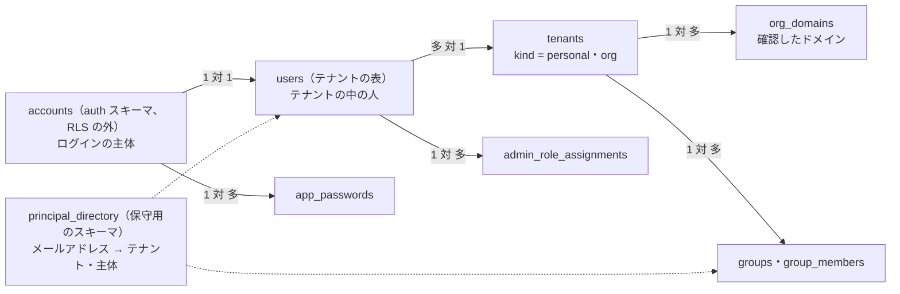
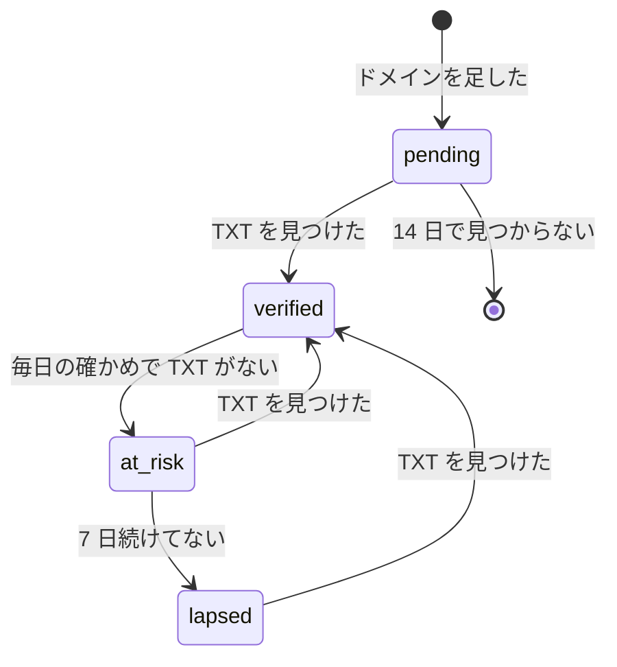
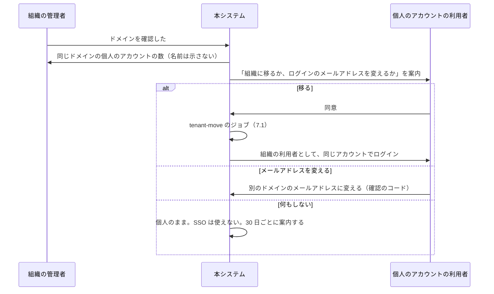
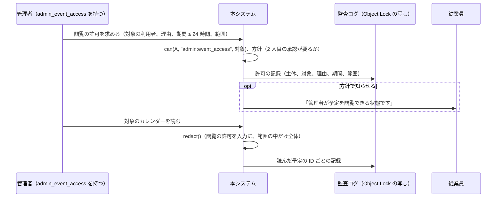

# Accounts and Orgs: Google Calendar

個人のアカウントと組織、テナントとの結び付き、ログインとセッション、組織のドメインの確認、個人から組織への移り、SSO（SAML・OIDC）、CalDAV のアプリ用のパスワードとトークンの形、組織の認証の方針、組織のディレクトリ（利用者・グループ）とメールアドレスの解決、SCIM、管理の役割と委任、管理者による予定の閲覧の枠、利用者の停止・削除と予定の引き継ぎを決める。

前提となる決定は、基盤（[ADR-0001](../decisions/0001-platform-and-stack.md)）、テナントと権限（[ADR-0004](../decisions/0004-tenancy-and-rls.md)）、変更のログ（[ADR-0005](../decisions/0005-change-log-and-sync-tokens.md)）、写し（[ADR-0006](../decisions/0006-organizer-and-attendee-copies.md)）、グループの招待（[ADR-0016](../decisions/0016-group-invitation-expansion.md)）。他の題材（Linear の [ADR-0034](../../../linear/docs/decisions/0034-accounts-with-better-auth.md)、Slack の [identity-and-access.md](../../../slack/docs/architecture/identity-and-access.md)）の認証の部品の選び方に揃える。この文書で決めたことは次の ADR にある。

| ADR | 決定 |
| --- | --- |
| [0035](../decisions/0035-accounts-auth-library-and-credentials.md) | 認証の部品に Better Auth を使い、`packages/auth` で包む。アカウントは RLS の外の `auth` スキーマに置き、1 つのアカウントを 1 つのテナント（個人のテナントか組織）の利用者の行に結ぶ。ログインはメールのコードとリンク、パスキー、Google、組織の SSO で、パスワードを持たない。セッションは HttpOnly のクッキーで、使わないまま 30 日で切れる。CalDAV のアプリ用のパスワードは `<brand>_ap_` の形で、CalDAV だけの範囲・最長 1 年の期限を持ち、SHA-256 だけを保存する |
| [0036](../decisions/0036-org-domains-sso-and-scim.md) | 組織のドメインは DNS の TXT（`<brand>-domain-verification=<token>`）で確かめ、毎日確かめ直す。SSO は `@better-auth/sso` で、ドメインごとに SAML 2.0 か OIDC の IdP を 1 つ持ち、SP 起点だけ・署名した主張を必須にする。SSO を必須にでき、そのとき特権の管理者だけはパスキーで入れる。確認したドメインの個人のアカウントは、本人の同意で組織へ移す（データを移し、他のテナントの写しの参照を付け替える）。SCIM 2.0 は SSO の後に足し、停止は利用者の停止に写す |
| [0037](../decisions/0037-admin-roles-delegation-and-event-access.md) | 管理の役割を `super_admin`・`user_admin`・`calendar_admin`・`resource_admin`・`auditor`・`helpdesk` の 6 つにし、`super_admin` 以外は組織の全体か、指定したグループの範囲に委任できる。管理者による従業員の予定の中身の閲覧は、法務の L8 の結論まで `release.admin-event-access` のフラグの裏に置き、仕組みだけを作る：理由と期間（最長 24 時間）を書いた閲覧の許可、`can()` の入力、監査ログへの記録 |

## 1. 目的と範囲

- 扱う：
  - アカウント、テナント、利用者の行の関係
  - ログインの手段、セッション、取り消し
  - 組織の作成、ドメインの確認、個人から組織への移り
  - SSO（SAML 2.0・OIDC）と、SSO を必須にする設定
  - CalDAV のアプリ用のパスワード、トークンの形と保存
  - 組織の認証の方針（ログインの手段、アプリ用のパスワード、セッションの長さ）
  - 組織のディレクトリ（利用者、グループ）、メールアドレスの解決
  - SCIM 2.0
  - 管理の役割と委任、管理の画面
  - 管理者による予定の閲覧の枠（法務の L8）
  - 利用者の停止・削除、予定の引き継ぎ
- 扱わない：
  - OAuth 2.0 のアプリと範囲（[api-and-push.md](api-and-push.md) の 6 節。トークンの形はこの文書の 9 節と揃える）
  - カレンダーの ACL、組織の共有の方針の決定表（[sharing-and-acl.md](sharing-and-acl.md)）
  - 会議室のディレクトリ（[rooms-and-resources.md](rooms-and-resources.md)）
  - グループの招待の展開（[invitations-and-itip.md](invitations-and-itip.md) の 10 節）
  - 監査ログの表、脅威モデル、データのライフサイクル（[security.md](security.md)）
  - ログインの画面（[clients.md](clients.md)）

## 2. 要件

| 要件 | 目標 | NFR・基準 |
| --- | --- | --- |
| テナントの分離 | 利用者は、自分のテナントと、共有されたものだけを見る | NFR-008、[ADR-0004](../decisions/0004-tenancy-and-rls.md) |
| 停止の速さ | 利用者の停止から、全部のセッション・アプリ用のパスワード・OAuth のトークンが効かなくなるまで 60 秒以内 | 本システムの基準 |
| ログイン | ログインの手続きの p95 1 秒（IdP の往復を除く） | NFR-001 に準じる |
| 可用性 | ログインと CalDAV の認証 月間 99.9% | NFR-006 |
| CalDAV | OS の標準のカレンダーが、ログインのパスワードなしで使える | [architecture/README.md](README.md) の 6 節の決定 |
| 管理者の閲覧 | 法務の L8 の結論まで、従業員の予定の中身を管理者が見る機能を出さない | [intent.md](../intent.md) の L8 |

## 3. 本家の形（確かめたこと）

いずれも 2026-10-04 に確認。

| 項目 | 内容 | 出典 |
| --- | --- | --- |
| 組織の中の共有の既定 | 主のカレンダーについて、管理者が「共有しない」「空き時間だけ（詳細を隠す）」「すべての情報を共有」から選ぶ | [Set Google Calendar sharing options](https://knowledge.workspace.google.com/admin/calendar/set-google-calendar-sharing-options) |
| 組織の外への共有 | 「空き時間だけ」「すべて、外の人は変えられない」「すべて、外の人も変えられる」「すべて、管理もできる」 | 同上 |
| 管理者の閲覧 | 特権の管理者と「カレンダーの管理」の権限を持つ管理者は、カレンダーの共有に関係なく、全員のカレンダーの予定の詳細を見られる | 同上 |
| 削除の前の引き継ぎ | 主のカレンダーの、未来の、非公開でない、参加者か会議室が 1 つ以上ある予定だけを引き継げる。非公開の予定はすべて取り消す。2026 年の初めから、持ち主を消すと追加のカレンダーとその予定も消える | [Cancel or transfer events or secondary calendars before deleting a user](https://knowledge.workspace.google.com/admin/calendar/cancel-or-transfer-events-or-secondary-calendars-before-deleting-a-user) |
| CalDAV の認証 | OAuth 2.0 だけで、Basic 認証は受けない | [CalDAV API developer's guide](https://developers.google.com/workspace/calendar/caldav/v2/guide) |

- 本家のドメインの確認の方式、SSO の設定の細部、SCIM の対応、管理の役割の一覧と委任の細部は、カレンダーの資料の範囲では確かめていない（**未検証**）。
- 本家の CalDAV は Basic 認証を受けないが、本システムは OS の標準のカレンダーのために、CalDAV だけのアプリ用のパスワードを持つ（[architecture/README.md](README.md) の 6 節の決定）。本家と違う。

## 4. モデル

| 表 | 置き場所 | 中身 |
| --- | --- | --- |
| `auth.user`（アカウント） | `auth` スキーマ（RLS の外） | ログインの主体（Better Auth の `user` の表。[data-model.md](data-model.md) の D-8）。主のメールアドレス、名前、ロケール、状態、Better Auth の表（セッション、パスキー、外部のアカウント、検証の値） |
| `tenants` | 保守用のスキーマ | `kind`（`personal`・`org`・`system`。`system` は日本の祝日のカレンダーを持つ 1 つ。[data-model.md](data-model.md) の D-10）、名前、地域、状態、作成の時刻 |
| `users` | テナントの表（RLS） | `(tenant_id, id)`、`account_id`、表示の名前、名前の読み（カナ）、メールアドレスと別名、タイムゾーン、ロケール、状態（`active`・`suspended`・`deleted`）、SCIM の外部の ID |
| `groups`・`group_members` | テナントの表 | グループ、グループのメールアドレス、メンバー（利用者・入れ子のグループ） |
| `org_domains` | テナントの表 | ドメイン、確認のトークン、状態、最後に確かめた時刻 |
| `principal_directory` | 保守用のスキーマ | 正規化したメールアドレス → `(tenant_id, kind, id)`。`kind` は `user`・`group`・`room` |

- **1 つのアカウントは 1 つのテナントに属する**（[ADR-0004](../decisions/0004-tenancy-and-rls.md) の「組織を 1 つのテナント、個人のアカウントを 1 人 1 つのテナント」）。Linear・Slack の題材のように 1 人が複数のワークスペースに入る形にしない。カレンダーは 1 人の主のカレンダーを中心にし、組織の外の人とは共有と招待でつながるためである。複数の組織に属する人は、組織ごとに別のアカウント（別のメールアドレス）を持つ。
- 個人のテナントは、アカウントの作成と同じトランザクションで作る（テナントの行、利用者の行、主のカレンダー）。S1 で 30 万の個人のテナントがあるので、テナントごとの設定の行は、既定と違うときだけ持つ。
- `principal_directory` は、招待の配送・空き時間の照会・SSO の振り分けで、メールアドレスからテナントを決めるために使う（[ADR-0004](../decisions/0004-tenancy-and-rls.md) の「アカウントとメールアドレスの解決はテナントの外に置く」）。読むのは認証・配送・空き時間のロールだけ。

## 5. ログインとセッション

ADR-0035。

| 手段 | 部品 | 注記 |
| --- | --- | --- |
| メールのコードとリンク | Better Auth の Email OTP・Magic link | コード 6 桁・10 分、リンク 10 分・1 回限り |
| パスキー | `@better-auth/passkey`（WebAuthn） | 1 アカウント 10 まで |
| Google | Better Auth の OIDC の提供者 | `email_verified` が真のときだけ結ぶ |
| 組織の SSO | `@better-auth/sso`（8 節） | 組織の確認したドメインのメールアドレス |
| パスワード | 持たない | CalDAV はアプリ用のパスワード（9 節） |

- **入口**：`https://auth.<brand>.<domain>`。メールアドレスを入れると、`principal_directory` と `org_domains` で、SSO の組織か、個人かを決めて手段を示す。
- **セッション**：HttpOnly・`Secure`・`SameSite=Lax` のクッキー（`calendar.<brand>.<domain>` と `api.<brand>.<domain>` で共有するため、親のドメインに付ける）。使わないまま 30 日で切れ、使うたびに延びる。組織は最長の長さを 1〜30 日で絞れる（10 節）。
- **取り消し**：利用者は設定でセッションの一覧（端末、最後の利用）を見て取り消せる。取り消しと停止は Valkey の取り消しの一覧に 30 日置き、API・CalDAV・Realtime が要求ごとに確かめる。Realtime は合図を受けて 5 秒以内に接続を切る。
- **ログインの失敗の上限**：メールのコードは 1 アカウント 10 分で 5 回、送り直しは 1 時間で 5 回。IP ごとに 10 分で 100 回。
- 部品の版と脆弱性の告知の状況は、Linear の題材の accounts-and-auth.md の 2.2 節（2026-09-28 に確認。告知が多いので、使う部品だけを依存に入れる）を引き継ぎ、E4 の着手で確かめ直す。組織（organization）の部品と OAuth の提供者の部品は使わない（組織・メンバーは自前のモデル、OAuth の認可サーバーは [api-and-push.md](api-and-push.md) の 6 節で自前）。

## 6. 組織とドメインの確認

ADR-0036。

### 6.1 組織を作る

1. 個人のアカウントの利用者が「組織を作る」を選び、組織の名前とドメインを入れる。
2. 新しい組織のテナントを作り、作った人を `super_admin` にする。作った人のアカウントは、7 節の手順で組織へ移る。
3. ドメインの確認を始める（6.2 節）。確認が済むまで、組織は招待したメールアドレスの人だけを利用者にできる。

### 6.2 ドメインの確認

| 項目 | 決定 |
| --- | --- |
| 記録 | ドメインの頂点に `TXT "<brand>-domain-verification=<token>"`。`token` は 128 ビットの乱数を base32 にしたもの |
| 確かめ | 足した直後は 5 分ごとに 14 日まで。確認の後は毎日。DNSSEC の検証つきの再帰の名前解決を使う |
| 1 つのドメイン | 1 つの組織だけが `verified` にできる。他の組織が同じドメインを足したら、先の組織の確認が切れていない限り拒否する |
| サブドメイン | 確認したドメインのサブドメインは、同じ組織が追加の確認なしで使える |
| `verified` でできること | SSO の振り分け、JIT の作成（8.2 節）、個人のアカウントの移り（7 節）、ドメインの全員への共有（[ADR-0004](../decisions/0004-tenancy-and-rls.md) の主体「ドメイン」） |
| `at_risk`・`lapsed` | `at_risk` は管理者に知らせるだけ。`lapsed` になったら、新しい JIT の作成と個人のアカウントの移りの案内を止める。既存の利用者と SSO のログインは続ける（締め出しを避ける） |

## 7. 個人から組織への移り

確認したドメインのメールアドレスを持つ個人のアカウントがあると、同じ人が個人と組織の 2 つのテナントに分かれる。本人の同意で組織へ移す。

### 7.1 データの移し方

- `tenant-move` のジョブが、個人のテナントのカレンダー・予定オブジェクト・リマインダーの設定・購読を、組織のテナントへ移す。ID（UUIDv7）は変えず、`tenant_id` を変える。
- 移しは、カレンダーごとに 1 つのトランザクションで、`packages/writer` の移しの操作として行い、カレンダーの `floor_seq` を `change_seq + 1` に上げる（そのカレンダーの古いトークンは 410。[data-model.md](data-model.md) の D-11。[ADR-0005](../decisions/0005-change-log-and-sync-tokens.md)）。CalDAV の URL は `user_id` と `calendar_id` だけを含むので変わらない（[sync-and-caldav.md](sync-and-caldav.md) の 6.1 節）。
- 他のテナントにある参加者の写しは、主催者の写し（`organizer_ref` の `tenant_id`）を古いテナントで指している。移しの後、移した予定オブジェクトの全員へ、新しい `organizer_ref` の内部の `REQUEST` を送る（`SEQUENCE` は上げない）。古い参照に届く `REPLY` は、`moved_event_objects`（古い `(tenant_id, event_object_id)` → 新しい）で 90 日、新しいテナントへ回す。
- 外部の参加者へ送った iMIP の ORGANIZER（受け口のアドレス）は、予定ごとの `token` なので変えない（[ADR-0015](../decisions/0015-imip-addressing-and-trust.md)）。
- 共有の ACL（個人のカレンダーを他の人へ共有していた行）は、組織の共有の方針（組織の外への共有の上限）を当て直し、方針を超える行を無効にする（[ADR-0004](../decisions/0004-tenancy-and-rls.md)）。
- 移しの間、その利用者の書き込みを止める（数分）。移しが失敗したら、カレンダーごとに戻せる形で進め、途中の状態を管理者と本人に示す。
- 組織から個人へ戻す移り（退職など）は MVP で持たない。退職は 15 節の停止・削除で扱う。

## 8. SSO

ADR-0036。

### 8.1 設定

| 項目 | SAML 2.0 | OIDC |
| --- | --- | --- |
| 起点 | SP 起点だけ。IdP 起点の応答は受けない | 認可コードと PKCE |
| 検証 | 応答か主張の署名を必須、`InResponseTo`、`Audience`、`NotOnOrAfter`（時計のずれ 3 分まで）、`Destination` | `id_token` の署名、`iss`・`aud`・`nonce`・`exp`、`email_verified` |
| 利用者の特定 | `NameID`（`emailAddress` の形）か、設定した属性のメールアドレス。確認したドメインのものだけ | `email` の主張。確認したドメインのものだけ |
| 1 つのドメイン | IdP を 1 つ | 同じ |
| 証明書 | IdP の証明書を 2 つまで（入れ替えのため）。期限の 30 日前に管理者に知らせる | JWKS を 1 時間ごとに取る |
| ACS・戻りの URL | `https://auth.<brand>.<domain>/sso/saml/<org_id>/acs` | `https://auth.<brand>.<domain>/sso/oidc/<org_id>/callback` |

- 部品は `@better-auth/sso`（SAML は samlify）。Slack の題材と同じく、`InResponseTo` の検証を有効にし、IdP 起点を受けない（[identity-and-access.md](../../../slack/docs/architecture/identity-and-access.md)、2026-09-26 に確認）。
- IdP の属性で管理の役割を決めない。役割は本システムの管理の画面で決める（13 節）。
- SAML の Single Logout は MVP で持たない。本システムのログアウトは IdP のセッションを終えない。

### 8.2 JIT とログインの規則

DT-ACCT-001。確認したドメインのメールアドレスでのログイン。上から当てる。

| # | 組織の設定 | アカウントの状態 | → 動作 |
| --- | --- | --- | --- |
| 1 | — | 停止・削除された利用者 | 拒否 |
| 2 | SSO を必須 | `super_admin` で、パスキーを持つ | パスキーでも入れる（IdP の障害での締め出しを避ける）。監査ログに残す |
| 3 | SSO を必須 | それ以外 | IdP へ送る。他の手段は拒否 |
| 4 | SSO を任意 | — | IdP か、組織が許した他の手段（10 節） |
| 5 | SSO で通った、利用者がない | JIT が有効 | 利用者を作る（主のカレンダー、組織の既定） |
| 6 | SSO で通った、利用者がない | JIT が無効 | 拒否（SCIM か管理者の招待を待つ） |
| 7 | SSO で通った、同じメールアドレスの個人のアカウントがある | — | 7 節の移りの案内を出し、同意の後に移す。同意しなければ拒否 |

## 9. アプリ用のパスワードとトークンの形

ADR-0035。

| 種類 | 形 | 保存 | 注記 |
| --- | --- | --- | --- |
| CalDAV のアプリ用のパスワード | `<brand>_ap_` ＋ base32 の乱数 24 文字 ＋ チェックサム 4 文字 | SHA-256 と、末尾 4 文字 | 範囲は CalDAV だけ。期限は既定 1 年・最長 1 年。1 利用者 20 まで |
| OAuth のトークン | `<brand>_oat_`・`<brand>_ort_`・`<brand>_ocs_` | SHA-256 | [api-and-push.md](api-and-push.md) の 6.1 節 |
| SCIM のトークン | `<brand>_scim_` ＋ base62 の乱数 32 文字 ＋ チェックサム 6 文字 | SHA-256 | 組織に 2 つまで（入れ替えのため） |
| Webhook の署名の秘密 | `<brand>_whsec_` | 暗号文 | [api-and-push.md](api-and-push.md) の 7.1 節 |

- アプリ用のパスワードは、作った時に 1 回だけ示す。画面で「iPhone のカレンダー」などの名前を付け、最後の利用の時刻（1 時間に 1 回だけ書く）と、使った端末の種類（`User-Agent` の大分類）を示す。
- base32（大文字と数字、紛らわしい文字を除く）にするのは、OS の設定の画面に手で写すことがあるためである。
- 接頭辞とチェックサムで、シークレットスキャン（GitHub のパートナープログラムなど）が見つけられるようにする。接頭辞は他の既知のサービスと重ならないことを確かめてから登録する（[リポジトリ共通の ADR-0006](../../../../docs/decisions/0006-brand-neutral-identifiers.md)）。
- CalDAV の Basic 認証は、利用者名（メールアドレス）でアカウントを引き、その人の有効なアプリ用のパスワードのハッシュと定数時間で比べる。高いエントロピーの値なので、遅いハッシュは使わない。

## 10. 組織の認証の方針

| 設定 | 値 | 既定 | 変えられる役割 |
| --- | --- | --- | --- |
| `login_methods` | `email_otp`・`passkey`・`google`・`sso` の部分集合 | `sso` 以外の全部（SSO を設定したら `sso` を足す） | `super_admin` |
| `sso_required` | 真・偽 | 偽 | `super_admin` |
| `jit_provisioning` | 真・偽 | 真 | `super_admin` |
| `session_max_idle_days` | 1〜30 | 30 | `super_admin` |
| `app_passwords_allowed` | 真・偽 | 真 | `super_admin` |
| `oauth_apps_policy` | `all`・`allowlist`・`none`（[api-and-push.md](api-and-push.md) の 6.3 節） | `all` | `super_admin` |
| `booking_pages_policy` | `allowed`・`internal_only`・`disabled`（[booking-pages.md](booking-pages.md) の 4 節） | `allowed` | `calendar_admin` |

- 方針を狭めたら、方針の外の資格（セッション、アプリ用のパスワード、OAuth のトークン）を 60 秒以内に効かなくする（Valkey の取り消しの一覧と、資格の行の無効化）。
- `app_passwords_allowed` を偽にすると、CalDAV は OAuth 2.0 の Bearer だけになる。OS の標準のカレンダーは使えなくなるので、画面で影響を示してから変える。

## 11. ディレクトリとメールアドレスの解決

- **組織のディレクトリ**：利用者（名前、名前の読み、メールアドレス、部署の表示）とグループ。組織の利用者だけが見る。組織の外の人へは出さない。
- **検索**：`GET /v1/directory/search?q=` は、名前・名前の読み・メールアドレスの前方一致と部分一致（[search.md](search.md) の 5 節の正規化と `pg_bigm`）。1 回 20 件、1 利用者 1 分 60 回。停止した利用者は出さない。
- **グループ**：管理者が画面で作るか、SCIM で受ける。グループのメールアドレス、メンバー（利用者・グループ）、入れ子は 10 段まで（[ADR-0016](../decisions/0016-group-invitation-expansion.md)）。メンバーの変化は `group_membership_changes` に書き、グループの招待へ反映する（[invitations-and-itip.md](invitations-and-itip.md) の 10.2 節）。
- **メールアドレスの解決**：`principal_directory` で、正規化したメールアドレス（小文字、`+` の後ろを落とさない）から主体を引く。利用者の別名も入れる。見つからなければ外部の人。
- **会議室**：会議室のディレクトリは [rooms-and-resources.md](rooms-and-resources.md)。`principal_directory` には `kind = room` で入れる。

## 12. SCIM

ADR-0036。SCIM は MVP に含める（[intent.md](../intent.md)）。SSO の後に、E4 の最後の Story（`scim-provisioning`）として `release.scim` のフラグの裏で足し、GA の判定（E12）の前に 100% にしてフラグを消す。

| 項目 | 決定 |
| --- | --- |
| 入口 | `https://auth.<brand>.<domain>/scim/v2/<org_id>/`。`Users`・`Groups`・`ServiceProviderConfig`・`Schemas`・`ResourceTypes` |
| 認証 | `Authorization: Bearer <brand>_scim_…`（9 節） |
| 部品 | `@better-auth/scim` を評価して使う。受けた操作は、本システムのディレクトリの書き込み（`packages/directory`）に写し、監査ログに残す。1.5.0〜1.7.0-beta.3 に、別の利用者の SCIM の提供者を乗っ取れる告知があり 1.7.0 で直っている（[GHSA-j8v8-g9cx-5qf4](https://github.com/better-auth/better-auth/security/advisories/GHSA-j8v8-g9cx-5qf4)、2026-10-04 に確認）。1.7.0 より前を使わない |
| Users の作成 | 利用者を作る（確認したドメインのメールアドレスだけ）。同じメールアドレスの個人のアカウントがあれば、7 節の案内を出し、移るまで `pending` |
| `active=false` | 利用者の停止（15 節） |
| 削除 | 停止にする。削除（15 節の引き継ぎ）は管理者が画面で行う |
| Groups | グループとメンバー。`group_membership_changes` に書く |
| 上限 | 1 組織 1 分 600 要求。1 つの `PATCH` の操作は 1,000 まで |

## 13. 管理の役割と委任

ADR-0037。

| 役割 | できること |
| --- | --- |
| `super_admin` | 全部。認証の方針、SSO、ドメイン、役割の付与 |
| `user_admin` | 利用者・グループの作成・変更・停止、セッションの取り消し |
| `calendar_admin` | 組織の共有の方針、共有のカレンダー、予定の引き継ぎ、予約ページの方針 |
| `resource_admin` | 会議室と設備のディレクトリ、会議室の承認の担当（[rooms-and-resources.md](rooms-and-resources.md)） |
| `auditor` | 監査ログの閲覧と書き出し（[security.md](security.md)） |
| `helpdesk` | 利用者のセッションとアプリ用のパスワードの取り消し、ディレクトリの閲覧 |

- **委任の範囲**：`super_admin` 以外の役割は、組織の全体か、指定したグループ（入れ子を含むメンバー）の範囲で付ける。範囲の外の利用者には効かない（例：営業部の `user_admin`）。
- 判定は `can(actor, "admin:<操作>", target)` で行い、役割と範囲の表を `packages/policy` に置く（[ADR-0004](../decisions/0004-tenancy-and-rls.md)）。
- `super_admin` は 1 組織に 1 人以上を必ず残す（最後の 1 人を外す・停止する操作を拒否する）。
- **役割は、従業員の予定の中身を見る権限を含まない。** 予定の中身を見るのは 14 節の閲覧の許可だけである。本家は特権の管理者と「カレンダーの管理」の権限の管理者に全員の予定の詳細を見せる（3 節）が、本システムは L8 の結論まで、その形を既定にしない。
- 管理の画面と管理の API（`/v1/admin/...`）のすべての書き込みは、監査ログに、主体・役割・範囲・対象・変更の前後（中身ではなく項目の名前）を書く（[security.md](security.md)）。

## 14. 管理者による予定の閲覧（法務の L8 の枠）

ADR-0037。**法務の確認待ち：L8**。結論は出さず、どの結論にも合わせられる仕組みだけを作る。機能は `release.admin-event-access` のフラグの裏に置き、L8 の結論まで本番で有効にしない（**E11 の `admin-event-access` の spec は L8 の結論まで承認しない**）。

| L8 の論点 | 枠（値は L8 の後に決める） |
| --- | --- |
| だれが閲覧できるか | 役割に付けず、`admin_event_access` の能力として個別に付ける。付与は `super_admin` だけ |
| 閲覧の範囲 | 許可ごとに、期間（最長 24 時間）、カレンダー、`private` の予定を含めるか（既定は含めない）を持つ |
| 2 人の承認 | 方針 `admin_event_access_approval`：`none`・`second_admin`。既定は L8 の後に決める |
| 本人への通知 | 方針 `admin_event_access_notify`：`none`・`on_grant`・`on_read`。既定は L8 の後に決める |
| 記録 | 許可と、読んだ予定の ID を、監査ログに必ず残す（方針で消せない） |
| 社内規程での周知 | 本システムの外。組織の管理の画面に、周知の確認のチェックを置く欄を持つ |

- `redact()` の決定表に、閲覧の許可の行を足すのは [sharing-and-acl.md](sharing-and-acl.md) の担当である。この文書は、許可の行（`admin_access_grants`）と `can()` の入力を決める。
- 閲覧は読み出しだけ。予定の変更・削除は、15 節の引き継ぎと、従業員の停止の後の管理の操作に限る。

## 15. 利用者の停止・削除と予定の引き継ぎ

| 操作 | 起きること |
| --- | --- |
| 停止 | 全部のセッション・アプリ用のパスワード・OAuth のトークンを 60 秒以内に効かなくする。Webhook の経路を止める（[api-and-push.md](api-and-push.md) の 7.5 節）。リマインダーと通知を止める（[reminders-and-notifications.md](reminders-and-notifications.md) の DT-REM-001 の行 1）。予定と写しは残り、空き時間にも出る。新しい招待の写しは作り、配送は止めない |
| 停止の解除 | ログインを戻す。資格は作り直す |
| 削除 | 管理者が引き継ぎを選んでから、30 日の猶予の後に消す（保持は法務の L5 の後に確定） |

削除の前の引き継ぎ（`calendar_admin`）：

| 予定 | 扱い |
| --- | --- |
| 主のカレンダーの、未来に回がある、参加者か会議室のいる、`private` でない主催者の写し | 選んだ利用者へ主催者を変える（[invitations-and-itip.md](invitations-and-itip.md) の 9 節。同じテナントの中） |
| 同じで `private` | 取り消す（全員へ `CANCEL`） |
| 参加者だけの予定、単独の予定、過去の予定 | 消す（参加者の写しなら辞退を送らずに消す） |
| 追加のカレンダー | 選んだ利用者へ持ち主を移すか、消す |
| 予約ページ | 止め、未来の予約の扱い（引き継ぐ人の予約にするか、取り消すか）を選ぶ |

- 本家の引き継ぎの規則（未来の・非公開でない・参加者か会議室がある予定だけ、非公開は取り消す。3 節）に合わせた。本家は 2026 年から追加のカレンダーも消すが、本システムは移すか消すかを選べるようにする。
- 引き継ぎは `packages/writer` を通し、変更のログに載せる。会議室の予約の行は、主催者の変更と同じトランザクションで付け替える。

## 16. 障害のときの振る舞い

| 事象 | 起きること | 備え |
| --- | --- | --- |
| IdP の障害 | SSO の組織の利用者が入れない | 既存のセッションは続く（30 日）。`super_admin` はパスキーで入れる（DT-ACCT-001 の行 2）。CalDAV のアプリ用のパスワードは IdP に依らない |
| IdP の証明書の期限切れ | ログインの失敗 | 30 日前から管理者に知らせる。2 つの証明書で入れ替え |
| Valkey が落ちる | 取り消しの一覧が読めない | DB の資格の行の状態で確かめる（遅くなるが、取り消しは効く） |
| ドメインの TXT が消えた | `at_risk`・`lapsed` | 既存の利用者と SSO は続ける（6.2 節） |
| `tenant-move` の途中の失敗 | 一部のカレンダーだけ移った | カレンダーごとのトランザクション。状態を記録し、やり直しで残りを移す。`moved_event_objects` で返事を回す |
| SCIM の誤った一括の停止 | 多くの利用者が止まる | 1 回の要求で組織の 10% を超える停止は、管理者の確認まで保留にする |
| メールのコードの送信の止まり | 個人の利用者が入れない | パスキーと Google を勧める。SES の止まりを監視 |

## 17. セキュリティと法務

- **資格の保存**：アプリ用のパスワード・トークンはハッシュだけ。セッションは Better Auth の表（`auth` スキーマ）。ログ・トレースに `Authorization`・クッキー・メールのコードを書かない。
- **SAML・OIDC**：SP 起点だけ、署名の必須、`InResponseTo`、確認したドメインのメールアドレスだけ。XML の署名の検証は部品に任せ、部品の告知を追う（5 節）。
- **締め出しの防止**：SSO を必須にしても `super_admin` はパスキーで入れる。最後の `super_admin` を外せない。
- **管理者の権限**：役割は予定の中身を見る権限を含まない。閲覧の許可は監査ログに必ず残す。
- **法務の確認待ち**：
  - **L8**：管理者による従業員の予定の閲覧の範囲、周知、記録（14 節）。
  - **L1**：個人のアカウントの予定のデータの扱い（本システムが取得するものか）、個人から組織への移りでデータの扱いの主体が変わること。7 節の移りの同意の画面の文面は L1 の後に決める。
  - **L5**：削除した利用者のデータの猶予と保持の期間（15 節）。

## 18. テスト

決定表：

- **DT-ACCT-001（SSO とログインの規則）**：8.2 節の 7 行。
- **DT-ACCT-002（管理の役割と範囲）**：13 節の役割 × 操作 × 範囲の中・外。
- **DT-ACCT-003（引き継ぎ）**：15 節の予定の種類 × 扱い。
- **DT-ACCT-004（ドメインの状態）**：6.2 節の状態 × できること。

性質ベーステスト：

- **PROP-ACCT-001（停止の効き）**：任意の資格の組み合わせ（セッション、アプリ用のパスワード、OAuth のトークン、Webhook の経路）を持つ利用者を停止したら、60 秒の後のすべての要求（API、CalDAV、Realtime、Webhook の送り）が拒否される。
- **PROP-ACCT-002（移りの保存）**：任意の個人のテナント（カレンダー、予定、参加者の写しが他のテナントにある招待）を組織へ移した後、移した人の予定オブジェクトの集合と中身は移す前と同じで、他のテナントの参加者の写しは静かになった後に新しい主催者の写しと一致する（[invitations-and-itip.md](invitations-and-itip.md) の PROP-ITIP-001 の枠で）。
- **PROP-ACCT-003（委任の範囲）**：任意の委任の範囲とグループの入れ子で、範囲の外の利用者への管理の操作が拒否される。
- **PROP-ACCT-004（閲覧の記録）**：フラグを有効にした試験の環境で、閲覧の許可を通した予定の読み出しは、すべて監査ログに記録がある。許可のない管理者は、`private` でない予定の中身も読めない。

結合テスト：SAML の IdP 起点の拒否、署名のない主張の拒否、`InResponseTo` の再利用の拒否、OIDC の `email_verified` が偽の拒否、ドメインの TXT の確かめ、SCIM の `active=false` から停止。

## 19. Story の候補

| Epic | Story | 中身 |
| --- | --- | --- |
| E4 | `personal-accounts` | 4・5 節（ADR-0035） |
| E4 | `orgs-and-domains` | 6・7 節（ADR-0036。DT-ACCT-004、PROP-ACCT-002）。移りの同意の文面は法務：L1 |
| E4 | `sso-saml-oidc` | 8 節（DT-ACCT-001） |
| E4 | `org-auth-policy` | 10 節 |
| E4 | `directory-users-groups` | 11 節 |
| E4 | `scim-provisioning` | 12 節（MVP。E4 の最後、SSO の後。`release.scim` の裏で出し、GA の前に消す） |
| E8 | `caldav-app-passwords` | 9 節（sync-and-caldav と共同） |
| E11 | `admin-console` | 13 節の役割と委任（ADR-0037。DT-ACCT-002、PROP-ACCT-003） |
| E11 | `admin-event-access` | 14 節の枠（PROP-ACCT-004）。法務：L8 |
| E11 | `user-offboarding` | 15 節の停止・削除・引き継ぎ（DT-ACCT-003、PROP-ACCT-001）。保持は法務：L5 |

## 20. 未解決の問い

### 決定

2026-10-04 の既定案。E4 の着手で覆りうる。

- **認証の部品**：Better Auth（ADR-0035。他の題材と同じ）。
- **アカウントとテナント**：1 対 1（ADR-0035）。
- **パスワード**：持たない。CalDAV はアプリ用のパスワード（ADR-0035。[architecture/README.md](README.md) の 6 節の決定のとおり）。
- **ドメインの確認**：DNS の TXT、毎日確かめる（ADR-0036）。
- **SSO**：SP 起点だけ、ドメインに 1 つの IdP、必須にしても特権の管理者はパスキー（ADR-0036）。
- **個人から組織へ**：本人の同意で移す（ADR-0036）。
- **SCIM**：MVP に含め、E4 の最後に SSO の後でフラグの裏から出す（ADR-0036。統合の工程で intent・roadmap と揃えた）。
- **管理の役割**：6 つ、グループの範囲で委任（ADR-0037）。
- **管理者の閲覧**：仕組みだけ、フラグの裏（ADR-0037）。

### 持ち越し

| 問い | いつ・どう決めるか |
| --- | --- |
| 管理者による予定の閲覧の範囲・承認・通知の既定 | **法務の確認待ち：L8** |
| 個人のアカウントのデータの扱い、移りの同意 | **法務の確認待ち：L1** |
| 削除した利用者のデータの猶予と保持 | **法務の確認待ち：L5** |
| 組織から個人へ戻す移り、テナントをまたぐ主催者の変更 | MVP の後 |
| 1 人が複数の組織に属する形 | 試用の声。要れば 1 アカウント 1 テナントを見直す ADR |
| Better Auth の SSO・SCIM の部品の告知の状況 | E4 の着手で確かめ直す |
| 本家のドメインの確認・SSO・SCIM・管理の役割の細部 | カレンダーの資料では確かめていない（**未検証**のまま） |

## 21. quality.md・runbooks・data-model への項目

### quality.md

- DT-ACCT-001〜004 と PROP-ACCT-001〜004 を E4・E11 のリリースの基準にする。
- 漏れの経路の表の「管理の画面、監査ログ」の行に PROP-ACCT-004 を結ぶ。
- 本番：停止から資格の失効までの時間、SSO のログインの失敗の率（IdP ごと）、`at_risk`・`lapsed` のドメインの数、`tenant-move` の失敗の数、閲覧の許可の数（L8 の後）。

### runbooks

- `sso-outage.md`（予定）：IdP の障害・証明書の期限切れのときの確かめ方と、`super_admin` のパスキーでの入り方、SSO の必須の一時の解除（記録つき）。
- `tenant-move-failure.md`（予定）：移しの途中の失敗の調べ方と、やり直し。
- `credential-compromise.md`（予定）：利用者・組織の資格の一括の取り消し（漏えいの疑い。提案の `credential-revocation.md` をまとめた）。

統合の工程（2026-10-04）で、上の項目を [quality.md](../quality.md) と [runbooks/README.md](../runbooks/README.md) に反映した。

### data-model（索引への追加の提案）

| 表 | 中身 | 節 |
| --- | --- | --- |
| `auth.user` ほか Better Auth の表 | アカウント、セッション、パスキー、外部のアカウント、検証の値 | 4、5 |
| `tenants`（保守用のスキーマ） | `kind`、名前、状態 | 4 |
| `users` | `(tenant_id, id)`、`account_id`（一意）、名前、読み、メールアドレス、別名、タイムゾーン、状態、`scim_external_id` | 4 |
| `groups`・`group_members` | `(tenant_id, id)`、メールアドレス、メンバー | 11 |
| `principal_directory`（保守用のスキーマ） | 正規化したメールアドレスを主キーに `(tenant_id, kind, id)` | 4、11 |
| `org_domains` | `(tenant_id, domain)`、`token`、状態、`last_checked_at`。一意 `domain WHERE status IN ('verified','at_risk')`（[data-model.md](data-model.md) の D-23） | 6.2 |
| `sso_connections` | `(tenant_id, id)`、ドメイン、種類、IdP の設定、証明書 2 つ、JWKS の写し | 8 |
| `app_passwords` | `(account_id, id)`、名前、`secret_hash`、末尾 4 文字、期限、最後の利用、取り消し | 9 |
| `scim_tokens` | `(tenant_id, id)`、`token_hash`、作った人、期限 | 12 |
| `org_settings` | 10 節の設定 | 10 |
| `admin_role_assignments` | `(tenant_id, user_id, role, scope_group_id)` | 13 |
| `admin_access_grants` | `(tenant_id, id)`、管理者、対象、理由、期間、範囲、承認者、状態 | 14 |
| `tenant_moves`・`moved_event_objects` | 移しの状態、古い ID → 新しいテナントの対応（90 日） | 7.1 |

## 出典

いずれも 2026-10-04 に確認。

- Google Workspace Admin Help, [Set Google Calendar sharing options](https://knowledge.workspace.google.com/admin/calendar/set-google-calendar-sharing-options)、[Cancel or transfer events or secondary calendars before deleting a user](https://knowledge.workspace.google.com/admin/calendar/cancel-or-transfer-events-or-secondary-calendars-before-deleting-a-user)
- Google for Developers, [CalDAV API developer's guide](https://developers.google.com/workspace/calendar/caldav/v2/guide)
- IETF, [RFC 7643](https://www.rfc-editor.org/rfc/rfc7643)・[RFC 7644](https://www.rfc-editor.org/rfc/rfc7644)（SCIM 2.0）
- OASIS, [SAML 2.0](https://docs.oasis-open.org/security/saml/v2.0/)、OpenID Foundation, [OpenID Connect Core 1.0](https://openid.net/specs/openid-connect-core-1_0.html)
