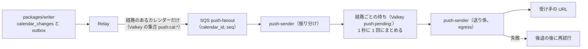
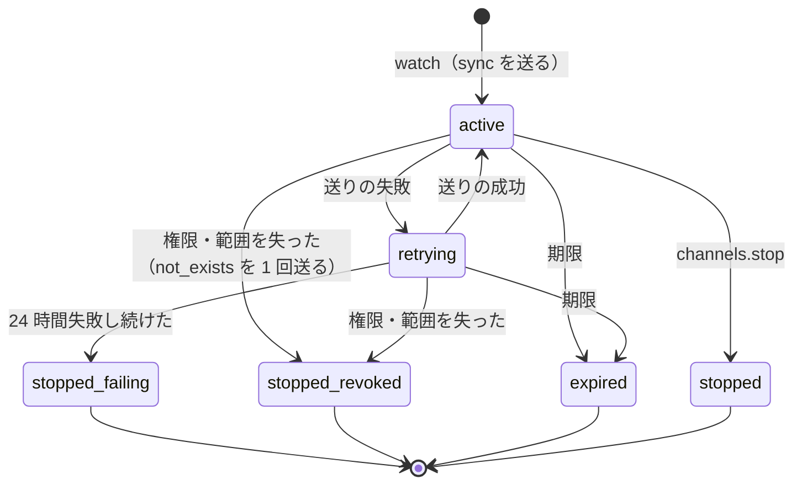

# API and Push: Google Calendar

公開の REST API（リソース、予定の表し方、回の識別子、ページング、差分の同期、条件つきの更新、冪等、エラー、版）、OAuth 2.0 のアプリと範囲（scope）、レート制限、Webhook の通知の経路（`watch`、期限、署名、まとめ、再試行、停止）を決める。

前提となる決定は、時刻の表し方（[ADR-0002](../decisions/0002-time-representation.md)）、繰り返しの保存と展開（[ADR-0003](../decisions/0003-recurrence-storage-and-expansion.md)）、テナントと権限（[ADR-0004](../decisions/0004-tenancy-and-rls.md)）、変更のログと同期のトークン（[ADR-0005](../decisions/0005-change-log-and-sync-tokens.md)）、写し（[ADR-0006](../decisions/0006-organizer-and-attendee-copies.md)）、標準の範囲（[ADR-0007](../decisions/0007-interop-standards-scope.md)）、展開の意味（[ADR-0008](../decisions/0008-recurrence-expansion-semantics.md)）、iTIP の状態の転送（[ADR-0014](../decisions/0014-itip-state-transfer-and-sequence.md)）、空き時間（[ADR-0017](../decisions/0017-freebusy-source-and-cache.md)）、認証の部品（[ADR-0035](../decisions/0035-accounts-auth-library-and-credentials.md)）。この文書で決めたことは次の ADR にある。

| ADR | 決定 |
| --- | --- |
| [0026](../decisions/0026-public-rest-api-shape.md) | 公開の REST API は `https://api.<brand>.<domain>/v1` に、本家の API の振る舞いに寄せた JSON で出し、自社の画面も同じものを使う。予定は予定オブジェクトを単位にし、繰り返しは RFC 5545 の行の配列、回は `<id>_<recurrence_id の壁時計の時刻>` の ID で表す。差分の同期の `syncToken` は予定オブジェクトの単位で、`singleEvents`・`timeMin`・`timeMax` と一緒に使えない。書き込みは `If-Match`（412）と `Idempotency-Key`（24 時間）を受ける。参加者の写しの共有の項目の変更は 403 か、`guestsCanModify` なら 202 で主催者へ依頼する |
| [0027](../decisions/0027-oauth-apps-scopes-and-rate-limits.md) | OAuth 2.0 は認可コードと PKCE（S256 を必須）。アクセストークン 1 時間、リフレッシュトークンは使うたびに入れ替え、再利用で一式を取り消し、90 日使わなければ切れる。範囲は `calendar.read`・`calendar.events`・`calendar.freebusy`・`calendar.manage` の 4 つ。組織はアプリの認可を「すべて」「許可の一覧」「禁止」から選ぶ。レート制限は（アプリ, 利用者）1 分 600、（アプリ, テナント）1 分 10,000、書き込みは利用者 1 分 120 で、超えたら 429 と `Retry-After` |
| [0028](../decisions/0028-push-channels-signed-webhooks.md) | Webhook は `watch` で作る通知の経路で、期限は既定 7 日・最大 30 日、自動の更新はしない。本文を持たない `POST` に `<Brand>-Channel-Id`・`<Brand>-Resource-Id`・`<Brand>-Resource-State`（`sync`・`exists`・`not_exists`）・`<Brand>-Message-Number` などを付け、経路ごとの秘密で `<Brand>-Signature: t=…,v1=HMAC-SHA256` を付ける。経路ごとに 1 秒 1 回にまとめ、失敗は 10 秒から 1 時間まで延ばして再試行し、24 時間失敗し続けたら止める。送る前に `can()` と範囲を確かめ、見られなくなったら `not_exists` を 1 回送って止める |

## 1. 目的と範囲

- 扱う：
  - 公開の REST API の入口、リソースの一覧、予定の JSON の形、回の識別子
  - 一覧・範囲・展開、ページング、差分の同期（`syncToken`）、束ねた差分（`POST /v1/sync`）
  - 書き込み：条件つきの更新、冪等、招待の送信の指定（`sendUpdates`）、参加者の写しへの書き込み
  - エラーの形、版と廃止
  - OAuth 2.0 のアプリ、範囲、トークン、組織の制限
  - レート制限
  - Webhook の通知の経路
- 扱わない：
  - トークンの中身と検査の規則（[ADR-0005](../decisions/0005-change-log-and-sync-tokens.md)、[sync-and-caldav.md](sync-and-caldav.md) の 4 節）
  - 空き時間の照会の意味と上限（[free-busy-and-scheduling.md](free-busy-and-scheduling.md)。この文書は入口の名前だけ）
  - 管理の API（利用者・グループ・会議室・方針）の中身（[accounts-and-orgs.md](accounts-and-orgs.md)、[rooms-and-resources.md](rooms-and-resources.md)）
  - `can()`・`redact()` の決定表（[sharing-and-acl.md](sharing-and-acl.md)）
  - ログインとセッション（[accounts-and-orgs.md](accounts-and-orgs.md)）
  - 公式の SDK（開発リポジトリで OpenAPI から生成する。E8 の Story）
  - サービスアカウントと組織の全体への委任（MVP の後）

## 2. 要件

| 要件 | 目標 | NFR・基準 |
| --- | --- | --- |
| 書き込みの速さ | 予定の作成・変更 p99 300 ms | NFR-001 |
| 範囲の読み出し | 週の表示（カレンダー 10）p95 300 ms | NFR-001 |
| 差分 | 変更 1,000 件以下 p99 1 秒。410 は期限切れ・見え方の変化・`sync_epoch` のときだけ | NFR-010 |
| Webhook | 変更から最初の送信まで p95 30 秒。少なくとも 1 回届ける | NFR-012 |
| 漏れ | 応答・Webhook に見てはいけない中身を出さない。Webhook は中身を持たない | NFR-008 |
| 可用性 | API の読み書き 月間 99.9% | NFR-006 |
| 一致 | 同じ予定の同じ回が、API・画面・CalDAV で同じ瞬間 | NFR-009 |

## 3. 本家の形（確かめたこと）

いずれも 2026-10-04 に確認。

| 項目 | 内容 | 出典 |
| --- | --- | --- |
| 差分の同期 | `nextSyncToken` で差分を取る。410 は無効なトークンで、全件を取り直す。差分で使える問い合わせの条件は限られ、最初と同じにする（違えば 400）。差分には削除が必ず入る。ページは `pageToken` で続け、最後のページに新しいトークン | [Synchronize resources efficiently](https://developers.google.com/workspace/calendar/api/guides/sync) |
| 予定の形 | `recurrence` は RRULE・EXRULE・RDATE・EXDATE の行。繰り返しでは `start.timeZone` が必須。回は `recurringEventId` と `originalStartTime`。公開範囲、出欠、`transparency`、`eventType`、`sequence`。リマインダーの上書きは最大 5 件・0〜40,320 分。参加者の権限の既定 | [Events resource](https://developers.google.com/workspace/calendar/api/v3/reference/events) |
| Push の通知のヘッダー | 常に：チャネルの ID、メッセージの番号（`sync` は 1）、資源の ID、資源の状態、資源の URI。ときどき：チャネルの期限、チャネルのトークン | [Push notifications](https://developers.google.com/workspace/calendar/api/guides/push) |
| 資源の状態 | `sync`（チャネルを作った）、`exists`（作成・変更・削除）、`not_exists`（資源がもうない） | 同上 |
| チャネル | 期限は要求か内部の上限の厳しいほう。自動の更新はない。受け口は HTTPS で、正しい証明書が要る（自己署名などは不可）。トークンは 256 文字まで、秘密を入れない | 同上 |
| 通知の応答 | `200`・`201`・`202`・`204`・`102` を成功とする。`500`・`502`・`503`・`504` で指数の後退の再試行 | 同上 |
| 割り当て | プロジェクトごと 1 分 10,000、利用者ごと・プロジェクトごと 1 分 600。超えると 403 か 429（`usageLimits`）。切り詰めた指数の後退を勧める | [Manage quotas](https://developers.google.com/workspace/calendar/api/guides/quota) |

- 本家のチャネルの期限の既定と最大の値は、上の文書に書かれていない（**未検証**）。本システムは既定 7 日・最大 30 日にする（[architecture/README.md](README.md) の 6 節の決定）。
- 本家の Push の通知に署名があるかは、上の文書にない（**未検証**）。本システムは署名を付ける。
- 本家のヘッダーの名前は本家の名前を含むので、この設計では `<Brand>-Channel-Id` の形で書く（[リポジトリ共通の ADR-0006](../../../../docs/decisions/0006-brand-neutral-identifiers.md)）。
- 本家の `maxResults` の既定と上限、`sendUpdates` の既定、アクセストークンの寿命は、この確認では見ていない（**未検証**）。本システムの値は 4・6 節。

## 4. REST API

ADR-0026。

### 4.1 入口と原則

- 入口は `https://api.<brand>.<domain>/v1`。自社の Web の画面も同じ API を使う（[architecture/README.md](README.md) の 1.2 節）。画面だけの入口（`/v1/sync` の束ね、通知の一覧）も、公開の API として文書にする。
- JSON、UTF-8、名前は camelCase。時刻は RFC 3339。
- 版は URL の `/v1`。足すだけの変更を続け、壊す変更は `/v2` にする（4.9 節）。
- 読み出しは Aurora の reader から、書き込みとその応答は writer から行う。書き込みの直後の読み出しで古い結果を見ないよう、書き込みの応答に `X-Read-After: <calendar_id>:<seq>` を返し、クライアントが次の要求に付ければ、reader がその `seq` に追いつくまで 500 ms まで待つ（追いつかなければ writer で読む）。

### 4.2 リソース

| リソース | 入口 | 範囲（6.2 節） |
| --- | --- | --- |
| カレンダーの一覧（自分の見え方） | `GET/POST /v1/users/me/calendarList`、`GET/PATCH/DELETE /v1/users/me/calendarList/{calendarId}` | read・manage |
| カレンダー | `POST /v1/calendars`、`GET/PATCH/DELETE /v1/calendars/{calendarId}` | read・manage |
| ACL | `GET/POST /v1/calendars/{calendarId}/acl`、`PATCH/DELETE /v1/calendars/{calendarId}/acl/{ruleId}` | manage |
| 予定 | `GET/POST /v1/calendars/{calendarId}/events`、`GET/PUT/PATCH/DELETE …/events/{eventId}` | read・events |
| 回 | `GET …/events/{eventId}/instances` | read |
| 出欠 | `POST …/events/{eventId}/respond`（`{ responseStatus, comment, recurrenceScope: "series" \| "instance" }`） | events |
| 空き時間 | `POST /v1/freeBusy`（[free-busy-and-scheduling.md](free-busy-and-scheduling.md) の 4.1 節） | freebusy・read |
| 候補 | `POST /v1/findTime`（同 6 節） | freebusy・read |
| 束ねた差分 | `POST /v1/sync`（4.6 節） | read |
| 設定 | `GET/PATCH /v1/users/me/settings`（既定のタイムゾーン、勤務の時間、通知） | read・manage |
| 通知の経路 | `POST …/events/watch`、`POST /v1/users/me/calendarList/watch`、`POST …/acl/watch`、`POST /v1/channels/stop`（7 節） | 対象の読み出しの範囲 |
| ICS | `POST …/import`・`…/export`（[sync-and-caldav.md](sync-and-caldav.md) の 8.3 節） | events・read |

- 予定を別のカレンダーへ移す入口（本家の `move`）は MVP で持たない。消して作る。

### 4.3 予定の形

```json
{
  "id": "0192f0c4-6f1e-7c3a-9b1d-2f6c1a7e9d01",
  "calendarId": "0192f0c4-…",
  "uid": "0192f0c4-…@<brand>.<domain>",
  "etag": "\"17\"",
  "status": "confirmed",
  "eventType": "default",
  "summary": "週次の定例",
  "location": "本社 12F 会議室 A",
  "description": "…",
  "color": "#3366CC",
  "transparency": "opaque",
  "visibility": "default",
  "start": { "dateTime": "2026-11-03T10:00:00+09:00", "timeZone": "Asia/Tokyo" },
  "end":   { "dateTime": "2026-11-03T11:00:00+09:00", "timeZone": "Asia/Tokyo" },
  "recurrence": ["RRULE:FREQ=WEEKLY;BYDAY=TU", "EXDATE;TZID=Asia/Tokyo:20261110T100000"],
  "organizer": { "email": "a@example.com", "displayName": "A", "self": true },
  "attendees": [
    { "email": "b@example.com", "responseStatus": "needsAction", "optional": false },
    { "email": "room-12a@resource.<brand>.<domain>", "resource": true, "responseStatus": "accepted" }
  ],
  "guestsCanModify": false, "guestsCanInviteOthers": true, "guestsCanSeeOtherGuests": true,
  "reminders": { "useDefault": false, "overrides": [{ "method": "popup", "minutes": 10 }] },
  "conferenceUrl": "https://…",
  "attachments": [{ "url": "https://…", "title": "資料" }],
  "sequence": 2,
  "created": "2026-10-04T01:02:03Z", "updated": "2026-10-04T05:06:07Z",
  "tzdataVersion": "2026b"
}
```

| 項目 | 決定 |
| --- | --- |
| 時刻の種類（[ADR-0002](../decisions/0002-time-representation.md)） | `zoned`：`dateTime`（壁時計の時刻とその時のオフセット）＋`timeZone`。`utc`：`dateTime` が `Z` で `timeZone` なし。`floating`：`dateTime` がオフセットなしで `floating: true`。`date`：`date`（終わりを含まない） |
| 入力の時刻 | `timeZone` があれば、`dateTime` のオフセットを捨てて壁時計の時刻だけを使う（オフセットが `resolve` の結果と違えば、応答の `warnings` に `offsetIgnored`）。`timeZone` がなくオフセットだけなら [ADR-0002](../decisions/0002-time-representation.md) の規則。繰り返しは `timeZone` を必須にする（400 `timeZoneRequired`） |
| `recurrence` | RFC 5545 の行の配列。DTSTART・DTEND を含めない（本家と同じ）。受け付けの検査は [events-and-recurrence.md](events-and-recurrence.md) の 3.4 節 |
| `etag` | 予定オブジェクトの `version` と見え方の記号から作る（[sync-and-caldav.md](sync-and-caldav.md) の 6.3 節と同じ値の元） |
| 見られない中身 | `redact()` が `BUSY` にした予定（[ADR-0021](../decisions/0021-effective-role-and-redact-table.md)）は、`id`（見る人ごとの不透明な ID）・`start`・`end`・`status`・`transparency`・`recurrence`・`visibility` だけを返し、`"redacted": true` を付ける。不透明な ID で 1 件を取る入口はない（一覧・範囲・差分でだけ返す）。`summary` に代わりの文字（「予定あり」）を入れるのは画面の役目。`FULL_NO_GUESTS` は参加者の一覧を主催者と見る人だけにし、`attendeesOmitted: true` |
| `attendeesOmitted` | `guestsCanSeeOtherGuests=false` の参加者の写しでは、参加者の一覧を主催者と自分だけにし、`attendeesOmitted: true` |
| 参加者の写しの自分の項目 | `reminders`、`color`、`transparency`、自分の `responseStatus`、`hidden` |
| 知らないプロパティ | API に出さない（`x_props` は iCalendar の往復のためだけ。[ADR-0007](../decisions/0007-interop-standards-scope.md)） |
| `tzdataVersion` | 派生の値を計算した版。クライアントの版が古ければ、自分で計算し直さずにこの値で表示する（[ADR-0002](../decisions/0002-time-representation.md)） |

### 4.4 回の識別子

- 回の `id` は `<eventId>_<recurrence_id>`。`recurrence_id` は回の元の開始の壁時計の時刻（`zoned`・`floating` は `YYYYMMDDTHHMMSS`、`date` は `YYYYMMDD`）。TZID はマスターと同じなので含めない。
  - 例：`0192f0c4-…_20261103T100000`
- UTC で作らないので、tzdb の更新でも回の `id` は変わらない（[ADR-0003](../decisions/0003-recurrence-storage-and-expansion.md)。本家の回の ID の作り方は**未検証**）。
- 回の応答は `recurringEventId` と `originalStartTime`（`dateTime`＋`timeZone` か `date`）を持つ。
- 回への `PATCH` は 1 回分の上書きを作る（[events-and-recurrence.md](events-and-recurrence.md) の 5 節）。「これ以降」は `PATCH …/events/{instanceId}?scope=thisAndFollowing` で分割する（同 6 節）。系列の全体はマスターの `id` へ書く。

### 4.5 一覧・範囲・ページング

`GET /v1/calendars/{calendarId}/events`：

| 引数 | 意味 | 上限・注記 |
| --- | --- | --- |
| `timeMin`・`timeMax` | 区間 `[timeMin, timeMax)` と重なる予定・回 | 差は 366 日まで（`singleEvents=true` のとき） |
| `singleEvents` | `true` なら回に展開して返す。`false`（既定）は予定オブジェクト | `true` では `timeMin`・`timeMax` が必須 |
| `orderBy` | `startTime`（`singleEvents=true` のときだけ）・`updated` | — |
| `showDeleted` | 取り消した予定と回を含める | 差分の同期では常に真 |
| `eventTypes` | 予定の種類で絞る | — |
| `q` | 検索（[search.md](search.md) の検索の関数を呼ぶ） | 2〜256 文字。差分の同期と一緒に使えない |
| `maxResults` | 1 ページの件数 | 既定 250、最大 2,500 |
| `pageToken` | 次のページ | 不透明。条件のハッシュを含み、違う条件で使うと 400 `invalidPageToken` |
| `syncToken` | 差分（4.6 節） | — |

- `singleEvents=true` の範囲は、展開の索引から読み、範囲の外はその場の `expand()` に切り替える（[ADR-0003](../decisions/0003-recurrence-storage-and-expansion.md)）。
- 1 ページの件数は、展開した回で数える。
- 予定オブジェクトの一覧（`singleEvents=false`）で `timeMin`・`timeMax` を付けたら、範囲の中に回がある予定オブジェクトを返す。

### 4.6 差分の同期

| 項目 | 決定 |
| --- | --- |
| 最初 | 条件（`showDeleted`・`eventTypes`）だけで全件を取り、最後のページで `nextSyncToken` |
| 差分 | `syncToken` で、その後に変わった予定オブジェクト（削除は `status: "cancelled"` の墓標） |
| 一緒に使えない引数 | `singleEvents=true`、`timeMin`、`timeMax`、`orderBy`、`q`。付けたら 400 `syncTokenWithFilter`。トークンは予定オブジェクトの単位で、回の差分を持たない（[ADR-0005](../decisions/0005-change-log-and-sync-tokens.md)） |
| 条件の違い | トークンの `filter_hash` と違う条件は 400（本家と同じ） |
| 無効 | 410 `fullSyncRequired`（期限切れ、見え方の変化、`epoch`） |
| ページ | 1 ページ 1,000 件まで。続きは `nextPageToken`、最後のページに `nextSyncToken` |
| カレンダーの一覧・ACL | 同じ形の `syncToken` を持つ。単位は利用者のカレンダーの一覧（`calendar_list_seq`）とカレンダーの ACL（カレンダーの `change_seq` の `kind=acl`） |

束ねた差分（自社の画面と、多くのカレンダーを持つ利用者向け）：

```text
POST /v1/sync
{ "calendars": [ { "calendarId": "…", "syncToken": "…" }, … ],   // 50 まで
  "calendarListSyncToken": "…" }
→ { "calendars": [ { "calendarId": "…", "items": [ … ], "nextSyncToken": "…" }
                 | { "calendarId": "…", "error": { "code": 410, "reason": "fullSyncRequired" } }
                 | { "calendarId": "…", "items": [ … ], "nextPageToken": "…" } ],
    "calendarList": { "items": [ … ], "nextSyncToken": "…" } }
```

- カレンダーごとに独立に処理する。1 つの 410 が他を止めない。
- 1 回の応答の合計は 2,000 件まで。超えたカレンダーは `nextPageToken` を返し、クライアントは同じ入口で続ける。
- 変わっていないカレンダー（トークンの `seq` がカレンダーの `change_seq` と同じ）は、予定を読まずに同じトークンを返す。

### 4.7 書き込み

| 項目 | 決定 |
| --- | --- |
| 条件つきの更新 | `If-Match: "<etag>"`。違えば 412 `conditionNotMet`。`GET` の `If-None-Match` は 304 |
| 冪等 | `POST`（作成、出欠、`watch`、取り込み）は `Idempotency-Key`（UUID）を受ける。（アプリ, 利用者, キー）ごとに 24 時間、同じ応答を返す。同じキーで本文が違えば 422 `idempotencyKeyReuse` |
| 書き込みの経路 | すべて `packages/writer`（`origin = api`）。1 つの要求が 1 つのトランザクション |
| `sendUpdates` | `all`（既定）・`externalOnly`・`none`。外部の参加者への iMIP と、本システムの中の参加者への通知のメールの有無を決める。本システムの中の参加者の写しは、どれでも作る（[ADR-0006](../decisions/0006-organizer-and-attendee-copies.md)） |
| 参加者の写しの共有の項目 | `guestsCanModify` が偽なら 403 `forbiddenForNonOrganizer`。真なら、主催者の写しへの依頼（`X-MODIFY`、[invitations-and-itip.md](invitations-and-itip.md) の 8.2 節）にし、202 と `{"pending": true}` を返す。写しは主催者の新しい版が届くまで変わらない |
| `PUT` と `PATCH` | `PUT` は全体の置き換え（書かなかった項目は既定に戻る）。`PATCH` は書いた項目だけ（JSON Merge Patch、RFC 7396） |
| 1 カレンダーの書き込みの上限 | 1 秒 50 件（[ADR-0005](../decisions/0005-change-log-and-sync-tokens.md)）を超えたら 429 `calendarWriteRateExceeded` と `Retry-After: 1` |

- 本家の `sendUpdates` の既定は**未検証**。本システムは、写しと iMIP を揃える（外部の参加者だけ古い予定のまま残さない）ため `all` を既定にする。

### 4.8 エラー

```json
{ "error": { "code": 412, "status": "FAILED_PRECONDITION", "reason": "conditionNotMet",
             "message": "The resource has been modified.", "requestId": "…" } }
```

| HTTP | `reason` の例 |
| --- | --- |
| 400 | `invalidArgument`、`timeZoneRequired`、`invalidRecurrence`（受け付けの検査の番号を `details` に）、`syncTokenWithFilter`、`invalidPageToken` |
| 401 | `unauthenticated` |
| 403 | `insufficientScope`、`forbiddenForNonOrganizer`、`orgPolicy`（組織の方針） |
| 404 | `notFound`（見てはいけないものと存在しないものを区別しない。[ADR-0004](../decisions/0004-tenancy-and-rls.md)） |
| 409 | `duplicateUid` |
| 410 | `fullSyncRequired` |
| 412 | `conditionNotMet` |
| 413 | `payloadTooLarge` |
| 422 | `tooManyOverrides`、`dtstartNotInRule`、`idempotencyKeyReuse`、`limitExceeded` |
| 429 | `rateLimitExceeded`、`calendarWriteRateExceeded` |
| 503 | `backendUnavailable`（`Retry-After`） |

- `message` に予定の中身（タイトル、メールアドレス）を入れない。

### 4.9 版と廃止

- OpenAPI 3.1 の定義を開発リポジトリに置き、PR で差分を見る。壊す変更（項目の削除、型の変更、必須の引数の追加）は CI で失敗させる。
- 古い項目は `deprecated` にし、利用を（アプリ, 項目）ごとに数える。告知から 12 か月、または利用が 0 になってから消す。カレンダーの連携は社内のシステム（勤怠、予約）が長く使うので、Linear の題材（6 か月）より長くする。

## 5. レート制限

ADR-0027。

| 単位 | 枠 | 注記 |
| --- | --- | --- |
| （アプリ, 利用者） | 1 分 600 要求 | 本家の利用者ごとの値に合わせた（3 節） |
| （アプリ, テナント） | 1 分 10,000 要求 | 本家のプロジェクトごとの値に合わせ、テナントごとにした。1 つのアプリが 1 つの組織の枠を占めても、他の組織に響かない |
| 利用者の書き込み（全部のアプリの合計） | 1 分 120 | 一括の書き込みでカレンダーのロックを占めない |
| テナントの合計 | 1 分 30,000 要求 | 組織ごとに引き上げを受ける |
| 自社の画面 | （アプリ, 利用者）の枠だけ。1 分 1,200 | 画面は合図ごとに差分を取るので多め |

- 数え方は Valkey のトークンバケット。Valkey が落ちたら、タスクのメモリーの近似（タスクの数で割った厳しめの値）で続ける。
- 超えたら 429 `rateLimitExceeded` と `Retry-After`（秒）。本家は 403 と 429 の両方を返す（3 節）が、本システムは 429 だけにする。
- ヘッダー：`X-RateLimit-Limit`、`X-RateLimit-Remaining`、`X-RateLimit-Reset`（UNIX 秒）。本家の名前を含まない一般の名前（[リポジトリ共通の ADR-0006](../../../../docs/decisions/0006-brand-neutral-identifiers.md) に当たらない）。
- 枠に当たった主体の数と上位のアプリ（ID だけ）を運用の画面に出す。

## 6. OAuth 2.0 のアプリ

ADR-0027。

### 6.1 アプリとフロー

| 項目 | 決定 |
| --- | --- |
| 登録 | 組織のアプリ（組織の管理者が登録し、その組織の利用者だけが認可できる）と、個人のアプリ（利用者が自分のために登録し、自分だけが認可できる）。他の組織へ配る公開のアプリは MVP の後 |
| 認可 | `GET https://auth.<brand>.<domain>/oauth/authorize`。`response_type=code`、`state`、`code_challenge`（S256）を必須。戻りの URL は完全一致（`https`。開発用に `http://localhost` と `http://127.0.0.1`） |
| トークン | `POST https://auth.<brand>.<domain>/oauth/token`。`authorization_code`（`code_verifier` 必須）と `refresh_token`。コードは 60 秒・1 回限り |
| 期限 | アクセストークン 1 時間。リフレッシュトークンは使うたびに入れ替え、90 日使わなければ切れる |
| 再利用の検出 | 入れ替えて使えなくしたリフレッシュトークンが出されたら、同じ認可から出た一式を取り消す |
| 取り消し | `POST …/oauth/revoke`（RFC 7009）。利用者は設定で、自分の認可したアプリを取り消せる。組織の管理者は、アプリの全部のトークンを取り消せる |
| 形 | アクセス `<brand>_oat_`、リフレッシュ `<brand>_ort_`、クライアントの秘密 `<brand>_ocs_`。base62 の乱数 32 文字とチェックサム 6 文字。SHA-256 だけを保存（[accounts-and-orgs.md](accounts-and-orgs.md) の 9 節と同じ形） |
| 確かめ | トークンのハッシュで引き、Valkey に 60 秒持つ。取り消しは 60 秒以内に効く |

- アクセストークンを 1 時間にするのは、CalDAV のクライアント（Bearer）と社内のシステムの両方で使われ、漏えいの影響を短くするため。Linear の題材（24 時間）より短い。

### 6.2 範囲

| 範囲 | 許す操作 |
| --- | --- |
| `calendar.read` | カレンダーの一覧・カレンダー・予定・回・設定・空き時間の読み出し、差分、`watch`、CalDAV の読み出し |
| `calendar.events` | `calendar.read` と、予定の作成・変更・削除・出欠、CalDAV の書き込み、ICS の取り込み |
| `calendar.freebusy` | 空き時間の照会と候補の計算だけ |
| `calendar.manage` | `calendar.events` と、カレンダーの作成・削除、ACL、設定の変更 |

- 許すかは `can(user, action, target) ∧ scopeAllows(scopes, action)` で決める。範囲の表は `packages/policy` に置く（[ADR-0004](../decisions/0004-tenancy-and-rls.md) の「権限の条件を `packages/policy` の外に書かない」）。
- 管理の API（利用者・グループ・会議室・方針）は OAuth のアプリに開かない（MVP の後）。

### 6.3 組織の制限

- 組織の設定 `oauth_apps_policy`：`all`（既定）・`allowlist`・`none`。`allowlist` では、管理者が許したアプリ（`client_id`）だけを認可できる。
- 方針を狭めたら、方針の外のアプリの全部のトークンを取り消し、そのアプリの通知の経路を止める（7.5 節）。
- 組織の外の個人のアプリを、組織の利用者が認可できるかも同じ設定で決める（`all` なら可）。

## 7. Webhook（通知の経路）

ADR-0028。

### 7.1 作る

```text
POST /v1/calendars/{calendarId}/events/watch
{ "id": "my-channel-01", "type": "web_hook", "address": "https://hooks.example.com/cal",
  "token": "target=team-a", "expiration": 1791000000000 }
→ 200 { "kind": "channel", "id": "my-channel-01", "resourceId": "rsc_…",
        "resourceUri": "https://api.<brand>.<domain>/v1/calendars/…/events",
        "expiration": 1791000000000, "signingSecret": "<brand>_whsec_…" }
```

| 項目 | 決定 |
| --- | --- |
| 対象 | 予定（カレンダーごと）、カレンダーの一覧（利用者ごと）、ACL（カレンダーごと） |
| `id` | 呼んだ側が決める。`[A-Za-z0-9_-]` で 64 文字まで。（アプリ, 利用者）の中で一意 |
| `resourceId` | 対象を示す不透明な値。止めるときに `id` と一緒に要る |
| `address` | `https` だけ。公開の CA の正しい証明書（自己署名・期限切れ・名前の違いは送らない。本家と同じ）。名前解決の後の IP が私的・予約・リンクローカル・メタデータなら 400 |
| `token` | 256 文字まで（本家と同じ）。送るたびに `<Brand>-Channel-Token` で返す |
| `expiration` | ミリ秒の UNIX 時刻。なければ今から 7 日、今から 30 日を超えれば 30 日に切る。応答に実際の値 |
| `signingSecret` | 作る時に 1 回だけ返す。経路ごとに別。保存は暗号文（送る時に要るので戻せる形） |
| 上限 | （アプリ, 利用者）の有効な経路 100、1 つのカレンダーの経路 50、テナント 10,000 |
| 止める | `POST /v1/channels/stop { id, resourceId }`。期限で止まる。自動の更新はない（本家と同じ）。続けるには、期限の前に新しい経路を作る |

- 作った直後に、`<Brand>-Resource-State: sync`、`<Brand>-Message-Number: 1` を送る（本家と同じ）。受け手が届くことを確かめられる。

### 7.2 通知

```http
POST /cal HTTP/1.1
Host: hooks.example.com
Content-Length: 0
User-Agent: <Brand>-Push/1
<Brand>-Channel-Id: my-channel-01
<Brand>-Channel-Token: target=team-a
<Brand>-Channel-Expiration: Tue, 11 Oct 2026 01:02:03 GMT
<Brand>-Resource-Id: rsc_…
<Brand>-Resource-Uri: https://api.<brand>.<domain>/v1/calendars/…/events
<Brand>-Resource-State: exists
<Brand>-Message-Number: 42
<Brand>-Signature: t=1791000000,v1=5d2c…
```

| 項目 | 決定 |
| --- | --- |
| 本文 | 持たない。受け手は差分の同期（4.6 節）で中身を取る（[ADR-0005](../decisions/0005-change-log-and-sync-tokens.md)） |
| `<Brand>-Resource-State` | `sync`（作った）・`exists`（作成・変更・削除）・`not_exists`（対象がなくなった、見られなくなった） |
| `<Brand>-Message-Number` | 経路ごとに 1 から増える。再試行でも同じ番号。まとめた後の送りごとに 1 つ増える（欠けた番号はない） |
| 署名 | `v1 = hex(HMAC-SHA256(signingSecret, t + "." + Channel-Id + "." + Resource-Id + "." + Resource-State + "." + Message-Number))`。`t` は送る時の UNIX 秒（再試行のたびに新しい）。受け手は `t` が 5 分以内か、`v1` が合うかを定数時間で比べる |
| 秘密の入れ替え | 経路を作り直す（経路は最長 30 日なので、入れ替えの仕組みを別に持たない） |

- 本文がないので、署名はヘッダーの並びにかける。順序を固定し、受け手がヘッダーを並べ直して確かめられるようにする。

### 7.3 送りの流れ



- 1 つの経路には、送りが高々 1 つだけ待つ。待ちの間に来た変更は、同じ送りにまとまる（本文がないので、まとめても情報を失わない）。
- 送る直前に経路の行を読み、`last_message_number` を 1 上げて番号を決める（同じトランザクションで送りの記録を書く）。
- 時間の予算（NFR-012 の p95 30 秒）：Relay 1 秒、振り分け 2 秒、まとめ 1 秒、送り係の待ち 5 秒、相手 10 秒（接続 3 秒・全体 10 秒で切る）、余裕 11 秒。

### 7.4 再試行と停止

| 応答 | 扱い |
| --- | --- |
| `200`・`201`・`202`・`204`・`102` | 成功（本家と同じ） |
| `429`・`5xx`・時間切れ・接続の失敗 | 再試行：10 秒、30 秒、2 分、10 分、30 分、以後 1 時間ごと。±10% の揺らぎ。`Retry-After` は 1 時間まで従う |
| `3xx` | リダイレクトを追わない。失敗として再試行 |
| その他の `4xx` | 失敗として再試行（受け手の設定の誤りが直るのを待つ） |

状態の機械：



- `stopped_failing` にしたら、アプリの登録者にメールで知らせる。止まった経路は戻さない（作り直す）。止まっている間の変更は、受け手が次の差分の同期で取れる。
- 少なくとも 1 回届ける（NFR-012）。受け手は `<Brand>-Message-Number` で重複を捨てられる。
- 期限の 24 時間前の通知は送らない（本家にない。受け手が `expiration` を見て作り直す）。

### 7.5 権限の確かめ

- 送る直前に、経路の主体（利用者とアプリ）について次を確かめる。1 つでも外れたら `not_exists` を 1 回送り、`stopped_revoked` にする。
  - `can(user, "read", 対象)` が真（カレンダーを消された、共有を外された、利用者が停止された）。
  - アプリの認可が生きていて、範囲が対象の読み出しを許す。
  - 組織の `oauth_apps_policy` がアプリを許す（6.3 節）。
- 確かめは経路ごとに 60 秒の写しを使う。権限を失ってから最大 60 秒の間は `exists` を送りうるが、中身を持たないので漏れにならない（受け手は差分の同期で 403・404 になる）。

## 8. 障害のときの振る舞い

| 事象 | 起きること | 備え |
| --- | --- | --- |
| reader の遅れ | 書いた直後の読み出しが古い | `X-Read-After`（4.1 節）。差分は読めた最大の `seq` のトークン（[sync-and-caldav.md](sync-and-caldav.md) の 4.2 節） |
| Writer の一時の停止（フェイルオーバー） | 書き込みが 503 | `Retry-After`。`Idempotency-Key` で安全に再送できる |
| Valkey が落ちる | レート制限が近似、トークンの写しがない、経路の集合がない | 近似の枠（5 節）。トークンは DB で確かめる。Relay は経路の集合がなければ全カレンダーを振り分けに流し、振り分けが DB で絞る |
| 受け手が遅い・落ちている | 送りが溜まる | 経路ごとに待ちは 1 つ。送り係の同時の数を、受け手のホストごとに 20、テナントごとに 100 に絞る |
| 振り分けが遅れる | 最初の送りが遅れる | SQS に残る。最初の送りの遅れの p95 を監視 |
| tzdb の再計算・方針の変更で大量の変更 | 多くの経路が同時に動く | 経路ごとに 1 秒 1 回なので、送りの数は経路の数で抑えられる |
| DR の切り替え | `epoch` が上がり、全部のトークンが 410 | 全部の経路へ `exists` を 1 回送り、受け手に差分の同期をさせる（410 で取り直す） |

## 9. セキュリティ

- **権限**：応答は `redact()` を通す。範囲と `can()` の積。存在を示さない 404。
- **トークン**：ハッシュだけを保存、接頭辞とチェックサムでシークレットスキャンに載せる（[リポジトリ共通の ADR-0006](../../../../docs/decisions/0006-brand-neutral-identifiers.md)）、短い寿命、入れ替えと再利用の検出。ログ・トレースに `Authorization` を出さない。
- **OAuth**：PKCE（S256）必須、戻りの URL の完全一致、`state`、コードの 1 回限り、認可の画面は `frame-ancestors 'none'`。
- **Webhook**：本文を持たない（中身を外へ送らない）、署名と時刻、egress の経路と宛先の検査（SSRF）、リダイレクトを追わない、応答の本文は 1 KiB まで読んで捨てる。
- **CORS**：公開 API は、自社の画面のオリジン（`calendar.<brand>.<domain>`）だけを許す。第三者のページからブラウザで使わせない。
- **法務**：Webhook の先は顧客が決める宛先で、送るのは中身のない合図である。API で取り出した予定を顧客のシステムが扱うのは、顧客の指示による提供として扱う想定だが、法務の L1 で確かめる。

## 10. テスト

決定表：

- **DT-API-001（範囲）**：6.2 節の範囲 × 4.2 節の入口の許可の表。
- **DT-API-002（差分の引数）**：4.6 節の一緒に使えない引数と、条件の違い・無効なトークンの応答。
- **DT-API-003（参加者の写しへの書き込み）**：共有の項目・自分の項目 × `guestsCanModify` × `sendUpdates`。
- **DT-HOOK-001（送りの応答）**：7.4 節の応答の種類 × 再試行・成功・停止。

性質ベーステスト：

- **PROP-API-001（経路の一致）**：任意の予定と書き込みの列で、API の `singleEvents=true` の回の `(id, start, end)` の集合が、同じ範囲の CalDAV の `expand` と、画面の手元の展開と一致する（NFR-009）。
- **PROP-API-002（冪等）**：同じ `Idempotency-Key` の要求を何回送っても、効くのは 1 回で、応答は同じ。
- **PROP-API-003（見え方）**：任意の ACL・公開範囲で、API の応答（取得・一覧・範囲・差分・回）に、`redact()` が隠す項目が現れない（[quality.md](../quality.md) の 2.2.1 節 D の「公開 API」の行）。
- **PROP-HOOK-001（取りこぼさない）**：任意の変更の列と送りの失敗・遅延で、受け手が最後に受けた通知の後に差分の同期をすれば、全件の取り直しと一致する。通知が落ちても、次の通知か期限の前の差分で取り戻せる。
- **PROP-HOOK-002（署名）**：任意のヘッダーの値・秘密・時刻で、受け手の検査の関数が、送り手の署名だけを受け入れる。
- **PROP-HOOK-003（番号）**：1 つの経路の `<Brand>-Message-Number` は、送りごとに 1 ずつ増え、再試行では変わらない。

結合テスト：SSRF の宛先（私的な IP、DNS の再束縛、リダイレクト）、証明書の検査、再試行の時刻（仮想の時計）、権限を失った経路の `not_exists`、リフレッシュトークンの再利用での一式の取り消し、組織の方針でのトークンの取り消し。

契約のテスト：OpenAPI の差分の検査（壊す変更で失敗）、公式の SDK の生成。

負荷（E12）：（アプリ, 利用者）の上限まで、テナントの合計の上限、Webhook の送り 1 秒 2,000 件。

## 11. Story の候補

| Epic | Story | 中身 |
| --- | --- | --- |
| E2 | `events-rest-basic` | 4.2〜4.5 節の予定の作成・取得・変更・削除・範囲（招待なし。events-and-recurrence と共同） |
| E8 | `public-rest-api` | 4 節の全体、エラー、`X-Read-After`、OpenAPI（ADR-0026。PROP-API-001〜003） |
| E8 | `api-sync-endpoints` | 4.6 節の `syncToken` と `POST /v1/sync`（DT-API-002） |
| E8 | `api-idempotency` | 4.7 節の `Idempotency-Key`（PROP-API-002） |
| E8 | `oauth-apps-and-scopes` | 6 節（ADR-0027。DT-API-001） |
| E8 | `api-rate-limits` | 5 節 |
| E8 | `webhook-channels` | 7 節（ADR-0028。DT-HOOK-001、PROP-HOOK-001〜003） |
| E8 | `public-sdk` | OpenAPI から公式の SDK（TypeScript）を生成 |

## 12. 未解決の問い

### 決定

2026-10-04 の既定案。E8 の試用で覆りうる。

- **API の形**：本家の振る舞いに寄せた REST と JSON。名前は独自（ADR-0026）。
- **回の ID**：壁時計の `recurrence_id` から作る（ADR-0026）。
- **差分の単位**：予定オブジェクト。回の差分は持たない（ADR-0026、[ADR-0005](../decisions/0005-change-log-and-sync-tokens.md)）。
- **`sendUpdates` の既定**：`all`（ADR-0026）。
- **アクセストークン**：1 時間（ADR-0027）。
- **レート制限の超過**：429 だけ（ADR-0027）。
- **Webhook の署名**：経路ごとの秘密でヘッダーの並びに HMAC（ADR-0028）。
- **Webhook の停止**：24 時間の失敗で止める（ADR-0028）。

### 持ち越し

| 問い | いつ・どう決めるか |
| --- | --- |
| サービスアカウントと組織の全体への委任 | MVP の後。社内のシステムの連携の声を見て |
| 他の組織へ配る公開のアプリと、その審査 | MVP の後 |
| レート制限の値 | E12 の負荷試験と試用 |
| 本家のチャネルの期限の既定・最大、通知の署名、`maxResults`・`sendUpdates` の既定、トークンの寿命 | 公式の資料で確かめられなかった（**未検証**のまま） |
| API で取り出したデータの扱い | **法務の確認待ち：L1** |

## 13. quality.md・runbooks・data-model への項目

### quality.md

- DT-API-001〜003、DT-HOOK-001 と PROP-API-001〜003、PROP-HOOK-001〜003 を E8 のリリースの基準にする。PROP-API-001 は NFR-009 の経路の一致の試験の一部にする。
- 漏れの経路の表の「公開 API」「Webhook」の行に、PROP-API-003 と「Webhook の本文が空」の結合テストを結ぶ。
- 本番：書き込みの p99、範囲の読み出しの p95、429 の数（主体の種類ごと）、Webhook の最初の送りの p95、送りの成功の率、`stopped_failing`・`stopped_revoked` の数。

### runbooks

- `webhook-[delivery.md](delivery.md)`：送りの失敗の増加の切り分け（受け手の障害、egress の NAT、証明書）と、送り係の増やし方。
- `api-abuse.md`：1 つのアプリ・テナントが枠を占めるときの確かめ方と、枠の一時の引き下げ、アプリのトークンの取り消し。
- `leaked-token-response.md`：OAuth のトークン・クライアントの秘密・Webhook の秘密の漏えい（シークレットスキャンの通報を含む）の取り消しと連絡。

### data-model（索引への追加の提案）

| 表 | 中身 | 節 |
| --- | --- | --- |
| `api_idempotency` | `(tenant_id, principal_hash, key)` を主キーに、`request_hash`、`status`、`response`（暗号文）、`expires_at`（24 時間） | 4.7 |
| `oauth_apps` | `(tenant_id, client_id)`、種類（組織・個人）、名前、戻りの URL、範囲、`client_secret_hash`。解決のため、テナントの外の保守用のスキーマに `client_id → tenant_id` を写す | 6.1 |
| `oauth_grants`・`oauth_tokens` | 認可（利用者、アプリ、範囲、一式の ID）、トークンのハッシュ、種類、期限、入れ替えの親、取り消し | 6.1 |
| `org_settings` に足す列 | `oauth_apps_policy`、`oauth_apps_allowlist` | 6.3 |
| `push_channels` | `(tenant_id, id)`、`app_id`、`user_id`、`client_channel_id`、`resource_type`、`resource_ref`、`address`、`token`、`secret_ciphertext`、`expires_at`、`state`、`last_message_number`、`failing_since`、`created_at`。一意 `(tenant_id, app_id, user_id, client_channel_id)` | 7.1 |
| `push_deliveries` | `(tenant_id, channel_id, message_number)` を主キーに、`resource_state`、`attempt`、`http_status`、`latency_ms`、`created_on`。日の分割で 7 日 | 7.3 |
| Valkey の `push:cal:{calendar_id}`・`push:pending:{channel_id}`、`rl:*` | 経路のあるカレンダーの集合、送りの待ち、レート制限のバケット | 5、7.3 |

## 出典

いずれも 2026-10-04 に確認。

- Google for Developers, [Synchronize resources efficiently](https://developers.google.com/workspace/calendar/api/guides/sync)、[Events resource](https://developers.google.com/workspace/calendar/api/v3/reference/events)、[Push notifications](https://developers.google.com/workspace/calendar/api/guides/push)、[Manage quotas](https://developers.google.com/workspace/calendar/api/guides/quota)
- IETF, [RFC 7009](https://www.rfc-editor.org/rfc/rfc7009)、[RFC 7396](https://www.rfc-editor.org/rfc/rfc7396)、[RFC 7636](https://www.rfc-editor.org/rfc/rfc7636)
