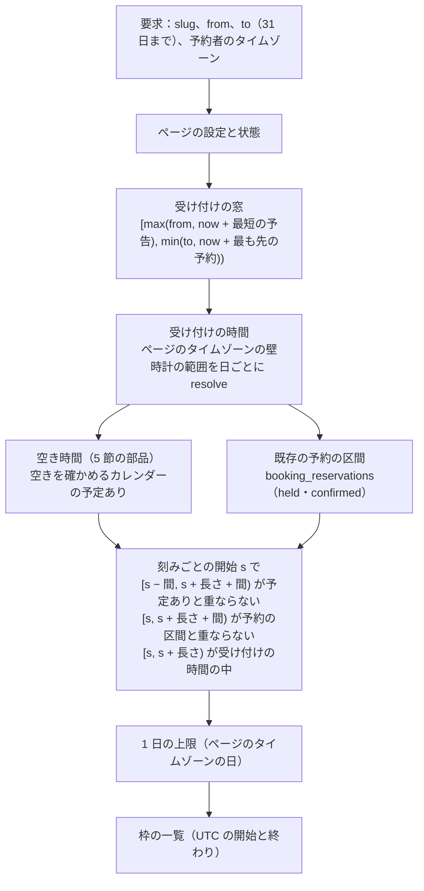
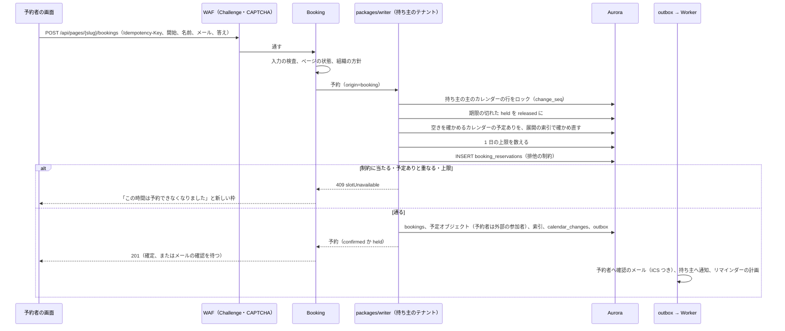
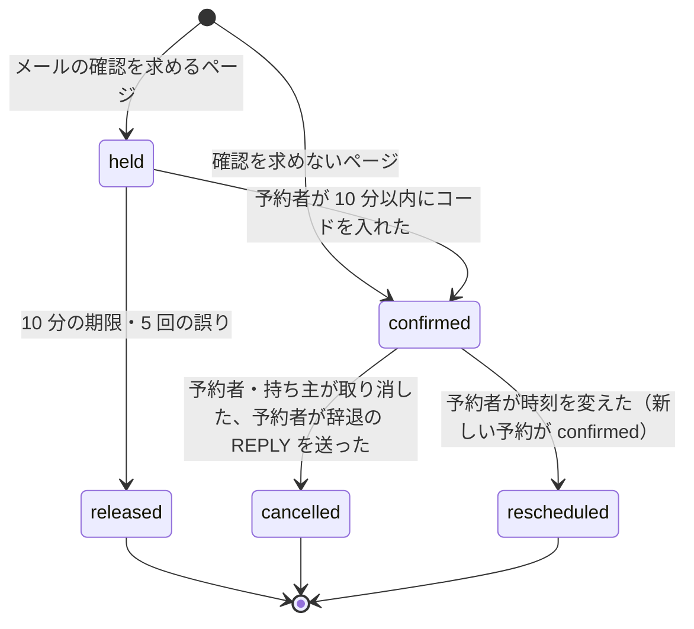

# Booking Pages: Google Calendar

予約ページの設定（長さ、受け付けの時間、間の時間、1 日の上限、受け付けの期間、質問）、空いている枠の計算、予約の作成と二重の予約の防止、予約者の確認、取り消しと変更、予約者へのメールとリマインダー、ボットの対策、予約者の個人情報の扱いの枠を決める。

前提となる決定は、時刻の表し方（[ADR-0002](../decisions/0002-time-representation.md)）、繰り返しの保存と展開（[ADR-0003](../decisions/0003-recurrence-storage-and-expansion.md)）、テナントと権限（[ADR-0004](../decisions/0004-tenancy-and-rls.md)）、変更のログ（[ADR-0005](../decisions/0005-change-log-and-sync-tokens.md)）、写し（[ADR-0006](../decisions/0006-organizer-and-attendee-copies.md)）、iMIP のアドレス（[ADR-0015](../decisions/0015-imip-addressing-and-trust.md)）、空き時間の元とキャッシュ（[ADR-0017](../decisions/0017-freebusy-source-and-cache.md)）、通知の経路（[ADR-0031](../decisions/0031-notification-channels-and-content.md)）。会議室の二重予約を防ぐ排他の制約の考え方（[architecture/README.md](README.md) の 6 節、[rooms-and-resources.md](rooms-and-resources.md)）を、予約にも使う。この文書で決めたことは次の ADR にある。

| ADR | 決定 |
| --- | --- |
| [0032](../decisions/0032-booking-slot-computation.md) | 空いている枠は、予約ページの受け付けの時間（持ち主が選んだタイムゾーンの壁時計の曜日ごとの範囲と、日付ごとの上書き）から、受け付けの期間・最短の予告・1 日の上限で絞り、持ち主の選んだカレンダーの空き時間（[free-busy-and-scheduling.md](free-busy-and-scheduling.md) の 5 節の部品）と、既存の予約の区間を引いて求める。予定ありの判定は `busy`・`busy_unavailable`・`busy_tentative` のどれも塞ぐ。間の時間は 1 つの値で、枠の前後の両方に要る。応答は枠の開始と終わりの UTC だけで、予定ありの区間を返さない |
| [0033](../decisions/0033-booking-creation-and-exclusion.md) | 予約は、持ち主の主のカレンダーの行をロックする `packages/writer` の 1 つのトランザクションで、空き時間を確かめ直し、`booking_reservations` に `[開始, 終わり＋間の時間)` の区間を書き、予定を作る。`booking_reservations` に、持ち主と区間の `btree_gist` の排他の制約を付け、予約どうしの重なりを DB で 0 にする。メールの確認を求めるページは、10 分の仮押さえ（`held`）で区間を塞ぐ。予約者は参加者（外部）として予定に入り、確認のメールに `METHOD:REQUEST` の ICS を付ける。ボットの対策は AWS WAF の Bot Control と、予約の送信への Challenge・CAPTCHA |

## 1. 目的と範囲

- 扱う：
  - 予約ページの設定と、組織の方針
  - 空いている枠の計算と、その応答
  - 予約の作成、二重の予約の防止、仮押さえ、メールの確認
  - 予約者の取り消しと変更、持ち主の取り消し
  - 予約者へのメール（確認、取り消し、リマインダー）
  - ボットの対策、レート制限
  - 予約者の個人情報の扱いの枠（法務の L6）
- 扱わない：
  - 有料の予約、複数の主催者の順番の割り当て、共同の主催者の空きの確かめ（MVP の後。[intent.md](../intent.md)）
  - 空き時間の照会と予定ありの判定の本体（[free-busy-and-scheduling.md](free-busy-and-scheduling.md)）
  - iMIP の送信の部品と返事の受信（[invitations-and-itip.md](invitations-and-itip.md)）
  - 予約ページの画面のデザイン（[clients.md](clients.md)）
  - WAF の構成（[infrastructure.md](infrastructure.md)、[security.md](security.md)）

## 2. 要件

| 要件 | 目標 | NFR・基準 |
| --- | --- | --- |
| 二重の予約 | 同じ持ち主の予約どうしの重なり（間の時間を含む）0 件。並行の予約でも | [quality.md](../quality.md) の 5 節の E10 |
| 予定との重なり | 予約の確定の時点で、持ち主の選んだカレンダーの予定ありと重ならない | 本システムの基準 |
| 可用性 | 予約ページ 月間 99.9% | NFR-006 |
| 枠の応答 | 31 日分の枠 p95 500 ms | 本システムの目標（NFR-004 の部品を使う） |
| 予約の確定 | p99 1 秒 | 本システムの目標 |
| 漏れ | 枠の計算が、持ち主の予定の中身・区間を返さない | NFR-008、[quality.md](../quality.md) の 2.2.1 節 D |
| 時刻 | 枠の時刻が、持ち主の画面・予約者の画面・確認のメールで同じ瞬間 | NFR-009 |

## 3. 本家の形（確かめたこと）

いずれも 2026-10-04 に確認。

| 項目 | 内容 | 出典 |
| --- | --- | --- |
| 予約ページ | 空いている枠を示して予約を受ける。間の時間、1 日の上限がある。一部の機能は有料のプラン | [Learn about appointment schedules](https://support.google.com/calendar/answer/11608416) |
| 長さと受け付けの時間 | 長さを選べる（任意の値も）。受け付けの時間を日付・時刻・タイムゾーンで決め、曜日ごとに「終日受けない」にできる | [Create an appointment schedule](https://support.google.com/calendar/answer/10729749) |
| 受け付けの期間 | 最も先の予約と、最短の予告を決められる。最短の予告の既定は 4 時間 | 同上 |
| 予約の後 | 間の時間（予約と予約の間）、1 日の最大の予約の数、参加者が他の人を招待できるか | 同上 |
| 空きの確かめ | 「空きを確かめるカレンダー」を選び、重なりを防ぐ。共同の主催者のカレンダーも含められる | 同上 |
| 予約の書式 | 名、姓、メールアドレスが必須。項目を足せる。「メールの確認を求める」を選べる | 同上 |
| リマインダー | 予約者へのリマインダーを最大 5 件。メールの文面は変えられない | 同上 |

- 本家の最も先の予約の既定と上限、間の時間の上限、二重の予約をどう防ぐか、ボットの対策は、公式の資料で確かめられなかった（**未検証**）。

## 4. モデル

| 表 | 中身 |
| --- | --- |
| `booking_pages` | 持ち主（利用者）、予定を作るカレンダー、空きを確かめるカレンダー（10 まで）、題名、説明、場所、会議の URL、長さ、刻み、間の時間、最短の予告、最も先の予約、1 日の上限、タイムゾーン、メールの確認、予約者へのリマインダー、状態（`active`・`paused`・`archived`）、`slug` |
| `booking_availability` | ページごとの曜日の範囲（壁時計の `[開始, 終わり)`、曜日ごとに 3 つまで） |
| `booking_date_overrides` | 日付ごとの上書き（その日の範囲、または「受けない」） |
| `booking_questions` | 足した質問（5 つまで、各 500 文字までの答え、必須か） |
| `bookings` | 予約：ページ、予定オブジェクト、予約者の名前・メールアドレス・答え、状態、管理のトークンのハッシュ、予約者のタイムゾーン |
| `booking_reservations` | 区間の行（6.3 節の排他の制約） |

設定の値：

| 項目 | 既定 | 範囲 |
| --- | --- | --- |
| 長さ | 30 分 | 5〜480 分 |
| 刻み | 長さと同じ | 15・30・60 分か長さ |
| 間の時間 | 0 分 | 0〜120 分 |
| 最短の予告 | 4 時間（本家と同じ） | 0 分〜30 日 |
| 最も先の予約 | 60 日 | 1〜180 日（展開の索引の範囲の中。[ADR-0003](../decisions/0003-recurrence-storage-and-expansion.md)） |
| 1 日の上限 | なし | 1〜50 |
| 空きを確かめるカレンダー | 主のカレンダー | 持ち主が `writer` 以上の自分のカレンダー、10 まで |
| メールの確認 | 無効 | — |
| 予約者へのリマインダー | 24 時間前のメール | メールだけ、5 件まで（本家と同じ数） |

- 予約ページは 1 利用者 20 まで。
- 組織の方針 `booking_pages_policy`：`allowed`（既定）・`internal_only`（予約者のメールアドレスが組織の確認したドメインのときだけ受ける）・`disabled`。`disabled` にしたら、組織の全部のページを `paused` にする。
- URL は `https://book.<brand>.<domain>/p/<slug>`。`slug` は 80 ビットの乱数を base32 にしたもの（16 文字）。持ち主が作り直せる（古い URL は 404）。

## 5. 枠の計算

ADR-0032。

### 5.1 手順



1. **受け付けの時間**：範囲の各日について、曜日の範囲（日付の上書きがあればそれ）を、ページのタイムゾーンで `resolve` して UTC の区間にする（[ADR-0002](../decisions/0002-time-representation.md)）。夏時間の切り替えの日も壁時計の範囲を保つ。
2. **刻み**：各区間の始まりから刻みで開始 s を並べる。開始はページのタイムゾーンの刻みに揃う。
3. **予定あり**：空きを確かめるカレンダーの区間を、[free-busy-and-scheduling.md](free-busy-and-scheduling.md) の 5 節のキャッシュから取る。DT-FB-001 の `busy`・`busy_unavailable`・`busy_tentative` のどれも塞ぐ（予約は確定なので、仮の予定にも重ねない）。
4. **予約の区間**：同じ持ち主の、全部のページの `held`・`confirmed` の区間。
5. **判定**：s ごとに 3 つの条件（図）。予定ありとは前後の間の時間を、予約の区間とは後ろの間の時間を含めて比べる。予約の区間は自分の間の時間を後ろに持つので、既存の予約の後ろの間も守られる（6.3 節）。
6. **1 日の上限**：ページのタイムゾーンの日ごとに、そのページの `held`・`confirmed` の数が上限に達した日の枠を除く。
7. **応答**：`[{start, end}]`（UTC）と `tzdataVersion`。予約者の画面が、予約者のタイムゾーンで表示する。

### 5.2 例

ページ：長さ 30 分、間の時間 15 分、刻み 30 分、受け付けは平日 10:00〜12:00 `Asia/Tokyo`、最短の予告 4 時間。持ち主の予定：10:30〜11:00 `busy`。既存の予約：11:30〜12:00（区間 `[11:30, 12:15)`）。

| 開始 | `[s − 15, s + 45)` と予定あり | `[s, s + 45)` と予約の区間 | 受け付けの中 | 結果 |
| --- | --- | --- | --- | --- |
| 10:00 | `[9:45, 10:45)` が 10:30〜11:00 と重なる | — | はい | 除く |
| 10:30 | 重なる | — | はい | 除く |
| 11:00 | `[10:45, 11:45)` が 10:30〜11:00 と重なる | — | はい | 除く |
| 11:30 | — | `[11:30, 12:15)` と重なる | はい | 除く |

この日の枠は 0 件になる。間の時間を 0 にすると、10:00 と 11:00 が残る。

### 5.3 応答と上限

```text
GET https://book.<brand>.<domain>/api/pages/{slug}/slots?from=2026-11-02&to=2026-11-08&tz=Asia/Tokyo
→ { "slots": [ { "start": "2026-11-02T01:00:00Z", "end": "2026-11-02T01:30:00Z" }, … ],
    "pageTimeZone": "Asia/Tokyo", "tzdataVersion": "2026b" }
```

- `from`・`to` は日付で、差は 31 日まで。`tz` は表示の日の境にだけ使う（計算はページのタイムゾーン）。
- 結果は 30 秒、`(slug, 空きを確かめるカレンダーの change_seq の組, 持ち主の予約の版)` を鍵に Valkey に持つ。予約が入ったら予約の版を上げる。
- 1 IP 1 分に 60 回。超えたら `429`。
- 予定ありの区間、予定の数、予約の数を返さない。枠がないことは示すが、理由（予定・予約・上限）は示さない。

## 6. 予約の作成

ADR-0033。

### 6.1 流れ



- 1 つのトランザクションで行う。持ち主の主のカレンダーの行のロックは、[ADR-0005](../decisions/0005-change-log-and-sync-tokens.md) の `change_seq` を振るためのもので、同じ持ち主への予約と、主のカレンダーへの他の書き込みを直列にする。
- 空きを確かめるカレンダーが主のカレンダーのほかにもあるとき、そのカレンダーへの同時の書き込みとは直列にならない。予約の確定と同じ瞬間に、他のカレンダーに予定が入ると、重なりうる。予約どうしの重なりは排他の制約で 0 にするが、予定との重なりはこの幅で残ることを引き受ける（数を測る。10 節）。
- 冪等：`Idempotency-Key`（UUID）を 24 時間持ち、同じキーには同じ応答を返す。
- 予定オブジェクト：
  - 持ち主のページの「予定を作るカレンダー」に、持ち主を主催者として作る。題名は「<予約者の名前>（<ページの題名>）」、説明は予約者の答え、場所・会議の URL はページの値。
  - 予約者は外部の参加者で `partstat=accepted`。`guestsCanInviteOthers` は偽（本家の設定に合わせ、ページで変えられる）。
  - `X-<BRAND>-BOOKING-ID` を `x_props` に入れ、予約と結ぶ。

### 6.2 状態



- `held` の予約も区間を塞ぐ（排他の制約の対象）。予定オブジェクトは `confirmed` になってから作る。`held` の間は、持ち主の空き時間に出ない（予約の区間としてだけ塞ぐ）。
- `held` の期限切れは、毎分のジョブと、同じ持ち主への次の予約のトランザクション（6.1 節）が `released` にする。
- メールの確認：予約者のメールアドレスへ 6 桁のコードを送る。1 つの予約で 5 回まで、送り直しは 3 回まで。

### 6.3 排他の制約

```sql
CREATE TABLE booking_reservations (
  tenant_id        uuid        NOT NULL,
  id               uuid        NOT NULL,
  host_user_id     uuid        NOT NULL,
  page_id          uuid        NOT NULL,
  booking_id       uuid        NOT NULL,
  span             tstzrange   NOT NULL,   -- [開始, 終わり + 間の時間)
  status           text        NOT NULL CHECK (status IN ('held', 'confirmed', 'released')),
  hold_expires_at  timestamptz,
  PRIMARY KEY (tenant_id, id),
  EXCLUDE USING gist (tenant_id WITH =, host_user_id WITH =, span WITH &&)
    WHERE (status IN ('held', 'confirmed'))
);
```

- `btree_gist` の拡張を使う（Aurora PostgreSQL 18 で使える。[intent.md](../intent.md) の「選定・計測で決めるもの」）。会議室の予約の行（[rooms-and-resources.md](rooms-and-resources.md)）と同じ考え方で、アプリの事前の確かめだけに頼らない（題材の `AGENTS.md`）。
- 区間に自分の間の時間を後ろに含める。新しい予約 N の区間 `[n, n_end + g_N)` が既存の予約 E の区間 `[e, e_end + g_E)` と重ならないことは、「N は E の後ろの間の時間の中に始まらない」と「N の後ろの間の時間の中に E が始まらない」を同時に表す。ページごとに間の時間が違えば、それぞれのページの値が自分の後ろに効く。
- 取り消し・変更・期限切れは `status = released` にする（行を消さない。記録として残す）。区間は塞がなくなる。
- 持ち主の予約の区間を DB で塞ぐのは、予約どうしだけである。持ち主の予定との重なりは、展開の索引の確かめ直し（6.1 節）で防ぐ。予定を `booking_reservations` に入れないのは、予定は会議室と違い、重なってよいもの（持ち主が自分で重ねる）だからである。

## 7. 取り消しと変更

| 操作 | 主体 | 確かめ | 結果 |
| --- | --- | --- | --- |
| 予約者の取り消し | 管理のリンク `https://book.<brand>.<domain>/m/<token>` | `token` のハッシュ、予定の開始の前 | 予約を `cancelled`、区間を `released`、予定を取り消し（`STATUS:CANCELLED`、予約者へ `CANCEL` の ICS つきのメール）、持ち主へ通知 |
| 予約者の変更 | 同じリンク | 新しい枠が 5 節で空いている | 1 つのトランザクションで、新しい予約を作り（6.1 節）、古い予約を `rescheduled`。予定は同じ UID のまま時刻を変える（`SEQUENCE` を上げる） |
| 予約者の辞退の REPLY | iMIP の受信（[invitations-and-itip.md](invitations-and-itip.md) の 11.3 節） | 返事の確かめ（ADR-0015） | 予約者の取り消しと同じ |
| 持ち主の取り消し | 予定の削除（画面・API・CalDAV） | 通常の権限 | 予約を `cancelled`、区間を `released`、予約者へ取り消しのメール |
| 持ち主の時刻の変更 | 予定の変更 | 通常の権限 | 区間を新しい時刻に付け替える（排他の制約で重なれば 409。持ち主は他の予約と重ねられない） |

- 管理のリンクの `token` は 160 ビットの乱数。DB にはハッシュだけ。予定の終わりまで使える。
- 予約者の取り消しと変更は、ページの設定で「開始の N 時間前まで」（既定 0）に絞れる。

## 8. 予約者へのメール

| メール | いつ | 中身 |
| --- | --- | --- |
| 確認のコード | `held` の作成 | 6 桁のコード、10 分の期限 |
| 予約の確認 | `confirmed` | 日時（予約者のタイムゾーンとページのタイムゾーン）、場所、会議の URL、管理のリンク、`METHOD:REQUEST` の ICS（`invite.ics`）。ORGANIZER は予定ごとの受け口のアドレス（[ADR-0015](../decisions/0015-imip-addressing-and-trust.md)） |
| 変更・取り消し | 7 節 | 新しい日時と ICS（`REQUEST` か `CANCEL`） |
| リマインダー | ページの設定（既定は 24 時間前） | 日時、場所、会議の URL、管理のリンク |

- 送信は、通知のメールの部品（[reminders-and-notifications.md](reminders-and-notifications.md) の 7.4 節）を使う。From は `"<持ち主の名前>（<Brand>）" <bookings@mail.<brand>.<domain>>`、Reply-To は持ち主のメールアドレス。
- 予約者へのリマインダーは、`reminder_plans` の `kind = booker` の行として計画する（予約者はアカウントを持たないので、`user_id` の代わりに `booking_id` を持つ）。予約の時刻の変更・取り消しで付け替える。
- 予約者のメールアドレスの不達・苦情は、iMIP の抑止の一覧（[invitations-and-itip.md](invitations-and-itip.md) の 11.2 節）に入れる。
- 確認のメールは、予約者が自分の操作で求めたものである。広告宣伝のメールに当たらない整理は、法務の L3 で確かめる。

## 9. ボットの対策と上限

| 対策 | 中身 |
| --- | --- |
| WAF | CloudFront の前の AWS WAF に、予約ページだけの規則の組（[architecture/README.md](README.md) の 1.2 節）。Bot Control（共通の水準）と、IP の評判の一覧 |
| Challenge・CAPTCHA | 予約の送信（`POST …/bookings`）に WAF の Challenge を当て、疑わしい要求（Bot Control の印、短時間の繰り返し）には CAPTCHA を当てる |
| レート制限 | 枠の取得：1 IP 1 分 60 回。予約の送信：1 IP 1 時間 10 回、1 ページ 1 日 200 回、同じ予約者のメールアドレスで 1 ページの `held`・`confirmed` の未来の予約は 3 件まで |
| 入力 | 名前 100 文字、答え 500 文字、メールアドレスの形。HTML を受けない（文字列として持ち、表示で逃がす） |
| 持ち主の守り | 1 ページの 1 日の予約が 50 を超えたら、ページを `paused` にして持ち主に知らせる（迷惑な予約の洪水） |

- 第三者の CAPTCHA のサービスを足さず、AWS WAF の機能で始める。突破が多ければ E10 の後に見直す（持ち越し）。

## 10. 予約者の個人情報（法務の L6 の枠）

予約者はアカウントを持たない。取る情報は、名前、メールアドレス、答え、予約者のタイムゾーン、予約の要求の IP（WAF とレート制限のため）。

**法務の確認待ち：L6**（結論は出さない。どの結論にも合わせられる枠だけを置く）：

| 論点 | 枠 |
| --- | --- |
| 取得の通知・公表、プライバシーポリシーの表示 | ページの下に、本システムの方針と、持ち主（組織）の方針の 2 つのリンクを出す欄を持つ。文面は L6 の後に決める |
| 同意の要否 | ページの設定に「同意のチェックを求める」を持つ（既定の値は L6 の後に決める） |
| 予約者の本人確認 | メールの確認（6.2 節）を持つ。既定を有効にするかは L6 の後に決める |
| 保持の期間 | `bookings` の予約者の情報を、予定の終わりから N 日で消す（名前とメールアドレスを伏せた形に変える）ジョブを持つ。N は L5・L6 の後に決める（それまで消さない） |
| 開示・削除の請求 | 予約者のメールアドレスで、持ち主のテナントの `bookings` を探して消す運用の手順（L9 の窓口と一緒に決める） |
| 持ち主の予定に入る情報 | 予約者の名前と答えは、持ち主の予定（説明）に入り、持ち主のカレンダーの共有の範囲で見える。ページの設定に「答えを予定の説明に入れない」を持つ |

- **E10 の予約ページの公開（`booking-confirmation` の spec と、公開のフラグを 100% にすること）は、L3・L6 の結論まで承認しない**（[roadmap.md](../roadmap.md)）。
- 予約の要求の IP は、WAF の記録とレート制限にだけ使い、`bookings` に持たない。

## 11. 障害のときの振る舞い

| 事象 | 起きること | 備え |
| --- | --- | --- |
| 2 人が同じ枠を同時に予約 | 1 人だけ確定 | 持ち主のカレンダーのロックと排他の制約。負けた側は 409 と新しい枠 |
| 空き時間のキャッシュが古い | 塞がっている枠を出す | 予約の時に展開の索引で確かめ直すので、確定はしない（409） |
| 予約の確定と、他のカレンダーへの予定の同時の書き込み | 予定と重なる予約 | 6.1 節の幅。毎時、確定した予約と持ち主の予定ありの重なりを数える。持ち主に知らせる |
| Aurora の writer の止まり | 予約が 503 | `Idempotency-Key` で予約者の画面が再送できる |
| メールの送信の止まり | 確認のメールが届かない | 予約は確定している。送りは 24 時間まで再試行。画面に管理のリンクを出す（メールに頼らない） |
| `held` の期限切れのジョブが止まる | 区間が塞がったまま | 次の予約のトランザクションが同じ持ち主の期限切れを `released` にする（6.1 節） |
| ボットの洪水 | 予約が埋まる、メールが送られる | WAF、レート制限、1 ページ 1 日 50 で停止 |
| tzdb の再計算 | 枠と予約の UTC が動く | 予約の予定は `zoned` なので壁時計を保つ。`booking_reservations` の区間を再計算のジョブが同じトランザクションで直す。重なったら、後の予約を持ち主に「要確認」として知らせる（[ADR-0012](../decisions/0012-tzdb-update-recompute-and-propagation.md) の会議室と同じ扱い） |

## 12. セキュリティ

- **枠の応答**：開始と終わりだけ。持ち主の予定の中身と区間を返さない（[quality.md](../quality.md) の 2.2.1 節 D の「予約ページ」の行）。枠の並びから予定ありの時間は推測できるが、持ち主が公開を選んだ範囲（受け付けの時間の中）だけである。
- **URL とトークン**：ページの `slug` は推測しにくい乱数。管理のリンクの `token` は 160 ビットでハッシュだけを保存。
- **テナント**：Booking のサービスは匿名の要求を受け、`slug` の解決（テナントの外の保守用のスキーマ）でテナントを決めてから `SET LOCAL` する。予約の書き込みは `packages/writer` を通す（[ADR-0004](../decisions/0004-tenancy-and-rls.md)）。
- **ログ**：予約者の名前・メールアドレス・答えを書かない。`booking_id` と理由のコードだけ。

## 13. テスト

決定表：

- **DT-BOOK-001（枠の判定）**：5.1 節の 3 つの条件 × 予定ありの種類 × 間の時間 × 1 日の上限 × 最短の予告・最も先の予約。
- **DT-BOOK-002（取り消しと変更）**：7 節の 5 行。
- **DT-BOOK-003（組織の方針）**：`allowed`・`internal_only`・`disabled` × 予約者のドメイン。

性質ベーステスト：

- **PROP-BOOK-001（二重の予約がない）**：任意のページの組（間の時間が違うものを含む）への、任意の並行の予約・取り消し・変更・期限切れの列で、`held`・`confirmed` の区間が重ならない（100 並行。[quality.md](../quality.md) の 2.2.1 節 E と同じ枠）。
- **PROP-BOOK-002（枠の正しさ）**：任意の設定・予定・予約で、返した枠はどれも 5.1 節の 3 つの条件と 1 日の上限を満たす。返さなかった刻みの開始は、どれかの条件を満たさない。
- **PROP-BOOK-003（確定と予定）**：主のカレンダーだけを空きの確かめに使うページで、任意の並行の予約と予定の書き込みの列の後、確定した予約は、確定の時点の持ち主の予定ありと重ならない。
- **PROP-BOOK-004（漏れなし）**：任意の予定（`private` を含む）で、枠の応答に予定の ID・中身が現れない。
- **PROP-BOOK-005（時刻）**：任意のページのタイムゾーン・予約者のタイムゾーン・夏時間の切り替えで、枠の開始をページのタイムゾーンの壁時計に戻すと、受け付けの時間の中の刻みに揃う。

結合テスト：排他の制約の違反の応答（409）、`held` の期限切れ、管理のリンクの取り消しと変更、予約者の辞退の `REPLY` での取り消し、WAF の Challenge の通過の印のない要求の拒否（試験の環境）。

負荷（E10・E12）：1 つのページへの 100 並行の予約、枠の取得 1 秒 500 件。

## 14. Story の候補

| Epic | Story | 中身 |
| --- | --- | --- |
| E10 | `booking-page-settings` | 4 節の設定と組織の方針（DT-BOOK-003） |
| E10 | `booking-slot-calculation` | 5 節（ADR-0032。DT-BOOK-001、PROP-BOOK-002・004・005） |
| E10 | `booking-create-cancel` | 6・7 節（ADR-0033。DT-BOOK-002、PROP-BOOK-001・003） |
| E10 | `booking-confirmation` | 6.2 節のメールの確認、8 節のメール。法務：L3・L6 |
| E10 | `booking-bot-protection` | 9 節 |
| E10 | `booking-privacy-controls` | 10 節の枠（同意のチェック、ポリシーのリンク、保持のジョブ）。法務：L6 |

## 15. 未解決の問い

### 決定

2026-10-04 の既定案。E10 の試用で覆りうる。

- **二重の予約の防止**：`booking_reservations` の排他の制約と、持ち主のカレンダーのロックでの確かめ直し（ADR-0033）。
- **間の時間**：1 つの値。予約の区間の後ろに含める（ADR-0032・0033）。
- **仮の予定**：枠を塞ぐ（ADR-0032）。
- **メールの確認**：10 分の仮押さえ（ADR-0033）。
- **予約者の扱い**：外部の参加者。ICS つきの確認のメール（ADR-0033）。
- **ボットの対策**：AWS WAF の Bot Control と Challenge・CAPTCHA（ADR-0033）。
- **主催者**：1 人だけ。共同の主催者と順番の割り当ては MVP の後。

### 持ち越し

| 問い | いつ・どう決めるか |
| --- | --- |
| 予約者の個人情報の通知・公表、同意、本人確認、保持、請求の窓口 | **法務の確認待ち：L6**（保持は L5、窓口は L9 と一緒に） |
| 確認のメールと予約者へのリマインダーの整理 | **法務の確認待ち：L3** |
| 空きを確かめる他のカレンダーとの同時の書き込みでの重なり | E10 の後の計測。多ければ、予約の時に空きを確かめる全部のカレンダーの行をロックする |
| WAF の機能だけでボットを止められるか | E10 の後の計測 |
| 本家の最も先の予約の既定、間の時間の上限、二重の予約の防ぎ方 | 公式の資料で確かめられなかった（**未検証**のまま） |

## 16. quality.md・runbooks・data-model への項目

### quality.md

- DT-BOOK-001〜003 と PROP-BOOK-001〜005 を E10 のリリースの基準にする。PROP-BOOK-001 は「並行の予約で二重の予約 0」（[quality.md](../quality.md) の 5 節の E10）の判定に使う。
- 漏れの経路の表の「予約ページ」の行に PROP-BOOK-004 を結ぶ。
- 本番：予約の確定の p99、409 の率、確定した予約と予定ありの重なりの数（6.1 節の幅）、`held` の期限切れの数、WAF で止めた要求の数、`paused` にしたページの数。

### runbooks

- `booking-abuse.md`：ボットの急増の切り分け（WAF の記録、ページ、IP の範囲）と、ページの一時の停止、WAF の規則の引き締め。

### data-model（索引への追加の提案）

| 表 | 中身 | 節 |
| --- | --- | --- |
| `booking_pages` | 4 節の設定。`(tenant_id, id)`、一意 `slug`。`slug → (tenant_id, page_id)` をテナントの外の保守用のスキーマに写す | 4 |
| `booking_availability`・`booking_date_overrides`・`booking_questions` | 4 節 | 4 |
| `bookings` | `(tenant_id, id)`、`page_id`、`event_object_id`、予約者の名前・メールアドレス・答え（暗号文の列）、予約者のタイムゾーン、`status`、`manage_token_hash`、`verification_code_hash`・試行の数、作成の時刻 | 4、6.2、7 |
| `booking_reservations` | 6.3 節。排他の制約 | 6.3 |
| `booking_idempotency` | `(tenant_id, key)`、応答、期限（24 時間） | 6.1 |
| `org_settings` に足す列 | `booking_pages_policy` | 4 |
| `reminder_plans` の列 | `kind = booker`、`booking_id` | 8 |

## 出典

いずれも 2026-10-04 に確認。

- Google Calendar Help, [Learn about appointment schedules](https://support.google.com/calendar/answer/11608416)、[Create an appointment schedule](https://support.google.com/calendar/answer/10729749)
- PostgreSQL Documentation, [btree_gist](https://www.postgresql.org/docs/current/btree-gist.html)、[Exclusion Constraints](https://www.postgresql.org/docs/current/ddl-constraints.html#DDL-CONSTRAINTS-EXCLUSION)
