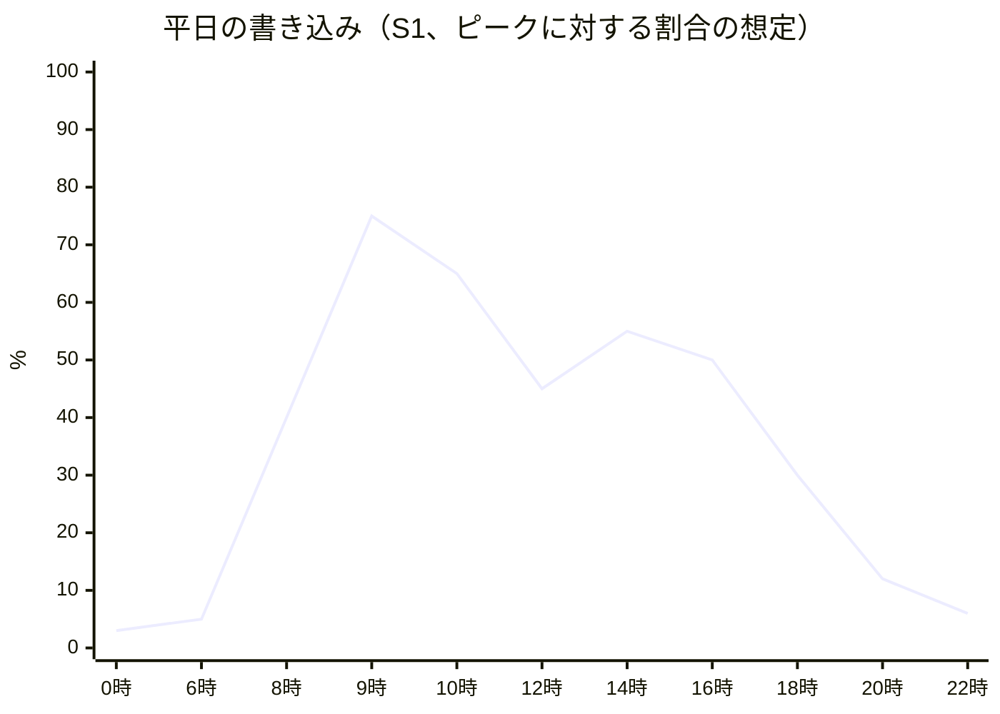
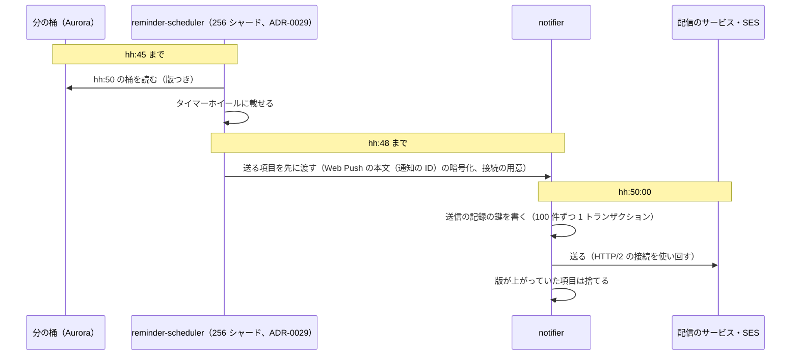

# Capacity: Google Calendar

負荷のモデル（時刻の形：月曜の朝、毎時 0 分・30 分のリマインダーの集中、年度の始め）、1 カレンダーの書き込みの上限と割り当て、リマインダーの集中、大きな会議の空き時間、参加者の写しの配送、CalDAV のポーリング、取り直しの殺到（DR、tzdb の再計算）、部品ごとの必要量、S1・S2・S3 の台数、負荷試験の計画、キャパシティの運用を決める。台数の構成は [infrastructure.md](infrastructure.md) の 5 節、段階を上げる基準は同じく 10 節にある。他の題材（Linear・Slack の capacity.md）の形を引き継ぐ。

| ADR | 決定 |
| --- | --- |
| [0005](../decisions/0005-change-log-and-sync-tokens.md) | カレンダーの行のロックで `change_seq` を振る（1 カレンダーの書き込みは直列） |
| [0006](../decisions/0006-organizer-and-attendee-copies.md) | 参加者ごとに写しを書く（配送は書き込みの平均 4 倍） |
| [0012](../decisions/0012-tzdb-update-recompute-and-propagation.md) | tzdb の再計算は全体 5,000 件/秒、1 テナント 500 件/秒 |
| [0047](../decisions/0047-time-shaped-capacity-and-calendar-write-admission.md) | 負荷のモデルは時刻の形を持ち、時刻で先に広げる。リマインダーは数分前に準備して時刻に放つ。1 カレンダーの書き込みは `origin` ごとの枠で割り当て、利用者を最優先にする |

**ここの数値はすべて初期見積もりである。** E2 の PoC（`occurrence-index-poc`、`calendar-write-throughput-poc`）、E6 の PoC（`freebusy-poc`、`room-exclusion-poc`）、E9 の PoC（`reminder-burst-poc`）、E12 の負荷試験で確かめ、結果で置き換える。本家の負荷の数値は公開の資料にない（**未検証**。2026-10-04 に確認）。

## 1. 負荷のモデル（S1）

### 1.1 量

| 項目 | 値 | 根拠・前提 |
| --- | --- | --- |
| 月間の利用者 | 60 万 | [architecture/README.md](README.md) の 2 節 |
| 平日の利用者 | 42 万 | 月間の 70%（本システムの想定） |
| **書き込みのピーク** | **1,500 件/秒** | 同 2 節。予定オブジェクトの作成・変更・削除、出欠の返事 |
| **参加者の写しの書き込み（配送）** | **6,000 件/秒** | 書き込みの平均 4 倍（同 2 節） |
| **読み出しのピーク** | **15,000 件/秒** | 同 2 節。内訳は 1.3 節 |
| Realtime の同時の接続 | 13 万 | 平日の利用者の 50% が Web の画面を使い、その 60% がピークに開いている |
| **リマインダーの瞬間の量** | **毎時 50 分 00 秒に 約 12 万件** | 3 節。README の 3,000 件/秒は 1 分の平均 |
| iMIP の送信 | 225 通/秒 | 書き込みの 10% に外部の参加者が平均 1.5 人 |
| iMIP の受信 | 50 通/秒 | 外部の返事と招待 |
| 空き時間の照会 | 1,000 件/秒 | 1 回 平均 10 項目、最大 100 項目 |
| 候補の計算（find a time） | 50 件/秒 | 50 人＋会議室 20 を最悪に |
| CalDAV | 2,000 件/秒 | 利用者の 30% が 5 つのカレンダーを 15 分ごとに確かめる（同 2 節。OS の間隔は**未検証**） |
| Webhook の送信 | 500 件/秒 | |
| ICS の購読の取得 | 14 件/秒 | 30 万の購読を 6 時間ごと |
| 検索 | 200 件/秒 | |
| tzdb の再計算 | 5,000 件/秒（走っている間） | [ADR-0012](../decisions/0012-tzdb-update-recompute-and-propagation.md) |

### 1.2 時刻の形

- 上の形は火〜金曜の想定。**月曜の 9〜10 時を 100%（ピーク）** とする（週の予定の入れ直し）。年度の始め（4 月の第 1 週）は、ピークの 1.2 倍を見込む（[runbooks/README.md](../runbooks/README.md) の 3.1 節の想定）。どれも本システムの想定で、E12 の後に実績で直す。
- 読み出しは書き込みと同じ形に、毎時 0・30 分の直前の小さな山（会議に入る前に予定を開く）が重なる。
- リマインダーは、業務の時間の毎時 0・30 分の 10 分前・5 分前・0 分に、秒の単位で集中する（3 節）。
- CalDAV のポーリングは、時刻に関係なく平らに近い（端末が起きている間）。

### 1.3 読み出しの内訳（ピーク 15,000 件/秒）

| 経路 | 件数/秒 | 重さ |
| --- | --- | --- |
| Web の範囲の問い合わせ・差分 | 8,000 | 窓の範囲の問い合わせ（カレンダー 10）は索引の範囲の読み出し 10 回。差分は主キーの範囲の読み出し |
| 公開 API | 3,000 | |
| CalDAV | 2,000 | `PROPFIND`（CTag）が大半。変わったときだけ `sync-collection` と `calendar-multiget` |
| 空き時間・候補 | 1,050 | 4 節 |
| 予約ページ | 500 | |
| 検索 | 200 | |

## 2. 1 カレンダーの書き込み

ADR-0047。

### 2.1 上限

- 1 つのカレンダーの書き込みは、`calendars` の行のロックで直列になる（[ADR-0005](../decisions/0005-change-log-and-sync-tokens.md)）。ロックの保持の時間が上限を決める。
- 保持の見積もり（単発の予定の変更）：ロック（0.2ms）＋ 予定オブジェクトと参加者の行（1ms）＋ 展開の索引の差分（平均 1〜2 行、0.5ms）＋ 会議室の予約の行（0.5ms）＋ `calendar_changes`・outbox（0.5ms）＋ リマインダーの桶（0.3ms）＋ コミット（1〜2ms。**未検証**）≒ 5ms。毎日の系列の時刻の変更は索引の 580 行で 30〜50ms。
- 単発が主なら 1 秒 200 件、系列の変更が混ざれば下がる。揺らぎを見て **1 カレンダー 1 秒 50 件を上限** とする（[architecture/README.md](README.md) の 2 節の見込みと同じ）。E2 の `calendar-write-throughput-poc` で確かめる。

### 2.2 書き込みの多いカレンダー

| カレンダー | 書き込みの源 | ピークの見込み |
| --- | --- | --- |
| 会議室（人気の大会議室） | 主催者の予約は主催者のカレンダーで書く。会議室のカレンダーは写しの配送（`itip`）と範囲の端の維持（`maintenance`） | 1 秒 5〜10 件 |
| 大きな共有のカレンダー（部署の予定、全社の行事） | 利用者の書き込み、ICS の取り込み | 1 秒 10 件 |
| 秘書・代理の人が管理する役員のカレンダー | 利用者の書き込み、写しの配送 | 1 秒 5 件 |
| 予約ページの主催者のカレンダー | 予約（`user`）、写しの配送 | 1 秒 5 件（人気の受付の開始の直後に瞬間 50） |

- 上限（50）に届くのは、取り込みと tzdb の再計算が重なったときと、予約の受付の開始の直後である。割り当て（[ADR-0047](../decisions/0047-time-shaped-capacity-and-calendar-write-admission.md) の表）で、`user` を守る。

## 3. リマインダーの集中

### 3.1 量

| 項目 | 値 | 前提 |
| --- | --- | --- |
| 毎時 0 分に会議のある利用者（最悪の時間帯） | 12.6 万 | 平日の利用者の 30%（[architecture/README.md](README.md) の 2 節の最悪） |
| 1 人の方法の数 | 平均 1.4（画面、Web Push、メール） | 本システムの想定 |
| 既定のリマインダー | 10 分前（70%）、5 分前（20%）、その他（10%） | 本システムの想定。本家の既定は**未検証** |
| **`hh:50:00` の 1 秒に来る送信** | **約 12.3 万件**（12.6 万 × 1.4 × 0.7） | |
| `hh:55:00` | 約 3.5 万件 | |
| うちメール | 20%（`hh:50:00` に 約 2.5 万通） | |

- README の 3,000 件/秒は、この量を 1 分にならした平均にあたる。瞬間の量が設計を決める。

### 3.2 必要な速さ

- 画面・Web Push：p99 30 秒（NFR-003）。12.3 万件の 99% を 30 秒で送り始めるには、**約 4,100 件/秒**。余裕を見て **6,000 件/秒** で用意する。
- メール：p95 2 分。2.5 万通の 95% を 2 分で SES に渡すには、約 200 通/秒。iMIP と他の通知と合わせて、**SES の送信の率を 1,000 通/秒** に引き上げる（既定は 1 秒 1 通・24 時間 200 通で、引き上げられる。[Amazon SES endpoints and quotas](https://docs.aws.amazon.com/general/latest/gr/ses.html)、2026-10-04 に確認）。東京と大阪の両方で引き上げる。

### 3.3 前倒しの準備

ADR-0047。

- 送信の記録の鍵の書き込みは、100 件ずつまとめる（4,100 件/秒で 41 トランザクション/秒）。
- Web Push の 1 回の送信は、暗号化（RFC 8291）の CPU が 1 件 0.3ms 前後、配信のサービスの応答が 50〜200ms と見込む（**未検証**。E9 の `reminder-burst-poc` で測る）。4,100 件/秒 × 0.15 秒 ≒ 620 の同時の要求。`notifier` 1 タスク（1 vCPU）で同時 50 として、**13 タスク**（余裕で 16）。
- 業務の時間は `notifier` をピークの台数のままにする（ADR-0047）。Web Push の本文は通知の ID だけで、Service Worker が表示のときに中身を取る（[ADR-0031](../decisions/0031-notification-channels-and-content.md)）。その取得（`GET /v1/notifications/<id>`）が、送信の速さ（約 4,100 件/秒）と同じ形の山で `api` に来る。`api` の業務の時間の下限に含め、L3 で測る。

## 4. 大きな会議の空き時間

| 場面 | 1 回の読み出し | ピーク | 必要量 |
| --- | --- | --- | --- |
| 照会（平均 10 項目、2 週間） | Valkey の `MGET` 20〜30 鍵。外れたら索引の範囲の読み出し | 1,000 件/秒 | Valkey 3 万 鍵/秒。外れ 20% で reader に 4,000 回/秒の範囲の読み出し |
| 候補の計算（50 人＋会議室 20、2 週間） | 140〜210 鍵。外れたら 70 回の範囲の読み出しをテナントごとに 1 回へまとめる（[free-busy-and-scheduling.md](free-busy-and-scheduling.md) の 5.3 節） | 50 件/秒 | Valkey 1 万 鍵/秒。計算の CPU は 1 回 10ms 以下 |
| 参加者 1,000 人の会議の空き時間の表示 | 100 項目ずつ 10 回の照会 | 5 件/秒 | 上に含む |
| グループの招待（展開 10,000 人）の空き時間 | 候補の計算は必須 50 人・任意 30 人まで（同 6.1 節）。それを超える会議は空き時間を示さず、出欠だけ | — | — |

- 月曜の朝は、会議の入れ直しで候補の計算が増える。50 件/秒は月曜の 9〜10 時の想定。
- キャッシュが冷たいとき（Valkey の障害、月曜の朝の最初）の候補の計算の p95 は、E6 の `freebusy-poc` で測る。2 倍を超えれば範囲を 7 日に縮めて返す（同 7 節）。

## 5. 部品ごとの必要量

### 5.1 Aurora

| 項目 | 見積もり |
| --- | --- |
| 書き込みの行（ピーク） | 予定オブジェクトの書き込み 1,500 × 13 行（予定オブジェクト、参加者 3、索引 6、変更のログ、outbox、リマインダー、監査）≒ 2 万行/秒 ＋ 写しの書き込み 6,000 × 9 行（予定オブジェクト、索引 4、変更のログ、リマインダー、配送の記録、重複の除去）≒ 5.4 万行/秒 ＋ リマインダーの送信の記録 ≒ **約 8 万行/秒** |
| コミット | 予定オブジェクト 1,500 ＋ 写し 6,000（同じ受け手のテナントへの配送は 10 件まで 1 トランザクションにまとめると 約 1,500）＋ リマインダー 41 ≒ **3,000〜7,500 件/秒** |
| writer | `db.r8g.12xlarge`（48 vCPU、384 GiB）。CPU 50% 以下を目標。E2 の PoC で行の数が少なければ `8xlarge` に下げる |
| reader | 同型 × 2。範囲の問い合わせ、差分、CalDAV、空き時間の外れ、照合のジョブ |
| 予定オブジェクト | 3 億 × 2.5 KB ≒ 750 GB |
| 展開の索引 | 4 億行 × 200 B ≒ 80 GB ＋ 索引 80 GB |
| 参加者の行 | 12 億行 × 150 B ≒ 180 GB |
| `calendar_changes`（30 日） | 1 日 約 1.6 億行（予定オブジェクト 3,200 万＋写し 1.3 億）× 80 B × 30 ≒ 380 GB |
| `itip_deliveries`（14 日） | 1 日 約 1.3 億行 × 70 B × 14 ≒ 130 GB |
| 合計のストレージ | 約 2.5 TB（監査、リマインダー、iMIP の記録を含む） |

- 1 日の書き込みは、ピークの 1,500 件/秒を、実質 6 時間ぶんと置いた（3,200 万件/日）。
- 接続：ECS のタスクの数 × プール。writer への接続の上限の見込みは、`api` 30 × 10、`caldav` 12 × 10、`worker-*` 80 × 5、`booking` 6 × 5 ≒ 850。`max_connections` を 2,000 にする。
- パラメーター：`lock_timeout = 2s`（`packages/writer` のセッション）、`statement_timeout`（`api` 5 秒、`caldav` 10 秒、照合のジョブ 60 秒）、`idle_in_transaction_session_timeout = 10s`。

### 5.2 Valkey

| 用途 | 量 |
| --- | --- |
| 空き時間のキャッシュ | 約 400 MB（[free-busy-and-scheduling.md](free-busy-and-scheduling.md) の 5.1 節） |
| 合図の pub/sub | 変更 7,500 件/秒 × 100 B。購読する `realtime` のタスクに複製 |
| 書き込みの枠（`cw:<calendar_id>:<origin>`）、レート制限 | 数百万の鍵（期限つき） |
| アプリ用のパスワードの照合の写し（5 分） | 18 万 × 100 B |
| シャードの担当、送信の上限の数 | 小さい |

- S1 は `cache.r7g.large` のクラスタモード 3 シャード × （プライマリ 1＋レプリカ 1）。pub/sub は S2 で sharded pub/sub にする。失ってよい。

### 5.3 SQS・SES

| キュー・送信 | ピーク | 備考 |
| --- | --- | --- |
| `itip-delivery` | 6,000 メッセージ/秒 | 200 人を超える招待は `itip-bulk` へ分ける（[invitations-and-itip.md](invitations-and-itip.md) の 10.3 節） |
| `reminders` | 4,100 件/秒（瞬間） | |
| `webhooks` | 500 件/秒 | |
| SES の送信 | 1,000 通/秒（引き上げの依頼）、1 日 100 万通 | 3.2 節 |
| SES の受信 | 50 通/秒 | |

### 5.4 取り直しの殺到

| 場面 | 発生 | 散らし方 | 瞬間の負荷 |
| --- | --- | --- | --- |
| DR の後の `sync_epoch` の引き上げ | Web の 13 万の接続、API の利用者、CalDAV の 90 万のコレクション | Web は 0〜60 秒の乱数（[clients.md](clients.md) の 13 節）。CalDAV は次のポーリング（15 分）で自然に散る | Web の窓の取り直し 2,200 件/秒（範囲の読み出し 2.2 万回/秒）、CalDAV の全件の `sync-collection` 1,000 件/秒 |
| tzdb の再計算（`Asia/Tokyo` の最悪） | 2 億件を 11 時間で変更のログへ | 再計算の速さの上限（5,000 件/秒）がそのまま差分の量の上限 | 差分の量が平常の 4 倍。クライアントの取り直しにはならない（410 でなく差分） |
| `realtime` の全喪失 | 13 万の再接続 | 0〜5 秒の乱数、その後は指数の待ち | 2.6 万接続/秒。各クライアントが差分を取る |

- DR の取り直しは、平常の構成（`api` の reader の読み出し）を大きく超える。DR の手順で、`ops.writes_enabled` を開く前に、大阪の `api` を 45 タスク、`caldav` を 20 タスク、reader を 3 台に広げる（[infrastructure.md](infrastructure.md) の 6.3 節。Aurora の reader の追加は 10〜15 分の見込み、**未検証**）。

## 6. サービスの台数

### 6.1 S1（東京、初期見積もり）

| サービス | タスク | 最小 | 業務の時間の下限（ADR-0047） | 最大 | 根拠 |
| --- | --- | --- | --- | --- | --- |
| `api` | 2 vCPU / 4 GB | 9 | 21（月曜の朝 30） | 45 | 1 タスク 500 件/秒、読み出し 1.3 万件/秒 ＋ 書き込み |
| `caldav` | 2 vCPU / 4 GB | 6 | 8（月曜の朝 12） | 24 | 1 タスク 250 件/秒（XML と解析の隔離） |
| `realtime` | 2 vCPU / 4 GB | 6 | 接続の数で反応 | 30 | 1 タスク 1 万接続、13 万で 13＋AZ の余裕 |
| `booking` | 1 vCPU / 2 GB | 2 | 3 | 12 | |
| `auth` | 1 vCPU / 2 GB | 3 | 3 | 9 | |
| `relay` | 0.5 vCPU / 1 GB | 2 | 2 | 4 | |
| `worker-itip-delivery` | 1 vCPU / 2 GB | 4 | 14（月曜の朝 20） | 40 | 6,000 件/秒、1 件 10ms、同時 20/タスク |
| `worker-imip-inbound`・`itip-apply` | 1 vCPU / 2 GB | 2 + 2 | — | 6 + 6 | |
| `worker-expander` | 1 vCPU / 2 GB | 2 | — | 20（tzdb の再計算のとき） | 5,000 件/秒 |
| `worker-reminder-scheduler` | 1 vCPU / 2 GB | 4 | 毎時 55 分・25 分に 8 | 8 | 256 のシャードを借りる（[ADR-0029](../decisions/0029-reminder-clock-buckets-and-timer-wheel.md)） |
| `worker-notifier` | 1 vCPU / 2 GB | 5 | 16 | 30 | 3.3 節 |
| `push-sender`（egress） | 0.5 vCPU / 1 GB | 2 | — | 8 | |
| `ics-fetcher`（egress） | 0.5 vCPU / 1 GB | 2 | — | 4 | |
| その他の `worker-*` | 0.5 vCPU / 1 GB | 計 8 | — | 計 20 | |

- 平常の使用率を 2/3 以下に保ち、1 AZ を失っても残る 2 AZ でピークをさばく（[infrastructure.md](infrastructure.md) の 3.2 節）。
- 平均の vCPU（月）は約 130（業務の時間の下限を含む）。費用は [infrastructure.md](infrastructure.md) の 12 節。

### 6.2 S2・S3（目安）

| 部品 | S2（書き込み 15,000 件/秒、配送 6 万件/秒） | S3（書き込み 75,000 件/秒） |
| --- | --- | --- |
| Aurora | テナントのクラスタ 8〜10（`12xlarge` の writer＋reader 2）＋ ディレクトリのクラスタ 1 | セル 20〜30、各セルに 2〜3 クラスタ |
| `api`・`caldav` | 10 倍 | セルごとに S2 の 1/5 程度 |
| `notifier` | リマインダー 4.1 万件/秒 → 130〜160 タスク | セルごと |
| `realtime` | 130 万接続 → 130〜150 タスク | セルごと |
| Valkey | クラスタごとに 1 つ、sharded pub/sub | セルごと |
| SES | 送信の率 1 万通/秒の引き上げ（**未検証**：引き上げられる上限） | セルごとのリージョンで引き上げ |

## 7. 負荷試験

E12 の `load-tests`・`reminder-burst-load` と、段階を上げる前に行う。staging を本番と同じ台数に広げ、生成データ（[quality.md](../quality.md) の 2.4 節）を使う。道具は k6 と、CalDAV のクライアントの模擬、リマインダーの時計を進める自前の生成器。

| # | 場面 | 負荷 | 合格の基準 |
| --- | --- | --- | --- |
| L1 | 月曜の朝の書き込みと配送 | 書き込み 1,500 件/秒（系列の変更 5%）、配送 6,000 件/秒、30 分 | 書き込みの p99 300ms、伝播の p99 5 秒（200 人まで）、writer の CPU 60% 以下 |
| L2 | 読み出しの混合 | 1.3 節の 15,000 件/秒、30 分 | 範囲の読み出しの p95 300ms、差分の p99 1 秒、可用性 99.9% |
| L3 | リマインダーの集中 | `hh:50:00` に 12.3 万件、`hh:55:00` に 3.5 万件。時計を進めて 3 回 | 画面・Web Push の送信の開始の p99 30 秒、メールの引き渡しの p95 2 分、重複 0.01% 未満、漏れ 0（業務の時間の下限の台数のまま） |
| L4 | 空き時間 | 照会 1,000 件/秒、候補 50 件/秒。キャッシュの暖かい・冷たい | 照会の p95 300ms、候補の p95 1 秒（冷たいときは 2 秒以内） |
| L5 | CalDAV のポーリング | 90 万のコレクション、2,000 件/秒、変わったコレクションの `sync-collection` と `calendar-multiget` | p99 1 秒、`caldav` の CPU 60% 以下 |
| L6 | 会議室の混雑 | 人気の会議室 20 室に、予約（`user`）各 1 秒 20 件、写しの配送、`maintenance` と `import` を同時に | `user` の書き込みの p99 300ms、枠の外の `origin` は待つだけで失敗しない、二重予約 0 |
| L7 | tzdb の再計算 | `Asia/Tokyo` の合成の改正、5,000 件/秒を L1・L2 の平常の負荷と同時に 1 時間 | L1・L2 の基準を保つ、再計算の速さ 5,000 件/秒、会議室の予約の行が先に終わる |
| L8 | 取り直しの殺到 | `sync_epoch` を上げ、Web 13 万・CalDAV 90 万の取り直し | 5.4 節の広げた構成で、範囲の読み出しの p95 1 秒以内、30 分で平常へ戻る |
| L9 | 大きな招待 | グループ 10,000 人の招待を 1 分に 5 件、平常の負荷と同時に | 200 人を超える分の伝播の p99 60 秒、200 人までの p99 5 秒を保つ |
| L10 | Realtime の再接続 | 13 万の接続を一度に切る | 2 分で再接続を終える、差分の取り直しで `api` の p99 が 1 秒を超えない |

- 各場面の結果（台数、使用率、遅れの分布）を記録し、この文書の見積もりを置き換える PR を作る。
- L3 と L6 は、ADR-0047 の確かめ（Confirmation）を兼ねる。

## 8. キャパシティの運用

- **月次のレビュー**（Ops、Dev）：段階を上げる指標（[infrastructure.md](infrastructure.md) の 10 節）、業務の時間の下限の台数と実際のピーク、上位 50 のカレンダーのロックの待ちと枠の拒否、Aurora のストレージの伸び、SES の送信の率の使用。
- **業務の時間の下限の見直し**：前月の月曜の朝のピークの 1.2 倍を下限の目標にする。祝日と年度の始めのスケジュールを毎年 1 月に作る（祝日のカレンダーから生成）。
- **クォータ**：Fargate の vCPU、SES の送信の率と 24 時間の数、SQS の in-flight、ElastiCache のノードの数を、東京と大阪で同じに保つ（[infrastructure.md](infrastructure.md) の 6.5 節）。
- **大口のテナントの受け入れ**：利用者 1 万を超える組織の契約の前に、書き込みの割合（S2 の基準の 20%）と、会議室の数を見積もる。

## 9. Story の候補

| Epic | Story | 中身 |
| --- | --- | --- |
| E2 | `calendar-write-throughput-poc` | 2.1 節の 1 カレンダーの上限と、ロックの保持の時間 |
| E2 | `calendar-write-admission` | 2.2 節と ADR-0047 の `origin` ごとの枠、混雑の制御 |
| E9 | `reminder-burst-poc` | 3 節の 12.3 万件の送信、前倒しの準備、Web Push の暗号化と応答の時間（reminders-and-notifications と共同） |
| E12 | `scheduled-scaling` | ADR-0047 の業務の時間の下限、祝日のスケジュールの生成 |
| E12 | `load-tests` | 7 節の L1・L2・L4〜L10 |
| E12 | `reminder-burst-load` | 7 節の L3 |
| E12 | `ses-quota-increase` | 3.2 節の送信の率の引き上げ（東京・大阪） |
| E12 | `capacity-review-dashboard` | 8 節のレビューのダッシュボード（observability と共同） |

## 10. 未解決の問い

### 決定

2026-10-04 の既定案。E2・E9・E12 で覆りうる。

- **時刻で先に広げる**：業務の時間の下限、月曜の朝は 100%（ADR-0047）。
- **リマインダー**：瞬間の量（`hh:50:00` に 12.3 万件）で設計し、6,000 件/秒を用意する。前倒しで準備する（ADR-0047）。
- **1 カレンダーの書き込みの割り当て**：`user` 30、`itip` 15、`maintenance` 5、`import` 5 件/秒（ADR-0047）。
- **Aurora の writer**：`r8g.12xlarge` から始める（5.1 節）。

### 持ち越し

| 問い | いつ・どう決めるか |
| --- | --- |
| 1 カレンダーの書き込みの上限（50 件/秒）、ロックの保持の時間 | E2 の `calendar-write-throughput-poc` |
| 1 予定オブジェクトの書き込みの行の数と、writer の大きさ | E2 の `occurrence-index-poc` と L1 |
| 既定のリマインダーの分布と、方法の数 | E9 の後の実績。本家の既定は**未検証** |
| Web Push の送信の時間と配信のサービスの受け付けの上限 | E9 の `reminder-burst-poc`（**未検証**） |
| OS の標準のカレンダーのポーリングの間隔 | E8 の試験場で記録する（**未検証**） |
| ECS の新しいタスクが受け付けるまでの時間 | E12（**未検証**） |
| SES の送信の率の引き上げの上限（S2 の 1 万通/秒） | S2 の前に AWS に確かめる（**未検証**） |

## 11. quality.md・runbooks・data-model への項目

### quality.md

- 7 節の L1〜L10 の合格の基準を、E12 の GA の判定に使う（[quality.md](../quality.md) の 5 節の E12 の行）。
- L3 の重複・漏れの数え方は、[observability.md](observability.md) の 5.2 節の記録に従う。

### runbooks

- `calendar-lock-contention.md`（[runbooks/README.md](../runbooks/README.md) の 4 節の予定）：上位のカレンダーの枠の拒否とロックの待ちの見方、`origin` ごとの枠の一時の変更（`ops.calendar_write_budget.<origin>`）。
- `reminder-delay.md`：業務の時間の下限の台数と、`notifier` を手で広げる手順。
- `capacity-review.md`（新規の提案）：8 節の月次のレビューの手順。

### data-model（索引への追加の提案）

| 置き場所 | 中身 | 節 |
| --- | --- | --- |
| Valkey `cw:<calendar_id>:<origin>` | 1 カレンダーの書き込みの枠（トークンバケット） | 2.2、ADR-0047 |
| Valkey `cwlat:<calendar_id>` | 直近 10 秒のロックの待ちの p99（混雑の制御） | ADR-0047 |
| AppConfig `ops.calendar_write_budget.<origin>` | 枠の一時の変更 | 2.2 |
| `scaling_schedules`（Terraform の生成の元） | 業務の時間・月曜の朝・祝日・年度の始めの下限 | 8 |

## 出典

- AWS, [Amazon Simple Email Service endpoints and quotas](https://docs.aws.amazon.com/general/latest/gr/ses.html)（2026-10-04 に確認）：送信の既定のクォータは 24 時間 200 通・1 秒 1 通で、引き上げられる
- IETF, [RFC 8291: Message Encryption for Web Push](https://www.rfc-editor.org/rfc/rfc8291)
- 他の題材の capacity.md（Linear、Slack）から引き継いだ形と考え方は、その文書に従う。
