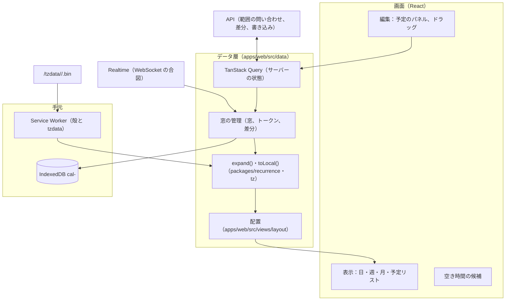

# Clients: Google Calendar

Web の画面（日・週・月・予定リスト）、重なる予定の配置、タイムゾーンと夏時間の表示、ドラッグでの作成と移動、繰り返しの編集の選び方、キーボードと IME、窓つきの差分の同期と手元の展開、オフラインの閲覧と手元のデータ、PWA と Web Push の登録、OS の標準のカレンダー（CalDAV）でのモバイルの覆い方を決める。

前提となる決定は、基盤とクライアントの形（[ADR-0001](../decisions/0001-platform-and-stack.md)）、時刻の表し方（[ADR-0002](../decisions/0002-time-representation.md)）、繰り返しの保存と展開（[ADR-0003](../decisions/0003-recurrence-storage-and-expansion.md)）、権限（[ADR-0004](../decisions/0004-tenancy-and-rls.md)）、変更のログと同期のトークン（[ADR-0005](../decisions/0005-change-log-and-sync-tokens.md)）、標準の範囲（[ADR-0007](../decisions/0007-interop-standards-scope.md)）。この文書で決めたことは次の ADR にある。

| ADR | 決定 |
| --- | --- |
| [0038](../decisions/0038-web-calendar-rendering-and-local-expansion.md) | 予定オブジェクトを窓つきの差分の同期で持ち、回は手元の `expand()` で作る。tzdb はサーバーの版のゾーンのデータを版つきの URL から取る。重なる予定は、日ごとの重なりの塊に貪欲に列を割り当てて右へ広げる決定的な配置で描く |
| [0039](../decisions/0039-offline-read-cache-and-local-data.md) | オフラインは読み出しだけ。アカウントごとの IndexedDB に前後 4 週の予定オブジェクト・トークン・ゾーンのデータを持つ。手元の DB は捨ててよい写しで、版が変われば作り直す。ログアウト・セッションの取り消し・30 日の不使用で消し、共有の端末では保存しない |

## 1. 目的と範囲

- 扱う：
  - Web の SPA の骨格、対応環境、ルート
  - データの取り方（範囲の問い合わせ、差分の同期、Realtime の合図、tzdb のゾーンのデータ）
  - 日・週・月・予定リストの表示、重なる予定の配置、終日と複数日の予定
  - 表示のタイムゾーン、2 つ目のタイムゾーン、夏時間の切り替えの日、予定ごとのタイムゾーンの示し方
  - ドラッグでの作成・移動・長さの変更、楽観的な描画、版の衝突
  - 繰り返しの予定の編集の選び方（この予定だけ・これ以降・すべて）と、各領域が画面に求めた確かめ
  - 招待と出欠、空き時間の候補の表示
  - キーボード、IME、アクセシビリティ、日本語と和暦の表示
  - オフラインの閲覧と手元のデータ、PWA、Web Push の購読の登録
  - モバイルを OS の標準のカレンダー（CalDAV）で覆うときの案内
- 扱わない：
  - `expand()` の規則（[events-and-recurrence.md](events-and-recurrence.md)）、`resolve` と tzdb の版（[time-zones-and-holidays.md](time-zones-and-holidays.md)）
  - 差分の同期のトークンの形と範囲の問い合わせの API（[sync-and-caldav.md](sync-and-caldav.md)、[api-and-push.md](api-and-push.md)）
  - リマインダーの時計と Web Push の送信（[reminders-and-notifications.md](reminders-and-notifications.md)）
  - 空き時間の候補の計算（[free-busy-and-scheduling.md](free-busy-and-scheduling.md)）
  - ログイン・SSO・セッション（[accounts-and-orgs.md](accounts-and-orgs.md)）
  - 予約ページの画面（[booking-pages.md](booking-pages.md)。殻とデザインの部品は共有する）
  - ネイティブのモバイルのアプリ（E13。MVP の後）

## 2. 要件

| 要件 | 目標 | NFR・出典 |
| --- | --- | --- |
| 範囲の表示 | 週の表示（カレンダー 10）を開いてから描き終えるまで、手元に窓があれば p95 200ms、なければ p95 600ms（サーバーの範囲の読み出し p95 300ms を含む） | NFR-001 |
| ドラッグ | 入力から描画まで p95 100ms（楽観的に描く） | NFR-001 |
| 伝播 | 確定から同じ利用者の他の Web クライアントの表示まで p99 3 秒 | NFR-002 |
| 時刻の一致 | 同じ予定の同じ回が、画面・API・CalDAV で同じ瞬間。終日は見る人のタイムゾーンに関係なく同じ日付 | NFR-009、[intent.md](../intent.md) の「守るべき振る舞い」 |
| 漏れ | 画面にも手元の DB にも、`redact()` の後の形しか置かない | NFR-008 |
| オフライン | 前後 4 週の読み出し。書き込みはしない | [architecture/README.md](README.md) の 6 節 |
| IME | 日本語の変換の途中の `Enter` で保存しない | [AGENTS.md](../../AGENTS.md)、[quality.md](../quality.md) のリスク 9 |
| アクセシビリティ | WCAG 2.2 の AA を目標にする | 本システムの既定 |

## 3. 本家の形（確かめたこと）

| 項目 | 本家 | 出典 |
| --- | --- | --- |
| Web のオフライン | Chrome で、過去 4 週と未来のすべての予定を、日・週・月で見られる。オフラインでは予定の作成・編集、参加者へのメール、タスクができない | [Use Google Calendar offline](https://support.google.com/calendar/answer/1340696?hl=en&co=GENIE.Platform%3DDesktop) |
| キーボードの操作 | 設定で有効・無効を切り替えられる。`1`・`d` で日、`2`・`w` で週、`3`・`m` で月、`j`・`n` で次、`t` で今日、`?` で一覧 | [Keyboard shortcuts for Google Calendar](https://support.google.com/calendar/answer/37034) |
| 重なる予定の配置の規則、ドラッグの刻み、繰り返しの編集の選び方の画面の文言 | 公開の資料にない（**未検証**） | — |

いずれも 2026-10-04 に確認。

- 本システムのオフラインは、未来を前後 4 週に限る（本家は未来のすべて）。手元の量と、消すきっかけを決めやすくするため（[ADR-0039](../decisions/0039-offline-read-cache-and-local-data.md)）。ブラウザは Chrome に限らない。
- キーボードの操作の既定の割り当てと、画面の見た目を本家にどこまで寄せるかは、法務の確認待ち（L10）。本システムは割り当てを自前で決め、利用者が無効にでき、変えられる形にする（8.1 節）。

## 4. 対応環境と骨格

### 4.1 対応環境

| 環境 | 対応 |
| --- | --- |
| デスクトップのブラウザ | Chrome・Edge・Firefox・Safari の最新と 1 つ前の主の版 |
| スマートフォンのブラウザ | iOS の Safari、Android の Chrome の最新と 1 つ前。幅 360px 以上 |
| PWA | ホーム画面に置ける（iOS は Safari の「ホーム画面に追加」。Web Push は置いたときだけ。11 節） |
| OS の標準のカレンダー | CalDAV（[sync-and-caldav.md](sync-and-caldav.md)）。MVP のモバイルの主な経路 |

### 4.2 構成

- サーバーの状態は TanStack Query で持ち、窓の管理が IndexedDB への写しと差分の当て方を持つ。
- 展開と時刻の計算は `packages/recurrence`・`packages/tz` を、サーバーと同じコードで使う（[ADR-0001](../decisions/0001-platform-and-stack.md)）。
- 月・曜日の名前、和暦は `Intl.DateTimeFormat` の書式だけで出す。`timeZone` の指定は使わない（[ADR-0002](../decisions/0002-time-representation.md)）。

### 4.3 ルート

| ルート | 画面 |
| --- | --- |
| `/r/day/YYYY-MM-DD`、`/r/week/YYYY-MM-DD`、`/r/month/YYYY-MM`、`/r/agenda/YYYY-MM-DD` | 表示。日付は表示のタイムゾーンの日付 |
| `/r/eventedit/<calendar_id>/<event_object_id>?rid=<recurrence_id>` | 予定の編集 |
| `/r/find-a-time` | 空き時間の候補 |
| `/r/settings/*` | 設定（表示、タイムゾーン、通知、CalDAV のアプリ用のパスワード、ICS の秘密のアドレス） |
| `/r/pending` | 保留の招待（[invitations-and-itip.md](invitations-and-itip.md) の 11.5 節） |

- URL の問い合わせの部分に、予定の中身や検索の語を入れない（ログに残るため。[observability.md](observability.md) の 2 節）。検索の語は画面の状態として持つ。

## 5. データの流れ

ADR-0038。

### 5.1 窓

- 窓は `[表示の始まり − 4 週, 表示の終わり + 4 週]`（表示のタイムゾーンの日付を、`resolve` で UTC の区間にしたもの）。
- 表示を開くと、見えるカレンダーごとに、まず今のトークンを取り、次に範囲の問い合わせで窓に回が触れる予定オブジェクトを取る。トークンを先に取るので、間の変更は次の差分で重ねて届き、版の比べで捨てる。差分の同期のトークンを `timeMin`・`timeMax` と一緒に使わない（[ADR-0026](../decisions/0026-public-rest-api-shape.md)）。
- 差分は `POST /v1/sync` に最大 50 のカレンダーのトークンを束ねて取る（[api-and-push.md](api-and-push.md) の 4.6 節、[sync-and-caldav.md](sync-and-caldav.md) の 5 節）。予定を返さずに今のトークンだけを返す形は、`POST /v1/sync` の `tokensOnly`（[api-and-push.md](api-and-push.md) の 4.6 節。統合の工程で足した）。

### 5.2 差分

- Realtime の WebSocket の合図（「カレンダー C が `seq` S になった」）を受け、手元のトークンが古ければ差分を取る（[ADR-0005](../decisions/0005-change-log-and-sync-tokens.md)）。合図は 300ms まとめてから取りに行く。
- 合図が落ちたときのため、5 分ごとと、タブが前面に戻ったとき（`visibilitychange`）に確かめる。
- 差分のうち、窓に回が触れない予定オブジェクトは捨てる。1 回の差分が 1,000 件を超えたら、差分を捨てて窓を取り直す。
- 410 は窓を取り直す（先に `tokensOnly` でトークンを取り、次に範囲の問い合わせ）。400（条件の違い）はクライアントの誤りとしてエラーの報告に出し、窓を取り直す。

### 5.3 回を作る

- 窓の中の予定オブジェクトを `expand(object, window, tzdata)` で回にし、表示のタイムゾーンで `toLocal` して並べる。
- 回の識別子は `(event_object_id, recurrence_id)`（[ADR-0003](../decisions/0003-recurrence-storage-and-expansion.md)）。描画の鍵にも使う。
- 1 つの予定オブジェクトの展開は、展開の量の上限（[events-and-recurrence.md](events-and-recurrence.md) の 4.6 節）を超えたら途中で止め、「表示しきれない回があります」を示す。

### 5.4 tzdb のゾーンのデータ

- API の応答の `tzdata_version` と同じ版のゾーンのデータを `/tzdata/<version>/<zone>.bin` から取る（[ADR-0038](../decisions/0038-web-calendar-rendering-and-local-expansion.md)）。Service Worker と IndexedDB に持つ。
- 版が変わったら（API の応答の `tzdata_version` が手元と違う）、使っているゾーンを新しい版で取り直し、回を作り直す。古い版で計算し直さない。
- 取れないとき、オンラインなら範囲の問い合わせ（`singleEvents=true`）のサーバーの派生の値で描く（[sync-and-caldav.md](sync-and-caldav.md) の 5 節）。オフラインで新しい版を持っていないときは、5.3 節の回のうち、予定オブジェクトの派生の値（`start_utc`）のある単発と上書きはそれで描き、規則の回には「時刻を確かめられない」の印を付ける。

### 5.5 書き込み

- 書き込みはオンラインのときだけ（[ADR-0039](../decisions/0039-offline-read-cache-and-local-data.md)）。`If-Match`（予定オブジェクトの `etag`）を付けて送る。
- 楽観的に描き、応答の予定オブジェクトで置き換える。手元のトークンは進めない（次の差分で同じ版が届き、版の比べで捨てる）。
- 412（版の衝突）：最新を取り直し、利用者の変更と最新の違いを示して、もう一度送るか捨てるかを選ばせる。自動でまとめない。
- 403（参加者の写しの共有の項目を直そうとした、など）：理由のコードの文言を示し、描画を戻す。

## 6. 表示

### 6.1 日・週

- 縦の軸は表示のタイムゾーンの壁時計の時刻（0〜24 時）。横の軸は日（週は 7 日、週の始まりは設定で日曜・月曜。日本の言語の既定は日曜）。
- 上に終日の帯（終日の予定と、24 時間以上の時刻つきの予定）。
- 今の時刻の線を、表示のタイムゾーンで描く。
- ドラッグの刻みは 15 分（設定で 5・10・15・30 分）。

### 6.2 重なりの配置

ADR-0038 の手順（日ごとの区切り → 重なりの塊 → 最初に空いた列 → 右へ広げる）で描く。

例（同じ日、表示のタイムゾーンで）：

| 予定 | 時刻 | 列 | 幅 |
| --- | --- | --- | --- |
| A | 09:00–10:00 | 0 | 1/3 |
| B | 09:00–09:30 | 1 | 1/3 |
| C | 09:15–09:45 | 2 | 1/3 |
| D | 09:30–11:00 | 1（B が 09:30 に終わる） | 1/3（列 2 の C と 09:30〜09:45 で重なるので広げない） |
| E | 10:00–10:30 | 0（A が 10:00 に終わる） | 1/3（列 1 の D と重なる） |
| F | 10:45–11:30 | 0（E が 10:30 に終わる） | 1/3（D と重なる。11:00 の後の部分も塊の幅のまま） |

- 塊の外の予定（たとえば 13:00–14:00 で他と重ならないもの）は全幅で描く。右へ広げる例：P 14:00–15:00（列 0）、Q 14:00–14:30（列 1）、R 14:00–14:30（列 2）、S 14:30–15:00（列 1）の塊は 3 列で、S は列 2 に 14:30〜15:00 の区切りがないので列 2 まで広げ、幅 2/3 になる。

- 並べ方の同点は `(event_object_id, recurrence_id)` で決め、描くたびに同じ配置にする。
- 辞退した予定は、設定で隠す（既定は薄く出す）。`transparent` の予定は枠線だけで描く。
- 他の人のカレンダーの予定で、`redact()` が区間だけを返したもの（空き時間だけ、`private` の非参加者）は「予定あり」とだけ描き、開いても中身を出さない。

### 6.3 月

- 週の行ごとに、複数日の予定と終日の予定を最も低い空いた段に置く。時刻つきの予定は開始の時刻と題を 1 行で出す。
- 段の数がセルの高さを超えたら「他 N 件」。押すと、その日の一覧を出す。

### 6.4 予定リスト

- 今日からの回を日ごとに並べる。窓の外へ進むと範囲の問い合わせで続きを取る（オンラインのとき）。
- 長い一覧は仮想のスクロールで描く。

### 6.5 タイムゾーン

- **表示のタイムゾーン**：利用者の設定（既定は利用者のタイムゾーン）。端末のタイムゾーンが設定と違うとき、上に「端末のタイムゾーン（X）で表示しますか」を 1 回示す。端末のタイムゾーンの検出には `Intl.DateTimeFormat().resolvedOptions().timeZone` を読むだけ（オフセットの計算には使わない）。
- **2 つ目のタイムゾーン**：日・週の左に、もう 1 本の時刻の軸を出せる。
- **予定ごとのタイムゾーン**：開始・終了の TZID が表示のタイムゾーンと違う予定は、パネルで「10:00（ロンドン）／ 19:00（東京）」のように両方を出す。開始と終了のゾーンが違う予定（移動）は、それぞれのゾーンで出す。
- **浮動の時刻**：「どのタイムゾーンでも 7:00」と示す（[time-zones-and-holidays.md](time-zones-and-holidays.md) の 5.2 節）。
- **外部の主催者の時刻のずれ**：tzdb の更新の後、`changed_from` から 30 日以内に回がある外部の主催者の予定には、「主催者の時刻と違う可能性」を示す（[time-zones-and-holidays.md](time-zones-and-holidays.md) の 6.5 節）。

### 6.6 夏時間の切り替えの日

- 表示のタイムゾーンに夏時間がある日も、縦の軸は 0〜24 時の壁時計の時刻のまま描く。
- 存在しない時刻（例：02:00〜03:00 が飛ぶ日）の帯は斜線で示し、そこへドラッグで置けない。予定の区切りは壁時計の時刻で描くので、01:30〜03:30 の区切りが実際は 1 時間であることを、パネルで長さ（1 時間）として示す。
- 2 回ある時刻（例：01:00〜02:00 が 2 回）の予定は、同じ帯に描き、2 回目のものに「（2 回目）」の印を付ける。その帯へのドラッグは先の回として置く（[ADR-0002](../decisions/0002-time-representation.md) の解き方と同じ）。

### 6.7 終日

- 終日の予定は日付だけで置き、UTC から日付に戻さない（[time-zones-and-holidays.md](time-zones-and-holidays.md) の 5.2 節）。表示のタイムゾーンを変えても同じ日に出る。
- 日本の祝日のカレンダーは終日の予定として、既定で表示する（日本の言語の利用者）。

## 7. 操作

### 7.1 作成・移動・長さの変更

- 空いた場所のドラッグで作成のパネルを開く。予定のドラッグで移動、下の端のドラッグで長さの変更。
- 繰り返しの予定の回をドラッグで動かしたら、7.2 節の選び方を出す（既定は「この予定」）。
- 他の人の予定・参加者の写しの共有の項目は、ドラッグできない（主催者の写しを通す。[ADR-0006](../decisions/0006-organizer-and-attendee-copies.md)）。参加者の権限で変更できる予定は、主催者の写しへの書き込みとして送る（[invitations-and-itip.md](invitations-and-itip.md) の 8.2 節）。
- 作成のパネルのタイトルは、IME の変換の途中の `Enter` で保存しない（8.2 節）。

### 7.2 繰り返しの予定の編集の選び方

| 選択 | 送るもの | 画面の確かめ |
| --- | --- | --- |
| この予定 | 1 回分の上書き（[events-and-recurrence.md](events-and-recurrence.md) の 5 節） | — |
| これ以降 | 「これ以降」の分割（同 6 節）。R が最初の回なら「すべて」と同じ | 行き先のない上書き・EXDATE が捨てられるとき、応答の前に件数と日付を示して確かめる（同 6.3 節の `dropped_overrides`・`dropped_exdates`） |
| すべて | 系列の全体の変更（同 7 節） | 開始の時刻・規則を変えて上書きが付け替えられないとき、同じく確かめる（[ADR-0009](../decisions/0009-series-edit-and-override-rebasing.md)） |

- 毎月の繰り返しで 29〜31 日を選んだら、「その日のない月は飛ばす」と「月の末日」の 2 つを示して選ばせる（[events-and-recurrence.md](events-and-recurrence.md) の 4.7 節）。
- 外部の参加者がいる予定で「これ以降」を選ぶと、外部では別の予定に見えることを示す（[ADR-0003](../decisions/0003-recurrence-storage-and-expansion.md) の Consequences）。

### 7.3 招待と出欠

- 出欠のボタン（承諾・仮承諾・辞退）とコメント。繰り返しの予定では「この予定・すべて」を選ぶ。
- 日時の変更で出欠が `needs_action` に戻った予定は、「前は承諾していました」を示し、1 回の操作で同じ返事を出せるようにする（[ADR-0014](../decisions/0014-itip-state-transfer-and-sequence.md)）。
- 保留の招待は、カレンダーに出さず、`/r/pending` に数だけを示す（[invitations-and-itip.md](invitations-and-itip.md) の 11.5 節）。
- 未確認の返事は、主催者のパネルに「確かめられない返事」として出し、手で受けられる（同 11.4 節）。

### 7.4 空き時間の候補

- 候補の計算（[free-busy-and-scheduling.md](free-busy-and-scheduling.md) の 6 節）の結果を、候補の一覧と、人ごとの予定ありの帯で示す。
- 「全員の勤務の時間の中の候補はありません」のときは、外れる人を候補ごとに示す（同 6.4 節）。
- 空き時間がわからない人（見られない、相手のテナントが遅い）は、別の帯で「不明」と示す。

### 7.5 会議室

- 会議室の「要確認」（tzdb の計算し直しで重なった。[ADR-0012](../decisions/0012-tzdb-update-recompute-and-propagation.md)）は、主催者の予定のパネルに目立つ印で示し、別の会議室の提案へつなぐ（[rooms-and-resources.md](rooms-and-resources.md)）。

## 8. キーボードと IME

### 8.1 キーボード

- 既定の割り当て（本システムの案。本家に寄せる範囲は法務の L10 の後に確定）：

| キー | 操作 |
| --- | --- |
| `d`・`w`・`m`・`a` | 日・週・月・予定リスト |
| `j`・`k` | 次・前の期間 |
| `t` | 今日 |
| `c` | 作成 |
| `e` | 選んだ予定の編集 |
| `Delete`・`Backspace` | 選んだ予定の削除（確かめあり） |
| `/` | 検索 |
| `g` | 日付へ移る |
| `?` | 一覧 |
| `Esc` | パネルを閉じる |

- 1 文字のキーの割り当ては、設定で無効にでき、変えられる（WCAG 2.2 の 2.1.4「文字キーのショートカット」。[Understanding SC 2.1.4](https://www.w3.org/WAI/WCAG22/Understanding/character-key-shortcuts.html)、2026-10-04 に確認）。
- 入力の欄、IME の変換の途中では、割り当てを動かさない。
- 予定の間の移動：矢印で同じ日の前後・隣の日の近い予定へ、`Enter` で開く。

### 8.2 IME

**DT-CLI-001（`Enter` の扱い）**：上から順に評価し、最初に一致した行を採用する。

| # | 欄 | `isComposing` | `keyCode` | `compositionend` の直後（同じタスク） | → 動作 |
| --- | --- | --- | --- | --- | --- |
| 1 | - | true | - | - | 何もしない（変換の確定は IME に任せる） |
| 2 | - | - | 229 | - | 何もしない |
| 3 | - | false | - | はい | 何もしない（Safari などで、確定の `Enter` の `keydown` が `compositionend` の後に来る場合の備え） |
| 4 | タイトル（作成のパネル、クイック作成） | false | 13 | いいえ | 保存 |
| 5 | 説明（複数行） | false | 13 | いいえ | 改行（保存は `Ctrl`・`Cmd`＋`Enter`） |
| 6 | 場所・参加者の入力 | false | 13 | いいえ | 候補を選ぶ |

- 3 の「直後」は、`compositionend` で立てた印を、次のタスク（`setTimeout(0)`）で下ろす形で判定する。ブラウザごとの `compositionend` と `keydown` の順序の違いは、OS × IME × ブラウザの手動の確認の表で確かめる（**未検証**。E7 の `ime-guard`）。
- 参加者の入力の欄で、変換の途中の文字で候補を探さない（確定の後に探す）。

## 9. 速さの予算と計測

| 操作 | 予算 | 測り方 |
| --- | --- | --- |
| 週の表示（窓あり） | p95 200ms（配置の計算 16ms 以下を含む） | RUM、CI のベンチマーク |
| 週の表示（窓なし） | p95 600ms | RUM |
| ドラッグ（入力から描画） | p95 100ms | RUM（Event Timing）、CI のベンチマーク |
| 差分の当てと描き直し | 1 回 50ms 以下（差分 100 件） | CI のベンチマーク |
| 初めの読み込み | 殻の JavaScript 250 KB 以下（圧縮後）、操作できるまで p95 2.5 秒（4G 相当） | RUM、CI のサイズの検査 |

- 配置の計算と展開は、週の切り替えで変わった日だけやり直す（日ごとに結果を持つ）。
- 6 列を超える重なり、300 件を超える週は、ベンチマークの場面に入れる。
- RUM は、操作の名前ごとのヒストグラムだけを送る。予定の中身・ID・URL を送らない（[observability.md](observability.md) の 3 節）。

## 10. オフラインと手元のデータ

ADR-0039。

- 手元に持つもの、オフラインの振る舞い、消すきっかけは [ADR-0039](../decisions/0039-offline-read-cache-and-local-data.md) のとおり。
- 起動の順：Service Worker が殻を返す → IndexedDB の窓で描く → オンラインなら差分を取る。手元に窓がなければ範囲の問い合わせを待つ。
- 「この端末に保存しない」はログインの画面の選択（[accounts-and-orgs.md](accounts-and-orgs.md)）。選ぶと、手元の DB を作らず、Service Worker の殻だけを使う。
- 手元の DB の保持（30 日の不使用で消す）は、法務の L5 の後に確定する。

## 11. PWA と Web Push の登録

- PWA のマニフェスト（名前は `<Brand> カレンダー`、アイコン、`display: standalone`）。
- Web Push の購読は、利用者が通知の設定で有効にしたときだけ求める（初めの訪問で許可を求めない）。iOS は、ホーム画面に置いた PWA でだけ購読できる（**未検証**。E9 の `web-push` で確かめる）。
- 購読は VAPID の公開鍵（RFC 8292）で作り、`endpoint` と鍵をサーバーへ送る。サーバーは `endpoint` のホスト名を許可リストで確かめる（[ADR-0040](../decisions/0040-untrusted-calendar-input-gate.md)）。
- 通知の本文は通知の ID だけで、Service Worker が表示のときに API から中身を取る（[ADR-0031](../decisions/0031-notification-channels-and-content.md)）。取れなければ「予定の通知」と出す。Web Push の配信のサービスは国外にありうる（法務の L1・L4）。
- 通知を押したら、その回の予定のパネルを開く。

## 12. アクセシビリティと国際化

- 週・日の格子は `role="grid"` にし、各回を `gridcell` の中のボタンにする。読み上げは「10 時から 11 時、定例、会議室 A、承諾済み」の順にする。
- 色だけで状態を示さない（辞退は取り消し線、仮承諾は斜線の模様も付ける）。
- 文字の拡大 200% で、横のスクロールなしに週の表示を使える（狭い幅では 3 日の表示に切り替える）。
- 日本語を既定にし、英語を出す。日付の書式は `Intl.DateTimeFormat` の書式だけを使う。和暦の表示（令和 8 年 10 月 4 日）は設定で選べる（[time-zones-and-holidays.md](time-zones-and-holidays.md) の 10 節）。

## 13. 障害のときの振る舞い

| 事象 | 起きること | 備え |
| --- | --- | --- |
| Realtime が切れた | 他の端末の変更が届かない | 再接続（0〜5 秒の乱数、その後は指数の待ち、最大 60 秒）。切れている間は 1 分ごとに差分を取る |
| API が遅い・5xx | 表示・書き込みが止まる | 手元の窓で描き続ける。書き込みは失敗を示し、楽観的な描画を戻す（自動で送り直さない。二重の作成を避ける） |
| 410 の急増（DR の `epoch`、tzdb の大きな計算し直し） | 全クライアントが取り直す | 取り直しを 0〜60 秒の乱数で遅らせる。サーバーの `Retry-After` に従う |
| tzdb の新しい版のゾーンを取れない | 回の時刻が確かめられない | 5.4 節の印 |
| IndexedDB が使えない（プライベートの閲覧、容量） | 手元に持てない | メモリーだけで動く。オフラインの閲覧ができないことを設定に示す |
| 新しい資産の版で不具合 | 画面のエラー | 段階的な配布を止めて戻す（[delivery.md](delivery.md) の 5 節） |

## 14. セキュリティ

- **XSS**：予定の説明は文字として描く。HTML の説明（ICS の取り込み・iMIP の `X-ALT-DESC` など）は、許可リストのサニタイザー（`a`・`b`・`i`・`u`・`br`・`p`・`ul`・`ol`・`li` だけ、属性は `href` の `https:`・`mailto:` だけ）を通す。CSP は `script-src 'self'`、Trusted Types を有効にする。
- **リンク**：説明・場所の URL は `rel="noopener noreferrer"` で開き、知らない送信元の招待の予定のリンクには「外部のサイト」の印を付ける（迷惑な招待の対策。[security.md](security.md) の 3.1 節）。
- **手元のデータ**：[ADR-0039](../decisions/0039-offline-read-cache-and-local-data.md)。
- **クリックジャッキング**：`frame-ancestors 'none'`。
- **分析の計測**：外部の解析のサービスへ送らない。RUM は自前の収集の口だけ（法務の L2 の外部送信規律に当たる送信を作らない）。

## 15. テスト

決定表：

- **DT-CLI-001（`Enter` の扱い）**：8.2 節。表駆動テストと、Playwright の合成の組み立てのイベント（`compositionstart`〜`compositionend` と `keydown` の順序のブラウザごとの違い）を 3 つのブラウザで。

性質ベーステスト：

- **PROP-CLI-001（展開の一致）**：任意の予定オブジェクトと窓で、データ層が作る回の集合が、サーバーの範囲の問い合わせ（展開した回）と一致する（[ADR-0038](../decisions/0038-web-calendar-rendering-and-local-expansion.md)）。
- **PROP-CLI-002（配置）**：任意の区切りの集合で、配置は入力の順に依らず同じで、同じ列の区切りは重ならず、どの区切りも幅が 0 にならない。
- **PROP-CLI-003（手元の漏れ）**：任意の差分の列（ACL の変更を含む）を当てた後、手元に、今の ACL で見てはいけないカレンダーの予定オブジェクトがない（[ADR-0039](../decisions/0039-offline-read-cache-and-local-data.md)）。
- **PROP-CLI-004（終日の日付）**：任意の終日の予定と任意の表示のタイムゾーンで、描く日付が予定の日付と同じ。

E2E（Playwright、時計とタイムゾーンを固定、3 つの `TZ`）：

- 週の表示、ドラッグでの作成と移動、繰り返しの「これ以降」の確かめ、出欠、空き時間の候補、オフラインの閲覧、ログアウトでの手元の消去。
- 夏時間の切り替えの日（`America/New_York` の 3 月・11 月）の週の表示とドラッグ。

手動の確認の表：OS × IME（macOS の日本語入力、Windows の Microsoft IME、Google 日本語入力、iOS・Android の日本語のキーボード）× ブラウザ。

## 16. Story の候補

| Epic | Story | 中身 |
| --- | --- | --- |
| E7 | `web-shell` | 4 節の骨格、ルート、殻の Service Worker、CSP |
| E7 | `calendar-data-layer` | 5 節の窓、差分、Realtime の合図、tzdata のゾーンの取得（PROP-CLI-001） |
| E7 | `calendar-views` | 6.1〜6.4 節（PROP-CLI-002） |
| E7 | `timezone-display` | 6.5〜6.7 節（PROP-CLI-004） |
| E7 | `drag-create-move` | 7.1 節、5.5 節の楽観的な描画と 412 |
| E7 | `event-editor` | 7.2 節の選び方と確かめ、7.3 節の出欠 |
| E7 | `ime-guard` | 8.2 節（DT-CLI-001） |
| E7 | `keyboard-shortcuts` | 8.1 節。割り当ての確定は法務：L10 |
| E7 | `offline-read-cache` | 10 節（ADR-0039、PROP-CLI-003）。保持は法務：L5 |
| E7 | `pwa-install` | 11 節の PWA |
| E9 | `web-push-subscribe` | 11 節の購読の登録（reminders-and-notifications と共同）。法務：L1・L4 |
| E6 | `find-a-time-ui` | 7.4・7.5 節（free-busy-and-scheduling と共同） |
| E7 | `web-a11y` | 12 節 |
| E7 | `latency-bench` | 9 節の CI のベンチマーク（delivery と共同） |

## 17. 未解決の問い

### 決定

2026-10-04 の既定案。E7 の試験で覆りうる。

- **データの取り方**：窓つきの差分の同期と手元の展開（ADR-0038）。
- **tzdb**：版つきの URL からゾーンを取る（ADR-0038）。
- **重なりの配置**：貪欲な列の割り当てと右への広げ、6 列を超えたら「+N」（ADR-0038）。
- **オフライン**：前後 4 週の読み出しだけ、捨ててよい写し（ADR-0039）。
- **夏時間の日**：壁時計の 0〜24 時の軸、存在しない時刻は斜線、2 回ある時刻は印（6.6 節）。
- **キーボード**：自前の割り当て、無効にでき変えられる（8.1 節）。

### 持ち越し

| 問い | いつ・どう決めるか |
| --- | --- |
| 画面の見た目とキーボードの割り当てを本家に寄せる範囲 | **法務の確認待ち：L10** |
| 手元の DB の保持の期間（30 日の不使用） | **法務の確認待ち：L5** |
| Web の画面の計測（RUM）が外部送信規律に当たるか | **法務の確認待ち：L2**。自前の収集の口だけにする設計で待つ |
| ブラウザごとの `compositionend` と `keydown` の順序 | E7 の `ime-guard` の手動の確認の表（**未検証**） |
| iOS の PWA での Web Push の条件 | E9 の `web-push`（**未検証**） |
| オフラインの書き込み | MVP の後（[roadmap.md](../roadmap.md) の延期の一覧） |

## 18. quality.md・runbooks・data-model への項目

### quality.md

- DT-CLI-001、PROP-CLI-001〜004 を E7 のリリースの基準にする。
- 漏れの経路の表（2.2.1 節 D）に「Web の画面の手元の DB」「Web Push の通知の本文」の行を足す。
- 本番：RUM の週の表示の p95、ドラッグの p95、JavaScript のエラーの率、窓の取り直しの数。

### runbooks

- `web-client-regression.md`：資産の版ごとのエラーの率・遅れの比べ方と、段階の止め方・戻し方（`deploy-and-rollback.md` の Web の節に含めてよい）。

### 他の領域への依頼

- [api-and-push.md](api-and-push.md)：`POST /v1/sync` に、予定を返さずに今のトークンだけを返す形を足す（統合の工程で `tokensOnly` として足した。2026-10-04）。
- [accounts-and-orgs.md](accounts-and-orgs.md)：ログインの「この端末に保存しない」、組織の方針で強いる形、401 の `wipe` の理由。

### data-model（索引への追加の提案）

| 置き場所 | 中身 | 節 |
| --- | --- | --- |
| 手元の IndexedDB `cal-<account_id>` | `calendars`、`objects`、`tokens`、`tzdata`、`prefs`、`_meta`（`cache_schema`、最後に使った時刻） | 10、ADR-0039 |
| `user_preferences`（サーバー） | 表示のタイムゾーン、2 つ目のタイムゾーン、週の始まり、刻み、キーボードの割り当て・無効、和暦の表示、辞退した予定の表示 | 6、8 |
| S3 `/tzdata/<version>/<zone>.bin` | 版ごとのゾーンのデータ（変わらない） | 5.4 |

## 出典

いずれも 2026-10-04 に確認。

- Google Calendar Help, [Use Google Calendar offline](https://support.google.com/calendar/answer/1340696?hl=en&co=GENIE.Platform%3DDesktop)
- Google Calendar Help, [Keyboard shortcuts for Google Calendar](https://support.google.com/calendar/answer/37034)
- W3C, [Understanding Success Criterion 2.1.4: Character Key Shortcuts](https://www.w3.org/WAI/WCAG22/Understanding/character-key-shortcuts.html)
- IETF, [RFC 8292: Voluntary Application Server Identification (VAPID) for Web Push](https://www.rfc-editor.org/rfc/rfc8292)
