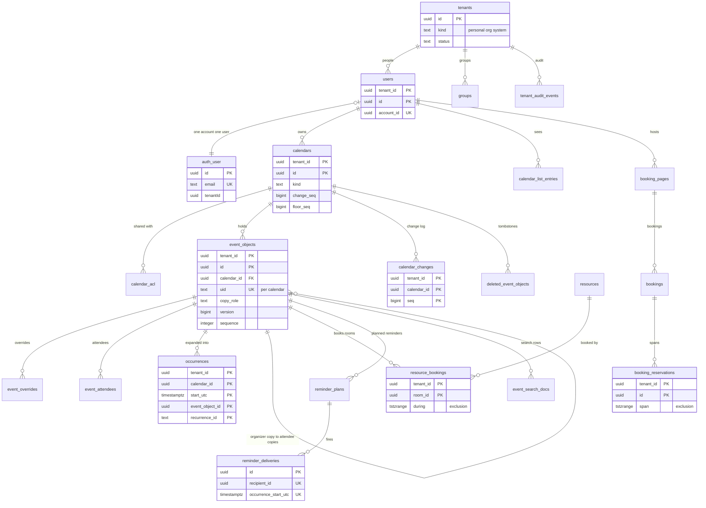

# Data model: Google Calendar

データモデルの正本。表・列・キー・索引・パーティション・保持と、DB の外のストア（Valkey、S3、SNS・SQS、Webhook、CalDAV、同期のトークン、Web Push、iTIP のメッセージ、IndexedDB）の形を、ここと [data-model/](data-model/) にまとめる。

- **形（表・列・キー・索引）はこの文書と `data-model/` を正とする。** 振る舞い（いつ書くか、誰が読めるか、判定の規則）は、各領域の文書と ADR を正とする。両者が食い違ったら、実装を止めて Dev（テックリード）に確かめる。
- 領域の文書の「data-model への項目」の節は、提案の記録として残す。新しい表・列は、この文書と `data-model/` に先に足す。
- マイグレーションは開発リポジトリで手で書く（PostgreSQL 18、`pg_partman`・`btree_gist`・`pg_bigm`）。この文書の列の表が、その設計である。マイグレーションとこの文書を同じ PR で直す。

## 1. 文書の構成

| ファイル | 内容 | 表の数 | ER 図 |
| --- | --- | --- | --- |
| この文書 | 規約、全体の ER 図、表の索引、RLS の外の表と DB のロール、横断の不変条件、決めたこと | — | 1 |
| [data-model/tenants-accounts-and-orgs.md](data-model/tenants-accounts-and-orgs.md) | テナント、アカウント（`auth`）、利用者、利用者の設定、グループ、ディレクトリ、ドメイン、SSO、SCIM、組織の設定、管理の役割、閲覧の許可、テナントの移り、S2 のディレクトリ | 22 | 2 |
| [data-model/calendars-and-acl.md](data-model/calendars-and-acl.md) | カレンダー、ACL、組織の共有の方針、カレンダーの一覧の項目 | 4 | 1 |
| [data-model/events-and-recurrence.md](data-model/events-and-recurrence.md) | 予定オブジェクト（マスター）、上書き、参加者、展開の索引。時刻の列と iCalendar の往復 | 4 | 1（＋概念図 1） |
| [data-model/time-zones.md](data-model/time-zones.md) | ゾーンの使用の記録、tzdb の再計算の記録、`packages/tzdata`・`packages/holidays-jp` の形 | 2 | 1 |
| [data-model/scheduling-and-itip.md](data-model/scheduling-and-itip.md) | 保留の招待、重複の除去、グループの変化、iMIP の受け口、送信の上限と抑止、未確認の返事、取り込みの方針、評判、配送と iMIP の記録 | 15 | 2 |
| [data-model/free-busy-and-rooms.md](data-model/free-busy-and-rooms.md) | 勤務の時間、`freebusy_for`、建物、会議室、設備、会議室の方針、会議室の予約の行 | 7 | 1 |
| [data-model/booking-pages.md](data-model/booking-pages.md) | 予約ページ、受け付けの時間、日付の上書き、質問、予約、予約の区間、冪等、slug と管理のリンクの解決 | 9 | 1 |
| [data-model/sync-caldav-and-ics.md](data-model/sync-caldav-and-ics.md) | outbox、変更のログ、削除の墓標、CalDAV の名前、ICS の購読・公開・取り込み・書き出し、トークンの使用の集計、取得の予定 | 11 | 1 |
| [data-model/api-and-push.md](data-model/api-and-push.md) | 冪等、OAuth のアプリ・認可・トークン、トークンの解決、Webhook の経路と送りの記録 | 8 | 1 |
| [data-model/reminders-and-notifications.md](data-model/reminders-and-notifications.md) | 計画の行、頭のバージョン、シャードの借り、送信の記録、既定のリマインダーの購読、画面の通知、Web Push の購読、通知の設定、メールの抑止 | 9 | 1 |
| [data-model/search.md](data-model/search.md) | 検索の表 | 1 | 1 |
| [data-model/security-and-audit.md](data-model/security-and-audit.md) | テナントの監査、プラットフォームの監査、保持の表、法的な保全、全体の状態、照合の結果 | 7 | 1 |
| [data-model/stores.md](data-model/stores.md) | Valkey、S3、SNS・SQS とメッセージ、Webhook、CalDAV のリソースと ETag、同期のトークン、Web Push、iTIP のメッセージ、IndexedDB、AppConfig、データのパッケージ | — | 1 |

合計 99 表（`auth` の 6 表、`ops` の 26 表、S2 のディレクトリの 2 表を含む）。ER 図は全体図 1 つと、領域ごとの図 15 個の計 16 個。ほかに、繰り返しの予定が行になるまでの概念図 1 つ（[data-model/events-and-recurrence.md](data-model/events-and-recurrence.md) の 1 節）。

## 2. 規約

### 2.1 使うストア

| ストア | 役割 | 正本か | 失ったとき |
| --- | --- | --- | --- |
| Aurora PostgreSQL 18（東京の主。大阪は Global Database の二次） | 予定オブジェクト、展開の索引、会議室・予約の区間、変更のログ、outbox、ACL、リマインダーの計画と記録、監査、`auth`・`ops` のスキーマ | 唯一の正本 | バックアップ・PITR・大阪への昇格（[infrastructure.md](infrastructure.md) の 6 節） |
| Aurora（ディレクトリのクラスタ。S2 から） | `tenant_directory`、`account_directory`、`imip_address_directory` | 正本 | 同上（[ADR-0045](../decisions/0045-stage-up-criteria-tenant-sharding-and-cells.md)） |
| Valkey（ElastiCache） | 合図の pub/sub、空き時間のキャッシュ、レート制限、書き込みの枠、Webhook の待ち、資格の写し、取り消しの一覧、失敗の数 | 正本ではない | 正しさは保たれる。遅くなるだけ（[data-model/stores.md](data-model/stores.md) の 1 節） |
| S3 | iMIP の生のメール、ICS の取り込み・書き出し・購読の本文、大きな iTIP の本文、保留の招待の本文、Web の資産、tzdata、監査ログの写し | 生のメールと ICS のファイルは正本（期限つき）。他は写し | バージョニングと大阪への複製（資産・tzdata） |
| SNS・SQS | outbox から Worker へのきっかけ | 正本ではない | outbox と各表から送り直す |
| AppConfig・CloudFront KeyValueStore | フラグ、`tzdata.active_version`、Web のバージョンの割合 | フラグの正本 | Terraform から作り直す |
| 端末の IndexedDB（`cal-<account_id>`） | 前後 4 週の予定オブジェクト、トークン、ゾーンのデータ | 捨ててよい写し（書き込みを持たない） | 取り直す（[ADR-0039](../decisions/0039-offline-read-cache-and-local-data.md)） |

### 2.2 ID

- **ID はすべて UUIDv7**（[ADR-0004](../decisions/0004-tenancy-and-rls.md)）。サーバーが振る。PostgreSQL 18 の `uuidv7()` を既定値にしてよい。
- **例外**：

  | 値 | 型 | 振り方 |
  | --- | --- | --- |
  | `outbox.id` | `bigint`（`GENERATED ALWAYS AS IDENTITY`） | Relay が `ORDER BY id` で読む |
  | `calendar_changes.seq`、`calendars.change_seq`・`floor_seq`・`booking_seq`、`resources.booking_seq` | `bigint` | カレンダー・会議室の行のロックの中で 1 ずつ（[ADR-0005](../decisions/0005-change-log-and-sync-tokens.md)） |
  | `event_objects.version`・`sequence`・`organizer_version` | `bigint`・`integer`・`bigint` | 予定オブジェクトの書き込みで（2.6 節） |
  | `push_channels.last_message_number` | `bigint` | 経路の行のロックの中で 1 ずつ（[ADR-0028](../decisions/0028-push-channels-signed-webhooks.md)） |
  | `group_membership_changes.seq` | `bigint`（IDENTITY） | 書いた順 |
  | `reminder_shard_leases.shard` | `smallint` | 0〜255 |
  | `retention_policies.data_kind` | `text` | 名前（`calendar_changes` など） |
  | `ops.principal_directory.email_norm`、`*_directory` の鍵 | `text`・`bytea` | 正規化したメールアドレス、トークンのハッシュ、`slug` |

- **iCalendar の UID**：本システムが作る予定は `<UUIDv7>@<brand>.<domain>`。外から来た UID は 255 バイトまでそのまま持つ（[events-and-recurrence.md](events-and-recurrence.md) の 3.1 節）。
- **回の識別子**：`(event_object_id, recurrence_id)`。`recurrence_id` は `text` で、回の元の開始の壁時計の時刻を、`zoned`・`floating` は `YYYYMMDDTHHMMSS`、`date` は `YYYYMMDD`、`utc` は `YYYYMMDDTHHMMSSZ` で持つ。TZID はマスターの `start_tzid` と同じなので含めない（[ADR-0003](../decisions/0003-recurrence-storage-and-expansion.md)、[api-and-push.md](api-and-push.md) の 4.4 節）。系列の全体を指すときは空の文字列 `''` にする（NULL にしない。主キーに入れるため。7 節の D-2）。
- **外に見せる ID**：予定の `id` は `event_objects.id`、回の `id` は `<event_object_id>_<recurrence_id>`。`redact()` が `BUSY` にした予定は、見る人ごとの不透明な ID（`HMAC(key, viewer_id ‖ event_object_id)`）だけを出す（[ADR-0021](../decisions/0021-effective-role-and-redact-table.md)）。
- **接頭辞つきの秘密**：`<brand>_ap_`（アプリ用のパスワード）、`<brand>_oat_`・`<brand>_ort_`・`<brand>_ocs_`（OAuth）、`<brand>_scim_`、`<brand>_whsec_`（[accounts-and-orgs.md](accounts-and-orgs.md) の 9 節）。

### 2.3 テナンシーと FORCE RLS

テナントの表（`tenant_id` を持つ表）は、次の形にそろえる（[ADR-0004](../decisions/0004-tenancy-and-rls.md)）。

```sql
CREATE TABLE <t> (
  tenant_id uuid NOT NULL,
  id        uuid NOT NULL DEFAULT uuidv7(),
  ...
  PRIMARY KEY (tenant_id, id),
  FOREIGN KEY (tenant_id, <ref>_id) REFERENCES <parent> (tenant_id, id)
);
ALTER TABLE <t> ENABLE ROW LEVEL SECURITY;
ALTER TABLE <t> FORCE ROW LEVEL SECURITY;
CREATE POLICY tenant_isolation ON <t>
  USING      (tenant_id = current_setting('app.tenant_id')::uuid)
  WITH CHECK (tenant_id = current_setting('app.tenant_id')::uuid);
```

- 主キー・外部キー・索引の先頭は `tenant_id`。別のテナントの行を指す外部キーは張れない。テナントをまたぐ参照（参加者の写しの主催者、共有されたカレンダーの一覧の項目）は、`<名前>_tenant_id` と ID の組の論理の参照にする。
- DB のトランザクションごとに `SET LOCAL app.tenant_id`。`current_setting` は `missing_ok` なしで呼ぶ（設定を忘れたらエラー）。
- `tenants` は RLS の外（`ops`）の根の表で、テナントの表の `tenant_id` は外部キーを張らない論理の参照にする（`ops` への外部キーは RLS の外の表への依存を作るため）。
- 外部キーは `NO ACTION`。親を消す処理は `packages/writer` か `lifecycle` のジョブが子から順に行う（例外は各表に書いた `ON DELETE CASCADE`）。
- マイグレーションの CI は、新しい表に `tenant_id`・FORCE RLS・ポリシーがあるか、RLS の外の表が 5 節の一覧と一致するかを確かめる。一覧の正本は [ADR-0004](../decisions/0004-tenancy-and-rls.md) で、5 節はその置き場所の写しである。

### 2.4 時刻の列

[ADR-0002](../decisions/0002-time-representation.md) の 4 つの種類を、次の列で持つ。予定オブジェクト（マスター）と上書きで同じ形にする。

| 列 | 型 | `zoned` | `utc` | `floating` | `date` |
| --- | --- | --- | --- | --- | --- |
| `time_kind` | `text` | `zoned` | `utc` | `floating` | `date` |
| `start_local`・`end_local` | `timestamp(0)`（タイムゾーンなし） | 正本 | NULL | 正本 | NULL |
| `start_tzid`・`end_tzid` | `text` | 正本（IANA の正規の名前。開始と終了で違ってよい） | `'UTC'` | NULL | NULL |
| `start_date`・`end_date` | `date` | NULL | NULL | NULL | 正本（`end_date` は含まない） |
| `start_utc`・`end_utc` | `timestamptz` | 派生 | 正本 | 派生（持ち主のカレンダーのタイムゾーン） | 派生（同上、日の境） |
| `tzdata_version` | `text` | 派生を計算したバージョン | NULL | 同左 | 同左 |

```sql
CHECK (
  (time_kind = 'zoned'    AND start_local IS NOT NULL AND start_tzid IS NOT NULL AND end_local IS NOT NULL
                          AND end_tzid IS NOT NULL AND start_date IS NULL AND tzdata_version IS NOT NULL) OR
  (time_kind = 'utc'      AND start_local IS NULL AND start_tzid = 'UTC' AND end_tzid = 'UTC'
                          AND start_date IS NULL AND tzdata_version IS NULL) OR
  (time_kind = 'floating' AND start_local IS NOT NULL AND end_local IS NOT NULL AND start_tzid IS NULL
                          AND start_date IS NULL AND tzdata_version IS NOT NULL) OR
  (time_kind = 'date'     AND start_date IS NOT NULL AND end_date > start_date AND start_local IS NULL
                          AND start_tzid IS NULL AND tzdata_version IS NOT NULL)
) AND start_utc IS NOT NULL AND end_utc >= start_utc
```

- `timestamp`（タイムゾーンなし）は、壁時計の時刻を値として持つためだけに使う。PostgreSQL の `AT TIME ZONE`・`timezone` の設定で変換しない（題材の `AGENTS.md`）。派生の値は `packages/tz` の `resolve()` で作って書く。
- `tzdata_version` は `packages/tzdata` のバージョンの名前（`2026b-1`。[time-zones-and-holidays.md](time-zones-and-holidays.md) の 4.1 節）。バージョンの違う派生の値を比べない。例外は会議室の予約の行と予約の区間の「切り替えの窓」だけ（[ADR-0012](../decisions/0012-tzdb-update-recompute-and-propagation.md)）。
- 時刻を持つ他の表（展開の索引、会議室の予約の行、検索の表、リマインダーの計画）は、派生の UTC と `tzdata_version` を写して持つ。どれも予定オブジェクトから作り直せる。
- 予定でない時刻（作った時刻、期限など）は `timestamptz`（UTC）。名前は `<過去分詞>_at`、日付は `_on`・`_day`（パーティションの鍵）。
- 壁時計の時刻の範囲（勤務の時間、予約ページの受け付けの時間）は `time` と IANA の TZID の組で持つ。

### 2.5 iCalendar の往復

保存の単位は予定オブジェクト（UID）である（[ADR-0003](../decisions/0003-recurrence-storage-and-expansion.md)）。列に持つプロパティと、原文のまま持つプロパティを分ける（[ADR-0007](../decisions/0007-interop-standards-scope.md)）。

| iCalendar | 置き場所 | 書き出し |
| --- | --- | --- |
| `UID` | `event_objects.uid` | そのまま |
| `DTSTART`・`DTEND`・`DURATION` | 2.4 節の列と `duration_kind`・`duration_exact_s`・`duration_nominal` | 受けた形（DTEND か DURATION）で返す |
| `RRULE` | `rrule`（正規化した文字列）と `rrule_json` | `rrule` |
| `RDATE`・`EXDATE`（`EXRULE` は展開して `exdates`） | `rdates`・`exdates`（`recurrence_id` の形の配列。RDATE の PERIOD は `<recurrence_id>/<ISO 8601 の長さ>`） | 配列から作る。`EXRULE` は出さない |
| `RECURRENCE-ID` | `event_overrides.recurrence_id`（マスターの TZID の壁時計に直した値） | マスターの TZID で出す |
| `SUMMARY`・`LOCATION`・`DESCRIPTION` | `title`・`location`・`description` | そのまま |
| `STATUS`・`TRANSP`・`CLASS` | `status`・`transparency`・`visibility` | `CLASS` は `visibility` から（`default` は出さない） |
| `SEQUENCE`・`DTSTAMP` | `sequence`・`dtstamp` | 主催者の写しの値 |
| `CREATED`・`LAST-MODIFIED` | `created_at`・`updated_at` | そのまま |
| `ORGANIZER` | 主催者の写しはカレンダーの持ち主。参加者の写しは `organizer_*` の列 | iMIP の受け口のアドレス（[ADR-0015](../decisions/0015-imip-addressing-and-trust.md)） |
| `ATTENDEE` とその引数 | `event_attendees` の行 | 行から作る |
| `COLOR`・`X-<BRAND>-COLOR` | `color` | 両方 |
| `ATTACH`（URL） | `attachments`（`jsonb`、25 件） | 中身のファイルは持たない（URL だけ） |
| 会議の URL | `conference_url` | `X-<BRAND>-CONFERENCE` と `DESCRIPTION` の末尾 |
| `VALARM` | 自分の写しの `reminders`（`jsonb`）。取り込み・iMIP の VALARM は使わない（[reminders-and-notifications.md](reminders-and-notifications.md) の 4.1 節） | 持ち主の `reminders` から作る |
| `RELATED-TO` | `related_to`（`split_from` と組で） | そのまま |
| `X-<BRAND>-EVENT-TYPE` | `event_type` | `default` 以外で出す |
| `VTIMEZONE` | 持たない。知っている TZID は本システムの tzdb で解く（[ADR-0013](../decisions/0013-external-timezone-definitions.md)） | 本システムの tzdb から作る |
| `PRODID`・`METHOD`・`VERSION`・`CALSCALE` | 持たない | `-//<Brand>//Calendar//JA` ほか |
| 知らないプロパティと引数（`CATEGORIES`・`PRIORITY`・`GEO`・`RESOURCES`・`COMMENT`・他社の `X-` など）、`X-<BRAND>-ORIGINAL-RRULE`・`X-<BRAND>-ORIGINAL-TZID`・`X-<BRAND>-BOOKING-ID` | `x_props`（`jsonb`。`[{"c":"<構成要素>","l":"<折り返しを戻した 1 行>"}]`、32 KiB まで） | 原文の行を戻す。API には出さない |

- `x_props` に、本システムが列で持つプロパティを入れない（書き込みで取り除く）。秘密を含みうるので、検索の表に入れない（[search.md](search.md) の 4.1 節）。
- 往復の性質（任意の VEVENT の書き込みと読み出しで、列のプロパティは正規の形で、`x_props` は原文で戻る）を、`packages/ical` の性質ベーステストで確かめる。

### 2.6 バージョンと `change_seq`

| 値 | 持つ場所 | 上がるとき | 使う所 |
| --- | --- | --- | --- |
| `event_objects.version` | 予定オブジェクト | マスター・上書き・参加者・自分の項目のどれかが変わるたび（1 ずつ） | ETag、`calendar_changes.object_version`、検索の表のバージョン、リマインダーの `plan_version` |
| `event_objects.sequence` | 予定オブジェクト | `SEQUENCE` を上げる変更（[ADR-0014](../decisions/0014-itip-state-transfer-and-sequence.md) の一覧）。DR の後の余白（`seq_margin_epoch`） | iTIP・iMIP |
| `event_objects.organizer_version` | 参加者の写し | 主催者の写しの新しいバージョンを当てたとき（主催者の写しの `version` の値を写す） | 内部の新旧の判定 `(sequence, organizer_version)`、`Schedule-Tag` |
| `occurrences.object_version` | 展開の索引の行 | その行が変わった時の予定オブジェクトのバージョン（[ADR-0010](../decisions/0010-occurrence-index-maintenance.md)） | 調査だけ。照合はバージョンでなく、その場の `expand()` との比べ |
| `calendars.change_seq` | カレンダー | 予定・カレンダーの属性・ACL の変更ごと（書き込みのトランザクションの最初に行をロック） | 同期のトークン、CTag、空き時間のキャッシュ |
| `calendars.floor_seq` | カレンダー | 変更のログの分割を落とす前、テナントの移り（7 節の D-11） | 410 の判定 |
| `calendars.booking_seq`・`resources.booking_seq` | 予約ページの持ち主の主のカレンダー、会議室 | 予約の区間・会議室の予約の行の変更ごと | 枠と空き時間のキャッシュの鍵 |
| `platform_state.sync_epoch` | 全体で 1 つ | DR の切り替え、時点への復元 | 同期のトークンの `epoch` |
| `org_sharing_policies.policy_version` | 組織 | 共有の方針の変更 | `view_hash` |
| `users.calendar_list_seq` | 利用者 | カレンダーの一覧の項目の変更 | カレンダーの一覧の同期のトークン |

- `change_seq` を振る書き込みは `packages/writer` だけで、`calendar_changes` と outbox を同じトランザクションで書く。`packages/writer` を通らない直接の `UPDATE`（`event_objects`・`event_overrides`・`event_attendees`・`calendars`・`calendar_acl`・`calendar_changes`）は、DB のロールの権限で拒む（[ADR-0005](../decisions/0005-change-log-and-sync-tokens.md)）。`packages/writer` だけが使う書き込みのロールと読み出しのロールの分け方は、E1 の `writer-skeleton` で決める（8 節）。

### 2.7 パーティション

| 表 | 分割 | 単位 | 落とす時期 | 一意の守り方 |
| --- | --- | --- | --- | --- |
| `occurrences` | `RANGE (start_utc)` | 1 か月 | 終わりが 31 日より前の月 | `(tenant_id, event_object_id, recurrence_id)` は DB で強制しない。カレンダーのロックの中の差分の書き込みと、毎時の照合で守る（D-3） |
| `calendar_changes` | `RANGE (committed_on)` | 1 日 | 30 日（`floor_seq` を上げてから） | `seq` はカレンダーの行のロックで振る（I-4） |
| `push_deliveries` | `RANGE (created_on)` | 1 日 | 7 日 | 番号は経路の行のロックで振る |
| `reminder_plans` | `RANGE (fire_day)` | 1 日 | 3 日後 | — |
| `reminder_deliveries` | `RANGE (occurrence_on)`（回の開始の UTC の日） | 1 日 | 35 日 | 一意の鍵に `occurrence_on` を含めるが、`occurrence_on` は鍵の `occurrence_start_utc` から決まるので、日をまたぐ重複も捨てられる（D-6） |
| `itip_deliveries` | `RANGE (created_on)`（`msg_id` の UUIDv7 の日） | 1 日 | 14 日 | `created_on` は `msg_id` から決まる（D-6 と同じ考え） |
| `imip_outbound_log`・`imip_inbound_log` | `RANGE (created_on)` | 1 日 | 90 日・30 日 | — |
| `sync_token_uses` | `RANGE (day)` | 1 日 | 90 日 | 主キー |
| `notifications` | `RANGE (created_on)` | 1 日 | 30 日 | `id`（UUIDv7）から `created_on` が決まる |
| `tenant_audit_events` | `RANGE (at)` | 1 か月 | 1 年 | — |
| `platform_audit_events` | `RANGE (at)` | 1 か月 | 1 年（log-archive に写した後） | — |
| `reconciliation_findings` | `RANGE (found_at)` | 1 か月 | 90 日 | — |
| `event_search_docs` | `HASH (tenant_id)` | 16 | — | 主キー |

- 作成と削除は `pg_partman`（`lifecycle` のジョブ、1 日 1 回）。7 日先まで作る。落とす前に `legal_holds` のテナントの行を `legal_hold_rows` に写す（[ADR-0042](../decisions/0042-audit-log-and-data-lifecycle.md)）。
- **排他の制約を持つ表（`resource_bookings`・`booking_reservations`）は分割しない。** 分割した表の排他の制約は分割の鍵の等号を含む必要があり、時刻の区間では作れない。過去の行は毎日のジョブで消す（D-5）。
- S2 で行の多い表（`event_objects`・`event_attendees`）は、テナントのクラスタへの分け方で小さくする（[ADR-0045](../decisions/0045-stage-up-criteria-tenant-sharding-and-cells.md)）。表の中の分割は持ち越し（8 節）。

### 2.8 削除と保持

| 形 | 使う表 | 規則 |
| --- | --- | --- |
| **ごみ箱** | `event_objects`（`trashed_at`、30 日） | 消した予定は `trashed_at` を立て、`deleted_event_objects` に墓標を書き、`calendar_changes` に `delete` を載せる。30 日後に `lifecycle` が `packages/writer` で行と上書き・参加者を消す。戻すと墓標を消して `upsert` を載せる（D-13） |
| **状態で残す** | 参加者の写しの `copy_state = cancelled`（30 日）、`booking_reservations.status = released`、`bookings.status`、`ics_subscriptions.state = disabled` | 記録として残し、期限で消す |
| **物理削除** | 設定の表、資格の表、`caldav_hrefs` | 消すと同時に消す。資格は `revoked_at` を立ててから期限で消す |
| **時間で消す** | 2.7 節の分割の表、期限の列を持つ表（`*_idempotency`、`itip_dedupe`、`pending_invitations`、`unverified_replies`、`deleted_event_objects`） | 分割を落とすか、1 日 1 回の削除のジョブ |
| **テナントの削除** | すべてのテナントの表 | `tenant-purge` が `tenant_id` で 1 万行ずつ消す（[ADR-0042](../decisions/0042-audit-log-and-data-lifecycle.md)）。表の一覧はマイグレーションの CI の一覧と同じ定義から得る |

- 期間の正本は `retention_policies` と [ADR-0042](../decisions/0042-audit-log-and-data-lifecycle.md) の表。値はどれも**法務の L5 の確認待ち**で、各表の「保持」の欄は既定の値である。新しい表・S3 の接頭辞を足すときは、`retention_policies` と `tenant-purge` の一覧に足す。

### 2.9 命名

- 表は複数形の snake_case。`auth` の Better Auth の表は既定の名前（単数、列は camelCase。[ADR-0035](../decisions/0035-accounts-auth-library-and-credentials.md)）。
- 外部キーの列は `<参照先の単数>_id`。役割が要るときは役割の名前（`host_user_id`、`room_id`、`granted_by`）。テナントをまたぐ参照は `<役割>_tenant_id` と組にする。
- 列挙は `text` ＋ `CHECK (x IN (...))`。PostgreSQL の `ENUM` は使わない（値の追加をマイグレーションの互換の変更にするため）。
- 真偽は肯定の名前（`holidays_off`、`email_verification`）。`is_` は検索の表の `is_private` だけ（ADR-0034 の名前）。
- ハッシュは `<名前>_hash`（SHA-256、`bytea`）、暗号文は `<名前>_ciphertext`（`bytea`）。
- 本家の製品の名前を識別子・既定値・鍵に使わない。`<Brand>`・`<brand>` で書く（[リポジトリ共通の ADR-0006](../../../../docs/decisions/0006-brand-neutral-identifiers.md)）。

### 2.10 秘密と暗号化

| 種類 | 列 | 表 |
| --- | --- | --- |
| 照らすだけの秘密（120 ビット以上の乱数） | `*_hash`（SHA-256） | `app_passwords.secret_hash`、`oauth_tokens.token_hash`、`oauth_apps.client_secret_hash`、`scim_tokens.token_hash`、`ics_publish_tokens.token_hash`、`imip_addresses.token_hash`、`bookings.manage_token_hash`、`bookings.verification_code_hash`、`api_idempotency.principal_hash`（主体の識別） |
| 平文が要る秘密 | `*_ciphertext`（封筒の暗号化、`app-secrets` の鍵、暗号化のコンテキストに表と列の名前） | `push_channels.secret_ciphertext`、`imip_addresses.token_ciphertext`、`ics_subscriptions.url_ciphertext`、`sso_connections.oidc_client_secret_ciphertext`、`push_subscriptions.endpoint_ciphertext`・`auth_ciphertext`、`api_idempotency.response_ciphertext` |
| 個人の情報の暗号文（予約者） | `*_ciphertext` | `bookings.booker_name_ciphertext`・`booker_email_ciphertext`・`answers_ciphertext`（[booking-pages.md](booking-pages.md) の 16 節の提案のとおり。鍵は `app-secrets`、暗号化のコンテキスト `booking-pii`。[ADR-0041](../decisions/0041-encryption-keys-and-secret-storage.md)） |
| 保存時の暗号化 | `aurora-data` ほか（[ADR-0041](../decisions/0041-encryption-keys-and-secret-storage.md) の表） | 全部 |

- 予定の項目（タイトル、場所、説明、参加者）はアプリの層で暗号化しない（ADR-0041）。
- マイグレーションの CI で、`secret`・`token`・`password` を含む名前の列が上のどちらかであることを確かめる。例外の許可リスト：`org_domains.token`（DNS に公開する確認の値）、`push_channels.token`（受け手が決める値。送るたびに返す）、`resources.address_token`（会議室のメールアドレスの一部）、`app_passwords.secret_last4`・`scim_tokens.token_last4`（末尾 4 文字）、`auth.session.token`（8 節の持ち越し）。
- ログ・トレース・メトリクスに、予定の中身、メールアドレス、秘密、ICS の秘密のアドレスの経路を出さない（[observability.md](observability.md) の 2 節）。

### 2.11 S1 の規模の前提

各表の「S1 の量」は、次の前提からの見積もりである。E2・E12 の計測で置き換える。

| 項目 | 値 | 出典 |
| --- | --- | --- |
| テナント | 組織 3,000、個人 30 万 | [README.md](README.md) の 2 節 |
| 利用者（`users` の行） | 約 75 万（月間 60 万 × 1.25。停止を含む） | 行の数は仮定 |
| 予定オブジェクト | 3 億（1 人 500。参加者の写しを含む）、1 行 約 2.5 KB | 同上、[capacity.md](capacity.md) の 5.1 節 |
| 展開の索引 | 4 億行、1 行 約 200 B | 同上 |
| 参加者の行 | 12 億行、1 行 約 150 B | [capacity.md](capacity.md) の 5.1 節 |
| `calendar_changes` | 1 日 約 1.6 億行 | 同上 |
| `itip_deliveries` | 1 日 約 1.3 億行 | 同上 |
| リマインダー | 計画 約 2,100 万行（7 日）、瞬間 約 12 万件 | [reminders-and-notifications.md](reminders-and-notifications.md) の 5.2 節、[capacity.md](capacity.md) の 3 節 |

### 2.12 クラスタ

| 段階 | 置き方 |
| --- | --- |
| S1 | Aurora の 1 クラスタ（writer 1、reader 2）。全テナントの表と `auth`・`ops` のスキーマを同じクラスタに置く |
| S2 | テナントを単位に複数のクラスタへ分ける。テナントの表と、そのテナントの `ops` の行（`reminder_plans` など、`tenant_id` を持つもの）はテナントのクラスタへ。`auth` スキーマと `tenant_directory`・`account_directory`・`imip_address_directory` は小さなディレクトリのクラスタへ（[ADR-0045](../decisions/0045-stage-up-criteria-tenant-sharding-and-cells.md)、[data-model/tenants-accounts-and-orgs.md](data-model/tenants-accounts-and-orgs.md) の 7 節）。`principal_directory` は `account_directory` に置き換える |
| S3 | テナントをセルとリージョンに固定する。ディレクトリだけを全体で持つ |

## 3. 全体の ER 図

主な実体と関係だけを示す。列と細かい関係は、領域ごとの図にある。



- 実体の属性は、図を読むのに要るものだけ。`auth_user` は `auth.user`、`tenants`・`reminder_plans`・`reminder_deliveries` は `ops` のスキーマ。
- `event_objects ||--o{ event_objects` は、参加者の写しが主催者の写しを `organizer_tenant_id`・`organizer_event_object_id` で指す論理の参照（テナントをまたぐので外部キーを張らない）。

## 4. 表の索引

「テナント」の欄：「内」はテナントの表（FORCE RLS）、「外」は RLS の外（5 節）。

| 表 | テナント | ファイル | 振る舞いの文書 |
| --- | --- | --- | --- |
| `tenants` | 外（`ops`） | [tenants-accounts-and-orgs](data-model/tenants-accounts-and-orgs.md) | [accounts-and-orgs.md](accounts-and-orgs.md) の 4 節 |
| `auth.user`・`auth.session`・`auth.account`・`auth.verification`・`auth.passkey` | 外（`auth`） | [tenants-accounts-and-orgs](data-model/tenants-accounts-and-orgs.md) | 同 4・5 節、ADR-0035 |
| `auth.app_passwords` | 外（`auth`） | [tenants-accounts-and-orgs](data-model/tenants-accounts-and-orgs.md) | 同 9 節 |
| `users` | 内 | [tenants-accounts-and-orgs](data-model/tenants-accounts-and-orgs.md) | 同 4・15 節 |
| `user_preferences` | 内 | [tenants-accounts-and-orgs](data-model/tenants-accounts-and-orgs.md) | [clients.md](clients.md) の 6・8 節 |
| `groups`・`group_members` | 内 | [tenants-accounts-and-orgs](data-model/tenants-accounts-and-orgs.md) | [accounts-and-orgs.md](accounts-and-orgs.md) の 11 節 |
| `principal_directory` | 外（`ops`） | [tenants-accounts-and-orgs](data-model/tenants-accounts-and-orgs.md) | 同 4・11 節 |
| `org_domains` | 内 | [tenants-accounts-and-orgs](data-model/tenants-accounts-and-orgs.md) | 同 6.2 節 |
| `sso_connections` | 内 | [tenants-accounts-and-orgs](data-model/tenants-accounts-and-orgs.md) | 同 8 節 |
| `scim_tokens` | 内 | [tenants-accounts-and-orgs](data-model/tenants-accounts-and-orgs.md) | 同 12 節 |
| `org_settings` | 内 | [tenants-accounts-and-orgs](data-model/tenants-accounts-and-orgs.md) | 同 10 節 |
| `admin_role_assignments` | 内 | [tenants-accounts-and-orgs](data-model/tenants-accounts-and-orgs.md) | 同 13 節 |
| `admin_access_grants` | 内 | [tenants-accounts-and-orgs](data-model/tenants-accounts-and-orgs.md) | 同 14 節、ADR-0037 |
| `tenant_moves` | 内（行き先の組織） | [tenants-accounts-and-orgs](data-model/tenants-accounts-and-orgs.md) | 同 7 節 |
| `moved_event_objects` | 外（`ops`） | [tenants-accounts-and-orgs](data-model/tenants-accounts-and-orgs.md) | 同 7.1 節 |
| `tenant_directory`・`account_directory` | 外（S2 のディレクトリ） | [tenants-accounts-and-orgs](data-model/tenants-accounts-and-orgs.md) | [infrastructure.md](infrastructure.md) の 11.1 節 |
| `calendars` | 内 | [calendars-and-acl](data-model/calendars-and-acl.md) | [sharing-and-acl.md](sharing-and-acl.md) の 4.1 節、[sync-and-caldav.md](sync-and-caldav.md) の 4.1 節 |
| `calendar_acl` | 内 | [calendars-and-acl](data-model/calendars-and-acl.md) | [sharing-and-acl.md](sharing-and-acl.md) の 4.2 節 |
| `org_sharing_policies` | 内 | [calendars-and-acl](data-model/calendars-and-acl.md) | 同 4.4 節 |
| `calendar_list_entries` | 内（見る人） | [calendars-and-acl](data-model/calendars-and-acl.md) | [api-and-push.md](api-and-push.md) の 4.2・4.6 節、[reminders-and-notifications.md](reminders-and-notifications.md) の 4.1 節 |
| `event_objects` | 内 | [events-and-recurrence](data-model/events-and-recurrence.md) | [events-and-recurrence.md](events-and-recurrence.md) の 3.1 節、[invitations-and-itip.md](invitations-and-itip.md) の 4.2 節 |
| `event_overrides` | 内 | [events-and-recurrence](data-model/events-and-recurrence.md) | [events-and-recurrence.md](events-and-recurrence.md) の 3.1・7 節 |
| `event_attendees` | 内 | [events-and-recurrence](data-model/events-and-recurrence.md) | [invitations-and-itip.md](invitations-and-itip.md) の 4.1 節 |
| `occurrences` | 内（写し） | [events-and-recurrence](data-model/events-and-recurrence.md) | [events-and-recurrence.md](events-and-recurrence.md) の 9 節、ADR-0010 |
| `tenant_tz_usage` | 外（`ops`） | [time-zones](data-model/time-zones.md) | [time-zones-and-holidays.md](time-zones-and-holidays.md) の 7.3 節 |
| `tz_recompute_runs` | 外（`ops`） | [time-zones](data-model/time-zones.md) | 同 6.3 節 |
| `pending_invitations` | 内 | [scheduling-and-itip](data-model/scheduling-and-itip.md) | [invitations-and-itip.md](invitations-and-itip.md) の 4.3 節 |
| `itip_dedupe` | 内 | [scheduling-and-itip](data-model/scheduling-and-itip.md) | 同 5 節 |
| `group_membership_changes` | 内 | [scheduling-and-itip](data-model/scheduling-and-itip.md) | 同 10.2 節 |
| `imip_addresses` | 内 | [scheduling-and-itip](data-model/scheduling-and-itip.md) | 同 11.1 節 |
| `imip_address_directory` | 外（`ops`。S2 はディレクトリ） | [scheduling-and-itip](data-model/scheduling-and-itip.md) | 同 11.1 節 |
| `imip_send_quota` | 内 | [scheduling-and-itip](data-model/scheduling-and-itip.md) | 同 11.2 節 |
| `imip_suppression` | 内 | [scheduling-and-itip](data-model/scheduling-and-itip.md) | 同 11.2 節 |
| `unverified_replies` | 内 | [scheduling-and-itip](data-model/scheduling-and-itip.md) | 同 11.4 節 |
| `invite_intake_settings`・`invite_known_senders` | 内 | [scheduling-and-itip](data-model/scheduling-and-itip.md) | 同 11.5 節 |
| `sender_reputation` | 内 | [scheduling-and-itip](data-model/scheduling-and-itip.md) | [security.md](security.md) の 3.1 節 |
| `itip_deliveries`・`itip_fanout_progress` | 外（`ops`） | [scheduling-and-itip](data-model/scheduling-and-itip.md) | [observability.md](observability.md) の 5.3 節、ADR-0046 |
| `imip_outbound_log`・`imip_inbound_log` | 外（`ops`） | [scheduling-and-itip](data-model/scheduling-and-itip.md) | 同上、[invitations-and-itip.md](invitations-and-itip.md) の 11.2・11.3 節 |
| `working_hours` | 内 | [free-busy-and-rooms](data-model/free-busy-and-rooms.md) | [free-busy-and-scheduling.md](free-busy-and-scheduling.md) の 6.3 節 |
| `buildings`・`resources`・`resource_features`・`resource_feature_instances`・`resource_policies` | 内（組織だけ） | [free-busy-and-rooms](data-model/free-busy-and-rooms.md) | [rooms-and-resources.md](rooms-and-resources.md) の 4.1 節 |
| `resource_bookings` | 内（組織だけ） | [free-busy-and-rooms](data-model/free-busy-and-rooms.md) | 同 4.2・6〜8 節、ADR-0019・0020 |
| `booking_pages`・`booking_availability`・`booking_date_overrides`・`booking_questions` | 内 | [booking-pages](data-model/booking-pages.md) | [booking-pages.md](booking-pages.md) の 4 節 |
| `bookings`・`booking_reservations`・`booking_idempotency` | 内 | [booking-pages](data-model/booking-pages.md) | 同 6・7・10 節、ADR-0033 |
| `booking_slug_directory` | 外（`ops`） | [booking-pages](data-model/booking-pages.md) | 同 4 節 |
| `booking_manage_directory` | 外（`ops`） | [booking-pages](data-model/booking-pages.md) | 同 7 節、ADR-0004 の X6 |
| `outbox` | 内（X10 の専用のポリシー） | [sync-caldav-and-ics](data-model/sync-caldav-and-ics.md) | [ADR-0005](../decisions/0005-change-log-and-sync-tokens.md) |
| `calendar_changes` | 内 | [sync-caldav-and-ics](data-model/sync-caldav-and-ics.md) | [sync-and-caldav.md](sync-and-caldav.md) の 4 節 |
| `deleted_event_objects` | 内 | [sync-caldav-and-ics](data-model/sync-caldav-and-ics.md) | 同 4.1 節 |
| `caldav_hrefs` | 内 | [sync-caldav-and-ics](data-model/sync-caldav-and-ics.md) | 同 6.3 節 |
| `ics_subscriptions` | 内 | [sync-caldav-and-ics](data-model/sync-caldav-and-ics.md) | 同 8.1 節 |
| `ics_publish_tokens` | 内 | [sync-caldav-and-ics](data-model/sync-caldav-and-ics.md) | 同 8.2 節 |
| `ics_publish_token_directory` | 外（`ops`） | [sync-caldav-and-ics](data-model/sync-caldav-and-ics.md) | 同 8.2 節 |
| `ics_fetch_schedule` | 外（`ops`） | [sync-caldav-and-ics](data-model/sync-caldav-and-ics.md) | [sync-and-caldav.md](sync-and-caldav.md) の 8.1 節、ADR-0004 の X11 |
| `ics_import_jobs`・`ics_export_jobs` | 内 | [sync-caldav-and-ics](data-model/sync-caldav-and-ics.md) | 同 8.3 節 |
| `sync_token_uses` | 外（`ops`） | [sync-caldav-and-ics](data-model/sync-caldav-and-ics.md) | [observability.md](observability.md) の 5.4 節 |
| `api_idempotency` | 内 | [api-and-push](data-model/api-and-push.md) | [api-and-push.md](api-and-push.md) の 4.7 節 |
| `oauth_apps`・`oauth_grants`・`oauth_tokens` | 内 | [api-and-push](data-model/api-and-push.md) | 同 6 節、ADR-0027 |
| `oauth_client_directory` | 外（`ops`） | [api-and-push](data-model/api-and-push.md) | 同 6.1 節 |
| `oauth_token_directory` | 外（`ops`） | [api-and-push](data-model/api-and-push.md) | 同 6.1 節、ADR-0004 の X6 |
| `push_channels`・`push_deliveries` | 内 | [api-and-push](data-model/api-and-push.md) | 同 7 節、ADR-0028 |
| `reminder_plans`・`reminder_plan_heads`・`reminder_shard_leases`・`reminder_deliveries` | 外（`ops`） | [reminders-and-notifications](data-model/reminders-and-notifications.md) | [reminders-and-notifications.md](reminders-and-notifications.md) の 5・6 節、ADR-0029・0030 |
| `calendar_list_reminder_subscribers` | 内（カレンダー） | [reminders-and-notifications](data-model/reminders-and-notifications.md) | 同 5.3 節 |
| `notifications`・`push_subscriptions`・`notification_settings`・`email_suppressions` | 内 | [reminders-and-notifications](data-model/reminders-and-notifications.md) | 同 7〜9 節、ADR-0031 |
| `event_search_docs` | 内（写し） | [search](data-model/search.md) | [search.md](search.md) の 4 節、ADR-0034 |
| `tenant_audit_events` | 内（追記だけ） | [security-and-audit](data-model/security-and-audit.md) | [security.md](security.md) の 6 節、ADR-0042 |
| `legal_hold_rows` | 内 | [security-and-audit](data-model/security-and-audit.md) | ADR-0042 |
| `platform_audit_events`・`retention_policies`・`legal_holds`・`platform_state`・`reconciliation_findings` | 外（`ops`） | [security-and-audit](data-model/security-and-audit.md) | [security.md](security.md) の 6・9 節、[infrastructure.md](infrastructure.md) の 6.3 節、[observability.md](observability.md) の 4 節 |

- `auth` の 6 表、`ops` の 26 表、S2 の 2 表を含めて 99 表。
- 展開の索引の形の変更の間だけ、影の表 `occurrences_v<N>` と列 `event_objects.indexed_through_v<N>` を足す（[ADR-0049](../decisions/0049-tzdata-rollout-and-schema-change-ordering.md)）。数に含めない。

## 5. RLS の外の表と DB のロール

### 5.1 RLS の外の表

**ここにない表は、すべて `tenant_id` と FORCE RLS を持つ。** 正本は [ADR-0004](../decisions/0004-tenancy-and-rls.md) の「RLS の外の表の許可リスト」で、この表はその写しと置き場所である。予定の中身の列（タイトル、場所、説明、参加者の名前、コメント）を持たない。メールアドレスを持てるのは `auth` と `principal_directory` だけ。

| スキーマ | 表 | 中身 | 読む | 書く |
| --- | --- | --- | --- | --- |
| `auth` | `user`・`session`・`account`・`verification`・`passkey`、`app_passwords` | ログインの主体と資格 | `auth` | `auth` |
| `ops` | `tenants` | テナントの種類・状態 | 全ロール | `auth`（作成）、`tenant_move`、`maintenance` |
| `ops` | `principal_directory` | 正規化したメールアドレス・ドメイン → `(tenant_id, kind, id)` | `auth`、`resolver`、`itip_delivery`、`freebusy` | `app`（自分のテナントの行だけを書くことは `packages/writer` が確かめる） |
| `ops` | `platform_state`、`platform_audit_events`、`retention_policies`、`legal_holds` | 全体の状態・監査・保持 | `maintenance`、監査のロール | `maintenance`（`platform_audit_events` は全ロールが追記だけ） |
| `ops` | `booking_slug_directory`、`booking_manage_directory`、`ics_publish_token_directory`、`imip_address_directory`、`oauth_client_directory`、`oauth_token_directory`、`moved_event_objects` | 鍵 → `tenant_id` と ID | `resolver`、`itip_delivery` | `app`（同上）、`tenant_move` |
| `ops` | `reminder_plans`、`reminder_plan_heads`、`reminder_deliveries`、`reminder_shard_leases` | ID・時刻・方法・状態 | `reminder_clock` | `reminder_clock`、`app`（`reminder-planner` が計画の行を書く） |
| `ops` | `tenant_tz_usage`、`tz_recompute_runs` | TZID と数 | `tz_maintenance` | `app`（`tenant_tz_usage` の追記）、`tz_maintenance` |
| `ops` | `ics_fetch_schedule` | 購読の ID・テナント・時刻・状態 | `ics_scheduler` | `app`（購読を書くトランザクション）、`ics_scheduler` |
| ディレクトリのクラスタ（S2 から） | `tenant_directory`、`account_directory` | テナント → クラスタ、メールアドレスのハッシュ → アカウント | 全サービス（写し） | テナントの移動のジョブ、`auth` |
| `ops` | `itip_deliveries`、`itip_fanout_progress`、`imip_outbound_log`、`imip_inbound_log`、`sync_token_uses`、`reconciliation_findings` | ID・時刻・結果・理由のコード | `slo_aggregator` | 各 Worker（`itip_delivery`・`app`） |

- S2 から、`tenant_directory`・`account_directory`・`imip_address_directory` をディレクトリのクラスタに置く（[ADR-0045](../decisions/0045-stage-up-criteria-tenant-sharding-and-cells.md)）。S1 では作らない。
- Relay は X10 の専用のポリシーで、全テナントの `outbox` を `id` の順に読み、送った行を消す。`outbox` は iTIP の本文を持つので RLS の外に置かない（D-15）。

### 5.2 DB のロール

| ロール | 使うサービス | 権限 | ADR-0004 の経路 |
| --- | --- | --- | --- |
| `migrator` | マイグレーション | 所有者。FORCE RLS の対象 | — |
| `app` | `api`、`caldav`、`booking`、`worker-*`（`packages/writer` を含む） | テナントの表の読み書き（RLS の下）。`ops` の解決の表・`tenant_tz_usage`・記録の表への書き込み | — |
| `auth` | `auth` | `auth` スキーマ、`ops.tenants` の作成、`principal_directory` の読み出し。個人のテナントを作るときだけ、そのテナントのコンテキストで `users`・`calendars`・`calendar_list_entries` の `INSERT` | X6 の一部 |
| `relay` | `relay` | `outbox` の読み出しと送った行の削除だけ（全テナント。専用の RLS のポリシー） | X10 |
| `ics_scheduler` | `worker-ics-apply` の予定のジョブ（`ics-fetcher` は DB に触れない） | `ops.ics_fetch_schedule` の読み書き | X11 |
| `itip_delivery` | `worker-itip-delivery` | 受け手のテナントのコンテキストで `packages/writer` の関数 | X1 |
| `freebusy` | `api`、`booking` | 関数 `freebusy_for` の実行だけ | X2 |
| `shared_calendar_access` | `api`、`caldav` | カレンダーのテナントのコンテキストでの読み出し、X4 は `packages/writer` | X3・X4 |
| `reminder_clock` | `worker-reminder-scheduler`、`worker-notifier` | `ops.reminder_*` の読み書き | X5 |
| `resolver` | `api`、`booking`、`auth`、`worker-itip-apply` | `ops.*_directory`、`principal_directory` の読み出し（入口ごとの関数） | X6 |
| `tz_maintenance` | `worker-expander`、差分の報告 | `ops.tenant_tz_usage`・`tz_recompute_runs` | X7 |
| `tenant_move` | `worker-tenant-move` | 2 つのテナントの行の `tenant_id` の書き換え | X8 |
| `slo_aggregator` | `worker-slo-aggregator` | `ops` の記録の読み出し | X9 |
| `maintenance` | `lifecycle`、`partition-maintenance`、`tenant-purge` | `ops.tenants` を読み、テナントごとに `SET LOCAL` する。分割の作成と削除 | なし（ADR-0004 の「全テナントを順に回す保守のジョブ」） |

- `BYPASSRLS` のロールは持たない。`SECURITY DEFINER` の関数は `freebusy_for`（X2）と、X6 の入口ごとの解決の関数だけで、CI が ADR-0004 の経路の名前と照らす。

## 6. 横断の不変条件

実装とテストで守る規則。DB の制約で守れるものは制約にし、守れないものはロックの中の確かめ、照合、性質ベーステストで守る。

| # | 不変条件 | 守り方 | 決めた場所 |
| --- | --- | --- | --- |
| I-1 | **会議室の二重予約なし**：同じ会議室の `accepted` の予約の行は重ならない | `resource_bookings` の `EXCLUDE USING gist (tenant_id WITH =, room_id WITH =, during WITH &&) WHERE (status = 'accepted')`。重なりは `needs_review` にして制約の外へ（自動で辞退しない）。毎時の照合 `room_overlap_total` が 0。PROP-ROOM-001 | [ADR-0019](../decisions/0019-room-booking-rows-and-recurring-acceptance.md)、[ADR-0020](../decisions/0020-room-approval-and-needs-review.md) |
| I-2 | **予約ページの重なりなし**：同じ持ち主の `held`・`confirmed` の区間は重ならない（後ろの間の時間を含む） | `booking_reservations` の `EXCLUDE USING gist (tenant_id WITH =, host_user_id WITH =, span WITH &&) WHERE (status IN ('held','confirmed'))` | [ADR-0033](../decisions/0033-booking-creation-and-exclusion.md) |
| I-3 | **主催者の写しが正**：参加者の写しの共有の項目は、内部の iTIP（`REQUEST`・`CANCEL`）を当てる時だけ変わる | `packages/writer` の参加者の写しの経路は自分の項目の列だけを書く。API・CalDAV は 403。毎日の写しの照合 | [ADR-0006](../decisions/0006-organizer-and-attendee-copies.md) |
| I-4 | **`change_seq` はカレンダーごとに単調で欠けない。** 予定・カレンダー・ACL の変更はすべて `calendar_changes` に 1 行ずつ載る | カレンダーの行の `UPDATE ... SET change_seq = change_seq + n RETURNING` を書き込みの最初に行い、同じトランザクションで `calendar_changes` と outbox を書く。直接の `UPDATE` は列の権限で拒む。5 分ごとの `change_seq_gap_total` が 0 | [ADR-0005](../decisions/0005-change-log-and-sync-tokens.md) |
| I-5 | `floor_seq ≤ 残っている最小の seq`。`floor_seq` より古いトークンは 410 | 分割を落とすジョブが、落とす前に `floor_seq` を上げる | [ADR-0005](../decisions/0005-change-log-and-sync-tokens.md)、[sync-and-caldav.md](sync-and-caldav.md) の 4.1 節 |
| I-6 | **リマインダーは高々 1 回**：（受け手, 予定オブジェクト, `recurrence_id`, 方法, 分, 回の開始）ごとに送信の記録は 1 行。バージョンは鍵に入れない | `reminder_deliveries` の一意の鍵への `INSERT ... ON CONFLICT DO NOTHING` に成功したものだけを送る。送る時に回の開始を確かめ直す。PROP-REM-001 | [ADR-0029](../decisions/0029-reminder-clock-buckets-and-timer-wheel.md)、[ADR-0030](../decisions/0030-reminder-planning-horizon-and-replan.md) |
| I-7 | **tzdb のバージョンの一貫**：派生の UTC を持つ行は必ず `tzdata_version` を持ち、バージョンの違う値を比べない（例外は切り替えの窓の排他の制約）。採用から 24 時間後に古いバージョンの行は 0 | 2.4 節の CHECK。再計算のジョブ、`stale_tzdata_rows` の監視。全サービスは AppConfig の 1 つの値で同じバージョン | [ADR-0002](../decisions/0002-time-representation.md)、[ADR-0012](../decisions/0012-tzdb-update-recompute-and-propagation.md)、[ADR-0049](../decisions/0049-tzdata-rollout-and-schema-change-ordering.md) |
| I-8 | **展開の索引 ＝ `expand()`**：範囲（`[today − 31 日, indexed_through]`）の中の行の集合は、その場の `expand()` の結果と一致する。`copy_state ≠ active` か `status = cancelled` の予定は行を持たない | 書き込みは前後の `expand()` の差分だけ。毎時 10,000 件の照合で不一致 0。不一致は索引だけを作り直す | [ADR-0003](../decisions/0003-recurrence-storage-and-expansion.md)、[ADR-0010](../decisions/0010-occurrence-index-maintenance.md) |
| I-9 | **回の識別子は壁時計**：`recurrence_id` は tzdb の更新で変わらない。UTC で作らない | 2.2 節の形。`packages/recurrence` の性質ベーステスト | [ADR-0003](../decisions/0003-recurrence-storage-and-expansion.md) |
| I-10 | 1 つのカレンダーの中で UID は一意。1 つの予定オブジェクトは 1 つのカレンダーだけにある | `UNIQUE (tenant_id, calendar_id, uid)` | [ADR-0003](../decisions/0003-recurrence-storage-and-expansion.md)、[ADR-0005](../decisions/0005-change-log-and-sync-tokens.md) |
| I-11 | **写しの新旧**：参加者の写しの `(organizer_sequence, organizer_version)` は単調に増える。古い・同じメッセージは効かない。`msg_id` は受け手のテナントで 1 回だけ効く | `itip_dedupe` の主キー、`itip-delivery` の比べ（DT-ITIP-001） | [ADR-0014](../decisions/0014-itip-state-transfer-and-sequence.md) |
| I-12 | 出欠を戻した後の古い返事は効かない：`reply_sequence < reset_sequence` の返事は捨てる | `event_attendees` の列の比べ | [ADR-0014](../decisions/0014-itip-state-transfer-and-sequence.md) |
| I-13 | `SEQUENCE` は UID ごとに減らない。DR の余白は `epoch` ごとに 1 回 | `seq_margin_epoch` | [ADR-0044](../decisions/0044-disaster-recovery-and-calendar-side-effects.md) |
| I-14 | **テナントの分離**：5.1 節にない表は `tenant_id` と FORCE RLS を持つ。RLS の外の表は予定の中身を持たない。テナントをまたぐのは X1〜X11 のロールと関数だけ | マイグレーションの CI、性質ベーステスト（2 テナントで他方が読めない） | [ADR-0004](../decisions/0004-tenancy-and-rls.md) |
| I-15 | **権限は 1 つの関数**：返す予定は必ず `redact()` を通る。検索の表の `doc` は `FULL` の段の文字列だけ | `packages/policy` の外の権限の条件の lint、応答の監査の不一致 0 | [ADR-0021](../decisions/0021-effective-role-and-redact-table.md)、[ADR-0034](../decisions/0034-search-pg-bigm-acl-aware.md) |
| I-16 | 公開範囲はマスターだけが持つ。上書きは持たない | `event_overrides` に `visibility` の列を作らない | [ADR-0021](../decisions/0021-effective-role-and-redact-table.md) |
| I-17 | 会議室の予約の行と予約の区間は、展開の索引の範囲（今から 548 日）の中だけ。`indexed_through` より先の会議室の予約を受けない | `packages/writer` の確かめ、`expander.advance` が端を進める | [ADR-0019](../decisions/0019-room-booking-rows-and-recurring-acceptance.md) |
| I-18 | 秘密は `*_hash` か `*_ciphertext` だけで持つ | 2.10 節の列の名前の CI | [ADR-0041](../decisions/0041-encryption-keys-and-secret-storage.md) |
| I-19 | 監査の対象の操作が成功したら、同じトランザクションに `tenant_audit_events` が 1 行ある。監査は追記だけで、テナント・日ごとにハッシュの連鎖を持つ | 書き手のロールに `INSERT` だけ。日次の連鎖の検証 | [ADR-0042](../decisions/0042-audit-log-and-data-lifecycle.md) |
| I-20 | Webhook の `message_number` は経路ごとに 1 から欠けなく増え、再試行で変わらない | 経路の行のロックの中で `last_message_number` を上げ、同じトランザクションで `push_deliveries` を書く | [ADR-0028](../decisions/0028-push-channels-signed-webhooks.md) |
| I-21 | 予定ごとの iMIP の受け口のアドレス（`o-<token>`）は UID が生きている間変わらない | `imip_addresses` の部分一意の索引 | [ADR-0015](../decisions/0015-imip-addressing-and-trust.md) |
| I-22 | 1 つのアカウントは 1 つのテナントの 1 人の利用者。1 人の利用者の主のカレンダーは 1 つ | `UNIQUE (account_id)`、`UNIQUE (tenant_id, owner_user_id) WHERE kind = 'primary'` | [ADR-0035](../decisions/0035-accounts-auth-library-and-credentials.md) |
| I-23 | 1 つのドメインを確認済みにできる組織は 1 つ | `org_domains` の部分一意の索引 | [ADR-0036](../decisions/0036-org-domains-sso-and-scim.md) |
| I-24 | 組織に `super_admin` が 1 人以上 | `packages/writer` のロックの中の確かめ | [ADR-0037](../decisions/0037-admin-roles-delegation-and-event-access.md) |
| I-25 | 上限：上書き 1,000、RDATE 1,000、EXDATE 5,000、直接の参加者 1,000 | CHECK（`cardinality`）と `packages/writer` の数え | [ADR-0003](../decisions/0003-recurrence-storage-and-expansion.md) |
| I-26 | Aurora が正本。Valkey・SQS・S3 の写し・端末の IndexedDB を失っても、Aurora から作り直せる（例外は期限つきの生のメールと ICS のファイル） | 配信の経路に状態を持たせない | [README.md](README.md) の 1.2 節 |

## 7. この統合で決めたこと（2026-10-04）

領域の文書と ADR の間の名前・列の食い違いと、欠けていた表を、次のとおり決めた。どれも既定案で、E1〜E12 の実装で覆りうる。ADR の決定は変えていない。

| # | 決定 | 理由 | 直した文書 |
| --- | --- | --- | --- |
| D-1 | データモデルを `data-model/` の領域ごとのファイルに分け、形の正本をここに移した | 1 つの文書では 1,500 行を超える | この文書、[README.md](README.md) の 6・7 節 |
| D-2 | `recurrence_id` は `text`（2.2 節の形）。系列の全体は `''`（NULL にしない） | invitations-and-itip は参加者の行の主キーに NULL の `recurrence_id` を入れていた（主キーに NULL は入らない）。search は `''` だった | [invitations-and-itip.md](invitations-and-itip.md) の 4.1 節 |
| D-3 | `occurrences` の `(tenant_id, event_object_id, recurrence_id)` は一意の索引にせず、普通の索引にする。重なりはカレンダーのロックの中の差分の書き込みと照合で防ぐ | 月の分割（`start_utc`）の表の一意は分割の鍵を含む必要がある。上書きで回が月をまたいで動く | [events-and-recurrence.md](events-and-recurrence.md) の 9.1 節 |
| D-4 | 展開の索引は、`copy_state = active` で `status ≠ cancelled` の予定オブジェクトの回だけを持つ。`hidden`・`cancelled` の写しの行は消す | DT-FB-001 の行 1 の「写しが `cancelled`・`hidden`」を索引の行の列で表せなかった。リマインダー・空き時間・会議室のどれも、その回を使わない | [data-model/events-and-recurrence.md](data-model/events-and-recurrence.md) |
| D-5 | `resource_bookings`・`booking_reservations` は分割しない。過去の行は `lifecycle` が毎日消す | 分割した表に時刻の区間の排他の制約を作れない | [rooms-and-resources.md](rooms-and-resources.md) の 4.2 節 |
| D-6 | `reminder_deliveries` は `occurrence_on`（回の開始の UTC の日）で分割し、一意の鍵に含める。予約者へのリマインダーと毎朝の一覧も同じ鍵に入るよう、受け手を `recipient_id`（`user_id` か `booking_id`）にし、毎朝の一覧は `event_object_id` を全 0 の UUID、`recurrence_id` を利用者の現地の日付にする。`itip_deliveries` は `msg_id` の日で分割する | 書いた日（`created_on`）で分割すると、日をまたぐ再試行の重複を DB で捨てられない。予約者は `user_id` を持たない | [reminders-and-notifications.md](reminders-and-notifications.md) の 17 節 |
| D-7 | 参加者の写しの `organizer_ref` は、`organizer_kind`・`organizer_tenant_id`・`organizer_calendar_id`・`organizer_event_object_id`・`organizer_email` の列に分けて持つ | 移り（`moved_event_objects`）と照合で主催者の写しを索引で引くため | [data-model/events-and-recurrence.md](data-model/events-and-recurrence.md) |
| D-8 | Better Auth の表は既定の名前（`auth.user`・`session`・`account`・`verification`・`passkey`）。「アカウント」は `auth.user` で、追加の列 `tenantId` を持つ | accounts-and-orgs は `auth.accounts` と書いていたが、Better Auth の `account` は外部の提供者の結び付けの表で、名前がぶつかる。セッションからテナントを決める列がなかった | [accounts-and-orgs.md](accounts-and-orgs.md) の 4・21 節 |
| D-9 | 確認したドメインは `principal_directory` に `kind = domain`、鍵 `@<domain>` で入れる | ログインの入口は、利用者がいないメールアドレス（JIT）でも SSO の組織を決める必要がある。RLS の外の表を増やさない | [data-model/tenants-accounts-and-orgs.md](data-model/tenants-accounts-and-orgs.md) |
| D-10 | `tenants.kind` に `system`（日本の祝日のカレンダーを持つテナント）を足した | 祝日は「システムのテナント」に置く（time-zones-and-holidays の 9.5 節）が、`kind` は `personal`・`org` だけだった | [accounts-and-orgs.md](accounts-and-orgs.md) の 4 節 |
| D-11 | `sync_epoch` は `platform_state` の全体の 1 つの値だけ。テナントの移りは、カレンダーの `floor_seq` を `change_seq + 1` に上げて古いトークンを 410 にする | infrastructure は「全カレンダーの `sync_epoch`」、accounts-and-orgs は「カレンダーの `sync_epoch` に当たる値」と書き、カレンダーの列がなかった。DR で 200 万のカレンダーの行を書かずに済む | [infrastructure.md](infrastructure.md) の 6.3 節、[accounts-and-orgs.md](accounts-and-orgs.md) の 7.1 節 |
| D-12 | `calendar_list_entries` は見る人のテナントに置き、`calendar_tenant_id` を持つ。カレンダーの一覧の同期は `users.calendar_list_seq` と行の `list_seq`、消した項目は `removed_at` で 30 日残す。`calendar_list_reminder_subscribers` はカレンダーのテナントに置く | 共有されたカレンダーはテナントをまたぐ。api-and-push の `calendar_list_seq` の置き場所がなかった。購読者の表は、共有のカレンダーへの書き込みのトランザクションで引く | [data-model/calendars-and-acl.md](data-model/calendars-and-acl.md)、[data-model/reminders-and-notifications.md](data-model/reminders-and-notifications.md) |
| D-13 | 予定のごみ箱は `event_objects.trashed_at`。消した時に墓標を書き、30 日後に行を消す | security の「ごみ箱に 30 日」の置き場所がなかった | [data-model/events-and-recurrence.md](data-model/events-and-recurrence.md) |
| D-14 | `ics_import_jobs` を足した | ICS の取り込みは非同期で、S3 のファイル（7 日）と結果の件数の置き場所がなかった | [data-model/sync-caldav-and-ics.md](data-model/sync-caldav-and-ics.md) |
| D-15 | `outbox` はテナントの表（FORCE RLS）にし、Relay は ADR-0004 の経路 X10（`relay` のロールに `outbox` の `SELECT`・`DELETE` だけを全テナントで許すポリシー）で読む | outbox の行は iTIP の本文（予定の中身）を持つので、RLS の外の表に置けない。一覧に経路がなかった | [ADR-0004](../decisions/0004-tenancy-and-rls.md)、[README.md](README.md) の 6 節 |
| D-16 | `imip_addresses` に `token_ciphertext` を足した | ADR-0041 は「送るたびに封筒の暗号化から作る」とするが、列がなかった | [data-model/scheduling-and-itip.md](data-model/scheduling-and-itip.md) |
| D-17 | 組織ごとの設定は `org_settings` の 1 行（認証、OAuth、予約ページ、参加者の権限の既定、手元の保存、管理者の閲覧の方針）。共有の方針は `org_sharing_policies` に分ける。どちらも既定と違う組織だけが行を持つ | 設定が 4 つの文書に散っていた。共有の方針は `view_hash` のバージョンを持つ | [data-model/tenants-accounts-and-orgs.md](data-model/tenants-accounts-and-orgs.md) |
| D-18 | `calendars.owner_principal` は `owner_user_id`（組織・システムのカレンダーは NULL）で持つ | 持ち主は利用者か組織だけで、文字列の主体は要らない | [sharing-and-acl.md](sharing-and-acl.md) の 16 節 |
| D-19 | 予約ページの持ち主の「予約のバージョン」は、持ち主の主のカレンダーの `calendars.booking_seq` | ADR-0033 は持ち主の主のカレンダーの行をロックするので、同じ行で上げられる。置き場所がなかった | [booking-pages.md](booking-pages.md) の 5.3 節 |
| D-20 | Web Push の購読の `auth` は秘密なので `auth_ciphertext` で持つ | reminders-and-notifications は平文の `auth` と書いていた（ADR-0041 の規則） | [reminders-and-notifications.md](reminders-and-notifications.md) の 17 節 |
| D-21 | `calendar_changes`・`push_deliveries` の主キーに分割の鍵（`committed_on`・`created_on`）を含める。一意はロックの中で振る番号で守る | 文書の主キーは分割の鍵を含まず、PostgreSQL で作れない | [data-model/sync-caldav-and-ics.md](data-model/sync-caldav-and-ics.md)、[data-model/api-and-push.md](data-model/api-and-push.md) |
| D-22 | 法的な保全で落とす分割の行は、テナントの表 `legal_hold_rows` に写す | ADR-0042 の「保全の表」の形がなかった | [data-model/security-and-audit.md](data-model/security-and-audit.md) |
| D-23 | `org_domains` の一意は `status IN ('verified','at_risk')` の行に張る | 「先の組織の確認が切れていない限り拒否」は `at_risk` も含む | [accounts-and-orgs.md](accounts-and-orgs.md) の 21 節 |
| D-24 | `calendar_acl` の `scope_type` に `email`（アカウントのない人への共有の招待。`disabled_reason = 'pending_account'`）を足した | 「相手がアカウントを作ってから行を有効にする」の置き場所がなかった | [data-model/calendars-and-acl.md](data-model/calendars-and-acl.md) |
| D-25 | 管理者の閲覧の能力 `admin_event_access` は `admin_role_assignments` の `role` の値で持つ | 役割とは別の能力だが、付与・範囲・監査の形が同じ | [data-model/tenants-accounts-and-orgs.md](data-model/tenants-accounts-and-orgs.md) |
| D-26 | ADR-0006 の写しのバージョンの名前 `organizer_dtstamp` を `organizer_version` に直した（名前だけ） | 統合の工程で新旧の鍵を `(SEQUENCE, 主催者のバージョン)` に直したが、列の名前が残っていた | [ADR-0006](../decisions/0006-organizer-and-attendee-copies.md) |
| D-27 | infrastructure の `worker-reminder-scheduler`・`worker-notifier` の DB のロールを `reminder_clock` に揃えた | ADR-0004 の X5 のロールの名前と違っていた | [infrastructure.md](infrastructure.md) の 3 節 |
| D-28 | Valkey の鍵、S3 の接頭辞、SQS のキュー、outbox の `topic`、同期のトークンの形のうち未定のものを決めた | 名前が領域の文書になかった | [data-model/stores.md](data-model/stores.md) |
| D-29 | OAuth のトークンと予約の管理のリンクの解決の表 `ops.oauth_token_directory`・`ops.booking_manage_directory` を足し、ADR-0004 の X6 の入口に足した | Bearer と `/m/<token>` は、テナントを決める前に行を引く必要があった | [ADR-0004](../decisions/0004-tenancy-and-rls.md)、[data-model/api-and-push.md](data-model/api-and-push.md)、[data-model/booking-pages.md](data-model/booking-pages.md) |
| D-30 | ICS の購読の取得の予定を `ops.ics_fetch_schedule` に写し、ADR-0004 の経路 X11（`ics_scheduler`）で読む | 30 万テナントを順に回して 5 分ごとに `next_fetch_at` を探すのは重い | [ADR-0004](../decisions/0004-tenancy-and-rls.md)、[data-model/sync-caldav-and-ics.md](data-model/sync-caldav-and-ics.md) |
| D-31 | テナントをまたぐ共有のカレンダーの既定のリマインダーの購読者は X4 の経路で書く。X4 が無効の間は計画しない | 経路を増やさない | [data-model/reminders-and-notifications.md](data-model/reminders-and-notifications.md) |
| D-32 | 予約者の個人情報の暗号文の鍵は `app-secrets`、暗号化のコンテキスト `booking-pii`。S2 のディレクトリの表を ADR-0004 の一覧に載せた | 鍵の表と RLS の外の表の一覧に欠けていた | [ADR-0041](../decisions/0041-encryption-keys-and-secret-storage.md)、[ADR-0004](../decisions/0004-tenancy-and-rls.md) |

## 8. 持ち越し

| 問い | いつ・どう決めるか |
| --- | --- |
| `packages/writer` の書き込みのロールと読み出しのロールの分け方（直接の `UPDATE` を拒む形） | E1 の `writer-skeleton` |
| `event_objects`・`event_attendees` の表の中の分割（`HASH (tenant_id)`） | E2 の `occurrence-index-poc` と S2 の前の計測 |
| Better Auth の `session.token`・`account` のトークンの列を平文で持たない設定 | E4 の `auth-service-skeleton`（**未検証**） |
| Better Auth の SSO の部品の表（`ssoProvider`）と `sso_connections` の関係 | E4 の `sso`。本システムは `sso_connections` を正にし、部品へは起動時に渡す案（**未検証**） |
| 各表の保持の期間 | **法務の確認待ち：L5** |
| 各表の S1 の量 | E2・E12 の計測で置き換える |

## 9. 以前の索引からの変更

2026-10-04 の統合の工程の索引（この文書の前のバージョン）は、表と置き場所の一覧だけを持ち、列の詳細を領域の文書に任せていた。その時に揃えた名前（`resources.booking_seq`、`tenant_audit_events`・`platform_audit_events`、`admin_access_grants`、`calendars.kind` の 6 つの値、`reminder_deliveries` の鍵、計画の行の `skipped_late`）は、このバージョンの列の表に引き継いだ。
