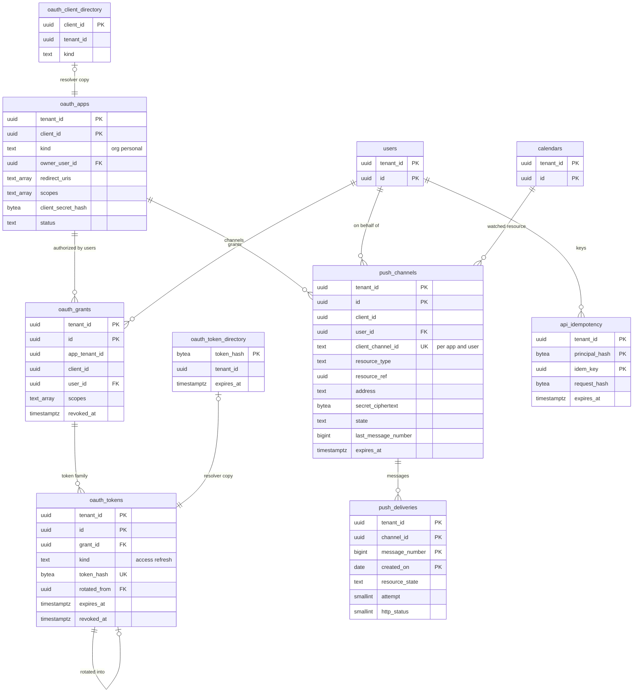

# Data model: 公開 API・OAuth・Webhook

[data-model.md](../data-model.md) の一部。規約は、そちらの 2 節に従う。振る舞いは [api-and-push.md](../api-and-push.md) を正とする。決定は [ADR-0026](../../decisions/0026-public-rest-api-shape.md)〜[ADR-0028](../../decisions/0028-push-channels-signed-webhooks.md)、[ADR-0041](../../decisions/0041-encryption-keys-and-secret-storage.md)。Webhook の送りの形（ヘッダーと署名）は [stores.md](stores.md) の 4 節、レート制限の鍵は同 1 節。

| 表 | テナント | 中身 |
| --- | --- | --- |
| `api_idempotency` | 内 | `Idempotency-Key`（24 時間） |
| `oauth_apps` | 内（組織か個人） | OAuth のアプリ |
| `ops.oauth_client_directory` | 外 | `client_id` → テナント（X6） |
| `oauth_grants` | 内（利用者） | 利用者の認可（トークンの一式） |
| `oauth_tokens` | 内（利用者） | アクセス・更新のトークンのハッシュ |
| `ops.oauth_token_directory` | 外 | トークンのハッシュ → テナント（X6） |
| `push_channels` | 内 | Webhook の通知の経路 |
| `push_deliveries` | 内 | 経路ごとの送りの記録（7 日） |

## 1. ER 図

- 個人のアプリは個人のテナントにある。組織の利用者が組織の外の個人のアプリを認可したとき（`oauth_apps_policy = all`）、`oauth_grants` は利用者のテナントに置き、アプリを `app_tenant_id`・`client_id` の論理の参照で指す。
- `push_channels` の `resource_ref` は、`resource_type` に応じてカレンダーの ID か利用者の ID（カレンダーの一覧）。

## 2. `api_idempotency`

`POST` の `Idempotency-Key`（[api-and-push.md](../api-and-push.md) の 4.7 節）。（アプリ, 利用者, キー）ごとに 24 時間、同じ応答を返す。

| 列 | 型 | NULL | 既定 | 説明 |
| --- | --- | --- | --- | --- |
| `tenant_id` | `uuid` | NOT NULL | — | 利用者のテナント |
| `principal_hash` | `bytea` | NOT NULL | — | `SHA-256(client_id ‖ user_id)`（自社の画面は `client_id` の代わりに `web`） |
| `idem_key` | `uuid` | NOT NULL | — | |
| `request_hash` | `bytea` | NOT NULL | — | 方法・経路・本文の SHA-256（同じキーで違えば 422 `idempotencyKeyReuse`） |
| `status` | `text` | NOT NULL | `'in_progress'` | `in_progress`・`done` |
| `response_status` | `smallint` | NULL | — | |
| `response_ciphertext` | `bytea` | NULL | — | 応答の本文（予定の中身を含むので暗号文） |
| `created_at` | `timestamptz` | NOT NULL | `now()` | |
| `expires_at` | `timestamptz` | NOT NULL | `now() + interval '24 hours'` | |

- キー：PK `(tenant_id, principal_hash, idem_key)`。書き込みのトランザクションの最初に `INSERT ... ON CONFLICT DO NOTHING` し、入らなければ前の応答を返す（`in_progress` なら 409）。
- 索引：`(expires_at)` — 期限の削除（テナントを順に回す `lifecycle`）。
- CHECK：`status IN ('in_progress','done')`。
- RLS：テナント。保持：24 時間。S1 の量：約 3,000 万行（書き込み 1 日 3,200 万件の多くがキーを持つと仮定）。

## 3. OAuth

### 3.1 `oauth_apps`

[api-and-push.md](../api-and-push.md) の 6.1 節、[ADR-0027](../../decisions/0027-oauth-apps-scopes-and-rate-limits.md)。

| 列 | 型 | NULL | 既定 | 説明 |
| --- | --- | --- | --- | --- |
| `tenant_id` | `uuid` | NOT NULL | — | 登録した組織、または個人のテナント |
| `client_id` | `uuid` | NOT NULL | `uuidv7()` | 公開の値 |
| `kind` | `text` | NOT NULL | — | `org`・`personal` |
| `owner_user_id` | `uuid` | NOT NULL | — | 登録者（停止の知らせの宛先） |
| `name` | `text` | NOT NULL | — | 認可の画面に出す名前 |
| `redirect_uris` | `text[]` | NOT NULL | — | 完全一致。`https`（開発用に `http://localhost`・`http://127.0.0.1`） |
| `scopes` | `text[]` | NOT NULL | — | `calendar.read`・`calendar.events`・`calendar.freebusy`・`calendar.manage` の部分集合 |
| `client_secret_hash` | `bytea` | NULL | — | `<brand>_ocs_…` の SHA-256（公開のクライアントは NULL） |
| `status` | `text` | NOT NULL | `'active'` | `active`・`disabled` |
| `created_at`・`updated_at` | `timestamptz` | NOT NULL | `now()` | |

- キー：PK `(tenant_id, client_id)`。UK `client_id`。FK `(tenant_id, owner_user_id)` → `users`。
- CHECK：`kind IN ('org','personal')`、`scopes <@ '{calendar.read,calendar.events,calendar.freebusy,calendar.manage}'`、`cardinality(redirect_uris) BETWEEN 1 AND 10`、`status IN ('active','disabled')`。
- RLS：テナント。作成と取り消しは監査に書く。`client_id` を書くトランザクションで `ops.oauth_client_directory` にも書く。S1 の量：数千行。

### 3.2 `ops.oauth_client_directory`

| 列 | 型 | NULL | 既定 | 説明 |
| --- | --- | --- | --- | --- |
| `client_id` | `uuid` | NOT NULL | — | |
| `tenant_id` | `uuid` | NOT NULL | — | |
| `kind` | `text` | NOT NULL | — | `org`・`personal` |
| `updated_at` | `timestamptz` | NOT NULL | `now()` | |

- キー：PK `client_id`。RLS：なし（`ops`）。読むのは `resolver`（`auth` の認可の画面とトークンの交換）。S1 の量：数千行。

### 3.3 `oauth_grants`

利用者の認可。1 つの認可から出たトークンが「一式」（再利用の検出で一式を取り消す）。

| 列 | 型 | NULL | 既定 | 説明 |
| --- | --- | --- | --- | --- |
| `tenant_id` | `uuid` | NOT NULL | — | 利用者のテナント |
| `id` | `uuid` | NOT NULL | `uuidv7()` | 一式の ID |
| `app_tenant_id` | `uuid` | NOT NULL | — | アプリのテナント |
| `client_id` | `uuid` | NOT NULL | — | |
| `user_id` | `uuid` | NOT NULL | — | |
| `scopes` | `text[]` | NOT NULL | — | 認可した範囲 |
| `created_at` | `timestamptz` | NOT NULL | `now()` | |
| `last_used_at` | `timestamptz` | NULL | — | |
| `revoked_at` | `timestamptz` | NULL | — | |
| `revoked_reason` | `text` | NULL | — | `user`・`admin`・`policy`・`refresh_reuse`・`user_suspended` |

- キー：PK `(tenant_id, id)`。UK `(tenant_id, client_id, user_id) WHERE revoked_at IS NULL`。FK `(tenant_id, user_id)` → `users`。
- 索引：`(tenant_id, client_id) WHERE revoked_at IS NULL` — 組織の方針を狭めた時・アプリを止めた時にまとめて取り消す。
- RLS：テナント。S1 の量：数十万行。

### 3.4 `oauth_tokens`

| 列 | 型 | NULL | 既定 | 説明 |
| --- | --- | --- | --- | --- |
| `tenant_id` | `uuid` | NOT NULL | — | |
| `id` | `uuid` | NOT NULL | `uuidv7()` | |
| `grant_id` | `uuid` | NOT NULL | — | |
| `kind` | `text` | NOT NULL | — | `access`（1 時間）・`refresh`（使うたびに入れ替え、90 日使わなければ切れる） |
| `token_hash` | `bytea` | NOT NULL | — | `<brand>_oat_…`・`<brand>_ort_…` の SHA-256 |
| `rotated_from` | `uuid` | NULL | — | 入れ替えの親（`refresh`） |
| `expires_at` | `timestamptz` | NOT NULL | — | |
| `used_at` | `timestamptz` | NULL | — | `refresh` を使った時刻（2 回目は再利用） |
| `revoked_at` | `timestamptz` | NULL | — | |
| `created_at` | `timestamptz` | NOT NULL | `now()` | |

- キー：PK `(tenant_id, id)`。UK `token_hash`。FK `(tenant_id, grant_id)` → `oauth_grants ON DELETE CASCADE`。
- 索引：UK — Bearer の確かめ（Valkey に 60 秒の写し）。`(tenant_id, grant_id)` — 一式の取り消し。`(expires_at)` — 期限の削除。
- CHECK：`kind IN ('access','refresh')`。
- トークンのハッシュからテナントを決めるのは `ops.oauth_token_directory`（3.5 節。ADR-0004 の X6）。トークンを書くトランザクションで両方に書く。
- RLS：テナント。保持：期限・取り消しの 7 日後に消す。S1 の量：約 300 万行。

### 3.5 `ops.oauth_token_directory`

Bearer のトークンのハッシュ → テナント（[ADR-0004](../../decisions/0004-tenancy-and-rls.md) の X6、[data-model.md](../data-model.md) の D-29）。`api`・`caldav` は、Valkey の写し（`cred:*`）になければこの表でテナントを決め、そのテナントのコンテキストで `oauth_tokens` を読む。

| 列 | 型 | NULL | 既定 | 説明 |
| --- | --- | --- | --- | --- |
| `token_hash` | `bytea` | NOT NULL | — | `oauth_tokens.token_hash` と同じ値 |
| `tenant_id` | `uuid` | NOT NULL | — | |
| `kind` | `text` | NOT NULL | — | `access`・`refresh` |
| `expires_at` | `timestamptz` | NOT NULL | — | |
| `revoked_at` | `timestamptz` | NULL | — | |

- キー：PK `token_hash`。
- 索引：`(expires_at)` — 期限の削除。
- RLS：なし（`ops`）。読むのは `resolver`（`api`・`caldav`・`auth`）。書くのは `app`・`auth`（トークンを出す・取り消すトランザクションの中）。予定の中身もアカウントの ID も持たない。
- 保持：`oauth_tokens` と同じ（期限・取り消しの 7 日後）。S1 の量：約 300 万行。

## 4. Webhook

### 4.1 `push_channels`

通知の経路（[api-and-push.md](../api-and-push.md) の 7 節、[ADR-0028](../../decisions/0028-push-channels-signed-webhooks.md)）。

| 列 | 型 | NULL | 既定 | 説明 |
| --- | --- | --- | --- | --- |
| `tenant_id` | `uuid` | NOT NULL | — | 利用者のテナント |
| `id` | `uuid` | NOT NULL | `uuidv7()` | |
| `client_id` | `uuid` | NOT NULL | — | アプリ（自社の画面は使わない） |
| `user_id` | `uuid` | NOT NULL | — | |
| `client_channel_id` | `text` | NOT NULL | — | 呼んだ側が決める `id`（`[A-Za-z0-9_-]`、64 文字） |
| `resource_type` | `text` | NOT NULL | — | `events`・`calendar_list`・`acl` |
| `resource_ref` | `uuid` | NOT NULL | — | カレンダーの ID（`events`・`acl`）か利用者の ID（`calendar_list`） |
| `resource_tenant_id` | `uuid` | NOT NULL | — | 対象のテナント（共有されたカレンダー） |
| `resource_id` | `text` | NOT NULL | — | 外に見せる不透明な値 `rsc_…` |
| `address` | `text` | NOT NULL | — | `https` の URL |
| `token` | `text` | NULL | — | 呼んだ側の値（256 文字。秘密ではない） |
| `secret_ciphertext` | `bytea` | NOT NULL | — | 署名の秘密 `<brand>_whsec_…`（封筒の暗号化） |
| `expires_at` | `timestamptz` | NOT NULL | — | 既定 7 日、最大 30 日 |
| `state` | `text` | NOT NULL | `'active'` | `active`・`retrying`・`stopped_failing`・`stopped_revoked`・`expired`・`stopped` |
| `last_message_number` | `bigint` | NOT NULL | `0` | 送りごとに 1 上げる（I-20） |
| `failing_since` | `timestamptz` | NULL | — | 24 時間で `stopped_failing` |
| `created_at`・`updated_at` | `timestamptz` | NOT NULL | `now()` | |

- キー：PK `(tenant_id, id)`。UK `(tenant_id, client_id, user_id, client_channel_id)`。UK `resource_id`。
- 索引：`(resource_tenant_id, resource_ref) WHERE state IN ('active','retrying')` — 変更のあったカレンダーの経路（振り分け）。経路のあるカレンダーの集合は Valkey の `push:cal:<calendar_id>` にも写す。`(tenant_id, client_id, user_id) WHERE state IN ('active','retrying')` — 上限（（アプリ, 利用者）100、カレンダー 50、テナント 10,000）。
- CHECK：`resource_type IN (...)`、`state IN (...)`、`client_channel_id ~ '^[A-Za-z0-9_-]{1,64}$'`、`char_length(token) <= 256`、`expires_at <= created_at + interval '30 days'`。
- RLS：テナント。作成と停止は監査に書く。保持：止まってから 30 日で消す。S1 の量：数十万行。

### 4.2 `push_deliveries`

経路ごとの送りの記録（7 日。SLI「最初の送信まで 30 秒」の元）。

| 列 | 型 | NULL | 既定 | 説明 |
| --- | --- | --- | --- | --- |
| `tenant_id`・`channel_id` | `uuid` | NOT NULL | — | |
| `message_number` | `bigint` | NOT NULL | — | |
| `created_on` | `date` | NOT NULL | — | 分割の鍵（D-21） |
| `resource_state` | `text` | NOT NULL | — | `sync`・`exists`・`not_exists` |
| `first_change_at` | `timestamptz` | NOT NULL | — | まとめた最初の変更の確定の時刻 |
| `attempt` | `smallint` | NOT NULL | `0` | |
| `http_status` | `smallint` | NULL | — | |
| `latency_ms` | `integer` | NULL | — | |
| `first_sent_at`・`succeeded_at` | `timestamptz` | NULL | — | |
| `next_retry_at` | `timestamptz` | NULL | — | |

- キー：PK `(tenant_id, channel_id, message_number, created_on)`。番号は経路の行のロックの中で振るので、日をまたいでも重ならない。
- 索引：`(next_retry_at) WHERE succeeded_at IS NULL` — 再試行（分割ごと）。
- CHECK：`resource_state IN ('sync','exists','not_exists')`。
- 分割：`RANGE (created_on)`、1 日、7 日。
- RLS：テナント。S1 の量：1 日 約 4,000 万行（500 件/秒のピーク）。
