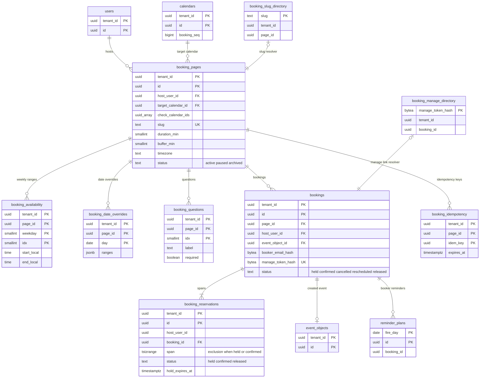

# Data model: 予約ページ

[data-model.md](../data-model.md) の一部。規約は、そちらの 2 節に従う。振る舞いは [booking-pages.md](../booking-pages.md) を正とする。決定は [ADR-0032](../../decisions/0032-booking-slot-computation.md)、[ADR-0033](../../decisions/0033-booking-creation-and-exclusion.md)。予約者の個人情報の扱いは**法務の L3・L6 の確認待ち**（[booking-pages.md](../booking-pages.md) の 10 節）。

| 表 | テナント | 中身 |
| --- | --- | --- |
| `booking_pages` | 内（持ち主） | ページの設定 |
| `booking_availability` | 内 | 曜日ごとの受け付けの時間 |
| `booking_date_overrides` | 内 | 日付ごとの上書き |
| `booking_questions` | 内 | 足した質問 |
| `bookings` | 内 | 予約と予約者 |
| `booking_reservations` | 内 | 予約の区間（排他の制約） |
| `booking_idempotency` | 内 | `Idempotency-Key`（24 時間） |
| `ops.booking_slug_directory` | 外 | `slug` → テナントとページ（X6） |
| `ops.booking_manage_directory` | 外 | 管理のリンクのハッシュ → テナントと予約（X6） |

## 1. ER 図



- `bookings ||--|{ booking_reservations` は、予約 1 つに区間が 1 つ以上（時刻を変えた予約は、新しい予約と区間を作る）。
- `bookings ||--o| event_objects` は、予約から作った予定（`confirmed` になってから作る。`held` の間は NULL）。予約から作られていない予定は多い。
- `reminder_plans`（`ops`）は `kind = booker` の行で `booking_id` を持つ論理の参照。

## 2. `booking_pages`

[booking-pages.md](../booking-pages.md) の 4 節。1 利用者 20 まで。

| 列 | 型 | NULL | 既定 | 説明 |
| --- | --- | --- | --- | --- |
| `tenant_id` | `uuid` | NOT NULL | — | |
| `id` | `uuid` | NOT NULL | `uuidv7()` | |
| `host_user_id` | `uuid` | NOT NULL | — | 持ち主 |
| `target_calendar_id` | `uuid` | NOT NULL | — | 予定を作るカレンダー |
| `check_calendar_ids` | `uuid[]` | NOT NULL | — | 空きを確かめるカレンダー（持ち主が `writer` 以上、10 まで。既定は主のカレンダー） |
| `title` | `text` | NOT NULL | — | |
| `description`・`location`・`conference_url` | `text` | NULL | — | |
| `duration_min` | `smallint` | NOT NULL | `30` | 5〜480 |
| `step_min` | `smallint` | NOT NULL | `30` | 15・30・60 か長さ |
| `buffer_min` | `smallint` | NOT NULL | `0` | 間の時間（0〜120） |
| `min_notice_min` | `integer` | NOT NULL | `240` | 最短の予告（0 分〜30 日） |
| `max_advance_days` | `smallint` | NOT NULL | `60` | 最も先の予約（1〜180） |
| `daily_limit` | `smallint` | NULL | — | 1 日の上限（1〜50） |
| `timezone` | `text` | NOT NULL | — | ページのタイムゾーン（受け付けの時間を解く） |
| `email_verification` | `boolean` | NOT NULL | `false` | メールの確認（`held` の 10 分の仮押さえ） |
| `booker_reminders` | `jsonb` | NOT NULL | `'[{"method":"email","minutes":1440}]'` | 予約者へのリマインダー（メールだけ、5 件） |
| `consent_required` | `boolean` | NOT NULL | `false` | 同意のチェック（既定は L6 の後） |
| `privacy_links` | `jsonb` | NOT NULL | `'{}'` | 持ち主（組織）の方針のリンク |
| `answers_in_description` | `boolean` | NOT NULL | `true` | 予約者の答えを予定の説明に入れる |
| `guests_can_invite_others` | `boolean` | NOT NULL | `false` | |
| `cancel_cutoff_hours` | `smallint` | NOT NULL | `0` | 予約者の取り消し・変更を開始の N 時間前まで |
| `slug` | `text` | NOT NULL | — | 80 ビットの base32（16 文字）。作り直すと古い URL は 404 |
| `status` | `text` | NOT NULL | `'active'` | `active`・`paused`・`archived` |
| `created_at`・`updated_at` | `timestamptz` | NOT NULL | `now()` | |

- キー：PK `(tenant_id, id)`。UK `slug`（全体で一意）。FK `(tenant_id, host_user_id)` → `users`、`(tenant_id, target_calendar_id)` → `calendars`。
- 索引：`(tenant_id, host_user_id)` — 持ち主のページの一覧と数。
- CHECK：上の範囲、`step_min IN (15,30,60) OR step_min = duration_min`、`cardinality(check_calendar_ids) BETWEEN 1 AND 10`、`jsonb_array_length(booker_reminders) <= 5`、`slug ~ '^[a-z2-7]{16}$'`、`status IN (...)`。
- RLS：テナント。組織の `booking_pages_policy = disabled` で全ページを `paused` にする。`slug` を書くトランザクションで `ops.booking_slug_directory` も書く。S1 の量：約 10 万行。

## 3. 受け付けの時間と質問

### 3.1 `booking_availability`

| 列 | 型 | NULL | 既定 | 説明 |
| --- | --- | --- | --- | --- |
| `tenant_id`・`page_id` | `uuid` | NOT NULL | — | |
| `weekday` | `smallint` | NOT NULL | — | 0＝日曜〜6＝土曜 |
| `idx` | `smallint` | NOT NULL | — | 曜日の中の順（0〜2） |
| `start_local`・`end_local` | `time` | NOT NULL | — | ページのタイムゾーンの壁時計の `[開始, 終わり)` |

- キー：PK `(tenant_id, page_id, weekday, idx)`。FK → `booking_pages ON DELETE CASCADE`。
- CHECK：`weekday BETWEEN 0 AND 6`、`idx BETWEEN 0 AND 2`、`end_local > start_local`。範囲の重なりは `packages/writer` で拒む。

### 3.2 `booking_date_overrides`

| 列 | 型 | NULL | 既定 | 説明 |
| --- | --- | --- | --- | --- |
| `tenant_id`・`page_id` | `uuid` | NOT NULL | — | |
| `day` | `date` | NOT NULL | — | ページのタイムゾーンの日付 |
| `ranges` | `jsonb` | NOT NULL | `'[]'` | その日の `[{start:"HH:MM", end:"HH:MM"}]`（3 つまで）。空は「受けない」 |

- キー：PK `(tenant_id, page_id, day)`。FK → `booking_pages ON DELETE CASCADE`。
- 保持：過ぎた日付を 30 日後に消す。

### 3.3 `booking_questions`

| 列 | 型 | NULL | 既定 | 説明 |
| --- | --- | --- | --- | --- |
| `tenant_id`・`page_id` | `uuid` | NOT NULL | — | |
| `idx` | `smallint` | NOT NULL | — | 0〜4 |
| `label` | `text` | NOT NULL | — | |
| `required` | `boolean` | NOT NULL | `false` | |
| `max_length` | `smallint` | NOT NULL | `500` | 答えの長さ |

- キー：PK `(tenant_id, page_id, idx)`。FK → `booking_pages ON DELETE CASCADE`。
- CHECK：`idx BETWEEN 0 AND 4`、`max_length BETWEEN 1 AND 500`。
- RLS：3 表ともテナント。S1 の量：ページの数の数倍。

## 4. `bookings`

予約（[booking-pages.md](../booking-pages.md) の 6・7・10 節）。

| 列 | 型 | NULL | 既定 | 説明 |
| --- | --- | --- | --- | --- |
| `tenant_id` | `uuid` | NOT NULL | — | 持ち主のテナント |
| `id` | `uuid` | NOT NULL | `uuidv7()` | `X-<BRAND>-BOOKING-ID` |
| `page_id` | `uuid` | NOT NULL | — | |
| `host_user_id` | `uuid` | NOT NULL | — | |
| `event_object_id` | `uuid` | NULL | — | `confirmed` で作った予定オブジェクト |
| `start_utc`・`end_utc` | `timestamptz` | NOT NULL | — | 予約の枠 |
| `booker_name_ciphertext` | `bytea` | NULL | — | 予約者の名前（暗号文。消した後は NULL） |
| `booker_email_ciphertext` | `bytea` | NULL | — | 予約者のメールアドレス（同上） |
| `booker_email_hash` | `bytea` | NULL | — | 開示・削除の請求で探す SHA-256 |
| `answers_ciphertext` | `bytea` | NULL | — | 答え（JSON の暗号文） |
| `booker_timezone` | `text` | NOT NULL | — | 予約者のタイムゾーン（メールの表示） |
| `status` | `text` | NOT NULL | — | `held`・`confirmed`・`cancelled`・`rescheduled`・`released` |
| `manage_token_hash` | `bytea` | NOT NULL | — | 管理のリンクの `token`（160 ビット）の SHA-256 |
| `verification_code_hash` | `bytea` | NULL | — | 6 桁のコードのハッシュ（`held` の間） |
| `verification_attempts` | `smallint` | NOT NULL | `0` | 5 回まで |
| `verification_sends` | `smallint` | NOT NULL | `0` | 送り直し 3 回まで |
| `rescheduled_to` | `uuid` | NULL | — | 変更の後の新しい予約 |
| `consent_at` | `timestamptz` | NULL | — | 同意のチェック |
| `created_at` | `timestamptz` | NOT NULL | `now()` | |
| `confirmed_at`・`cancelled_at` | `timestamptz` | NULL | — | |
| `pii_redacted_at` | `timestamptz` | NULL | — | 予約者の情報を伏せた時刻（期間は L5・L6 の後。それまで消さない） |

- キー：PK `(tenant_id, id)`。UK `manage_token_hash`。FK `(tenant_id, page_id)` → `booking_pages`、`(tenant_id, event_object_id)` → `event_objects`、`(tenant_id, rescheduled_to)` → `bookings`。
- 索引：`(tenant_id, host_user_id, start_utc)` — 持ち主の予約の一覧、1 日の上限の数え。`(tenant_id, booker_email_hash)` — 開示・削除の請求。`(tenant_id, event_object_id)` — 持ち主が予定を消した・動かした時に予約を引く。
- CHECK：`status IN (...)`、`verification_attempts <= 5`、`verification_sends <= 3`、`status <> 'confirmed' OR event_object_id IS NOT NULL`、`end_utc > start_utc`。
- 管理のリンク `https://book.<brand>.<domain>/m/<token>` からテナントを決めるのは `ops.booking_manage_directory`（8 節。ADR-0004 の X6）。
- 暗号文の鍵は `app-secrets`、暗号化のコンテキスト `booking-pii`（[ADR-0041](../../decisions/0041-encryption-keys-and-secret-storage.md)）。予約の要求の IP は持たない。
- RLS：テナント。S1 の量：約 300 万行（仮定）。

## 5. `booking_reservations`

予約の区間（[booking-pages.md](../booking-pages.md) の 6.3 節、[ADR-0033](../../decisions/0033-booking-creation-and-exclusion.md)、I-2）。

| 列 | 型 | NULL | 既定 | 説明 |
| --- | --- | --- | --- | --- |
| `tenant_id` | `uuid` | NOT NULL | — | |
| `id` | `uuid` | NOT NULL | `uuidv7()` | |
| `host_user_id` | `uuid` | NOT NULL | — | 持ち主（全部のページで共通の区間） |
| `page_id` | `uuid` | NOT NULL | — | |
| `booking_id` | `uuid` | NOT NULL | — | |
| `span` | `tstzrange` | NOT NULL | — | `[開始, 終わり + 間の時間)` |
| `status` | `text` | NOT NULL | — | `held`・`confirmed`・`released` |
| `hold_expires_at` | `timestamptz` | NULL | — | `held` の 10 分の期限 |
| `tzdata_version` | `text` | NOT NULL | — | 区間を計算したバージョン（切り替えの窓） |
| `created_at`・`updated_at` | `timestamptz` | NOT NULL | `now()` | |

```sql
ALTER TABLE booking_reservations ADD CONSTRAINT booking_reservations_no_overlap
  EXCLUDE USING gist (tenant_id WITH =, host_user_id WITH =, span WITH &&)
  WHERE (status IN ('held', 'confirmed'));
```

- キー：PK `(tenant_id, id)`。FK `(tenant_id, booking_id)` → `bookings`、`(tenant_id, page_id)` → `booking_pages`。
- 排他の制約：上（I-2）。取り消し・変更・期限切れは `status = released`（行を消さない）。
- 索引：GiST の排他の制約 — 枠の計算で持ち主の区間を読む（`span && [from, to)`）。`(tenant_id, host_user_id, hold_expires_at) WHERE status = 'held'` — 期限の切れた `held` を、同じ持ち主の次の予約のトランザクションで `released` にする。
- CHECK：`status IN ('held','confirmed','released')`、`(status = 'held') = (hold_expires_at IS NOT NULL)`、`NOT isempty(span)`。
- 書き込み：持ち主の主のカレンダーの行をロックした同じトランザクションで書き、`calendars.booking_seq` を上げる（D-19。枠のキャッシュの鍵）。
- 分割：しない（D-5）。`lifecycle` が毎日、`upper(span) < now() − 30 日` の `released` の行を消す。終わった `confirmed` の行も 30 日後に消す（予約の記録は `bookings` に残る）。
- RLS：テナント。S1 の量：約 50 万行。

## 6. `booking_idempotency`

`POST /api/pages/{slug}/bookings` の `Idempotency-Key`（[booking-pages.md](../booking-pages.md) の 6.1 節）。

| 列 | 型 | NULL | 既定 | 説明 |
| --- | --- | --- | --- | --- |
| `tenant_id`・`page_id` | `uuid` | NOT NULL | — | |
| `idem_key` | `uuid` | NOT NULL | — | 予約者の画面が作る |
| `request_hash` | `bytea` | NOT NULL | — | 本文の SHA-256（同じキーで本文が違えば 422） |
| `booking_id` | `uuid` | NULL | — | |
| `response_status` | `smallint` | NOT NULL | — | |
| `response` | `jsonb` | NOT NULL | — | 予約者に返した本文（予約の ID と状態だけ。個人の情報を入れない） |
| `expires_at` | `timestamptz` | NOT NULL | `now() + interval '24 hours'` | |

- キー：PK `(tenant_id, page_id, idem_key)`。
- 索引：`(expires_at)` — 期限の削除。
- RLS：テナント。保持：24 時間。S1 の量：数万行。

## 7. `ops.booking_slug_directory`

予約ページの URL の `slug` → テナント（[ADR-0004](../../decisions/0004-tenancy-and-rls.md) の X6）。

| 列 | 型 | NULL | 既定 | 説明 |
| --- | --- | --- | --- | --- |
| `slug` | `text` | NOT NULL | — | |
| `tenant_id` | `uuid` | NOT NULL | — | |
| `page_id` | `uuid` | NOT NULL | — | |
| `updated_at` | `timestamptz` | NOT NULL | `now()` | |

- キー：PK `slug`。
- 索引：`(tenant_id, page_id)` — 作り直し・削除で古い行を消す。
- RLS：なし（`ops`）。読むのは `resolver`（`booking`）。状態（`paused` など）は持たず、解決の後にテナントの中で確かめる。S1 の量：約 10 万行。

## 8. `ops.booking_manage_directory`

予約の管理のリンク `/m/<token>` のハッシュ → テナントと予約（[ADR-0004](../../decisions/0004-tenancy-and-rls.md) の X6、[data-model.md](../data-model.md) の D-29）。

| 列 | 型 | NULL | 既定 | 説明 |
| --- | --- | --- | --- | --- |
| `manage_token_hash` | `bytea` | NOT NULL | — | `bookings.manage_token_hash` と同じ値 |
| `tenant_id` | `uuid` | NOT NULL | — | |
| `booking_id` | `uuid` | NOT NULL | — | |
| `expires_at` | `timestamptz` | NOT NULL | — | 予定の終わり（リンクを使える期限） |

- キー：PK `manage_token_hash`。
- 索引：`(expires_at)` — 期限の削除。
- RLS：なし（`ops`）。読むのは `resolver`（`booking`）。書くのは `app`（予約を作るトランザクションの中）。予約者の情報を持たない。
- 保持：`expires_at` の 30 日後に消す。S1 の量：約 300 万行。
