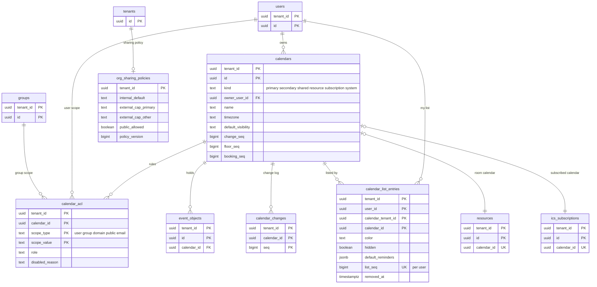

# Data model: カレンダーと ACL

[data-model.md](../data-model.md) の一部。規約は、そちらの 2 節に従う。振る舞いは [sharing-and-acl.md](../sharing-and-acl.md)、[sync-and-caldav.md](../sync-and-caldav.md) の 4・6 節、[api-and-push.md](../api-and-push.md) の 4.2・4.6 節を正とする。決定は [ADR-0004](../../decisions/0004-tenancy-and-rls.md)、[ADR-0005](../../decisions/0005-change-log-and-sync-tokens.md)、[ADR-0021](../../decisions/0021-effective-role-and-redact-table.md)、[ADR-0022](../../decisions/0022-delegation-and-acting-on-behalf.md)。

すべてテナントの表（FORCE RLS）。

| 表 | テナント | 書く |
| --- | --- | --- |
| `calendars` | カレンダーの持ち主 | `packages/writer`（`change_seq` を振る） |
| `calendar_acl` | カレンダーの持ち主 | `packages/writer`（`kind = acl` を載せる） |
| `org_sharing_policies` | 組織 | `packages/writer`（無効にする ACL の行を同じトランザクションで） |
| `calendar_list_entries` | 見る人 | `packages/writer`（`users.calendar_list_seq` を振る） |

## 1. ER 図

- `calendar_list_entries` と `calendars` は、共有されたカレンダーではテナントをまたぐ。`calendar_tenant_id` と `calendar_id` の論理の参照で、外部キーは同じテナントのときにも張らない（D-12）。
- `calendar_acl` の `user` の主体はアカウントの ID（`auth.user.id`）で、別のテナントの人を指しうる。`users ||--o{ calendar_acl` は同じテナントのときの意味の関係。

## 2. `calendars`

カレンダー（[sharing-and-acl.md](../sharing-and-acl.md) の 4.1 節）。変更のログの番号の持ち主（[ADR-0005](../../decisions/0005-change-log-and-sync-tokens.md)）。

| 列 | 型 | NULL | 既定 | 説明 |
| --- | --- | --- | --- | --- |
| `tenant_id` | `uuid` | NOT NULL | — | |
| `id` | `uuid` | NOT NULL | `uuidv7()` | CalDAV の URL・API の `calendarId` |
| `kind` | `text` | NOT NULL | — | `primary`・`secondary`・`shared`（組織の共有）・`resource`（会議室・設備）・`subscription`（ICS の購読）・`system`（日本の祝日） |
| `owner_user_id` | `uuid` | NULL | — | 持ち主（`primary`・`secondary`・`subscription`）。`shared`・`resource`・`system` は NULL（D-18） |
| `name` | `text` | NOT NULL | — | 255 文字まで |
| `description` | `text` | NULL | — | 4 KiB まで |
| `timezone` | `text` | NOT NULL | — | 既定のタイムゾーン。`floating`・`date` の予定の派生の値を解く（[time-zones-and-holidays.md](../time-zones-and-holidays.md) の 5.2 節） |
| `default_visibility` | `text` | NOT NULL | `'public'` | 予定の `default` の解き方（`public`・`private`） |
| `color` | `text` | NOT NULL | — | 既定の色（`#RRGGBB`）。見る人の色は一覧の項目 |
| `change_seq` | `bigint` | NOT NULL | `0` | 最後に振った番号。書き込みの最初に `UPDATE ... SET change_seq = change_seq + n RETURNING` でロックする |
| `floor_seq` | `bigint` | NOT NULL | `0` | 変更のログに残っている最小の番号。トークンの `seq` がこれより小さければ 410 |
| `booking_seq` | `bigint` | NOT NULL | `0` | 予約ページの持ち主の主のカレンダーだけが使う。予約の区間の変更ごとに上げる（D-19） |
| `created_by` | `uuid` | NULL | — | |
| `created_at`・`updated_at` | `timestamptz` | NOT NULL | `now()` | |
| `deleted_at` | `timestamptz` | NULL | — | `secondary` などの削除。予定を消してから行を消す（`lifecycle`） |

- キー：PK `(tenant_id, id)`。FK `(tenant_id, owner_user_id)` → `users`。UK `(tenant_id, owner_user_id) WHERE kind = 'primary'`（1 人に主のカレンダー 1 つ。I-22）。
- 索引：`(tenant_id, owner_user_id)` — 利用者のカレンダーの一覧。`(tenant_id, timezone) WHERE kind IN ('primary','secondary','shared','subscription')` — tzdb の再計算で `floating`・`date` の予定を持つカレンダーを探す。
- CHECK：`kind IN (...)`、`(kind IN ('primary','secondary','subscription')) = (owner_user_id IS NOT NULL)`、`default_visibility IN ('public','private')`、`color ~ '^#[0-9A-Fa-f]{6}$'`、`floor_seq <= change_seq + 1`。
- RLS：テナント。共有されたカレンダーは、カレンダーのテナントのコンテキストで読む（X3）。
- 書き込みの直列：1 カレンダーの書き込みは `change_seq` の行のロックで直列になる。上限 1 秒 50 件（[ADR-0005](../../decisions/0005-change-log-and-sync-tokens.md)）。`origin` ごとの枠は Valkey（[stores.md](stores.md) の 1 節）。
- 保持：持ち主の削除で消す。S1 の量：約 200 万行（主 75 万、追加・共有・購読、会議室 1 万）。

## 3. `calendar_acl`

ACL の行（[sharing-and-acl.md](../sharing-and-acl.md) の 4.2 節）。暗黙の行（主のカレンダーの組織の既定、会議室の組織の全員）は行にせず、`can()` が `org_sharing_policies` と `kind` から求める。

| 列 | 型 | NULL | 既定 | 説明 |
| --- | --- | --- | --- | --- |
| `tenant_id`・`calendar_id` | `uuid` | NOT NULL | — | |
| `scope_type` | `text` | NOT NULL | — | `user`・`group`・`domain`・`public`・`email`（アカウントのない人への共有の招待。D-24） |
| `scope_value` | `text` | NOT NULL | — | `user`：アカウントの ID、`group`：`groups.id`、`domain`：組織のテナントの ID、`public`：`''`、`email`：正規化したメールアドレス |
| `role` | `text` | NOT NULL | — | `free_busy_reader`・`reader`・`writer`・`owner` |
| `disabled_reason` | `text` | NULL | — | `policy_cap`（方針で無効）、`pending_account`（`email` の行）。無効の行は判定に使わない |
| `granted_by` | `uuid` | NOT NULL | — | 付けた人のアカウントの ID |
| `granted_at` | `timestamptz` | NOT NULL | `now()` | |
| `updated_at` | `timestamptz` | NOT NULL | `now()` | |

- キー：PK `(tenant_id, calendar_id, scope_type, scope_value)`。API の `ruleId` は `<scope_type>:<scope_value>`。FK `(tenant_id, calendar_id)` → `calendars`。
- 索引：`(tenant_id, scope_type, scope_value)` — 主体に共有されたカレンダー（カレンダーの一覧の項目を作る、ACL の変更の影響を求める）。`(tenant_id, calendar_id) WHERE disabled_reason IS NULL` は PK で足りる。
- CHECK：`scope_type IN (...)`、`role IN (...)`、`scope_type <> 'public' OR role IN ('free_busy_reader','reader')`、`(scope_type = 'email') = (disabled_reason = 'pending_account')`、`disabled_reason IS NULL OR disabled_reason IN ('policy_cap','pending_account')`。
- RLS：テナント。行の変更は `calendar_changes` に `kind = acl` を載せる（`view_hash` が変わる）。監査に書く。
- 保持：取り消しで消す。`email` の行は 30 日で消す。S1 の量：約 300 万行。

## 4. `org_sharing_policies`

組織の共有の方針（[sharing-and-acl.md](../sharing-and-acl.md) の 4.4 節）。既定と違う組織だけが行を持つ。

| 列 | 型 | NULL | 既定 | 説明 |
| --- | --- | --- | --- | --- |
| `tenant_id` | `uuid` | NOT NULL | — | |
| `internal_default` | `text` | NOT NULL | `'free_busy_reader'` | 組織の中の共有の既定（主のカレンダー）：`none`・`free_busy_reader`・`reader` |
| `external_cap_primary` | `text` | NOT NULL | `'free_busy_reader'` | 組織の外への上限（主のカレンダー）：`free_busy_reader`・`reader`・`writer`・`owner` |
| `external_cap_other` | `text` | NOT NULL | `'free_busy_reader'` | 同（追加・共有のカレンダー） |
| `public_allowed` | `boolean` | NOT NULL | `false` | `public` の行を許すか |
| `ics_secret_allowed` | `boolean` | NOT NULL | `true` | ICS の秘密のアドレスを許すか |
| `policy_version` | `bigint` | NOT NULL | `1` | 変更ごとに上げる。`view_hash` の入力 |
| `updated_by` | `uuid` | NOT NULL | — | |
| `updated_at` | `timestamptz` | NOT NULL | `now()` | |

- キー：PK `tenant_id`。
- CHECK：各列挙。
- RLS：テナント（組織だけ）。狭めたら、上限を超える `calendar_acl` の行と `ics_publish_tokens` を同じトランザクション（多ければ 1,000 件ずつのジョブ）で無効にし、`kind = acl` を載せる。
- S1 の量：3,000 行以下。

## 5. `calendar_list_entries`

利用者のカレンダーの一覧の項目（自分の見え方。[api-and-push.md](../api-and-push.md) の 4.2 節、[sync-and-caldav.md](../sync-and-caldav.md) の 6.2 節、[reminders-and-notifications.md](../reminders-and-notifications.md) の 4.1 節）。見る人のテナントに置く（D-12）。

| 列 | 型 | NULL | 既定 | 説明 |
| --- | --- | --- | --- | --- |
| `tenant_id`・`user_id` | `uuid` | NOT NULL | — | 見る人 |
| `calendar_tenant_id` | `uuid` | NOT NULL | — | カレンダーのテナント（自分のカレンダーは `tenant_id` と同じ） |
| `calendar_id` | `uuid` | NOT NULL | — | |
| `display_name` | `text` | NULL | — | 自分から見た名前（CalDAV の `PROPPATCH` の `displayname`） |
| `color` | `text` | NULL | — | 自分から見た色 |
| `hidden` | `boolean` | NOT NULL | `false` | 一覧から隠す（表示を消しても検索の対象には残す） |
| `selected` | `boolean` | NOT NULL | `true` | 画面で表示するか |
| `sort_key` | `text` | NULL | — | 並び |
| `default_reminders` | `jsonb` | NOT NULL | `'[]'` | 時刻つきの予定の既定のリマインダー（`[{method, minutes}]`、5 件） |
| `default_all_day_reminders` | `jsonb` | NOT NULL | `'[]'` | 終日の予定の既定（5 件） |
| `list_seq` | `bigint` | NOT NULL | — | この項目を最後に変えた `users.calendar_list_seq` |
| `removed_at` | `timestamptz` | NULL | — | 一覧から消した（共有を外された）。差分で削除として返し、30 日後に消す |
| `created_at`・`updated_at` | `timestamptz` | NOT NULL | `now()` | |

- キー：PK `(tenant_id, user_id, calendar_tenant_id, calendar_id)`。UK `(tenant_id, user_id, list_seq)`。FK `(tenant_id, user_id)` → `users`。
- 索引：PK — 利用者の一覧。UK — カレンダーの一覧の差分（`list_seq > token`）。`(calendar_tenant_id, calendar_id)` — ACL の変更で、そのカレンダーを一覧に持つ同じテナントの利用者を探す。
- CHECK：`jsonb_array_length(default_reminders) <= 5`、`jsonb_array_length(default_all_day_reminders) <= 5`、`color IS NULL OR color ~ '^#[0-9A-Fa-f]{6}$'`。
- RLS：テナント（見る人）。既定のリマインダーを持つ共有のカレンダーの項目は、カレンダーのテナントの `calendar_list_reminder_subscribers` にも書く（[reminders-and-notifications.md](reminders-and-notifications.md) の 3.1 節）。
- 保持：`removed_at` の 30 日後に消す。S1 の量：約 500 万行。
