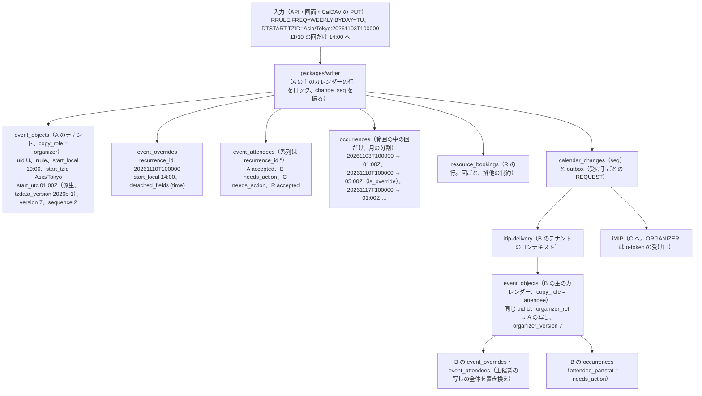
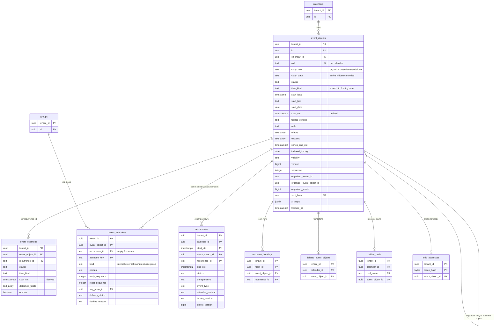

# Data model: 予定と繰り返し

[data-model.md](../data-model.md) の一部。規約は、そちらの 2 節に従う（時刻の列は 2.4 節、iCalendar の往復は 2.5 節、バージョンは 2.6 節）。振る舞いは [events-and-recurrence.md](../events-and-recurrence.md)、[invitations-and-itip.md](../invitations-and-itip.md) の 4・5 節、[sharing-and-acl.md](../sharing-and-acl.md) の 5 節を正とする。決定は [ADR-0002](../../decisions/0002-time-representation.md)、[ADR-0003](../../decisions/0003-recurrence-storage-and-expansion.md)、[ADR-0006](../../decisions/0006-organizer-and-attendee-copies.md)、[ADR-0008](../../decisions/0008-recurrence-expansion-semantics.md)〜[ADR-0011](../../decisions/0011-inbound-recurrence-normalization.md)、[ADR-0014](../../decisions/0014-itip-state-transfer-and-sequence.md)、[ADR-0019](../../decisions/0019-room-booking-rows-and-recurring-acceptance.md)。

すべてテナントの表（FORCE RLS）。書くのは `packages/writer` だけ。

| 表 | 正本か | 1 行 |
| --- | --- | --- |
| `event_objects` | 正本 | UID 1 つ（マスター） |
| `event_overrides` | 正本 | `RECURRENCE-ID` 1 つ（その回の VEVENT の全体） |
| `event_attendees` | 正本 | 参加者 1 人 × 系列か回 |
| `occurrences` | 写し（`expand()` から作り直せる） | 範囲の中の回 1 つ |

## 1. 繰り返しの予定が行になるまで（概念図）

例：東京の A が主催する「毎週火曜 10:00 `Asia/Tokyo` の定例」。参加者は同じ組織の B と外部の C、会議室 R。11/10 の回だけ 14:00 に動かした。

- 回の識別子 `(event_object_id, recurrence_id)` の `recurrence_id` は、元の開始の壁時計の時刻（`20261110T100000`）で、UTC ではない。tzdb が変わっても変わらない（I-9）。
- 範囲（過去 31 日から未来 548 日）の外の回は、索引に行を持たず、読むときにその場で `expand()` する。
- 参加者の写しは、主催者の写しとは別の予定オブジェクト（別の `id`、同じ `uid`）で、参加者のテナントの主のカレンダーにある（[ADR-0006](../../decisions/0006-organizer-and-attendee-copies.md)）。
- 「これ以降」の分割は、元の `event_objects` の `rrule` に `UNTIL` を付け、新しい UID の `event_objects`（`split_from` が元を指す）を作る（[ADR-0003](../../decisions/0003-recurrence-storage-and-expansion.md)）。

## 2. ER 図

- `event_objects ||--o{ event_objects : "organizer copy to attendee copies"` は、参加者の写しの `organizer_tenant_id`・`organizer_event_object_id` が主催者の写しを指す論理の参照（テナントをまたぐので外部キーなし。D-7）。
- `occurrences` は `event_objects` への外部キーを張らない（分割の表で、作り直せる写し）。
- `event_objects ||--o| imip_addresses` は、予定ごとの受け口（`kind = o`）が 1 つ（I-21）。

## 3. `event_objects`

予定オブジェクト（UID 1 つ）のマスター（[events-and-recurrence.md](../events-and-recurrence.md) の 3.1 節）と、写しの状態（[invitations-and-itip.md](../invitations-and-itip.md) の 4.2 節）。

### 3.1 列

**識別と写し**

| 列 | 型 | NULL | 既定 | 説明 |
| --- | --- | --- | --- | --- |
| `tenant_id` | `uuid` | NOT NULL | — | |
| `id` | `uuid` | NOT NULL | `uuidv7()` | API の `eventId` |
| `calendar_id` | `uuid` | NOT NULL | — | 持つカレンダー（1 つだけ） |
| `uid` | `text` | NOT NULL | — | iCalendar の UID（255 バイト） |
| `copy_role` | `text` | NOT NULL | — | `organizer`・`attendee`・`standalone`（参加者のいない予定） |
| `copy_state` | `text` | NOT NULL | `'active'` | `active`・`hidden`（参加者が消した）・`cancelled`（主催者が取り消した・外された）。主催者の写しと単独の予定は常に `active` |
| `created_by` | `uuid` | NULL | — | 作った利用者（代理の人を含む。監査は `tenant_audit_events`） |
| `created_at`・`updated_at` | `timestamptz` | NOT NULL | `now()` | iCalendar の `CREATED`・`LAST-MODIFIED` |
| `trashed_at` | `timestamptz` | NULL | — | ごみ箱（30 日。D-13） |

**種類と見え方**

| 列 | 型 | NULL | 既定 | 説明 |
| --- | --- | --- | --- | --- |
| `status` | `text` | NOT NULL | `'confirmed'` | `confirmed`・`tentative`・`cancelled`（主催者の取り消し。墓標として配る） |
| `transparency` | `text` | NOT NULL | `'opaque'` | `opaque`・`transparent`（参加者の自分の項目） |
| `event_type` | `text` | NOT NULL | `'default'` | `default`・`out_of_office`・`focus_time` |
| `visibility` | `text` | NOT NULL | `'default'` | `default`・`public`・`private`・`confidential`。マスターだけが持つ（I-16）。参加者の写しでは参加者の自分の値 |

**時刻**（[data-model.md](../data-model.md) の 2.4 節の形と CHECK）

| 列 | 型 | NULL | 既定 | 説明 |
| --- | --- | --- | --- | --- |
| `time_kind` | `text` | NOT NULL | — | `zoned`・`utc`・`floating`・`date` |
| `start_local`・`end_local` | `timestamp(0)` | NULL | — | 壁時計の時刻（正本） |
| `start_tzid`・`end_tzid` | `text` | NULL | — | IANA の正規の名前（`utc` は `'UTC'`） |
| `start_date`・`end_date` | `date` | NULL | — | 終日（`end_date` は含まない。1〜366 日） |
| `duration_kind` | `text` | NOT NULL | — | `exact`（DTEND で書いた。正確な秒）・`nominal`（DURATION で書いた）・`days`（終日） |
| `duration_exact_s` | `bigint` | NULL | — | `exact` の秒（0〜366 日） |
| `duration_nominal` | `text` | NULL | — | `nominal` の ISO 8601 の長さ（`P1D`、`PT1H30M`） |
| `start_utc`・`end_utc` | `timestamptz` | NOT NULL | — | 派生（最初の回）。`utc` だけ正本 |
| `tzdata_version` | `text` | NULL | — | 派生の値を計算したバージョン |

**繰り返し**

| 列 | 型 | NULL | 既定 | 説明 |
| --- | --- | --- | --- | --- |
| `rrule` | `text` | NULL | — | 正規化した RRULE（1 本だけ）。単発は NULL |
| `rrule_json` | `jsonb` | NULL | — | 解析した形（`packages/recurrence` の型） |
| `rdates` | `text[]` | NOT NULL | `'{}'` | `recurrence_id` の形。PERIOD は `<recurrence_id>/<長さ>`（1,000 件） |
| `exdates` | `text[]` | NOT NULL | `'{}'` | `recurrence_id` の形（5,000 件）。EXRULE は展開して入れる |
| `series_end_utc` | `timestamptz` | NULL | — | 最後の回の終わり。終わりのない系列は NULL。単発は `end_utc` |
| `indexed_through` | `date` | NULL | — | 展開の索引をどこまで作ったか（UTC の日。[ADR-0010](../../decisions/0010-occurrence-index-maintenance.md)）。索引の対象でない（D-4）なら NULL |
| `recurrence_flags` | `text[]` | NOT NULL | `'{}'` | `rdate_materialized`・`range_ignored`・`tz_approximated`・`expansion_truncated` |
| `split_from` | `uuid` | NULL | — | 「これ以降」の元の系列（同じテナント） |
| `split_generation` | `smallint` | NOT NULL | `0` | 分割の連なりの世代（200 まで） |
| `related_to` | `text` | NULL | — | iCalendar の `RELATED-TO`（`RELTYPE=SIBLING` の UID） |

**中身**

| 列 | 型 | NULL | 既定 | 説明 |
| --- | --- | --- | --- | --- |
| `title` | `text` | NOT NULL | `''` | 1,024 文字 |
| `location` | `text` | NULL | — | 1,024 文字 |
| `description` | `text` | NULL | — | 64 KiB |
| `color` | `text` | NULL | — | 自分の色（`#RRGGBB`） |
| `conference_url` | `text` | NULL | — | 2,048 文字 |
| `attachments` | `jsonb` | NOT NULL | `'[]'` | `[{url, title, mime}]`、25 件。中身のファイルは持たない |
| `reminders` | `jsonb` | NOT NULL | `'{"use_default":true}'` | 自分のリマインダー：`{use_default, overrides:[{method, minutes}]}`、5 件、0〜40,320 分 |
| `x_props` | `jsonb` | NOT NULL | `'[]'` | 知らないプロパティの原文（32 KiB。[data-model.md](../data-model.md) の 2.5 節） |

**バージョンと iTIP**

| 列 | 型 | NULL | 既定 | 説明 |
| --- | --- | --- | --- | --- |
| `version` | `bigint` | NOT NULL | `1` | どの項目が変わっても上がる |
| `sequence` | `integer` | NOT NULL | `0` | iTIP の `SEQUENCE` |
| `dtstamp` | `timestamptz` | NOT NULL | `now()` | 主催者の写しのコミットの時刻（外部へ送る `DTSTAMP`） |
| `guest_permissions` | `jsonb` | NOT NULL | 組織の既定 | `{can_modify, can_invite_others, can_see_other_guests}`。主催者の写しは設定、参加者の写しは届いた値 |
| `organizer_kind` | `text` | NOT NULL | `'self'` | `self`（主催者の写し・単独）・`internal`（本システムの中の主催者）・`external`（iMIP） |
| `organizer_tenant_id`・`organizer_calendar_id`・`organizer_event_object_id` | `uuid` | NULL | — | `internal` の主催者の写し（D-7） |
| `organizer_email`・`organizer_name` | `text` | NULL | — | 表示と `external` の照合 |
| `organizer_sent_by` | `text` | NULL | — | 代理の人（`SENT-BY`。[ADR-0022](../../decisions/0022-delegation-and-acting-on-behalf.md)） |
| `organizer_sequence` | `integer` | NULL | — | 参加者の写しが当てた主催者の `SEQUENCE` |
| `organizer_version` | `bigint` | NULL | — | 参加者の写しが当てた主催者の写しの `version`。`Schedule-Tag` |
| `itip_state` | `jsonb` | NULL | — | `external` の主催者：`{"<recurrence_id か *>": [SEQUENCE, DTSTAMP]}`（RFC 5546 の 2.1.5 節） |
| `seq_margin_epoch` | `integer` | NULL | — | DR の後の `SEQUENCE` の余白を当てた `dr_epoch`（[ADR-0044](../../decisions/0044-disaster-recovery-and-calendar-side-effects.md)） |

### 3.2 キー・索引・制約

- キー：PK `(tenant_id, id)`。UK `(tenant_id, calendar_id, uid)`（I-10）。FK `(tenant_id, calendar_id)` → `calendars`、`(tenant_id, split_from)` → `event_objects`。

| 索引 | 使う問い合わせ |
| --- | --- |
| `(tenant_id, calendar_id, series_end_utc) WHERE rrule IS NOT NULL OR cardinality(rdates) > 0` | 範囲の外の読み出しで、範囲に回がありうる系列を探す（[events-and-recurrence.md](../events-and-recurrence.md) の 9.4 節） |
| `(tenant_id, calendar_id, start_utc) WHERE rrule IS NULL AND cardinality(rdates) = 0` | 範囲の外の単発の予定 |
| `(tenant_id, indexed_through) WHERE indexed_through IS NOT NULL AND (series_end_utc IS NULL OR series_end_utc > indexed_through)` | `expander.advance` が端を進める予定を 1,000 件ずつ探す |
| `(tenant_id, start_tzid) WHERE time_kind = 'zoned'`、`(tenant_id, end_tzid) WHERE end_tzid <> start_tzid` | tzdb の再計算の対象（ゾーンごと） |
| `(tenant_id, calendar_id) WHERE time_kind IN ('floating','date')` | カレンダーのタイムゾーンの変更・tzdb の再計算 |
| `(tenant_id, organizer_tenant_id, organizer_event_object_id) WHERE copy_role = 'attendee'` | 写しの照合、移り・主催者の変更で参加者の写しを探す |
| `(tenant_id, split_from) WHERE split_from IS NOT NULL` | 分割の連なり |
| `(tenant_id, trashed_at) WHERE trashed_at IS NOT NULL` | ごみ箱の期限 |

- CHECK：
  - 時刻：[data-model.md](../data-model.md) の 2.4 節。加えて `(duration_kind = 'exact') = (duration_exact_s IS NOT NULL)`、`(duration_kind = 'nominal') = (duration_nominal IS NOT NULL)`、`(duration_kind = 'days') = (time_kind = 'date')`。
  - 列挙：`copy_role`、`copy_state`、`status`、`transparency`、`event_type`、`visibility`、`organizer_kind`。
  - 写し：`copy_role IN ('organizer','standalone') OR organizer_kind <> 'self'`、`(organizer_kind = 'internal') = (organizer_event_object_id IS NOT NULL)`、`copy_role = 'attendee' OR copy_state = 'active'`、`event_type = 'default' OR copy_role = 'standalone'`（不在・作業の時間は参加者を持たない）。
  - 繰り返し：`cardinality(rdates) <= 1000`、`cardinality(exdates) <= 5000`、`split_generation <= 200`。新しい系列の作成で TZID を必須にする規則（`utc` の繰り返しを作らない）は、取り込みでは受けるので CHECK にせず、`packages/writer` で確かめる。
  - 中身：`char_length(title) <= 1024`、`char_length(location) <= 1024`、`octet_length(description) <= 65536`、`jsonb_array_length(attachments) <= 25`、`octet_length(x_props::text) <= 32768`、`octet_length(uid) <= 255`。
- 上書きの数（1,000 件）は `event_overrides` の行の数なので、`packages/writer` が数える。
- RLS：テナント。共有の項目（時刻、繰り返し、場所、中身、参加者）を参加者の写しで変えるのは、`itip-delivery` の当て込みだけ（I-3）。
- 保持：ごみ箱から 30 日。参加者の写しの `cancelled` は 30 日の後に消す。過去の予定は消さない（利用者が消すまで）。S1 の量：3 億行、約 750 GB。

## 4. `event_overrides`

`RECURRENCE-ID` ごとの上書き（その回の VEVENT の全体。[events-and-recurrence.md](../events-and-recurrence.md) の 3.1・5・7 節）。

| 列 | 型 | NULL | 既定 | 説明 |
| --- | --- | --- | --- | --- |
| `tenant_id`・`event_object_id` | `uuid` | NOT NULL | — | |
| `recurrence_id` | `text` | NOT NULL | — | 回の元の開始の壁時計（マスターの TZID） |
| `status` | `text` | NOT NULL | `'confirmed'` | `confirmed`・`tentative`。取り消しは持たない（EXDATE に移す） |
| `transparency` | `text` | NOT NULL | — | |
| 時刻の列 | — | — | — | `time_kind`・`start_local`・`end_local`・`start_tzid`・`end_tzid`・`start_date`・`end_date`・`start_utc`・`end_utc`・`tzdata_version`（マスターと同じ形と CHECK） |
| `title`・`location`・`description`・`color`・`conference_url`・`attachments`・`reminders`・`x_props` | マスターと同じ | — | — | その回の値 |
| `detached_fields` | `text[]` | NOT NULL | `'{}'` | マスターから切り離した項目の群：`time`・`title`・`location`・`description`・`conference`・`attachments`・`color`・`transparency`・`attendees`・`reminders`（[ADR-0009](../../decisions/0009-series-edit-and-override-rebasing.md)） |
| `orphan` | `boolean` | NOT NULL | `false` | 規則の回に当たらない上書き（取り込みで来た、付け替えの行き先がない） |
| `created_at`・`updated_at` | `timestamptz` | NOT NULL | `now()` | |

- キー：PK `(tenant_id, event_object_id, recurrence_id)`。FK `(tenant_id, event_object_id)` → `event_objects ON DELETE CASCADE`。
- 索引：PK — 予定オブジェクトの全体を読む（API・CalDAV・iTIP の本文）。
- CHECK：時刻（マスターと同じ）、`status IN ('confirmed','tentative')`、`detached_fields <@ '{time,title,location,description,conference,attachments,color,transparency,attendees,reminders}'`、中身の長さ。`visibility` の列を持たない（I-16）。
- RLS：テナント。保持：マスターと同じ。S1 の量：約 3,000 万行（仮定：予定オブジェクトの 10%）。

## 5. `event_attendees`

参加者（[invitations-and-itip.md](../invitations-and-itip.md) の 4.1 節）。主催者の写しは全員と出欠を持つ。参加者の写しは、主催者から届いた一覧（`can_see_other_guests = false` なら主催者と自分だけ）を持つ。

| 列 | 型 | NULL | 既定 | 説明 |
| --- | --- | --- | --- | --- |
| `tenant_id`・`event_object_id` | `uuid` | NOT NULL | — | |
| `recurrence_id` | `text` | NOT NULL | `''` | 系列の参加者は `''`。回だけの参加者・回ごとの出欠は上書きの `recurrence_id`（D-2） |
| `attendee_key` | `text` | NOT NULL | — | `internal`：アカウントの ID、`room`・`resource`：`resources.id`、`group`：`groups.id`、`external`：正規化したメールアドレス |
| `kind` | `text` | NOT NULL | — | `internal`・`external`・`room`・`resource`・`group` |
| `principal_tenant_id` | `uuid` | NULL | — | `internal` の参加者のテナント（配送の宛先。`principal_directory` で決めた値） |
| `email` | `text` | NOT NULL | — | 表示と iMIP の宛先 |
| `display_name` | `text` | NULL | — | `CN` |
| `cutype` | `text` | NOT NULL | `'INDIVIDUAL'` | `INDIVIDUAL`・`GROUP`・`RESOURCE`・`ROOM`・`UNKNOWN` |
| `role` | `text` | NOT NULL | `'REQ-PARTICIPANT'` | `CHAIR`・`REQ-PARTICIPANT`・`OPT-PARTICIPANT`・`NON-PARTICIPANT` |
| `partstat` | `text` | NOT NULL | `'needs_action'` | `needs_action`・`accepted`・`tentative`・`declined`・`delegated` |
| `comment` | `text` | NULL | — | 返事のコメント（1,024 文字） |
| `additional_guests` | `smallint` | NOT NULL | `0` | 0〜10 |
| `reply_sequence` | `integer` | NULL | — | 最後に当てた返事の `SEQUENCE` |
| `reply_dtstamp` | `timestamptz` | NULL | — | 最後に当てた返事の `DTSTAMP` |
| `reset_sequence` | `integer` | NULL | — | 出欠を最後に `needs_action` に戻した時の `SEQUENCE` |
| `delegated_to`・`delegated_from` | `text` | NULL | — | 委任（メールアドレス） |
| `sent_by` | `text` | NULL | — | 代理で返事をした人 |
| `via_group_id` | `uuid` | NULL | — | グループの展開で入った人（[ADR-0016](../../decisions/0016-group-invitation-expansion.md)） |
| `delivery_status` | `text` | NULL | — | `external` の iMIP：`pending`・`delivered`・`sent`・`throttled`・`bounced`・`failed` |
| `decline_reason` | `text` | NULL | — | 会議室の辞退の理由：`not_allowed`・`too_long`・`outside_booking_horizon`・`in_the_past`・`conflict`・`too_many_conflicts`・`conflict_tz_pending`・`no_approver`・`declined_by_manager` |
| `updated_at` | `timestamptz` | NOT NULL | `now()` | |

- キー：PK `(tenant_id, event_object_id, recurrence_id, attendee_key)`。FK `(tenant_id, event_object_id)` → `event_objects ON DELETE CASCADE`。
- 索引：PK — 予定オブジェクトの参加者を読む。`(tenant_id, attendee_key, event_object_id) WHERE kind IN ('group','room','resource')` — グループの変化を当てる予定（`group-invite-sync`）、会議室の予定。`(tenant_id, via_group_id) WHERE via_group_id IS NOT NULL` — グループから外れた人。
- CHECK：列挙、`additional_guests BETWEEN 0 AND 10`、`char_length(comment) <= 1024`、`(kind = 'internal') = (principal_tenant_id IS NOT NULL)`、`decline_reason IS NULL OR kind IN ('room','resource')`。直接の参加者の数（1,000）と展開を含めた数（10,000）は `packages/writer` が数える。
- RLS：テナント。保持：予定オブジェクトと同じ。S1 の量：12 億行、約 180 GB。

## 6. `occurrences`

展開の索引（[events-and-recurrence.md](../events-and-recurrence.md) の 9 節、[ADR-0003](../../decisions/0003-recurrence-storage-and-expansion.md)、[ADR-0010](../../decisions/0010-occurrence-index-maintenance.md)）。範囲（`[today − 31 日, indexed_through]`）の回だけを持つ写し。

| 列 | 型 | NULL | 既定 | 説明 |
| --- | --- | --- | --- | --- |
| `tenant_id`・`calendar_id` | `uuid` | NOT NULL | — | |
| `start_utc` | `timestamptz` | NOT NULL | — | 回の開始（上書きで動いた後の時刻）。分割の鍵 |
| `event_object_id` | `uuid` | NOT NULL | — | |
| `recurrence_id` | `text` | NOT NULL | — | 単発の予定は `''` |
| `end_utc` | `timestamptz` | NOT NULL | — | |
| `status` | `text` | NOT NULL | — | `confirmed`・`tentative`（`cancelled` の予定は行を持たない。D-4） |
| `transparency` | `text` | NOT NULL | — | |
| `event_type` | `text` | NOT NULL | — | |
| `attendee_partstat` | `text` | NULL | — | 参加者の写しでの自分の出欠（回ごとの出欠を当てた値）。主催者の写し・単独は NULL |
| `is_override` | `boolean` | NOT NULL | `false` | |
| `flags` | `smallint` | NOT NULL | `0` | ビット：1＝存在しない時刻をずらした、2＝`orphan` の上書き、4＝`expansion_truncated` の系列 |
| `tzdata_version` | `text` | NOT NULL | — | 区間を計算したバージョン（`utc` の予定は `'-'`） |
| `object_version` | `bigint` | NOT NULL | — | この行が最後に変わった予定オブジェクトのバージョン |

- キー：PK `(tenant_id, calendar_id, start_utc, event_object_id, recurrence_id)`。外部キーなし（写し）。`(tenant_id, event_object_id, recurrence_id)` の一意は DB で強制しない（D-3、I-8）。
- 索引：

| 索引 | 使う問い合わせ |
| --- | --- |
| PK | 範囲の表示・空き時間・候補の計算：`tenant_id = $1 AND calendar_id = ANY($2) AND start_utc < $to AND start_utc >= $from − 366 日 AND end_utc > $from`（1 人の範囲の行は少ないので、長さの上限で下を切る） |
| `(tenant_id, event_object_id)` | 書き込みの差分（予定オブジェクトの範囲の中の回の今の行）、照合 |

- 古い `tzdata_version` の行の数（[observability.md](../observability.md) の 4 節）は、バージョンの索引を作らず、影響するゾーンの予定オブジェクトから分割ごとに数える。
- CHECK：`status IN ('confirmed','tentative')`、`end_utc >= start_utc`、`attendee_partstat IS NULL OR attendee_partstat IN ('needs_action','accepted','tentative','declined','delegated')`。
- 分割：`RANGE (start_utc)`、1 か月（`pg_partman`）。`expander` が毎日、終わりが 31 日より前の月の分割を落とす。形の変更は影の表 `occurrences_v<N>` を作って入れ替える（[ADR-0049](../../decisions/0049-tzdata-rollout-and-schema-change-ordering.md)）。
- 行を持つ予定：`copy_state = 'active'` で `status <> 'cancelled'` で `trashed_at IS NULL` のもの（D-4）。写しを `hidden`・`cancelled` にしたら、同じトランザクションで行を消す。
- RLS：テナント。保持：過去 31 日。S1 の量：4 億行、約 160 GB（索引を含む）。書き込み：平均 7,500 行/秒（[events-and-recurrence.md](../events-and-recurrence.md) の 9.2 節）、毎日の端の移動 約 70 万行。

## 7. 書き込みの順序

1 つの予定の書き込み（`packages/writer`）は、次の順でロックと行を書く。デッドロックを避けるため、どの経路でも同じ順にする（[rooms-and-resources.md](../rooms-and-resources.md) の 5 節、[ADR-0033](../../decisions/0033-booking-creation-and-exclusion.md)）。

1. Valkey の書き込みの枠（`cw:<calendar_id>:<origin>`）を数える。
2. `calendars` の行（`change_seq`）をロックする。
3. 会議室の行（`resources`、`id` の順）をロックする。
4. `event_objects`・`event_overrides`・`event_attendees` を書く（`version` を上げる）。
5. `occurrences` の差分、`resource_bookings` の差分（`booking_seq` を上げる）を書く。
6. `calendar_changes`、`deleted_event_objects`（削除のとき）、`caldav_hrefs`、`outbox`（iTIP、`reminder.replan`、`search.upsert` など）、`tenant_audit_events`（監査の対象のとき）、`ops.tenant_tz_usage`（新しい TZID のとき）を書く。
