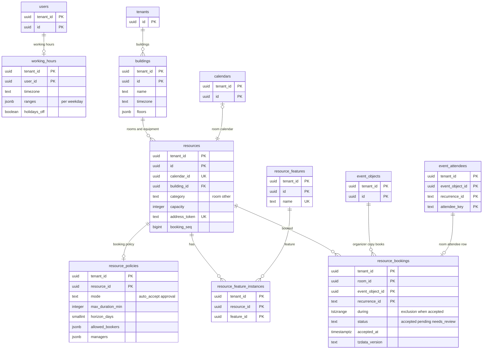

# Data model: 空き時間と会議室

[data-model.md](../data-model.md) の一部。規約は、そちらの 2 節に従う。振る舞いは [free-busy-and-scheduling.md](../free-busy-and-scheduling.md)、[rooms-and-resources.md](../rooms-and-resources.md) を正とする。決定は [ADR-0017](../../decisions/0017-freebusy-source-and-cache.md)〜[ADR-0020](../../decisions/0020-room-approval-and-needs-review.md)、[ADR-0012](../../decisions/0012-tzdb-update-recompute-and-propagation.md)。

空き時間そのものは表に持たない。人は展開の索引（`occurrences`）、会議室は予約の行（`resource_bookings`）から求め、Valkey に週ごとの区間をキャッシュする（[stores.md](stores.md) の 1 節）。

| 表・関数 | テナント | 中身 |
| --- | --- | --- |
| `working_hours` | 内 | 勤務の時間（候補の計算だけに使う） |
| 関数 `freebusy_for` | 相手のテナント | テナントをまたぐ照会（X2） |
| `buildings`・`resources`・`resource_features`・`resource_feature_instances`・`resource_policies` | 内（組織だけ） | 会議室と設備のディレクトリ |
| `resource_bookings` | 内（組織だけ） | 会議室の予約の行（排他の制約） |

## 1. ER 図



- `event_attendees ||--o| resource_bookings` は、主催者の写しの会議室の参加者の行（`kind = room`、`attendee_key = resources.id`）と、その回の予約の行の対応。辞退した回は予約の行を持たず、参加者の行の `partstat = declined` と `decline_reason` を持つ。

## 2. `working_hours`

勤務の時間（[free-busy-and-scheduling.md](../free-busy-and-scheduling.md) の 6.3 節）。既定（月〜金の 09:00〜18:00、利用者のタイムゾーン）と違う利用者だけが行を持つ。

| 列 | 型 | NULL | 既定 | 説明 |
| --- | --- | --- | --- | --- |
| `tenant_id`・`user_id` | `uuid` | NOT NULL | — | |
| `timezone` | `text` | NOT NULL | — | 勤務の時間を解くタイムゾーン |
| `ranges` | `jsonb` | NOT NULL | — | 曜日（0〜6）ごとに 1 つの `{start:"HH:MM", end:"HH:MM"}` か `null`（休み） |
| `holidays_off` | `boolean` | NOT NULL | `true` | 日本の祝日を休みにする |
| `updated_at` | `timestamptz` | NOT NULL | `now()` | |

- キー：PK `(tenant_id, user_id)`。FK → `users`。
- CHECK：`jsonb_typeof(ranges) = 'object'`。曜日ごとに範囲 1 つ（複数の範囲は MVP の後）。
- RLS：テナント。テナントをまたぐ候補の計算では読まない（勤務の時間は照会の結果に出さない）。S1 の量：約 10 万行。

## 3. 関数 `freebusy_for`

テナントをまたぐ空き時間の照会（[ADR-0017](../../decisions/0017-freebusy-source-and-cache.md)、[ADR-0004](../../decisions/0004-tenancy-and-rls.md) の X2）。

```sql
CREATE FUNCTION freebusy.freebusy_for(
  requester      jsonb,        -- {account_id, tenant_id, groups[]}（呼んだ側が確かめた主体）
  calendar_ids   uuid[],       -- 相手のテナントのカレンダー（100 まで）
  window_start   timestamptz,
  window_end     timestamptz   -- 差は 62 日まで
) RETURNS TABLE (calendar_id uuid, start_utc timestamptz, end_utc timestamptz, kind text, error text)
  LANGUAGE plpgsql SECURITY DEFINER;
```

- 呼ぶ前に、`freebusy` のロールが `SET LOCAL app.tenant_id` を相手のテナントにする。関数は相手のテナントの方針で `can(requester, "freebusy", calendar)` を求め、許したカレンダーの区間（DT-FB-001 の `busy`・`busy_unavailable`・`busy_tentative`）だけを返す。予定の ID、件数、タイトルを返さない。
- 実行できるのは `freebusy` のロールだけ。CI が X2 の名前と照らす。
- S2 では、同じ形の内部の RPC（`freebusy-rpc`）に置き換える。

## 4. 会議室と設備のディレクトリ

### 4.1 `buildings`

| 列 | 型 | NULL | 既定 | 説明 |
| --- | --- | --- | --- | --- |
| `tenant_id` | `uuid` | NOT NULL | — | |
| `id` | `uuid` | NOT NULL | `uuidv7()` | |
| `name` | `text` | NOT NULL | — | |
| `address` | `text` | NULL | — | |
| `timezone` | `text` | NOT NULL | — | 終日の予定の会議室の区間の日の境 |
| `floors` | `jsonb` | NOT NULL | `'[]'` | 並び順つきの階の名前 |
| `created_at`・`updated_at` | `timestamptz` | NOT NULL | `now()` | |

- キー：PK `(tenant_id, id)`。UK `(tenant_id, name)`。
- RLS：テナント（組織だけ）。S1 の量：約 1 万行。

### 4.2 `resources`

会議室・設備（[rooms-and-resources.md](../rooms-and-resources.md) の 4.1 節）。

| 列 | 型 | NULL | 既定 | 説明 |
| --- | --- | --- | --- | --- |
| `tenant_id` | `uuid` | NOT NULL | — | |
| `id` | `uuid` | NOT NULL | `uuidv7()` | 参加者の `attendee_key`、予約の行の `room_id` |
| `calendar_id` | `uuid` | NOT NULL | — | 会議室のカレンダー（`kind = resource`） |
| `building_id` | `uuid` | NULL | — | |
| `floor_name`・`floor_section` | `text` | NULL | — | |
| `name` | `text` | NOT NULL | — | |
| `display_name` | `text` | NOT NULL | — | 「東京本社-12F-会議室A（8）」の形で自動で作る |
| `category` | `text` | NOT NULL | `'room'` | `room`・`other` |
| `resource_type` | `text` | NULL | — | 設備の種類 |
| `capacity` | `integer` | NULL | — | |
| `description` | `text` | NULL | — | |
| `address_token` | `text` | NOT NULL | — | `r-<token>@resource.<brand>.<domain>` の `token`（アドレスの一部で秘密ではない） |
| `booking_seq` | `bigint` | NOT NULL | `0` | 予約の行が変わるたびに上げる（空き時間のキャッシュ `fbr:*` の比べ） |
| `status` | `text` | NOT NULL | `'active'` | `active`・`archived` |
| `created_at`・`updated_at` | `timestamptz` | NOT NULL | `now()` | |

- キー：PK `(tenant_id, id)`。UK `(tenant_id, calendar_id)`。UK `address_token`（全体で一意）。FK `(tenant_id, building_id)` → `buildings`、`(tenant_id, calendar_id)` → `calendars`。
- 索引：`(tenant_id, building_id, capacity)` — 会議室の検索と提案。
- CHECK：`category IN ('room','other')`、`capacity IS NULL OR capacity >= 0`、`status IN ('active','archived')`。
- RLS：テナント（組織だけ）。予約の書き込みでは `id` の順に `FOR UPDATE` でロックする。`principal_directory` に `kind = room` で入れる。S1 の量：約 1 万行（最大の組織 2,000）。

### 4.3 `resource_features`・`resource_feature_instances`

| 表 | 列 | キー |
| --- | --- | --- |
| `resource_features` | `tenant_id`、`id`、`name`（ディスプレイ、ビデオ会議の機器、ホワイトボード、車いす など）、`created_at` | PK `(tenant_id, id)`。UK `(tenant_id, name)` |
| `resource_feature_instances` | `tenant_id`、`resource_id`、`feature_id`、`quantity smallint`（既定 1） | PK `(tenant_id, resource_id, feature_id)`。FK → `resources ON DELETE CASCADE`、`resource_features` |

- 索引：`resource_feature_instances (tenant_id, feature_id)` — 設備で会議室を探す。
- RLS：テナント。S1 の量：数万行。

### 4.4 `resource_policies`

| 列 | 型 | NULL | 既定 | 説明 |
| --- | --- | --- | --- | --- |
| `tenant_id`・`resource_id` | `uuid` | NOT NULL | — | |
| `mode` | `text` | NOT NULL | `'auto_accept'` | `auto_accept`・`approval` |
| `max_duration_min` | `integer` | NOT NULL | `1440` | 15 分〜7 日 |
| `horizon_days` | `smallint` | NOT NULL | `548` | 1〜548 |
| `allowed_bookers` | `jsonb` | NOT NULL | `'[{"type":"domain"}]'` | 主体の一覧（`user`・`group`・`domain`）。既定は組織の全員 |
| `managers` | `jsonb` | NOT NULL | `'[]'` | 承認の担当（利用者・グループ） |
| `updated_by` | `uuid` | NOT NULL | — | |
| `updated_at` | `timestamptz` | NOT NULL | `now()` | |

- キー：PK `(tenant_id, resource_id)`。FK → `resources ON DELETE CASCADE`。
- CHECK：`mode IN ('auto_accept','approval')`、`max_duration_min BETWEEN 15 AND 10080`、`horizon_days BETWEEN 1 AND 548`。
- RLS：テナント。変更は監査に書く。S1 の量：約 1 万行。

## 5. `resource_bookings`

会議室の予約の行（[rooms-and-resources.md](../rooms-and-resources.md) の 4.2・6〜8 節、[ADR-0019](../../decisions/0019-room-booking-rows-and-recurring-acceptance.md)、[ADR-0020](../../decisions/0020-room-approval-and-needs-review.md)）。範囲の中の、今より後に終わる回ごとに 1 行。

| 列 | 型 | NULL | 既定 | 説明 |
| --- | --- | --- | --- | --- |
| `tenant_id` | `uuid` | NOT NULL | — | 組織 |
| `room_id` | `uuid` | NOT NULL | — | → `resources.id`（設備も含む） |
| `event_object_id` | `uuid` | NOT NULL | — | 主催者の写し |
| `recurrence_id` | `text` | NOT NULL | — | 回（単発は `''`） |
| `during` | `tstzrange` | NOT NULL | — | `tstzrange(start_utc, end_utc, '[)')`。終日の予定は建物のタイムゾーンの日の境 |
| `status` | `text` | NOT NULL | — | `accepted`・`pending`（承認の待ち）・`needs_review`（要確認） |
| `accepted_at` | `timestamptz` | NULL | — | 承諾した時刻（要確認の判定で、新しいほうを `needs_review` にする） |
| `tzdata_version` | `text` | NOT NULL | — | 区間を計算したバージョン |
| `decided_by` | `uuid` | NULL | — | 承認・辞退した管理者 |
| `review_notified_at` | `timestamptz` | NULL | — | 要確認の知らせ（72 時間後と開始の 24 時間前にもう一度） |
| `created_at`・`updated_at` | `timestamptz` | NOT NULL | `now()` | |

```sql
ALTER TABLE resource_bookings ADD CONSTRAINT resource_bookings_no_overlap
  EXCLUDE USING gist (tenant_id WITH =, room_id WITH =, during WITH &&)
  WHERE (status = 'accepted');
```

- キー：PK `(tenant_id, room_id, event_object_id, recurrence_id)`。FK `(tenant_id, room_id)` → `resources`、`(tenant_id, event_object_id)` → `event_objects`。
- 排他の制約：上（I-1）。`pending`・`needs_review` は制約の外。`INSERT ... ON CONFLICT DO NOTHING` で入らなかった回が「重なった回」（DT-ROOM-001）。
- 索引：

| 索引 | 使う問い合わせ |
| --- | --- |
| 排他の制約の GiST `(tenant_id, room_id, during) WHERE status = 'accepted'` | 重なりの判定 |
| GiST `(tenant_id, room_id, during)`（全部の状態） | 会議室の空き時間（`accepted` は `busy`、`pending` は `busy_tentative`、`needs_review` は `busy`）、会議室の提案 |
| `(tenant_id, event_object_id)` | 予定の変更・取り消しで行を作り直す、主催者の変更で付け替える |
| `(tenant_id, status) WHERE status <> 'accepted'` | 承認の待ちの一覧（管理者に毎朝）、要確認の知らせ |
| `(upper(during))` | 終わった行の削除 |

- CHECK：`status IN ('accepted','pending','needs_review')`、`(status = 'pending') = (accepted_at IS NULL)`、`NOT isempty(during)`。
- 分割：しない（D-5）。`lifecycle` が毎日、`upper(during) < now()` の行を消す。
- 切り替えの窓：tzdb の再計算の間、制約は新旧のバージョンの区間を比べる（[ADR-0012](../../decisions/0012-tzdb-update-recompute-and-propagation.md)）。`during` の `UPDATE` が制約に当たったら、`accepted_at` の新しいほうを `needs_review` にしてからやり直す。旧のバージョンの区間とだけ重なった辞退は、参加者の行の `decline_reason = conflict_tz_pending` で、窓の終わりに判定し直す。
- 書き込み：主催者の書き込みのトランザクションで、会議室の行をロックしてから書き、`resources.booking_seq` を上げる。範囲の端の移動は `expander.advance` が同じ手順で足す。
- RLS：テナント（組織だけ）。保持：終わった回の行を毎日消す。S1 の量：約 2,000 万行（会議室 1 万 × 範囲の中の未来の回 約 2,000）。
