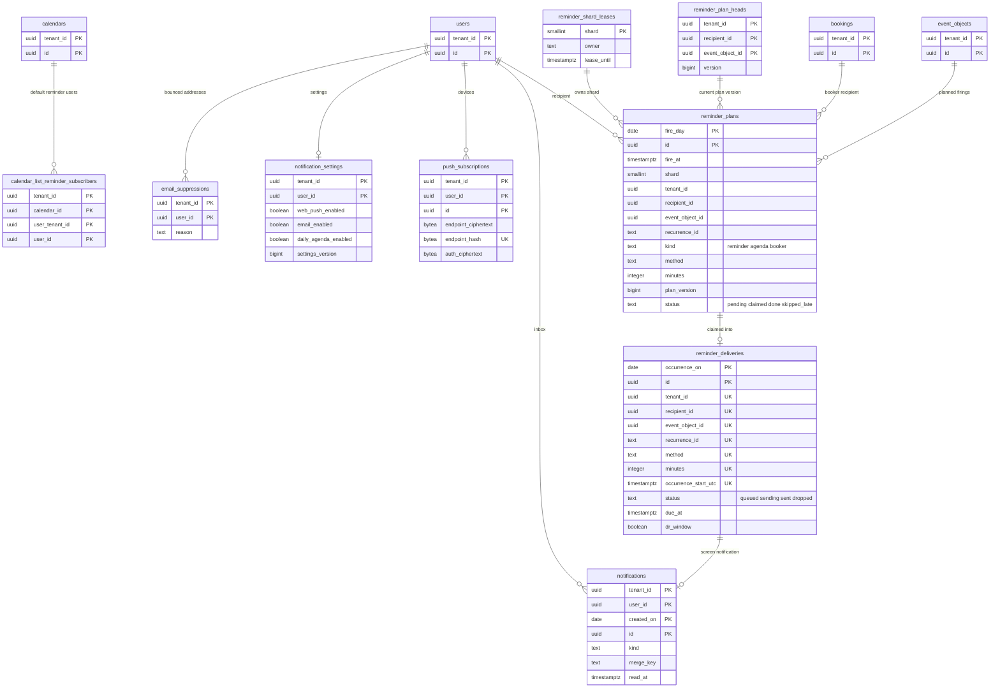

# Data model: リマインダーと通知

[data-model.md](../data-model.md) の一部。規約は、そちらの 2 節に従う。振る舞いは [reminders-and-notifications.md](../reminders-and-notifications.md)、[observability.md](../observability.md) の 5.2 節、[booking-pages.md](../booking-pages.md) の 8 節を正とする。決定は [ADR-0029](../../decisions/0029-reminder-clock-buckets-and-timer-wheel.md)〜[ADR-0031](../../decisions/0031-notification-channels-and-content.md)、[ADR-0044](../../decisions/0044-disaster-recovery-and-calendar-side-effects.md)、[ADR-0046](../../decisions/0046-sli-from-ledgers-and-delivery-tracing.md)。Web Push の本文は [stores.md](stores.md) の 7 節。

予定ごとのリマインダーの設定は `event_objects.reminders`（[events-and-recurrence.md](events-and-recurrence.md)）、カレンダーの既定は `calendar_list_entries.default_reminders`（[calendars-and-acl.md](calendars-and-acl.md)）。

| 表 | スキーマ | テナント | 中身 |
| --- | --- | --- | --- |
| `reminder_plans` | `ops` | 外 | 7 日先までの送る予定（ID と時刻だけ） |
| `reminder_plan_heads` | `ops` | 外 | （受け手, 予定オブジェクト）の計画の頭の版 |
| `reminder_shard_leases` | `ops` | 外 | 256 のシャードの借り |
| `reminder_deliveries` | `ops` | 外 | 送信の記録（一意の鍵で重複を消す） |
| `calendar_list_reminder_subscribers` | 既定 | 内（カレンダー） | 共有のカレンダーに既定のリマインダーを持つ利用者 |
| `notifications` | 既定 | 内（受け手） | 画面の通知（30 日） |
| `push_subscriptions` | 既定 | 内 | Web Push の購読 |
| `notification_settings` | 既定 | 内 | 経路と種類ごとの設定 |
| `email_suppressions` | 既定 | 内 | 利用者のメールの不達・停止 |

## 1. ER 図

- `ops` の表とテナントの表の関係は、ID の値で結ぶ意味の関係（外部キーなし）。
- `recipient_id` は、`kind = reminder`・`agenda` では利用者の ID、`kind = booker` では予約の ID（D-6）。

## 2. 計画と時計（`ops`）

時計が全テナントの行を読むため、RLS の外に置く（[ADR-0004](../../decisions/0004-tenancy-and-rls.md) の X5）。予定の中身を持たない。中身は notifier がテナントのコンテキストで読む。

### 2.1 `ops.reminder_plans`

[reminders-and-notifications.md](../reminders-and-notifications.md) の 5.1 節。

| 列 | 型 | NULL | 既定 | 説明 |
| --- | --- | --- | --- | --- |
| `fire_day` | `date` | NOT NULL | — | `fire_at` の UTC の日（分割の鍵） |
| `id` | `uuid` | NOT NULL | `uuidv7()` | |
| `fire_at` | `timestamptz(0)` | NOT NULL | — | 送る時刻（秒） |
| `shard` | `smallint` | NOT NULL | — | `hash(recipient_id) mod 256` |
| `tenant_id` | `uuid` | NOT NULL | — | |
| `user_id` | `uuid` | NULL | — | `reminder`・`agenda` の受け手 |
| `booking_id` | `uuid` | NULL | — | `booker` の受け手 |
| `recipient_id` | `uuid` | NOT NULL | 生成列 `coalesce(user_id, booking_id)` | |
| `calendar_id` | `uuid` | NULL | — | `agenda` は NULL |
| `event_object_id` | `uuid` | NOT NULL | — | `agenda` は全 0 の UUID |
| `recurrence_id` | `text` | NOT NULL | — | 回。`agenda` は利用者の現地の日付 `YYYYMMDD` |
| `occurrence_start_utc` | `timestamptz` | NOT NULL | — | 計画した時の回の開始（`agenda` は送る時刻） |
| `kind` | `text` | NOT NULL | — | `reminder`・`agenda`・`booker` |
| `method` | `text` | NOT NULL | — | `popup`・`email` |
| `minutes` | `integer` | NOT NULL | — | 0〜40,320（`agenda` は 0） |
| `plan_version` | `bigint` | NOT NULL | — | 計画した時の予定オブジェクトの版（`agenda` は `notification_settings.settings_version`） |
| `status` | `text` | NOT NULL | `'pending'` | `pending`・`claimed`・`done`・`skipped_late` |
| `claimed_at` | `timestamptz` | NULL | — | |
| `claimed_by` | `text` | NULL | — | 借りたタスク |
| `created_at` | `timestamptz` | NOT NULL | `now()` | |

- キー：PK `(fire_day, id)`。
- 索引：

| 索引 | 使う問い合わせ |
| --- | --- |
| `(shard, fire_at) WHERE status = 'pending'` | 時計の 10 秒ごとの読み直し（借りたシャードの 5 分先まで） |
| `(tenant_id, recipient_id, event_object_id) WHERE status = 'pending'` | 付け替えで `pending` の行を消す |
| `(shard, claimed_at) WHERE status = 'claimed'` | 借りを得た直後の取り戻し（60 秒を過ぎた `claimed`） |

- CHECK：`kind IN (...)`、`method IN ('popup','email')`、`status IN (...)`、`minutes BETWEEN 0 AND 40320`、`shard BETWEEN 0 AND 255`、`(kind = 'booker') = (booking_id IS NOT NULL)`、`(kind <> 'booker') = (user_id IS NOT NULL)`、`kind <> 'booker' OR method = 'email'`。
- 分割：`RANGE (fire_day)`、1 日。送った日の分割を 3 日後に落とす。
- RLS：なし（`ops`）。書くのは `reminder-planner`（`app` のロール）と `reminder_clock`。S1 の量：約 2,100 万行。

### 2.2 `ops.reminder_plan_heads`

（受け手, 予定オブジェクト）の計画の頭の版（[reminders-and-notifications.md](../reminders-and-notifications.md) の 5.3 節）。届いた `reminder.replan` の `version` が頭以下なら捨てる。

| 列 | 型 | NULL | 既定 | 説明 |
| --- | --- | --- | --- | --- |
| `tenant_id` | `uuid` | NOT NULL | — | |
| `recipient_id` | `uuid` | NOT NULL | — | 利用者か予約（D-6） |
| `event_object_id` | `uuid` | NOT NULL | — | `agenda` は全 0 の UUID |
| `version` | `bigint` | NOT NULL | — | 最後に計画した版 |
| `updated_at` | `timestamptz` | NOT NULL | `now()` | |

- キー：PK `(tenant_id, recipient_id, event_object_id)`。
- 保持：予定オブジェクトの最後の回が 7 日より前に終わった行を毎日消す。S1 の量：約 1,000 万行。

### 2.3 `ops.reminder_shard_leases`

| 列 | 型 | NULL | 既定 | 説明 |
| --- | --- | --- | --- | --- |
| `shard` | `smallint` | NOT NULL | — | 0〜255 |
| `owner` | `text` | NULL | — | タスクの ID |
| `lease_until` | `timestamptz` | NOT NULL | `'-infinity'` | 30 秒。10 秒ごとに延ばす |
| `epoch` | `bigint` | NOT NULL | `0` | 借りるたびに 1 上げる（古い持ち主の書き込みを見分ける） |

- キー：PK `shard`。最初に 256 行を作る。
- 時刻の比べはタスクの時計（NTP）で行う（[reminders-and-notifications.md](../reminders-and-notifications.md) の 6.3 節）。
- RLS：なし（`ops`）。読み書きは `reminder_clock`。

### 2.4 `ops.reminder_deliveries`

送信の記録（[reminders-and-notifications.md](../reminders-and-notifications.md) の 6.3 節、[ADR-0030](../../decisions/0030-reminder-planning-horizon-and-replan.md)、I-6）。SLI の正本（[ADR-0046](../../decisions/0046-sli-from-ledgers-and-delivery-tracing.md)。ADR の `outcome` は、この表の `status` と `reason_code` の組）。

| 列 | 型 | NULL | 既定 | 説明 |
| --- | --- | --- | --- | --- |
| `occurrence_on` | `date` | NOT NULL | — | `occurrence_start_utc` の UTC の日（分割の鍵。D-6） |
| `id` | `uuid` | NOT NULL | `uuidv7()` | SQS の `notify` で運ぶ `delivery_id` |
| `tenant_id` | `uuid` | NOT NULL | — | |
| `user_id`・`booking_id` | `uuid` | NULL | — | 受け手 |
| `recipient_id` | `uuid` | NOT NULL | 生成列 `coalesce(user_id, booking_id)` | |
| `kind` | `text` | NOT NULL | — | `reminder`・`agenda`・`booker` |
| `event_object_id` | `uuid` | NOT NULL | — | `agenda` は全 0 の UUID |
| `recurrence_id` | `text` | NOT NULL | — | |
| `method` | `text` | NOT NULL | — | `popup`・`email` |
| `minutes` | `integer` | NOT NULL | — | |
| `occurrence_start_utc` | `timestamptz` | NOT NULL | — | 回の開始（送る時に今の開始と比べる） |
| `plan_id` | `uuid` | NOT NULL | — | |
| `plan_version` | `bigint` | NOT NULL | — | 鍵に入れない |
| `status` | `text` | NOT NULL | `'queued'` | `queued`・`sending`・`sent`・`dropped` |
| `reason_code` | `text` | NULL | — | `dropped` の理由：`deleted`・`moved`・`not_applicable`・`reminder_removed`・`channel_disabled`・`dr_too_late` |
| `due_at` | `timestamptz` | NOT NULL | — | 回の通知の時刻（`fire_at`） |
| `wheel_loaded_at` | `timestamptz` | NULL | — | タイマーホイールに載った時刻（前倒しの量） |
| `started_at` | `timestamptz` | NULL | — | 配信のサービス・SES への要求の開始 |
| `handed_off_at` | `timestamptz` | NULL | — | 受け付けの応答 |
| `notification_id` | `uuid` | NULL | — | 画面の通知と Web Push の ID |
| `dr_window` | `boolean` | NOT NULL | `false` | DR の窓の中の送信（[ADR-0044](../../decisions/0044-disaster-recovery-and-calendar-side-effects.md)） |
| `created_at` | `timestamptz` | NOT NULL | `now()` | |

- キー：PK `(occurrence_on, id)`。UK `(tenant_id, recipient_id, event_object_id, recurrence_id, method, minutes, occurrence_start_utc, occurrence_on)`。`occurrence_on` は `occurrence_start_utc` から決まるので、この UK は鍵の全体の一意と同じ（D-6）。時計は `INSERT ... ON CONFLICT DO NOTHING RETURNING id` で、返った行だけを送る。
- 索引：`(status, created_at) WHERE status = 'queued'` — 毎分の `reminder-requeue`（60 秒を過ぎた `queued`）。`(occurrence_on, due_at)` — SLI の集計と毎時の送り漏れの照合。
- CHECK：列挙、`(kind = 'booker') = (booking_id IS NOT NULL)`、`status <> 'dropped' OR reason_code IS NOT NULL`。
- 分割：`RANGE (occurrence_on)`、1 日、35 日（L5 の確認待ち）。
- RLS：なし（`ops`）。読み書きは `reminder_clock`（scheduler と notifier）。読むのは `slo_aggregator`。S1 の量：1 日 約 300 万行。

## 3. 通知（テナントの表）

### 3.1 `calendar_list_reminder_subscribers`

共有のカレンダーを既定のリマインダーつきで一覧に持つ利用者（[reminders-and-notifications.md](../reminders-and-notifications.md) の 5.3 節）。共有のカレンダーの予定の変更のトランザクションで引き、`reminder.replan` を出す。カレンダーのテナントに置く（D-12）。

| 列 | 型 | NULL | 既定 | 説明 |
| --- | --- | --- | --- | --- |
| `tenant_id`・`calendar_id` | `uuid` | NOT NULL | — | カレンダー |
| `user_tenant_id`・`user_id` | `uuid` | NOT NULL | — | 一覧に持つ利用者 |
| `created_at` | `timestamptz` | NOT NULL | `now()` | |

- キー：PK `(tenant_id, calendar_id, user_tenant_id, user_id)`。FK `(tenant_id, calendar_id)` → `calendars ON DELETE CASCADE`。
- 書き込み：利用者が既定のリマインダーを付けた・外した時、ACL を失った時。同じテナントなら同じトランザクションで書く。テナントをまたぐ共有のカレンダーの行は、`shared_calendar_access` のロールでカレンダーのテナントのコンテキストで書く（ADR-0004 の X4 の経路。`release.cross-tenant-shared-writes` が無効の間は行を書かず、テナントをまたぐ共有のカレンダーの既定のリマインダーを計画しない。[data-model.md](../data-model.md) の D-31）。
- RLS：テナント（カレンダー）。S1 の量：数十万行。

### 3.2 `notifications`

画面の通知（[reminders-and-notifications.md](../reminders-and-notifications.md) の 7.2・8 節）。受け手のテナント。

| 列 | 型 | NULL | 既定 | 説明 |
| --- | --- | --- | --- | --- |
| `tenant_id`・`user_id` | `uuid` | NOT NULL | — | 受け手 |
| `created_on` | `date` | NOT NULL | — | `id` の UUIDv7 の日（分割の鍵） |
| `id` | `uuid` | NOT NULL | `uuidv7()` | Web Push の `nid` |
| `kind` | `text` | NOT NULL | — | `reminder`・`invited`・`updated`・`cancelled`・`replied`・`pending_invitations`・`room_needs_review`・`booking_created`・`booking_cancelled`・`agenda` |
| `target_kind` | `text` | NULL | — | `event`・`booking`・`room_booking` |
| `calendar_tenant_id`・`calendar_id`・`event_object_id` | `uuid` | NULL | — | 対象（中身は表示の時に `redact()` を通して読む） |
| `recurrence_id` | `text` | NULL | — | |
| `change_codes` | `text[]` | NOT NULL | `'{}'` | 変わった項目の群（`time`・`location` など。中身ではない） |
| `merge_key` | `text` | NULL | — | `<受け手>:<予定オブジェクト>`（2 分まとめる） |
| `count` | `integer` | NOT NULL | `1` | まとめた事象の数・保留の招待の数 |
| `read_at` | `timestamptz` | NULL | — | 既読 |
| `created_at` | `timestamptz` | NOT NULL | `now()` | |

- キー：PK `(tenant_id, user_id, created_on, id)`。
- 索引：`(tenant_id, user_id, created_at DESC)` — 通知の一覧。`(tenant_id, user_id, merge_key) WHERE read_at IS NULL` — まとめ。
- CHECK：`kind IN (...)`。
- 分割：`RANGE (created_on)`、1 日、30 日。
- RLS：テナント。S1 の量：1 日 約 500 万行。

### 3.3 `push_subscriptions`

Web Push の購読（[reminders-and-notifications.md](../reminders-and-notifications.md) の 7.3 節）。利用者ごとに 10 端末まで。

| 列 | 型 | NULL | 既定 | 説明 |
| --- | --- | --- | --- | --- |
| `tenant_id`・`user_id` | `uuid` | NOT NULL | — | |
| `id` | `uuid` | NOT NULL | `uuidv7()` | |
| `endpoint_ciphertext` | `bytea` | NOT NULL | — | 配信のサービスの端点（暗号文） |
| `endpoint_hash` | `bytea` | NOT NULL | — | 同じ端点の重なりを消す |
| `endpoint_host` | `text` | NOT NULL | — | 配信のサービスのホスト（egress の許可リストと照らす） |
| `p256dh` | `bytea` | NOT NULL | — | 受け手の公開鍵 |
| `auth_ciphertext` | `bytea` | NOT NULL | — | Web Push の `auth` の秘密（暗号文。D-20） |
| `vapid_key_id` | `text` | NOT NULL | — | 登録した時の VAPID の鍵 |
| `created_at` | `timestamptz` | NOT NULL | `now()` | |
| `last_success_at` | `timestamptz` | NULL | — | 90 日使われなければ消す |

- キー：PK `(tenant_id, user_id, id)`。UK `(tenant_id, endpoint_hash)`。
- RLS：テナント。保持：配信のサービスが 404・410 を返したら消す。90 日使われなければ消す。S1 の量：約 50 万行。

### 3.4 `notification_settings`

経路と種類ごとの設定（[reminders-and-notifications.md](../reminders-and-notifications.md) の 4.1・8・9 節）。既定と違う利用者だけが行を持つ。

| 列 | 型 | NULL | 既定 | 説明 |
| --- | --- | --- | --- | --- |
| `tenant_id`・`user_id` | `uuid` | NOT NULL | — | |
| `popup_enabled` | `boolean` | NOT NULL | `true` | 画面の通知 |
| `web_push_enabled` | `boolean` | NOT NULL | `true` | |
| `email_enabled` | `boolean` | NOT NULL | `true` | メールの経路の全体 |
| `email_by_kind` | `jsonb` | NOT NULL | `'{}'` | 種類ごとのメールの有効・無効（`invited`・`updated`・`cancelled`・`replied`・`reminder` など） |
| `daily_agenda_enabled` | `boolean` | NOT NULL | `false` | 毎朝の一覧（06:00） |
| `settings_version` | `bigint` | NOT NULL | `1` | 変更ごとに上げる（`agenda` の `plan_version`） |
| `updated_at` | `timestamptz` | NOT NULL | `now()` | |

- キー：PK `(tenant_id, user_id)`。FK → `users`。
- RLS：テナント。変更は `reminder.replan` を出す。S1 の量：約 20 万行。

### 3.5 `email_suppressions`

利用者のメールアドレスの不達・苦情・配信の停止（[reminders-and-notifications.md](../reminders-and-notifications.md) の 7.4 節）。外部の受け手の抑止は `imip_suppression`（[scheduling-and-itip.md](scheduling-and-itip.md) の 3.4 節）。

| 列 | 型 | NULL | 既定 | 説明 |
| --- | --- | --- | --- | --- |
| `tenant_id`・`user_id` | `uuid` | NOT NULL | — | |
| `email_hash` | `bytea` | NOT NULL | — | 止めたアドレスの SHA-256（アドレスを変えたら効かない） |
| `reason` | `text` | NOT NULL | — | `hard_bounce`・`complaint` |
| `created_at` | `timestamptz` | NOT NULL | `now()` | |

- キー：PK `(tenant_id, user_id, email_hash)`。
- CHECK：`reason IN ('hard_bounce','complaint')`。種類ごとの配信の停止（`List-Unsubscribe`）は `notification_settings.email_by_kind` に書く。
- RLS：テナント。保持：利用者がメールの経路を戻すまで。S1 の量：数万行。
