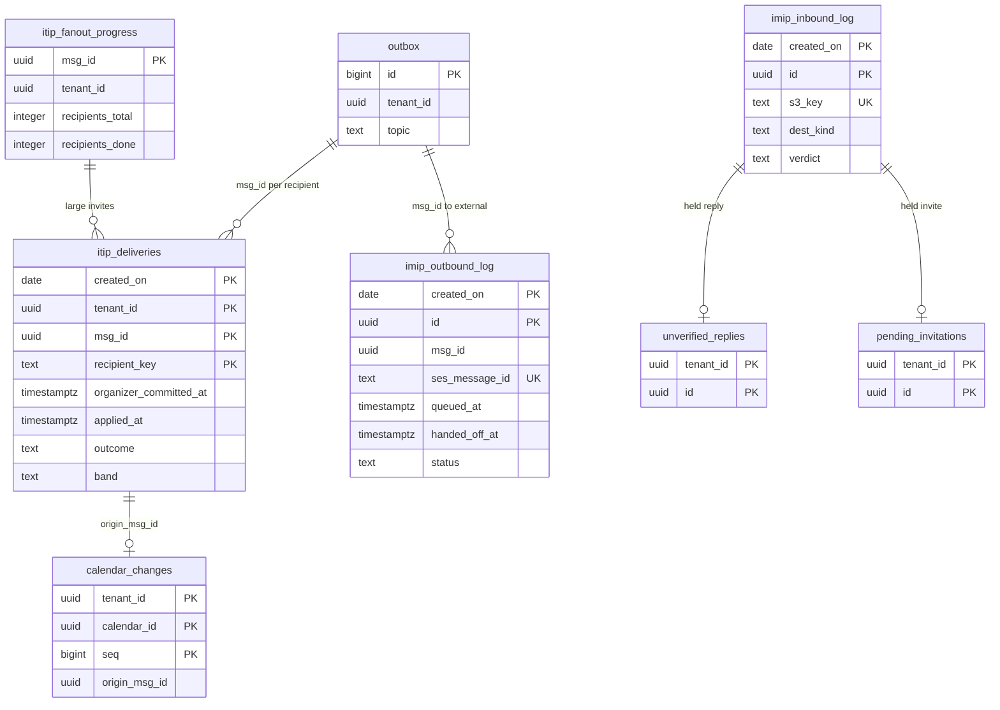

# Data model: 招待・iTIP・iMIP

[data-model.md](../data-model.md) の一部。規約は、そちらの 2 節に従う。振る舞いは [invitations-and-itip.md](../invitations-and-itip.md)、[security.md](../security.md) の 3.1 節、[observability.md](../observability.md) の 5.3 節を正とする。決定は [ADR-0006](../../decisions/0006-organizer-and-attendee-copies.md)、[ADR-0014](../../decisions/0014-itip-state-transfer-and-sequence.md)〜[ADR-0016](../../decisions/0016-group-invitation-expansion.md)、[ADR-0041](../../decisions/0041-encryption-keys-and-secret-storage.md)、[ADR-0046](../../decisions/0046-sli-from-ledgers-and-delivery-tracing.md)。

参加者の写しそのものは `event_objects`（`copy_role = attendee`）、参加者の行は `event_attendees`（[events-and-recurrence.md](events-and-recurrence.md)）。内部の iTIP のメッセージの形は [stores.md](stores.md) の 8 節。

| 表 | テナント | 中身 |
| --- | --- | --- |
| `pending_invitations` | 内（受け手） | 知らない送信元からの保留の招待 |
| `itip_dedupe` | 内（受け手） | 当てた `msg_id`（7 日） |
| `group_membership_changes` | 内 | グループのメンバーの変化 |
| `imip_addresses` | 内 | iMIP の受け口（`o-`・`u-`・`t-`） |
| `ops.imip_address_directory` | 外 | 受け口のハッシュ → テナント |
| `imip_send_quota` | 内 | 送信の上限の上書き |
| `imip_suppression` | 内 | 外部の受け手の抑止 |
| `unverified_replies` | 内 | 確かめを通らなかった返事 |
| `invite_intake_settings`・`invite_known_senders` | 内 | 招待の取り込みの方針、知っている送信元 |
| `sender_reputation` | 内 | 外部への送信の評判と自動の停止 |
| `ops.itip_deliveries`・`ops.itip_fanout_progress` | 外 | 内部の配送の記録（SLI） |
| `ops.imip_outbound_log`・`ops.imip_inbound_log` | 外 | iMIP の送受信の記録（SLI） |

## 1. ER 図

### 1.1 招待と iMIP の受け口

```mermaid
erDiagram
    users ||--o{ pending_invitations : "held invites"
    users ||--o| invite_intake_settings : "intake policy"
    users ||--o{ invite_known_senders : "known senders"
    event_objects ||--o| imip_addresses : "organizer inbox o"
    users ||--o{ imip_addresses : "forward inbox u"
    tenants ||--o{ imip_addresses : "org inbox t"
    imip_address_directory |o--|| imip_addresses : "resolver copy"
    event_objects ||--o{ unverified_replies : "held replies"
    groups ||--o{ group_membership_changes : "member changes"
    tenants ||--o{ itip_dedupe : "applied msg ids"
    tenants ||--o{ imip_send_quota : "quota overrides"
    tenants ||--o{ imip_suppression : "suppressed recipients"
    users ||--o| sender_reputation : "sender score"

    pending_invitations {
        uuid tenant_id PK
        uuid id PK
        uuid user_id FK
        text uid
        text source "internal imip_user imip_org"
        text body_s3_key
        timestamptz expires_at
    }
    invite_intake_settings {
        uuid tenant_id PK
        uuid user_id PK
        text policy "everyone known replied"
    }
    invite_known_senders {
        uuid tenant_id PK
        uuid user_id PK
        text sender_email PK
        timestamptz last_interaction_at
    }
    imip_addresses {
        uuid tenant_id PK
        bytea token_hash PK
        text kind "o u t"
        bytea token_ciphertext
        uuid event_object_id UK
        uuid user_id
        timestamptz revoked_at
    }
    imip_address_directory {
        bytea token_hash PK
        uuid tenant_id
        text kind
    }
    unverified_replies {
        uuid tenant_id PK
        uuid id PK
        uuid event_object_id FK
        text reason_code
    }
    group_membership_changes {
        uuid tenant_id PK
        bigint seq PK
        uuid group_id FK
        text member_key
        text change "added removed"
    }
    itip_dedupe {
        uuid tenant_id PK
        uuid msg_id PK
        timestamptz applied_at
    }
    imip_send_quota {
        uuid tenant_id PK
        text scope PK "user tenant"
        uuid subject_id PK
        integer limit_24h
    }
    imip_suppression {
        uuid tenant_id PK
        bytea address_hash PK
        text reason
        timestamptz expires_at
    }
    sender_reputation {
        uuid tenant_id PK
        text subject_kind PK
        uuid subject_id PK
        text state
    }
    users {
        uuid tenant_id PK
        uuid id PK
    }
    event_objects {
        uuid tenant_id PK
        uuid id PK
    }
    groups {
        uuid tenant_id PK
        uuid id PK
    }
    tenants {
        uuid id PK
    }
```

- `users ||--o| sender_reputation` は `subject_kind = user` の行。組織の全体は `subject_kind = tenant` の行。

### 1.2 配送と iMIP の記録（`ops`）

- `ops` の記録とテナントの表の間の関係は、ID の値で結ぶ意味の関係（外部キーなし）。`msg_id` は主催者のコミットから SES の事象まで運ぶ（[ADR-0046](../../decisions/0046-sli-from-ledgers-and-delivery-tracing.md)）。

## 2. 招待の受け取り

### 2.1 `pending_invitations`

知らない送信元からの招待（[invitations-and-itip.md](../invitations-and-itip.md) の 4.3・11.5 節）。写しにせず、カレンダー・空き時間・CalDAV・同期・リマインダーに出さない。

| 列 | 型 | NULL | 既定 | 説明 |
| --- | --- | --- | --- | --- |
| `tenant_id` | `uuid` | NOT NULL | — | 受け手のテナント |
| `id` | `uuid` | NOT NULL | `uuidv7()` | |
| `user_id` | `uuid` | NOT NULL | — | 受け手 |
| `source` | `text` | NOT NULL | — | `internal`（本システムの中の主催者）・`imip_user`（`u-` の受け口）・`imip_org`（`t-` の受け口） |
| `uid` | `text` | NOT NULL | — | |
| `sender_email` | `text` | NOT NULL | — | 送信元（ORGANIZER） |
| `sender_name` | `text` | NULL | — | |
| `msg_id` | `uuid` | NULL | — | 内部のメッセージ |
| `body_s3_key` | `text` | NOT NULL | — | 正規化した iCalendar（[stores.md](stores.md) の 2 節） |
| `verification` | `text` | NOT NULL | — | `verified`・`unverified`（[ADR-0015](../../decisions/0015-imip-addressing-and-trust.md) の段 3・4） |
| `status` | `text` | NOT NULL | `'pending'` | `pending`・`accepted`・`discarded` |
| `received_at` | `timestamptz` | NOT NULL | `now()` | |
| `expires_at` | `timestamptz` | NOT NULL | `now() + interval '30 days'` | |

- キー：PK `(tenant_id, id)`。UK `(tenant_id, user_id, uid) WHERE status = 'pending'`（同じ予定の新しい招待は行を置き換える）。
- 索引：`(tenant_id, user_id, received_at DESC) WHERE status = 'pending'` — 保留の一覧と件数の通知。`(tenant_id, expires_at)` — 期限の削除。
- CHECK：列挙。
- RLS：テナント。受けたら写しを作り（`packages/writer`）、監査に書く。保持：30 日（L5 の確認待ち）。S1 の量：数十万行。

### 2.2 `itip_dedupe`

受け手のテナントで当てた内部のメッセージ（[invitations-and-itip.md](../invitations-and-itip.md) の 5 節、I-11）。

| 列 | 型 | NULL | 既定 | 説明 |
| --- | --- | --- | --- | --- |
| `tenant_id` | `uuid` | NOT NULL | — | 受け手のテナント |
| `msg_id` | `uuid` | NOT NULL | — | |
| `recipient_key` | `text` | NOT NULL | — | 受け手（アカウントの ID か会議室の ID） |
| `applied_at` | `timestamptz` | NOT NULL | `now()` | |

- キー：PK `(tenant_id, msg_id, recipient_key)`。`itip-delivery` は当てるトランザクションで `INSERT ... ON CONFLICT DO NOTHING` し、入らなければ捨てる。
- 索引：`(applied_at)` — 7 日の削除（`msg_id` の UUIDv7 の時刻でもよい）。
- RLS：テナント（`itip_delivery` が受け手のコンテキストで書く）。保持：7 日。S1 の量：約 9 億行（1 日 1.3 億 × 7）。行が小さい（約 60 B）ので 60 GB 以下。

### 2.3 `group_membership_changes`

グループのメンバーの変化（[invitations-and-itip.md](../invitations-and-itip.md) の 10.2 節、[ADR-0016](../../decisions/0016-group-invitation-expansion.md)）。`group-invite-sync` が 15 分ごとに読む。

| 列 | 型 | NULL | 既定 | 説明 |
| --- | --- | --- | --- | --- |
| `tenant_id` | `uuid` | NOT NULL | — | |
| `seq` | `bigint` | NOT NULL | IDENTITY | 書いた順 |
| `group_id` | `uuid` | NOT NULL | — | 変わったグループ（入れ子の親は `group-invite-sync` が展開する） |
| `member_key` | `text` | NOT NULL | — | 利用者のアカウントの ID か、入れ子のグループの ID |
| `change` | `text` | NOT NULL | — | `added`・`removed` |
| `created_at` | `timestamptz` | NOT NULL | `now()` | |
| `processed_at` | `timestamptz` | NULL | — | 反映した時刻 |

- キー：PK `(tenant_id, seq)`。FK `(tenant_id, group_id)` → `groups`。
- 索引：`(tenant_id, seq) WHERE processed_at IS NULL` — 未処理の変化。
- CHECK：`change IN ('added','removed')`。
- RLS：テナント。保持：反映の 7 日後に消す。S1 の量：数万行。

## 3. iMIP の受け口と送信

### 3.1 `imip_addresses`

iMIP の受け口（[invitations-and-itip.md](../invitations-and-itip.md) の 11.1 節）。`o-<token>`（予定ごと）、`u-<token>`（利用者の転送先）、`t-<token>`（組織の受け口）。

| 列 | 型 | NULL | 既定 | 説明 |
| --- | --- | --- | --- | --- |
| `tenant_id` | `uuid` | NOT NULL | — | |
| `token_hash` | `bytea` | NOT NULL | — | `token`（128 ビットの base32）の SHA-256 |
| `token_ciphertext` | `bytea` | NOT NULL | — | 送るたびに ORGANIZER を作るための暗号文（`app-secrets`。D-16） |
| `kind` | `text` | NOT NULL | — | `o`・`u`・`t` |
| `event_object_id` | `uuid` | NULL | — | `o`：主催者の写し |
| `user_id` | `uuid` | NULL | — | `u`：利用者 |
| `created_at` | `timestamptz` | NOT NULL | `now()` | |
| `revoked_at` | `timestamptz` | NULL | — | 予定の削除、利用者の作り直し |

- キー：PK `(tenant_id, token_hash)`。UK `(tenant_id, event_object_id) WHERE kind = 'o' AND revoked_at IS NULL`（I-21）。UK `(tenant_id, user_id) WHERE kind = 'u' AND revoked_at IS NULL`。UK `(tenant_id) WHERE kind = 't' AND revoked_at IS NULL`。
- CHECK：`kind IN ('o','u','t')`、`(kind = 'o') = (event_object_id IS NOT NULL)`、`(kind = 'u') = (user_id IS NOT NULL)`。
- RLS：テナント。行を書くトランザクションで `ops.imip_address_directory` にも書く。主催者の変更では、新しい主催者の写しに新しい `o` の行を作る（[invitations-and-itip.md](../invitations-and-itip.md) の 9 節）。古い行は `revoked_at` を立てて 90 日残し、遅れて届く返事を、同じテナントの同じ UID の主催者の写しへ回す。
- 保持：予定の削除の 90 日後に消す（遅れて届く返事のため）。S1 の量：約 3,000 万行（外部の参加者のいる主催者の写し）。

### 3.2 `ops.imip_address_directory`

受け口のハッシュ → テナント（X6）。S2 からディレクトリのクラスタ（[tenants-accounts-and-orgs.md](tenants-accounts-and-orgs.md) の 7 節）。

| 列 | 型 | NULL | 既定 | 説明 |
| --- | --- | --- | --- | --- |
| `token_hash` | `bytea` | NOT NULL | — | |
| `tenant_id` | `uuid` | NOT NULL | — | |
| `kind` | `text` | NOT NULL | — | `o`・`u`・`t` |
| `revoked_at` | `timestamptz` | NULL | — | |

- キー：PK `token_hash`。
- RLS：なし（`ops`）。読むのは `resolver`（`imip-inbound` の結果を当てる `worker-itip-apply`）。書くのは `app`（`imip_addresses` を書くトランザクションの中）。S1 の量：`imip_addresses` と同じ。

### 3.3 `imip_send_quota`

送信の上限の上書き（[invitations-and-itip.md](../invitations-and-itip.md) の 11.2 節）。数え（24 時間の数）は Valkey（[stores.md](stores.md) の 1 節）。既定の上限は `packages/itip` の定数で、上書きがあるものだけ行を持つ。

| 列 | 型 | NULL | 既定 | 説明 |
| --- | --- | --- | --- | --- |
| `tenant_id` | `uuid` | NOT NULL | — | |
| `scope` | `text` | NOT NULL | — | `user`（主催者）・`tenant`（組織） |
| `subject_id` | `uuid` | NOT NULL | — | 利用者の ID か `tenant_id` |
| `limit_24h` | `integer` | NOT NULL | — | 外部の受け手の数 |
| `reason` | `text` | NOT NULL | — | 引き上げの理由 |
| `set_by` | `text` | NOT NULL | — | 運用者の ID（プラットフォームの監査に残す） |
| `set_at` | `timestamptz` | NOT NULL | `now()` | |
| `expires_at` | `timestamptz` | NULL | — | |

- キー：PK `(tenant_id, scope, subject_id)`。
- CHECK：`scope IN ('user','tenant')`、`limit_24h > 0`。
- RLS：テナント。S1 の量：数百行。

### 3.4 `imip_suppression`

外部の受け手の抑止（Bounce 30 日、Complaint 無期限）。

| 列 | 型 | NULL | 既定 | 説明 |
| --- | --- | --- | --- | --- |
| `tenant_id` | `uuid` | NOT NULL | — | 送ったテナント |
| `address_hash` | `bytea` | NOT NULL | — | 正規化した受け手のアドレスの SHA-256 |
| `reason` | `text` | NOT NULL | — | `bounce`・`complaint` |
| `created_at` | `timestamptz` | NOT NULL | `now()` | |
| `expires_at` | `timestamptz` | NULL | — | `bounce` は 30 日、`complaint` は NULL |

- キー：PK `(tenant_id, address_hash)`。
- 索引：`(expires_at) WHERE expires_at IS NOT NULL` — 期限の削除。
- CHECK：`reason IN ('bounce','complaint')`、`(reason = 'complaint') = (expires_at IS NULL)`。
- RLS：テナント。予約者のアドレスも同じ表に入れる（[booking-pages.md](../booking-pages.md) の 8 節）。S1 の量：数十万行。

### 3.5 `unverified_replies`

確かめ（[ADR-0015](../../decisions/0015-imip-addressing-and-trust.md) の段 3・4）を通らなかった返事（[invitations-and-itip.md](../invitations-and-itip.md) の 11.4 節）。主催者が手で受けられる。

| 列 | 型 | NULL | 既定 | 説明 |
| --- | --- | --- | --- | --- |
| `tenant_id` | `uuid` | NOT NULL | — | 主催者のテナント |
| `id` | `uuid` | NOT NULL | `uuidv7()` | |
| `event_object_id` | `uuid` | NOT NULL | — | 主催者の写し |
| `recurrence_id` | `text` | NOT NULL | `''` | |
| `attendee_email` | `text` | NOT NULL | — | 返事の ATTENDEE |
| `partstat` | `text` | NOT NULL | — | 返事の出欠 |
| `comment` | `text` | NULL | — | |
| `reason_code` | `text` | NOT NULL | — | `from_mismatch`・`auth_failed`・`not_invited` |
| `inbound_log_id` | `uuid` | NOT NULL | — | → `ops.imip_inbound_log.id`（生のメール） |
| `received_at` | `timestamptz` | NOT NULL | `now()` | |
| `resolved_at` | `timestamptz` | NULL | — | |
| `resolved_by` | `uuid` | NULL | — | 受けた主催者（監査に書く） |
| `resolution` | `text` | NULL | — | `accepted`・`discarded` |

- キー：PK `(tenant_id, id)`。FK `(tenant_id, event_object_id)` → `event_objects ON DELETE CASCADE`。
- 索引：`(tenant_id, event_object_id) WHERE resolved_at IS NULL` — 予定の画面の「未確認の返事」。
- RLS：テナント。保持：30 日（L5 の確認待ち）。S1 の量：数万行。

### 3.6 `invite_intake_settings`・`invite_known_senders`

招待の取り込みの方針と、知っている送信元（[invitations-and-itip.md](../invitations-and-itip.md) の 11.5 節）。

`invite_intake_settings`（既定と違う利用者だけ）：

| 列 | 型 | NULL | 既定 | 説明 |
| --- | --- | --- | --- | --- |
| `tenant_id`・`user_id` | `uuid` | NOT NULL | — | |
| `policy` | `text` | NOT NULL | `'known'` | `everyone`・`known`・`replied` |
| `allowlist` | `text[]` | NOT NULL | `'{}'` | 許すアドレスか `@<domain>`（500 件） |
| `updated_at` | `timestamptz` | NOT NULL | `now()` | |

`invite_known_senders`：

| 列 | 型 | NULL | 既定 | 説明 |
| --- | --- | --- | --- | --- |
| `tenant_id`・`user_id` | `uuid` | NOT NULL | — | |
| `sender_email` | `text` | NOT NULL | — | 正規化したアドレス |
| `last_interaction_at` | `timestamptz` | NOT NULL | `now()` | 招待を送った・受けた時刻 |

- キー：PK `(tenant_id, user_id)`、PK `(tenant_id, user_id, sender_email)`。
- CHECK：`policy IN ('everyone','known','replied')`、`cardinality(allowlist) <= 500`。
- RLS：テナント。`invite_known_senders` は、招待の送受信のトランザクションで `INSERT ... ON CONFLICT DO UPDATE SET last_interaction_at`。同じ組織の人は行を持たず、常に知っている送信元とする。保持：365 日を過ぎた行を消す。S1 の量：約 3,000 万行。

### 3.7 `sender_reputation`

外部への送信の評判と自動の停止（[security.md](../security.md) の 3.1 節）。

| 列 | 型 | NULL | 既定 | 説明 |
| --- | --- | --- | --- | --- |
| `tenant_id` | `uuid` | NOT NULL | — | |
| `subject_kind` | `text` | NOT NULL | — | `user`・`tenant` |
| `subject_id` | `uuid` | NOT NULL | — | |
| `external_recipients_7d` | `integer` | NOT NULL | `0` | 直近 7 日の外部の受け手の数（日次の集計） |
| `complaints_30d`・`reports_30d`・`bounces_30d` | `integer` | NOT NULL | `0` | |
| `state` | `text` | NOT NULL | `'ok'` | `ok`・`watch`・`suspended` |
| `suspended_until` | `timestamptz` | NULL | — | 自動の停止 |
| `updated_at` | `timestamptz` | NOT NULL | `now()` | |

- キー：PK `(tenant_id, subject_kind, subject_id)`。
- 索引：`(state) WHERE state <> 'ok'` — 運用の画面（テナントを順に回して集計する）。
- CHECK：列挙。
- RLS：テナント。停止と解除は監査に書く。S1 の量：外部へ送った主催者だけ、約 20 万行。

## 4. 配送と iMIP の記録（`ops`）

SLI を全件で数える業務の記録（[ADR-0046](../../decisions/0046-sli-from-ledgers-and-delivery-tracing.md)）。ID・時刻・結果・理由のコードだけを持つ（[ADR-0004](../../decisions/0004-tenancy-and-rls.md)）。読むのは `slo_aggregator`（X9）。

### 4.1 `ops.itip_deliveries`

| 列 | 型 | NULL | 既定 | 説明 |
| --- | --- | --- | --- | --- |
| `created_on` | `date` | NOT NULL | — | `msg_id` の UUIDv7 の UTC の日（分割の鍵。D-6） |
| `tenant_id` | `uuid` | NOT NULL | — | 主催者のテナント |
| `msg_id` | `uuid` | NOT NULL | — | |
| `recipient_key` | `text` | NOT NULL | — | 受け手（`<tenant_id>:<account_id>`、会議室は `<tenant_id>:r:<resource_id>`） |
| `method` | `text` | NOT NULL | — | `REQUEST`・`CANCEL`・`REPLY`・`REFRESH`・`X-MODIFY` |
| `band` | `text` | NOT NULL | — | `le200`・`gt200`（受け手の数の帯） |
| `organizer_committed_at` | `timestamptz` | NOT NULL | — | |
| `applied_at` | `timestamptz` | NULL | — | |
| `outcome` | `text` | NULL | — | `applied`・`stale_dropped`・`held_pending`・`failed` |
| `attempts` | `smallint` | NOT NULL | `0` | |

- キー：PK `(created_on, tenant_id, msg_id, recipient_key)`。
- 索引：PK — `msg_id` の追跡。`(created_on, applied_at)` は持たず、`slo_aggregator` は 1 分ごとに直近の分割を `applied_at` の範囲で読む（分割の中の順の読み出し）。
- 分割：`RANGE (created_on)`、1 日。14 日（その後の日ごとの集計は AMP に 90 日）。
- RLS：なし（`ops`）。書くのは `itip_delivery`（outbox を読んで受け手ごとの行を作り、当てたら `applied_at`）。S1 の量：1 日 約 1.3 億行 × 70 B × 14 ≒ 130 GB。

### 4.2 `ops.itip_fanout_progress`

200 人を超える招待の進み。

| 列 | 型 | NULL | 既定 | 説明 |
| --- | --- | --- | --- | --- |
| `msg_id` | `uuid` | NOT NULL | — | |
| `tenant_id` | `uuid` | NOT NULL | — | |
| `recipients_total`・`recipients_done` | `integer` | NOT NULL | `0` | |
| `slowest_lag_ms` | `integer` | NULL | — | 最も遅い受け手の遅れ |
| `created_at` | `timestamptz` | NOT NULL | `now()` | |
| `finished_at` | `timestamptz` | NULL | — | |

- キー：PK `msg_id`。
- RLS：なし（`ops`）。保持：14 日。S1 の量：1 日 数千行。

### 4.3 `ops.imip_outbound_log`

| 列 | 型 | NULL | 既定 | 説明 |
| --- | --- | --- | --- | --- |
| `created_on` | `date` | NOT NULL | — | 分割の鍵 |
| `id` | `uuid` | NOT NULL | `uuidv7()` | |
| `tenant_id` | `uuid` | NOT NULL | — | |
| `msg_id` | `uuid` | NOT NULL | — | |
| `event_object_id` | `uuid` | NOT NULL | — | |
| `recipient_hash` | `bytea` | NOT NULL | — | 受け手のアドレスの SHA-256 |
| `method` | `text` | NOT NULL | — | |
| `ses_message_id` | `text` | NULL | — | |
| `status` | `text` | NOT NULL | `'queued'` | `queued`・`throttled`・`suppressed`・`handed_off`・`failed`・`delivered`・`bounced`・`complained` |
| `queued_at` | `timestamptz` | NOT NULL | `now()` | |
| `handed_off_at` | `timestamptz` | NULL | — | |
| `last_event_at` | `timestamptz` | NULL | — | SES の配達・Bounce・Complaint |

- キー：PK `(created_on, id)`。UK `(created_on, ses_message_id)`。
- 索引：`(msg_id)` — 追跡。`ses_message_id` は SES のメッセージのタグの `msg_id` と `created_on` から引く。
- 分割：`RANGE (created_on)`、1 日、90 日。
- RLS：なし（`ops`）。S1 の量：1 日 約 500 万行。

### 4.4 `ops.imip_inbound_log`

| 列 | 型 | NULL | 既定 | 説明 |
| --- | --- | --- | --- | --- |
| `created_on` | `date` | NOT NULL | — | 分割の鍵 |
| `id` | `uuid` | NOT NULL | `uuidv7()` | |
| `s3_key` | `text` | NOT NULL | — | 生のメール（[stores.md](stores.md) の 2 節） |
| `received_at` | `timestamptz` | NOT NULL | — | S3 に保存した時刻 |
| `dest_kind` | `text` | NULL | — | `o`・`u`・`t`、解けなければ NULL |
| `tenant_id` | `uuid` | NULL | — | 解いたテナント |
| `verdict` | `text` | NULL | — | `pass`・`unverified`・`dropped` |
| `reason_code` | `text` | NULL | — | `too_large`・`parse_error`・`unknown_address`・`from_mismatch`・`auth_failed`・`unsupported_recurrence` など |
| `decided_at`・`applied_at` | `timestamptz` | NULL | — | |

- キー：PK `(created_on, id)`。UK `(created_on, s3_key)`。
- 分割：`RANGE (created_on)`、1 日、30 日（生のメールと同じ。L5 の確認待ち）。
- RLS：なし（`ops`）。書くのは `worker-itip-apply` だけ（`worker-imip-inbound` は DB に書けないので、判定と時刻を SQS のメッセージで渡す。[infrastructure.md](../infrastructure.md) の 3 節）。S1 の量：1 日 約 430 万行。
