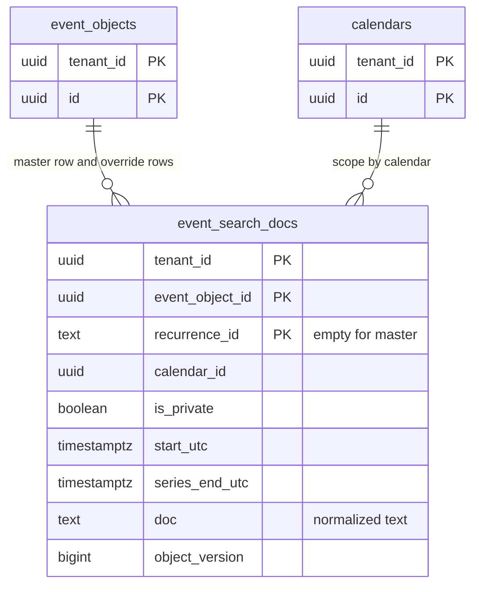

# Data model: 検索

[data-model.md](../data-model.md) の一部。規約は、そちらの 2 節に従う。振る舞いは [search.md](../search.md) を正とする。決定は [ADR-0034](../../decisions/0034-search-pg-bigm-acl-aware.md)、[ADR-0021](../../decisions/0021-effective-role-and-redact-table.md)。

検索の表は、予定オブジェクトから作り直せる写しである。`indexer` が outbox の `search.upsert`・`search.delete` から非同期に書く（変更から p95 30 秒）。ディレクトリの検索は `users` の `gin_bigm_ops` の索引で行う（[tenants-accounts-and-orgs.md](tenants-accounts-and-orgs.md) の 2.5 節）。

## 1. ER 図

## 2. `event_search_docs`

[search.md](../search.md) の 4.2 節。1 行はマスター（`recurrence_id = ''`）か上書き（その回の VEVENT の全体）。

| 列 | 型 | NULL | 既定 | 説明 |
| --- | --- | --- | --- | --- |
| `tenant_id` | `uuid` | NOT NULL | — | |
| `event_object_id` | `uuid` | NOT NULL | — | |
| `recurrence_id` | `text` | NOT NULL | — | マスターは `''` |
| `calendar_id` | `uuid` | NOT NULL | — | `searchScope(actor)` の集合で絞る |
| `is_private` | `boolean` | NOT NULL | — | 公開範囲が `private`・`confidential`（`default` はカレンダーの既定で解いた値） |
| `start_utc` | `timestamptz` | NOT NULL | — | マスターは最初の回、上書きはその回 |
| `series_end_utc` | `timestamptz` | NULL | — | 終わりのない系列は NULL |
| `doc` | `text` | NOT NULL | — | `packages/search-normalize` で正規化した文字列（タイトル、場所、説明の先頭 2 KiB、参加者・主催者の名前とアドレス） |
| `object_version` | `bigint` | NOT NULL | — | 写した予定オブジェクトのバージョン（遅れの計測、古い更新の捨て） |
| `updated_at` | `timestamptz` | NOT NULL | `now()` | |

- キー：PK `(tenant_id, event_object_id, recurrence_id)`。外部キーなし（写し）。
- 索引：

| 索引 | 使う問い合わせ |
| --- | --- |
| GIN `(doc gin_bigm_ops)` | 部分一致：`tenant_id = $1 AND doc LIKE '%' || $q || '%' AND (calendar_id = ANY($full) OR (calendar_id = ANY($public_only) AND NOT is_private))` |
| `(tenant_id, calendar_id, start_utc)` | 日付で絞る、新しい順に並べる |

- CHECK：`octet_length(doc) <= 16384`。
- 中身の規則：`doc` は `redact()` の `FULL` の段で見える文字列だけ（I-15）。会議の URL、添付の URL、`x_props` を入れない。取り消した予定、`hidden`・`cancelled` の写し、保留の招待は行を消す。結果は `redact()` で確かめ直す。
- 書き込み：`indexer` は `object_version` が今の行より新しいときだけ書く（`INSERT ... ON CONFLICT DO UPDATE ... WHERE event_search_docs.object_version < EXCLUDED.object_version`）。
- 分割：`HASH (tenant_id)`、16。問い合わせは `tenant_id = $1` を明示し、分割の刈り込みを効かせる。
- RLS：テナント。保持：予定オブジェクトと同じ。S1 の量：約 3.3 億行、160〜240 GB（`search-bigm-poc` で測る）。
