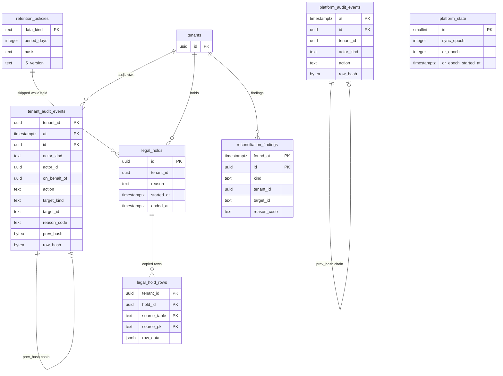

# Data model: 監査・保持・全体の状態

[data-model.md](../data-model.md) の一部。規約は、そちらの 2 節に従う。振る舞いは [security.md](../security.md) の 6・8・9 節、[infrastructure.md](../infrastructure.md) の 6.3 節、[observability.md](../observability.md) の 4 節を正とする。決定は [ADR-0042](../../decisions/0042-audit-log-and-data-lifecycle.md)、[ADR-0044](../../decisions/0044-disaster-recovery-and-calendar-side-effects.md)、[ADR-0022](../../decisions/0022-delegation-and-acting-on-behalf.md)。

| 表 | テナント | 中身 |
| --- | --- | --- |
| `tenant_audit_events` | 内（追記だけ） | テナントの監査（1 年） |
| `legal_hold_rows` | 内 | 法的な保全で落とす分割から写した行 |
| `ops.platform_audit_events` | 外（追記だけ） | プラットフォームの監査 |
| `ops.retention_policies` | 外 | 保持の期間の正本 |
| `ops.legal_holds` | 外 | 法的な保全 |
| `ops.platform_state` | 外 | 全体の状態（`sync_epoch`、DR の記録） |
| `ops.reconciliation_findings` | 外 | 照合が見つけた不一致 |

## 1. ER 図

## 2. 監査

### 2.1 `tenant_audit_events`

[ADR-0042](../../decisions/0042-audit-log-and-data-lifecycle.md) の行。予定のタイトル・場所・本文・参加者のメールアドレスを書かない（ID と理由のコードだけ）。

| 列 | 型 | NULL | 既定 | 説明 |
| --- | --- | --- | --- | --- |
| `tenant_id` | `uuid` | NOT NULL | — | |
| `at` | `timestamptz` | NOT NULL | `now()` | 分割の鍵 |
| `id` | `uuid` | NOT NULL | `uuidv7()` | |
| `actor_kind` | `text` | NOT NULL | — | `user`・`admin`・`app`（OAuth のアプリ）・`system`・`operator` |
| `actor_id` | `uuid` | NULL | — | 実際に操作した人（代理の人を含む） |
| `on_behalf_of` | `uuid` | NULL | — | 代わりに操作した相手（[ADR-0022](../../decisions/0022-delegation-and-acting-on-behalf.md)） |
| `action` | `text` | NOT NULL | — | `acl.grant`・`acl.revoke`・`policy.update`・`admin.role.grant`・`admin.event_access.read`・`room.approve`・`app_password.create`・`oauth_app.create`・`webhook.create`・`ics_publish.rotate`・`reply.accept_unverified`・`invite.accept_pending`・`export.create`・`sso.update`・`scim.update` など |
| `target_kind` | `text` | NOT NULL | — | `calendar`・`event_object`・`user`・`group`・`resource`・`app`・`channel` など |
| `target_id` | `text` | NOT NULL | — | 対象の ID |
| `changed_fields` | `text[]` | NOT NULL | `'{}'` | 変えた項目の名前（値は書かない） |
| `reason_code` | `text` | NULL | — | |
| `request_id` | `text` | NULL | — | |
| `ip_hash` | `bytea` | NULL | — | IP の HMAC |
| `prev_hash` | `bytea` | NOT NULL | — | 同じテナント・同じ日の前の行の `row_hash`（日の最初は前日の最後） |
| `row_hash` | `bytea` | NOT NULL | — | `SHA-256(prev_hash ‖ 行の正規化した形)` |

- キー：PK `(tenant_id, at, id)`。
- 索引：`(tenant_id, at DESC)` — 管理の画面と書き出し。`(tenant_id, target_kind, target_id, at)` — 対象ごとの履歴。
- 書き込み：操作と同じトランザクション（I-19）。連鎖の前の行は、テナントの日ごとの行のロック（`pg_advisory_xact_lock(hash(tenant_id, 日))`）の中で読む。
- 分割：`RANGE (at)`、1 か月、1 年。1 時間ごとに log-archive へ写し、日の終わりの `row_hash` を写す（[stores.md](stores.md) の 2 節）。
- RLS：テナント。書き手のロールには `INSERT` だけ。読むのは組織の `auditor`・`super_admin`（個人のテナントは本人）。S1 の量：1 日 約 100 万行（仮定）。

### 2.2 `ops.platform_audit_events`

運用者の JIT のアクセス、break-glass、テナントをまたぐ関数の呼び出しの集計、tzdb のバージョンの採用、`sync_epoch` の更新、データの直接の修正、テナントの削除、送信の上限の変更。

| 列 | 型 | NULL | 既定 | 説明 |
| --- | --- | --- | --- | --- |
| `at` | `timestamptz` | NOT NULL | `now()` | 分割の鍵 |
| `id` | `uuid` | NOT NULL | `uuidv7()` | |
| `tenant_id` | `uuid` | NULL | — | 関わるテナント（全体の操作は NULL） |
| `actor_kind` | `text` | NOT NULL | — | `operator`・`service`・`workflow` |
| `actor_id` | `text` | NOT NULL | — | 運用者の ID かサービスの名前 |
| `action` | `text` | NOT NULL | — | `jit.grant`・`break_glass`・`cross_tenant.summary`・`tzdata.activate`・`sync_epoch.bump`・`data.fix`・`tenant.purge`・`quota.override` など |
| `target_kind`・`target_id` | `text` | NULL | — | |
| `detail` | `jsonb` | NOT NULL | `'{}'` | 数と ID だけ（予定の中身を入れない） |
| `reason_code` | `text` | NULL | — | |
| `prev_hash`・`row_hash` | `bytea` | NOT NULL | — | 日ごとの連鎖（全体で 1 本） |

- キー：PK `(at, id)`。
- 索引：`(tenant_id, at) WHERE tenant_id IS NOT NULL`。
- 分割：`RANGE (at)`、1 か月。DB は 1 年、log-archive に 5 年（L5 の確認待ち）。
- RLS：なし（`ops`）。全ロールが追記だけ。読むのはセキュリティの担当。S1 の量：1 日 数万行。

### 2.3 `legal_hold_rows`

法的な保全の間に落とす分割の、保全のテナントの行の写し（[ADR-0042](../../decisions/0042-audit-log-and-data-lifecycle.md)、D-22）。

| 列 | 型 | NULL | 既定 | 説明 |
| --- | --- | --- | --- | --- |
| `tenant_id` | `uuid` | NOT NULL | — | |
| `hold_id` | `uuid` | NOT NULL | — | → `ops.legal_holds.id` |
| `source_table` | `text` | NOT NULL | — | `calendar_changes`・`tenant_audit_events`・`push_deliveries`・`notifications`、`ops` の記録（`itip_deliveries` など） |
| `source_pk` | `text` | NOT NULL | — | 元の主キーの正規化した文字列 |
| `row_data` | `jsonb` | NOT NULL | — | 元の行 |
| `copied_at` | `timestamptz` | NOT NULL | `now()` | |

- キー：PK `(tenant_id, hold_id, source_table, source_pk)`。
- 書き込み：`partition-maintenance` が分割を落とす前に、`legal_holds` の有効なテナントの行を写す。
- RLS：テナント。保持：保全の終わりの後、元の表の保持の期間が過ぎたら消す。S1 の量：平常は 0。

## 3. 保持と保全（`ops`）

### 3.1 `ops.retention_policies`

保持の期間の正本（[ADR-0042](../../decisions/0042-audit-log-and-data-lifecycle.md)）。CI が Terraform の S3 のライフサイクルと比べる。

| 列 | 型 | NULL | 既定 | 説明 |
| --- | --- | --- | --- | --- |
| `data_kind` | `text` | NOT NULL | — | `calendar_changes`・`trash`・`occurrences`・`imip_raw`・`pending_invitations`・`unverified_replies`・`imip_outbound_log`・`itip_deliveries`・`sync_token_uses`・`reminder_deliveries`・`ics_files`・`push_subscriptions`・`tenant_audit_events`・`audit_archive`・`booking_pii` など |
| `store` | `text` | NOT NULL | — | `aurora`・`s3`・`cloudwatch`・`client` |
| `period_days` | `integer` | NULL | — | NULL は「決めるまで消さない」（`booking_pii`） |
| `basis` | `text` | NOT NULL | — | 根拠（ADR、法務の結論） |
| `l5_version` | `text` | NULL | — | 法務の L5 の結論のバージョン（それまで NULL で、既定の値） |
| `updated_at` | `timestamptz` | NOT NULL | `now()` | |

- キー：PK `data_kind`。
- RLS：なし（`ops`）。書くのは `maintenance`（マイグレーションの種の値と、L5 の後の更新）。S1 の量：数十行。

### 3.2 `ops.legal_holds`

| 列 | 型 | NULL | 既定 | 説明 |
| --- | --- | --- | --- | --- |
| `id` | `uuid` | NOT NULL | `uuidv7()` | |
| `tenant_id` | `uuid` | NOT NULL | — | |
| `reason` | `text` | NOT NULL | — | 依頼の識別（中身は法務の記録） |
| `requested_by` | `text` | NOT NULL | — | |
| `started_at` | `timestamptz` | NOT NULL | `now()` | |
| `ended_at` | `timestamptz` | NULL | — | |

- キー：PK `id`。
- 索引：`(tenant_id) WHERE ended_at IS NULL` — `lifecycle` と `tenant-purge` が飛ばすテナント。
- RLS：なし（`ops`）。書くのは `maintenance`（法務の指示）。プラットフォームの監査に書く。S1 の量：数件。

## 4. 全体の状態と照合（`ops`）

### 4.1 `ops.platform_state`

全体で 1 行（[infrastructure.md](../infrastructure.md) の 6.3 節、[ADR-0044](../../decisions/0044-disaster-recovery-and-calendar-side-effects.md)）。

| 列 | 型 | NULL | 既定 | 説明 |
| --- | --- | --- | --- | --- |
| `id` | `smallint` | NOT NULL | `1` | |
| `sync_epoch` | `integer` | NOT NULL | `1` | 同期のトークンの `epoch`。DR の切り替えと時点への復元で上げる（D-11） |
| `dr_epoch` | `integer` | NOT NULL | `0` | DR の切り替えの回（`event_objects.seq_margin_epoch` と比べる） |
| `dr_epoch_started_at` | `timestamptz` | NULL | — | 最後の切り替えの時刻 |
| `switch_log` | `jsonb` | NOT NULL | `'[]'` | 切り替えの記録（時刻、向き、RPO の見積もり） |
| `updated_at` | `timestamptz` | NOT NULL | `now()` | |

- キー：PK `id`。CHECK：`id = 1`。
- 読み出し：全サービスが 10 秒ごとに読み、写しを持つ。トークンの検査に使う。
- RLS：なし（`ops`）。書くのは DR のワークフロー（`maintenance`）。プラットフォームの監査に書く。

### 4.2 `ops.reconciliation_findings`

照合が見つけた不一致（[observability.md](../observability.md) の 4 節）。ID と理由のコードだけ。

| 列 | 型 | NULL | 既定 | 説明 |
| --- | --- | --- | --- | --- |
| `found_at` | `timestamptz` | NOT NULL | `now()` | 分割の鍵 |
| `id` | `uuid` | NOT NULL | `uuidv7()` | |
| `kind` | `text` | NOT NULL | — | `occurrence_index`・`stale_tzdata`・`attendee_copy`・`room_overlap`・`reminder_missing`・`redact_audit`・`change_seq_gap` |
| `tenant_id` | `uuid` | NULL | — | |
| `target_kind` | `text` | NOT NULL | — | `event_object`・`calendar`・`resource`・`reminder` など |
| `target_id` | `text` | NOT NULL | — | |
| `reason_code` | `text` | NOT NULL | — | `missing_row`・`extra_row`・`time_mismatch`・`stale_tzdata`・`no_plan`・`late`・`dropped_unexpected` など |
| `route` | `text` | NULL | — | 応答の監査の経路（`api`・`caldav`・`ics`・`freebusy`） |
| `fixed_at` | `timestamptz` | NULL | — | 直した時刻 |

- キー：PK `(found_at, id)`。
- 索引：`(kind, found_at) WHERE fixed_at IS NULL`。
- 分割：`RANGE (found_at)`、1 か月、90 日（本システムの値。L5 の確認待ち）。
- RLS：なし（`ops`）。書くのは照合のジョブ、読むのは `slo_aggregator` と運用。S1 の量：平常は 1 日 数件。
