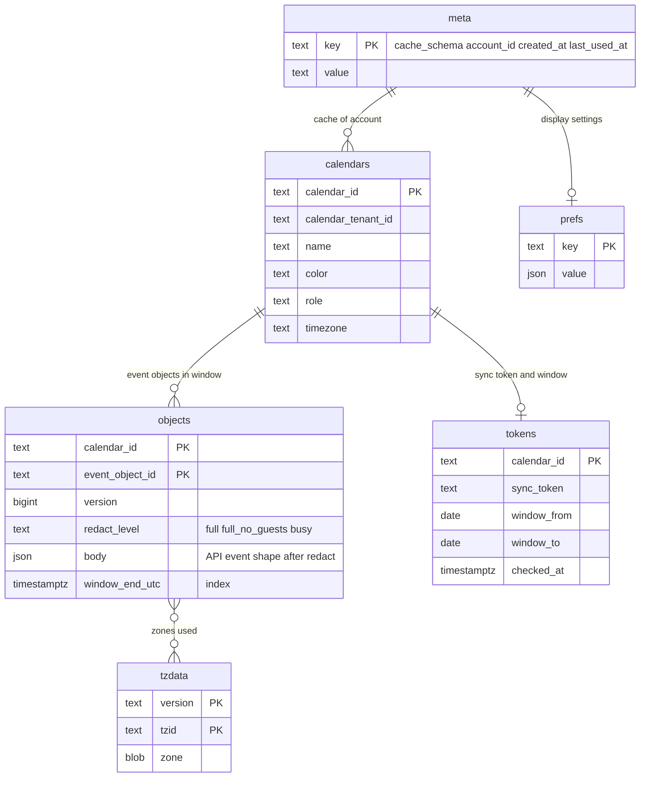

# Data model: DB の外（Valkey・S3・SQS・Webhook・CalDAV・トークン・Web Push・iTIP・IndexedDB）

[data-model.md](../data-model.md) の一部。DB の表の外に置くデータと、外へ出す形をまとめる。正本は Aurora で、ここにあるものは失っても Aurora から作り直せる。例外は、期限つきで正本になる S3 のファイル（iMIP の生のメール、ICS の取り込みのファイル）と、log-archive の監査ログの写し。

- 鍵・接頭辞は、テナントか、カレンダー・利用者の ID か、ハッシュだけを入れる。メールアドレス・URL・予定の中身を鍵に入れない。本家の名前を入れない（[リポジトリ共通の ADR-0006](../../../../../docs/decisions/0006-brand-neutral-identifiers.md)）。
- 名前のうち、領域の文書で決めていなかったものは、この文書で決めた（表の「決めた場所」が「この文書」のもの。[data-model.md](../data-model.md) の D-28）。

## 1. Valkey（ElastiCache）

失ってよい。落ちたときは、キャッシュは DB から読み直し、数えはタスクのメモリーの近似で続ける（各領域の文書）。

| 鍵・チャンネル | 種類 | TTL | 中身 | 書く・読む | 決めた場所 |
| --- | --- | --- | --- | --- | --- |
| `sig:cal:<calendar_id>` | pub/sub | — | `{"c":"<calendar_id>","s":<change_seq>}`（「変わった」の合図だけ。中身を入れない） | Relay → `realtime` | [ADR-0005](../../decisions/0005-change-log-and-sync-tokens.md)（名前はこの文書） |
| `sig:user:<user_id>` | pub/sub | — | `{"t":"calendar_list"\|"notification","s":<seq>}` | Relay・notifier → `realtime` | この文書 |
| `fb:<tenant_id>:<calendar_id>:<iso_week_utc>` | 文字列（バイト列） | 7 日 | `{seq, tzv, intervals}`。`seq` は `change_seq`、`intervals` は週の始まりからの分の差分と種類 | `api`・`booking` | [free-busy-and-scheduling.md](../free-busy-and-scheduling.md) の 5.1 節 |
| `fbr:<tenant_id>:<room_id>:<iso_week_utc>` | 同上 | 7 日 | 会議室。`seq` は `booking_seq` | 同上 | 同上 |
| `bk:slots:<page_id>:<from>:<to>` | 文字列（JSON） | 30 秒 | 枠の一覧と、計算した時の `(check_calendar の change_seq の組, booking_seq)` | `booking` | [booking-pages.md](../booking-pages.md) の 5.3 節（名前はこの文書） |
| `cw:<calendar_id>:<origin>` | トークンバケット | — | 1 カレンダーの書き込みの枠（`user`・`api`・`caldav`・`itip`・`import`・`maintenance`） | `packages/writer` | [ADR-0047](../../decisions/0047-time-shaped-capacity-and-calendar-write-admission.md) |
| `cwlat:<calendar_id>` | 数 | 30 秒 | 直近 10 秒のロックの待ちの p99 | `packages/writer` | 同上 |
| `rl:app_user:<client_id>:<user_id>`、`rl:app_tenant:<client_id>:<tenant_id>`、`rl:user_write:<user_id>`、`rl:tenant:<tenant_id>` | トークンバケット | — | 公開 API のレート制限（1 分 600・10,000・120・30,000） | `api` | [api-and-push.md](../api-and-push.md) の 5 節（名前はこの文書） |
| `rl:ip:<用途>:<ip>` | 数 | 1 分〜1 時間 | 予約ページの枠（1 分 60）、ログインの失敗、ICS の公開（アドレスごとは `rl:ics:<token_hash>`） | `booking`・`auth`・`api` | 各領域（名前はこの文書） |
| `cred:<sha256(token)>` | 文字列（JSON） | 60 秒 | OAuth のトークン・アプリ用のパスワードの照合の結果 `{tenant_id, account_id, user_id, scopes, kind}` | `api`・`caldav` | [ADR-0041](../../decisions/0041-encryption-keys-and-secret-storage.md)（名前はこの文書） |
| `revoked:session:<session_id>`、`revoked:account:<account_id>` | 文字列 | 30 日 | 取り消し・停止の一覧 | `auth` → 全サービス | [accounts-and-orgs.md](../accounts-and-orgs.md) の 5 節（名前はこの文書） |
| `revoked` | pub/sub | — | `{session_id}` か `{account_id}`（`realtime` は 5 秒以内に切る） | `auth` → `realtime` | 同上 |
| `cdf:ap:<app_password_id>`、`cdf:ipacct:<ip_or_/64>:<account_id>`、`cdf:ip:<ip_or_/64>` | 数 | 10 分（超えたら 15 分の止め） | CalDAV の認証の失敗の数 | `caldav` | [sync-and-caldav.md](../sync-and-caldav.md) の 6.7 節（名前はこの文書） |
| `push:cal:<calendar_id>` | 集合 | — | 経路のあるカレンダー（その経路の ID） | `api` が作る、Relay が読む | [api-and-push.md](../api-and-push.md) の 7.3 節 |
| `push:pending:<channel_id>` | 文字列 | 1 時間 | 送りの待ち（1 つの経路に高々 1 つ） | `push-sender` | 同上 |
| `imipq:user:<user_id>`、`imipq:tenant:<tenant_id>`、`imipq:pair:<event_object_id>:<recipient_hash>` | 時刻の窓つきの数 | 24 時間・1 時間 | iMIP の送信の上限の数え | `itip-delivery` | [invitations-and-itip.md](../invitations-and-itip.md) の 11.2 節（名前はこの文書） |
| `nmerge:<user_id>:<event_object_id>` | 文字列（JSON） | 2 分 | 通知のまとめの待ち（変わった項目の群） | notifier | [reminders-and-notifications.md](../reminders-and-notifications.md) の 8 節（名前はこの文書） |
| `pol:<tenant_id>:<calendar_id>:<account_id>` | 文字列 | 60 秒 | 実際のロールと `view_hash` の写し（Webhook の送る前の確かめ） | `push-sender`・`api` | [api-and-push.md](../api-and-push.md) の 7.5 節（名前はこの文書） |

- 秘密・トークンは、平文を鍵にも値にも入れない。
- `fb:*` は、書き込みの側で消さない。読む時に `seq` と `tzv` を今の値と比べる（[ADR-0017](../../decisions/0017-freebusy-source-and-cache.md)）。

## 2. S3

バケットの名前は `<brand>-<用途>-<env>`（リージョンごとのものは末尾に `-<region>`）。すべて非公開、SSE-KMS（[ADR-0041](../../decisions/0041-encryption-keys-and-secret-storage.md) の鍵の表）。テナントの接頭辞は `t/<tenant_id>/`。`tenant-purge` はテナントの接頭辞を消す。

| バケット・接頭辞 | 中身 | 鍵 | 保持 | 決めた場所 |
| --- | --- | --- | --- | --- |
| `<brand>-imip-raw-<region>`：`inbound/<yyyy>/<mm>/<dd>/<ses_message_id>` | iMIP の受信の生のメール（SES が書く。受けた時点ではテナントが分からない） | `s3-imip-raw` | 30 日（L5 の確認待ち）。Object Lock を使わない | [infrastructure.md](../infrastructure.md) の 3.1 節 |
| `<brand>-ingest`：`t/<tenant_id>/ics-imports/<job_id>/source.ics` | ICS の取り込みの元のファイル | `s3-ingest` | 7 日 | [sync-and-caldav.md](../sync-and-caldav.md) の 8.3 節（接頭辞はこの文書） |
| `<brand>-ingest`：`t/<tenant_id>/ics-exports/<job_id>/calendars.zip` | ICS の書き出し（署名つきの URL は 24 時間） | `s3-ingest` | 7 日 | 同上 |
| `<brand>-ingest`：`t/<tenant_id>/ics-subs/<subscription_id>/uid-hashes.json.gz` | 購読の UID → 内容のハッシュ | `s3-ingest` | 購読がある間 | 同 8.1 節 |
| `<brand>-ics-cache`：`fetch/<url_hash>/body` | 購読の取得の本文（同じ URL の購読でまとめる） | `s3-ingest` | 6 時間 | 同 8.1 節 |
| `<brand>-ingest`：`t/<tenant_id>/itip/<msg_id>.json` | 256 KiB を超える iTIP の本文 | `s3-ingest` | 7 日 | [invitations-and-itip.md](../invitations-and-itip.md) の 5.1 節（接頭辞はこの文書） |
| `<brand>-ingest`：`t/<tenant_id>/pending-invites/<id>.ics` | 保留の招待の正規化した本文 | `s3-ingest` | 30 日 | 同 4.3 節（接頭辞はこの文書） |
| `<brand>-assets`：`web/<build_hash>/…`、`tzdata/<version>/<tzid>.bin` | Web の資産、tzdata のゾーンのデータ | `s3-assets` | 資産はバージョンごと 30 日、tzdata は残す | [delivery.md](../delivery.md) の 5・6 節 |
| log-archive のアカウント：`audit/<tenant_id>/<yyyy>/<mm>/<dd>/<hh>.ndjson.gz`、`audit-chain/<tenant_id>/<yyyy-mm-dd>.json`、`platform-audit/<yyyy>/<mm>/<dd>/<hh>.ndjson.gz` | 監査ログの写しと日の終わりの連鎖の値。Object Lock（コンプライアンスモード） | `audit-archive` | 3 年・5 年 | [ADR-0042](../../decisions/0042-audit-log-and-data-lifecycle.md) |

- **添付のファイルは持たない。** 予定の添付は URL だけ（`event_objects.attachments`）。
- 大阪へ複製するのは `<brand>-assets` だけ。生のメールは各リージョンの受信のバケットに残り、複製しない。

## 3. SNS・SQS と outbox のメッセージ

Relay が `outbox` の行を読み、`topic` ごとに送る。メッセージの属性に `tenant_id`、`msg_id`（あれば）、`traceparent` を付ける。どの Worker も、メッセージの重複と順序の入れ替わりを前提にする（冪等は各表の鍵で守る）。

| `topic` | 行き先 | 本文（`payload`） | 消費者 | 冪等の鍵 |
| --- | --- | --- | --- | --- |
| `signal.calendar` | Valkey `sig:cal:*` | `{calendar_id, seq}` | `realtime` | — |
| `itip.message` | SQS `itip-delivery`（200 人を超える予定は `itip-bulk`。受け手 20 人・100 人のバッチ） | 8 節の封筒 | `worker-itip-delivery` | `itip_dedupe` |
| `imip.send` | SQS `imip-outbound` | `{msg_id, event_object_id, recipients[], method}` | `worker-itip-delivery`（iMIP の送信） | `imip_outbound_log` |
| `reminder.replan` | SQS `reminder-replan` | `{tenant_id, user_id?, booking_id?, calendar_id, event_object_id, version}` | `reminder-planner` | `reminder_plan_heads.version` |
| `search.upsert`・`search.delete` | SQS `search-index` | `{tenant_id, event_object_id, version}` | `indexer` | `event_search_docs.object_version` |
| `push.fanout` | SQS `push-fanout`（経路のあるカレンダーだけ） | `{tenant_id, calendar_id, seq, kind}` | `push-sender` | 経路ごとのまとめ |
| `notify.event` | SQS `notify-events` | `{kind, recipient_tenant_id, user_id, event_object_id, recurrence_id?, change_codes[]}` | notifier | `notifications.merge_key` |
| `booking.mail` | SQS `booking-mail` | `{tenant_id, booking_id, kind: code\|confirmed\|changed\|cancelled}` | notifier | 予約の状態 |
| `ics.export`・`ics.import` | SQS `ics-jobs` | `{tenant_id, job_id}` | `worker-ics-apply` | ジョブの状態 |
| `audit.archive` | SQS `audit-archive`（1 時間ごと） | `{tenant_id, hour}` | `auditor` | S3 の鍵 |

Relay を通らないキュー：

| キュー | 送り手 | 本文 | 消費者 |
| --- | --- | --- | --- |
| `notify` | `reminder-scheduler` | `{delivery_id, occurrence_on}`（10 件ずつ） | notifier（[ADR-0029](../../decisions/0029-reminder-clock-buckets-and-timer-wheel.md)） |
| `imip-inbound` | S3 の通知（SNS） | S3 の鍵 | `worker-imip-inbound` |
| `itip-apply` | `worker-imip-inbound` | `{s3_key, received_at, dest_kind, token_hash, verdict, reason_code, normalized_ical_s3_key}` | `worker-itip-apply` |
| `imip-events` | SES の構成セット（SNS） | SES の事象（Send・Delivery・Bounce・Complaint、タグ `msg_id`） | `worker-imip-events` |
| `ics-fetch`・`ics-apply` | 取得の予定のジョブ、`ics-fetcher` | `{tenant_id, subscription_id}`、`{tenant_id, subscription_id, body_s3_key, content_hash}` | `ics-fetcher`、`worker-ics-apply` |

- どのキューも DLQ を持ち、最大の受信の回数は 5（`notify` は 3）。DLQ の深さを監視する。
- 大阪のキューは空で待つ。DR の後は outbox と各表から作り直す（[infrastructure.md](../infrastructure.md) の 4 節）。

## 4. Webhook の通知

本文を持たない `POST`（[api-and-push.md](../api-and-push.md) の 7.2 節、[ADR-0028](../../decisions/0028-push-channels-signed-webhooks.md)）。

```http
POST <address> HTTP/1.1
Content-Length: 0
User-Agent: <Brand>-Push/1
<Brand>-Channel-Id: <client_channel_id>
<Brand>-Channel-Token: <token>
<Brand>-Channel-Expiration: <RFC 7231 の日付>
<Brand>-Resource-Id: <resource_id>
<Brand>-Resource-Uri: https://api.<brand>.<domain>/v1/calendars/<calendar_id>/events
<Brand>-Resource-State: sync | exists | not_exists
<Brand>-Message-Number: <push_deliveries.message_number>
<Brand>-Signature: t=<UNIX 秒>,v1=<hex>
```

| ヘッダー | 列 |
| --- | --- |
| `<Brand>-Channel-Id` | `push_channels.client_channel_id` |
| `<Brand>-Channel-Token` | `push_channels.token`（なければ出さない） |
| `<Brand>-Channel-Expiration` | `push_channels.expires_at` |
| `<Brand>-Resource-Id` | `push_channels.resource_id` |
| `<Brand>-Resource-State` | `push_deliveries.resource_state` |
| `<Brand>-Message-Number` | `push_deliveries.message_number`（再試行で変えない） |
| `<Brand>-Signature` | `v1 = hex(HMAC-SHA256(secret, t "." Channel-Id "." Resource-Id "." Resource-State "." Message-Number))`。秘密は `push_channels.secret_ciphertext` を戻した値。`t` は送るたびに新しい |

## 5. 同期のトークン

[ADR-0005](../../decisions/0005-change-log-and-sync-tokens.md) の `{v, calendar_id, seq, epoch, filter_hash, view_hash}` に HMAC の署名を付けた不透明な文字列（形はこの文書で決めた）。

```text
token   = base64url(payload) "." base64url(mac)
payload = CBOR { "v": 1, "k": <鍵の ID>, "c": <calendar_id 16 バイト>, "s": <seq>, "e": <epoch>,
                 "f": <filter_hash 8 バイト>, "h": <view_hash 16 バイト>, "p": <page_seq?> }
mac     = HMAC-SHA256(鍵 k, payload) の先頭 16 バイト
```

| 項目 | 値の元 | 違ったとき |
| --- | --- | --- |
| `k` | Secrets Manager の鍵の ID（90 日ごとに替え、前の鍵を 30 日残す） | 知らない鍵 → 410 `token_invalid` |
| `c` | `calendars.id` | 別のカレンダー → 400 |
| `s` | 差分の最後の `seq`（`tokensOnly` は今の `change_seq`） | `s < floor_seq` → 410 `floor_seq` |
| `e` | `platform_state.sync_epoch` | 古い → 410 `epoch` |
| `f` | `SHA-256(正規化した条件)` の先頭 8 バイト（`showDeleted`、`eventTypes`） | 違う条件 → 400 |
| `h` | `SHA-256(実際のロール ‖ 効いた方針のバージョン ‖ redact の段)` の先頭 16 バイト | 違う → 410 `view_hash` |
| `p` | ページの途中の `seq`（`nextPageToken`、CalDAV の 507 の続き） | — |

- 公開 API は `syncToken`・`nextSyncToken`、Web の画面は `POST /v1/sync` のトークン、CalDAV は `https://dav.<brand>.<domain>/ns/sync/<token>`。同じ形。
- カレンダーの一覧の同期のトークンは、`c` の代わりに利用者の ID、`s` に `users.calendar_list_seq` を入れる（`v = 2`）。

## 6. CalDAV のリソースと ETag

[sync-and-caldav.md](../sync-and-caldav.md) の 6 節、[ADR-0023](../../decisions/0023-caldav-resource-model-and-conditional-writes.md)。

| 対象 | 形 | 列 |
| --- | --- | --- |
| 主体 | `/dav/principals/<user_id>/` | `users.id` |
| ホーム | `/dav/calendars/<user_id>/` | 利用者の `calendar_list_entries`（`free_busy_reader` のカレンダーは出さない） |
| コレクション | `/dav/calendars/<user_id>/<calendar_id>/` | `calendars.id`（共有されたカレンダーも持ち主と同じ ID） |
| リソースの名前 | クライアントが付けた名前、`<UID>.ics`（UID が `[A-Za-z0-9._@-]` で 200 文字以下）、`<event_object_id>.ics`、`BUSY` の見る人には `<opaque_id>.ics` | `caldav_hrefs.href_name`、`event_objects.uid`・`id` |
| ETag | 強い ETag `"<version>-<f\|g\|b>"`（`f`：`FULL`、`g`：`FULL_NO_GUESTS`、`b`：`BUSY`） | `event_objects.version` と `redact()` の段 |
| CTag（`CS:getctag`） | `"<change_seq>-<記号>"` | `calendars.change_seq` |
| `Schedule-Tag` | `"<organizer_version>"`（参加者の写しだけ） | `event_objects.organizer_version` |
| `getlastmodified` | `updated_at` | `event_objects.updated_at` |
| `sync-token` | `https://dav.<brand>.<domain>/ns/sync/<token>`（5 節） | — |

- 1 つのリソースは 1 つの予定オブジェクト（マスターと上書きの VEVENT、使う TZID の VTIMEZONE）。`PUT` で形を変えたら（TZID の正規化、RDATE への変換、`SEQUENCE`・`DTSTAMP`、`SCHEDULE-STATUS`）、応答に ETag を返さない。

## 7. Web Push の本文

[reminders-and-notifications.md](../reminders-and-notifications.md) の 7.3 節、[ADR-0031](../../decisions/0031-notification-channels-and-content.md)。

```json
{"v":1,"nid":"<notifications.id>"}
```

| 項目 | 値 |
| --- | --- |
| 暗号 | RFC 8291（`aes128gcm`）。鍵は `push_subscriptions.p256dh`・`auth_ciphertext` |
| VAPID | 環境ごとの鍵（`app-secrets` で包む）。`sub` は `mailto:push@<brand>.<domain>` |
| `TTL`・`Urgency` | リマインダー `900`・`high`、招待の通知 `86400`・`normal` |
| `Topic` | `base64url(SHA-256(<event_object_id> ‖ <recurrence_id>))` の先頭 32 文字（同じ回の届く前の通知を置き換える） |

- 予定の中身を入れない。Service Worker が `GET /v1/notifications/{nid}` で取る。

## 8. 内部の iTIP のメッセージ（封筒）

[invitations-and-itip.md](../invitations-and-itip.md) の 5.1 節、[ADR-0014](../../decisions/0014-itip-state-transfer-and-sequence.md)。`outbox.payload`（`topic = itip.message`）と SQS の本文。

```json
{
  "v": 1,
  "msg_id": "<UUIDv7>",
  "method": "REQUEST | CANCEL | REPLY | REFRESH | X-MODIFY",
  "uid": "<UID>",
  "recurrence_id": "",
  "sequence": 3,
  "organizer_version": 18,
  "dtstamp": "2026-10-04T01:02:03Z",
  "organizer": { "tenant_id": "…", "calendar_id": "…", "event_object_id": "…", "email": "…", "sent_by": null },
  "sender": { "tenant_id": "…", "account_id": "…", "sent_by": null },
  "recipients": [ { "tenant_id": "…", "account_id": "…", "kind": "internal | room" } ],
  "base_organizer_version": null,
  "reply": { "attendee_key": "…", "partstat": "accepted", "comment": null, "reply_sequence": 3, "reply_dtstamp": "…" },
  "payload": { "master": { … }, "overrides": [ … ], "exdates": [ … ], "attendees": [ … ] },
  "payload_s3_key": null,
  "committed_at": "2026-10-04T01:02:03.456Z"
}
```

| 項目 | 列・規則 |
| --- | --- |
| `msg_id` | `itip_dedupe`・`itip_deliveries`・`calendar_changes.origin_msg_id`・`imip_outbound_log` |
| `sequence`・`organizer_version` | 新旧の判定 `(sequence, organizer_version)` と参加者の写しの `organizer_sequence`・`organizer_version`（I-11） |
| `recurrence_id` | 内部の `REQUEST`・`CANCEL` は系列の全体（`''`）。回だけの参加者にはその回 |
| `payload` | 受け手に見せてよい形の予定オブジェクトの全体（`can_see_other_guests = false` なら参加者は主催者と受け手だけ）。256 KiB を超えたら `payload_s3_key`（2 節） |
| `reply` | `REPLY` だけ |
| `base_organizer_version` | `X-MODIFY` の基のバージョン（違えば拒否。DT-ITIP-001 の行 13） |
| `recipients` | バッチ（20 人、`itip-bulk` は 100 人）。`committed_at` は SLI の `organizer_committed_at` |

- 外部への iMIP は、同じ封筒から `packages/ical` が `METHOD` つきの VCALENDAR を作る。ORGANIZER は `imip_addresses` の `o-<token>`、`PRODID` は `-//<Brand>//Calendar//JA`、使う TZID ごとに本システムの tzdb の VTIMEZONE を付ける（[ADR-0013](../../decisions/0013-external-timezone-definitions.md)）。

## 9. AppConfig・CloudFront KeyValueStore・データのパッケージ

| 置き場所 | 鍵 | 中身 | 決めた場所 |
| --- | --- | --- | --- |
| AppConfig | `release.<kebab-case>` | 未完成の振る舞いのフラグ（`release.cross-tenant-shared-writes`、`release.admin-event-access`、`release.scim` など） | [delivery.md](../delivery.md) の 3 節 |
| AppConfig | `ops.<snake_case>` | 運用の切り替え（`ops.writes_enabled`、`ops.calendar_write_budget.<origin>`） | 同上、[capacity.md](../capacity.md) の 2.2 節 |
| AppConfig | `tzdata.active_version` | 全サービスが使う tzdb のバージョン | [ADR-0049](../../decisions/0049-tzdata-rollout-and-schema-change-ordering.md) |
| CloudFront KeyValueStore | `web_version_weights` | Web のバージョンごとの割合 | [delivery.md](../delivery.md) の 5 節 |
| `packages/tzdata`・`packages/holidays-jp` | — | [time-zones.md](time-zones.md) の 4 節 | — |
| Terraform | `scaling_schedules` | 業務の時間・月曜の朝・祝日・年度の始めのタスクの下限 | [capacity.md](../capacity.md) の 8 節 |

## 10. Web の手元の DB（IndexedDB）

DB の名前は `cal-<account_id>`（[ADR-0039](../../decisions/0039-offline-read-cache-and-local-data.md)、[clients.md](../clients.md) の 10 節）。捨ててよい写しで、書き込みを持たない。`_meta.cache_schema` が今のコードのバージョンと違えば、移行せずに消して取り直す。



| store | 鍵 | 索引 | 中身 |
| --- | --- | --- | --- |
| `calendars` | `calendar_id` | — | 見えるカレンダーの一覧（色、ロール、タイムゾーン） |
| `objects` | `[calendar_id, event_object_id]` | `by_window_end`（`[calendar_id, window_end_utc]`） | 窓（前後 4 週）に回が触れる予定オブジェクト。API の予定の形（`redact()` の後） |
| `tokens` | `calendar_id` | — | 同期のトークン、窓の範囲、最後に確かめた時刻 |
| `tzdata` | `[version, tzid]` | — | ゾーンのデータ（`/tzdata/<version>/<tzid>.bin`） |
| `prefs` | `key` | — | 表示の設定（`user_preferences` の写し） |
| `_meta` | `key` | — | `cache_schema`、`account_id`、作った時刻、最後に使った時刻 |

- `_meta` は ER 図では `meta`（Mermaid の名前の規則のため）。ACL を失ったカレンダーの `objects` と `tokens` を消す。ログアウト・401 の `wipe`・30 日の不使用で DB を消す。
