# Data model: 変更のログ・CalDAV・ICS

[data-model.md](../data-model.md) の一部。規約は、そちらの 2 節に従う（版と `change_seq` は 2.6 節）。振る舞いは [sync-and-caldav.md](../sync-and-caldav.md)、[api-and-push.md](../api-and-push.md) の 4.6 節、[observability.md](../observability.md) の 5.4 節を正とする。決定は [ADR-0005](../../decisions/0005-change-log-and-sync-tokens.md)、[ADR-0023](../../decisions/0023-caldav-resource-model-and-conditional-writes.md)〜[ADR-0025](../../decisions/0025-ics-subscriptions-both-directions.md)、[ADR-0046](../../decisions/0046-sli-from-ledgers-and-delivery-tracing.md)。同期のトークン、CalDAV の名前と ETag の形は [stores.md](stores.md) の 5・6 節。

| 表 | テナント | 中身 |
| --- | --- | --- |
| `outbox` | 内（X10 の専用のポリシー） | 確定した変更から Relay が流すメッセージ |
| `calendar_changes` | 内 | 変更のログ（30 日） |
| `deleted_event_objects` | 内 | 削除の墓標（30 日） |
| `caldav_hrefs` | 内 | CalDAV のクライアントが付けたリソースの名前 |
| `ics_subscriptions` | 内 | 取り込む ICS の購読 |
| `ics_publish_tokens` | 内 | 公開する ICS の秘密のアドレス |
| `ops.ics_publish_token_directory` | 外 | 秘密のアドレスのハッシュ → テナント（X6） |
| `ops.ics_fetch_schedule` | 外 | 購読の取得の予定（X11） |
| `ics_import_jobs`・`ics_export_jobs` | 内 | ICS の取り込み・書き出しのジョブ |
| `ops.sync_token_uses` | 外 | 差分の同期の使用の集計（SLI） |

## 1. ER 図

```mermaid
erDiagram
    calendars ||--o{ calendar_changes : "seq per calendar"
    calendars ||--o{ deleted_event_objects : "tombstones"
    calendars ||--o{ caldav_hrefs : "client names"
    event_objects ||--o{ calendar_changes : "upsert and delete"
    event_objects ||--o| caldav_hrefs : "one name"
    tenants ||--o{ outbox : "pending messages"
    calendars ||--o| ics_subscriptions : "subscribed calendar"
    calendars ||--o| ics_publish_tokens : "secret address"
    ics_publish_token_directory |o--|| ics_publish_tokens : "resolver copy"
    users ||--o{ ics_import_jobs : "imports"
    ics_fetch_schedule |o--|| ics_subscriptions : "fetch schedule copy"
    users ||--o{ ics_export_jobs : "exports"
    calendars ||--o{ sync_token_uses : "daily usage"

    calendar_changes {
        uuid tenant_id PK
        uuid calendar_id PK
        bigint seq PK
        date committed_on PK
        text kind "upsert delete calendar acl"
        uuid event_object_id
        bigint object_version
        uuid origin_msg_id
        timestamptz committed_at
    }
    deleted_event_objects {
        uuid tenant_id PK
        uuid calendar_id PK
        uuid event_object_id PK
        text uid
        text href_name
        bigint deleted_seq
    }
    caldav_hrefs {
        uuid tenant_id PK
        uuid calendar_id PK
        text href_name PK
        uuid event_object_id UK
    }
    outbox {
        bigint id PK
        uuid tenant_id
        text topic
        jsonb payload
        text payload_s3_key
        text traceparent
    }
    ics_subscriptions {
        uuid tenant_id PK
        uuid id PK
        uuid user_id FK
        uuid calendar_id UK
        bytea url_ciphertext
        bytea url_hash
        text state
        timestamptz next_fetch_at
    }
    ics_publish_tokens {
        uuid tenant_id PK
        uuid calendar_id PK
        bytea token_hash UK
        text view "full free_busy"
        timestamptz revoked_at
    }
    ics_publish_token_directory {
        bytea token_hash PK
        uuid tenant_id
        uuid calendar_id
    }
    ics_fetch_schedule {
        uuid subscription_id PK
        uuid tenant_id
        timestamptz next_fetch_at
        text state
    }
    ics_import_jobs {
        uuid tenant_id PK
        uuid id PK
        uuid calendar_id FK
        text status
    }
    ics_export_jobs {
        uuid tenant_id PK
        uuid id PK
        text status
        text s3_key
    }
    sync_token_uses {
        date day PK
        uuid tenant_id PK
        uuid calendar_id PK
        text client_kind PK
        bigint uses
    }
    calendars {
        uuid tenant_id PK
        uuid id PK
        bigint change_seq
        bigint floor_seq
    }
    event_objects {
        uuid tenant_id PK
        uuid id PK
    }
    tenants {
        uuid id PK
    }
    users {
        uuid tenant_id PK
        uuid id PK
    }
```

- `calendar_changes` は分割の表なので外部キーを張らない。`event_objects ||--o{ calendar_changes` は意味の関係。
- `sync_token_uses` は `ops` の集計の表で、`calendars` への参照は ID の値だけ。

## 2. `outbox`

確定した変更から Relay が SNS・SQS・Valkey へ流すメッセージ（[ADR-0005](../../decisions/0005-change-log-and-sync-tokens.md)）。`calendar_changes` と同じトランザクションで書くので、両者は食い違わない。`topic` と `payload` の形は [stores.md](stores.md) の 3 節。

| 列 | 型 | NULL | 既定 | 説明 |
| --- | --- | --- | --- | --- |
| `id` | `bigint` | NOT NULL | IDENTITY | 全体の順 |
| `tenant_id` | `uuid` | NOT NULL | — | |
| `topic` | `text` | NOT NULL | — | `itip.message`、`reminder.replan`、`search.upsert` など |
| `payload` | `jsonb` | NOT NULL | — | 256 KiB まで。超える iTIP の本文は S3 |
| `payload_s3_key` | `text` | NULL | — | 大きな本文の鍵 |
| `traceparent` | `text` | NULL | — | W3C Trace Context |
| `created_at` | `timestamptz` | NOT NULL | `now()` | |

- キー：PK `id`。
- 索引：PK — Relay が `ORDER BY id` で読む。`(tenant_id, id)` — テナントの削除。
- RLS：テナント。Relay は ADR-0004 の X10 の専用のポリシー（`relay` のロールに `SELECT`・`DELETE` だけを全テナントで許す）で読む（D-15）。他のロールは自分のテナントの行だけ。
- 保持：Relay が送った行を消す。最古の行の年齢を監視する（Relay の遅れ）。S1 の量：平常は数千行以下、ピークで 1 秒 約 1 万行が出入りする。

## 3. `calendar_changes`

変更のログ（[sync-and-caldav.md](../sync-and-caldav.md) の 4.1 節）。Web・公開 API・CalDAV・Webhook の差分の同期の背骨。

| 列 | 型 | NULL | 既定 | 説明 |
| --- | --- | --- | --- | --- |
| `tenant_id`・`calendar_id` | `uuid` | NOT NULL | — | |
| `seq` | `bigint` | NOT NULL | — | カレンダーの `change_seq` から振った番号 |
| `committed_on` | `date` | NOT NULL | — | `committed_at` の UTC の日（分割の鍵。D-21） |
| `kind` | `text` | NOT NULL | — | `upsert`・`delete`・`calendar`（名前・色・タイムゾーン）・`acl`（共有・方針の変更） |
| `event_object_id` | `uuid` | NULL | — | `upsert`・`delete` のとき |
| `object_version` | `bigint` | NULL | — | 変更の後の予定オブジェクトの版 |
| `origin_msg_id` | `uuid` | NULL | — | 参加者の写しへの当て込みのとき、元の iTIP の `msg_id`（[ADR-0046](../../decisions/0046-sli-from-ledgers-and-delivery-tracing.md)） |
| `committed_at` | `timestamptz` | NOT NULL | `now()` | |

- キー：PK `(tenant_id, calendar_id, seq, committed_on)`。`seq` の一意はカレンダーの行のロックで守る（I-4）。
- 索引：PK — 差分：`tenant_id = $1 AND calendar_id = $2 AND seq > $3 ORDER BY seq LIMIT 1001`（30 の分割の索引を順に読む）。
- CHECK：`kind IN ('upsert','delete','calendar','acl')`、`(kind IN ('upsert','delete')) = (event_object_id IS NOT NULL)`。
- 分割：`RANGE (committed_on)`、1 日。30 日を過ぎた分割を落とす前に、そのカレンダーの `floor_seq` を、残る最小の `seq` に上げる（I-5）。保持の期間は L5 の確認待ち。
- 書かない変更：展開の索引の範囲の端の移動、照合の作り直し（予定オブジェクトを変えないため）。
- RLS：テナント。S1 の量：1 日 約 1.6 億行 × 80 B × 30 ≒ 380 GB。

## 4. `deleted_event_objects`

削除の墓標（[sync-and-caldav.md](../sync-and-caldav.md) の 4.1 節）。差分の `cancelled` と、CalDAV の `sync-collection` の 404 に要る識別子を持つ。

| 列 | 型 | NULL | 既定 | 説明 |
| --- | --- | --- | --- | --- |
| `tenant_id`・`calendar_id`・`event_object_id` | `uuid` | NOT NULL | — | |
| `uid` | `text` | NOT NULL | — | |
| `href_name` | `text` | NOT NULL | — | CalDAV のリソースの名前（`BUSY` の見る人の名前は不透明な ID から作り直す） |
| `deleted_seq` | `bigint` | NOT NULL | — | 削除を載せた `seq` |
| `deleted_at` | `timestamptz` | NOT NULL | `now()` | |

- キー：PK `(tenant_id, calendar_id, event_object_id)`。
- 索引：`(tenant_id, calendar_id, deleted_seq)` — 差分の範囲の墓標。`(deleted_at)` — 30 日の削除。
- 書き込み：予定をごみ箱に入れた・消した・写しを `hidden`・`cancelled` にした（CalDAV と API へは削除として見せる）時に書く。戻したら消す（D-13）。
- RLS：テナント。保持：30 日（変更のログと同じ）。S1 の量：約 3,000 万行。

## 5. `caldav_hrefs`

CalDAV のクライアントが `PUT` で付けた名前（[sync-and-caldav.md](../sync-and-caldav.md) の 6.3 節）。サーバーが作る名前（`<UID>.ics`、`<event_object_id>.ics`）は行を持たない。

| 列 | 型 | NULL | 既定 | 説明 |
| --- | --- | --- | --- | --- |
| `tenant_id`・`calendar_id` | `uuid` | NOT NULL | — | |
| `href_name` | `text` | NOT NULL | — | 255 バイトまで |
| `event_object_id` | `uuid` | NOT NULL | — | |
| `created_at` | `timestamptz` | NOT NULL | `now()` | |

- キー：PK `(tenant_id, calendar_id, href_name)`。UK `(tenant_id, event_object_id)`（1 つの予定に名前は 1 つ）。FK `(tenant_id, event_object_id)` → `event_objects ON DELETE CASCADE`。
- CHECK：`octet_length(href_name) <= 255`、`href_name !~ '/'`。
- RLS：テナント。S1 の量：約 3,000 万行（CalDAV のクライアントが作った予定）。

## 6. ICS

### 6.1 `ics_subscriptions`

取り込む ICS の購読（[sync-and-caldav.md](../sync-and-caldav.md) の 8.1 節、[ADR-0025](../../decisions/0025-ics-subscriptions-both-directions.md)）。購読ごとに読み出し専用のカレンダー（`kind = subscription`）を 1 つ持つ。

| 列 | 型 | NULL | 既定 | 説明 |
| --- | --- | --- | --- | --- |
| `tenant_id` | `uuid` | NOT NULL | — | |
| `id` | `uuid` | NOT NULL | `uuidv7()` | |
| `user_id` | `uuid` | NOT NULL | — | |
| `calendar_id` | `uuid` | NOT NULL | — | 写す先のカレンダー |
| `url_ciphertext` | `bytea` | NOT NULL | — | URL（利用者の情報を含みうるので暗号文） |
| `url_hash` | `bytea` | NOT NULL | — | 正規化した URL の SHA-256（同じ URL の取得をまとめる鍵） |
| `url_display` | `text` | NOT NULL | — | 画面の表示（ホスト名と、伏せた経路） |
| `state` | `text` | NOT NULL | `'pending'` | `pending`・`active`・`failing`・`disabled` |
| `etag` | `text` | NULL | — | 相手の HTTP の ETag（条件つきの取得） |
| `last_modified` | `text` | NULL | — | 相手の `Last-Modified` |
| `refresh_interval_s` | `integer` | NOT NULL | `21600` | 既定 6 時間。応答の `REFRESH-INTERVAL` に 1〜24 時間で従う |
| `next_fetch_at` | `timestamptz` | NOT NULL | `now()` | 購読の ID から決まる 0〜30 分の揺らぎを足す |
| `failure_count` | `integer` | NOT NULL | `0` | 続けての失敗（後退の倍数） |
| `failing_since` | `timestamptz` | NULL | — | 30 日で `disabled` |
| `blocked_count` | `smallint` | NOT NULL | `0` | 宛先の検査での拒否（3 回で `disabled`） |
| `last_error_code` | `text` | NULL | — | |
| `last_success_at` | `timestamptz` | NULL | — | |
| `content_hash` | `bytea` | NULL | — | 最後に当てた本文のハッシュ |
| `uid_hashes_s3_key` | `text` | NULL | — | UID → 内容のハッシュの一覧（S3。[stores.md](stores.md) の 2 節） |
| `created_at`・`updated_at` | `timestamptz` | NOT NULL | `now()` | |

- キー：PK `(tenant_id, id)`。UK `(tenant_id, calendar_id)`。FK `(tenant_id, user_id)` → `users`、`(tenant_id, calendar_id)` → `calendars`。
- 索引：取得の予定の索引は `ops.ics_fetch_schedule` に持つ。`(tenant_id, url_hash)` — 同じ URL の購読。`(tenant_id, user_id)` — 1 利用者 50 まで。
- CHECK：`state IN (...)`、`refresh_interval_s BETWEEN 3600 AND 86400`。
- 取得の予定は `ops.ics_fetch_schedule`（6.5 節。ADR-0004 の X11）に写す。`next_fetch_at`・`state` を書くトランザクションで両方に書く。
- RLS：テナント。`ics-fetcher` は DB に書かず、結果を `worker-ics-apply` が書く。保持：利用者が消すまで（カレンダーと予定も消す）。S1 の量：約 24 万行（URL は約 17 万）。

### 6.2 `ics_publish_tokens`

公開する ICS の秘密のアドレス（[sync-and-caldav.md](../sync-and-caldav.md) の 8.2 節）。カレンダーに 1 つ。

| 列 | 型 | NULL | 既定 | 説明 |
| --- | --- | --- | --- | --- |
| `tenant_id`・`calendar_id` | `uuid` | NOT NULL | — | |
| `token_hash` | `bytea` | NOT NULL | — | `token`（160 ビットの base32）の SHA-256 |
| `view` | `text` | NOT NULL | — | `full`・`free_busy` |
| `created_by` | `uuid` | NOT NULL | — | カレンダーの `owner` |
| `created_at` | `timestamptz` | NOT NULL | `now()` | |
| `last_used_at` | `timestamptz` | NULL | — | |
| `use_day` | `date` | NULL | — | |
| `use_count_day` | `integer` | NOT NULL | `0` | 1 日の要求の数（IP は持たない） |
| `revoked_at` | `timestamptz` | NULL | — | 作り直し・方針で無効 |

- キー：PK `(tenant_id, calendar_id)`。UK `token_hash`。FK → `calendars`。
- CHECK：`view IN ('full','free_busy')`。
- RLS：テナント。作り直すと行を置き換え、`ops.ics_publish_token_directory` の古い行を消す（古いアドレスは 404）。作り直しは監査に書く。S1 の量：約 5 万行。

### 6.3 `ops.ics_publish_token_directory`

| 列 | 型 | NULL | 既定 | 説明 |
| --- | --- | --- | --- | --- |
| `token_hash` | `bytea` | NOT NULL | — | |
| `tenant_id`・`calendar_id` | `uuid` | NOT NULL | — | |
| `created_at` | `timestamptz` | NOT NULL | `now()` | |

- キー：PK `token_hash`。
- RLS：なし（`ops`）。読むのは `resolver`（`api` の ICS の公開）。S1 の量：約 5 万行。

### 6.4 `ics_import_jobs`・`ics_export_jobs`

ICS の取り込みと書き出し（[sync-and-caldav.md](../sync-and-caldav.md) の 8.3 節）。`ics_import_jobs` はこの文書で足した（D-14）。

`ics_import_jobs`：

| 列 | 型 | NULL | 既定 | 説明 |
| --- | --- | --- | --- | --- |
| `tenant_id` | `uuid` | NOT NULL | — | |
| `id` | `uuid` | NOT NULL | `uuidv7()` | |
| `user_id`・`calendar_id` | `uuid` | NOT NULL | — | |
| `source_s3_key` | `text` | NOT NULL | — | 上げたファイル（10 MiB、7 日） |
| `status` | `text` | NOT NULL | `'queued'` | `queued`・`running`・`done`・`failed` |
| `counts` | `jsonb` | NOT NULL | `'{}'` | 作った・変えた・飛ばした（理由のコードごと）の件数 |
| `send_invitations` | `boolean` | NOT NULL | `false` | 画面で「招待を送る」を選んだ |
| `created_at` | `timestamptz` | NOT NULL | `now()` | |
| `finished_at` | `timestamptz` | NULL | — | |

`ics_export_jobs`：

| 列 | 型 | NULL | 既定 | 説明 |
| --- | --- | --- | --- | --- |
| `tenant_id` | `uuid` | NOT NULL | — | |
| `id` | `uuid` | NOT NULL | `uuidv7()` | |
| `user_id` | `uuid` | NOT NULL | — | |
| `calendar_ids` | `uuid[]` | NOT NULL | — | |
| `status` | `text` | NOT NULL | `'queued'` | `queued`・`running`・`done`・`failed` |
| `s3_key` | `text` | NULL | — | zip（7 日） |
| `url_expires_at` | `timestamptz` | NULL | — | 署名つきの URL（24 時間） |
| `created_at` | `timestamptz` | NOT NULL | `now()` | |
| `finished_at` | `timestamptz` | NULL | — | |

- キー：どちらも PK `(tenant_id, id)`。
- 索引：`(tenant_id, user_id, created_at)` — 1 利用者の回数の上限（取り込み 1 時間に 10 回、書き出し 1 日に 5 回）。
- CHECK：`status IN (...)`。
- RLS：テナント。書き出しは監査に書く。保持：7 日（ファイルと同じ）。S1 の量：数万行。

### 6.5 `ops.ics_fetch_schedule`

取得の予定（[ADR-0004](../../decisions/0004-tenancy-and-rls.md) の X11、[data-model.md](../data-model.md) の D-30）。`worker-ics-apply` の予定のジョブが全テナントから期限の来た購読を探し、`ics-fetcher` へ依頼する（`ics-fetcher` は DB に触れない）。URL・カレンダー・利用者を持たない。

| 列 | 型 | NULL | 既定 | 説明 |
| --- | --- | --- | --- | --- |
| `subscription_id` | `uuid` | NOT NULL | — | `ics_subscriptions.id` |
| `tenant_id` | `uuid` | NOT NULL | — | |
| `next_fetch_at` | `timestamptz` | NOT NULL | — | `ics_subscriptions.next_fetch_at` と同じ値 |
| `state` | `text` | NOT NULL | — | `pending`・`active`・`failing`（`disabled` は行を消す） |
| `claimed_until` | `timestamptz` | NULL | — | 取得の依頼を出した後、重ねて出さない期限（10 分） |

- キー：PK `subscription_id`。
- 索引：`(next_fetch_at)` — 期限の来た購読（`claimed_until` が過ぎたもの）を 1 分ごとに読み、SQS `ics-fetch` に `{tenant_id, subscription_id}` を入れる（[stores.md](stores.md) の 3 節）。
- CHECK：`state IN ('pending','active','failing')`。
- RLS：なし（`ops`）。読み書きは `ics_scheduler`。`app` は購読を書くトランザクションで行を書く（`worker-ics-apply` が次の時刻を入れる）。
- 保持：購読の削除・`disabled` で消す。S1 の量：約 24 万行。

## 7. `ops.sync_token_uses`

差分の同期の使用の集計（[observability.md](../observability.md) の 5.4 節）。カレンダー × クライアントの種類 × 日に 1 行。要求ごとの記録は持たない。

| 列 | 型 | NULL | 既定 | 説明 |
| --- | --- | --- | --- | --- |
| `day` | `date` | NOT NULL | — | 分割の鍵 |
| `tenant_id`・`calendar_id` | `uuid` | NOT NULL | — | |
| `client_kind` | `text` | NOT NULL | — | `web`・`api:<client_id の帯>`・`caldav:<ios・macos・thunderbird・davx5・other>` |
| `uses` | `bigint` | NOT NULL | `0` | |
| `delta_ok_fast` | `bigint` | NOT NULL | `0` | 変更 1,000 件以下で 1 秒以内（SLI の良いイベント） |
| `delta_slow` | `bigint` | NOT NULL | `0` | |
| `gone_floor_seq`・`gone_view_hash`・`gone_epoch`・`gone_token_invalid` | `integer` | NOT NULL | `0` | 410 の理由ごとの数 |
| `bad_filter` | `integer` | NOT NULL | `0` | 400（条件の違い） |
| `full_resync` | `integer` | NOT NULL | `0` | 全件の取り直し |
| `delta_size_hist`・`latency_hist`・`token_age_hist` | `jsonb` | NOT NULL | `'{}'` | 帯ごとの数 |

- キー：PK `(day, tenant_id, calendar_id, client_kind)`。
- 書き込み：`api`・`caldav` がタスクのメモリーで 1 分ごとにまとめ、`INSERT ... ON CONFLICT DO UPDATE SET uses = uses + EXCLUDED.uses, …`。
- 分割：`RANGE (day)`、1 日、90 日。
- RLS：なし（`ops`）。読むのは `slo_aggregator`。S1 の量：1 日 約 300 万行（使われるカレンダーとクライアントの組）。
