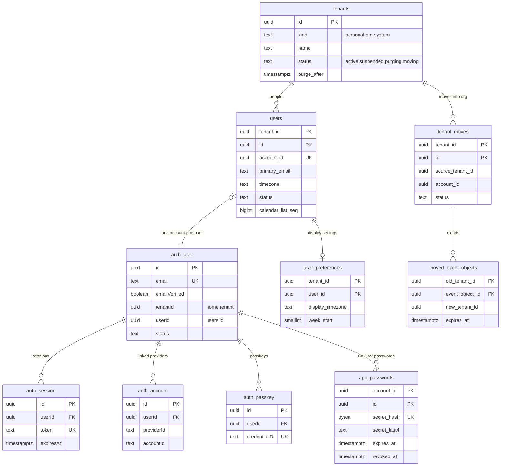
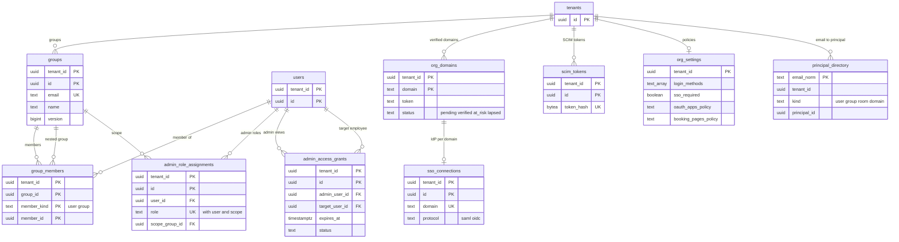

# Data model: テナント・アカウント・組織

[data-model.md](../data-model.md) の一部。規約は、そちらの 2 節に従う。振る舞いは [accounts-and-orgs.md](../accounts-and-orgs.md)、[clients.md](../clients.md) の 6・8 節、[sharing-and-acl.md](../sharing-and-acl.md) の 10 節を正とする。決定は [ADR-0004](../../decisions/0004-tenancy-and-rls.md)、[ADR-0035](../../decisions/0035-accounts-auth-library-and-credentials.md)〜[ADR-0037](../../decisions/0037-admin-roles-delegation-and-event-access.md)、[ADR-0045](../../decisions/0045-stage-up-criteria-tenant-sharding-and-cells.md)。

| 表 | スキーマ | テナント | 1 節の図 |
| --- | --- | --- | --- |
| `tenants` | `ops` | 外 | 1.1 |
| `user`・`session`・`account`・`verification`・`passkey` | `auth` | 外 | 1.1 |
| `app_passwords` | `auth` | 外 | 1.1 |
| `users`、`user_preferences` | 既定 | 内 | 1.1 |
| `groups`、`group_members` | 既定 | 内 | 1.2 |
| `principal_directory` | `ops` | 外 | 1.2 |
| `org_domains`、`sso_connections`、`scim_tokens`、`org_settings` | 既定 | 内（組織だけ） | 1.2 |
| `admin_role_assignments`、`admin_access_grants` | 既定 | 内（組織だけ） | 1.2 |
| `tenant_moves` | 既定 | 内（行き先の組織） | 1.1 |
| `moved_event_objects` | `ops` | 外 | 1.1 |
| `tenant_directory`、`account_directory` | ディレクトリのクラスタ（S2） | 外 | — |

## 1. ER 図

### 1.1 テナント・アカウント・利用者

- `auth_*` は `auth` スキーマの Better Auth の表（`auth.user` など）。列の名前は Better Auth の既定の camelCase。
- `users |o--|| auth_user` は、アカウント 1 つにつきテナントの利用者 1 人（[ADR-0035](../../decisions/0035-accounts-auth-library-and-credentials.md)）。`auth.user.userId` と `users.account_id` で両向きに引く。テナントをまたぐので外部キーは張らない。

### 1.2 組織のディレクトリと管理

- `org_domains ||--o| sso_connections` は、1 つのドメインに IdP を 1 つ（`UNIQUE (tenant_id, domain)`）。
- `tenants ||--o{ principal_directory` は論理の参照（RLS の外から中への外部キーは張らない）。

## 2. テナントとアカウント

### 2.1 `ops.tenants`

テナントの根（[ADR-0004](../../decisions/0004-tenancy-and-rls.md)）。組織 1 つ、個人のアカウント 1 人、システム 1 つ。

| 列 | 型 | NULL | 既定 | 説明 |
| --- | --- | --- | --- | --- |
| `id` | `uuid` | NOT NULL | `uuidv7()` | テナントの ID。テナントの表の `tenant_id` |
| `kind` | `text` | NOT NULL | — | `personal`・`org`・`system`（日本の祝日のカレンダーを持つ 1 つ。D-10） |
| `name` | `text` | NULL | — | 組織の名前（個人は NULL。名前は `auth.user.name`） |
| `region` | `text` | NOT NULL | `'ap-northeast-1'` | S3 でリージョンに固定するときの値 |
| `status` | `text` | NOT NULL | `'active'` | `active`・`suspended`（解約の手続き、30 日の猶予）・`purging`（`tenant-purge` の実行中）・`moving`（S2 のクラスタの移動の間。書き込みを止める） |
| `suspended_at` | `timestamptz` | NULL | — | |
| `purge_after` | `timestamptz` | NULL | — | 猶予の終わり（組織 30 日、個人 7 日） |
| `created_at`・`updated_at` | `timestamptz` | NOT NULL | `now()` | |

- キー：PK `id`。
- 索引：`(status, purge_after) WHERE status = 'suspended'` — `tenant-purge` の対象。`(kind) WHERE kind = 'org'` — 組織を順に回す保守のジョブ。
- CHECK：`kind IN ('personal','org','system')`、`status IN ('active','suspended','purging','moving')`、`(kind = 'org') = (name IS NOT NULL)`。
- RLS：なし（`ops`）。全ロールが読める（中身はテナントの属性だけ）。書くのは `auth`（作成）、`maintenance`（状態）、`tenant_move`。
- 保持：`tenant-purge` の最後に行を消し、プラットフォームの監査に残す。S1 の量：約 30.3 万行。

### 2.2 `auth.user`

ログインの主体（アカウント）。Better Auth の `user` の表に、追加の列を足す（[ADR-0035](../../decisions/0035-accounts-auth-library-and-credentials.md)、D-8）。

| 列 | 型 | NULL | 既定 | 説明 |
| --- | --- | --- | --- | --- |
| `id` | `uuid` | NOT NULL | `generateId`（UUIDv7） | アカウントの ID。`users.account_id`、ACL の `scope_type = user` の値 |
| `email` | `text` | NOT NULL | — | 主のメールアドレス（小文字に正規化） |
| `emailVerified` | `boolean` | NOT NULL | `false` | |
| `name` | `text` | NOT NULL | — | 表示の名前 |
| `image` | `text` | NULL | — | |
| `locale` | `text` | NOT NULL | `'ja'` | 追加の列 |
| `status` | `text` | NOT NULL | `'active'` | 追加の列。`active`・`suspended`・`deleted` |
| `tenantId` | `uuid` | NOT NULL | — | 追加の列。属するテナント（セッションからテナントを決める） |
| `userId` | `uuid` | NOT NULL | — | 追加の列。`users.id` |
| `createdAt`・`updatedAt` | `timestamptz` | NOT NULL | `now()` | |

- キー：PK `id`。UK `email`。
- 索引：`(tenantId)` — テナントの解約で全アカウントを止める。
- RLS：なし（`auth`）。読み書きは `auth` だけ。
- 保持：テナントの削除・個人のアカウントの削除で消す。S1 の量：約 75 万行。

### 2.3 `auth.session`・`auth.account`・`auth.verification`・`auth.passkey`

Better Auth の既定の表。列は部品のバージョンの既定に従い、ここでは本システムの規則だけを書く。

| 表 | 中身 | 本システムの規則 |
| --- | --- | --- |
| `auth.session` | `id`、`userId`、`token`、`expiresAt`、`ipAddress`、`userAgent`、`createdAt`、`updatedAt` | 使わないまま 30 日（組織の `session_max_idle_days`）で切れる。取り消しは行を消し、Valkey の取り消しの一覧に 30 日置く。`token` を平文で持たない設定は持ち越し（[data-model.md](../data-model.md) の 8 節） |
| `auth.account` | 外部の提供者（Google、組織の OIDC）の結び付け：`id`、`userId`、`providerId`、`accountId`、`createdAt` | 提供者のアクセストークン・更新のトークンを保存しない（ログインだけに使う） |
| `auth.verification` | メールのコード・リンク：`id`、`identifier`、`value`、`expiresAt` | 10 分。1 回限り |
| `auth.passkey` | `id`、`userId`、`name`、`publicKey`、`credentialID`、`counter`、`deviceType`、`backedUp`、`transports`、`aaguid`、`createdAt` | 1 アカウント 10 まで |

- RLS：なし（`auth`）。S1 の量：セッション 約 150 万行、パスキー 約 50 万行。

### 2.4 `auth.app_passwords`

CalDAV のアプリ用のパスワード（[accounts-and-orgs.md](../accounts-and-orgs.md) の 9 節）。

| 列 | 型 | NULL | 既定 | 説明 |
| --- | --- | --- | --- | --- |
| `account_id` | `uuid` | NOT NULL | — | → `auth.user.id` |
| `id` | `uuid` | NOT NULL | `uuidv7()` | |
| `name` | `text` | NOT NULL | — | 「iPhone のカレンダー」など。100 文字まで |
| `secret_hash` | `bytea` | NOT NULL | — | `<brand>_ap_…` の SHA-256 |
| `secret_last4` | `text` | NOT NULL | — | 画面の表示用 |
| `scopes` | `text[]` | NOT NULL | `'{caldav}'` | CalDAV だけ |
| `expires_at` | `timestamptz` | NOT NULL | 作成＋1 年 | 最長 1 年 |
| `last_used_at` | `timestamptz` | NULL | — | 1 時間に 1 回だけ書く |
| `last_client_kind` | `text` | NULL | — | `ios`・`macos`・`thunderbird`・`davx5`・`other` |
| `created_at` | `timestamptz` | NOT NULL | `now()` | |
| `revoked_at` | `timestamptz` | NULL | — | 取り消し。取り消した値の失敗は「そのパスワード」の単位で数える（[sync-and-caldav.md](../sync-and-caldav.md) の 6.7 節） |

- キー：PK `(account_id, id)`。UK `secret_hash`。FK `account_id` → `auth.user(id) ON DELETE CASCADE`。
- 索引：PK の `(account_id, …)` — Basic 認証で、メールアドレスから引いたアカウントの有効なパスワードを読む（期限と取り消しはアプリで比べる）。
- CHECK：`cardinality(scopes) = 1 AND scopes = '{caldav}'`、`char_length(name) <= 100`、`expires_at <= created_at + interval '1 year'`。1 アカウント 20 まで（`auth` が数える）。
- RLS：なし（`auth`）。保持：期限・取り消しの 90 日後に消す（L5 の確認待ち）。S1 の量：約 18 万行（[capacity.md](../capacity.md) の 5.2 節）。

### 2.5 `users`

テナントの中の人（[accounts-and-orgs.md](../accounts-and-orgs.md) の 4 節）。

| 列 | 型 | NULL | 既定 | 説明 |
| --- | --- | --- | --- | --- |
| `tenant_id` | `uuid` | NOT NULL | — | |
| `id` | `uuid` | NOT NULL | `uuidv7()` | CalDAV の URL（`/dav/principals/<user_id>/`）にも使う |
| `account_id` | `uuid` | NOT NULL | — | → `auth.user.id`（論理の参照） |
| `display_name` | `text` | NOT NULL | — | 200 文字まで |
| `name_kana` | `text` | NULL | — | 名前の読み（ディレクトリの検索） |
| `primary_email` | `text` | NOT NULL | — | 正規化した小文字 |
| `email_aliases` | `text[]` | NOT NULL | `'{}'` | 別名。`principal_directory` にも入れる |
| `department` | `text` | NULL | — | 部署の表示 |
| `timezone` | `text` | NOT NULL | `'Asia/Tokyo'` | 利用者のタイムゾーン（毎朝の一覧、勤務の時間の既定） |
| `locale` | `text` | NOT NULL | `'ja'` | |
| `status` | `text` | NOT NULL | `'active'` | `active`・`pending`（SCIM で作り、個人のアカウントの移りを待つ）・`suspended`・`deleted` |
| `scim_external_id` | `text` | NULL | — | |
| `calendar_list_seq` | `bigint` | NOT NULL | `0` | カレンダーの一覧の項目の変更の番号（D-12） |
| `suspended_at`・`deleted_at` | `timestamptz` | NULL | — | 削除は 30 日の猶予の後に `lifecycle` が消す |
| `created_at`・`updated_at` | `timestamptz` | NOT NULL | `now()` | |

- キー：PK `(tenant_id, id)`。UK `account_id`（テナントをまたいで一意。I-22）。UK `(tenant_id, primary_email)`。UK `(tenant_id, scim_external_id) WHERE scim_external_id IS NOT NULL`。
- 索引：GIN `(display_name gin_bigm_ops)`・`(name_kana gin_bigm_ops)`・`(primary_email gin_bigm_ops)` — ディレクトリの検索（[accounts-and-orgs.md](../accounts-and-orgs.md) の 11 節）。`(tenant_id, status)` — 組織の利用者の一覧。
- CHECK：`status IN ('active','pending','suspended','deleted')`、`cardinality(email_aliases) <= 30`。
- RLS：テナント。保持：削除の 30 日後に行を消す（予定の引き継ぎの後）。S1 の量：約 75 万行。

### 2.6 `user_preferences`

Web の画面の表示の設定（[clients.md](../clients.md) の 6・8 節）。既定と違う利用者だけが行を持つ。

| 列 | 型 | NULL | 既定 | 説明 |
| --- | --- | --- | --- | --- |
| `tenant_id`・`user_id` | `uuid` | NOT NULL | — | |
| `display_timezone` | `text` | NULL | — | NULL は `users.timezone` |
| `secondary_timezone` | `text` | NULL | — | 2 つ目のタイムゾーン |
| `week_start` | `smallint` | NOT NULL | `0` | 0＝日曜、1＝月曜、6＝土曜 |
| `time_step_minutes` | `smallint` | NOT NULL | `15` | 5・10・15・30・60 |
| `default_view` | `text` | NOT NULL | `'week'` | `day`・`week`・`month`・`agenda` |
| `keyboard_shortcuts` | `jsonb` | NOT NULL | `'{"enabled":true}'` | 有効・無効と割り当ての上書き |
| `show_japanese_era` | `boolean` | NOT NULL | `false` | 和暦の表示 |
| `show_declined` | `boolean` | NOT NULL | `true` | 辞退した予定の表示 |
| `updated_at` | `timestamptz` | NOT NULL | `now()` | |

- キー：PK `(tenant_id, user_id)`。FK `(tenant_id, user_id)` → `users`。
- CHECK：`week_start IN (0,1,6)`、`time_step_minutes IN (5,10,15,30,60)`。
- RLS：テナント。保持：利用者と同じ。S1 の量：約 30 万行。

## 3. ディレクトリ

### 3.1 `groups`

組織のグループ（[accounts-and-orgs.md](../accounts-and-orgs.md) の 11 節、[ADR-0016](../../decisions/0016-group-invitation-expansion.md)）。

| 列 | 型 | NULL | 既定 | 説明 |
| --- | --- | --- | --- | --- |
| `tenant_id` | `uuid` | NOT NULL | — | |
| `id` | `uuid` | NOT NULL | `uuidv7()` | |
| `email` | `text` | NOT NULL | — | グループのメールアドレス（正規化） |
| `name` | `text` | NOT NULL | — | |
| `description` | `text` | NULL | — | |
| `source` | `text` | NOT NULL | `'manual'` | `manual`・`scim` |
| `scim_external_id` | `text` | NULL | — | |
| `version` | `bigint` | NOT NULL | `1` | メンバーの変化ごとに上げる。ACL のグループの展開の写しの鍵（[sharing-and-acl.md](../sharing-and-acl.md) の 4.3 節） |
| `created_at`・`updated_at` | `timestamptz` | NOT NULL | `now()` | |

- キー：PK `(tenant_id, id)`。UK `(tenant_id, email)`。
- CHECK：`source IN ('manual','scim')`。
- RLS：テナント（組織だけ）。S1 の量：約 15 万行。

### 3.2 `group_members`

| 列 | 型 | NULL | 既定 | 説明 |
| --- | --- | --- | --- | --- |
| `tenant_id`・`group_id` | `uuid` | NOT NULL | — | |
| `member_kind` | `text` | NOT NULL | — | `user`・`group`（入れ子） |
| `member_id` | `uuid` | NOT NULL | — | `users.id` か `groups.id` |
| `source` | `text` | NOT NULL | `'manual'` | `manual`・`scim` |
| `created_at` | `timestamptz` | NOT NULL | `now()` | |

- キー：PK `(tenant_id, group_id, member_kind, member_id)`。FK `(tenant_id, group_id)` → `groups ON DELETE CASCADE`。
- 索引：`(tenant_id, member_kind, member_id)` — 利用者が属するグループ（`can()` の入力、入れ子は 10 段まで）。
- CHECK：`member_kind IN ('user','group')`、`NOT (member_kind = 'group' AND member_id = group_id)`。循環は `packages/directory` が書く時に拒む。
- RLS：テナント。保持：メンバーの削除で消す。変化は同じトランザクションで `group_membership_changes` に書く（[scheduling-and-itip.md](scheduling-and-itip.md) の 2.3 節）。S1 の量：約 300 万行。

### 3.3 `ops.principal_directory`

メールアドレスから主体を決める表（[ADR-0004](../../decisions/0004-tenancy-and-rls.md) の「アカウントとメールアドレスの解決はテナントの外に置く」）。

| 列 | 型 | NULL | 既定 | 説明 |
| --- | --- | --- | --- | --- |
| `email_norm` | `text` | NOT NULL | — | 正規化したメールアドレス（小文字。`+` の後ろを落とさない）。`kind = domain` は `@<domain>`（D-9） |
| `tenant_id` | `uuid` | NOT NULL | — | |
| `kind` | `text` | NOT NULL | — | `user`・`group`・`room`・`domain` |
| `principal_id` | `uuid` | NOT NULL | — | `users.id`・`groups.id`・`resources.id`。`domain` は `tenant_id` と同じ |
| `account_id` | `uuid` | NULL | — | `kind = user` のときのアカウント（配送の受け手） |
| `updated_at` | `timestamptz` | NOT NULL | `now()` | |

- キー：PK `email_norm`。
- 索引：`(tenant_id, kind, principal_id)` — 利用者・グループ・会議室・ドメインの削除と変更で行を直す。
- CHECK：`kind IN ('user','group','room','domain')`、`(kind = 'domain') = (email_norm LIKE '@%')`。
- RLS：なし（`ops`）。読むのは `auth`、`resolver`、`itip_delivery`、`freebusy`。書くのは `app`。テナントの書き込みのトランザクションの中で、自分のテナントの行だけを書く（`packages/writer` が確かめる）。
- 保持：主体の削除で消す。S1 の量：約 110 万行（利用者と別名、グループ、会議室、ドメイン）。S2 は `account_directory` に置き換える（7 節）。

## 4. 組織の認証と設定

### 4.1 `org_domains`

[accounts-and-orgs.md](../accounts-and-orgs.md) の 6.2 節、[ADR-0036](../../decisions/0036-org-domains-sso-and-scim.md)。

| 列 | 型 | NULL | 既定 | 説明 |
| --- | --- | --- | --- | --- |
| `tenant_id` | `uuid` | NOT NULL | — | |
| `domain` | `text` | NOT NULL | — | 小文字の頂点のドメイン |
| `token` | `text` | NOT NULL | — | TXT の値 `<brand>-domain-verification=<token>` の `token`（128 ビットの base32。DNS に公開する値で秘密ではない） |
| `status` | `text` | NOT NULL | `'pending'` | `pending`・`verified`・`at_risk`・`lapsed` |
| `added_at` | `timestamptz` | NOT NULL | `now()` | |
| `verified_at` | `timestamptz` | NULL | — | |
| `last_checked_at` | `timestamptz` | NULL | — | |
| `next_check_at` | `timestamptz` | NOT NULL | `now()` | 足した直後は 5 分ごと（14 日まで）、その後は毎日 |
| `missing_since` | `timestamptz` | NULL | — | TXT が見つからなくなった時刻（7 日で `lapsed`） |

- キー：PK `(tenant_id, domain)`。UK `domain WHERE status IN ('verified','at_risk')`（I-23、D-23）。
- 索引：`(next_check_at)` — 確かめのジョブ（組織のテナントを順に回す）。
- CHECK：`status IN ('pending','verified','at_risk','lapsed')`、`domain = lower(domain)`。
- RLS：テナント。`verified` になったら同じトランザクションで `principal_directory` に `@<domain>` を書く。保持：`pending` のまま 14 日で消す。S1 の量：約 5,000 行。

### 4.2 `sso_connections`

[accounts-and-orgs.md](../accounts-and-orgs.md) の 8 節。ドメインごとに IdP を 1 つ。

| 列 | 型 | NULL | 既定 | 説明 |
| --- | --- | --- | --- | --- |
| `tenant_id` | `uuid` | NOT NULL | — | |
| `id` | `uuid` | NOT NULL | `uuidv7()` | ACS の URL の `<org_id>` ではなく、接続の ID |
| `domain` | `text` | NOT NULL | — | 確認したドメイン |
| `protocol` | `text` | NOT NULL | — | `saml`・`oidc` |
| `status` | `text` | NOT NULL | `'draft'` | `draft`・`active`・`disabled` |
| `saml_entity_id`・`saml_sso_url` | `text` | NULL | — | |
| `saml_certs` | `jsonb` | NULL | — | 証明書を 2 つまで（PEM と期限） |
| `email_attribute` | `text` | NULL | — | 属性でメールアドレスを取るとき |
| `oidc_issuer`・`oidc_client_id` | `text` | NULL | — | |
| `oidc_client_secret_ciphertext` | `bytea` | NULL | — | 封筒の暗号化 |
| `jwks_cache` | `jsonb` | NULL | — | JWKS の写し（1 時間ごと） |
| `jwks_fetched_at` | `timestamptz` | NULL | — | |
| `created_at`・`updated_at` | `timestamptz` | NOT NULL | `now()` | |

- キー：PK `(tenant_id, id)`。UK `(tenant_id, domain)`。FK `(tenant_id, domain)` → `org_domains`。
- CHECK：`protocol IN ('saml','oidc')`、`status IN ('draft','active','disabled')`、`(protocol = 'saml') = (saml_entity_id IS NOT NULL)`、`jsonb_array_length(coalesce(saml_certs,'[]')) <= 2`。
- RLS：テナント。`auth` はメールアドレスのドメインから `principal_directory` で組織を決め、そのテナントのコンテキストで読む。保持：組織の削除まで。S1 の量：約 2,000 行。

### 4.3 `scim_tokens`

| 列 | 型 | NULL | 既定 | 説明 |
| --- | --- | --- | --- | --- |
| `tenant_id` | `uuid` | NOT NULL | — | |
| `id` | `uuid` | NOT NULL | `uuidv7()` | |
| `token_hash` | `bytea` | NOT NULL | — | `<brand>_scim_…` の SHA-256 |
| `token_last4` | `text` | NOT NULL | — | |
| `created_by` | `uuid` | NOT NULL | — | `users.id` |
| `created_at` | `timestamptz` | NOT NULL | `now()` | |
| `expires_at` | `timestamptz` | NULL | — | |
| `last_used_at` | `timestamptz` | NULL | — | |
| `revoked_at` | `timestamptz` | NULL | — | |

- キー：PK `(tenant_id, id)`。UK `token_hash`。
- 索引：なし（SCIM の URL の `<org_id>` でテナントを決めてから、`token_hash` で引く）。
- CHECK：有効なトークンは組織に 2 つまで（`packages/directory` がロックの中で数える）。
- RLS：テナント。保持：取り消しの 90 日後に消す。S1 の量：約 1,000 行。

### 4.4 `org_settings`

組織の方針（[accounts-and-orgs.md](../accounts-and-orgs.md) の 10・14 節、[api-and-push.md](../api-and-push.md) の 6.3 節、[booking-pages.md](../booking-pages.md) の 4 節、[invitations-and-itip.md](../invitations-and-itip.md) の 8.1 節、[ADR-0039](../../decisions/0039-offline-read-cache-and-local-data.md)）。既定と違う組織だけが行を持つ（D-17）。

| 列 | 型 | NULL | 既定 | 説明 |
| --- | --- | --- | --- | --- |
| `tenant_id` | `uuid` | NOT NULL | — | |
| `login_methods` | `text[]` | NOT NULL | `'{email_otp,passkey,google}'` | `email_otp`・`passkey`・`google`・`sso` の部分集合 |
| `sso_required` | `boolean` | NOT NULL | `false` | |
| `jit_provisioning` | `boolean` | NOT NULL | `true` | |
| `session_max_idle_days` | `smallint` | NOT NULL | `30` | 1〜30 |
| `app_passwords_allowed` | `boolean` | NOT NULL | `true` | |
| `oauth_apps_policy` | `text` | NOT NULL | `'all'` | `all`・`allowlist`・`none` |
| `oauth_apps_allowlist` | `uuid[]` | NOT NULL | `'{}'` | 許した `client_id` |
| `booking_pages_policy` | `text` | NOT NULL | `'allowed'` | `allowed`・`internal_only`・`disabled` |
| `guest_permissions_default` | `jsonb` | NOT NULL | `'{"can_modify":false,"can_invite_others":true,"can_see_other_guests":true}'` | 参加者の権限の既定 |
| `offline_cache_allowed` | `boolean` | NOT NULL | `true` | 偽なら「この端末に保存しない」を強いる |
| `admin_event_access_approval` | `text` | NULL | — | `none`・`second_admin`（**法務の L8 の確認待ち**） |
| `admin_event_access_notify` | `text` | NULL | — | `none`・`on_grant`・`on_read`（同上） |
| `updated_by` | `uuid` | NOT NULL | — | |
| `updated_at` | `timestamptz` | NOT NULL | `now()` | |

- キー：PK `tenant_id`。
- CHECK：各列挙、`session_max_idle_days BETWEEN 1 AND 30`、`login_methods <@ '{email_otp,passkey,google,sso}'`、`NOT sso_required OR 'sso' = ANY(login_methods)`。
- RLS：テナント（組織だけ）。変更は `tenant_audit_events` に書く。方針を狭めたら資格を 60 秒以内に効かなくする（Valkey の取り消しの一覧）。S1 の量：3,000 行以下。

### 4.5 `admin_role_assignments`

管理の役割と委任の範囲（[accounts-and-orgs.md](../accounts-and-orgs.md) の 13 節、[ADR-0037](../../decisions/0037-admin-roles-delegation-and-event-access.md)）。

| 列 | 型 | NULL | 既定 | 説明 |
| --- | --- | --- | --- | --- |
| `tenant_id` | `uuid` | NOT NULL | — | |
| `id` | `uuid` | NOT NULL | `uuidv7()` | |
| `user_id` | `uuid` | NOT NULL | — | |
| `role` | `text` | NOT NULL | — | `super_admin`・`user_admin`・`calendar_admin`・`resource_admin`・`auditor`・`helpdesk`、能力 `admin_event_access`（D-25） |
| `scope_group_id` | `uuid` | NULL | — | 委任の範囲のグループ。NULL は組織の全体 |
| `granted_by` | `uuid` | NOT NULL | — | |
| `granted_at` | `timestamptz` | NOT NULL | `now()` | |

- キー：PK `(tenant_id, id)`。UK `NULLS NOT DISTINCT (tenant_id, user_id, role, scope_group_id)`。FK `(tenant_id, user_id)` → `users`、`(tenant_id, scope_group_id)` → `groups`。
- 索引：`(tenant_id, role)` — 最後の `super_admin` の確かめ（I-24）、承認の担当の一覧。
- CHECK：`role IN (...)`、`role <> 'super_admin' OR scope_group_id IS NULL`、`role <> 'admin_event_access' OR scope_group_id IS NULL`。
- RLS：テナント。付与と取り消しは監査に書く。S1 の量：約 2 万行。

### 4.6 `admin_access_grants`

管理者による予定の閲覧の許可（[accounts-and-orgs.md](../accounts-and-orgs.md) の 14 節）。**法務の L8 の確認待ち。** `release.admin-event-access` の裏で、本番で有効にしない。

| 列 | 型 | NULL | 既定 | 説明 |
| --- | --- | --- | --- | --- |
| `tenant_id` | `uuid` | NOT NULL | — | |
| `id` | `uuid` | NOT NULL | `uuidv7()` | |
| `admin_user_id` | `uuid` | NOT NULL | — | 閲覧する管理者 |
| `target_user_id` | `uuid` | NOT NULL | — | 対象の従業員 |
| `calendar_ids` | `uuid[]` | NOT NULL | — | 範囲のカレンダー |
| `include_private` | `boolean` | NOT NULL | `false` | |
| `reason` | `text` | NOT NULL | — | 理由（1,000 文字まで） |
| `starts_at`・`expires_at` | `timestamptz` | NOT NULL | — | 最長 24 時間 |
| `status` | `text` | NOT NULL | `'requested'` | `requested`・`active`・`rejected`・`expired`・`revoked` |
| `approver_user_id` | `uuid` | NULL | — | 方針 `second_admin` のとき |
| `approved_at`・`revoked_at` | `timestamptz` | NULL | — | |
| `created_at` | `timestamptz` | NOT NULL | `now()` | |

- キー：PK `(tenant_id, id)`。FK `admin_user_id`・`target_user_id`・`approver_user_id` → `users`。
- 索引：`(tenant_id, admin_user_id, status)` — `redact()` の入力（今有効な許可）。
- CHECK：`expires_at <= starts_at + interval '24 hours'`、`approver_user_id IS DISTINCT FROM admin_user_id`、`cardinality(calendar_ids) BETWEEN 1 AND 50`。
- RLS：テナント。許可と読んだ予定の ID は必ず `tenant_audit_events` に書く。保持：監査と同じ 1 年（L5・L8 の確認待ち）。S1 の量：本番で 0（フラグの裏）。

## 5. 個人から組織への移り

### 5.1 `tenant_moves`

`tenant-move` のジョブの状態（[accounts-and-orgs.md](../accounts-and-orgs.md) の 7 節、[ADR-0004](../../decisions/0004-tenancy-and-rls.md) の X8）。行き先の組織のテナントに置く。

| 列 | 型 | NULL | 既定 | 説明 |
| --- | --- | --- | --- | --- |
| `tenant_id` | `uuid` | NOT NULL | — | 行き先の組織 |
| `id` | `uuid` | NOT NULL | `uuidv7()` | |
| `source_tenant_id` | `uuid` | NOT NULL | — | 元の個人のテナント |
| `account_id` | `uuid` | NOT NULL | — | |
| `status` | `text` | NOT NULL | `'consented'` | `consented`・`running`・`done`・`failed`・`rolled_back` |
| `calendars_total`・`calendars_done` | `integer` | NOT NULL | `0` | カレンダーごとのトランザクションの進み |
| `error_code` | `text` | NULL | — | |
| `consented_at` | `timestamptz` | NOT NULL | `now()` | |
| `started_at`・`finished_at` | `timestamptz` | NULL | — | |

- キー：PK `(tenant_id, id)`。UK `(tenant_id, account_id) WHERE status IN ('consented','running')`。
- CHECK：`status IN (...)`、`source_tenant_id <> tenant_id`。
- RLS：テナント。`tenant_move` のロールが両方のテナントを `SET LOCAL` で切り替えて書く。移したカレンダーは `floor_seq = change_seq + 1` にして古いトークンを 410 にする（D-11）。保持：1 年。S1 の量：数万行。

### 5.2 `ops.moved_event_objects`

移した予定オブジェクトの古い参照（90 日）。他のテナントの参加者の写しから届く `REPLY` を新しいテナントへ回す。

| 列 | 型 | NULL | 既定 | 説明 |
| --- | --- | --- | --- | --- |
| `old_tenant_id` | `uuid` | NOT NULL | — | |
| `event_object_id` | `uuid` | NOT NULL | — | ID は移りで変えない |
| `new_tenant_id` | `uuid` | NOT NULL | — | |
| `moved_at` | `timestamptz` | NOT NULL | `now()` | |
| `expires_at` | `timestamptz` | NOT NULL | `now() + interval '90 days'` | |

- キー：PK `(old_tenant_id, event_object_id)`。
- 索引：`(expires_at)` — 期限の削除。
- RLS：なし（`ops`）。読むのは `itip_delivery`・`resolver`、書くのは `tenant_move`。保持：90 日。S1 の量：数百万行以下。

## 6. 個人のテナントの作り方

アカウントの作成と同じトランザクションで、`ops.tenants`（`personal`）、`auth.user`、`users`、主のカレンダー（[calendars-and-acl.md](calendars-and-acl.md)）、`principal_directory` を書く（[accounts-and-orgs.md](../accounts-and-orgs.md) の 4 節）。`org_settings`・`org_sharing_policies` の行は作らない（個人は方針を持たない）。`auth` のサービスは、新しいテナントの ID で `SET LOCAL app.tenant_id` してからテナントの表を書く（RLS の下で、`auth` のロールに `users`・`calendars`・`calendar_list_entries` の `INSERT` だけを許す）。テナントをまたがないので、ADR-0004 の経路を足さない。

## 7. S2 のディレクトリ

S2 で、テナントをクラスタへ分けた後に、ディレクトリのクラスタに置く（[ADR-0045](../../decisions/0045-stage-up-criteria-tenant-sharding-and-cells.md)、[infrastructure.md](../infrastructure.md) の 11.1 節）。S1 では作らない。ADR-0004 の一覧への追加は S2 の着手の前（[data-model.md](../data-model.md) の 8 節）。

| 表 | 列 | キー | 説明 |
| --- | --- | --- | --- |
| `tenant_directory` | `tenant_id uuid`、`cluster_id text`、`region text`、`status text`（`active`・`moving`・`suspended`）、`updated_at timestamptz` | PK `tenant_id` | テナント → クラスタ。各サービスは 60 秒ごとの写しと、Valkey の変更の知らせで引く |
| `account_directory` | `email_hash bytea`、`account_id uuid`、`tenant_id uuid`、`kind text`、`principal_id uuid`、`updated_at timestamptz` | PK `email_hash` | メールアドレスのハッシュ → アカウント・テナント。`principal_directory` を置き換える |
| `imip_address_directory` | [scheduling-and-itip.md](scheduling-and-itip.md) の 3.2 節と同じ | PK `token_hash` | S1 の `ops` の表を移す |

- S2 の `auth` スキーマもディレクトリのクラスタへ移す。
