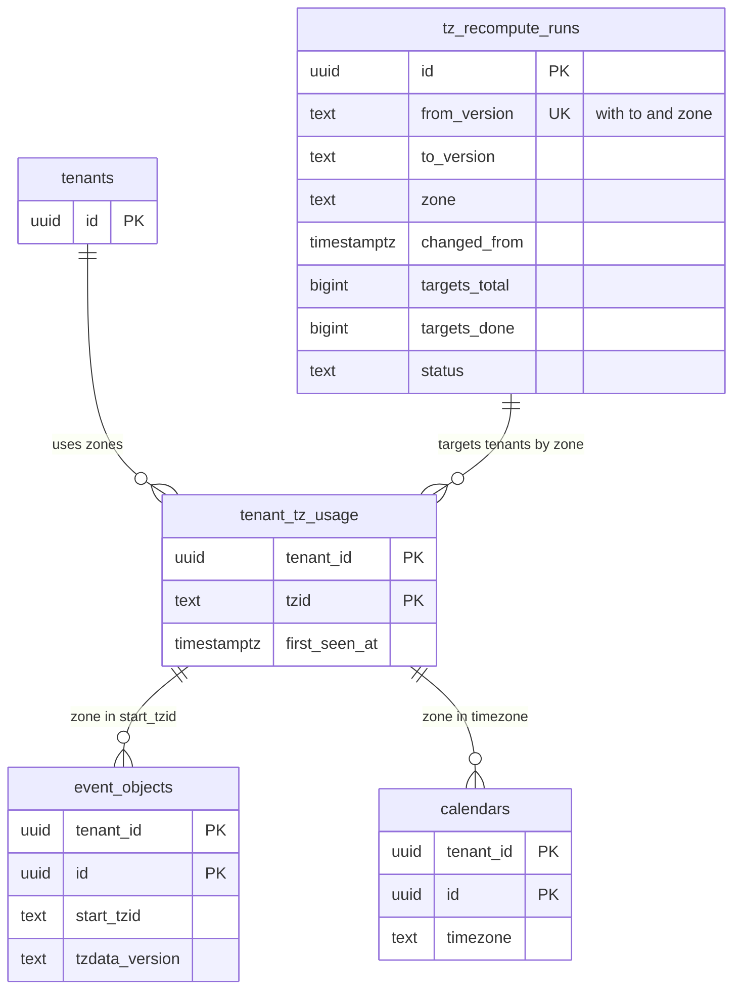

# Data model: タイムゾーン

[data-model.md](../data-model.md) の一部。規約は、そちらの 2 節に従う（時刻の列は 2.4 節）。振る舞いは [time-zones-and-holidays.md](../time-zones-and-holidays.md) と [delivery.md](../delivery.md) の 6 節を正とする。決定は [ADR-0002](../../decisions/0002-time-representation.md)、[ADR-0012](../../decisions/0012-tzdb-update-recompute-and-propagation.md)、[ADR-0013](../../decisions/0013-external-timezone-definitions.md)、[ADR-0049](../../decisions/0049-tzdata-rollout-and-schema-change-ordering.md)。

タイムゾーンの正本は DB ではなく、版を固定したデータのパッケージ（`packages/tzdata`）である。DB は、使っているゾーンの記録と、再計算の進みだけを持つ。どちらも RLS の外（`ops`）で、TZID と数だけを持つ（[ADR-0004](../../decisions/0004-tenancy-and-rls.md) の X7）。

| 置き場所 | 中身 |
| --- | --- |
| `ops.tenant_tz_usage` | テナントが使っている TZID |
| `ops.tz_recompute_runs` | tzdb の版の採用ごと・ゾーンごとの再計算の進み |
| 予定の行の `start_tzid`・`end_tzid`・`tzdata_version`、`calendars.timezone`、`users.timezone`、`buildings.timezone`、`booking_pages.timezone`、`working_hours.timezone` | 各表（TZID は IANA の正規の名前） |
| `packages/tzdata`、`packages/holidays-jp` | 4 節 |
| AppConfig の `tzdata.active_version` | 全サービスが使う版（[stores.md](stores.md) の 9 節） |

## 1. ER 図

- `tenant_tz_usage ||--o{ event_objects` などは、TZID の値で結ぶ意味の関係（外部キーなし）。

## 2. `ops.tenant_tz_usage`

テナントが使ったことのある TZID（[time-zones-and-holidays.md](../time-zones-and-holidays.md) の 7.3 節）。tzdb の更新の影響の見積もりと、再計算の対象のテナントを探すのに使う。

| 列 | 型 | NULL | 既定 | 説明 |
| --- | --- | --- | --- | --- |
| `tenant_id` | `uuid` | NOT NULL | — | |
| `tzid` | `text` | NOT NULL | — | IANA の正規の名前 |
| `first_seen_at` | `timestamptz` | NOT NULL | `now()` | |

- キー：PK `(tenant_id, tzid)`。
- 索引：`(tzid, tenant_id)` — ゾーンからテナントを探す（再計算、差分の報告の見積もり）。
- 書き込み：`packages/writer` が、新しい TZID（予定、カレンダー、利用者、建物、予約ページ、勤務の時間）を書くトランザクションで `INSERT ... ON CONFLICT DO NOTHING`。消さない（使わなくなった TZID が残っても、再計算の対象が増えるだけで誤りにならない）。
- RLS：なし（`ops`）。読むのは `tz_maintenance`、書くのは `app`（追記だけ）。
- 保持：テナントの削除で消す。S1 の量：約 40 万行（個人のテナントは 1〜2 ゾーン）。

## 3. `ops.tz_recompute_runs`

tzdb の版の採用ごとの、ゾーンごとの再計算（[time-zones-and-holidays.md](../time-zones-and-holidays.md) の 6.3 節、[ADR-0012](../../decisions/0012-tzdb-update-recompute-and-propagation.md)）。

| 列 | 型 | NULL | 既定 | 説明 |
| --- | --- | --- | --- | --- |
| `id` | `uuid` | NOT NULL | `uuidv7()` | |
| `from_version`・`to_version` | `text` | NOT NULL | — | `2026a-1` → `2026b-1` |
| `zone` | `text` | NOT NULL | — | 遷移の変わったゾーン |
| `changed_from` | `timestamptz` | NOT NULL | — | 遷移が変わり始める瞬間（施行） |
| `phase` | `text` | NOT NULL | `'rooms'` | `rooms`（会議室の予約の行と予約の区間を先に）・`events`・`done` |
| `targets_total` | `bigint` | NOT NULL | `0` | 対象の予定オブジェクトの数（見積もり） |
| `targets_done` | `bigint` | NOT NULL | `0` | |
| `room_window_started_at`・`room_window_ended_at` | `timestamptz` | NULL | — | 切り替えの窓（`tz_room_window_seconds` の元） |
| `status` | `text` | NOT NULL | `'pending'` | `pending`・`running`・`done`・`failed` |
| `started_at`・`finished_at` | `timestamptz` | NULL | — | |

- キー：PK `id`。UK `(from_version, to_version, zone)`。
- 索引：`(status, changed_from)` — 施行の近い順に進める。
- CHECK：`phase IN ('rooms','events','done')`、`status IN (...)`、`targets_done <= targets_total OR status = 'running'`。
- RLS：なし（`ops`）。読み書きは `tz_maintenance`。テナントごとの書き込みは、`tenants`・`tenant_tz_usage` で探したテナントのコンテキストで `packages/writer` を通す。
- 完了の確認：影響するゾーンの、古い版の `occurrences` の行の数が 0 になったら `done`（I-7）。
- 保持：2 年。S1 の量：1 回の採用で数十行。

## 4. データのパッケージ

### 4.1 `packages/tzdata`

IANA の tzdb を zic で遷移の表にしたもの（[time-zones-and-holidays.md](../time-zones-and-holidays.md) の 4 節）。版ごとに変わらない。

| 部分 | 形 |
| --- | --- |
| 版の名前 | `<IANA の版>-<組み立ての番号>`（`2026b-1`）。`tzdata_version` の列の値 |
| ゾーン | `zones/<tzid>.bin`：遷移の列 `[(utc_instant: int64 秒, utc_offset_s: int32, is_dst: bool, abbrev: string)]`（1900〜2100 年）と、末尾の POSIX の TZ の文字列 |
| 別名 | `links.json`：`backward` のリンク → 正規の名前 |
| Windows の名前 | `windows-zones.json`：CLDR の `windowsZones`（地域 `001`）と CLDR の版 |
| 遷移の指紋 | `fingerprints.bin`：ゾーン × 年ごとの遷移の要約（VTIMEZONE の照合。[ADR-0013](../../decisions/0013-external-timezone-definitions.md) の段 5） |
| 署名と出所 | IANA の `.asc` の検証の結果と、元のファイルのハッシュ |
| 差分の報告 | PR ごとに CI が作る：今日から 10 年の遷移が変わったゾーンと区間、影響する予定オブジェクトの数の見積もり（`tenant_tz_usage` から） |

- Web のクライアントへは、ゾーンごとのファイルを `https://calendar.<brand>.<domain>/tzdata/<version>/<tzid>.bin` で配る（S3。[stores.md](stores.md) の 2 節）。イメージには `active` とその前後の版を入れる（[ADR-0049](../../decisions/0049-tzdata-rollout-and-schema-change-ordering.md)）。

### 4.2 `packages/holidays-jp`

日本の祝日の規則（[time-zones-and-holidays.md](../time-zones-and-holidays.md) の 9 節）。生成の結果は、システムのテナントの公開のカレンダー（`calendars.kind = system`）に、祝日 1 つを `date` の単発の予定オブジェクト 1 つとして書く。

| 部分 | 形 |
| --- | --- |
| 規則の表 | 祝日の名前、種類（固定の日、第 N 月曜、春分・秋分）、適用の期間、根拠（法の条と改正） |
| 春分・秋分の表 | 年 → 日（暦要項。出ていない年は計算の値と印） |
| 例外の表 | 特別の法律による移動・追加（根拠つき） |
| 元号の表 | 元号、始まりの日（和暦の表示） |

- 祝日の予定の UID は `jp-holiday-YYYYMMDD@<brand>.<domain>`、`transparency = transparent`。範囲は 1955 年から今年＋2 年。
