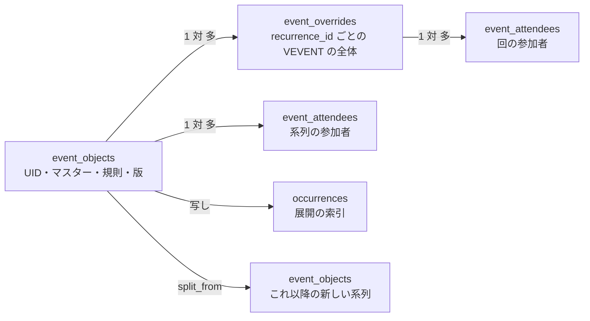
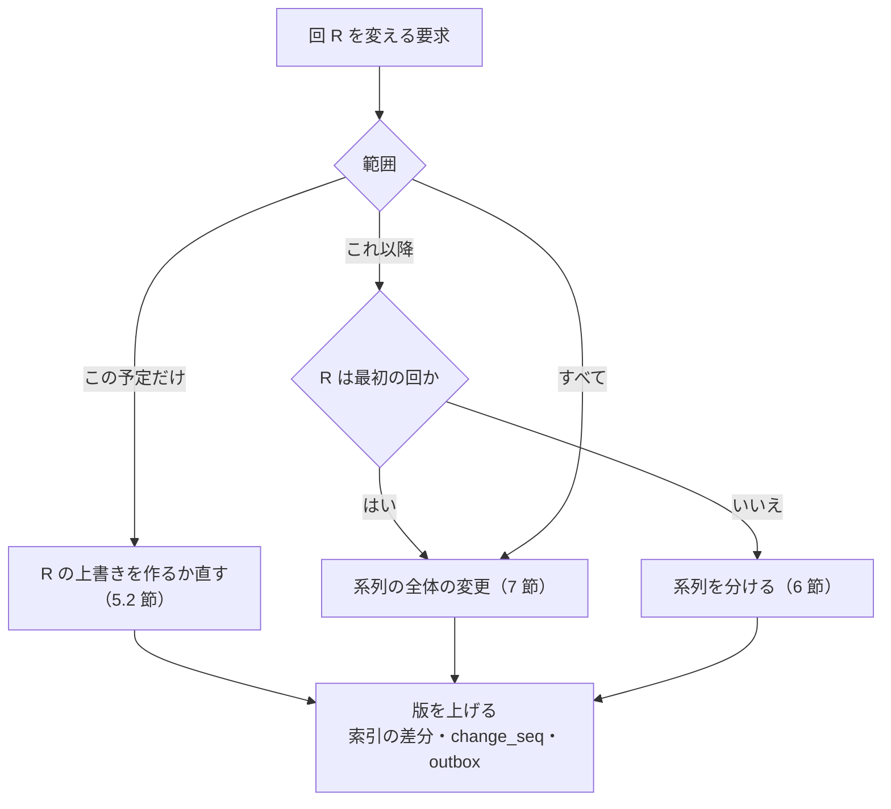
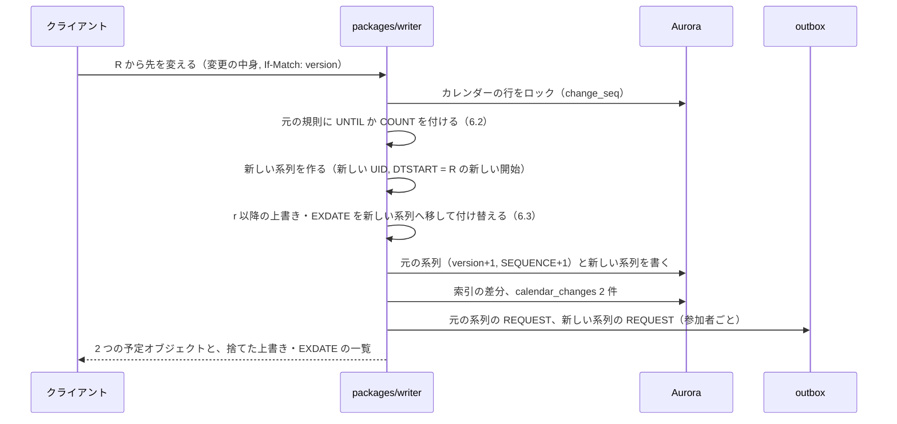
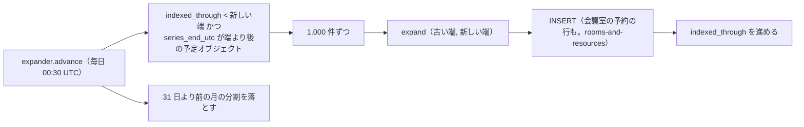

# Events and Recurrence: Google Calendar

予定オブジェクトの形、予定の種類、RRULE・RDATE・EXDATE の受け付けと上限、`expand()` の仕様、1 回分の例外、「これ以降」の分割、系列の全体の変更での例外の扱い、展開の索引の範囲の維持、その場の展開との照合を決める。

前提となる決定は、基盤（[ADR-0001](../decisions/0001-platform-and-stack.md)）、時刻の表し方（[ADR-0002](../decisions/0002-time-representation.md)）、繰り返しの保存と展開（[ADR-0003](../decisions/0003-recurrence-storage-and-expansion.md)）、変更のログ（[ADR-0005](../decisions/0005-change-log-and-sync-tokens.md)）、主催者と参加者の写し（[ADR-0006](../decisions/0006-organizer-and-attendee-copies.md)）、標準の範囲（[ADR-0007](../decisions/0007-interop-standards-scope.md)）。この文書で決めたことは次の ADR にある。

| ADR | 決定 |
| --- | --- |
| [0008](../decisions/0008-recurrence-expansion-semantics.md) | `expand()` は規則を壁時計の時刻で求め、無効な日付（2 月 30 日など）は数えずに捨てる。夏時間の切り替えで存在しない時刻は捨てずに、RFC 5545 の 3.3.5 節の規則でずらして残す（3.3.10 節の「捨てる」とは違う）。DTSTART は規則に合わなくても最初の回とし、`COUNT` に数える。長さは DTEND なら正確な長さ、DURATION なら名目の長さで各回に当てる |
| [0009](../decisions/0009-series-edit-and-override-rebasing.md) | 上書きは VEVENT の全体を持ち、加えて「マスターから切り離した項目」の印（`detached_fields`）を持つ。系列の全体の変更では、切り離していない項目だけを上書きに追従させる。開始の時刻・規則が変わったら、上書きと EXDATE の `recurrence_id` を「同じ日付の回」へ付け替え、行き先のないものは捨てて主催者に示す |
| [0010](../decisions/0010-occurrence-index-maintenance.md) | 展開の索引は、予定オブジェクトごとに `indexed_through` を持ち、`expander` が毎日、範囲の端を進めた分だけ足す。書き込みでは、新旧の回の集合の差分だけを書く。索引の行の `object_version` は「その行が最後に変わった版」とする。照合は毎時の抜き取りで、不一致は索引だけを作り直す |
| [0011](../decisions/0011-inbound-recurrence-normalization.md) | 対応しない繰り返し（`FREQ` が `HOURLY` 以下、`RANGE=THISANDFUTURE`、`RSCALE`）は、経路で扱いを分ける。API・CalDAV の `PUT` は拒否する。ICS の取り込み・購読と iMIP の受信は、`HOURLY` 以下を範囲の中の RDATE に変えて UID を保つ。`RANGE=THISANDFUTURE` は 1 回分の上書きとして当て、利用者に示す |

## 1. 目的と範囲

- 扱う：
  - 予定オブジェクト（`event_objects`）とマスター・上書き（`event_overrides`）の項目、版、`SEQUENCE` の元
  - 予定の種類（通常・不在・作業の時間）と `transparency`・`status`
  - RRULE・RDATE・EXDATE（と EXRULE）の受け付けの検査と上限
  - `packages/recurrence` の `expand()` の仕様（規則の評価、存在しない時刻、無効な日付、長さ、上書きの当て方）
  - 1 回分の変更と取り消し、「これ以降」の分割、系列の全体の変更と上書きの付け替え
  - 展開の索引（`occurrences`）の書き込み、範囲の端の維持、照合
  - 対応しない繰り返しの入力の正規化
- 扱わない：
  - `resolve`・`toLocal`・tzdb の版の更新と再計算（[time-zones-and-holidays.md](time-zones-and-holidays.md)）
  - 参加者・出欠・`SEQUENCE` での写しの更新（[invitations-and-itip.md](invitations-and-itip.md)）
  - 会議室の予約の行（[rooms-and-resources.md](rooms-and-resources.md)）
  - 公開範囲と `redact()`（[sharing-and-acl.md](sharing-and-acl.md)）
  - 変更のログ・同期のトークン・CalDAV のリソースの形・ICS の取り込みの経路（sync-and-caldav.md）
  - 公開 API のリソースの形（api-and-push.md）
  - リマインダーの桶（reminders-and-notifications.md）
  - 画面での「この予定だけ／これ以降／すべて」の選び方（clients.md）

## 2. 本家の形（確かめたこと）

いずれも 2026-10-04 に確認。

| 項目 | 内容 | 出典 |
| --- | --- | --- |
| 繰り返しの行 | `recurrence` に RFC 5545 の RRULE・EXRULE・RDATE・EXDATE の行を持つ。DTSTART・DTEND は含めない。繰り返しの予定では `start.timeZone` が必須 | [Events resource](https://developers.google.com/workspace/calendar/api/v3/reference/events) |
| 回の特定 | `recurringEventId` と `originalStartTime`（規則で決まる元の開始） | 同上、[Recurring events](https://developers.google.com/workspace/calendar/api/guides/recurringevents) |
| 取り消した回 | 繰り返しの回の `status: cancelled` は「この回はもう表示しない」の意味で、親の予定のデータは残る | [Events resource](https://developers.google.com/workspace/calendar/api/v3/reference/events) |
| 予定の種類 | `eventType` は `default`・`outOfOffice`・`focusTime`・`workingLocation`・`birthday`（作成できるもの）と、`fromGmail` | 同上 |
| `transparency` | `opaque`（時間を塞ぐ）・`transparent` | 同上 |
| 系列の変更の勧め | 回を 1 つずつ変えて、系列の全体や「これ以降」を表さないよう勧めている | [Recurring events](https://developers.google.com/workspace/calendar/api/guides/recurringevents) |

- 「これ以降」の内部の表し方、1 系列の回の上限、存在しない時刻の回の扱い、DTSTART が規則に合わないときの扱い、系列の全体の変更で上書きがどうなるかは、公式の資料で確かめられなかった（**未検証**）。本システムの決定は 4〜7 節。
- 作業の場所（`workingLocation`）、誕生日（`birthday`）、メールから作る予定（`fromGmail`）は MVP で持たない（[intent.md](../intent.md)）。

### RFC 5545 の要点

| 節 | 内容 | 本システム |
| --- | --- | --- |
| 3.3.10 | 規則が無効な日付（2 月 30 日）や存在しない現地の時刻を生んだら、その回は捨て、数えない | 無効な日付は捨てる。存在しない時刻は捨てずにずらす（4.4 節。ADR-0008） |
| 3.3.10 | `UNTIL` の値の型は DTSTART と同じ。DTSTART が TZID つきか UTC なら、`UNTIL` は UTC で書く | 受け付けの検査で確かめる（3.4 節） |
| 3.3.10 | `BYSETPOS` は他の BYxxx と一緒にだけ使う | 同上 |
| 3.3.5 | 2 回ある時刻は先の回。存在しない時刻は、切り替えの前のオフセットで解く | `resolve` の規則（[ADR-0002](../decisions/0002-time-representation.md)） |
| 3.8.5.3 | DTSTART は最初の回で、`COUNT` に数える。DTSTART が規則に合わないときの回の集合は未定義 | DTSTART を最初の回とする（4.3 節） |
| 3.8.5.3 | DTEND で長さを書けば、各回に同じ正確な長さ。DURATION で書けば、同じ名目の長さで、正確な長さは各回の開始で変わる | そのとおりにする（4.5 節） |
| 3.8.4.4 | `RECURRENCE-ID` の値の型は DTSTART と同じ。`RANGE=THISANDFUTURE` は、その回と以降の回 | `RANGE` は受けて 1 回分に変える（8 節。ADR-0011） |
| 3.8.5.1・3.8.5.2 | EXDATE・RDATE。回の集合は「DTSTART ∪ RRULE ∪ RDATE」から EXDATE を引いたもの | 同じ |
| 3.8.7.4 | `SEQUENCE` は版の番号 | 上げる規則は [invitations-and-itip.md](invitations-and-itip.md) |

## 3. 予定オブジェクト

### 3.1 形

1 つの UID が 1 つの予定オブジェクトである（[ADR-0003](../decisions/0003-recurrence-storage-and-expansion.md)）。マスター（単発か規則つき）と、`recurrence_id` ごとの上書きを持つ。



主な項目（マスター）：

| 項目 | 意味 | 上限・注記 |
| --- | --- | --- |
| `uid` | iCalendar の UID。カレンダーの中で一意 | 255 バイト。作成は UUIDv7 ＋ `@<brand>.<domain>` |
| `time_kind` | `zoned`・`utc`・`floating`・`date`（[ADR-0002](../decisions/0002-time-representation.md)） | 繰り返しは `zoned`・`floating`・`date`。`utc` の繰り返しは受けるが、新しい作成では TZID を必須にする |
| `start_local`・`start_tzid`・`end_local`・`end_tzid` | 正本 | TZID は tzdb の正規の名前（[time-zones-and-holidays.md](time-zones-and-holidays.md)） |
| `start_date`・`end_date` | 終日の正本（終わりを含まない） | 長さ 1〜366 日 |
| `duration_kind`・`duration_exact_s`・`duration_nominal` | 回の長さ（4.5 節） | 1 回の長さは 0 秒〜366 日 |
| `start_utc`・`end_utc`・`tzdata_version` | 派生（マスターの最初の回） | — |
| `rrule` | 正規化した RRULE の文字列と、解析した JSON | 1 本だけ（3.4 節） |
| `rdates`・`exdates` | `recurrence_id` の形の配列。RDATE は PERIOD（終わりつき）を持てる | 1,000 件・5,000 件 |
| `series_end_utc` | 規則の最後の回の終わり。終わりなしなら NULL | 範囲の外の展開の候補を探す索引に使う |
| `status` | `confirmed`・`tentative`・`cancelled` | `cancelled` は主催者の取り消し。墓標として残す（sync-and-caldav.md） |
| `transparency` | `opaque`・`transparent` | 予定の種類の既定（3.2 節） |
| `event_type` | `default`・`out_of_office`・`focus_time` | 3.2 節 |
| `visibility` | `default`・`public`・`private`・`confidential` | マスターだけに持つ（[sharing-and-acl.md](sharing-and-acl.md)） |
| `title`・`location`・`description`・`color`・`conference_url`・`attachments` | 中身 | タイトル 1,024 文字、説明 64 KiB、添付の URL 25 件 |
| `version` | 予定オブジェクトの版。どの項目が変わっても上がる | ETag の元（[ADR-0005](../decisions/0005-change-log-and-sync-tokens.md)） |
| `sequence`・`dtstamp` | iTIP の版（[invitations-and-itip.md](invitations-and-itip.md)） | — |
| `copy_role` | `organizer`・`attendee`・`standalone`（参加者のいない予定） | [ADR-0006](../decisions/0006-organizer-and-attendee-copies.md) |
| `split_from`・`related_to` | 「これ以降」の元の系列（6 節） | — |
| `x_props` | 知らないプロパティの原文 | 32 KiB（[ADR-0007](../decisions/0007-interop-standards-scope.md)） |
| `recurrence_flags` | 取り込みで正規化した印（`rdate_materialized`、`range_ignored`、`tz_approximated` など） | 8 節 |

上書き（`event_overrides`）は、`recurrence_id` と、その回の VEVENT の全体（上の中身と時刻）、`detached_fields`（7 節）、`status` を持つ。上書きの `status: cancelled` は持たない。取り消した回は EXDATE に移す（5.3 節）。

### 3.2 予定の種類

| 種類 | 既定の `transparency` | 空き時間の種類 | 注記 |
| --- | --- | --- | --- |
| `default` | `opaque` | 予定あり | — |
| `out_of_office` | `opaque` | 予定あり（不在）。RFC 5545 の `FBTYPE=BUSY-UNAVAILABLE` | 招待の自動の辞退は MVP で持たない |
| `focus_time` | `opaque` | 予定あり | 招待の自動の辞退は MVP の後（[intent.md](../intent.md)） |

- iCalendar では `X-<BRAND>-EVENT-TYPE` で往復させる。他のクライアントには通常の予定に見える。
- 不在と作業の時間は参加者を持てない（単独の予定）。参加者を足す要求は 400。

### 3.3 回の識別子

- 回の識別子は `(event_object_id, recurrence_id)`。`recurrence_id` は回の元の開始の壁時計の時刻と TZID（`zoned`）、壁時計の時刻（`floating`）、日付（`date`）で、UTC ではない（[ADR-0003](../decisions/0003-recurrence-storage-and-expansion.md)）。
- 存在しない時刻の回（4.4 節）も、`recurrence_id` は規則の名目の時刻（例：`20270314T023000`）のままにする。ずれは派生の `start_utc` だけに出る。
- 外から来た `RECURRENCE-ID`（UTC、または別の TZID）は、受け付けの時に、マスターの TZID の壁時計の時刻へ直して照合する。照合は、規則の回の UTC の瞬間との一致で行い、一致したら規則の名目の時刻を `recurrence_id` にする（5.4 節）。

### 3.4 規則の受け付けの検査

`packages/recurrence` の `validateRule()` が、書き込みの前に確かめる。違反は 400（API）、`CALDAV:valid-calendar-data` の前提の違反（CalDAV）、取り込みでは 8 節の正規化か拒否。

| # | 検査 | 根拠 |
| --- | --- | --- |
| 1 | `FREQ` は `DAILY`・`WEEKLY`・`MONTHLY`・`YEARLY` | [ADR-0003](../decisions/0003-recurrence-storage-and-expansion.md) |
| 2 | `COUNT` と `UNTIL` を同時に持たない | RFC 5545 の 3.3.10 節 |
| 3 | `UNTIL` の型が DTSTART に合う（日付なら日付、TZID つき・UTC なら UTC。浮動なら浮動） | 同上 |
| 4 | `BYSETPOS` は他の BYxxx と一緒。値は 1〜366 と −366〜−1 | 同上 |
| 5 | `BYWEEKNO` は `YEARLY` だけ | 同上 |
| 6 | `BYYEARDAY` は `DAILY`・`WEEKLY`・`MONTHLY` で使わない | 同上 |
| 7 | `BYMONTHDAY` は `WEEKLY` で使わない | 同上 |
| 8 | 序数つきの `BYDAY`（`2TU`、`-1FR`）は `MONTHLY`・`YEARLY` だけ。`YEARLY` で `BYWEEKNO` があれば序数を持たない | 同上 |
| 9 | `INTERVAL` は 1〜366 | 本システムの上限 |
| 10 | `COUNT` は 1〜5,000 | 本システムの上限 |
| 11 | 規則が、DTSTART から 1,000 周期の中に少なくとも 1 回を生む（`FREQ=YEARLY;BYMONTH=2;BYMONTHDAY=30` のような空の規則を拒む） | 本システムの上限（4.6 節） |
| 12 | RRULE は 1 本だけ。2 本以上は拒否（RFC 5545 は 2 本以上を SHOULD NOT としている） | RFC 5545 の 3.8.5.3 節 |
| 13 | `RSCALE`・`SKIP` を持たない | [ADR-0007](../decisions/0007-interop-standards-scope.md) |
| 14 | 新しい系列の作成（API・画面）では、DTSTART が規則の回に合う。合わなければ 422 `dtstart_not_in_rule` | 4.3 節 |

### 3.5 上限

| 対象 | 上限 | 超えたとき |
| --- | --- | --- |
| 上書き | 1 予定オブジェクト 1,000 件 | 422 `too_many_overrides`。「これ以降」を勧める |
| RDATE | 1,000 件 | 422 |
| EXDATE | 5,000 件 | 422 |
| 展開の索引の範囲の中の回 | 1 規則 5,000 回 | 受け付けで拒否。展開の途中で超えたら打ち切って印を付ける |
| 1 回の `expand()` の候補の生成 | 200,000 候補 | 打ち切って `expansion_budget_exceeded` を返す（照合の警報の対象） |
| 回の長さ | 366 日 | 422 |
| 範囲の外の問い合わせ | 1 回の範囲 366 日 | 400 |
| 「これ以降」の分割の連なり | 1 系列から 200 世代 | 422。系列の作り直しを勧める |

## 4. `expand()` の仕様

```ts
// packages/recurrence
expand(object: EventObject, window: UtcInterval, tz: TzData): Occurrence[]
// Occurrence = { recurrenceId, startLocal, startTzid, startUtc, endUtc,
//                overrideRef?, status, transparency, flags }
```

### 4.1 手順

1. **規則の回を壁時計の時刻で作る。** マスターの `start_local` から、RFC 5545 の 3.3.10 節の表（BYxxx が「広げる」か「絞る」か）に従って、周期ごとに候補を作る。候補は TZID のない壁時計の時刻（`floating` と同じ形）で、`date` は日付である。
2. **周期の中で並べて `BYSETPOS` を当てる。** 1 つの周期（`FREQ` の単位）の候補を時刻の順に並べ、`BYSETPOS` の位置だけを残す。
3. **無効な日付を捨てる。** 存在しない日付（2 月 30 日、4 月 31 日）は捨て、`COUNT` に数えない（RFC 5545 の 3.3.10 節）。
4. **DTSTART より前を捨てる。** DTSTART は、規則に合わなくても最初の回として足す（4.3 節）。
5. **`resolve` で UTC にする。** `zoned` は `resolve(local, tzid, tz)`（[ADR-0002](../decisions/0002-time-representation.md)）。存在しない時刻はずらす（4.4 節）。`floating`・`date` は写しの持ち主のカレンダーのタイムゾーンで解く。
6. **`UNTIL`・`COUNT` を当てる。** `UNTIL` は解いた UTC と比べ、等しい回を含める。`COUNT` は 3 で捨てた後の回を数える。
7. **RDATE を足す。** 規則の回と同じ `recurrence_id` は 1 回にまとめる。
8. **EXDATE を引く。** `recurrence_id` の一致で引く。RDATE と EXDATE が同じなら、引く。
9. **上書きを当てる。** 同じ `recurrence_id` の回を上書きで置き換える。上書きで時刻を動かした回は、動いた後の区間で範囲を判定する（[ADR-0003](../decisions/0003-recurrence-storage-and-expansion.md)）。規則の回にない上書き（孤立した上書き）は 5.4 節。
10. **範囲で切る。** 区間 `[start_utc, end_utc)` が範囲と重なる回を返す。長さ 0 の予定は、開始が範囲の中にあれば返す。範囲の前から続く回を拾うため、規則の評価は `window.start − 回の長さの最大` から始める。
11. **並べる。** `(start_utc, recurrence_id)` の順。

- 周期の計算（月をまたぐ、年の週番号、`WKST`）は、TZID の規則に関係ない壁時計の暦の上で行う。夏時間は 5 の段だけに効く。
- 浮動の時刻と日付は、1〜4 の段で TZID を使わない。

### 4.2 「広げる」と「絞る」の例

RFC 5545 の 3.8.5.3 節の例を、参照との性質ベーステストの固定の例にも入れる。

| 規則 | DTSTART | 回 |
| --- | --- | --- |
| `FREQ=WEEKLY;INTERVAL=2;COUNT=4;BYDAY=TU,SU;WKST=MO` | 1997-08-05（火） | 8/5、8/10、8/19、8/24 |
| 同じで `WKST=SU` | 同じ | 8/5、8/17、8/19、8/31 |

`WKST` は、`INTERVAL` が 2 以上の `WEEKLY` と、`BYWEEKNO` で回を変える。この例は RFC の本文にあるもので、展開器の実装の誤りが最も出やすい所である。

### 4.3 DTSTART と規則が合わないとき

- RFC 5545 の 3.8.5.3 節は、DTSTART を規則に合わせるべき（SHOULD）とし、合わないときの回の集合を未定義にしている。
- 本システムは、**DTSTART を最初の回として必ず含め、`COUNT` に数える**。取り込み（CalDAV・iMIP・ICS）では、この形で受ける。
- 新しい系列の作成（API・画面）では、DTSTART が規則の回でなければ 422 にする。画面は「最初の回を次の火曜にする」を示す。
- 参照の実装がこの場合に別の答えを返したら、RFC の該当の節を書いて許可リストに入れる（[quality.md](../quality.md) の 2.2.1 節 A）。

**例**：DTSTART 2026-10-05（月）10:00 `Asia/Tokyo`、`FREQ=WEEKLY;BYDAY=TU;COUNT=3`。回は 10/5（月）、10/6（火）、10/13（火）の 3 回。10/20 は含まない。

### 4.4 存在しない時刻と 2 回ある時刻

- RFC 5545 の 3.3.10 節は、規則が生んだ存在しない現地の時刻の回を「捨て、数えない」としている。一方、3.3.5 節は、DTSTART などの値としての存在しない時刻を「切り替えの前のオフセットで解く」としている。
- 本システムは **3.3.5 節の解き方を規則の回にも当て、捨てない**（ADR-0008）。理由：
  - 毎週の会議が、夏時間の始まりの週だけ消えると、利用者には欠けた回に見える。ずれた時刻で残せば、利用者は気づいて直せる。
  - [ADR-0002](../decisions/0002-time-representation.md) の `resolve` を、展開・空き時間・リマインダー・画面で 1 つに保てる。
- 参照の実装が回を捨てたら、許可リストに RFC 5545 の 3.3.10 節と 3.3.5 節の違いを理由に書いて入れる。どの参照の実装がどちらに従うかは、`recurrence-reference-survey` で確かめる（**未検証**）。

**例 1（存在しない時刻）**：毎週日曜 02:30 `America/New_York`、DTSTART 2027-03-07。2027-03-14 は 02:00 に 03:00 へ進む。

| `recurrence_id` | 解いた時刻 | `start_utc` |
| --- | --- | --- |
| `20270307T023000` | 02:30 EST（−05:00） | 2027-03-07T07:30Z |
| `20270314T023000` | 03:30 EDT（−04:00）。切り替えの前のオフセット −05:00 で解く | 2027-03-14T07:30Z |
| `20270321T023000` | 02:30 EDT | 2027-03-21T06:30Z |

**例 2（2 回ある時刻）**：毎週日曜 01:30 `America/New_York`。2027-11-07 は 02:00 に 01:00 へ戻る。01:30 は 2 回あり、先の回（EDT、−04:00）にする。`start_utc` は 2027-11-07T05:30Z。

**例 3（夜をまたぐ予定）**：毎日 22:00〜翌 06:00 `America/New_York`、DTEND で書いた（正確な長さ 8 時間）。2027-03-13 の回は 22:00 EST（03:00Z）に始まり、8 時間後の 11:00Z、つまり 03-14 の 07:00 EDT に終わる。壁時計では 9 時間に見える。

### 4.5 長さ

- DTEND で書いた予定は、マスターの `end − start` を正確な秒（`duration_exact_s`）で持ち、各回に同じ秒を足す（RFC 5545 の 3.8.5.3 節）。開始と終了で TZID が違う予定（移動）も、正確な秒で足し、終わりは `end_tzid` で表示する。
- DURATION で書いた予定は、名目の長さ（`P1D` など、日と週を含むもの）を持ち、各回の開始の壁時計の時刻に足してから `resolve` する。時・分・秒は正確な長さである（RFC 5545 の 3.3.6 節）。
- 終日（`date`）は、日の数で持つ。

**例**：`DTSTART;TZID=America/New_York:20270312T100000`、`DURATION:P1D`、毎日。夏時間への切り替えは 03-14 の 02:00。03-13 の回は 03-14 の 10:00 EDT に終わる。正確な長さは 23 時間。同じ予定を DTEND（翌日 10:00）で書いて受けると、最初の回（03-12〜03-13、切り替えをまたがない）の正確な長さ 24 時間が全回に当たり、03-13 の回は 03-14 の 11:00 EDT に終わる。DTSTART を切り替えをまたぐ 03-13 にすると、最初の回の正確な長さが 23 時間になり、2 つの書き方の差は出ない。CalDAV のクライアントから来た形を保ち、書き出しでも同じ形で返す。

### 4.6 計算の量の上限

- 1 回の `expand()` は、候補を 200,000 個まで作る。超えたら、そこまでの回と `expansion_budget_exceeded` を返す。
- 規則の評価で、空の周期（候補が 1 つも残らない周期）が 1,000 回続いたら止める。受け付けの検査 #11 で、そうなる規則を先に拒む。2 月 29 日の毎年の規則は、空の周期が最大 7 回（2096 年から 2104 年など、400 年で割れない 100 の倍数の年をまたぐ）で、上限に当たらない。
- 計算量の目安：範囲（579 日）の毎日の規則で 580 回、週 1 回の規則で 83 回。1 回の展開は 1 ms 未満を目標にし、ベンチマークを CI に置く。

### 4.7 回の例（壊れやすい規則）

| # | 規則と DTSTART | 回（はじめの数回） | 確かめる点 |
| --- | --- | --- | --- |
| 1 | 毎月の最後の平日 `FREQ=MONTHLY;BYDAY=MO,TU,WE,TH,FR;BYSETPOS=-1`、2026-10-30（金）18:00 `Asia/Tokyo` | 2026-10-30（金）、11-30（月）、12-31（木）、2027-01-29（金）、02-26（金）、03-31（水） | `BYSETPOS` は周期（月）の中の候補を並べてから当てる |
| 2 | 毎月 31 日 `FREQ=MONTHLY;BYMONTHDAY=31`、2027-01-31 | 1/31、3/31、5/31、7/31、8/31、10/31、12/31 | 31 日のない月は捨て、`COUNT` に数えない |
| 3 | 毎月の末日 `FREQ=MONTHLY;BYMONTHDAY=-1`、2027-01-31 | 1/31、2/28、3/31、4/30 … | 画面の「毎月の最終日」はこちら |
| 4 | 毎年 2 月 29 日 `FREQ=YEARLY`、2028-02-29 | 2028、2032、2036、2040 … | 閏年だけ。画面は「2 月の末日」（`BYMONTH=2;BYMONTHDAY=-1`）を選べるようにする |
| 5 | 第 2 火曜 `FREQ=MONTHLY;BYDAY=2TU` | 各月の第 2 火曜 | 序数つきの `BYDAY` |
| 6 | `FREQ=MONTHLY;BYMONTHDAY=31;COUNT=3`、2027-01-31 | 1/31、3/31、5/31 | `COUNT` は捨てた後に数える |
| 7 | 毎週日曜 02:30 `America/New_York` | 4.4 節の例 1 | 存在しない時刻 |
| 8 | 毎週火曜、DTSTART が月曜 | 4.3 節の例 | DTSTART は最初の回 |

画面の「毎月 31 日」の選び方は、本家の振る舞いを確かめていない（**未検証**）。本システムの画面は、29〜31 日を選んだときに、「31 日のない月は飛ばす」と「月の末日」の 2 つを示して選ばせる（clients.md）。

## 5. 1 回分の変更と取り消し

### 5.1 3 つの形

繰り返しの変更は 3 つに限る（[ADR-0003](../decisions/0003-recurrence-storage-and-expansion.md)）。



### 5.2 1 回分の変更

1. 対象の `recurrence_id` が、マスターの展開（範囲の外を含む）の回か、既存の上書きかを確かめる。どちらでもなければ 404。
2. 上書きがなければ、その回のマスターの値から VEVENT の全体を作り、変えた項目を `detached_fields` に入れる（7 節）。
3. 上書きがあれば、変えた項目を書き、`detached_fields` に足す。
4. 予定オブジェクトの `version` を上げる。索引は、その回の行だけを差分で直す。

### 5.3 1 回分の取り消し

- 主催者（または単独の予定の持ち主）が回を消したら、`recurrence_id` を EXDATE に足す。上書きがあれば消す（[ADR-0003](../decisions/0003-recurrence-storage-and-expansion.md)）。
- 参加者に送るものは、`CANCEL` に `RECURRENCE-ID` を付けたもの（RFC 5546 の 3.2.5 節。[invitations-and-itip.md](invitations-and-itip.md)）。
- 参加者が自分の写しで回を消したら、EXDATE にせず、その回の出欠を辞退にする（[ADR-0006](../decisions/0006-organizer-and-attendee-copies.md)）。RFC 6638 の 3.2.2.1 節は参加者が EXDATE を足すことを許すが、本システムの中では辞退で表し、CalDAV の `PUT` で参加者が EXDATE を足したら、その回の辞退に変える（sync-and-caldav.md）。

### 5.4 EXDATE と取り消した上書き

外から来る形は 2 つある。本システムは 1 つに揃える。

| 入力 | 意味 | 本システムの保存 | 書き出し |
| --- | --- | --- | --- |
| マスターの `EXDATE` | 回がない | EXDATE | `EXDATE` |
| `STATUS:CANCELLED` の上書き（`RECURRENCE-ID` つき） | その回を取り消した | EXDATE に移し、上書きを持たない | `EXDATE`。参加者へは `CANCEL`＋`RECURRENCE-ID` |
| 本家の API の `status: cancelled` の回 | 同上 | 同上 | — |
| EXDATE の回に、主催者の新しい `REQUEST`（`RECURRENCE-ID` つき、`SEQUENCE` が大きい） | 回を戻した | EXDATE から外し、上書きを作る | 上書き |
| 規則の回にない `RECURRENCE-ID` の上書き（孤立） | クライアントの誤りか、規則の変更の後の残り | 3.3 節の照合で一致しなければ、上書きとして残し `orphan` の印を付ける。展開では単発の回として出す | 上書き（受けた形を保つ） |

- API と画面からは、孤立した上書きを作れない（404）。孤立は取り込みでだけ生まれ、数を監視する。
- 取り消した上書きを EXDATE に揃えるので、回の取り消しの表し方は保存で 1 つになる。参照との性質ベーステストは、`STATUS:CANCELLED` の上書きを含む入力を、EXDATE と同じ回の集合になることで確かめる（PROP-REC-004）。

## 6. 「これ以降」の分割

### 6.1 手順

回 R（`recurrence_id = r`、R は最初の回ではない）から先を変える。1 つの `packages/writer` のトランザクションで行う。



### 6.2 元の系列の終わり

| 元の規則 | 元の系列に付けるもの |
| --- | --- |
| 終わりなし、または `UNTIL` | `UNTIL` = R の直前の回の開始。`zoned` は UTC で、`date` は日付で、`floating` は浮動で書く（3.4 節の #3） |
| `COUNT=n` | `COUNT` = R より前の回の数（無効な日付を除き、DTSTART を含めて数える）。新しい系列の `COUNT` = n − その数（新しい規則で数え直さない。新しい規則に `COUNT` を変える指示があればそれに従う） |

- 「R の直前の回」は、EXDATE で消した回を含めた規則の回で数える。消した回の後で終わってもよい（EXDATE を元の系列に残す）。
- R の直前に回がない（R が最初の回）なら、分けずに系列の全体の変更にする（[ADR-0003](../decisions/0003-recurrence-storage-and-expansion.md)）。

### 6.3 上書きと EXDATE の移し方

1. 元の系列の、`recurrence_id ≥ r` の上書きと EXDATE を、新しい系列へ移す。
2. 新しい系列の規則で、同じ日付（`date` の回の日付、`zoned`・`floating` は壁時計の日付）の回があれば、その回の `recurrence_id` に付け替える。同じ日付の回が 2 つ以上ある規則（1 日に 2 回など）では、日付の中の順番が同じ回にする。
3. 行き先のない上書きと EXDATE は捨て、応答の `dropped_overrides`・`dropped_exdates` で示す。画面は「次の 2 件の変更は、新しい繰り返しに合わないため消えます」と確かめてから送る（clients.md）。
4. 上書きの `detached_fields` に入っていない項目は、新しい系列のマスターの値に追従する（7 節と同じ規則）。

### 6.4 識別と参加者

- 新しい系列の UID は新しく作る。`RELATED-TO;RELTYPE=SIBLING` で元の UID を指し、本システムの中では `split_from` で結ぶ（[ADR-0003](../decisions/0003-recurrence-storage-and-expansion.md)）。
- 参加者の出欠は、新しい系列へ引き継ぐ。ただし、開始・終了・規則が変わったら、[invitations-and-itip.md](invitations-and-itip.md) の規則で `needs_action` に戻す。
- リマインダー・色・`transparency` など参加者の項目は、参加者の写しの側で元の系列から引き継ぐ。

### 6.5 例

毎週火曜 10:00 `Asia/Tokyo`、DTSTART 2026-10-06、`COUNT=10`。回は 10/6、13、20、27、11/3、10、17、24、12/1、8。上書きが 11/17（水曜 10:00 へ移動）、EXDATE が 12/1。

11/3 から「これ以降」を 11:00 に変える：

| 系列 | 規則 | 回 |
| --- | --- | --- |
| 元（UID A） | `COUNT=4` | 10/6、13、20、27 |
| 新（UID B、`split_from` = A） | DTSTART 2026-11-03T11:00、`COUNT=6` | 11/3、10、17、24、12/1、8 の 11:00 |

- 11/17 の上書きは B へ移し、`recurrence_id` を `20261117T110000` に付け替える。時刻を動かしていた（`detached_fields` に開始がある）ので、水曜 10:00 のまま残る。
- EXDATE の 12/1 は B へ移し、`20261201T110000` にする。B の回は 5 回が出る。
- 同じ変更で規則を「毎週木曜」にも変えたら、11/17（火）の上書きと 12/1（火）の EXDATE は、同じ日付の回がないので捨て、`dropped_*` で示す。

## 7. 系列の全体の変更と上書きの付け替え

### 7.1 追従の規則

[ADR-0003](../decisions/0003-recurrence-storage-and-expansion.md) は「上書きの中の、マスターと同じ値だった項目を追従させるか」をこの領域に残した。本システムは、**上書きが切り離した項目だけを残し、ほかはマスターに追従させる**（ADR-0009）。

- 上書きは、項目ごとに「切り離した」の印（`detached_fields`）を持つ。印を付けるのは、その回だけを変えたとき（5.2 節）。
- 系列の全体の変更で項目 F が変わったら、F の印のない上書きは、F を新しい値にする。F の印のある上書きは、そのまま残す。
- 印は項目の群で持つ：`time`（開始・終了・TZID）、`title`、`location`、`description`、`conference`、`attachments`、`color`、`transparency`、`attendees`、`reminders`（参加者の写し）。
- iCalendar から取り込んだ上書きは、取り込みの時にマスターと違う項目の群に印を付ける。

### 7.2 開始の時刻・規則の変更での付け替え

系列の全体の変更で、DTSTART・RRULE・TZID のどれかが変わると、規則の回の `recurrence_id` が変わる。上書きと EXDATE を付け替える。

| # | 元の `recurrence_id` の回 | 新しい規則に同じ日付の回があるか | 上書きの `time` の印 | → 結果 |
| --- | --- | --- | --- | --- |
| 1 | 上書き | ある | なし | 新しい回へ付け替え、時刻は新しい回の時刻 |
| 2 | 上書き | ある | あり | 新しい回へ付け替え、上書きの時刻はそのまま |
| 3 | 上書き | ない | なし | 捨てる。`dropped_overrides` で示す |
| 4 | 上書き | ない | あり | 捨てる。`dropped_overrides` で示す（動かした先の時刻を単発の予定として残すかは、画面で主催者に聞く） |
| 5 | EXDATE | ある | — | 新しい回の `recurrence_id` へ付け替える |
| 6 | EXDATE | ない | — | 捨てる（消す回がない） |
| 7 | 過去の回（今より前に終わった）の上書き | — | — | 付け替えはするが、中身の追従はしない（過去の記録を変えない） |

- 「同じ日付」の決め方は 6.3 節の 2 と同じ。
- この表は決定表 DT-REC-002 として spec に移し、表駆動テストで全行を確かめる。

**例**：毎週月曜 10:00、上書き 2 件（11/9 は場所だけ変更、11/16 は 14:00 へ移動）。系列の全体を 9:30 に変える。11/9 の上書きは `20261109T093000` へ付け替え、時刻は 9:30（行 1）。11/16 の上書きは `20261116T093000` へ付け替え、14:00 のまま（行 2）。

### 7.3 参加者への影響

系列の全体の変更は、主催者の写しを変え、参加者に系列の全体の `REQUEST` を 1 通送る。付け替えた上書きと EXDATE を含む全体を運ぶ（[invitations-and-itip.md](invitations-and-itip.md)）。

## 8. 対応しない繰り返しの入力

ADR-0011。経路ごとに扱いを分ける。

| 入力 | API・画面 | CalDAV の `PUT` | ICS の取り込み・購読 | iMIP の受信 |
| --- | --- | --- | --- | --- |
| `FREQ=HOURLY`・`MINUTELY`・`SECONDLY` | 400 | `CALDAV:valid-calendar-data` で拒否 | 範囲の中の回を RDATE に変える（1,000 件まで）。`rdate_materialized` の印 | 同左。UID を保つので、返事は同じ予定に当たる |
| EXRULE | 400 | EXDATE に展開して受ける | EXDATE に展開 | EXDATE に展開 |
| RRULE が 2 本 | 400 | 拒否 | 1 本目を規則にし、2 本目の範囲の中の回を RDATE に | 同左 |
| `RANGE=THISANDFUTURE` の上書き | — | `CALDAV:valid-calendar-object-resource` の前提の違反で拒否（RFC 4791 の 5.3.2.1 節） | 1 回分の上書きとして当て、`range_ignored` の印。利用者に示す | 同左。主催者が外部なので、利用者に「主催者の変更の一部が反映されていない可能性」を示す |
| `RSCALE` | 400 | 拒否 | 拒否し、件数を示す | 招待を受けず、「対応しない繰り返し」と示す |
| 空の規則（3.4 節の #11） | 422 | 拒否 | DTSTART だけの単発にする | 同左 |

- RDATE に変えた予定は、書き出しで RDATE として出す。元の RRULE の原文は `x_props` の `X-<BRAND>-ORIGINAL-RRULE` に残す（往復で情報を失ったことを示すため）。
- 範囲の端が進むと、RDATE に変えた予定は回が足りなくなる。ICS の購読は次の取得で作り直す。iMIP の招待は作り直さず、画面に「この予定は {日付} より先の回を表示できません」と示す。
- `range_ignored` と `rdate_materialized` の件数を監視する。多ければ `RANGE` の対応（MVP の後。[roadmap.md](../roadmap.md) の延期の一覧）を前倒しする。

## 9. 展開の索引

### 9.1 行

[ADR-0003](../decisions/0003-recurrence-storage-and-expansion.md) の行に、この領域で次を足す。

| 列 | 意味 |
| --- | --- |
| `object_version` | その行が最後に変わった予定オブジェクトの版（ADR-0010） |
| `is_override` | 上書きの回か |
| `event_type` | 空き時間の種類のため |
| `attendee_partstat` | 参加者の写しでの自分の出欠（空き時間の判定のため。[free-busy-and-scheduling.md](free-busy-and-scheduling.md)） |
| `flags` | 存在しない時刻でずらした、`orphan` など |

主キーは `(tenant_id, calendar_id, start_utc, event_object_id, recurrence_id)`。月で分割する。`(tenant_id, event_object_id)` に索引を持つ。`(tenant_id, event_object_id, recurrence_id)` の一意は、分割の鍵を含まないので DB で強制せず、カレンダーのロックの中の差分の書き込みと 9.5 節の照合で守る（[data-model.md](data-model.md) の D-3）。`copy_state` が `active` でない写しと、取り消した予定は行を持たない（同 D-4）。

### 9.2 書き込み

ADR-0010。

1. `packages/writer` は、変更の前と後の予定オブジェクトで、範囲（`[today − 31 日, indexed_through]`）の中の回の集合を `expand()` で求める。
2. `recurrence_id` で突き合わせ、`(start_utc, end_utc, status, transparency, event_type, attendee_partstat)` が変わった行だけを `DELETE`・`INSERT`・`UPDATE` する。
3. タイトルだけの変更は、索引の行を書かない。
4. 変わった行の `object_version` を新しい版にする。

書き込みの量の見積もり（S1）：書き込み 1,500 件/秒のうち、繰り返しの系列の時刻の変更を 5% と見て、1 件あたり平均 100 行で 7,500 行/秒。単発と中身だけの変更は 0〜2 行。E2 の前の `occurrence-index-poc` で測る。

### 9.3 範囲の端の維持



- 範囲は UTC の日で数え、端に 1 日の余裕を持たせる（`[today − 31 日, today + 548 日 + 1 日]`）。
- 1 日に足す行は、索引の行の 1/579 ほど（S1 で約 70 万行）。1 時間以内に終える。
- 範囲の端の移動は予定オブジェクトを変えないので、変更のログに載せない（[ADR-0005](../decisions/0005-change-log-and-sync-tokens.md)）。
- 会議室の予約の行は、同じジョブが同じ回について足す。重なりの扱いは [rooms-and-resources.md](rooms-and-resources.md)。
- ジョブが止まっても、`indexed_through` が古い予定オブジェクトは、読み出しで範囲の外として扱われ、その場で展開される。正しさは保たれ、遅くなるだけである。

### 9.4 範囲の外の読み出し

- 範囲の外（過去 31 日より前、未来 548 日より先）の問い合わせは、候補の予定オブジェクトを `(calendar_id, series_end_utc)` と単発の `(calendar_id, start_utc)` で探し、その場で `expand()` する。
- 1 回の範囲は 366 日まで（3.5 節）。

### 9.5 照合

- 毎時、予定オブジェクトを 10,000 件抜き取り（最近 24 時間に書いたものと、繰り返しのものを重く）、その場の `expand()` と索引の行を比べる（[quality.md](../quality.md) の 4.2 節）。
- 不一致は警報を出し、その予定オブジェクトの索引の行だけを作り直す。予定オブジェクトは変えないので、変更のログに載せない。
- 不一致の理由のコード（`missing_row`・`extra_row`・`time_mismatch`・`stale_tzdata`）を記録する。中身は記録しない。

## 10. 障害のときの振る舞い

| 事象 | 起きること | 備え |
| --- | --- | --- |
| `expand()` の誤り（新しい版で回が増える・欠ける） | 画面・空き時間・会議室・リマインダーで回が違う | 参照との性質ベーステスト（PR・夜間）。本番の照合で検知し、前のイメージへロールバックする。展開の規則はフラグにしない（[runbooks/README.md](../runbooks/README.md) の 3 節、[delivery.md](delivery.md) の 3 節）。戻した後、`expander` が前の版の `expand()` で、新しい版で書いた期間の索引を作り直す |
| `expander.advance` が止まった | 範囲の端の先の回が索引にない | その場の展開で読み出しは正しい。会議室の予約の行が足りず、範囲の端で二重予約の判定ができない → 会議室の新しい予約を、`indexed_through` の手前までに制限する（rooms-and-resources.md）。止まった日数を監視する |
| 大きな系列の書き込みでロックが長い | 同じカレンダーの書き込みが待つ | 1 予定オブジェクトの索引の差分は最大 5,000 行。1 トランザクションの上限を超えるものはない |
| 計算の量の上限に当たった | 回が途中まで | 応答に印を付け、照合の警報の対象にする |
| 孤立した上書きが増える | 規則の変更の後に残った回が見える | 件数を監視する。画面で主催者に整理を促す |

## 11. セキュリティ

- 外から来る規則は、受け付けの検査と計算の量の上限（3.4・4.6 節）を先に通す。展開の爆発（巨大な `COUNT`、大量の RDATE、空の規則）でサービスを止めさせない。
- `x_props` は原文で残すが、32 KiB を超えたら捨て、件数を示す（[ADR-0007](../decisions/0007-interop-standards-scope.md)）。
- 予定の中身（タイトル・場所・説明）は、ログ・メトリクス・照合の記録に書かない。ID と数と理由のコードだけ。

## 12. テスト

決定表（spec から読み込む）：

- **DT-REC-001（受け付けの検査）**：3.4 節の 14 行。
- **DT-REC-002（付け替え）**：7.2 節の 7 行。
- **DT-REC-003（対応しない入力）**：8 節の表の経路 × 入力。

性質ベーステスト（[quality.md](../quality.md) の 2.2.1 節 A。PR 2,000 試行、夜間 200,000 試行）：

- **PROP-REC-001（参照との一致）**：任意の規則・RDATE・EXDATE・TZID・範囲で、`expand` の `(recurrence_id, start_utc, end_utc)` の集合が参照の実装と一致する。許可リストの理由は「3.3.10 と 3.3.5 の違い（存在しない時刻）」「DTSTART が規則に合わない」に限って始める。
- **PROP-REC-002（索引との一致）**：任意の予定オブジェクトと書き込みの列（1 回分の変更、取り消し、全体の変更、「これ以降」、範囲の端の移動）の後、索引の行の集合がその場の `expand` と一致する。
- **PROP-REC-003（「これ以降」）**：任意の系列と回 R で、分割の前後で R より前の回は変わらず、R 以降の回は新しい系列の展開と一致する。`dropped_*` に出たもの以外の上書きと EXDATE が残る。
- **PROP-REC-004（取り消しの形）**：`STATUS:CANCELLED` の上書きを含む入力と、同じ回を EXDATE に入れた入力が、同じ回の集合になる。
- **PROP-REC-005（窓の分割）**：任意の範囲 W を W1・W2 に分けたとき、`expand(W)` は `expand(W1) ∪ expand(W2)` に等しい（境をまたぐ回は 1 回）。
- **PROP-REC-006（付け替え）**：任意の系列の全体の変更で、切り離した項目を持つ上書きは、行き先があれば切り離した項目の値を保つ。切り離していない項目はマスターの新しい値に等しい。
- **PROP-REC-007（往復）**：任意の予定オブジェクトを iCalendar に書き出して読み戻すと、同じ予定オブジェクトになる（`detached_fields` を含む。[ADR-0007](../decisions/0007-interop-standards-scope.md)）。
- **PROP-REC-008（計算の量）**：任意の受け付けた規則で、`expand` は候補の上限の中で終わる。

例示テスト：4.7 節の表、4.4・4.5 節の例、6.5 節の例、RFC 5545 の 3.8.5.3 節の例（固定の回帰の集まり）。

ベンチマーク：毎日の規則の 579 日の展開を 1 ms 未満、`occurrence-index-poc` の書き込みの量。

## 13. Story の候補

| Epic | Story | 中身 |
| --- | --- | --- |
| E2 | `event-object-model` | 3 節の項目、予定の種類、`detached_fields` |
| E2 | `recurrence-validate` | 3.4・3.5 節の検査と上限（DT-REC-001） |
| E2 | `recurrence-expand` | 4 節の `expand()`（ADR-0008） |
| E2 | `recurrence-reference-prop-tests` | PROP-REC-001・005・008、許可リストの形 |
| E2 | `occurrence-index` | 9 節の行、差分の書き込み、範囲の端、照合（ADR-0010。PROP-REC-002） |
| E2 | `single-instance-exceptions` | 5 節（PROP-REC-004） |
| E2 | `this-and-following-split` | 6 節（PROP-REC-003） |
| E2 | `series-edit-rebasing` | 7 節（ADR-0009。DT-REC-002、PROP-REC-006） |
| E2 | `inbound-recurrence-normalization` | 8 節（ADR-0011。DT-REC-003）。sync-and-caldav・invitations-and-itip と共同 |
| E2 | `events-rest-basic` | 予定の作成・取得・変更・削除・範囲の一覧（api-and-push と共同） |

## 14. 未解決の問い

### 決定

2026-10-04 の既定案。E2 の PoC と参照の調査で覆りうる。

- **存在しない時刻**：捨てずにずらす（ADR-0008）。
- **DTSTART が規則に合わない**：最初の回として含める。新しい作成では拒否（ADR-0008）。
- **全体の変更での上書き**：切り離した項目だけを残す（ADR-0009）。
- **付け替えの基準**：同じ日付の回（ADR-0009）。
- **索引の書き込み**：差分だけ。`object_version` は行が変わった版（ADR-0010）。
- **対応しない繰り返し**：経路で分ける。取り込みは RDATE に変える（ADR-0011）。
- **不在と作業の時間**：参加者を持たない。自動の辞退は持たない。
- **「毎月 31 日」**：画面で 2 つの意味を選ばせる。

### 持ち越し

| 問い | いつ・どう決めるか |
| --- | --- |
| 展開の索引の行の数と書き込みの量 | E2 の前の `occurrence-index-poc` |
| 参照の実装と、存在しない時刻・DTSTART の扱いの違い | E2 の前の `recurrence-reference-survey`。参照ごとの振る舞いは**未検証** |
| `RANGE=THISANDFUTURE` を受け付けるか | `range_ignored` の件数を見て、MVP の後に決める |
| 孤立した上書きを整理する画面 | E7 の試用の声 |
| 本家の「これ以降」の表し方、回の上限、存在しない時刻の扱い | 公式の資料で確かめられなかった（**未検証**のまま） |

## 15. quality.md・runbooks・data-model への項目

### quality.md

- DT-REC-001〜003 の表駆動テストと PROP-REC-001〜008 を E2 のリリースの基準にする。
- 許可リストの最初の理由を 2 つ（4.3・4.4 節）に限り、それ以外の追加は QA の承認を要する。
- 本番：展開の索引の照合の不一致 0 件（理由のコードごとに数える）、`expansion_budget_exceeded` 0 件、`orphan` と `range_ignored` と `rdate_materialized` の件数の推移。

### runbooks

- `occurrence-index-mismatch.md`：照合の不一致の調べ方（理由のコード、`object_version`、`tzdata_version`）、1 予定オブジェクト・1 カレンダーの索引の作り直し、前のイメージへのロールバックの判断（[runbooks/README.md](../runbooks/README.md) の 4 節に載せた。予定）。
- `expander-advance-stalled.md`：範囲の端のジョブが止まったときの確かめ方と、手で 1 日分を進める方法（同じく予定）。

統合の工程（2026-10-04）で、上の項目を [quality.md](../quality.md) と [runbooks/README.md](../runbooks/README.md) に反映した。

### data-model（索引への追加の提案）

| 表 | 中身 | 節 |
| --- | --- | --- |
| `event_objects` | 3.1 節の項目。主キー `(tenant_id, id)`、一意 `(tenant_id, calendar_id, uid)`、索引 `(tenant_id, calendar_id, series_end_utc)`・`(tenant_id, indexed_through)` | 3.1 |
| `event_objects` に足す列 | `duration_kind`・`duration_exact_s`・`duration_nominal`、`series_end_utc`、`indexed_through`、`recurrence_flags`、`split_from` | 3.1、4.5、9.3 |
| `event_overrides` | `(tenant_id, event_object_id, recurrence_id)` を主キーに、VEVENT の全体、`detached_fields`（ビット列）、`orphan` | 3.1、7.1 |
| `occurrences` | [ADR-0003](../decisions/0003-recurrence-storage-and-expansion.md) の行に、`is_override`・`event_type`・`attendee_partstat`・`flags`。月の分割 | 9.1 |
| `recurrence/reference-divergences.json`（開発リポジトリ） | 参照との食い違いの許可リスト | 12 |

## 出典

いずれも 2026-10-04 に確認。

- Google for Developers, [Events resource](https://developers.google.com/workspace/calendar/api/v3/reference/events)、[Recurring events](https://developers.google.com/workspace/calendar/api/guides/recurringevents)
- IETF, [RFC 5545](https://www.rfc-editor.org/rfc/rfc5545)（3.3.5、3.3.6、3.3.10、3.8.4.4、3.8.5.1〜3.8.5.3、3.8.7.4 節）、[RFC 5546](https://www.rfc-editor.org/rfc/rfc5546)（3.2.5 節）、[RFC 6638](https://www.rfc-editor.org/rfc/rfc6638)（3.2.2.1 節）
